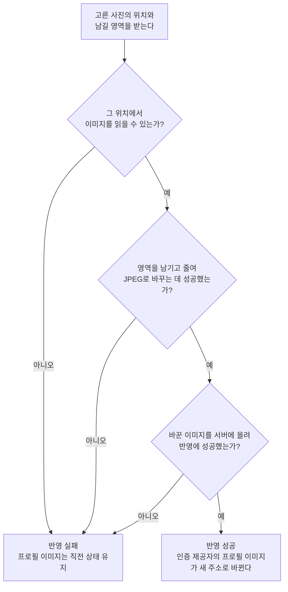

# 프로필 이미지 변경 스펙

이 문서는 사용자가 고른 사진에서 정한 영역을 앱이 프로필 이미지로 바꿔 서버에 올리고, 반영된 결과를 계정에서 읽는 규칙을 다룬다. 사진을 고르고 남길 영역을 정해 반영을 실행하고 결과를 알리는 화면은 [ProfileImageEdit 화면 스펙](./profile-image-edit.md)에서, 그 화면으로 진입하는 프로필 선택은 [MoreHome 화면 스펙](./more-home.md)에서, 반영된 프로필 이미지를 계정 상태로 읽는 규칙은 [계정 조회 스펙](./account.md)에서 다룬다.

앱이 올리는 이미지와 서버가 돌려주는 결과의 약속은 [프로필 이미지 변경 스펙(common)](../common/profile-image.md)이, 서버가 이미지를 보관해 계정에 반영하는 처리와 로그인할 때 프로필 이미지를 지키는 규칙은 [프로필 이미지 변경 스펙(server)](../server/profile-image.md)이 소유한다.

## domain

### 반영할 수 있는 이미지

사용자는 기기가 사진으로 제공하는 이미지를 형식에 관계없이 고를 수 있다.

고른 사진은 사용자가 정한 정사각형 영역만 남기고 반영하기 전에 JPEG 한 형식으로 바꾼다. 프로필 이미지를 보여 주는 수단이 기기와 브라우저마다 다르고, 모든 수단이 함께 표시할 수 있는 형식이 JPEG이기 때문이다.

앱이 읽지 못하거나 JPEG로 바꾸지 못하는 사진은 반영에 실패한다. 어떤 형식을 읽을 수 있는지는 기기가 정하므로 같은 사진도 기기에 따라 결과가 다를 수 있다.

바꾼 이미지 하나의 크기는 5MB 이하여야 한다. 앱은 크기를 미리 거르지 않고 올리며, `이미지 변환`에 따라 줄인 뒤에도 이 크기를 넘는 이미지는 서버가 받지 않으므로 반영은 실패한다. 크기 약속은 [프로필 이미지 변경 스펙(common)](../common/profile-image.md)의 `올리는 이미지`를 따른다.

### 이미지 변환

JPEG로 바꿀 때 사진의 내용은 다음 범위에서만 달라진다.

- 촬영 방향을 반영한 사진에서 사용자가 정한 영역만 남긴다. 영역의 규칙은 [ProfileImageEdit 화면 스펙](./profile-image-edit.md)의 `domain > 남길 영역`을 따른다. 남긴 이미지는 정사각형이다.
- 남긴 이미지의 한 변이 최대 변 길이를 넘으면 최대 변 길이로 줄인다. 넘지 않으면 해상도를 그대로 두며 늘리지 않는다.
- 여러 장면이 이어지는 이미지는 첫 장면만 남는다.
- 투명한 부분은 불투명한 색으로 채워진다. 채우는 색은 기기가 정하므로 기기에 따라 다를 수 있다.

최대 변 길이는 1024px이다. 프로필 이미지는 작은 크기로 표시되므로 그 이상의 해상도는 표시 품질에 기여하지 않고, 크기 제한에 걸려 반영에 실패하는 사진을 줄인다.

JPEG 화질은 `90`으로 고정한다.

줄이는 것은 최대 변 길이까지만 한다. 그 뒤에도 바꾼 이미지가 받을 수 있는 크기를 넘으면 화질을 더 낮추는 대신 반영에 실패한다.

### 반영 실패 시 상태

반영이 어느 단계에서 실패하든 계정의 프로필 이미지는 직전 상태를 그대로 유지한다. 서버에서 실패한 경우의 처리는 [프로필 이미지 변경 스펙(server)](../server/profile-image.md)의 `반영 순서`를 따른다.

로그인할 때 계정의 프로필 이미지가 정해지는 규칙은 [프로필 이미지 변경 스펙(server)](../server/profile-image.md)의 `로그인 시 프로필 이미지`를 따른다.

반영에 실패했음을 사용자에게 알리는 규칙은 [ProfileImageEdit 화면 스펙](./profile-image-edit.md)의 `feature > 반영 실행`을 따른다.

## data

### 반영 흐름

프로필 이미지 반영은 고른 사진의 위치와 남길 영역을 받아 다음 순서로 진행한다.

바꾼 이미지는 올리는 동안에만 기기에 임시로 두고, 반영의 성공이나 실패와 관계없이 올린 뒤 지운다.

서버가 받은 이미지를 보관해 계정에 반영하는 순서와, 반영하지 못한 이미지를 남기지 않는 규칙은 [프로필 이미지 변경 스펙(server)](../server/profile-image.md)의 `반영 순서`를 따른다.

### 반영 결과의 전달

프로필 이미지를 반영하면 인증 제공자가 알리는 사용자 정보의 프로필 이미지도 함께 새 주소로 바뀐다. 이 약속은 [프로필 이미지 변경 스펙(common)](../common/profile-image.md)의 `반영 결과`를 따른다. 앱은 서버가 돌려준 새 주소를 직접 쓰지 않고, 인증 제공자의 사용자 정보에서 읽는다.

저장된 사용자 정보는 인증 제공자의 사용자 정보를 따르므로, 앱이 인증 제공자의 사용자 정보를 다시 확인하는 시점에 계정의 프로필 이미지가 새 주소로 바뀐다. 저장된 사용자 정보와 계정 상태의 관계는 [계정 조회 스펙](./account.md)의 `data > 저장된 사용자 정보의 출처`를 따른다.

반영 자체는 사용자 정보를 다시 확인하지 않는다. 반영에 성공한 뒤 돌아가는 MoreHome 화면이 표시될 때 다시 확인하므로 사용자는 돌아온 화면에서 바뀐 프로필 이미지를 본다. 그 계기와 조건은 [MoreHome 화면 스펙](./more-home.md)의 `feature > 사용자 정보 다시 확인`이 소유한다.
