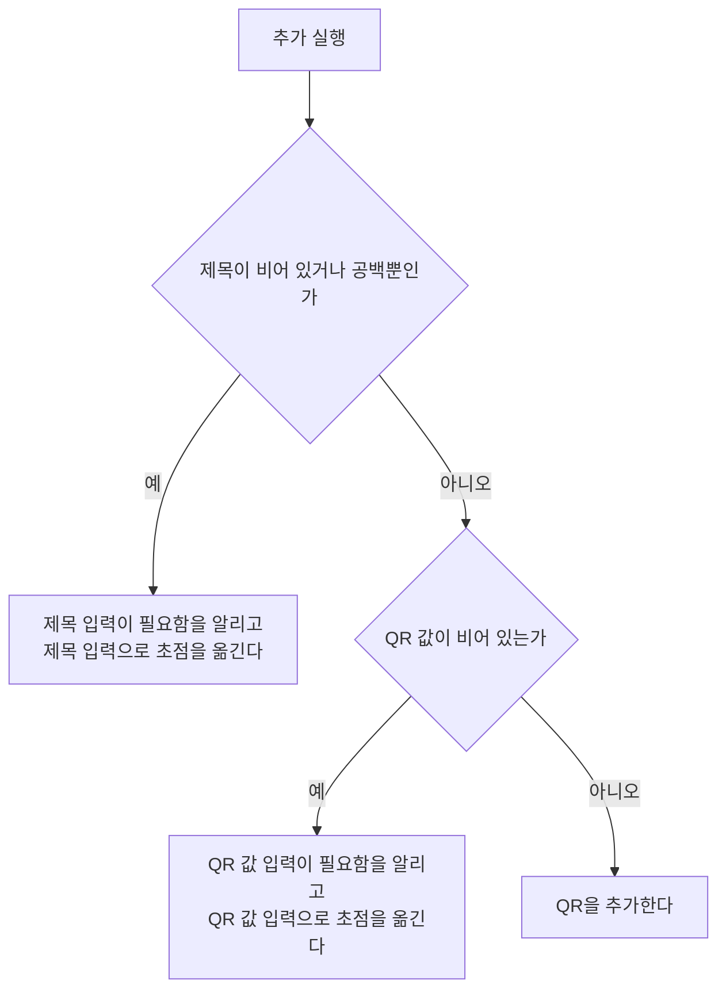

# QrAdd 화면 스펙

이 문서는 [QrHome 화면](./qr-home.md)의 QR 추가로 진입해, 사용자가 제목과 설명을 적고 입력하거나 카메라로 스캔한 값을 QR로 그려 확인한 뒤 QR을 추가하는 QrAdd 화면의 내용과 행동, 그리고 추가되는 QR이 갖는 정보와 정책을 다룬다. 추가한 QR의 목록 표시와 목록에서의 삭제는 [QrHome 화면 스펙](./qr-home.md)에서, 카메라로 QR을 읽는 화면은 [QrScan 화면 스펙](./qr-scan.md)에서 다룬다. 제목 입력 자체의 동작은 [제목 입력 스펙](./title-input.md)을, 설명 입력 자체의 동작은 [설명 입력 컴포넌트 스펙](./description-input.md)을 따른다.

작성 상태 유지, 뒤로가기, 추가 요청 제한, 계정 연결과 저장·동기화 계약은 [항목 추가 화면 공통 스펙](./entity-add.md)을 따른다. 이 문서에서는 QrAdd 화면에서만 다른 시작 상태와 추가 결과를 다룬다.

이번 범위는 사용자가 제목, 설명과 QR 값을 입력해 QR을 추가하고, 입력한 값을 QR로 그려 확인하고, 카메라로 스캔한 값을 QR 값으로 넣는 것까지다. 저장한 QR의 상세 확인과 수정, QR에 태그를 연결하는 것은 이번 범위에서 다루지 않는다.

디자인: [QrAdd 화면 디자인](../../design/qr-add.md)

## feature

### 진입

사용자는 QrHome 화면의 QR 추가를 선택해 이 화면으로 이동한다. 처음 들어오면 제목, 설명과 QR 값이 모두 비어 있다. 사용자가 QR의 이름부터 바로 적을 수 있도록 입력 초점을 제목 입력에 둔다.

### 화면 내용

사용자는 화면에서 QR을 추가하는 화면에 들어왔음을 알 수 있는 제목을 확인한다.

화면에는 화면 제목, 뒤로가기, QR 그림, 제목 입력, 설명 입력, QR 값 입력, QR 스캔 시작과 QR 추가만 둔다.

### 제목과 설명 입력

사용자는 QR의 제목과 설명을 입력하거나 바꿀 수 있다. 제목은 한 줄 분량을, 설명은 여러 줄을 입력할 수 있다. 제목은 반드시 입력해야 하고, 설명은 비워 둘 수 있다.

### QR 값 입력

사용자는 QR에 담을 값을 직접 입력할 수 있다. 값은 여러 줄로 입력할 수 있다.

값이 바뀌면 QR 그림은 따로 확인하는 동작 없이 바로 바뀐 값을 담은 QR로 다시 그려진다. 값이 비어 있으면 QR 그림 자리는 빈 채로 남고 별도 안내를 표시하지 않는다. 제목과 설명은 QR 그림에 담기지 않는다.

QR 하나에 담을 수 없을 만큼 긴 값은 입력으로 받지 않는다. 그 기준은 `domain > QR 값`을 따르며, 기준을 넘기는 입력은 반영하지 않고 입력하기 전 값을 그대로 둔다.

### QR 스캔 시작

사용자는 값을 직접 입력하는 대신 QR 스캔 시작을 선택해 카메라로 QR을 읽어 값을 넣을 수 있다. 선택하면 앱이 카메라 권한을 확인하고, 필요하면 [카메라 권한 요청 스펙](./camera-permission.md)에 따라 시스템 카메라 권한 요청을 시작한다.

- 카메라 권한이 이미 허용되어 있거나 이번 요청에서 허용하면 [QrScan 화면](./qr-scan.md)으로 이동한다.
- 카메라 권한이 허용되지 않으면 이 화면에 머무르고, 카메라 권한이 없어 QR을 스캔할 수 없다는 안내를 짧게 표시한다. 입력한 제목, 설명과 QR 값은 그대로 남는다.

권한 요청에 응답하기 전에는 QR 스캔 시작을 다시 선택해도 새 요청을 시작하지 않는다. 응답이 끝나면 다시 선택할 수 있다.

QR 스캔 시작은 `domain > QR 스캔 제공 범위`에 따라 모든 환경에서 표시하고, 어느 환경에서든 위와 같이 카메라 권한 요청 결과에 따라 동작한다. 기기에 쓸 카메라가 없을 때 권한 요청이 어떤 결과가 되는지는 [카메라 권한 요청 스펙](./camera-permission.md)의 `요청 제공 범위`를 따르며, 허용되어 QrScan 화면으로 이동한 뒤의 결과는 [QrScan 화면 스펙](./qr-scan.md)의 `화면 내용`을 따른다.

### 스캔 결과 반영

QrScan 화면에서 QR을 읽어 이 화면으로 돌아오면, 입력되어 있던 QR 값은 읽은 값으로 바뀌고 QR 그림도 읽은 값을 담은 QR로 다시 그려진다. 제목과 설명은 바뀌지 않는다.

QrScan 화면에서 QR을 읽지 않고 뒤로가기로 돌아오면 입력되어 있던 제목, 설명, QR 값과 QR 그림은 떠나기 전 그대로 보인다.

### QR 추가

사용자는 입력한 내용으로 QR 추가를 실행할 수 있다.

QR 추가를 처리하는 동안에는 진행 상태를 표시한다.

추가에 성공하면 화면을 유지한 채 제목, 설명과 QR 값을 비운다. QR 값이 비워지므로 QR 그림 자리도 빈다. 사용자가 다음 QR 입력을 바로 이어갈 수 있도록 입력 초점을 제목 입력으로 옮기고 성공 피드백을 제공한다.

### 제목 미입력

제목이 비어 있거나 공백만 있는 상태에서 추가를 실행하면 QR을 추가하지 않고 제목 입력이 필요하다는 피드백을 제공한다.

입력 중이던 설명과 QR 값은 유지하고 입력 초점을 제목 입력으로 옮기므로, 사용자는 제목을 바로 입력한 뒤 다시 시도할 수 있다.

### QR 값 미입력

제목은 있지만 QR 값이 비어 있는 상태에서 추가를 실행하면 QR을 추가하지 않고 QR 값 입력이 필요하다는 피드백을 제공한다.

입력 중이던 제목과 설명은 유지하고 입력 초점을 QR 값 입력으로 옮기므로, 사용자는 값을 바로 입력하거나 QR 스캔 시작으로 값을 넣은 뒤 다시 시도할 수 있다.

### 뒤로가기

사용자가 뒤로가기를 실행하면 QrHome 화면으로 돌아간다. 추가하지 않은 입력은 저장하지 않고 버리며, 다시 들어오면 제목, 설명과 QR 값이 비어 있다.

### 작성 상태 유지 대상

[항목 추가 화면 공통 스펙](./entity-add.md)의 `작성 상태 유지`가 유지하는 대상은 입력 중이던 제목, 설명과 QR 값이다. QR 그림은 QR 값에서 정해지므로 따로 유지하지 않아도 같은 값에서 같은 그림이 다시 보인다.

화면 재생성, 백그라운드 복귀, QrScan 화면에 다녀온 뒤에도 이 대상을 유지하고, 시스템이 앱을 메모리에서 정리한 뒤 화면을 복원해도 모두 복원한다. 이 화면은 태그 입력을 제공하지 않으므로 복원에서 제외하는 입력이 없다.

표시 중이던 권한 안내와 추가 결과 피드백은 화면 재생성이나 앱 재실행 뒤에 다시 표시하지 않는다.

카메라 권한 요청에 응답하기 전에 화면이 재생성되면 그 요청의 응답은 이 화면에 반영하지 않는다. 사용자는 QrAdd 화면에 그대로 머무르고, QR 스캔 시작을 다시 선택할 수 있다.

## domain

### QR의 정보

QR 하나는 다음 정보를 갖는다.

- 제목: QR을 가리키는 이름. 비어 있을 수 없다.
- 설명: QR에 덧붙이는 설명. 비어 있을 수 있다.
- QR 값: QR 그림에 담기는 글자들. 비어 있을 수 없으며 `QR 값`의 기준을 만족한다.

QR 그림은 QR이 따로 기록하는 정보가 아니다. QR 그림은 언제나 그 QR의 QR 값을 담아 그린다.

QR은 태그와 연결되지 않는다.

### QR 값

QR 값은 QR 하나에 담는 글자들이다. 줄바꿈과 공백도 값의 일부로 그대로 담고, 앞뒤 공백을 지우거나 값의 형식을 검사하지 않는다. 공백만으로 이루어진 값도 글자가 있으므로 비어 있지 않은 값이다.

값의 길이 기준은 글자 수가 아니라 QR 하나에 담을 수 있는지로 정한다. QR 표준이 정한 가장 큰 QR에 가장 낮은 오류 복원 수준으로 담을 수 있으면 받고, 담을 수 없으면 받지 않는다.

값이 숫자로만 이루어져 있거나 QR 표준의 영숫자 글자(숫자, 영문 대문자, 공백과 `$%*+-./:`)로만 이루어져 있으면 그 글자 체계로 담는다. 그 밖의 글자가 하나라도 섞이면 값 전체를 UTF-8로 담으므로, 한글처럼 UTF-8로 여러 바이트를 차지하는 글자는 그만큼 한도를 더 쓴다.

### 추가 성립 조건

QR은 제목과 QR 값을 가져야 추가할 수 있다.

- 제목이 비어 있거나 공백 문자로만 이루어져 있으면 추가하지 않는다.
- QR 값이 비어 있으면 추가하지 않는다. QR 값은 `QR 값`의 기준에 따라 공백을 지우지 않으므로, 공백만 있는 값은 비어 있지 않다.

설명은 추가 성립 조건이 아니다. 설명이 비어 있어도 QR을 추가할 수 있다.

같은 제목, 설명과 QR 값의 QR을 이미 추가했더라도 새 QR로 추가한다. 같은 QR을 두 번 넣었는지는 사용자가 판단할 일이며, 제품이 막지 않는다.

여러 조건이 함께 성립하지 않으면 제목 미입력, QR 값 미입력 순으로 판단하고 먼저 성립하지 않은 조건 하나의 결과만 알린다.

### 추가되는 QR의 내용

기록되는 공통 값은 [항목 추가 화면 공통 스펙](./entity-add.md)의 `추가되는 항목의 내용`을 따른다.

QR에는 사용자가 입력한 제목, 설명과 QR 값을 앞뒤 공백을 포함해 입력한 그대로 기록한다. 설명을 입력하지 않았으면 빈 값으로 기록한다.

### QR 스캔 제공 범위

QR 스캔은 Android, iOS, 데스크톱 앱과 웹에서 제공한다. 각 환경에서 어떤 카메라를 쓰는지는 [QrScan 화면 스펙](./qr-scan.md)의 `사용하는 카메라`를 따른다.

## data

### QR 생성과 저장

저장 흐름은 [항목 추가 화면 공통 스펙](./entity-add.md)의 `생성과 저장`을 따른다. 이때 함께 반영되는 것은 새 QR과 현재 사용자 계정의 연결이다.

QR의 제목, 설명과 QR 값은 QR의 내용으로 저장되며, QR을 조회하면 함께 조회된다.

### 동기화

추가한 QR은 [데이터 동기화 스펙](../common/data-sync.md)의 `QR` 종류로 서버에 반영된다. 제목, 설명과 QR 값이 QR의 내용으로 반영된다. 반영 시점과 실패 처리는 [항목 추가 화면 공통 스펙](./entity-add.md)의 `동기화`를 따른다.

## 참고

- [ISO/IEC 18004 QR Code bar code symbology specification](https://www.iso.org/standard/83389.html)
