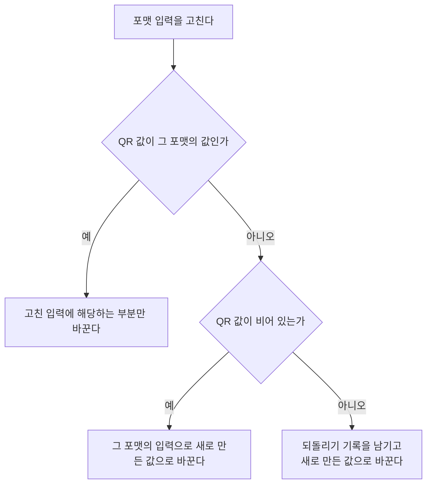
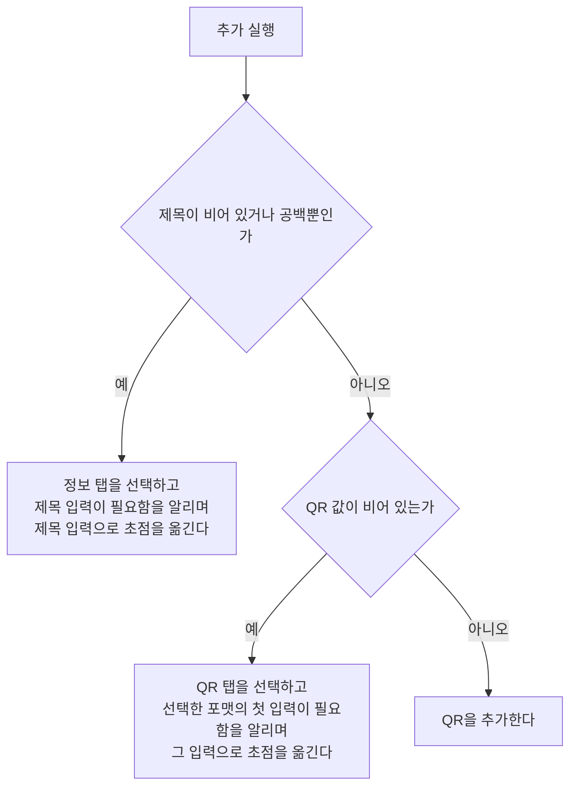

# QrAdd 화면 스펙

이 문서는 [QrHome 화면](./qr-home.md)의 QR 추가로 진입해, 사용자가 제목과 설명을 적고, QR에 담을 값을 직접 쓰거나 포맷별 입력으로 고치거나 카메라로 스캔해 넣은 뒤 QR로 그려 확인하고 QR을 추가하는 QrAdd 화면의 내용과 행동, 그리고 추가되는 QR이 갖는 정보와 정책을 다룬다. 추가한 QR의 목록 표시와 목록에서의 삭제는 [QrHome 화면 스펙](./qr-home.md)에서, 카메라로 QR을 읽는 화면은 [QrScan 화면 스펙](./qr-scan.md)에서 다룬다. 제목 입력 자체의 동작은 [제목 입력 스펙](./title-input.md)을, 설명 입력 자체의 동작은 [설명 입력 컴포넌트 스펙](./description-input.md)을, 지도의 표시·조작·지점 선택 자체의 동작은 [DiaryMap 컴포넌트 스펙](./diary-map.md)을, 일정 기간 입력 자체의 동작은 [날짜·시간 입력 컴포넌트 스펙](./diary-date-time-input.md)을 따른다.

작성 상태 유지, 뒤로가기, 추가 요청 제한, 계정 연결과 저장·동기화 계약은 [항목 추가 화면 공통 스펙](./entity-add.md)을 따른다. 이 문서에서는 QrAdd 화면에서만 다른 시작 상태와 추가 결과를 다룬다.

이번 범위는 사용자가 제목, 설명과 QR 값을 입력해 QR을 추가하고, QR 값을 포맷별 입력으로 보고 고치고, 카메라로 스캔한 값을 넣고, QR 값이 통째로 바뀐 것을 되돌리는 것까지다. 저장한 QR의 상세 확인과 수정, QR에 태그를 연결하는 것은 이번 범위에서 다루지 않는다.

디자인: [QrAdd 화면 디자인](../../design/qr-add.md)

## feature

### 진입

사용자는 QrHome 화면의 QR 추가를 선택해 이 화면으로 이동한다. 처음 들어오면 정보 탭이 선택되어 있고, 제목, 설명과 QR 값이 비어 있으며, 선택된 포맷은 텍스트다. 되돌릴 기록은 없다. 사용자가 QR의 이름부터 바로 적을 수 있도록 입력 초점을 제목 입력에 둔다.

### 화면 내용

사용자는 화면에서 QR을 추가하는 화면에 들어왔음을 알 수 있는 제목을 확인한다.

화면에는 화면 제목, 뒤로가기, 되돌리기, QR 그림, 정보 탭과 QR 탭, QR 스캔 시작과 QR 추가만 둔다. 정보 탭에는 제목 입력과 설명 입력을, QR 탭에는 포맷 선택과 선택한 포맷의 입력을 둔다.

QR 그림은 두 탭 바깥에 놓여 어느 탭을 보고 있든 사라지지 않는다. 사용자는 제목과 설명을 적는 동안에도 QR 탭에서 입력한 결과를 확인할 수 있다.

### 탭 전환

사용자는 정보 탭과 QR 탭 사이를 언제든 오갈 수 있다. 탭을 바꿔도 제목, 설명, QR 값과 선택한 포맷은 그대로 남는다.

탭이 스스로 바뀌는 경우는 `스캔 결과 반영`, `되돌리기`, `QR 추가`, `제목 미입력`, `QR 내용 미입력`에서 정한 경우뿐이다.

### 제목과 설명 입력

사용자는 정보 탭에서 QR의 제목과 설명을 입력하거나 바꿀 수 있다. 제목은 한 줄 분량을, 설명은 여러 줄을 입력할 수 있다. 제목은 반드시 입력해야 하고, 설명은 비워 둘 수 있다.

### QR 값

화면이 다루는 QR 값은 하나뿐이며, QR 그림과 추가할 QR의 QR 값은 언제나 이 값이다. 포맷은 같은 QR 값을 어떤 입력으로 보고 고칠지만 정하고, QR 값을 따로 나눠 갖지 않는다.

QR 값이 바뀌면 QR 그림은 따로 확인하는 동작 없이 바로 바뀐 값을 담은 QR로 다시 그려진다. QR 값이 비어 있으면 QR 그림 자리는 빈 채로 남고 별도 안내를 표시하지 않는다. 제목과 설명은 QR 그림에 담기지 않는다.

QR 하나에 담을 수 없을 만큼 긴 입력은 받지 않는다. 그 기준은 `domain > QR 값의 길이`를 따르며, 입력한 결과 QR 값이 기준을 넘게 되면 그 입력을 반영하지 않고 입력하기 전 내용을 그대로 둔다.

### 포맷 선택

사용자는 QR 탭에서 포맷을 고른다. 고를 수 있는 포맷과 각 포맷의 입력은 `domain > QR 포맷`을 따른다.

포맷을 바꿔도 QR 값은 바뀌지 않는다. 포맷을 고르면 그 포맷의 입력이 지금 QR 값에서 읽은 내용으로 채워진다. 무엇을 읽는지는 `domain > 포맷 입력 읽기`를 따르며, QR 값이 그 포맷의 값이 아니면 그 포맷의 입력은 `domain > 포맷별 빈 입력`으로 보인다.

### 텍스트 포맷 입력

텍스트 포맷의 입력은 QR 값 그 자체다. 사용자는 여러 줄로 QR 값을 직접 입력하거나 고칠 수 있고, 입력한 글자가 그대로 QR 값이 된다.

### 포맷별 입력

텍스트가 아닌 포맷에서 사용자가 입력 하나를 고치면 QR 값이 바로 바뀐다. 바뀌는 방식은 고치기 전 QR 값이 그 포맷의 값인지에 따라 다르며, `domain > 포맷 입력 쓰기`를 따른다.

- 그 포맷의 값이면 QR 값에서 고친 입력에 해당하는 부분만 바꾸고, 그 포맷이 입력으로 보여 주지 않는 나머지 내용은 그대로 둔다.
- 그 포맷의 값이 아니면 기존 QR 값을 지우고, 그 포맷의 입력으로 새로 만든 값으로 바꾼다. 기존 QR 값이 비어 있지 않았으면 되돌리기로 돌아갈 수 있도록 기록을 남긴다.

포맷별 입력을 고치는 동안에는 사용자가 입력하는 글자를 그대로 둔다. QR 값이 바뀌었다고 입력 칸의 글자를 다시 채우지 않는다.

### 위치 입력

위치 포맷에서 사용자는 함께 표시되는 지도에서 위치를 눌러 좌표를 고르거나, 위도와 경도를 각각 십진수로 직접 입력한다. 두 방법 중 무엇을 쓰든 결과로 정해지는 좌표는 같게 다룬다. 직접 입력할 때 사용자는 음수와 소수점을 포함한 값을 입력할 수 있다.

지도를 누르면 누른 곳에 지점 표시가 나타나고, 그 곳의 위도와 경도가 위도 입력과 경도 입력에 함께 채워지며, 두 입력을 고친 것과 같이 QR 값이 바뀐다. 이미 고른 곳이 있는 상태에서 다른 곳을 누르면 지점 표시가 새로 누른 곳으로 옮겨지고 위도와 경도도 그 곳의 값으로 바뀐다. 지점 표시는 항상 하나만 있다. 지도를 눌러 좌표를 고를 때는 입력 초점을 옮기지 않는다.

사용자가 위도나 경도를 직접 입력하면 입력을 멈춘 뒤에 지도가 그 좌표를 반영한다. 입력이 멈췄다고 보는 기준은 [입력 정지 대기 시간 스펙](./input-idle-delay.md)을 따른다. 좌표가 성립하면 지점 표시가 입력한 곳으로 옮겨지고 지도도 그 곳을 가운데에 두도록 이동한다. 좌표가 성립하지 않으면 지점 표시가 사라지고 지도가 보고 있는 위치는 바뀌지 않는다.

위치 포맷을 골라 QR 값에서 읽은 좌표가 성립하면 그 곳에 지점 표시를 두고 지도를 그 곳으로 옮긴다.

지도를 옮기거나 확대·축소해도 고른 좌표는 바뀌지 않는다.

사용자는 지도 없이 위도와 경도를 직접 입력해서도 위치 QR을 만들 수 있다. 지도가 표시되지 않는 상태에서도 좌표 입력과 QR 추가는 그대로 사용할 수 있다. 지도를 표시하는 조건은 `domain > 위치 포맷의 지도`를 따른다.

### QR 스캔 시작

사용자는 값을 직접 입력하는 대신 QR 스캔 시작을 선택해 카메라로 QR을 읽어 값을 넣을 수 있다. QR 스캔 시작은 어느 탭을 보고 있든 선택할 수 있다. 선택하면 앱이 카메라 권한을 확인하고, 필요하면 [카메라 권한 요청 스펙](./camera-permission.md)에 따라 시스템 카메라 권한 요청을 시작한다.

- 카메라 권한이 이미 허용되어 있거나 이번 요청에서 허용하면 [QrScan 화면](./qr-scan.md)으로 이동한다.
- 카메라 권한이 허용되지 않으면 이 화면에 머무르고, 카메라 권한이 없어 QR을 스캔할 수 없다는 안내를 짧게 표시한다. 제목, 설명, QR 값, 선택한 포맷과 보고 있던 탭은 그대로 남는다.

권한 요청에 응답하기 전에는 QR 스캔 시작을 다시 선택해도 새 요청을 시작하지 않는다. 응답이 끝나면 다시 선택할 수 있다.

QR 스캔 시작은 `domain > QR 스캔 제공 범위`에 따라 모든 환경에서 표시하고, 어느 환경에서든 위와 같이 카메라 권한 요청 결과에 따라 동작한다. 기기에 쓸 카메라가 없을 때 권한 요청이 어떤 결과가 되는지는 [카메라 권한 요청 스펙](./camera-permission.md)의 `요청 제공 범위`를 따르며, 허용되어 QrScan 화면으로 이동한 뒤의 결과는 [QrScan 화면 스펙](./qr-scan.md)의 `화면 내용`을 따른다.

### 스캔 결과 반영

QrScan 화면에서 QR을 읽어 이 화면으로 돌아오면 QR 값이 읽은 값으로 글자 그대로 바뀐다. 이어서 QR 탭이 선택되고, `domain > 포맷 알아보기`로 읽은 값의 포맷을 알아봐 그 포맷이 선택되며, 그 포맷의 입력이 읽은 값에서 채워진다. 기존 QR 값이 비어 있지 않았으면 되돌리기로 돌아갈 수 있도록 기록을 남긴다. 제목과 설명은 바뀌지 않는다.

QrScan 화면에서 QR을 읽지 않고 뒤로가기로 돌아오면 제목, 설명, QR 값, 선택한 포맷, 보고 있던 탭과 QR 그림은 떠나기 전 그대로 보인다.

### 되돌리기

사용자는 되돌리기를 선택해 QR 값이 통째로 바뀌기 직전의 상태로 돌아갈 수 있다. 되돌리기 기록은 `포맷별 입력`에서 기존 값을 지우고 새로 쓸 때와 `스캔 결과 반영`에서만 남으며, 무엇을 기록하는지는 `domain > 되돌리기 기록`을 따른다.

되돌리기를 선택하면 가장 나중에 남은 기록 하나를 꺼내 QR 값을 그 기록의 값으로, 선택한 포맷을 그 기록의 포맷으로 바꾸고, QR 탭을 선택한다. 그 포맷의 입력은 돌아간 QR 값에서 다시 채워진다. 꺼낸 기록은 없어지며, 되돌리기를 다시 선택하면 그 앞의 기록으로 돌아간다. 되돌린 것을 다시 실행하는 동작은 제공하지 않는다.

되돌릴 기록이 없으면 되돌리기를 선택할 수 없다. 되돌리기는 제목과 설명을 바꾸지 않는다.

### QR 추가

사용자는 어느 탭을 보고 있든 입력한 내용으로 QR 추가를 실행할 수 있다.

QR 추가를 처리하는 동안에는 진행 상태를 표시한다.

추가에 성공하면 화면을 유지한 채 제목, 설명과 QR 값을 비우고 되돌리기 기록도 모두 지운다. 선택한 포맷은 그대로 두고, 그 포맷의 입력은 빈 QR 값에서 다시 채워진다. QR 값이 비므로 QR 그림 자리도 빈다. 사용자가 다음 QR 입력을 바로 이어갈 수 있도록 정보 탭을 선택하고 입력 초점을 제목 입력으로 옮기며 성공 피드백을 제공한다.

위치 포맷의 지점 표시는 좌표가 비므로 사라지고, 지도가 보고 있는 위치는 그대로 둔다.

### 제목 미입력

제목이 비어 있거나 공백만 있는 상태에서 추가를 실행하면 QR을 추가하지 않고 제목 입력이 필요하다는 피드백을 제공한다.

입력 중이던 설명, QR 값, 선택한 포맷과 되돌리기 기록은 유지하고, 정보 탭을 선택한 뒤 입력 초점을 제목 입력으로 옮기므로, 사용자는 제목을 바로 입력한 뒤 다시 시도할 수 있다.

### QR 내용 미입력

제목은 있지만 QR 값이 비어 있는 상태에서 추가를 실행하면 QR을 추가하지 않고, 선택한 포맷에서 무엇을 입력해야 하는지 알리는 피드백을 제공한다. 알리는 입력과 초점을 옮길 자리는 `domain > 포맷별 첫 입력`을 따른다.

입력 중이던 제목, 설명과 선택한 포맷은 유지하고, QR 탭을 선택한 뒤 입력 초점을 그 입력으로 옮기므로, 사용자는 내용을 바로 입력하거나 QR 스캔 시작으로 값을 넣은 뒤 다시 시도할 수 있다.

### 뒤로가기

사용자가 뒤로가기를 실행하면 QrHome 화면으로 돌아간다. 추가하지 않은 입력은 저장하지 않고 버리며, 다시 들어오면 `진입`과 같은 상태로 시작한다.

### 작성 상태 유지 대상

[항목 추가 화면 공통 스펙](./entity-add.md)의 `작성 상태 유지`가 유지하는 대상은 입력 중이던 제목, 설명, QR 값, 선택한 포맷과 그 포맷의 입력, 보고 있던 탭과 되돌리기 기록이다. 위치 포맷에서는 유지한 좌표가 성립하면 지점 표시도 같은 곳에 유지되며, 사용자가 보고 있던 지도 위치와 확대 수준, 지도 제공자도 유지한다. QR 그림은 QR 값에서 정해지므로 따로 유지하지 않아도 같은 값에서 같은 그림이 다시 보인다.

화면 재생성, 백그라운드 복귀, QrScan 화면에 다녀온 뒤에도 이 대상을 유지하고, 시스템이 앱을 메모리에서 정리한 뒤 화면을 복원해도 모두 복원한다. 이 화면은 태그 입력을 제공하지 않으므로 복원에서 제외하는 입력이 없다.

표시 중이던 권한 안내와 추가 결과 피드백은 화면 재생성이나 앱 재실행 뒤에 다시 표시하지 않는다.

카메라 권한 요청에 응답하기 전에 화면이 재생성되면 그 요청의 응답은 이 화면에 반영하지 않는다. 사용자는 QrAdd 화면에 그대로 머무르고, QR 스캔 시작을 다시 선택할 수 있다.

## domain

### QR의 정보

QR 하나는 다음 정보를 갖는다.

- 제목: QR을 가리키는 이름. 비어 있을 수 없다.
- 설명: QR에 덧붙이는 설명. 비어 있을 수 있다.
- QR 값: QR 그림에 담기는 글자들. 비어 있을 수 없으며 `QR 값의 길이` 기준을 만족한다.

QR 그림은 QR이 따로 기록하는 정보가 아니다. QR 그림은 언제나 그 QR의 QR 값을 담아 그린다.

어떤 포맷으로 입력했는지는 QR의 정보로 기록하지 않는다. 포맷은 QR 값을 보고 고치는 방법일 뿐이며, 추가된 QR에는 QR 값만 남는다.

QR은 태그와 연결되지 않는다.

### QR 포맷

사용자가 고를 수 있는 포맷과 각 포맷의 입력은 다음과 같다.

| 포맷 | 입력 |
| --- | --- |
| 텍스트 | 내용(여러 줄) |
| URL | 주소 |
| 연락처 | 이름, 전화번호, 이메일, 회사, 주소(여러 줄), 웹사이트 |
| Wi-Fi | 네트워크 이름, 보안 방식, 비밀번호, 숨겨진 네트워크 여부 |
| 위치 | 위도, 경도 |
| 이메일 | 받는 사람, 제목, 본문(여러 줄) |
| 전화 | 전화번호 |
| SMS | 전화번호, 메시지(여러 줄) |
| 일정 | 일정 제목, 기간, 장소, 설명(여러 줄) |

포맷을 고르는 순서는 위 표의 순서다. 표에서 여러 줄이라고 적지 않은 입력은 한 줄 분량을 입력한다.

Wi-Fi의 보안 방식은 `WPA/WPA2/WPA3`, `WEP`, `없음` 가운데 하나를 고른다. 보안 방식이 `없음`이면 비밀번호를 입력할 수 없다. 입력해 두었던 비밀번호는 지우지 않고 남겨 두어, 다른 보안 방식으로 되돌리면 다시 보인다.

일정의 기간은 [날짜·시간 입력 컴포넌트](./diary-date-time-input.md)로 정하며, 종일 기간과 시각이 있는 기간을 모두 쓸 수 있다. 사용자가 기간 사용을 끄면 기간이 없는 것으로 다룬다.

### 포맷 알아보기

QR 값이 어느 포맷의 값인지는 QR 값의 시작으로 알아본다. 영문 대소문자는 구분하지 않고, 앞에 공백이 있으면 그 포맷의 값으로 보지 않는다.

| 포맷 | 그 포맷의 값으로 보는 QR 값 |
| --- | --- |
| 연락처 | `BEGIN:VCARD`로 시작한다 |
| 일정 | `BEGIN:VEVENT` 또는 `BEGIN:VCALENDAR`로 시작하고, 안에 `BEGIN:VEVENT` 줄이 있다 |
| Wi-Fi | `WIFI:`로 시작한다 |
| 위치 | `geo:`로 시작한다 |
| 이메일 | `mailto:`로 시작한다 |
| 전화 | `tel:`로 시작한다 |
| SMS | `SMSTO:` 또는 `sms:`로 시작한다 |
| URL | `http://` 또는 `https://`로 시작하고 줄바꿈이 없다 |

스캔한 값의 포맷을 고를 때는 위 표의 위에서부터 차례로 확인해 처음 맞는 포맷을 고르고, 맞는 포맷이 없으면 텍스트를 고른다. 텍스트 포맷은 어떤 QR 값이든 그 포맷의 값으로 본다.

### 포맷별 빈 입력

QR 값이 그 포맷의 값이 아닐 때 그 포맷의 입력은 다음과 같이 보인다.

- 글자 입력은 모두 비어 있다.
- Wi-Fi의 보안 방식은 `WPA/WPA2/WPA3`이고, 숨겨진 네트워크가 아니다.
- 일정의 기간은 그때의 오늘부터 오늘까지의 종일 기간으로 사용하는 상태다.

### 포맷 입력 읽기

QR 값이 그 포맷의 값이면 그 포맷의 입력을 다음과 같이 채운다. 값에 해당하는 부분이 없으면 그 입력은 `포맷별 빈 입력`과 같다.

- 텍스트: QR 값 전체.
- URL: QR 값 전체.
- 연락처: 이름은 `FN`의 값, `FN`이 없으면 `N`의 값에서 `;`로 나뉜 부분 가운데 비어 있지 않은 것을 공백으로 이은 글자다. 전화번호, 이메일, 회사, 주소, 웹사이트는 각각 처음 나오는 `TEL`, `EMAIL`, `ORG`, `ADR`, `URL`의 값이며, 회사는 `ORG`의 첫 부분, 주소는 `ADR`에서 `;`로 나뉜 부분 가운데 비어 있지 않은 것을 공백으로 이은 글자다. 속성 이름 앞의 묶음 이름(`item1.` 같은 것)과 뒤의 매개변수(`;TYPE=CELL` 같은 것)는 속성을 찾을 때 무시한다.
- Wi-Fi: `S`의 값이 네트워크 이름, `P`의 값이 비밀번호다. `T`의 값이 `WEP`이면 `WEP`, `nopass`이거나 `T`가 없거나 비어 있으면 `없음`, 그 밖이면 `WPA/WPA2/WPA3`이다. `H`의 값이 `true`이면 숨겨진 네트워크다.
- 위치: `geo:` 뒤에서 `;`나 `?` 앞까지를 `,`로 나눈 첫째가 위도, 둘째가 경도다.
- 이메일: `mailto:` 뒤에서 `?` 앞까지가 받는 사람, 쿼리의 `subject`가 제목, `body`가 본문이다.
- 전화: `tel:` 뒤 전체가 전화번호다.
- SMS: `SMSTO:` 형식이면 뒤를 처음 나오는 `:`로 나눠 앞이 전화번호, 뒤가 메시지다. `sms:` 형식이면 `?` 앞이 전화번호, 쿼리의 `body`가 메시지다.
- 일정: 첫 `VEVENT` 안의 `SUMMARY`, `LOCATION`, `DESCRIPTION`이 각각 일정 제목, 장소, 설명이다. 기간은 `DTSTART`와 `DTEND`로 정하며, `VALUE=DATE`이면 종일 기간이고 종료일은 `DTEND`의 하루 전이다. 시각이 있으면 적힌 날짜와 시각 그대로 읽고, 시간대 표기는 기간 입력에 나타내지 않는다. `DTEND`가 없으면 종료는 시작과 같고, `DTSTART`가 없으면 기간 사용을 끈 상태다.

연락처와 일정의 글자 값은 `\n`, `\N`을 줄바꿈으로, `\,`, `\;`, `\\`를 각각 `,`, `;`, `\`로 읽는다. Wi-Fi는 `\`를 붙인 글자를 그 글자로 읽는다. 이메일과 SMS의 쿼리 값은 `%XX` 형식을 풀어 읽고, 본문의 CR LF는 줄바꿈 하나로 읽는다. 줄이 공백이나 탭으로 시작하면 앞 줄에 이어진 줄로 읽는다.

### 포맷 입력 쓰기

텍스트가 아닌 포맷에서 입력 하나를 고치면 고치기 전 QR 값에 따라 다음 중 하나로 QR 값을 바꾼다.


```mermaid
flowchart TD
    Edit["포맷 입력을 고친다"] --> Match{"QR 값이 그 포맷의 값인가"}
    Match -- "예" --> Patch["고친 입력에 해당하는 부분만 바꾼다"]
    Match -- "아니오" --> Empty{"QR 값이 비어 있는가"}
    Empty -- "예" --> Write["그 포맷의 입력으로 새로 만든 값으로 바꾼다"]
    Empty -- "아니오" --> Record["되돌리기 기록을 남기고<br/>새로 만든 값으로 바꾼다"]
```

고치기 전 QR 값이 그 포맷의 입력으로 바로 앞에 쓴 값이면 `포맷 알아보기`와 관계없이 그 포맷의 값으로 본다. 예를 들어 URL 포맷에서 `http://` 없이 주소를 입력해 나가는 동안은 글자마다 새로 쓰기로 보지 않아 되돌리기 기록이 쌓이지 않는다.

**부분만 바꾸기**에서는 고친 입력에 해당하는 부분만 새 값으로 바꾸고, 그 밖의 글자는 순서와 줄바꿈까지 그대로 둔다. 값을 담는 방식은 `새로 만드는 값`의 해당 포맷 규칙을 따른다.

| 포맷 | 고친 입력이 바꾸는 부분 | 해당 부분이 없거나 입력을 비웠을 때 |
| --- | --- | --- |
| URL | QR 값 전체 | QR 값 전체가 입력한 값이 된다 |
| 연락처 | 이름은 `FN`과 `N`의 값, 나머지는 처음 나오는 해당 속성의 값. 속성 이름과 매개변수는 그대로 둔다 | 비어 있지 않은 값을 입력했으면 `END:VCARD` 앞에 새 줄로 넣고, 비우면 그 줄을 지운다. 이름을 비우면 `FN`과 `N`의 값만 비운다 |
| Wi-Fi | `T`, `S`, `P`, `H` 가운데 해당 항목의 값 | 없는 항목은 끝의 `;` 앞에 더한다. 비밀번호를 비우거나 보안 방식을 `없음`으로 바꾸면 `P` 항목을 지우고, 보안 방식을 `없음`이 아닌 것으로 바꾸면 남아 있는 비밀번호로 `P` 항목을 다시 쓴다. 숨겨진 네트워크를 끄면 `H` 항목을 지운다 |
| 위치 | 위도와 경도 자리. 고도, `;` 뒤 매개변수와 `?` 뒤 쿼리는 그대로 둔다 | — |
| 이메일 | 받는 사람 자리, 쿼리의 `subject`나 `body` 값. 다른 쿼리 항목은 그대로 둔다 | 없는 항목은 쿼리 끝에 더하고, 비우면 그 항목을 지운다 |
| 전화 | `tel:` 뒤 전체. 앞의 `tel:` 표기는 그대로 둔다 | — |
| SMS | 원래 형식(`SMSTO:` 또는 `sms:`)을 지킨 채 전화번호나 메시지 자리 | 메시지를 비우면 메시지 자리를 앞의 구분 글자와 함께 지운다 |
| 일정 | 첫 `VEVENT` 안의 해당 속성 값 | 없는 속성은 `END:VEVENT` 앞에 새 줄로 넣고, 비우면 그 줄을 지운다. 기간 사용을 끄면 `DTSTART`와 `DTEND` 줄을 지운다 |

일정의 기간을 고칠 때, 종일 여부가 바뀌지 않았으면 `DTSTART`와 `DTEND`의 매개변수와 끝의 `Z` 같은 시간대 표기를 그대로 두고 날짜와 시각 숫자만 바꾼다. 종일 여부가 바뀌면 `새로 만드는 값`의 일정 규칙대로 두 줄을 다시 쓴다.

위치의 위도와 경도는 둘 다 성립하면 `새로 만드는 값`의 위치 규칙대로 담고, 하나라도 성립하지 않으면 두 입력의 글자를 앞뒤 공백만 지워 그대로 담는다. 위도와 경도를 읽는 방법, 유효 범위와 정밀도는 [PlaceAdd 화면 스펙](./place-add.md)의 `좌표의 유효 범위`, `좌표를 읽는 방법`, `좌표의 정밀도`를 따른다.

새 줄을 넣을 때는 QR 값에 이미 쓰인 줄바꿈 방식을 따르고, 줄바꿈이 없으면 CR LF를 쓴다.

**새로 쓰기**에서는 기존 QR 값을 지우고, 그 포맷의 입력 전체로 `새로 만드는 값`을 만든다. 이때 그 포맷의 입력은 고친 입력을 뺀 나머지가 `포맷별 빈 입력`과 같다.

### 새로 만드는 값

포맷의 입력으로 QR 값을 새로 만들 때 다음 규칙을 따른다. 비어 있는 입력은 해당 부분을 통째로 빼고 만든다. 줄로 나뉘는 값은 줄 끝을 CR LF로 나눈다.

| 포맷 | QR 값 |
| --- | --- |
| URL | 주소 그대로 |
| 연락처 | vCard 3.0 연락처 |
| Wi-Fi | `WIFI:` 형식 |
| 위치 | `geo:위도,경도` |
| 이메일 | `mailto:` 주소 |
| 전화 | `tel:전화번호` |
| SMS | `SMSTO:전화번호:메시지`, 메시지가 없으면 `SMSTO:전화번호` |
| 일정 | iCalendar 일정 |

Wi-Fi의 네트워크 이름과 비밀번호는 공백도 이름과 비밀번호의 일부일 수 있으므로 입력한 그대로 담는다. 그 밖의 입력은 앞뒤 공백을 지운 값으로 담고, 지운 뒤 비어 있으면 입력하지 않은 것으로 본다. 중간의 공백과 줄바꿈은 그대로 둔다. 주소, 전화번호, 이메일 주소의 형식은 검사하지 않는다.

**연락처**는 다음 줄을 차례로 담는다. `이름` 등은 해당 입력의 값이며, 이름을 뺀 빈 입력의 줄은 빼고 담는다.

```text
BEGIN:VCARD
VERSION:3.0
N:이름
FN:이름
ORG:회사
TEL:전화번호
EMAIL:이메일
ADR:;;주소;;;;
URL:웹사이트
END:VCARD
```

값 안의 `\`, `,`, `;`는 앞에 `\`를 붙이고, 줄바꿈은 `\n` 두 글자로 바꿔 담는다.

**Wi-Fi**는 `WIFI:T:보안;S:네트워크 이름;P:비밀번호;H:true;;` 형식으로 담는다. 보안에는 `WPA/WPA2/WPA3`이면 `WPA`, `WEP`이면 `WEP`, `없음`이면 `nopass`를 담는다. `P:비밀번호;`는 보안 방식이 `없음`이 아니고 비밀번호가 있을 때만, `H:true;`는 숨겨진 네트워크일 때만 담는다. 네트워크 이름과 비밀번호 안의 `\`, `;`, `,`, `:`, `"`는 앞에 `\`를 붙여 담는다.

**위치**의 위도와 경도는 소수 여섯째 자리로 반올림한 값을 소수점 아래 끝의 0을 빼고 담는다. 소수점 아래가 모두 0이면 소수점도 빼고, `-0`은 `0`으로 담는다. 예를 들어 위도 `37.5665`, 경도 `126.9780`은 `geo:37.5665,126.978`이 된다.

**이메일**은 `mailto:받는 사람`에, 제목이나 본문이 있으면 `?subject=제목&body=본문`을 이어 담는다. 둘 중 있는 것만 담고, 제목과 본문이 모두 있으면 `subject`를 먼저 담는다. 제목과 본문은 UTF-8로 바꾼 뒤 영문자, 숫자와 `-._~`가 아닌 글자를 `%XX` 형식으로 담으며, 본문의 줄바꿈은 `%0D%0A`로 담는다. 받는 사람은 입력한 그대로 담는다.

**일정**은 다음 줄을 차례로 담는다. `장소`와 `설명` 줄은 입력이 있을 때만, 기간 줄은 기간을 사용할 때만 담는다.

```text
BEGIN:VEVENT
SUMMARY:일정 제목
DTSTART:시작
DTEND:종료
LOCATION:장소
DESCRIPTION:설명
END:VEVENT
```

시각이 있는 기간은 시작과 종료를 입력한 날짜와 시각 그대로 `YYYYMMDDTHHMM00` 형식으로 담고, 시간대를 붙이지 않는다. 읽는 기기의 현지 시각으로 해석된다. 종일 기간은 `DTSTART;VALUE=DATE:YYYYMMDD`와 `DTEND;VALUE=DATE:YYYYMMDD`로 담으며, 종료에는 종료일의 다음 날을 담는다. 일정 제목, 장소와 설명 안의 `\`, `,`, `;`는 앞에 `\`를 붙이고, 줄바꿈은 `\n` 두 글자로 바꿔 담는다.

### 되돌리기 기록

되돌리기 기록 하나는 QR 값이 통째로 바뀌기 직전의 QR 값과, 그 값을 `포맷 알아보기`로 알아본 포맷을 담는다. 바뀌기 직전의 QR 값이 비어 있으면 기록을 남기지 않는다.

기록은 가장 최근 것부터 꺼내며, 최근 20개까지만 보관한다. 21번째 기록이 생기면 가장 오래된 기록을 지운다.

### QR 값

QR 값은 QR 하나에 담는 글자들이다. 줄바꿈과 공백도 값의 일부로 그대로 담고, 앞뒤 공백을 지우거나 형식을 다시 검사하지 않는다. 공백만으로 이루어진 값도 글자가 있으므로 비어 있지 않은 값이다.

### QR 값의 길이

값의 길이 기준은 글자 수가 아니라 QR 하나에 담을 수 있는지로 정한다. QR 표준이 정한 가장 큰 QR에 가장 낮은 오류 복원 수준으로 담을 수 있으면 받고, 담을 수 없으면 받지 않는다.

값이 숫자로만 이루어져 있거나 QR 표준의 영숫자 글자(숫자, 영문 대문자, 공백과 `$%*+-./:`)로만 이루어져 있으면 그 글자 체계로 담는다. 그 밖의 글자가 하나라도 섞이면 값 전체를 UTF-8로 담으므로, 한글처럼 UTF-8로 여러 바이트를 차지하는 글자는 그만큼 한도를 더 쓴다.

포맷별 입력을 고칠 때는 고친 결과로 바뀔 QR 값이 이 기준을 넘는지로 입력을 받을지 정한다.

### 포맷별 첫 입력

QR 값이 비어 있어 추가하지 않을 때 알리는 입력과 초점을 옮길 자리는 선택한 포맷의 첫 입력이다.

| 포맷 | 첫 입력 |
| --- | --- |
| 텍스트 | 내용 |
| URL | 주소 |
| 연락처 | 이름 |
| Wi-Fi | 네트워크 이름 |
| 위치 | 위도 |
| 이메일 | 받는 사람 |
| 전화 | 전화번호 |
| SMS | 전화번호 |
| 일정 | 일정 제목 |

위치 포맷의 알림은 위도와 경도가 각각 어떤 범위의 숫자여야 하는지와 지도에서 위치를 고를 수 있다는 것을 함께 알린다.

### 추가 성립 조건

QR은 제목과 QR 값을 가져야 추가할 수 있다.

- 제목이 비어 있거나 공백 문자로만 이루어져 있으면 추가하지 않는다.
- QR 값이 비어 있으면 추가하지 않는다. QR 값은 `QR 값`의 기준에 따라 공백을 지우지 않으므로, 공백만 있는 값은 비어 있지 않다.

포맷의 입력이 모두 채워졌는지는 추가 성립 조건이 아니다. QR 값이 그 포맷의 입력으로 보여 주지 않는 내용만 담고 있거나 일부 입력이 비어 있어도, QR 값이 비어 있지 않으면 추가한다.

설명은 추가 성립 조건이 아니다. 설명이 비어 있어도 QR을 추가할 수 있다.

같은 제목, 설명과 QR 값의 QR을 이미 추가했더라도 새 QR로 추가한다. 같은 QR을 두 번 넣었는지는 사용자가 판단할 일이며, 제품이 막지 않는다.

여러 조건이 함께 성립하지 않으면 제목 미입력, QR 내용 미입력 순으로 판단하고 먼저 성립하지 않은 조건 하나의 결과만 알린다.


```mermaid
flowchart TD
    Start["추가 실행"] --> Title{"제목이 비어 있거나 공백뿐인가"}
    Title -- "예" --> TitleBlank["정보 탭을 선택하고<br/>제목 입력이 필요함을 알리며<br/>제목 입력으로 초점을 옮긴다"]
    Title -- "아니오" --> Value{"QR 값이 비어 있는가"}
    Value -- "예" --> ValueEmpty["QR 탭을 선택하고<br/>선택한 포맷의 첫 입력이 필요함을 알리며<br/>그 입력으로 초점을 옮긴다"]
    Value -- "아니오" --> Add["QR을 추가한다"]
```

### 추가되는 QR의 내용

기록되는 공통 값은 [항목 추가 화면 공통 스펙](./entity-add.md)의 `추가되는 항목의 내용`을 따른다.

QR에는 사용자가 입력한 제목과 설명을 앞뒤 공백을 포함해 입력한 그대로, QR 값은 화면의 QR 값 그대로 기록한다. 설명을 입력하지 않았으면 빈 값으로 기록한다.

### 위치 포맷의 지도

위치 포맷은 [DiaryMap 컴포넌트](./diary-map.md)를 지점 선택을 사용하는 상태로 둔다.

초기 지도 제공자는 사용자가 [SettingMap 화면](./setting-map.md)에서 고른 기본 지도다. 초기 지도 위치는 지정하지 않으며, 이때의 표시는 [DiaryMap 컴포넌트 스펙](./diary-map.md)의 초기 지도 위치를 따른다. QrAdd는 현재 위치를 따로 확인하지 않는다.

기본 지도를 확인하기 전이거나 읽지 못했으면 지도를 표시하지 않으며, 별도의 로딩 안내나 오류 안내도 제공하지 않는다.

QrAdd가 표시되어 있는 동안 기본 지도가 바뀌면 바뀐 기본 지도로 지도를 새로 시작한다. 이때 입력 중이던 내용은 유지한다. 새로 시작한 지도는 초기 지도 위치에서 시작하고, 입력 중인 좌표가 성립하면 입력을 멈춘 것으로 보는 시간이 지난 뒤 그 곳에 지점 표시를 두고 그 곳을 가운데로 옮긴다.

지도에서 고른 지점은 항상 유효 범위 안의 좌표이므로 성립하지 않는 좌표는 직접 입력으로만 만들어진다. 지점 표시는 현재 좌표가 성립할 때만 있다.

### QR 스캔 제공 범위

QR 스캔은 Android, iOS, 데스크톱 앱과 웹에서 제공한다. 각 환경에서 어떤 카메라를 쓰는지는 [QrScan 화면 스펙](./qr-scan.md)의 `사용하는 카메라`를 따른다.

## data

### QR 생성과 저장

저장 흐름은 [항목 추가 화면 공통 스펙](./entity-add.md)의 `생성과 저장`을 따른다. 이때 함께 반영되는 것은 새 QR과 현재 사용자 계정의 연결이다.

QR의 제목, 설명과 QR 값은 QR의 내용으로 저장되며, QR을 조회하면 함께 조회된다. 포맷, 포맷별 입력과 되돌리기 기록은 저장하지 않는다.

### 동기화

추가한 QR은 [데이터 동기화 스펙](../common/data-sync.md)의 `QR` 종류로 서버에 반영된다. 제목, 설명과 QR 값이 QR의 내용으로 반영된다. 반영 시점과 실패 처리는 [항목 추가 화면 공통 스펙](./entity-add.md)의 `동기화`를 따른다.

## 참고

- [ISO/IEC 18004 QR Code bar code symbology specification](https://www.iso.org/standard/83389.html)
- [RFC 2426 vCard MIME Directory Profile](https://www.rfc-editor.org/rfc/rfc2426)
- [RFC 5545 iCalendar](https://www.rfc-editor.org/rfc/rfc5545)
- [RFC 6068 The 'mailto' URI Scheme](https://www.rfc-editor.org/rfc/rfc6068)
- [RFC 3966 The tel URI for Telephone Numbers](https://www.rfc-editor.org/rfc/rfc3966)
- [RFC 5870 A Uniform Resource Identifier for Geographic Locations ('geo' URI)](https://www.rfc-editor.org/rfc/rfc5870)
- [ZXing Barcode Contents](https://github.com/zxing/zxing/wiki/Barcode-Contents)
