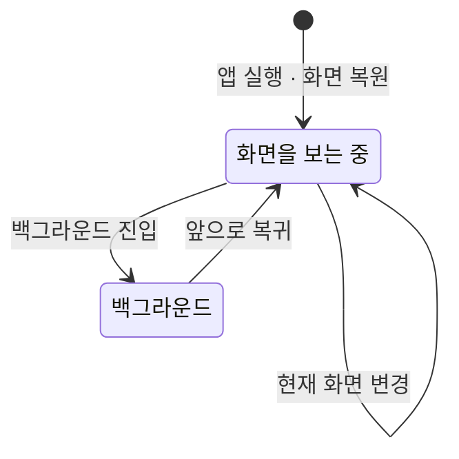

# 화면 조회 로깅 스펙

이 문서는 사용자가 어떤 화면을 봤는지를 로그로 남기는 정책과 화면 이름 계약을 다룬다. [앱 로깅](./app-logging.md)의 공통 창구와 기록 수단 체계 위에서 동작한다.

기록은 사용자가 화면을 보는 것만으로 진행되고 사용자가 수행하는 행동이나 사용자가 보는 결과가 없으므로 `feature` 영역을 생략하고, 로그는 사용자 데이터로 저장·동기화되지 않으므로 `data` 영역도 생략한다.

## domain

### 화면 조회

화면 조회는 사용자가 어떤 화면을 보기 시작한 사건이다. 화면 조회가 생기면 사건 하나가 로그로 남는다.

현재 화면은 사용자가 보고 있는 화면 중 가장 나중에 진입한 화면 하나다. 목록과 상세처럼 두 화면을 함께 표시하는 동안에도 화면 조회는 가장 나중에 진입한 화면 하나만 남는다.

아래 화면을 닫지 않고 그 위에 겹쳐 표시하는 화면도 사용자가 보는 화면이므로 화면 조회로 남긴다. 겹쳐 표시한 화면을 닫으면 다시 드러난 아래 화면의 화면 조회가 남는다.

### 화면 조회가 남는 시점

다음 세 경우에 현재 화면의 화면 조회가 남는다.

- 사용자가 이동해 현재 화면이 바뀌었을 때
- 앱이 백그라운드에 있다가 다시 앞으로 돌아왔을 때
- 앱을 다시 실행하거나 시스템이 화면을 재생성해 이전에 보던 화면이 복원되었을 때

화면을 떠난 사건은 따로 남기지 않는다. 한 화면을 얼마나 오래 봤는지는 연속한 두 화면 조회 사이의 간격으로 파악한다.

같은 화면의 화면 조회가 연달아 남을 수 있다. 백그라운드에서 돌아오거나 화면이 재생성되면 현재 화면이 바뀌지 않았어도 다시 남는다. 이는 중복이 아니라 사용자가 그 화면을 다시 보기 시작한 사건이다.

화면 조회를 남기는 것은 사용자가 화면에서 할 수 있는 일에 영향을 주지 않는다. 기록에 실패해도 화면은 그대로 표시되고 사용자는 하던 작업을 계속한다.

### 화면 이름

모든 화면은 자기 이름을 가진다. 화면 조회 로그에는 그 화면의 이름만 담는다.

화면 이름은 화면을 구분하는 고정된 값이며, 그 화면에 들어올 때 함께 전달된 값에 따라 달라지지 않는다. 같은 종류의 화면은 어떤 항목을 열었는지와 무관하게 같은 이름으로 남는다.

화면 이름에는 항목을 가리키는 값, 검색어, 좌표, 날짜처럼 그 화면에 전달된 값을 담지 않는다. 두 가지 이유 때문이다.

- 값을 담으면 화면 이름이 사용자마다 갈라져 어떤 화면을 얼마나 봤는지 셀 수 없다.
- 값에는 사용자 데이터가 섞일 수 있고, 이는 [앱 로깅](./app-logging.md)의 `로그 내용 제한`에 어긋난다.

화면 이름은 한 번 정하면 바꾸지 않는다. 이름을 바꾸면 바꾸기 전 기록과 바꾼 뒤 기록이 서로 다른 화면으로 집계되어 이어서 볼 수 없다.

이름 없는 화면은 둘 수 없다. 화면이 새로 생기면 그 화면도 이름을 가지며 아래 목록에 등록한다.

### 화면 이름 목록

| 화면 이름 | 화면 스펙 |
| --- | --- |
| `CalendarHome` | [CalendarHome](./calendar-home.md) |
| `CalendarHomeFilter` | [CalendarHome](./calendar-home.md) |
| `ChecklistHome` | [ChecklistHome 화면](./checklist-home.md) |
| `ContactAdd` | [ContactAdd 화면](./contact-add.md) |
| `ContactDetail` | [ContactDetail 화면](./contact-detail.md) |
| `ContactHome` | [ContactHome 화면](./contact-home.md) |
| `DDayHome` | [DDayHome 화면](./dday-home.md) |
| `FileHome` | [FileHome 화면](./file-home.md) |
| `HolidayHome` | [HolidayHome 화면](./holiday-home.md) |
| `LoginHome` | [Login 화면](./login.md) |
| `MemoAdd` | [MemoAdd 화면](./memo-add.md) |
| `MemoDetail` | [MemoDetail 화면](./memo-detail.md) |
| `MemoFinishedList` | [MemoFinishedList 화면](./memo-finished-list.md) |
| `MemoHome` | [MemoHome 목록](./memo-home.md) |
| `MemoHomeFilter` | [MemoHome 목록](./memo-home.md) |
| `MoreHome` | [MoreHome 화면](./more-home.md) |
| `MusicAdd` | [MusicAdd 화면](./music-add.md) |
| `MusicDetail` | [MusicDetail 화면](./music-detail.md) |
| `PlaceAdd` | [PlaceAdd 화면](./place-add.md) |
| `PlaceDetail` | [PlaceDetail 화면](./place-detail.md) |
| `PlaceHome` | [PlaceHome 화면](./place-home.md) |
| `PlaylistHome` | [PlaylistHome 화면](./playlist-home.md) |
| `ProfileImageEdit` | [ProfileImageEdit 화면](./profile-image-edit.md) |
| `QrHome` | [QrHome 화면](./qr-home.md) |
| `RoutineAdd` | [RoutineAdd 화면](./routine-add.md) |
| `RoutineHome` | [RoutineHome 화면](./routine-home.md) |
| `SearchHome` | [SearchHome 화면](./search-home.md) |
| `SettingBrowser` | [SettingBrowser 화면](./setting-browser.md) |
| `SettingDownload` | [SettingDownload 화면](./setting-download.md) |
| `SettingGemini` | [SettingGemini 화면](./setting-gemini.md) |
| `SettingHoliday` | [SettingHoliday 화면](./setting-holiday.md) |
| `SettingHome` | [SettingHome 화면](./setting-home.md) |
| `SettingMap` | [SettingMap 화면](./setting-map.md) |
| `TagAdd` | [TagAdd 화면](./tag-add.md) |
| `TagDetail` | [TagDetail 화면](./tag-detail.md) |
| `TagFinishedList` | [TagFinishedList 화면](./tag-finished-list.md) |
| `TagHome` | [TagHome 목록](./tag-home.md) |
| `TagHomeFilter` | [TagHome 목록](./tag-home.md) |
| `TagMemoFinishedList` | [TagMemoFinishedList 화면](./tag-memo-finished-list.md) |
| `WebAdd` | [WebAdd 화면](./web-add.md) |
| `WebDetail` | [WebDetail 화면](./web-detail.md) |
| `WebHome` | [WebHome 화면](./web-home.md) |

`CalendarHomeFilter`, `MemoHomeFilter`, `TagHomeFilter`는 각 목록 화면 위에 겹쳐 표시하는 필터다. 겹쳐 표시하는 화면도 화면 조회 대상이므로 아래 화면과 구분되는 이름을 가진다.

`TagAdd`는 태그 입력에서 열든 태그 목록에서 열든 같은 이름으로 남는다. 어디에서 열었는지는 결과를 돌려줄 곳을 정하기 위한 값이고 사용자가 보는 화면은 같기 때문이다.

### 기록 수단

화면 조회 로그는 원격 분석 기록 수단이 담당한다. 등록 정책과 플랫폼 제약은 [앱 로깅](./app-logging.md)의 `원격 분석 기록`을 따른다.

콘솔 기록 수단은 모든 종류의 로그를 담당하므로, 콘솔 기록 수단이 등록된 빌드에서는 화면 조회도 콘솔에 함께 남는다.

화면 조회는 오류가 아니므로 오류 보고로는 남기지 않는다.

## 참고

- [Firebase 화면 조회 측정](https://firebase.google.com/docs/analytics/screenviews)
