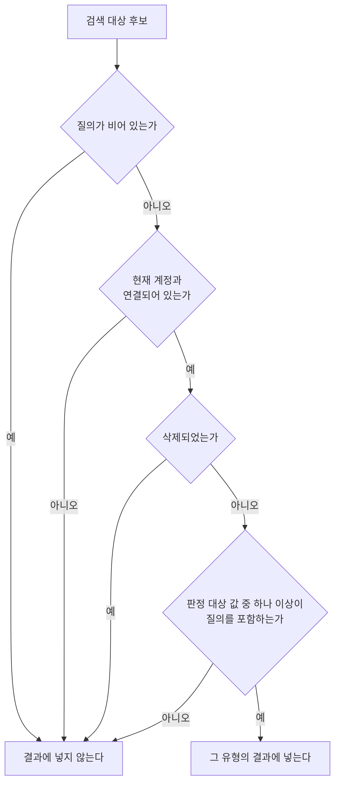
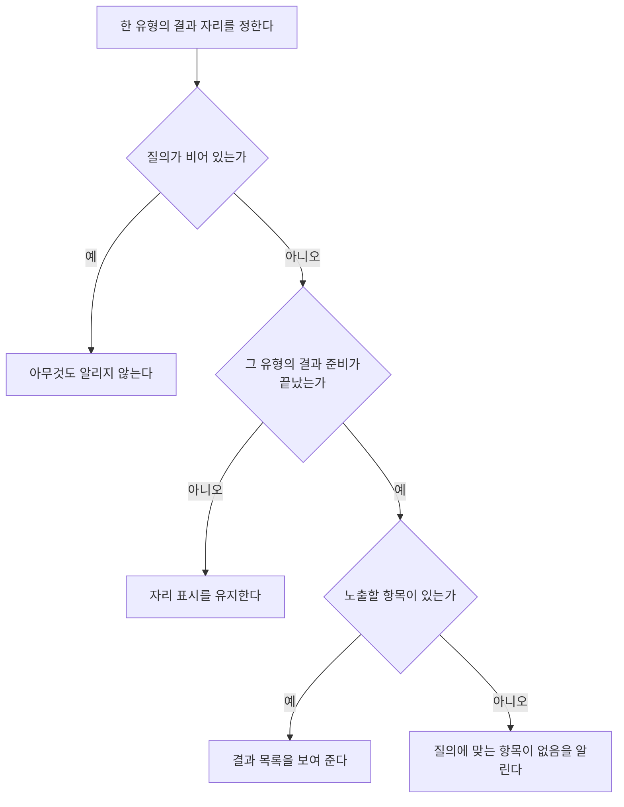

# SearchHome 화면 스펙

이 문서는 사용자가 `더보기`의 `검색` 메뉴와 목록 화면의 검색 동작으로 진입하는 SearchHome 화면의 내용과 행동을 다룬다. `더보기` 메뉴 영역의 표시와 선택은 [MoreHome 화면 스펙](./more-home.md)에서, 목록 화면에서 검색으로 이동하는 동작은 [MemoHome 목록 스펙](./memo-home.md), [TagHome 목록 스펙](./tag-home.md), [PlaceHome 화면 스펙](./place-home.md), [WebHome 화면 스펙](./web-home.md)에서, 세부 화면에서의 공통 내비게이션 노출 규칙은 [TopLevelNavigation 스펙](./top-level-navigation.md)에서, 결과를 선택해 이동하는 화면의 내용과 행동은 [MemoDetail 화면 스펙](./memo-detail.md), [TagDetail 화면 스펙](./tag-detail.md), [PlaceDetail 화면 스펙](./place-detail.md), [WebDetail 화면 스펙](./web-detail.md)에서, 웹 항목이 갖는 정보는 [WebAdd 화면 스펙](./web-add.md)에서, 결과가 하나도 없을 때의 안내는 [목록 빈 상태 스펙](./list-empty-state.md)에서, 목록이 나타나는 순서와 아직 준비되지 않은 자리의 처리는 [페이지 조회 목록의 자리 표시 스펙](./paged-list-placeholder.md)에서 다룬다.

디자인: [SearchHome 화면 디자인](../../design/search-home.md)

## feature

### 진입과 검색

사용자는 `더보기` 화면의 메뉴 영역에서 `검색` 항목을 선택해 SearchHome 화면으로 이동한다. [MemoHome 목록](./memo-home.md), [TagHome 목록](./tag-home.md), [PlaceHome 화면](./place-home.md), [WebHome 화면](./web-home.md)에서 검색을 선택해서도 이동한다.

어느 경로로 들어와도 SearchHome에서 할 수 있는 일은 같다. 사용자가 들어온 경로는 처음 보고 있는 유형만 정하며, 그 기준은 `domain`의 `진입 경로와 시작 유형`을 따른다.

진입하면 질의는 비어 있고 네 유형의 결과 목록은 모두 비어 있다. 사용자가 곧바로 질의를 입력할 수 있도록 입력 초점을 질의 입력에 한 번 둔다.

사용자가 질의를 입력하면 검색이 실행된다. 검색을 시작하기 위한 별도의 확정 동작은 필요하지 않으며, 입력한 질의를 결과에 반영하는 시점은 [검색어 일치 판정 스펙](./search-match.md)의 `검색어 반영 시점`을 따른다.

사용자가 질의를 바꾸면 결과가 새 질의 기준으로 다시 채워지고, 사용자는 결과 목록의 처음부터 새 결과를 본다. 검색어가 그대로면 보던 자리를 유지한다. 결과를 선택해 상세 화면에 다녀온 경우와, 질의를 고치다가 결과에 반영되기 전에 원래 검색어로 되돌린 경우가 여기에 해당한다. 고친 질의가 한 번이라도 결과에 반영되었다면 원래 검색어로 되돌려도 질의를 바꾼 것이므로 결과 목록의 처음부터 본다. 반영 시점은 [검색어 일치 판정 스펙](./search-match.md)의 `검색어 반영 시점`을 따른다. 다른 유형으로 바꿔도 새 질의 기준의 결과를 본다. 질의를 지워 비우면 어느 유형에도 결과가 남지 않는다.

사용자는 결과를 확인하는 동안에도 질의를 이어서 고칠 수 있다.

### 유형별 결과 확인

검색 결과는 `메모`, `태그`, `장소`, `웹` 네 유형으로 나뉘어 제공되며, 사용자는 한 번에 한 유형의 결과를 본다. 사용자는 보고 있는 유형을 바꿔 다른 유형의 결과를 확인할 수 있다.

유형을 바꾸어도 입력한 질의는 그대로 유지되고, 사용자가 검색을 다시 실행할 필요는 없다.

각 유형의 결과에서 사용자가 확인할 수 있는 내용은 다음과 같다.

| 유형 | 확인할 수 있는 내용 |
| --- | --- |
| 메모 | 메모의 제목, 컬러와 기간이 있으면 기간 |
| 태그 | 태그의 이모지, 제목과 컬러 |
| 장소 | 장소의 제목, 주소와 컬러 |
| 웹 | 웹 항목의 제목과 URL |

결과가 나타나는 순서와 아직 준비되지 않은 자리의 처리는 [페이지 조회 목록의 자리 표시 스펙](./paged-list-placeholder.md)을 따른다. 사용자는 결과 목록을 계속 내려 조건을 만족하는 항목을 모두 확인할 수 있다.

### 빈 결과와 실패

질의가 비어 있거나 질의를 만족하는 항목이 없으면 그 유형의 결과 목록은 비어 있다.

질의를 입력했는데 그 유형에 결과가 하나도 없으면 결과 자리에 질의에 맞는 항목이 없으며 다른 질의로 다시 찾을 수 있음을 알린다. 판정 시점과 목록과의 전환은 [목록 빈 상태 스펙](./list-empty-state.md)을 따른다.

질의가 비어 있는 동안에는 결과가 없다고 알리지 않는다. 아직 검색하지 않은 것과 검색해서 찾지 못한 것은 사용자에게 다른 결과이며, 진입하자마자 찾지 못했다고 알리지 않기 위한 것이다.

한 유형의 결과가 비어 있어도 다른 유형의 결과는 그대로 확인할 수 있다. 결과가 없는 유형으로도 사용자는 언제나 바꿀 수 있다. 한 유형이 결과 없음을 알리는 동안에도 사용자는 질의를 고치고 유형을 바꾸고 뒤로 갈 수 있다.

결과를 조회하지 못하면 항목이 없는 것과 같게 다루고, 오류 안내나 다시 시도하는 동작은 제공하지 않는다. 사용자는 질의를 고쳐 다시 검색할 수 있다.

### 상세로 이동

사용자는 네 유형 모두에서 결과의 항목을 선택해 그 항목의 상세 화면으로 이동한다. 메모를 선택하면 [MemoDetail 화면](./memo-detail.md)으로, 태그를 선택하면 [TagDetail 화면](./tag-detail.md)으로, 장소를 선택하면 [PlaceDetail 화면](./place-detail.md)으로, 웹 항목을 선택하면 [WebDetail 화면](./web-detail.md)으로 이동한다.

웹 항목을 선택해 이동하는 화면은 [WebHome 화면 스펙](./web-home.md)의 `웹 상세로 이동`에서 이동하는 화면과 같다. 같은 웹 항목이 목록 화면과 검색 결과에서 다르게 동작하지 않게 하기 위한 것이다.

상세에서 뒤로 돌아오면 SearchHome으로 돌아온다. 입력해 둔 질의와 보고 있던 유형이 그대로 유지되고, 상세에서 항목을 수정하거나 삭제했으면 그 결과가 반영된 목록을 본다.

돌아온 사용자가 보려는 것은 이미 채워진 결과이므로 입력 초점은 질의 입력에 다시 두지 않는다.

### 뒤로가기

사용자가 뒤로가기를 실행하면 SearchHome으로 들어온 화면으로 돌아간다. `더보기`에서 들어왔으면 `더보기`로, MemoHome·TagHome·PlaceHome·WebHome에서 들어왔으면 그 화면으로 돌아간다.

돌아간 화면은 사용자가 검색으로 떠나기 전 상태를 그대로 유지한다. 검색에서 상세로 이동해 항목을 수정하거나 삭제했으면 그 결과만 반영된다.

### 정렬 선택

사용자는 목록 위에서 현재 정렬을 확인하고 다른 기준으로 바꿀 수 있다. 고를 수 있는 기준과 정렬 선택·반영·유지의 결과는 [목록 정렬 스펙](./list-sort.md)을 따른다.

정렬은 유형마다 따로 고른다. 한 유형에서 고른 정렬은 다른 유형의 결과 순서를 바꾸지 않으며, 질의를 바꿔도 각 유형에서 고른 정렬은 그대로 유지된다.

## domain

### 질의

질의는 사용자가 입력한 검색어다. 앞뒤 공백을 어떻게 다루고 어떤 질의를 빈 질의로 보는지는 [검색어 일치 판정 스펙](./search-match.md)의 `검색어`를 따른다.

빈 질의는 어떤 항목도 만족시키지 않는다. 따라서 빈 질의에서 네 유형의 결과는 모두 비어 있다.

### 검색 대상

검색 대상은 현재 계정과 연결되어 있고 삭제되지 않은 메모, 태그, 장소, 웹 항목이다. 현재 계정은 로그인한 사용자이면 그 사용자, 로그인하지 않았으면 게스트다. 계정 조회 규칙은 [계정 조회 스펙](./account.md)을 따르며, 현재 계정을 확인할 수 없으면 어느 유형에도 결과가 없다.

완료 여부는 검색 대상을 가르지 않는다. 완료된 메모와 완료된 태그도 검색 결과에 나타난다. 목록 화면의 노출 기준([MemoHome 목록 스펙](./memo-home.md), [TagHome 목록 스펙](./tag-home.md))은 검색에 적용하지 않는다.

삭제된 항목은 어느 유형에서도 결과가 되지 않는다.

### 일치 판정

항목이 질의를 만족하는지는 [검색어 일치 판정 스펙](./search-match.md)의 `일치 판정`을 따른다. 네 유형의 판정 대상 값도 그 문서가 소유한다.

질의를 만족하는 항목 가운데 `검색 대상`을 함께 만족하는 항목만 그 유형의 결과가 된다.

### 결과 정렬

네 유형의 결과는 모두 제목 오름차순으로 정렬한다. 제목이 같은 항목끼리의 순서는 정하지 않는다.

태그의 이모지는 정렬에 영향을 주지 않는다. 질의가 값의 어느 위치에서 일치했는지, 몇 개의 값에서 일치했는지도 순서에 영향을 주지 않는다.

위 순서는 사용자가 정렬을 고르지 않았을 때의 순서이며, 사용자가 고를 수 있는 다른 기준과 그 순서는 [목록 정렬 스펙](./list-sort.md)이 정한다.

### 결과 갱신

질의가 바뀌면 결과를 새 질의 기준으로 다시 구성한다. 사용자가 유형을 바꾸면 그 유형에서도 현재 질의의 결과를 본다.

결과는 사용자가 그 유형을 보는 동안 준비하고, 보고 있지 않은 유형의 결과는 미리 준비해 두지 않는다. 유형을 바꾼 직후 결과를 준비하는 동안의 표시는 [페이지 조회 목록의 자리 표시 스펙](./paged-list-placeholder.md)을 따른다. 사용자가 한 번도 보지 않은 유형의 결과를 미리 준비해 두어도 사용자가 얻는 것은 없다.

사용자가 보고 있는 유형의 결과는 저장된 메모, 태그, 장소, 웹 항목이 추가되거나 검색 대상 기준과 일치 판정에 영향을 주는 값이 바뀌면 자동 갱신한다. 서버에서 내려받은 항목이 기기에 반영된 것도 저장 상태가 바뀐 것으로 보고 같은 기준으로 갱신한다.

상세에서 항목을 수정해 더 이상 질의를 만족하지 않게 되면 그 항목은 결과에서 사라지고, 삭제하면 검색 대상에서 빠져 결과에서 사라진다.

### 진입 경로와 시작 유형

유형은 `메모`, `태그`, `장소`, `웹` 순서를 유지하며, 처음 보고 있는 유형은 사용자가 SearchHome으로 들어온 경로가 정한다. 사용자가 방금까지 보던 항목과 같은 유형을 먼저 보여 주기 위한 것이다.

| 진입 경로 | 시작 유형 |
| --- | --- |
| `더보기`의 `검색` 메뉴 | 메모 |
| MemoHome 목록의 검색 | 메모 |
| TagHome 목록의 검색 | 태그 |
| PlaceHome 화면의 검색 | 장소 |
| WebHome 화면의 검색 | 웹 |

시작 유형은 처음 보고 있는 유형만 정하고 검색 대상을 가르지 않는다. 어느 경로로 들어와도 네 유형에 같은 기준을 적용하며, 사용자는 곧바로 다른 유형으로 바꿔 그 유형의 결과를 확인할 수 있다.

PlaceHome에서 들어올 때 보고 있던 보기 모드와 지도의 보이는 영역은 시작 유형과 결과에 영향을 주지 않는다. MemoHome에서 들어올 때 걸어 둔 유무 필터와 태그 필터도 검색 대상을 좁히지 않는다.

### 질의와 유형 선택의 유지

입력한 질의와 보고 있는 유형은 사용자가 SearchHome을 보고 있는 동안 유지한다. 화면이 회전하거나 시스템에 의해 화면이 재생성되어도, 앱이 백그라운드에 갔다가 같은 화면으로 돌아와도, 상세로 이동한 뒤 뒤로 돌아와도 유지한다.

화면을 떠난 뒤 다시 들어오면 질의는 비어 있고 보고 있는 유형은 그때 들어온 경로의 시작 유형으로 되돌아간다. 질의와 유형 선택은 기기에 따로 남기지 않으므로, 앱을 다시 실행해도 마지막에 검색한 질의는 남지 않는다.

### 결과 없음 판정

한 유형이 결과가 없다고 알리는 조건은 [검색어 일치 판정 스펙](./search-match.md)의 `검색 결과 없음 판정`을 따른다.

판정에 쓰는 질의는 결과에 반영된 질의다. 입력한 질의가 아직 반영되지 않았으면 결과 없음을 알리지 않는다. 빈 질의에서는 결과가 비어 있는 것이 정상이므로, 반영을 기다리는 동안 판정하면 잘못된 안내를 보여 주게 된다.

판정은 유형마다 따로 한다. 한 유형이 결과 없음을 알려도 다른 유형은 자신의 결과를 그대로 보여 준다.

### 상세로 이동하는 대상

네 유형 모두 결과에서 항목을 선택하면 그 항목이 상세 대상이 된다. 상세 화면은 어떤 항목을 열었는지만 이어받고, 질의와 보고 있던 유형은 이어받지 않는다.

결과에 노출하지 않는 항목은 상세 대상이 되지 않는다. 아직 준비되지 않은 자리는 상세 대상이 되지 않으며, 네 유형 모두 자리 표시 상태의 자리를 다루는 규칙은 [페이지 조회 목록의 자리 표시 스펙](./paged-list-placeholder.md)의 `자리 표시`를 따른다.

SearchHome에서 연 상세는 SearchHome과 함께 배치하지 않고 단독으로 사용한다. 목록과 상세를 함께 사용하는 배치는 각 목록 화면에서 열었을 때만 적용하며, 그 기준은 [Memo 목록·상세 배치 스펙](./memo-list-detail.md)과 [Tag 목록·상세 배치 스펙](./tag-list-detail.md)을 따른다.

## data

### 결과 조회

네 유형의 결과는 현재 계정과 질의를 기준으로 기기에 저장된 자료에서 찾는다. 찾는 기준과 정렬은 `domain`의 검색 대상, 일치 판정, 결과 정렬을 따른다.

각 유형의 결과는 유형마다 따로 정렬 순서대로 일정한 개수씩 나누어 불러오며, 불러오기 시작하는 시점은 `domain`의 결과 갱신을 따른다. 목록 끝에 다가가면 이어서 불러오는 기준은 [페이지 조회 목록의 자리 표시 스펙](./paged-list-placeholder.md)을 따른다. 한 유형을 얼마나 확인했는지는 다른 유형이 불러오는 범위에 영향을 주지 않는다.

저장된 메모, 태그, 장소, 웹 항목이 바뀌면 사용자가 아무것도 하지 않아도 결과 목록에 바로 반영된다.

### 서버 요청

검색은 기기에 저장된 자료에서만 찾으며 서버에서 항목을 다시 가져오지 않는다. SearchHome은 당겨서 새로고침을 제공하지 않으며, 서버와 맞추는 조회는 [데이터 동기화 스펙](../common/data-sync.md)의 기준으로만 일어난다.

질의를 입력하는 동안 서버로 나가는 요청은 없다. 로그인하지 않은 상태에서도 사용자는 게스트 계정과 연결된 항목을 같은 기준으로 검색할 수 있다.
