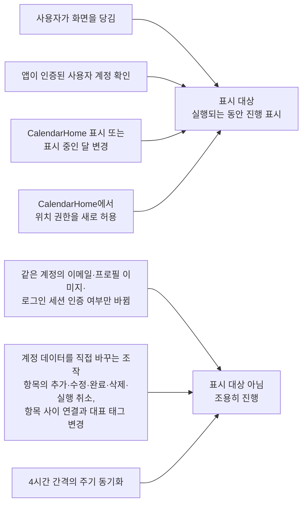

# 새로고침 스펙

이 문서는 사용자가 목록이나 캘린더를 아래로 당겨 최신 내용을 다시 가져오는 새로고침 행동과, 동기화가 진행되는 동안 사용자에게 진행을 알리는 기준을 다룬다. 계정과 연결된 메모, 태그, 장소, 웹 항목, 연락처, 곡과 그 연결들을 서버와 맞추는 규칙은 [데이터 동기화 스펙](../common/data-sync.md)을, 공휴일을 원격에서 받아 저장하는 규칙은 [공휴일 동기화 스펙](./holiday-fetch.md)을, 현재 위치의 날씨를 받아 저장하는 규칙은 [현재 날씨 동기화 스펙](./weather-fetch.md)을 따른다. 이 문서는 그 동기화를 언제 사용자의 조작으로 시작하고 언제 진행을 보여 줄지만 정한다.

[데이터 동기화 스펙](../common/data-sync.md)이 정의하는 동기화는 열세 종류를 한 번에 처리하는 하나의 동작이므로, 이 문서에서는 이를 `계정 데이터의 서버 동기화`로 부른다. 어느 화면에서 새로고침하더라도 그 한 번의 동기화가 열세 종류를 모두 처리한다.

새로고침은 이미 정의된 동기화를 다시 요청할 뿐 저장, 조회, 충돌 판정 흐름을 새로 만들지 않으므로 `data` 영역은 생략한다.

## feature

### 새로고침 대상 화면

사용자는 다음 화면에서 새로고침할 수 있다.

- CalendarHome
- MemoHome
- MemoFinishedList
- TagHome
- TagFinishedList
- TagDetail 메모 탭
- TagDetail 웹 탭
- TagDetail 장소 탭
- TagMemoFinishedList
- ContactDetail 메모 탭
- PlaceDetail 메모 탭
- WebDetail 메모 탭
- RoutineHome
- PlaceHome
- WebHome
- ContactHome
- PlaylistHome

RoutineHome은 아직 노출할 루틴이 없어 목록이 비어 있는 화면이지만, 다른 목록 화면과 같은 조작을 제공한다. 빈 상태에서 당기는 조작은 [RoutineHome 화면 스펙](./routine-home.md)의 `새로고침`을 따른다.

PlaceHome과 TagDetail 장소 탭은 지도 모드에서 지도와 장소 목록을 함께 두므로, 그 모드에서 당기는 조작은 장소 목록 영역에서만 받는다. 지도를 옮기거나 확대·축소하는 조작은 새로고침을 시작하지 않는다. 보기 모드에 따라 당길 수 있는 자리는 [장소 보기 모드 스펙](./place-view-mode.md)의 `장소 목록 새로고침`을 따른다.

### 당겨서 새로고침

사용자는 새로고침 대상 화면의 내용을 아래로 당겨 최신 내용을 다시 가져오도록 요청할 수 있다.

당기면 그 화면의 새로고침 대상이 다시 동기화되고, 동기화가 진행되는 동안 진행 중임이 화면에 표시된다.

새로 받은 내용이 있으면 사용자가 별도 조작을 하지 않아도 화면에 반영된다. 받아올 내용이 없으면 화면은 그대로 유지된다.

새로고침이 실패해도 화면에 표시 중인 내용은 사라지거나 되돌아가지 않고, 실패를 별도로 알리지 않는다.

### 진행 표시

동기화가 진행 중임을 표시하는 동안에도 사용자는 화면의 모든 조작을 그대로 할 수 있다. 항목을 확인하고 추가하거나, 완료·다시 시작·삭제하거나, 지도를 옮기고 확대·축소하거나, 다른 화면으로 이동하는 것을 진행 표시가 막지 않는다.

진행 표시는 사용자가 당겨서 요청했을 때와, 앱이 사용자 계정을 확인해 동기화를 시작했을 때 나타난다. 어떤 계정 확인이 표시 대상인지는 `domain > 새로고침 계기`를 따른다. CalendarHome에서는 화면이 표시되거나 표시 중인 달이 바뀌어 공휴일과 날씨를 가져오는 동안과, 사용자가 위치 권한 요청에서 새로 허용해 날씨를 다시 가져오는 동안에도 나타나며, 그 기준은 `domain > 새로고침 계기`를 따른다.

사용자가 메모, 태그, 장소, 웹 항목, 연락처, 곡을 추가·수정·완료·다시 시작·삭제하거나 항목 사이의 연결과 메모의 대표 태그를 바꾸는 등 계정 데이터를 직접 바꾸어 시작된 동기화는 진행 중이어도 표시하지 않는다. 사용자는 자신이 방금 한 조작의 결과를 기기에 저장된 내용으로 즉시 확인하며, 그 뒤의 서버 반영은 조용히 진행된다.

### 로그인하지 않은 상태

로그인하지 않은 상태에서 당기면 계정 데이터의 서버 동기화는 시작되지 않고 진행 표시도 나타나지 않는다. 로그인한 계정이 있어도 로그인 정보가 아직 확인되지 않았거나 더 이상 유효하지 않으면 같다. 사용자는 기기에 저장된 내용을 그대로 계속 확인한다.

CalendarHome에서는 공휴일과 날씨가 사용자 계정과 무관하므로, 로그인하지 않은 상태에서 당겨도 공휴일과 날씨는 다시 가져오고 그 진행이 표시된다.

## domain

### 새로고침 대상

화면의 새로고침 대상은 그 화면이 보여 주는 내용을 만드는 동기화다.

| 화면 | 새로고침 대상 |
| --- | --- |
| CalendarHome | 계정 데이터의 서버 동기화, 표시 중인 달의 공휴일 동기화, 현재 위치의 날씨 동기화 |
| MemoHome, MemoFinishedList, TagHome, TagFinishedList, TagDetail 메모·웹·장소 탭, TagMemoFinishedList, ContactDetail 메모 탭, PlaceDetail 메모 탭, WebDetail 메모 탭, RoutineHome, PlaceHome, WebHome, ContactHome, PlaylistHome | 계정 데이터의 서버 동기화 |

계정 데이터의 서버 동기화는 열세 종류를 한 번에 처리하므로, 화면이 보여 주는 종류만 골라 동기화하지 않는다. PlaceHome에서 당겨도 메모와 태그가 함께 동기화되고, MemoHome에서 당겨도 장소와 웹 항목과 연락처와 곡이 함께 동기화된다. TagDetail의 어느 탭에서 당겨도 같은 한 번의 동기화가 실행되므로 탭마다 동기화 대상이 다르지 않다.

공휴일 동기화의 대상 연도는 [CalendarHome 스펙](./calendar-home.md)의 `공휴일 동기화 대상`을 따른다.

### 새로고침 계기

계기에 따라 진행 표시 여부가 달라진다.

사용자가 당겼을 때와 앱이 인증된 사용자 계정을 확인해 서버 동기화를 시작했을 때는 진행 중임을 표시한다. 메모, 태그, 장소, 웹 항목, 연락처, 곡의 추가·수정·완료·다시 시작·삭제·실행 취소, 메모의 복사·이동, 연락처 즐겨찾기, 항목 사이 연결과 메모 대표 태그의 변경처럼 계정 데이터를 직접 바꾸는 조작을 계기로 시작된 서버 동기화는 진행을 표시하지 않는다. 4시간 간격으로 돌아오는 주기 동기화도 사용자가 요청한 것이 아니므로 진행을 표시하지 않는다.

진행을 표시하는 계정 확인은 앱이 시작되거나 다시 활성 상태가 되거나 앱 화면이 다시 만들어진 뒤 인증된 사용자 계정을 처음 확인했을 때와, 확인된 계정이 다른 계정으로 바뀌었을 때다. 게스트 상태에서 로그인해 인증된 계정이 확인되는 것도 여기에 포함된다. 이미 확인된 같은 계정의 이메일이나 프로필 이미지나 로그인 세션의 인증 여부만 바뀌어 시작된 서버 동기화는 사용자가 기다리는 내용이 새로 생긴 것이 아니므로 진행을 표시하지 않는다.

계정 확인을 계기로 하는 서버 동기화의 판단 기준은 [데이터 동기화 스펙](./data-sync.md)의 `동기화 계기`를, 주기 동기화의 예약과 실행 기준은 같은 스펙의 `주기 동기화`를 따른다.

CalendarHome에서 화면이 표시되거나 표시 중인 달이 바뀌어 시작되는 공휴일 동기화와 날씨 동기화는 새로고침 계기와 같이 진행을 표시한다. 이 두 동기화는 사용자 계정의 데이터를 바꾸지 않고 화면에 보이는 내용을 채우는 동기화이므로, 계기와 무관하게 진행 중임을 표시한다.

CalendarHome에서 사용자가 위치 권한 요청에서 새로 허용해 시작되는 날씨 동기화도 같은 이유로 진행을 표시한다. 허용 시점에 날씨 동기화가 진행 중이면 [CalendarHome 스펙](./calendar-home.md)의 `날씨 중복 동기화 방지`에 따라 그 동기화가 끝난 뒤 한 번 더 받으며, 진행 표시는 한 번 더 받는 동기화가 끝날 때까지 이어진다.

### 중복 요청 처리

당김은 각 동기화가 이미 가진 중복 요청 규칙을 그대로 따르며, 새로운 예외를 만들지 않는다.

- 계정 데이터의 서버 동기화는 진행 중인 동기화를 취소하고 새 동기화를 시작한다. 진행 중인 주기 동기화는 예외로, 취소하지 않고 새 동기화와 따로 진행된다. [데이터 동기화 스펙](./data-sync.md)의 `동기화 계기`와 `백그라운드 실행`을 따른다.
- 공휴일 동기화는 진행 중이면 새 동기화를 시작하지 않고, 이번 실행에서 이미 동기화에 성공한 연도는 원격 조회 없이 성공으로 끝낸다. [CalendarHome 스펙](./calendar-home.md)의 `중복 동기화 방지`와 [공휴일 동기화 스펙](./holiday-fetch.md)의 `동기화 이력`을 따른다. 따라서 당김으로 다시 원격에서 받아오는 연도는 아직 동기화에 성공하지 못한 연도다.
- 날씨 동기화는 진행 중이면 새 동기화를 시작하지 않고, 마지막 동기화에 성공한 뒤 1시간이 지나지 않았으면 원격 조회 없이 성공으로 끝낸다. [CalendarHome 스펙](./calendar-home.md)의 `날씨 중복 동기화 방지`와 [현재 날씨 동기화 스펙](./weather-fetch.md)의 `동기화 간격`을 따른다. 따라서 당김으로 다시 받아오는 날씨는 마지막 동기화로부터 1시간이 지난 경우다.

진행 중이어서 새 동기화를 시작하지 않은 경우에도 진행 중인 동기화가 있으므로 진행 표시는 이어진다.

### 진행 표시 기준

진행 표시는 표시 대상 동기화가 실제로 실행되는 동안 유지한다.

동기화 요청이 접수되었지만 아직 실행되지 않고 기다리는 동안에는 진행을 표시하지 않는다. Android에서 네트워크 연결을 기다리며 대기하는 동기화 작업이 여기에 해당한다. 기다리던 작업이 실행되기 시작하면 그 시점부터 진행을 표시한다.

한 화면의 새로고침 대상 중 하나라도 실행 중이면 진행을 표시하고, 모두 끝나면 표시를 해제한다.

계정 데이터의 서버 동기화는 주기 동기화를 빼면 앱에서 한 번에 하나만 진행되므로 그 진행 표시는 화면마다 따로 두지 않는다. 주기 동기화는 진행 표시 대상이 아니다. 한 화면에서 당겨 시작한 동기화가 진행 중이면, 다른 새로고침 대상 화면으로 옮겨 가도 그 화면에 진행이 이어서 표시된다. 동기화가 성공했는지 실패했는지는 표시 해제 기준에 영향을 주지 않는다.

### 진행 표시 유지

표시 대상 서버 동기화가 진행 중일 때 진행을 표시하지 않는 계기로 새 서버 동기화가 시작되어도 진행 표시를 해제하지 않는다. 계정 데이터를 직접 바꾸는 조작과, 이미 확인된 같은 계정의 이메일이나 프로필 이미지나 로그인 세션의 인증 여부만 바뀐 것이 여기에 해당한다.

새 동기화는 진행 중이던 동기화를 취소하고 그 몫까지 이어서 처리하므로, 이어진 동기화가 끝날 때까지 진행 표시를 유지한다.

이어진 동기화가 끝난 뒤 다시 진행을 표시하지 않는 계기만으로 시작되는 동기화는 표시 대상이 아니므로 진행을 표시하지 않는다.

### 실행 경계

진행 표시는 지금 동기화가 실행되고 있는지를 나타내는 순간 상태이며 저장하지 않는다.

화면이 재생성되거나 다른 화면에 다녀오면 그 시점의 실행 여부에 따라 진행 표시를 다시 정한다.

앱을 다시 실행하면 표시 대상 여부는 초기화된다. 앱을 종료한 뒤 Android에서 시스템이 이어서 실행하는 동기화는 앱이 다시 실행되어 사용자 계정을 확인할 때부터 표시 대상이 된다.
