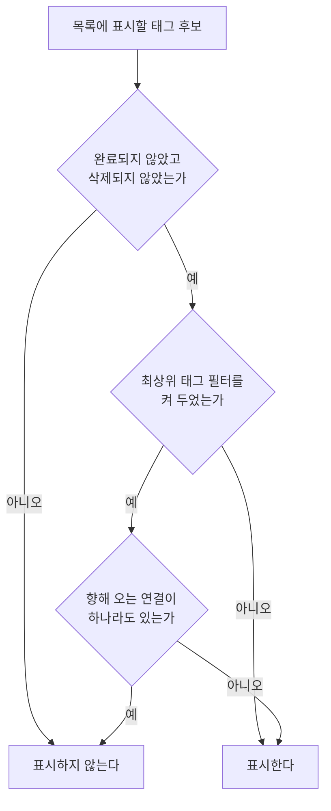

# TagHome 목록 스펙

이 문서는 태그 목록의 노출 기준, 최상위 태그 필터와 목록에서 할 수 있는 행동을 다룬다. 태그 추가는 [TagAdd 화면 스펙](./tag-add.md)에서, 상세 확인과 상세에서 태그를 완료·다시 시작·삭제하는 행동은 [TagDetail 화면 스펙](./tag-detail.md)에서, 목록 카드에서 완료·삭제를 실행하는 상호작용의 공통 규칙은 [SwipeToFinishAndDelete 컴포넌트 스펙](./swipe-to-finish-and-delete.md)에서, 목록과 상세를 함께 또는 단독으로 사용하는 상태와 전환은 [Tag 목록·상세 배치 스펙](./tag-list-detail.md)에서, 완료된 태그를 모아 확인하는 화면은 [TagFinishedList 화면 스펙](./tag-finished-list.md)에서, 목록에서 검색으로 이동한 뒤의 내용과 행동은 [SearchHome 화면 스펙](./search-home.md)에서 다룬다. 목록을 당겨 새로고침하는 행동과 동기화 진행 표시는 [새로고침 스펙](./sync-refresh.md)에서 다룬다. 태그와 태그의 연결 규칙은 [태그 연결 스펙](../common/tag-link.md)에서 다룬다.

디자인: [TagHome 목록 디자인](../../design/tag-home.md)

## feature

### 목록 표시

목록에는 현재 사용자 계정과 연결된 태그 중 완료되지 않았고 삭제되지 않은 태그만 표시한다.

사용자는 각 태그의 이모지, 제목과 저장된 컬러를 확인하고 태그를 선택해 상세 화면으로 이동할 수 있다.

태그 이모지와 제목은 카드에서 한 줄로 표시한다. 제목이 표시할 수 있는 폭보다 길면 전체 제목을 확인할 수 있도록 가로로 반복해서 이동한다.

목록이 나타나는 순서와 아직 준비되지 않은 자리의 처리는 [페이지 조회 목록의 자리 표시 스펙](./paged-list-placeholder.md)을 따른다.

### 내용 갱신

목록은 태그를 한 번에 모두 불러오지 않고, 사용자가 목록 끝에 다가가면 이어서 더 보여 준다. 이어서 불러오는 기준은 [페이지 조회 목록의 자리 표시 스펙](./paged-list-placeholder.md)의 `페이지 조회`를 따른다.

이 기기에서 태그를 추가하거나 고치거나 완료·다시 시작·삭제하거나 태그 연결을 바꾸면, 그 일을 어느 화면에서 했든 목록은 새로고침하지 않아도 바로 바뀐 내용을 보여 준다. 목록과 상세를 함께 보는 동안 상세에서 고친 내용도 목록에 바로 반영된다. 이때 보던 자리를 지키는 기준은 [페이지 조회 목록의 자리 표시 스펙](./paged-list-placeholder.md)의 `data > 자동 갱신`을 따른다.

다른 기기에서 바꾼 내용은 이 기기가 서버와 맞춘 뒤 목록에 나타난다. 서버와 맞추는 때는 [데이터 동기화 스펙](./data-sync.md)의 `동기화 계기`를 따르며, 맞춘 내용이 기기에 반영되면 사용자가 아무것도 하지 않아도 목록이 바뀐다.

### 새로고침

사용자는 목록을 아래로 당겨 새로고침할 수 있다. 새로고침은 서버와 한 번 맞추는 것이며, 진행 표시와 진행 중에 다시 당겼을 때의 결과는 [새로고침 스펙](./sync-refresh.md)을 따른다. 목록이 비어 있어도 당겨서 새로고침할 수 있다.

이 화면에 들어오거나 다른 화면에서 돌아오는 것만으로는 새로고침하지 않는다.

### 불러오기 실패

목록을 불러오지 못해도 별도 오류 안내나 다시 시도 동작은 제공하지 않는다. 이미 보이는 태그는 그대로 두고, 보이는 태그가 하나도 없으면 `빈 상태`의 안내를 보여 준다.

### 태그 추가로 이동

사용자는 태그 목록에서 태그 추가를 선택해 [TagAdd 화면](./tag-add.md)으로 이동할 수 있다. 목록이 비어 있어도, 필터를 켜 두어도 이 동작은 제공된다. 목록과 상세를 함께 보는 동안 추가 동작을 언제 제공하는지는 [목록·상세 배치 공통 스펙](./list-detail-pane.md)의 `추가 진입 수단`을 따른다.

### 최상위 태그 필터

사용자는 태그 목록에서 필터를 열어 최상위 태그만 보기를 켜거나 끌 수 있다.

필터를 켜면 목록에는 최상위 태그만 남고, 끄면 노출 기준을 만족하는 태그를 모두 표시한다. 무엇이 최상위 태그인지는 `domain`의 `최상위 태그 판정 기준`을 따른다.

켜고 끄는 것이 반영되는 시점과 필터를 닫은 뒤의 결과는 [목록 필터 반영 스펙](./list-filter.md)의 `필터 열기와 선택`을, 반영된 목록을 사용자가 어디서부터 확인하는지는 같은 문서의 `필터 반영`을 따른다.

필터를 켜 두었으면 필터를 여는 동작이 필터가 적용되었음을 알린다. 그 기준은 [목록 필터 반영 스펙](./list-filter.md)의 `필터 적용 상태`를 따른다.

필터를 켜 둔 상태에서도 사용자는 태그 추가, 완료된 태그 확인, 검색, 태그 선택, 완료와 삭제를 그대로 실행할 수 있다.

### 빈 상태

표시할 태그가 하나도 없으면 목록 자리에 비어 있음을 알린다. 필터를 끈 상태에서는 아직 태그가 없으며 새로 추가할 수 있음을, 필터를 켠 상태에서는 최상위 태그가 없으며 필터를 끄면 모든 태그를 볼 수 있음을 알린다. 판정 시점, 두 경우를 구분하는 기준, 빈 상태에서 할 수 있는 행동, 목록과의 전환은 [목록 빈 상태 스펙](./list-empty-state.md)을 따른다.

빈 상태에서도 사용자는 태그 추가, 완료된 태그 확인, 검색, 필터 열기를 그대로 실행할 수 있다.

### 완료된 태그 확인

사용자는 태그 목록에서 완료된 태그 확인을 선택해 TagFinishedList 화면으로 이동할 수 있다.

완료된 태그가 하나도 없어도 이 동작은 제공된다.

이동한 화면의 내용과 행동은 [TagFinishedList 화면 스펙](./tag-finished-list.md)을 따른다. 사용자가 그 화면에서 뒤로 가면 태그 목록으로 돌아온다.

### 검색으로 이동

사용자는 태그 목록에서 검색을 선택해 [SearchHome 화면](./search-home.md)으로 이동한다.

이동한 화면은 태그 검색 결과부터 보여 준다. 시작 유형의 기준은 [SearchHome 화면 스펙](./search-home.md)의 `진입 경로와 시작 유형`을 따른다.

검색은 목록에 표시할 태그가 있는지와 무관하게 언제나 실행할 수 있다.

사용자가 검색 화면에서 뒤로 가면 태그 목록으로 돌아오며, 목록에서 보고 있던 위치는 검색으로 떠나기 전 그대로다.

### 완료

사용자는 목록의 태그를 완료할 수 있다. 목록 카드에서 완료를 실행하는 상호작용은 [SwipeToFinishAndDelete 컴포넌트 스펙](./swipe-to-finish-and-delete.md)을 따른다. 완료를 실행하기 전에 확인을 되묻지 않는다.

완료하면 태그가 목록에서 사라지고 완료되었음을 안내하며, 실행 취소 동작을 제공한다.

사용자가 실행 취소를 선택하면 태그는 완료되지 않은 상태로 되돌아가 목록의 정렬 기준에 맞는 위치에 다시 나타난다.

### 삭제

사용자는 목록의 태그를 삭제할 수 있다. 목록 카드에서 삭제를 실행하는 상호작용은 [SwipeToFinishAndDelete 컴포넌트 스펙](./swipe-to-finish-and-delete.md)을 따른다. 삭제를 실행하기 전에 확인을 되묻지 않는다.

삭제하면 태그가 목록에서 사라지고 삭제되었음을 안내하며, 실행 취소 동작을 제공한다.

사용자가 실행 취소를 선택하면 태그는 삭제되지 않은 상태로 되돌아가 목록의 정렬 기준에 맞는 위치에 다시 나타난다.

아직 준비되지 않은 자리는 완료하거나 삭제할 수 없다.

필터를 켜 둔 상태에서도 완료와 삭제를 그대로 실행할 수 있다. 삭제나 그 실행 취소로 다른 태그가 최상위 태그가 되거나 최상위 태그가 아니게 되면, 그 태그는 `domain`의 `최상위 태그 판정 기준`에 따라 필터를 켠 목록에 나타나거나 사라진다.

목록과 상세를 함께 보는 동안 상세에 열려 있는 태그를 목록에서 완료하거나 삭제해도 상세 영역에 놓인 화면은 바뀌지 않는다.

TagDetail 화면에서 완료하거나 삭제한 태그도 노출 기준에 따라 목록에서 사라지고, 다시 시작한 태그는 정렬 기준에 맞는 위치에 다시 나타난다.

### 안내와 실행 취소

완료와 삭제의 안내와 실행 취소는 [MemoHome 목록 스펙](./memo-home.md)의 `안내와 실행 취소` 절 전체를 메모를 태그로 바꿔 그대로 따른다. 마지막 동작에만 실행 취소가 적용되고, 저장되지 못한 동작에는 안내가 보이지 않으며, 안내가 보이는 동안 화면을 떠나면 안내가 닫히고 그 동작은 목록에서 되돌릴 수 없다.

[TagDetail 화면 스펙](./tag-detail.md)의 `삭제`는 화면을 떠나는 동작이므로 실행 취소를 제공하지 않으며, 이 절은 그 규칙을 바꾸지 않는다.

### 정렬 선택

사용자는 목록 위에서 현재 정렬을 확인하고 다른 기준으로 바꿀 수 있다. 고를 수 있는 기준과 정렬 선택·반영·유지의 결과는 [목록 정렬 스펙](./list-sort.md)을 따른다.

## domain

### 태그 상태와 시각

태그는 이모지, 제목, 설명, 컬러와 함께 완료 여부, 삭제 여부, 생성 시각과 수정 시각을 가진다. 이모지가 가질 수 있는 값은 [TagAdd 화면 스펙](./tag-add.md)의 `태그 이모지`를 따른다.

새 태그는 미완료·미삭제 상태로 생성하며 생성 시각과 수정 시각을 추가 시각으로 동일하게 기록한다.

### 태그 이모지 표시

태그를 이름으로 보여 주는 모든 곳에서는 저장된 이모지를 제목 앞에 함께 표시한다. 이모지가 비어 있으면 제목만 표시한다.

이 규칙은 태그 목록, [메모 태그 입력 컴포넌트 스펙](./memo-tag-input.md)의 선택 상태와 선택 목록, [MemoHome 목록 스펙](./memo-home.md)과 [CalendarHome 스펙](./calendar-home.md)의 태그 필터, [TagDetail 화면 스펙](./tag-detail.md)과 [TagMemoFinishedList 화면 스펙](./tag-memo-finished-list.md)의 화면 제목에 함께 적용한다.

이모지는 태그를 알아보기 위한 표시이며 태그 목록의 정렬과 [태그 필터 스펙](./tag-filter.md)의 선택 기준이 되지 않는다. 검색에서 질의와 맞추는 값에는 이모지도 포함하며, 그 기준은 [검색어 일치 판정 스펙](./search-match.md)의 `일치 판정`을 따른다.

### 노출 기준

현재 사용자 계정과 연결된 태그 중 미완료·미삭제 태그만 노출한다.

완료되거나 삭제된 태그는 기기에 저장된 채 남아 있지만 목록에는 나타나지 않는다. 완료된 태그를 모아 보여 주는 목록의 노출 기준은 [TagFinishedList 화면 스펙](./tag-finished-list.md)의 노출 기준을 따른다.

완료 여부와 삭제 여부를 바꾸는 상태 전이는 `완료와 삭제의 상태 전이`를 따른다.

최상위 태그 필터는 이 노출 기준을 대체하지 않고 좁힌다. 필터를 켜 두어도 완료되었거나 삭제된 태그는 목록에 나타나지 않는다.

### 최상위 태그 판정 기준

최상위 태그는 다른 태그로부터 향해 오는 태그 연결이 하나도 없는 태그다. 다른 태그로 향해 나가는 연결만 가진 태그와 연결이 아예 없는 태그는 모두 최상위 태그다. 향해 오는 연결이 하나라도 있으면 최상위 태그가 아니다.

향해 오는 연결이 있는지 판정하는 기준은 [태그 연결 앱 스펙](./tag-link.md)의 `향해 오는 연결의 존재 판정`을 따른다. 연결을 만들거나 해제하거나 연결의 출발 태그를 삭제하면, 도착 태그는 그 결과에 따라 필터를 켠 목록에 나타나거나 사라진다. 목록에서 출발 태그의 삭제를 실행 취소하거나 다른 기기에서 받은 내용으로 출발 태그가 삭제되지 않은 상태가 되면, 그 연결은 다시 판정에 포함되어 도착 태그는 필터를 켠 목록에서 다시 사라진다. 그 기준은 [태그 연결 앱 스펙](./tag-link.md)의 `태그의 상태 변화와 연결`을 따른다.

여러 단계로 이어지는 연결에서 중간 태그는 향해 오는 연결을 가지므로 최상위 태그가 아니다. 연결이 순환을 이루면 그 순환에 속한 태그는 모두 향해 오는 연결을 가지므로, 계정의 모든 태그가 순환에 속하면 필터를 켠 목록은 비게 된다.

### 필터 적용 범위

최상위 태그 필터는 TagHome 목록의 표시에만 적용한다. 필터를 켜 두어도 [TagFinishedList 화면 스펙](./tag-finished-list.md)의 완료된 태그 목록, [SearchHome 화면 스펙](./search-home.md)의 태그 검색 결과, [메모 태그 입력 컴포넌트 스펙](./memo-tag-input.md)의 태그 선택 목록, [태그 연결 입력 컴포넌트 스펙](./tag-link-input.md)의 연결할 태그 선택 목록, [항목 태그 입력 컴포넌트 스펙](./entity-tag-input.md)의 태그 선택 목록, [태그 필터 스펙](./tag-filter.md)의 선택할 수 있는 태그는 좁혀지지 않는다.

따라서 다른 문서가 이 문서의 `노출 기준`과 `정렬`을 참조할 때 최상위 태그 필터는 포함하지 않는다.

필터는 태그의 이모지·제목·설명·컬러와 완료 여부·삭제 여부를 바꾸지 않고, 태그 연결을 만들거나 해제하지도 않는다.

### 필터 선택 유지

최상위 태그 필터는 켜짐과 꺼짐 두 상태를 가지며 기본 상태는 꺼짐이다. 한 번도 켜지 않은 계정에서는 꺼진 상태로 시작한다.

필터 선택은 현재 사용자 계정별로 유지한다. 유지되는 경계, 계정이 바뀔 때의 결과와 꺼진 상태로 돌아가는 경우는 [목록 필터 반영 스펙](./list-filter.md)의 `필터 선택 유지`와 `필터 선택 초기화`를 따른다.

### 실행 경계

화면이 회전하거나 재생성되거나 앱이 백그라운드에 다녀와도 필터 선택, 정렬 선택과 목록에서 보던 자리는 그대로다. 태그 상세나 검색, 완료된 태그 확인에 다녀와도 같다.

앱이 백그라운드에 있는 동안 시스템이 앱을 정리했다가 다시 만들면 필터 선택은 이어지고, 열어 둔 필터는 [목록 필터 반영 스펙](./list-filter.md)의 `필터 열림 유지`에 따라 열린 채로 다시 보이며, 정렬은 [목록 정렬 스펙](./list-sort.md)의 `정렬 선택 유지`에 따라 처음 정렬로 돌아가고, 목록 위치는 [페이지 조회 목록의 자리 표시 스펙](./paged-list-placeholder.md)의 `보던 자리 유지`에 따라 떠나기 전 위치로 다시 보인다.

앱을 종료하고 다시 실행하면 필터 선택은 `필터 선택 유지`에 따라 이어지고, 정렬은 [목록 정렬 스펙](./list-sort.md)의 `정렬 선택 유지`에 따라 처음 정렬로 돌아가며, 목록은 맨 위부터 보인다.

공통 내비게이션에서 다른 주요 목적지에 다녀와도 같다. 필터 선택은 이어지고, 정렬은 처음 정렬로 돌아가며, 목록은 맨 위부터 보인다. 그 기준은 [TopLevelNavigation 스펙](./top-level-navigation.md)의 `목적지 이동과 화면 상태`를 따른다.

현재 목적지인 태그를 다시 선택했을 때 돌아가는 자리는 [TopLevelNavigation 스펙](./top-level-navigation.md)의 `다시 선택으로 돌아가는 자리`를 따른다.

### 완료와 삭제의 상태 전이

목록의 완료와 삭제는 [TagDetail 화면 스펙](./tag-detail.md)의 `완료·다시 시작·삭제`와 같은 상태 전이다. 완료는 태그의 완료 여부를 완료로, 삭제는 삭제 여부를 삭제로 바꾸며 두 동작 모두 태그 자체를 지우지 않는다.

실행 취소는 직전에 바꾼 상태를 원래 상태로 되돌린다. 완료의 실행 취소는 완료 여부를 미완료로, 삭제의 실행 취소는 삭제 여부를 미삭제로 되돌린다.

완료, 삭제와 실행 취소는 모두 태그의 수정 시각을 동작 시점으로 갱신한다. 따라서 최근 수정순에서는 실행 취소로 돌아온 태그가 앞쪽에 놓인다.

완료, 삭제와 실행 취소는 태그의 이모지, 제목, 설명과 컬러를 바꾸지 않고, 태그 사이의 연결과 메모·웹 항목·장소와의 연결도 해제하지 않는다. 따라서 실행 취소한 태그는 삭제 전의 연결을 그대로 가진 채 돌아온다. 그 기준은 [항목 연결 공통 스펙](../common/entity-link.md)의 `항목의 상태 변화와 연결`을 따른다.

목록에서 실행하는 완료, 삭제와 실행 취소는 현재 사용자 계정과 연결된 태그에만 적용한다.

### 정렬

목록은 제목 오름차순으로 정렬한다. 제목이 같은 태그끼리의 순서는 정하지 않는다. 이모지는 정렬에 영향을 주지 않는다.

다시 시작하거나 실행 취소로 목록에 돌아온 태그는 제목에 맞는 위치에 나타나며 상태 변경 시각은 목록 순서에 영향을 주지 않는다.

위 순서는 사용자가 정렬을 고르지 않았을 때의 순서이며, 사용자가 고를 수 있는 다른 기준과 그 순서는 [목록 정렬 스펙](./list-sort.md)이 정한다.

### 대상 태그

목록에는 현재 사용자 계정과 연결된 태그만 표시한다.

## data

### 상태 변경의 저장

목록에서 태그를 완료하거나 삭제하면 현재 사용자 계정과 연결된 그 태그의 완료 여부나 삭제 여부와 수정 시각이 기기에 즉시 저장된다. 태그 자체와 계정 연결, 태그 연결은 기기에서 지우지 않는다.

실행 취소를 선택하면 되돌린 상태가 같은 방식으로 즉시 저장된다.

저장하면 그 태그가 업로드 대기로 기록되고 화면 뒤에서 동기화가 시작되어, 같은 계정의 다른 기기에도 같은 상태로 보인다. 성공 여부는 기기에 저장한 결과로만 판단하며, 업로드 단위와 실패 시 재시도는 [데이터 동기화 스펙](../common/data-sync.md)을 따른다. 로그인하지 않은 상태에서 바꾼 태그는 서버에 반영되지 않고 기기 안에만 유지된다.

실행 취소를 저장하지 못하면, 현재 계정을 확인할 수 없는 경우를 포함해 태그는 바뀐 상태로 남아 목록에 다시 나타나지 않으며 별도의 안내는 제공하지 않는다.

### 목록 조회

기기에 저장된 태그 중 현재 사용자 계정의 미완료·미삭제 태그를 `domain`의 정렬 순서로 나누어 불러와 표시한다. 페이지를 이어서 조회하는 기준은 [페이지 조회 목록의 자리 표시 스펙](./paged-list-placeholder.md)의 `페이지 조회`를 따른다.

필터를 켜 두었으면 그중 향해 오는 연결이 없는 태그만 조회한다.

태그가 추가되거나 저장 상태가 바뀌거나 태그 연결이 만들어지거나 해제되거나 필터 선택이 바뀌면, 목록을 조회 기준과 정렬 기준에 따라 자동 갱신한다.

### 필터 선택 조회

필터를 열거나 화면에 들어오면 현재 사용자 계정에 유지된 선택을 조회해 표시한다. 유지된 선택이 없거나 조회하지 못하면 꺼진 상태로 본다. 조회의 공통 기준은 [목록 필터 반영 스펙](./list-filter.md)의 `필터 선택 조회`를 따른다.

### 필터 선택 저장

사용자가 필터를 켜거나 끄면 현재 사용자 계정의 선택을 기기에 즉시 저장한다. 저장 위치, 서버와 동기화하지 않는 것과 저장 실패의 결과는 [목록 필터 반영 스펙](./list-filter.md)의 `필터 선택 저장`을 따른다.
