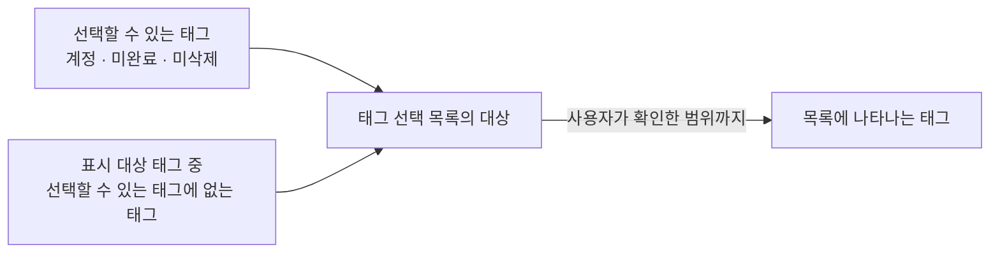
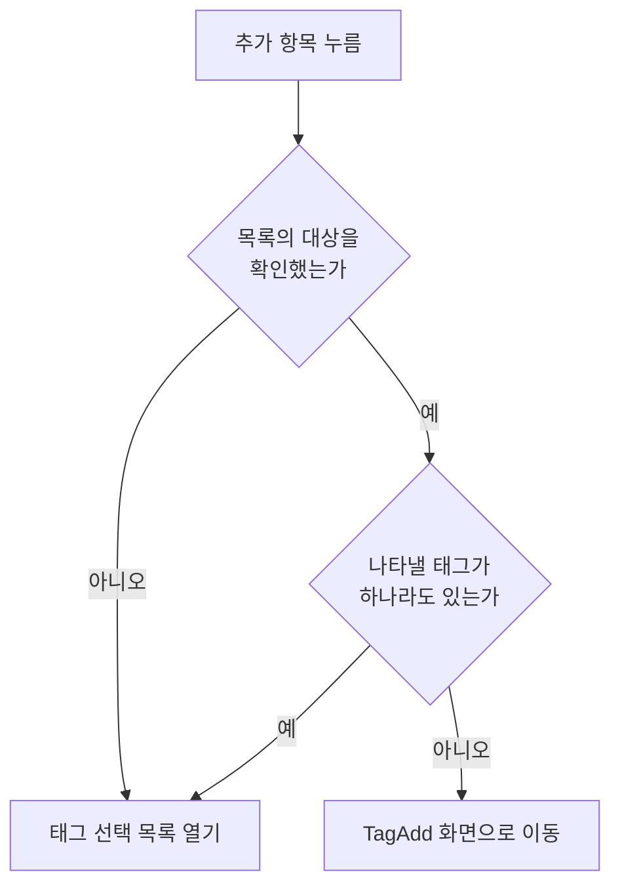

# 태그 선택 입력 공통 스펙

이 문서는 태그를 고르는 입력이 공통으로 제공하는 사용자 행동과 판정 기준을 다룬다. 무엇과 태그를 잇는지, 고른 결과가 언제 저장되는지, 대표 태그 지정 같은 추가 행동이 있는지는 입력마다 다르므로 각 입력 컴포넌트 스펙에서 다룬다.

이 문서를 따르는 입력 컴포넌트 스펙은 다음과 같다.

- [항목 태그 입력 컴포넌트 스펙](./entity-tag-input.md)
- [메모 태그 입력 컴포넌트 스펙](./memo-tag-input.md)
- [태그 연결 입력 컴포넌트 스펙](./tag-link-input.md)

디자인: [태그 선택 입력 공통 디자인](../../design/tag-select-input.md)

선택 대상이 되는 태그의 노출과 정렬 기준은 [TagHome 목록 스펙](./tag-home.md)을 따르고, 태그 선택 목록을 검색어로 좁힐 때의 판정 기준은 [검색어 일치 판정 스펙](./search-match.md)을 따른다.

## 용어

- `선택`: 사용자가 태그 선택 목록에서 태그를 고르거나 고른 것을 되돌리는 행위. 각 입력에서 이 행위가 무엇을 뜻하는지는 그 입력 컴포넌트 스펙이 정한다.
- `표시 대상 태그`: 태그 입력이 고른 태그로 표시하는 태그. 기준은 `domain`의 `표시 대상 태그`를 따른다.

## feature

### 선택 상태 표시

태그 입력에는 현재 표시 대상 태그가 표시된다.

표시 대상 태그는 [TagHome 목록 스펙](./tag-home.md)의 `태그 이모지 표시`에 따라 이모지와 제목을 함께 표시한다.

표시 대상 태그의 이모지, 제목이나 컬러가 다른 경로로 바뀌면 바뀐 내용이 표시된다.

표시 대상 태그의 기준은 화면마다 다르므로 `domain`의 `표시 대상 태그`를 따른다. 골랐던 태그가 그 기준에서 빠지면 태그 입력에서도 제외된 것으로 표시한다.

### 태그 상세 이동

사용자는 태그 입력에 표시된 태그를 눌러 그 태그의 TagDetail 화면으로 이동할 수 있다.

태그를 눌러도 태그 선택 목록은 열리지 않고, 그 태그의 선택도 바뀌지 않는다.

이동한 화면에서 돌아오면 표시 대상 태그는 `선택 상태 표시`의 기준으로 반영된다. 이동한 화면에서 태그를 수정하거나 완료하거나 삭제한 결과도 같은 기준으로 반영된다.

### 태그 선택 목록

태그 입력에는 추가 항목이 표시된다. 추가 항목은 표시 대상 태그가 없어도 표시된다.

사용자가 추가 항목을 누르면 `domain`의 `추가 항목의 동작 판정`에 따라 태그 선택 목록이 열리거나 [TagAdd 화면](./tag-add.md)으로 이동한다. 나타낼 태그를 확인하는 중에 연 목록이 나타낼 태그가 없는 채로 확정되면 목록 영역은 비어 있는 채로 유지된다.

사용자는 태그 선택 목록에서 목록에 나타나는 태그와 각 태그의 선택 여부를 확인할 수 있다. 목록에 나타나는 태그의 기준은 `domain`의 `태그 선택 목록에 나타나는 태그`를 따른다.

목록에는 별도의 빈 상태 안내를 두지 않는다. 검색어를 입력해 목록이 비는 경우는 `태그 검색`을 따른다.

태그 선택 목록에는 태그 추가 항목이 항상 표시된다. 나타낼 태그가 하나도 없어도, 목록을 어디까지 확인했어도, 목록을 위아래로 이동해도 이 항목은 계속 표시된다. 사용자가 이 항목을 누르면 목록이 닫히고 `태그 추가 이동`에 따라 TagAdd 화면으로 이동한다.

목록은 정렬 순서의 앞부분부터 나타나고, 사용자가 목록의 끝으로 이동하면 다음 태그가 이어서 나타난다. 사용자는 목록을 계속 이동해 기준을 만족하는 태그를 모두 확인할 수 있다.

목록에서는 태그의 완료 여부를 구분해 표시하지 않으며, 완료된 태그도 목록에 나타나면 다른 태그와 같은 위치 기준으로 정렬해 표시한다.

다음 태그를 이어서 불러오는 동안에도 사용자는 이미 나타난 태그의 선택을 바꿀 수 있다. 목록을 처음 불러오거나 다음 태그를 이어서 불러오는 데 실패하면 이미 나타난 태그를 그대로 유지하며 별도 재시도 동작은 제공하지 않는다.

목록을 닫아도 목록에서 반영한 선택은 그대로 유지된다. 목록을 닫았다가 다시 열면 목록은 정렬 순서의 앞부분부터 다시 나타난다.

### 태그 검색

태그 선택 목록에는 검색어 입력이 함께 표시된다. 목록을 열면 검색어는 비어 있고 `태그 선택 목록`의 대상이 모두 나타난다.

목록을 열 때 입력 초점을 검색어 입력에 두는지는 각 입력 컴포넌트 스펙이 정한다. 정하지 않은 입력에서는 초점을 두지 않으며, 사용자가 검색어 입력을 눌러야 입력할 수 있다. 이미 나타난 태그를 고르려고 목록을 연 사용자에게 화면 키보드가 먼저 열려 목록을 가리지 않게 하기 위한 것이다.

사용자가 검색어를 입력하면 목록이 검색어를 만족하는 태그만 나타내도록 좁혀진다. 검색을 시작하기 위한 별도의 확정 동작은 필요하지 않으며, 입력한 검색어를 목록에 반영하는 시점은 [검색어 일치 판정 스펙](./search-match.md)의 `검색어 반영 시점`을 따른다.

사용자가 검색어를 바꾸면 목록은 새 검색어 기준으로 다시 채워지고 정렬 순서의 앞부분부터 나타난다. 검색어를 지워 비우면 다시 대상 전체가 나타난다.

검색어로 좁힌 목록에서도 사용자는 태그의 선택을 그대로 바꿀 수 있다. 태그를 골라도 그 태그는 검색 결과에서 빠지지 않고, 선택을 되돌려도 검색어를 만족하는 동안에는 목록에 남는다.

검색어를 입력했는데 그 검색어를 만족하는 태그가 하나도 없으면 목록 자리에 검색어에 맞는 태그가 없으며 다른 검색어로 다시 찾을 수 있음을 알린다. 알리는 조건은 `domain`의 `태그 검색어`를 따른다.

검색어가 비어 있는 동안에는 나타낼 태그가 없어도 결과 없음을 알리지 않고 목록 영역을 비워 둔다.

검색어는 태그 입력의 칩 영역에 표시하는 태그를 좁히지 않는다.

검색어를 입력해도 태그 추가 항목은 그대로 표시되며, 검색어에 맞는 태그가 없어도 사용자는 그 항목으로 TagAdd 화면에 이동할 수 있다.

목록을 닫으면 검색어는 사라진다. 목록을 다시 열면 검색어가 비어 있는 상태에서 대상 전체를 다시 확인한다.

### 태그 선택과 해제

사용자는 태그 선택 목록에서 태그를 고르거나 고른 것을 되돌릴 수 있고, 한 번에 여러 태그를 고를 수 있다.

선택과 해제는 즉시 반영되며 별도의 확정 동작은 필요하지 않다. 반영된 결과가 저장되는 시점은 화면마다 다르다.

### 태그 추가 이동

사용자는 다음 두 경로로 [TagAdd 화면](./tag-add.md)으로 이동한다.

- 목록에 나타낼 태그가 하나도 없는 것으로 확정된 상태에서 태그 입력의 추가 항목을 누른다.
- 태그 선택 목록의 태그 추가 항목을 누른다.

어느 경로로 이동하든 이동 자체는 선택을 바꾸지 않는다. 태그 선택 목록에서 이동한 경우 목록은 닫힌 채로 이동한다.

TagAdd 화면에서 태그 입력이 있는 화면으로 돌아오면 그 화면에서 추가한 태그가 선택된다. 이동하기 전에 있던 선택은 그대로 유지되고 추가한 태그가 더해진다. 이 판정은 `domain`의 `추가한 태그의 자동 선택`을 따른다.

태그를 하나도 추가하지 않고 돌아오면 선택은 그대로다.

돌아와도 태그 선택 목록이 저절로 다시 열리지는 않는다. 추가 항목을 다시 누르면 추가한 태그가 나타나는 태그 선택 목록이 열린다.

## domain

### 표시 대상 태그

태그 입력이 표시 대상 태그로 삼는 태그는 현재 사용자 계정과 연결된 태그 중 삭제되지 않은 태그다. 삭제된 태그는 어느 화면에서도 표시 대상 태그로 삼지 않는다.

완료된 태그를 표시 대상 태그로 삼는지는 화면마다 다르므로 각 화면 스펙에서 정한다.

선택 여부는 표시 대상 태그를 기준으로 판정한다. 골랐던 태그가 그 기준에 없으면 그 태그는 선택에서 제외된 것으로 본다.

고른 태그가 표시 기준에서 벗어나면 태그 입력은 그 태그를 제외된 것으로 표시한다. 이는 태그 입력의 표시 기준이며, 이미 저장된 연결을 해제하지는 않는다. 저장된 연결이 유지되는 규칙은 [항목 연결 공통 스펙](../common/entity-link.md)의 `항목의 상태 변화와 연결`을 따른다.

그 태그가 복구되거나 다시 시작되어 표시 기준을 다시 만족하면, 유지되어 있던 선택이 태그 입력에 다시 나타난다.

### 선택할 수 있는 태그

태그 입력에서 새로 고를 수 있는 태그는 현재 사용자 계정과 연결된 태그 중 완료되지 않았고 삭제되지 않은 태그다. 완료되거나 삭제된 태그는 새로 고를 수 없다.

선택할 수 있는 태그는 표시 대상 태그와 같지 않을 수 있다.

선택할 수 있는 태그의 정렬은 [TagHome 목록 스펙](./tag-home.md)의 `정렬`이 정한 제목 오름차순이다. TagHome에서 사용자가 고른 정렬은 적용하지 않으며, 태그 선택 목록에서는 정렬을 바꿀 수 없다. 그 기준은 [목록 정렬 스펙](./list-sort.md)의 `적용 대상`을 따른다.

선택할 수 있는 태그는 정렬 순서대로 나뉘어 다뤄진다. 태그 선택 목록에는 사용자가 목록에서 확인한 범위까지의 태그가 나타나며, 아직 나타나지 않은 태그도 선택할 수 있는 태그에서 빠지지 않는다.

입력에 따라 여기에서 더 제외하는 태그가 있으면 그 기준은 각 입력 컴포넌트 스펙에서 정한다.

### 태그 선택 목록에 나타나는 태그

태그 선택 목록의 대상은 선택할 수 있는 태그 전체이며, 여기에 `표시 대상 태그` 중 선택할 수 있는 태그에 없는 태그가 함께 포함된다. 사용자가 태그 입력에서 확인한 선택을 그 자리에서 되돌릴 수 있어야 하기 때문이다. 이 대상 가운데 사용자가 목록에서 확인한 범위까지가 목록에 나타난다.

목록에 나타난 태그는 완료 여부와 관계없이 선택을 되돌릴 수 있다.

선택할 수 있는 태그에 없는 태그는 표시 대상 태그일 때만 목록에 나타난다. 그래서 목록에서 그 태그의 선택을 되돌리면 그 태그는 목록에서도 사라지고, 목록을 다시 열어도 나타나지 않아 다시 고를 수 없다. 그 태그를 다시 시작하면 선택할 수 있는 태그가 되어 목록에 계속 나타난다.

목록에 나타나는 태그는 완료 여부로 구분하지 않고 선택할 수 있는 태그와 같은 정렬 기준으로 함께 정렬한다.

두 기준이 모두 화면마다 다를 수 있으므로 목록에 나타나는 태그도 화면마다 다르다. 아직 저장되지 않은 대상을 다루는 추가 화면은 표시 대상 태그가 선택할 수 있는 태그와 같으므로 목록에도 선택할 수 있는 태그만 나타나고, 저장된 대상을 다루는 상세 화면은 각 화면 스펙의 기준에 따라 이미 연결된 완료된 태그가 함께 나타난다.

### 추가 항목의 동작 판정

이 판정은 태그 입력의 추가 항목에만 적용한다. 태그 선택 목록의 태그 추가 항목은 판정 없이 항상 TagAdd 화면으로 이동한다.

추가 항목의 동작은 `태그 선택 목록에 나타나는 태그`의 대상이 하나라도 있는지로 정한다. 대상이 하나라도 있으면 태그 선택 목록을 열고, 하나도 없으면 TagAdd 화면으로 이동한다.

검색어는 이 판정에 쓰지 않는다. 목록은 언제나 빈 검색어로 열리므로 판정 대상도 검색어로 좁혀지지 않는다.

대상이 없다는 판정은 [페이지 조회 목록의 자리 표시 스펙](./paged-list-placeholder.md)의 `빈 상태 판정`과 같은 기준으로 목록의 대상을 확인한 뒤에만 내린다. 아직 확인하는 중이면 대상이 없는 것으로 판정하지 않고 태그 선택 목록을 연다.

목록에 나타나는 태그의 기준이 화면마다 다르므로 판정 결과도 화면마다 다를 수 있다. 저장된 대상을 다루는 상세 화면에서는 선택할 수 있는 태그가 없어도 표시 대상 태그가 있으면 목록이 열린다.

### 추가한 태그의 자동 선택

태그 입력에서 이동한 TagAdd 화면에서 추가한 태그는 그 태그 입력이 있는 화면으로 돌아왔을 때 선택한 태그에 더해진다. 태그 입력에서 태그 추가로 이동한 사용자는 그 태그를 지금 다루는 대상에 쓰려는 것으로 보기 때문이다.

한 번의 이동에서 태그를 여러 개 추가하면 추가한 태그가 모두 선택된다. 어느 경로로 TagAdd 화면에 이동했는지는 자동 선택에 영향을 주지 않는다.

자동 선택은 이동을 시작한 태그 입력에만 적용한다. 태그 목록처럼 태그 입력이 아닌 곳에서 연 TagAdd 화면에서 추가한 태그는 어느 태그 입력에서도 자동 선택되지 않고, 다른 태그 입력에서 연 TagAdd 화면에서 추가한 태그도 자동 선택되지 않는다.

자동 선택된 태그는 사용자가 태그 선택 목록에서 고른 태그와 같게 다룬다. 선택이 어디에 반영되는지도 `태그 선택과 해제`와 같으므로 화면마다 다르다.

자동 선택은 돌아온 시점에 한 번만 적용한다. 자동 선택된 태그의 선택을 사용자가 되돌리면 되돌린 상태가 유지되며 다시 선택되지 않는다.

앱을 종료한 뒤 화면에 새로 진입하면 돌아오는 흐름이 아니므로 자동 선택도 일어나지 않는다.

자동 선택이 각 입력의 다른 상태를 바꾸는지는 각 입력 컴포넌트 스펙에서 정한다.

### 태그 검색어

검색어의 정규화와 태그의 일치 판정, 검색어에 맞는 태그가 없다고 알리는 조건은 [검색어 일치 판정 스펙](./search-match.md)을 따른다.

빈 검색어는 목록을 좁히지 않는다. 검색어가 비어 있으면 `태그 선택 목록에 나타나는 태그`의 대상이 그대로 목록의 대상이 된다.

검색어는 `태그 선택 목록에 나타나는 태그`의 대상 전체에 같은 기준으로 적용하며, 선택할 수 있는 태그와 표시 대상이지만 선택할 수 없는 태그를 가르지 않는다. 따라서 고른 태그도 검색어를 만족하지 않으면 목록에서 빠진다. 이는 목록의 표시 기준일 뿐이며 그 태그의 선택을 바꾸지 않는다.

검색어는 목록을 좁히는 데만 쓰고 태그 입력의 표시 대상 태그는 좁히지 않는다.

검색어는 목록이 열려 있는 동안 유지하고, 목록을 닫으면 사라진다. 화면 회전과 메모리 정리 뒤 복원에서의 유지 기준은 `태그 선택 목록의 열림 상태`를 따른다.

### 태그 선택 목록의 열림 상태

목록이 열려 있는 동안 화면이 회전하거나 창 크기가 바뀌어도 목록은 열린 채로 남고, 입력하던 검색어와 그 검색어로 좁힌 목록, 보고 있던 선택이 그대로 유지된다.

목록이 열려 있는 동안 시스템이 앱을 메모리에서 정리한 뒤 화면을 복원하면 목록이 다시 열리고 입력하던 검색어도 다시 나타난다. 이때 목록은 기다리지 않고 처음부터 그 검색어로 좁힌 결과로 나타나며, 그 기준은 [검색어 일치 판정 스펙](./search-match.md)의 `검색어 반영 시점`을 따른다. 목록에 나타나는 선택 상태는 그 화면이 복원한 선택을 따른다.

앱을 종료한 뒤 화면에 새로 진입하면 목록은 닫힌 상태로 시작한다.

## data

### 태그 목록 조회

태그 선택 목록은 기기에 저장된 현재 사용자 계정의 태그 가운데 `domain`의 `태그 선택 목록에 나타나는 태그` 기준을 만족하는 태그를 정렬 순서대로 불러와 표시한다. 목록을 채우려고 서버에 따로 요청하지 않으며, 목록에는 당겨서 새로고침이 없다.

태그는 정렬 순서대로 일정한 개수씩 나누어 불러오며, 사용자가 목록의 끝에 다가가면 다음 태그를 이어서 불러온다. 이어서 불러오는 기준은 [페이지 조회 목록의 자리 표시 스펙](./paged-list-placeholder.md)을 따른다.

검색어가 비어 있지 않으면 `domain`의 `태그 검색어` 기준을 함께 적용해 검색어를 만족하는 태그만 불러온다. 검색어가 바뀌면 새 검색어 기준으로 목록의 처음부터 다시 불러온다.

목록에 나타나는 태그의 기준이 화면마다 다르므로 불러오는 기준도 화면마다 다르다. 추가 화면은 선택할 수 있는 태그만 불러오고, 상세 화면은 각 화면 스펙의 조회 기준을 따른다.

표시 대상 태그는 선택 목록과 따로 불러오며, 나누지 않고 한 번에 모두 불러오고 검색어도 적용하지 않는다. 추가 화면은 사용자가 고른 태그 가운데 `표시 대상 태그` 기준을 만족하는 태그만 불러오고, 상세 화면은 각 화면 스펙의 조회 기준을 따른다.

다른 화면에서 태그가 추가되거나 저장된 태그의 이모지·제목·컬러·상태가 바뀌거나, 서버에서 내려받은 태그가 기기에 반영되면 사용자가 아무것도 하지 않아도 표시 대상 태그와 선택 목록에 바로 반영된다. 선택 목록은 사용자가 이미 확인한 범위를 포함해 갱신된다.
