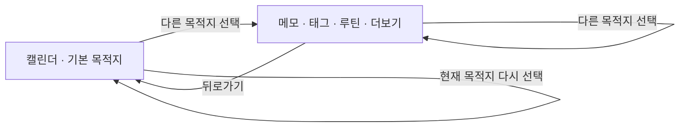

# TopLevelNavigation 스펙

이 문서는 주요 목적지의 구성, 선택, 전환과 노출 규칙을 다룬다. 각 목적지에서 이어지는 세부 화면과 행동은 해당 기능 스펙에서 다룬다.

디자인: [TopLevelNavigation 디자인](../../design/top-level-navigation.md)

## feature

### 주요 목적지 이동

앱은 사용자가 주요 화면 사이를 이동할 수 있는 공통 내비게이션을 제공한다.

앱을 처음 실행하면 기본 목적지 화면을 표시한다.

사용자가 주요 목적지를 선택하면 해당 화면으로 이동하고 현재 목적지를 선택 상태로 갱신한다.

현재 목적지를 다시 선택하면 다른 목적지로 이동하지 않고 그 목적지에 머문다. 이때 보장하는 결과는 `현재 목적지 다시 선택`을 따른다.

다른 주요 목적지로 이동한 뒤 뒤로가면 기본 목적지로 돌아간다. 이전에 거쳤던 다른 주요 목적지를 순서대로 다시 표시하지 않는다.

### 현재 목적지 다시 선택

사용자는 지금 선택되어 있는 주요 목적지를 다시 선택해 그 목적지에서 처음 보던 자리로 돌아갈 수 있다.

그 목적지의 화면만 표시되어 있으면 사용자는 그 자리로 돌아간다. 어디를 처음 보던 자리로 보는지는 목적지마다 다르며 `domain`의 `다시 선택으로 돌아가는 자리`를 따른다.

그 목적지에서 이어진 화면이 위에 열려 있으면 열려 있던 화면을 닫고 목적지 화면으로 돌아오기만 한다. 이때 목적지 화면은 사용자가 떠나기 전에 보던 자리를 그대로 유지한다. 사용자가 한 번 더 선택하면 그때 처음 보던 자리로 돌아간다.

다시 선택해도 목록의 범위, 순서, 필터 선택과 화면에 표시하는 내용은 바뀌지 않는다. 돌아간 뒤에도 사용자가 그 화면에서 할 수 있는 행동은 그대로다.

### 더보기 하위 화면의 뒤로가기

사용자가 `더보기` 목적지의 메뉴에서 진입한 세부 화면에서 뒤로가기를 실행하면 이전 화면인 `더보기`로 돌아간다.

세부 화면 안에서 더 들어간 화면의 뒤로가기 결과는 그 화면 스펙이 정한다.

### 공통 내비게이션 노출

주요 목적지 화면에서는 공통 내비게이션을 제공한다.

주요 목적지 화면과 세부 화면을 함께 사용하는 동안에도 공통 내비게이션을 계속 제공한다.

주요 목적지 화면을 유지한 채 그 위에 겹쳐 표시하는 화면을 사용하는 동안에도 공통 내비게이션을 계속 제공한다.

세부 화면이나 별도 흐름을 단독으로 사용하면 공통 내비게이션을 제공하지 않는다.

세부 화면이나 별도 흐름에서 주요 목적지로 돌아오면 공통 내비게이션을 다시 제공하고 해당 목적지를 선택 상태로 표시한다.

## domain

### 주요 목적지와 순서

주요 목적지는 앱의 최상위 화면 이동 단위다.

주요 목적지는 다음 다섯 가지이며 선언된 순서를 유지한다.

1. `메모`
2. `태그`
3. `캘린더`
4. `루틴`
5. `더보기`

세부 화면이나 별도 흐름은 주요 목적지에 포함하지 않는다.

### 기본 목적지와 전환 이력

기본 목적지는 `캘린더`다.

다른 주요 목적지로 전환할 때 기존 주요 목적지 이력을 누적하지 않고 기본 목적지와 새로 선택한 목적지만 전환 이력에 유지한다.

기본 목적지를 선택하면 기본 목적지만 전환 이력에 유지한다.

현재 목적지를 다시 선택하면 주요 목적지 전환 이력을 변경하지 않는다. 그 목적지에서 이어진 화면이 열려 있었다면 그 화면만 닫으므로, 다시 선택한 뒤 뒤로가는 결과는 목적지 화면에서 뒤로가는 결과와 같다.

전환 이력에는 기본 목적지와 현재 목적지만 남으므로, 어떤 주요 목적지에서 뒤로가도 `캘린더`로 돌아간다.

화면이 회전하거나 시스템이 화면을 재생성하면 현재 주요 목적지와 전환 이력, 그 위에 열려 있던 화면을 그대로 복원한다. 다른 앱에 다녀와도 보던 목적지와 화면이 그대로 남는다.

앱을 종료한 뒤 새로 실행하면 이전에 보던 목적지를 복원하지 않고 기본 목적지에서 시작한다.

### 목적지 이동과 화면 상태

공통 내비게이션에서 다른 주요 목적지로 이동하면, 떠난 목적지 위에 열어 두었던 화면은 모두 닫힌다. 세부 화면, 목록과 상세를 함께 표시하는 배치에서 사용자가 연 상세, 목적지 화면 위에 겹쳐 표시하던 화면이 모두 여기에 해당하며, 그 목적지로 돌아와도 다시 열리지 않고 뒤로가기로도 돌아갈 수 없다.

`캘린더`를 뺀 주요 목적지는 떠나는 순간 그 화면을 떠난 것으로 보고, 다시 선택해 돌아오면 처음 들어온 것처럼 시작한다. `캘린더`는 기본 목적지라 다른 목적지로 이동하는 동안에도 전환 이력에 남아 있으므로, 돌아오면 떠나기 전 화면을 이어서 본다.

| 화면 상태 | `메모`, `태그`, `루틴`, `더보기`에 돌아왔을 때 | `캘린더`에 돌아왔을 때 |
| --- | --- | --- |
| 목적지 위에 열어 두었던 화면 | 닫혀 있다 | 닫혀 있다 |
| 보던 자리 | 목록이나 화면의 맨 위부터 보인다 | 떠나기 전에 보던 달을 그대로 보여 준다 |
| 목록의 정렬 선택 | 그 목록의 처음 정렬로 돌아간다 | 해당 없음 |
| 필터 선택 | 그대로 이어진다 | 그대로 이어진다 |
| 목록과 상세를 함께 표시하는 배치의 상세 선택과 표시 비율 | 선택 전 상태와 기본 비율로 돌아간다 | 해당 없음 |

정렬이 처음으로 돌아가는 기준은 [목록 정렬 스펙](./list-sort.md)의 `정렬 선택 유지`를, 필터 선택이 이어지는 기준은 [목록 필터 반영 스펙](./list-filter.md)의 `필터 선택 유지`를, 배치의 상세 선택과 표시 비율이 초기화되는 기준은 [목록·상세 배치 공통 스펙](./list-detail-pane.md)의 `유지와 초기화 기준`을 따른다. `캘린더`에 돌아왔을 때 무엇을 오늘로 보는지는 [CalendarHome 화면 스펙](./calendar-home.md)의 `오늘 기준`을 따른다.

### 이어진 화면 판정

목적지 화면 위에 사용자가 연 화면이 하나라도 남아 있으면 이어진 화면이 열려 있는 것으로 본다. 목적지 화면을 덮는 세부 화면, 목록과 상세를 함께 표시하는 배치에서 사용자가 항목을 열어 표시한 상세, 목적지 화면 위에 겹쳐 표시하는 화면이 모두 여기에 해당한다.

사용자가 아직 아무 항목도 열지 않아 상세 자리에 기본으로 놓이는 화면은 이어진 화면으로 보지 않는다. 사용자가 연 화면이 아니므로 닫을 것이 없고, 이때 현재 목적지를 다시 선택하면 바로 `다시 선택으로 돌아가는 자리`를 따른다. 상세 자리에 무엇을 기본으로 놓는지는 [목록·상세 배치 공통 스펙](./list-detail-pane.md)을 따른다.

### 다시 선택으로 돌아가는 자리

목적지 화면만 표시되어 있을 때 현재 목적지를 다시 선택하면 목적지마다 다음 자리로 돌아간다.

| 주요 목적지 | 돌아가는 자리 |
| --- | --- |
| `메모` | 메모 목록의 첫 항목 |
| `태그` | 태그 목록의 첫 항목 |
| `캘린더` | 오늘이 속한 달 |
| `루틴` | 루틴 목록의 첫 항목 |
| `더보기` | 없음 |

목록의 첫 항목으로 돌아가는 것은 목록에 놓인 항목과 그 순서를 바꾸지 않고 사용자가 보고 있는 자리만 옮기는 것이다. 이미 첫 항목을 보고 있으면 자리는 그대로다. 목록을 다시 조회하지 않으므로 [목록 정렬 스펙](./list-sort.md)의 `정렬 반영`이나 [목록 필터 반영 스펙](./list-filter.md)의 `필터 반영`처럼 목록이 다시 놓이지는 않는다.

`캘린더`는 처음부터 순서대로 읽는 목록이 아니라 날짜로 자리가 정해진 화면이므로 돌아갈 자리를 오늘이 속한 달로 정한다. 돌아간 결과는 [CalendarHome 화면 스펙](./calendar-home.md)의 `오늘이 속한 달로 이동`을 따르며, 무엇을 오늘로 보는지도 그 문서의 `오늘 기준`을 따른다. 이미 오늘이 속한 달을 보고 있으면 보던 달을 그대로 유지한다.

`더보기`는 바로가기를 모아 둔 화면이라 사용자가 순서대로 읽어 내려가다 자리를 잃는 목록이 아니므로 돌아갈 자리를 정하지 않는다. `더보기`에서 현재 목적지를 다시 선택하면 화면은 보던 그대로 남는다.

### 내비게이션 노출 기준

주요 목적지 화면을 단독으로 표시하거나 세부 화면과 함께 표시하는 동안 공통 내비게이션을 제공한다.

세부 화면이나 별도 흐름만 표시하면 가장 최근 주요 목적지를 유지하되 공통 내비게이션을 제공하지 않는다.

아래 화면을 닫거나 교체하지 않고 그 위에 겹쳐 표시하는 화면은 내비게이션 노출 판정에서 제외하고, 그 아래에 표시되는 화면을 기준으로 판정한다.
