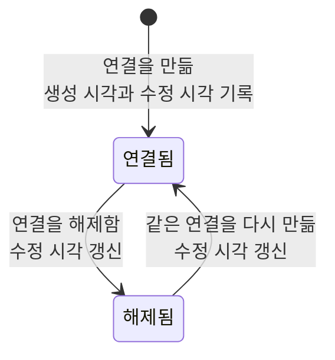

# 항목 연결 공통 스펙

이 문서는 두 항목을 잇는 연결이 공통으로 가지는 성질과, 그 연결의 동기화 계약을 다룬다. 어떤 항목과 어떤 항목을 잇는지, 연결에 방향이 있는지, 각 연결이 어느 화면에서 어떻게 쓰이는지는 연결 종류마다 다르므로 각 연결 스펙에서 다룬다.

이 문서를 따르는 연결 스펙은 다음과 같다.

- [메모 태그 스펙](./memo-tag.md)
- [메모 장소 스펙](./memo-place.md)
- [메모 웹 스펙](./memo-web.md)
- [메모 연락처 스펙](./memo-contact.md)
- [웹 태그 스펙](./web-tag.md)
- [장소 태그 스펙](./place-tag.md)
- [태그 연결 스펙](./tag-link.md)

태그를 잇는 연결 세 종류가 함께 지키는 규칙은 [항목 태그 연결 공통 스펙](./entity-tag.md)이 소유하고, 앱이 연결을 기기에 저장하는 규칙은 [항목 연결 앱 스펙](../client/entity-link.md)이 소유하며, 서버 동기화의 공통 규칙은 [데이터 동기화 스펙](./data-sync.md)을 따른다. 서버가 연결을 확인하고 반영하는 기준은 [데이터 동기화 서버 스펙](../server/data-sync.md)이 소유한다.

이 문서에는 사용자가 직접 수행하는 조작이 없어 `feature` 영역을 생략한다. 사용자가 연결을 만들고 해제하는 조작은 각 입력 컴포넌트 스펙과 화면 스펙이 소유한다.

이 문서에서 `연결의 양쪽 항목`은 하나의 연결이 잇는 두 항목을 가리킨다.

## domain

### 연결의 성질

연결은 두 항목 사이의 관계이며, 양쪽 항목이 가진 내용을 바꾸지 않는다.

연결이 없는 항목도 허용되며, 연결이 없는 것이 항목의 기본 상태다.

같은 두 항목 사이의 같은 종류, 같은 방향의 연결은 하나만 존재한다. 이미 있는 연결을 다시 만들어도 연결이 중복되지 않는다.

한 항목은 여러 연결을 가질 수 있다. 하나의 항목이 가질 수 있는 연결 수에 제한을 두지 않는다.

### 연결할 수 있는 항목

연결의 양쪽 항목은 모두 그 연결을 만드는 계정과 연결되어 있어야 한다. 계정과 연결되지 않은 항목으로는 연결을 만들 수 없으며, 서버도 이 조건을 만족하지 않는 연결을 받아들이지 않는다.

양쪽 항목 중 하나라도 계정과 연결되어 있지 않으면 그 연결은 해당 계정의 연결로 취급하지 않으며, 어느 항목을 기준으로 조회해도 나타나지 않는다.

계정 조회 규칙은 [계정 조회 스펙](../client/account.md)을 따른다.

### 연결의 상태와 시각

연결은 해제 여부와 생성 시각, 수정 시각을 가진다.

연결을 만들면 만든 시점이 생성 시각과 수정 시각으로 함께 기록된다.

연결을 해제하면 해제된 상태로 남고 수정 시각이 해제 시점으로 갱신된다. 해제된 연결은 연결로 취급하지 않지만 곧바로 사라지지 않고 해제된 상태로 남는다.

해제된 연결을 다시 만들면 새 연결을 추가하지 않고 기존 연결을 해제되지 않은 상태로 되돌리며, 수정 시각을 그 시점으로 갱신한다.

### 연결된 항목의 조회

한쪽 항목을 기준으로 그 항목과 연결된 다른 쪽 항목을 조회한다.

조회 결과에는 해제되지 않은 연결의 항목만 포함되고, 삭제된 항목은 포함되지 않는다. 완료 여부가 있는 항목은 완료되었어도 포함된다.

기기에 아직 없는 항목을 가리키는 연결은 조회 결과에 나타나지 않는다.

조회 결과의 정렬 기준은 연결 종류마다 다르므로 각 연결 스펙에서 정한다.

### 항목의 상태 변화와 연결

연결의 양쪽 항목을 완료하거나 삭제해도 그 연결은 해제되지 않는다.

양쪽 항목의 내용 수정은 연결을 바꾸지 않는다.

삭제한 항목이 다시 삭제되지 않은 상태가 되면 그 항목을 가리키는 연결이 다시 조회 결과에 나타난다. 메모 삭제의 실행 취소처럼 화면에서 삭제를 되돌린 경우와, 다른 기기에서 받은 내용으로 삭제가 풀린 경우가 모두 같다. 삭제를 되돌리는 동작을 제공하는지는 항목마다 다르므로 각 화면 스펙에서 정하며, 태그처럼 삭제를 되돌리는 동작이 없는 항목은 다른 기기에서 받은 내용으로만 삭제가 풀린다.

### 연결의 의미

연결은 두 항목의 관계를 나타내는 것으로 끝난다. 연결은 각 항목이 목록에 나타나는지, 어느 순서에 놓이는지, 검색 결과에 포함되는지를 바꾸지 않는다.

다음 경우만 예외로 연결을 노출 기준으로 쓴다. 이때도 연결은 그 목록의 정렬을 바꾸지 않는다.

- 사용자가 연결을 기준으로 고른 필터. 예를 들어 [MemoHome 목록 스펙](../client/memo-home.md)의 유무 필터 가운데 태그·장소 축과 [태그 필터 스펙](../client/tag-filter.md)은 메모와 태그, 메모와 장소의 연결로 메모를 거른다. 사용자가 필터를 고르지 않은 동안에는 연결이 목록 노출을 바꾸지 않는다.
- 한쪽 항목을 기준으로 그 항목과 연결된 항목을 모아 보여 주는 목록. 예를 들어 [TagDetail 메모 탭 스펙](../client/tag-detail-memo.md)과 [항목 상세 메모 탭 공통 스펙](../client/entity-detail-memo.md)의 목록은 기준 항목과의 연결을 노출 기준으로 쓴다.
- 각 연결 스펙이 예외로 밝힌 목록. 예를 들어 [태그 연결 앱 스펙](../client/tag-link.md)의 `연결의 의미`가 밝힌 TagDetail 화면의 표시 범위와, 같은 문서의 `향해 오는 연결의 존재 판정`을 쓰는 [TagHome 목록 스펙](../client/tag-home.md)의 최상위 태그 판정이 여기에 해당한다.

연결을 따라 또 다른 연결이 함께 성립하지 않는다. 서로 다른 종류의 연결은 각각 독립이며, 한 종류의 연결을 만들어도 다른 종류의 연결은 늘어나지 않는다.

연결 종류별로 이 규칙이 어느 화면과 목록에 적용되는지는 각 연결 스펙에서 다룬다.

## data

### 공유되는 연결

연결은 계정별 복사본이 아니라 연결된 계정과 그룹이 공유하는 하나의 항목이다.

연결의 업로드 대기 여부는 계정과 연결마다 따로 기록되며, 어느 계정을 통해 연결을 만들거나 해제해도 공유되는 연결 하나를 기준으로 반영된다. 업로드 대기의 기준은 [데이터 동기화 앱 스펙](../client/data-sync.md)의 `동기화 상태`를 따른다.

### 동기화

연결은 양쪽 항목과 구분되는 별도의 종류로 동기화된다. 주고받는 정보, 충돌 기준, 삭제와 해제의 의미는 [데이터 동기화 스펙](./data-sync.md)을 따르고, 다른 종류와의 업로드 선후 관계와 동기화 계기는 [데이터 동기화 앱 스펙](../client/data-sync.md)의 `동기화 단계와 처리 순서`와 `동기화 계기`를 따른다.

해제된 연결도 해제 상태로 서버에 반영된다. 서버가 해제된 연결을 영구히 제거하는 기준은 [데이터 동기화 서버 스펙](../server/data-sync.md)의 `삭제된 항목의 영구 제거`를 따른다.

서버는 연결의 양쪽 항목이 모두 요청한 계정과 연결되어 있을 때만 연결을 반영한다. 확인 기준은 [데이터 동기화 서버 스펙](../server/data-sync.md)의 `연결 반영`을 따른다.

연결과 그 연결이 가리키는 항목은 서로 다른 요청으로 동기화된다. 반영 순서에 따른 중간 상태와 여러 기기 충돌 뒤의 복구 범위는 [데이터 동기화 스펙](./data-sync.md)의 `종류 사이의 중간 상태`를, 실패한 연결의 재시도는 [데이터 동기화 앱 스펙](../client/data-sync.md)의 `동기화 단계와 처리 순서`를 따른다.

[데이터 동기화 스펙](./data-sync.md)의 동기화 대상 종류에 없는 연결은 이 절을 적용하지 않고 기기 안에만 유지된다. 어떤 연결이 여기에 해당하는지는 각 연결 스펙에서 밝힌다.

### 내려받기 순서와 표시

항목과 연결의 내려받기는 서로 순서를 두지 않으므로, 연결이 그 연결이 가리키는 항목보다 먼저 기기에 반영될 수 있다.

이때 사용자에게 잘못된 내용이 보이지 않는다. 기기에 아직 없는 항목을 가리키는 연결은 어느 화면에도 나타나지 않고, 양쪽 항목이 내려받아지면 그 연결이 함께 나타난다.
