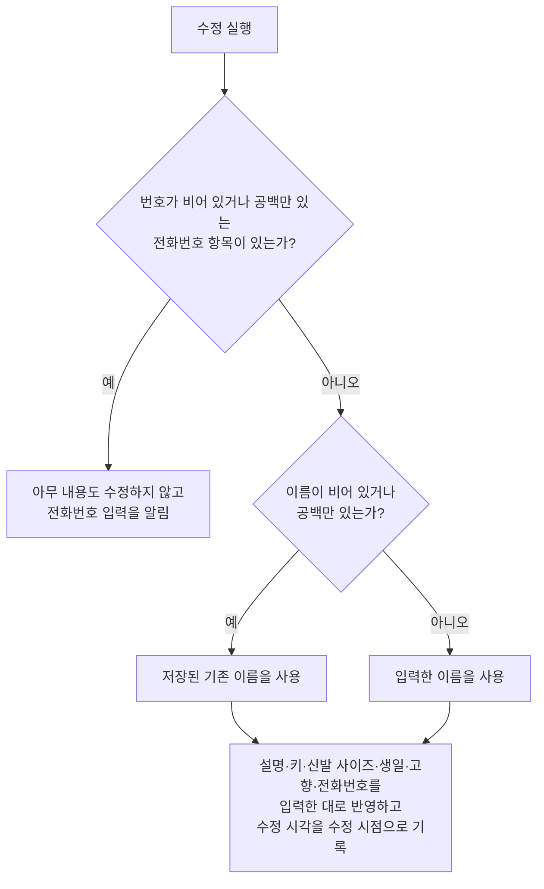

# ContactDetail 화면 스펙

이 문서는 사용자가 선택한 연락처의 상세를 확인하고 이름, 설명, 키, 신발 사이즈, 생일, 고향과 전화번호를 수정하고, 그 연락처의 즐겨찾기를 바꾸고, 그 연락처를 삭제하는 ContactDetail 화면의 내용과 행동을 다룬다. ContactDetail로 진입하는 흐름과 삭제한 연락처가 목록에서 사라지는 것, 즐겨찾기가 목록 순서에 반영되는 것은 [ContactHome 화면 스펙](./contact-home.md)에서, 연락처 목록과 상세를 함께 사용하는 배치는 [Contact 목록·상세 배치 스펙](./contact-list-detail.md)에서, 연락처가 갖는 정보와 키·신발 사이즈·생일·고향·전화번호·즐겨찾기의 규칙은 [ContactAdd 화면 스펙](./contact-add.md)에서, 설명 입력의 행동은 [설명 입력 컴포넌트 스펙](./description-input.md)에서, 대상 연락처를 정하는 계정 기준은 [계정 조회 스펙](./account.md)에서, 연락처를 서버와 맞추는 규칙은 [데이터 동기화 스펙](./data-sync.md)에서 다룬다.

이번 범위는 연락처 목록에서 연락처를 선택해 상세를 확인하고, 저장된 이름·설명·키·신발 사이즈·생일·고향·전화번호를 확인하고 수정하고, 즐겨찾기를 바꾸고, 연락처를 삭제하고, 이 연락처에 연결된 메모를 확인하는 것까지다. 연락처와 태그의 연결은 [ContactAdd 화면 스펙](./contact-add.md)과 같은 기준으로 이번 범위에서 정하지 않으므로 이 화면은 태그 입력을 제공하지 않는다.

화면은 연락처 디테일, 메모 두 탭으로 나뉜다. 이 문서는 화면 전체와 연락처 디테일 탭을 소유하고, 메모 탭의 내용과 행동은 [ContactDetail 메모 탭 스펙](./contact-detail-memo.md)이 소유한다.

진입할 때의 입력 초점, 내용 수정의 반영과 성공 결과, 요청 제한과 저장 계약은 [항목 상세 화면 공통 스펙](./entity-detail.md)을 따른다. 태그 입력을 제공하지 않으므로 그 문서의 태그 입력 관련 규칙은 적용하지 않는다.

디자인: [ContactDetail 화면 디자인](../design/contact-detail.md)

## feature

### 진입과 내용

사용자는 ContactHome 화면의 연락처 목록에서 연락처를 선택해 그 연락처의 ContactDetail 화면으로 이동한다. 목록과 상세를 함께 사용할 수 있는 환경에서는 이동하지 않고 목록과 함께 표시된 상세 영역에서 같은 내용을 사용하며, 그 기준은 [Contact 목록·상세 배치 스펙](./contact-list-detail.md)을 따른다.

사용자는 캘린더 홈 화면에 표시된 생일을 선택해서도 그 연락처의 ContactDetail 화면으로 이동한다. 이 경로로 진입한 화면은 연락처 목록과 함께 표시하지 않으며, 진입 흐름은 [CalendarHome 스펙](./calendar-home.md)의 `생일 선택`을 따른다.

연락처 조회에 성공하면 사용자는 저장된 이름, 설명, 키, 신발 사이즈, 생일, 고향과 전화번호를 확인하고 수정할 수 있으며, 그 연락처의 즐겨찾기를 바꾸고 그 연락처를 삭제할 수 있다. 화면 제목에는 대상 연락처의 최신 저장 이름을 표시한다.

### 탭 전환

화면은 연락처 디테일, 메모 두 탭으로 나뉘고 이 순서로 놓인다. 연락처 디테일 탭에서는 이 문서의 `내용 수정`과 `전화번호 입력`을, 메모 탭에서는 [ContactDetail 메모 탭 스펙](./contact-detail-memo.md)의 행동을 실행한다.

화면에 처음 진입하면 연락처 디테일 탭이 선택된 상태로 시작한다.

사용자는 탭을 직접 선택해 전환할 수 있고, 본문을 좌우로 밀어서도 전환할 수 있다. 전환 방법과 관계없이 선택한 탭과 표시하는 내용은 항상 일치한다.

연락처 조회 중에도 사용자는 탭을 전환할 수 있다. 조회 결과가 탭 전환을 막지 않는다.

탭을 전환해도 다른 탭에서 하던 일은 사라지지 않는다. 연락처 디테일 탭에서 수정 중이던 이름, 설명, 키, 신발 사이즈, 생일, 고향과 전화번호는 다른 탭에 다녀와도 그대로 남아 있고, 메모 탭에서 보던 목록 위치도 다른 탭에 다녀오면 그대로 유지된다.

즐겨찾기 변경과 삭제는 선택한 탭과 관계없이 항상 실행할 수 있다.

### 조회 상태

처음에는 연락처 조회 중 상태를 제공하며 내용 수정과 즐겨찾기 변경과 삭제를 실행할 수 없다.

조회에 성공하면 내용 표시 상태로 바뀐다. 연락처를 조회할 수 없거나 조회에 실패하면 조회 중 상태를 유지하며, 별도의 오류 안내는 제공하지 않는다.

조회 상태는 연락처 디테일 탭의 내용과 화면 제목, 즐겨찾기 변경과 삭제에만 적용한다. 메모 탭의 표시 기준은 [ContactDetail 메모 탭 스펙](./contact-detail-memo.md)을 따르므로 연락처를 아직 조회하지 못했어도 메모 목록은 그대로 표시한다.

### 내용 수정

사용자는 이름, 설명, 키, 신발 사이즈, 생일, 고향과 전화번호를 입력하거나 바꿀 수 있다. 각 입력에서 할 수 있는 조작은 [ContactAdd 화면 스펙](./contact-add.md)의 `키와 신발 사이즈 입력`, `생일 입력`, `고향 입력`, `전화번호 입력`을 따른다.

사용자가 입력한 이름, 설명, 키, 신발 사이즈, 생일, 고향 또는 전화번호가 저장된 내용과 하나라도 다를 때만 수정 반영 동작을 제공한다. 입력한 내용이 저장된 내용과 같으면 수정 동작을 제공하지 않는다.

수정 시점에 이름이 비어 있거나 공백만 있으면 저장된 기존 이름을 유지한 채 나머지 내용만 반영한다.

수정에 실패하면 화면과 입력 내용을 유지하며 진행 상태만 해제한다. 사용자는 수정을 다시 실행할 수 있다.

### 전화번호 입력

화면에 처음 들어오면 저장된 전화번호가 저장된 순서대로 전화번호 항목에 채워진다. 저장된 전화번호가 하나도 없으면 전화번호 항목이 하나도 없는 상태로 시작한다.

사용자가 전화번호 항목을 추가하고 삭제하고 번호를 입력하는 행동은 [ContactAdd 화면 스펙](./contact-add.md)의 `전화번호 입력`을 따른다.

### 전화번호 미입력

번호가 비어 있거나 공백만 있는 전화번호 항목이 하나라도 있는 상태에서 수정을 실행하면 아무 내용도 수정하지 않고 전화번호 입력이 필요하다는 피드백을 제공한다.

입력 중이던 이름, 설명, 키, 신발 사이즈, 생일, 고향과 전화번호 항목은 모두 그대로 유지하므로 사용자는 번호를 입력하거나 그 전화번호 항목을 삭제한 뒤 다시 시도할 수 있다.

번호가 비어 있는 전화번호 항목은 여러 개일 수 있고 사용자가 번호를 채우는 대신 그 항목을 삭제할 수도 있으므로, 입력 초점은 옮기지 않고 사용자가 보고 있던 입력에 그대로 둔다.

### 즐겨찾기

사용자는 대상 연락처를 즐겨찾기로 표시하거나 표시를 해제할 수 있다. 사용자는 지금 그 연락처가 즐겨찾기인지도 함께 확인한다.

즐겨찾기 변경은 누르는 즉시 저장된 내용을 바꾼다. 별도의 확정 동작이 필요하지 않으며, 수정 반영 동작과는 별개로 실행한다.

즐겨찾기 변경은 입력 중이던 이름, 설명, 키, 신발 사이즈, 생일, 고향과 전화번호를 바꾸지 않고, 수정 반영 동작을 제공할지에도 영향을 주지 않는다. 사용자는 내용을 수정하는 중에도 즐겨찾기를 바꿀 수 있다.

즐겨찾기 변경을 처리하는 동안에는 진행 상태를 표시하며, 그동안에도 사용자는 내용 수정과 삭제를 그대로 실행할 수 있다.

즐겨찾기 변경에 성공해도 별도로 안내하지 않는다. 바뀐 결과가 화면에 나타나는 것으로 충분하다.

즐겨찾기 변경에 실패하면 화면과 입력 내용을 유지하며 진행 상태만 해제하고, 저장된 즐겨찾기 여부를 그대로 표시한다. 사용자는 즐겨찾기 변경을 다시 실행할 수 있다.

### 삭제

사용자는 대상 연락처를 삭제할 수 있다. 삭제를 실행하기 전에 확인을 되묻지 않는다.

삭제를 처리하는 동안에는 진행 상태를 표시한다.

삭제에 성공하면 뒤로가기와 같은 결과로 ContactDetail 화면에서 빠져나가 진입하기 전 화면으로 돌아가고, 삭제한 연락처는 그 화면의 목록에서 사라진다. 목록과 상세 영역을 함께 표시하는 상태에서는 상세 영역이 선택한 연락처가 없을 때의 상태로 되돌아가며, 그 상태는 [Contact 목록·상세 배치 스펙](./contact-list-detail.md)의 `상세 영역의 구성`을 따른다.

삭제한 연락처에서 수정 중이던 내용은 유지하지 않는다.

삭제에 실패하면 화면에 머무르며 진행 상태만 해제한다. 사용자는 삭제를 다시 실행할 수 있다.

### 외부 변경

화면이 열려 있는 동안 같은 연락처의 저장 내용이 다른 경로에서 바뀌면 화면 제목을 최신 저장 이름으로, 즐겨찾기 표시를 최신 저장 값으로 갱신한다. 입력 중인 이름, 설명, 키, 신발 사이즈, 생일, 고향과 전화번호 항목은 덮어쓰지 않는다.

다른 기기에서 삭제한 연락처가 서버에서 내려받아져 대상 연락처가 삭제 상태가 되어도 화면은 내용 표시 상태를 유지한다. 사용자는 입력 중이던 내용을 잃지 않고 수정과 즐겨찾기 변경과 삭제를 그대로 실행할 수 있으며, 화면에서 밀려나거나 조회 중 상태로 되돌아가지 않는다.

### 진행 상태 유지

화면이 회전하거나 시스템에 의해 재생성되어도 입력 중이던 이름, 설명, 키, 신발 사이즈, 고른 생일, 고향과 전화번호 항목의 번호·순서, 그리고 선택한 탭을 유지한다.

즐겨찾기 여부는 이미 저장된 값이므로 화면이 재생성되어도 저장된 값을 그대로 다시 표시한다.

수정이나 즐겨찾기 변경이나 삭제를 처리하는 동안, 그리고 저장된 내용이 갱신되어 화면이 다시 그려질 때도 사용자가 보고 있던 화면 위치를 유지한다.

화면을 떠난 뒤 다시 들어오거나 앱을 종료한 뒤 새로 진입하면 수정 중이던 내용을 복원하지 않고 저장된 내용으로 다시 시작한다.

### 뒤로가기

사용자가 뒤로가면 선택한 탭과 관계없이 ContactDetail 화면에 진입하기 전 화면으로 돌아간다. 메모 탭을 선택한 상태에서 뒤로간다고 연락처 디테일 탭으로 먼저 돌아가지 않는다. 반영하지 않은 수정 내용은 저장되지 않는다.

목록과 상세 영역을 함께 표시하는 상태에서 뒤로가기를 실행하면 상세 영역은 선택한 연락처가 없을 때의 화면인 연락처 추가로 되돌아간다.

## domain

### 상세 대상과 내용 표시

상세 대상을 정하는 계정 기준은 [항목 상세 화면 공통 스펙](./entity-detail.md)의 `대상 조회`를 따른다.

삭제 여부는 상세 대상을 정하는 기준이 아니다. 삭제 상태인 연락처도 상세 대상으로 조회하며, 대상 연락처가 삭제 상태로 바뀌어도 화면은 내용 표시 상태를 유지한다. 사용자가 수정 중인 내용을 배경에서 진행되는 동기화가 치우지 않게 하기 위한 것이며, 이때의 화면 동작은 `외부 변경`을 따른다.

사용자가 이 화면에서 삭제를 실행했을 때는 `feature`의 `삭제`에 따라 화면을 떠나므로 이 규칙이 적용되지 않는다.

수정은 삭제 여부를 바꾸지 않으므로, 삭제 상태가 된 연락처를 이 화면에서 수정해도 그 연락처는 삭제 상태로 남는다.

### 선택한 탭

선택한 탭은 화면 표시 상태이며 저장되는 사용자 데이터가 아니다.

화면 재생성과 백그라운드 복귀 후에도 선택한 탭을 유지한다.

사용자가 화면을 떠났다가 다시 진입하거나 앱을 종료하고 다시 실행하면 연락처 디테일 탭으로 초기화한다. 연락처 목록에서 다른 연락처를 선택해 상세 대상이 바뀔 때도 연락처 디테일 탭으로 초기화한다.

연락처의 즐겨찾기 여부와 삭제 여부는 선택할 수 있는 탭을 바꾸지 않는다. 삭제 상태인 연락처의 ContactDetail 화면에서도 두 탭을 모두 사용할 수 있다.

### 입력 내용 채우기

입력 내용은 대상 연락처를 처음 조회한 값으로 한 번만 채운다. 같은 연락처의 저장 내용이 바뀌어도 다시 채우지 않는다.

전화번호는 저장된 순서 그대로 모두 채우며, 같은 번호가 여러 개 있어도 하나로 합치지 않고 각각의 전화번호 항목으로 채운다.

설명이 비어 있으면 빈 설명으로, 키·신발 사이즈·생일·고향이 없으면 비어 있거나 고르지 않은 상태로, 전화번호가 하나도 없으면 전화번호 항목이 없는 상태로 채운다.

즐겨찾기 여부는 입력 내용이 아니라 저장된 값을 그대로 표시하는 값이므로 이 규칙을 적용하지 않는다. 즐겨찾기 표시는 `즐겨찾기 변경`에 따라 저장된 값이 바뀔 때마다 함께 바뀐다.

연락처가 갖는 정보의 정의는 [ContactAdd 화면 스펙](./contact-add.md)의 `연락처의 정보`를, 전화번호의 규칙은 같은 문서의 `전화번호`를, 키와 신발 사이즈와 생일과 고향의 규칙은 같은 문서의 `키와 신발 사이즈`, `생일`, `고향`을 따른다.

### 수정 성립 조건

연락처는 번호가 없는 전화번호를 가질 수 없다. 번호가 비어 있거나 공백 문자로만 이루어진 전화번호 항목이 하나라도 있으면 이름, 설명, 키, 신발 사이즈, 생일, 고향을 포함해 어떤 내용도 수정하지 않는다. 번호가 없는 전화번호 항목을 조용히 빼고 수정하지 않으며, 사용자가 입력한 전화번호가 그대로 기록되지 않는 상태를 만들지 않는다.

이름은 연락처가 반드시 가져야 하는 정보이므로 비우는 수정을 허용하지 않고 저장된 기존 이름을 사용한다. 이름을 비운 것은 기존 이름을 사용하는 것이므로 수정을 막지 않는다.

이름을 비운 상태와 번호가 없는 전화번호 항목이 함께 있으면 전화번호 입력을 알리고 아무 내용도 수정하지 않는다.

### 수정되는 내용

수정은 대상 연락처의 이름, 설명, 키, 신발 사이즈, 생일, 고향과 전화번호를 바꾸고 수정 시각을 수정 시점으로 기록한다.

설명과 고향은 비어 있으면 비어 있는 값으로, 키·신발 사이즈·생일은 비어 있거나 고르지 않았으면 없는 값으로 반영한다. 값이 없는 것을 `0`으로 대신하지 않는 기준은 [ContactAdd 화면 스펙](./contact-add.md)의 `키와 신발 사이즈`를 따른다.

전화번호는 사용자가 배치한 순서대로 모두 반영하며, 전화번호 항목이 하나도 없으면 빈 목록으로 반영한다.

즐겨찾기 여부, 삭제 여부, 생성 시각과 계정 연결은 내용 수정으로 바뀌지 않는다.

### 수정 동작의 제공 기준

입력한 이름, 설명, 키, 신발 사이즈, 생일, 고향 또는 전화번호가 저장된 내용과 하나라도 다르면 수정 동작을 제공한다.

수정 동작은 연락처 디테일 탭을 선택한 동안에만 제공한다. 메모 탭에서는 입력 내용이 저장 내용과 달라도 수정 동작을 제공하지 않고, 연락처 디테일 탭으로 돌아오면 다시 제공한다.

전화번호는 항목의 번호와 순서를 함께 비교한다. 번호가 같아도 순서가 다르면 다른 것으로 보고, 번호가 비어 있는 항목이 추가되어 있어도 저장된 내용과 다른 것으로 본다.

즐겨찾기 여부는 입력하는 값이 아니라 즉시 반영되는 값이므로 이 비교에 넣지 않는다. 즐겨찾기를 바꾸는 것만으로는 수정 동작이 나타나지 않고, 이미 나타난 수정 동작도 사라지지 않는다. 이는 [항목 상세 화면 공통 스펙](./entity-detail.md)의 `수정 동작의 제공 기준`이 태그 연결을 비교에서 빼는 기준과 같다.

### 즐겨찾기 변경

즐겨찾기 변경은 대상 연락처의 즐겨찾기 여부를 지금과 반대 값으로 바꾸고 수정 시각을 변경 시점으로 기록한다. 즐겨찾기 여부가 갖는 의미와 기본값은 [ContactAdd 화면 스펙](./contact-add.md)의 `즐겨찾기`를 따른다.

즐겨찾기 변경은 대상 연락처의 이름, 설명, 키, 신발 사이즈, 생일, 고향, 전화번호, 삭제 여부, 생성 시각과 계정 연결을 바꾸지 않는다.

즐겨찾기 변경이 수정 시각을 갱신하므로, 즐겨찾기를 바꾼 연락처는 [목록 정렬 스펙](./list-sort.md)의 `최근 수정순`에서 앞으로 옮겨진다. 수정 시각은 연락처가 마지막으로 바뀐 시점이고 즐겨찾기 여부도 그 연락처에 저장되는 값이므로, 같은 문서의 `정렬 기준`이 정한 수정의 범위에 포함된다.

대상 연락처가 삭제 상태여도 사용자는 즐겨찾기를 바꿀 수 있다. 즐겨찾기 변경은 삭제 여부를 되돌리지 않는다.

바뀐 즐겨찾기 여부는 [ContactHome 화면 스펙](./contact-home.md)의 `목록 정렬`에 따라 목록의 순서에 반영된다.

### 삭제

삭제는 대상 연락처의 삭제 여부를 삭제로 바꾸고 수정 시각을 삭제 시점으로 갱신한다. 이름, 설명, 키, 신발 사이즈, 생일, 고향, 전화번호와 즐겨찾기 여부는 바꾸지 않는다.

삭제한 연락처는 [ContactHome 화면 스펙](./contact-home.md)의 노출 기준에 따라 연락처 목록에서 사라진다.

### 요청 제한

[항목 상세 화면 공통 스펙](./entity-detail.md)의 `요청 제한`에서 같은 종류로 보는 것은 내용 수정, 즐겨찾기 변경, 삭제이며, 세 종류는 서로를 제한하지 않는다.

메모 탭에서 실행하는 메모의 완료, 삭제와 실행 취소는 이 화면의 요청 제한에 포함하지 않으며, 그 기준은 [ContactDetail 메모 탭 스펙](./contact-detail-memo.md)이 따르는 공통 스펙이 정한다.

## data

### 대상 연락처 조회

상세에 표시할 연락처는 현재 사용자 계정과 대상 식별자를 기준으로 로컬 저장소에서 조회한다. 이 조회는 삭제 여부를 가리지 않으므로 삭제 상태인 연락처도 조회된다. 전화번호는 연락처에 딸린 순서 있는 목록으로, 고향과 즐겨찾기 여부는 연락처가 가지는 값으로 함께 조회한다.

ContactDetail에 진입하는 것만으로는 서버에서 연락처를 다시 가져오지 않는다. 서버와 맞추는 조회는 [데이터 동기화 스펙](./data-sync.md)이 정한 계기에서만 일어난다.

### 수정의 저장

수정을 반영하면 대상 연락처의 이름, 설명, 키, 신발 사이즈, 생일, 고향, 전화번호와 수정 시각을 로컬 저장소에 저장해 기존 값을 덮어쓴다. 즐겨찾기 여부와 계정과의 연결은 바꾸지 않는다.

전화번호는 저장된 목록을 반영한 내용으로 바꾸며, 반영한 순서 그대로 저장한다. 전화번호를 모두 지운 수정을 반영하면 그 연락처의 전화번호는 하나도 남지 않는다.

수정은 현재 사용자 계정과 대상 식별자를 함께 만족하는 연락처에만 반영한다. 그 연락처가 없으면 아무것도 바꾸지 않는다.

### 즐겨찾기의 저장

즐겨찾기 변경을 실행하면 대상 연락처의 즐겨찾기 여부와 수정 시각을 로컬 저장소에 저장해 기존 값을 덮어쓴다. 이름, 설명, 키, 신발 사이즈, 생일, 고향, 전화번호, 삭제 여부, 생성 시각과 계정 연결은 바꾸지 않는다.

즐겨찾기 변경은 현재 사용자 계정과 대상 식별자를 함께 만족하는 연락처에만 반영한다. 그 연락처가 없으면 아무것도 바꾸지 않는다.

### 삭제의 저장

삭제를 실행하면 대상 연락처의 삭제 여부와 수정 시각을 로컬 저장소에 저장한다. 연락처 자체와 계정 연결, 전화번호, 고향, 즐겨찾기 여부는 저장소에서 제거하거나 바꾸지 않는다.

삭제는 현재 사용자 계정과 대상 식별자를 함께 만족하는 연락처에만 반영한다. 그 연락처가 없으면 아무것도 바꾸지 않는다.

### 저장 실패

수정이나 즐겨찾기 변경이나 삭제에 실패하면 실패를 그대로 알리며 성공으로 바꾸지 않는다. 수정에 실패하면 저장된 연락처의 내용은 바뀌지 않고, 즐겨찾기 변경에 실패하면 즐겨찾기 여부는 바뀌지 않으며, 삭제에 실패하면 대상 연락처는 삭제되지 않은 채로 남는다.

### 결과의 표시

수정 내용과 바뀐 즐겨찾기 여부는 [ContactHome 화면 스펙](./contact-home.md)의 연락처 목록처럼 그 연락처를 조회하는 모든 곳에 반영된다.

이름이 바뀌면 [ContactHome 화면 스펙](./contact-home.md)의 `목록 정렬`에 따라 목록에서 이동하고, 첫 번째 전화번호나 생일이 바뀌면 목록에 표시되는 전화번호와 생일도 함께 바뀐다. 즐겨찾기 여부가 바뀌면 같은 `목록 정렬`에 따라 그 연락처가 즐겨찾기 묶음의 안팎으로 옮겨지고, 함께 갱신된 수정 시각이 `최근 수정순`에서의 자리도 바꾼다.

이름이 바뀌면 [메모 연락처 입력 컴포넌트 스펙](./memo-contact-input.md)의 연락처 입력과 연락처 선택 목록에도 바뀐 이름이 나타나고, 삭제하면 그 연락처가 두 곳에서 사라진다. 이는 표시 기준일 뿐이며 저장된 메모와 연락처의 연결은 [메모 연락처 스펙](./memo-contact.md)에 따라 그대로 남는다.

### 수정과 즐겨찾기 변경과 삭제의 동기화

수정, 즐겨찾기 변경, 삭제를 로컬 저장소에 반영하면 그 연락처는 업로드 대기로 기록되고 백그라운드 동기화가 시작된다. 삭제한 연락처도 서버에서 제거하지 않고 삭제 상태로 반영한다.

세 동작의 성공 여부는 로컬 저장 결과로만 판단하며 서버 반영 결과를 기다리지 않는다. 동기화에 실패해도 기기에 반영된 결과는 되돌아가지 않고 다음 동기화 계기에서 다시 시도된다. 업로드 단위와 충돌 기준, 실패 시 재시도는 [데이터 동기화 스펙](./data-sync.md)의 규칙을 따른다.

즐겨찾기 변경도 수정 시각을 갱신하므로 세 동작은 모두 같은 충돌 기준으로 판정된다. 즐겨찾기만 바꾼 연락처도 다른 내용을 수정한 연락처와 같은 방식으로 서버에 반영되며, 서버에 더 늦은 수정이 있으면 [데이터 동기화 스펙](./data-sync.md)의 `충돌 기준`에 따라 서버 내용이 최신이 된다.

같은 연락처를 여러 기기에서 다르게 바꾼 경우 어느 내용을 최신으로 볼지는 [데이터 동기화 스펙](./data-sync.md)의 `충돌 기준`을 따른다. 내려받기로 서버의 더 늦은 수정 내용이 반영되면 그 결과는 `결과의 표시`와 같은 기준으로 나타나며, 화면에서 입력 중인 내용은 `외부 변경`에 따라 덮어쓰지 않는다.

로그인하지 않은 상태에서 수정하거나 삭제한 연락처는 서버에 반영되지 않고 기기 안에만 유지된다.
