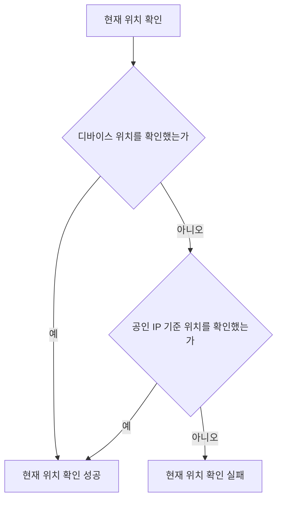

# 현재 위치 확인 스펙

이 문서는 앱이 사용자의 현재 위치를 확인하는 공통 규칙을 다룬다. 사용자에게 직접 노출되는 화면이나 사용자 행동은 없으므로 `feature` 영역은 생략하고, 확인한 위치와 확인 실패를 각각 어떻게 쓰는지는 위치를 사용하는 기능의 스펙에서 다룬다. 위치 권한을 사용자에게 요청하는 흐름은 [위치 권한 요청 스펙](./location-permission.md)에서 다룬다.

현재 위치를 사용하는 기능은 [현재 날씨 동기화](./weather-fetch.md), [장소 보기 모드](./place-view-mode.md)와 [메모 장소 카드](./memo-place-card.md)다. 장소 보기 모드를 배치한 자리는 [PlaceHome 화면](./place-home.md)과 [TagDetail 장소 탭](./tag-detail-place.md)이다.

## domain

### 확인 순서

현재 위치는 디바이스가 제공하는 위치를 우선 사용한다. 디바이스 위치를 확인하지 못하면 사용자의 공인 IP를 기준으로 확인한다.

디바이스 위치를 확인하지 못한 것 자체는 현재 위치 확인 실패가 아니며, 언제나 공인 IP 기준 확인으로 이어진다.

### 디바이스 위치

디바이스 위치에는 정밀한 정확도를 요구하지 않는다. 디바이스가 최근에 확인해 둔 위치가 있으면 새로 확인하지 않고 그 위치를 사용한다.

디바이스 위치는 위치 권한이 이미 허용된 경우에만 사용한다. 현재 위치를 확인하는 과정에서 위치 권한을 새로 요청하지 않는다. 허용 여부를 확인하는 결과와 확인할 수 없는 환경의 처리는 [권한 요청 공통 스펙](./permission.md)의 허용 여부 조회를 따르며, 허용되지 않았으면 디바이스 위치를 사용하지 않는다.

디바이스 위치 확인은 Android, iOS와 웹에서 제공한다. 그 외 환경에서는 디바이스 위치를 확인하지 못한 것으로 다룬다.

Android에서 기기가 위치 서비스를 제공하지 못하거나 확인하는 도중 위치 권한이 회수되면 디바이스 위치를 확인하지 못한 것으로 다룬다.

웹은 브라우저가 위치 기능을 제공할 때만 디바이스 위치를 확인한다. 앱이 보안 연결로 제공되지 않는 등 브라우저가 위치 기능을 제공하지 않는 상황은 디바이스 위치를 확인하지 못한 것으로 다룬다.

웹에서 디바이스 위치 확인은 5초 안에 끝나지 않으면 확인하지 못한 것으로 다룬다. 브라우저는 위치를 확인하지 못해도 확인을 스스로 끝내지 않을 수 있어 두는 상한이며, Android와 iOS에는 별도의 상한을 두지 않는다.

### 공인 IP 기준 위치

공인 IP 기준 위치는 사용자의 공인 IP로 위치를 알려 주는 외부 서비스에 조회해 확인한다.

조회에 실패하면 현재 위치를 확인하지 못한 것으로 다룬다. 실패를 임의의 기본 위치 같은 정상 결과로 바꾸지 않는다.

현재 위치를 확인하지 못했을 때 무엇을 보여 줄지는 위치를 사용하는 기능의 스펙에서 정한다.

## 참고

- [ip-api.com Documentation](https://ip-api.com/docs)
- [MDN Geolocation API](https://developer.mozilla.org/en-US/docs/Web/API/Geolocation_API)
