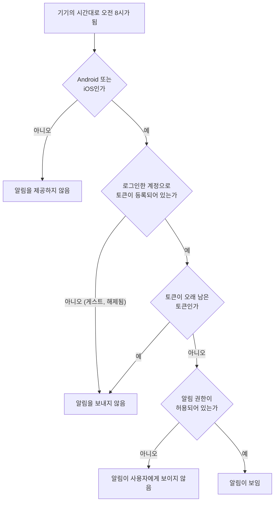
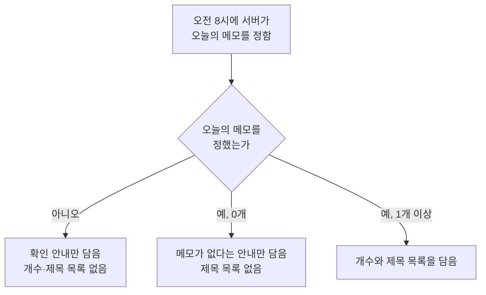

# 일일 메모 알림 스펙

이 문서는 서버가 매일 정해진 시각에 로그인한 사용자의 기기로 오늘의 메모를 알려 주는 알림을 보내는 규칙을 다룬다.

알림을 받을 기기는 [FCM 토큰 등록 스펙](./fcm-token.md)에 따라 서버에 등록된 기기다. 토큰을 언제 등록하고 해제하는지는 그 문서가 소유하고, 이 문서는 등록된 기기에 무엇을 언제 보내는지만 정한다.

알림을 보려면 알림 권한이 필요하고, 권한을 언제 어떻게 요청하는지는 [알림 권한 요청 스펙](./notification-permission.md)이 소유한다.

알림에 표시하는 정확한 문구와 표현은 [일일 메모 알림 디자인](../design/daily-memo-notification.md)이 소유한다.

메모의 기간과 상태 개념은 [MemoAdd 화면 스펙](./memo-add.md)을 따르고, 기기의 메모가 서버에 반영되는 시점은 [데이터 동기화 스펙](./data-sync.md)을 따른다.

## feature

### 오늘의 메모 확인 안내 받기

로그인한 사용자는 Android와 iOS 기기에서 매일 아침 정해진 시각에 오늘의 메모를 알려 주는 알림을 받는다.

알림을 받기 위해 사용자가 앱에서 따로 준비할 일은 없다. 알림은 앱을 사용하고 있지 않을 때도 도착하고, 앱을 오랫동안 실행하지 않아도 계속 도착한다. 어떤 기기가 받는지는 `domain > 알림을 받는 기기`를 따른다.

알림에는 오늘의 메모가 몇 개인지와 각 메모의 제목이 담긴다. 어떤 메모가 오늘의 메모인지는 `domain > 오늘의 메모`가 정한다. 다른 기기에서 바꾼 메모도 서버에 반영되어 있으면 알림에 담긴다. 반대로 이 기기에서 바꾸었지만 아직 서버에 올라가지 않은 변경은 알림에 반영되지 않는다.

오늘의 메모가 하나도 없으면 알림은 메모가 없다는 안내만 담고 제목 목록을 두지 않는다.

게스트는 알림을 받지 않는다. 게스트로 작성한 메모는 알림 대상이 아니며, 로그인하면 그 뒤에 오는 첫 알림부터 받는다.

### 알림에서 앱 열기

사용자가 알림을 선택하면 앱이 열린다.

앱은 알림 때문에 특정 화면으로 이동하지 않고, 사용자가 앱을 직접 실행했을 때와 같은 화면에서 시작한다. 앱이 이미 실행 중이면 실행 중이던 앱이 앞으로 나오고 보고 있던 화면이 그대로 유지된다.

사용자가 알림을 선택하지 않고 지우거나 그대로 두어도 앱에서 달라지는 것은 없다.

### 알림 그만 받기

앱은 이 알림을 끄는 설정을 제공하지 않는다.

사용자가 알림을 그만 받으려면 시스템의 알림 설정에서 이 앱의 알림을 끈다. 시스템에서 알림을 끄면 알림이 보이지 않고, 그 밖에 앱에서 할 수 있는 행동은 줄어들지 않는다.

로그아웃한 기기에는 알림이 오지 않는다. 로그아웃 뒤에도 잠시 알림이 도착할 수 있는 경우는 `domain > 알림을 받는 기기`를 따른다.

## domain

### 오늘의 메모

오늘의 메모는 알림을 받는 계정과 연결되어 서버에 저장된 메모 중 다음을 모두 만족하는 메모다.

- 기간이 있고, 그 기간이 알림이 발생하는 날과 하루라도 겹친다.
- 완료되지 않았다.
- 삭제되지 않았다.

알림이 발생하는 날은 `발생 시각`이 정하는 기기 시간대의 날짜다.

겹침은 날짜 단위로 판단한다. 시각이 있는 기간도 시각을 무시하고 시작일과 종료일만으로 비교한다. 기간이 없는 메모는 오늘의 메모가 되지 않는다.

완료된 메모는 오늘의 메모에서 제외한다. 이 알림은 사용자가 확인할 일을 알려 주는 것이므로 이미 끝낸 메모는 담지 않는다. 완료된 메모도 표시하는 [캘린더 메모 표시 스펙](./calendar-memo.md)의 노출 기준과 다른 결정이다.

오늘의 메모 순서는 [캘린더 메모 표시 스펙](./calendar-memo.md)의 `조회 결과 정렬`을 따른다.

### 알림을 받는 기기

알림은 [FCM 토큰 등록 스펙](./fcm-token.md)에 따라 서버에 등록된 토큰마다 하나씩 보낸다. 따라서 알림을 받는 기기는 다음을 모두 만족하는 기기다.

- Android 또는 iOS다.
- 로그인한 계정으로 토큰이 등록되어 있다.

같은 계정으로 여러 기기에 로그인했으면 기기마다 알림을 받는다. 각 기기의 알림은 그 기기가 등록한 시간대와 언어를 따르므로, 기기마다 도착 시각과 문구 언어가 다를 수 있다.

로그아웃한 기기는 토큰 해제가 서버에 반영된 뒤부터 알림을 받지 않는다. 해제가 반영되기 전까지 이전 계정의 알림이 도착할 수 있으며, 그 기준은 [FCM 토큰 등록 스펙](./fcm-token.md)의 `로그아웃과 해제`를 따른다.

JVM 데스크톱과 웹은 이 알림을 제공하지 않는다. 두 환경에서도 앱은 그대로 사용할 수 있고 알림을 제공하지 않는다는 안내는 표시하지 않는다.

### 발생 시각

알림은 기기의 시간대로 매일 오전 8시에 발생한다. 기기의 시간대는 서버가 그 기기에서 마지막으로 등록받은 값이며, 등록 기준은 [FCM 토큰 등록 스펙](./fcm-token.md)의 `등록 정보`를 따른다.

사용자가 기기의 시간대를 바꾸면 바뀐 값이 서버에 등록된 뒤부터 새 시간대의 오전 8시에 알림이 온다. 앱을 열지 않은 채 시간대를 바꾸면 다음에 앱을 열어 등록되기 전까지 이전 시간대의 오전 8시에 온다. 시간대 변경 때문에 같은 날 알림이 두 번 오거나 하루가 건너뛰어질 수 있으며, 이를 보정하지 않는다.

알림은 서버가 보낸 뒤 기기에 도착하므로 오전 8시보다 조금 늦게 보일 수 있다. 기기가 네트워크에 연결되어 있지 않으면 연결된 뒤에 도착한다. 알림이 발생한 날이 기기 시간대로 끝날 때까지 도착하지 못한 알림은 버려지고 나중에 도착하지 않는다.

앱은 사용자가 발생 시각을 바꿀 수 있는 수단을 제공하지 않는다.

### 발생 조건

알림 권한이 허용되어 있어야 사용자에게 알림이 보인다. 권한이 허용되어 있지 않으면 알림은 사용자에게 보이지 않으며, 앱은 이를 사용자에게 따로 안내하지 않는다. 권한이 거부되어 있어도 토큰은 등록되고 서버는 알림을 보내며, 그 결정은 [FCM 토큰 등록 스펙](./fcm-token.md)의 `등록 정보`를 따른다.

메모의 존재 여부, 마지막으로 앱을 사용한 시점, 앱이 실행 중인지는 발생 조건이 아니다. 오늘의 메모가 하나도 없는 날에도 알림은 발생한다.

### 알림 내용을 정하는 시점

알림 내용은 알림이 발생하는 시점에 서버에 저장된 데이터로 정한다. 기기에 저장된 메모는 사용하지 않는다.

알림이 발생하기 전에 서버에 반영된 추가·수정·완료·삭제는 알림에 담기고, 그 뒤에 반영된 변경은 다음 알림부터 담긴다. 기기에서 바꾼 메모가 서버에 반영되는 시점은 [데이터 동기화 스펙](./data-sync.md)을 따른다.

오늘의 메모를 정하지 못하면 알림을 보내지 않는 대신, 오늘의 메모를 확인하라는 안내만 담고 개수와 제목 목록을 두지 않은 알림을 보낸다. 사용자에게 실패를 따로 알리지 않는다.

### 알림 문구의 언어

알림 문구는 서버가 그 기기에서 마지막으로 등록받은 언어로 만든다. 기기 언어를 바꾸면 바뀐 값이 서버에 등록된 뒤에 오는 알림부터 새 언어로 표시된다.

등록된 언어를 지원하지 않으면 영어로 표시한다. 문구 자체는 [일일 메모 알림 디자인](../design/daily-memo-notification.md)이 소유한다.

### 하루에 표시되는 알림

같은 날의 알림은 한 기기에 하나만 보인다. 서버가 같은 날 알림을 다시 보내더라도 나중에 도착한 알림이 앞서 도착한 알림을 대신한다.

사용자가 지우지 않은 이전 날의 알림이 남아 있으면 새 알림이 그 자리를 대신한다. 한 기기에는 이 알림이 하나만 남는다.

### 실행 경계에서의 유지

알림은 서버가 보내므로 앱의 실행 상태와 무관하다. 앱을 종료하거나 기기를 다시 시작하거나 앱을 오랫동안 실행하지 않아도 알림은 계속 발생한다.

화면이 재생성되거나 앱이 백그라운드에 갔다가 돌아오는 것은 알림에 아무 영향을 주지 않는다. 앱을 실행한다고 알림이 추가로 발생하거나 발생 시각이 바뀌지 않는다.

## data

### 오늘의 메모 조회

오늘의 메모는 서버에 저장된 메모에서 조회한다. 기기에 저장된 메모는 사용하지 않는다.

조회는 토큰에 연결된 계정과 연결된 메모 중 기간이 있고 완료되지 않았으며 삭제되지 않았고 알림이 발생하는 날과 겹치는 메모만 대상으로 한다. 알림이 발생하는 날은 토큰에 등록된 시간대의 날짜다. 캘린더의 태그 필터처럼 화면이 더한 표시 조건은 이 조회에 적용하지 않는다.

조회 결과에는 알림에 필요한 값만 담기며, 결과 정렬은 `domain > 오늘의 메모`를 따른다.

서버가 메모를 조회하지 못하면 결과를 비워서 다루지 않고 실패로 다룬다. 실패한 알림의 내용은 `domain > 알림 내용을 정하는 시점`을 따른다.

### 발송

서버는 등록된 토큰마다 그 토큰의 시간대로 오전 8시가 되면 알림을 하나 보낸다. 알림 문구는 서버가 만들고, 기기는 받은 내용을 그대로 표시한다. 기기는 알림을 만들거나 표시하기 위해 앱 코드를 실행하지 않는다.

알림에는 같은 날의 알림을 서로 대신하게 하는 식별자와 알림이 발생한 날이 끝나는 시점의 만료 기한을 담는다. 이 두 값이 `domain > 하루에 표시되는 알림`과 `domain > 발생 시각`의 도착 규칙을 만든다.

한 토큰의 발송이 실패해도 다른 토큰의 발송은 계속하고, 실패한 토큰에는 같은 날 다시 보내지 않으며 다음 날 알림부터 다시 보낸다. 발송 실패는 사용자에게 알리지 않고 서버 오류 보고로 남긴다.

### 오래 남은 토큰의 정리

서버는 마지막 등록 뒤 60일이 지난 토큰을 오래 남은 토큰으로 본다. 오래 남은 토큰에는 알림을 보내지 않고 서버에서 지운다. 앱을 열면 토큰이 다시 등록되므로, 60일 안에 한 번이라도 앱을 연 기기는 계속 알림을 받는다.

발송 시점에 FCM이 더 이상 유효하지 않다고 답한 토큰도 서버에서 지운다. 앱을 삭제했거나 FCM이 토큰을 새로 발급한 기기의 이전 토큰이 여기에 해당한다. 새 토큰은 [FCM 토큰 등록 스펙](./fcm-token.md)의 `제출 계기`에 따라 다시 등록된다.

토큰이 지워진 기기는 다음에 앱을 열어 토큰을 다시 등록하기 전까지 알림을 받지 않는다.

## 참고

- [Firebase Cloud Messaging: 메시지 유형](https://firebase.google.com/docs/cloud-messaging/concept-options)
- [Firebase Cloud Messaging: 등록 토큰 관리](https://firebase.google.com/docs/cloud-messaging/manage-tokens)
- [Firebase Cloud Messaging: FCM HTTP v1 API 메시지](https://firebase.google.com/docs/reference/fcm/rest/v1/projects.messages)
- [Apple: apns-collapse-id](https://developer.apple.com/documentation/usernotifications/sending-notification-requests-to-apns)
