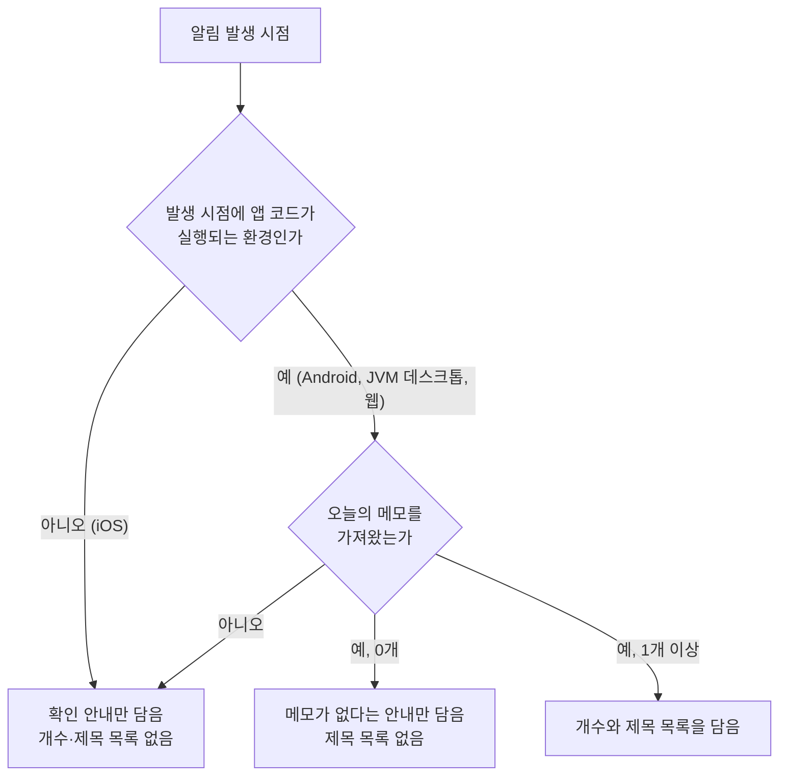
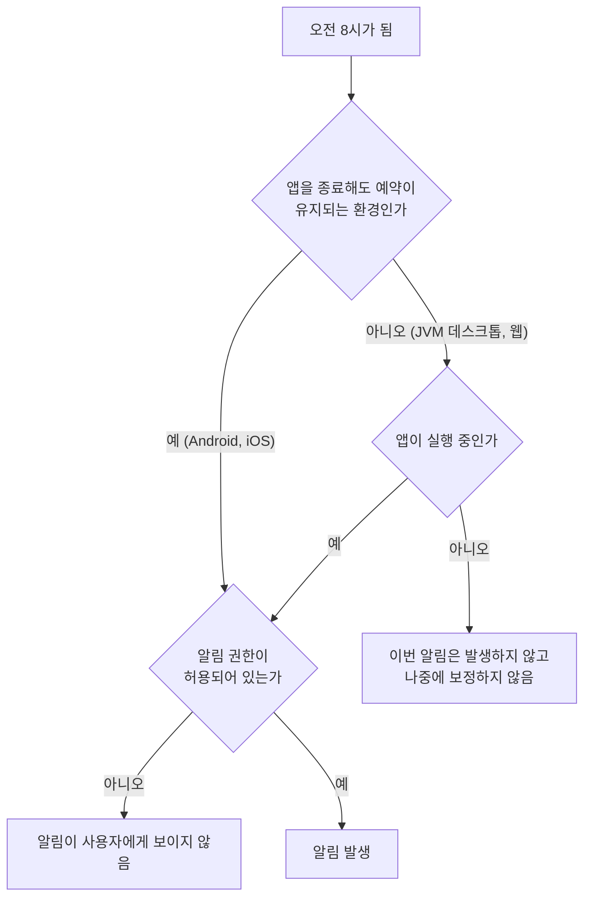

# 일일 메모 알림 스펙

이 문서는 앱이 매일 정해진 시각에 오늘의 메모를 알려 주는 알림을 보내는 규칙을 다룬다.

알림을 보내려면 알림 권한이 필요하고, 권한을 언제 어떻게 요청하는지는 [알림 권한 요청 스펙](./notification-permission.md)이 소유한다. 이 문서는 권한이 정해진 뒤 알림이 언제 발생하고 무엇을 담으며 사용자가 무엇을 할 수 있는지만 정한다.

알림에 표시하는 정확한 문구와 표현은 [일일 메모 알림 디자인](../design/daily-memo-notification.md)이 소유한다.

메모의 기간과 상태 개념은 [MemoAdd 화면 스펙](./memo-add.md)을 따른다.

## feature

### 오늘의 메모 확인 안내 받기

사용자는 매일 아침 정해진 시각에 오늘의 메모를 알려 주는 알림을 받는다.

알림을 받기 위해 사용자가 앱에서 따로 준비할 일은 없다. 알림은 앱을 사용하고 있지 않을 때도 도착할 수 있으며, 어떤 상황에서 도착하는지는 `domain > 알림 예약이 유지되는 범위`를 따른다.

알림에는 오늘의 메모가 몇 개인지와 각 메모의 제목이 담긴다. 어떤 메모가 오늘의 메모인지는 `domain > 오늘의 메모`가, 알림 내용을 언제 정하는지는 `domain > 알림 내용을 정하는 시점`이 정한다.

오늘의 메모가 하나도 없으면 알림은 메모가 없다는 안내만 담고 제목 목록을 두지 않는다.

### 알림에서 앱 열기

사용자가 알림을 선택하면 앱이 열린다.

앱은 알림 때문에 특정 화면으로 이동하지 않고, 사용자가 앱을 직접 실행했을 때와 같은 화면에서 시작한다. 앱이 이미 실행 중이면 실행 중이던 앱이 앞으로 나오고 보고 있던 화면이 그대로 유지된다.

사용자가 알림을 선택하지 않고 지우거나 그대로 두어도 앱에서 달라지는 것은 없다.

### 알림 그만 받기

앱은 이 알림을 끄는 설정을 제공하지 않는다.

사용자가 알림을 그만 받으려면 시스템의 알림 설정에서 이 앱의 알림을 끈다. 시스템에서 알림을 끄면 앱은 알림을 보내지 않고, 그 밖에 앱에서 할 수 있는 행동은 줄어들지 않는다.

## domain

### 오늘의 메모

오늘의 메모는 현재 사용자 계정과 연결된 메모 중 다음을 모두 만족하는 메모다.

- 기간이 있고, 그 기간이 알림이 발생하는 날과 하루라도 겹친다.
- 완료되지 않았다.
- 삭제되지 않았다.

겹침은 날짜 단위로 판단한다. 시각이 있는 기간도 시각을 무시하고 시작일과 종료일만으로 비교한다. 기간이 없는 메모는 오늘의 메모가 되지 않는다.

완료된 메모는 오늘의 메모에서 제외한다. 이 알림은 사용자가 확인할 일을 알려 주는 것이므로 이미 끝낸 메모는 담지 않는다. 완료된 메모도 표시하는 [캘린더 메모 표시 스펙](./calendar-memo.md)의 노출 기준과 다른 결정이다.

현재 사용자 계정은 [계정 조회 스펙](./account.md)을 따른다. 게스트 상태에서는 게스트로 작성한 메모가 오늘의 메모다.

오늘의 메모 순서는 [캘린더 메모 표시 스펙](./calendar-memo.md)의 `조회 결과 정렬`을 따른다.

### 알림 내용을 정하는 시점

알림에 담는 오늘의 메모는 알림이 발생하는 시점에 정한다. 알림이 발생하는 날은 그 시점의 기기 현지 날짜다.

알림을 예약한 뒤 발생하기 전까지 메모가 추가·수정·완료·삭제되거나 현재 사용자 계정이 바뀌면, 알림에는 발생 시점의 결과가 담긴다.

알림이 발생하는 시점에 앱 코드가 실행되지 않는 환경에서는 오늘의 메모를 정할 수 없다. 이때 알림은 오늘의 메모를 확인하라는 안내만 담고 개수와 제목 목록을 두지 않는다. 어떤 환경이 여기에 해당하는지는 `알림 예약이 유지되는 범위`를 따른다.

오늘의 메모를 가져오지 못하면 알림을 보내지 않는 대신, 오늘의 메모를 정할 수 없는 환경과 같은 안내만 담아 알림을 보낸다. 사용자에게 실패를 따로 알리지 않는다.

### 발생 시각

알림은 기기의 현지 시각으로 매일 오전 8시 정각에 발생한다.

사용자가 기기의 시간대나 시각을 바꾸면 그 뒤에 정해지는 알림부터 바뀐 기준의 오전 8시를 따른다. 이미 기다리고 있는 알림은 정해질 때의 기준을 그대로 따르므로, 기준을 바꾼 뒤 첫 알림은 바뀌기 전 기준의 시각에 올 수 있다.

앱은 사용자가 발생 시각을 바꿀 수 있는 수단을 제공하지 않는다.

### 발생 조건

알림 권한이 허용되어 있어야 사용자에게 알림이 보인다. 권한이 허용되어 있지 않으면 알림은 사용자에게 보이지 않으며, 앱은 이를 사용자에게 따로 안내하지 않는다.

알림 권한 개념이 없는 환경에서는 권한과 무관하게 알림이 발생한다.

메모의 존재 여부, 로그인 여부, 마지막으로 앱을 사용한 시점은 발생 조건이 아니다. 오늘의 메모가 하나도 없는 날에도 알림은 발생한다.

### 알림 예약이 유지되는 범위

앱을 종료한 뒤에도 알림 예약이 유지되는지는 환경에 따라 다르다.

- Android와 iOS에서는 앱을 종료하거나 기기를 다시 시작해도 예약이 유지되어 매일 오전 8시에 알림이 발생한다.
- JVM 데스크톱과 웹에서는 앱이 실행 중일 때만 알림이 발생한다.

Android, JVM 데스크톱, 웹에서는 알림이 발생하는 시점에 앱 코드가 실행되어 오늘의 메모를 정한다. iOS에서는 알림을 미리 등록해 두고 시스템이 정해진 시각에 표시하므로 발생 시점에 앱 코드가 실행되지 않으며, 알림 내용은 `알림 내용을 정하는 시점`의 정할 수 없는 환경을 따른다.

JVM 데스크톱과 웹에서 앱이 실행 중이 아닌 동안 지나간 오전 8시의 알림은 발생하지 않는다. 지나간 알림을 나중에 몰아서 보내거나 앱을 다시 실행한 시점에 대신 보내지 않는다. 앱을 다시 실행하면 그 뒤에 오는 첫 오전 8시부터 다시 알림이 발생한다.

웹에서 브라우저가 알림 기능을 제공하지 않거나 JVM 데스크톱에서 시스템이 알림을 띄울 자리를 제공하지 않으면 알림이 발생하지 않는다. 이때도 앱은 그대로 사용할 수 있고 별도 안내를 표시하지 않는다.

### 하루에 표시되는 알림

같은 날의 알림은 사용자에게 하나만 보인다.

앱을 여러 번 실행하거나 웹에서 여러 탭에 앱을 열어 두어 같은 날의 알림이 여러 번 발생하더라도, 나중에 발생한 알림이 앞서 발생한 알림을 대신하므로 사용자에게는 같은 안내가 하나만 남는다.

### 실행 경계에서의 유지

화면이 재생성되거나 앱이 백그라운드에 갔다가 돌아와도 알림 예약은 바뀌지 않는다. 이런 변화 때문에 알림이 추가로 발생하거나 예약이 사라지지 않는다.

앱을 다시 실행하면 예약을 다시 확인한다. 이미 같은 예약이 있으면 예약을 하나로 유지하고, 발생 시각은 앞당겨지지 않는다.

## data

### 오늘의 메모 조회

오늘의 메모는 기기에 저장된 메모에서 조회한다. 알림을 만들 때 원격에서 따로 받아 오지 않으며, 원격 데이터가 기기에 반영되는 시점은 [데이터 동기화 스펙](./data-sync.md)을 따른다.

조회는 현재 사용자 계정과 연결된 메모 중 기간이 있고 완료되지 않았으며 삭제되지 않았고 알림이 발생하는 날과 겹치는 메모만 대상으로 한다. 캘린더의 태그 필터처럼 화면이 더한 표시 조건은 이 조회에 적용하지 않는다.

조회 결과에는 알림에 필요한 값만 담기며, 결과 정렬은 `domain > 오늘의 메모`를 따른다.

### 조회 실패

기기에서 메모를 조회하지 못하면 결과를 비워서 전달하지 않고 실패로 전달한다. 실패한 알림의 내용은 `domain > 알림 내용을 정하는 시점`을 따른다.

## 참고

- [Android WorkManager 주기적 작업](https://developer.android.com/develop/background-work/background-tasks/persistent/getting-started/define-work#schedule_periodic_work)
- [Apple UNCalendarNotificationTrigger](https://developer.apple.com/documentation/usernotifications/uncalendarnotificationtrigger)
- [MDN Notification](https://developer.mozilla.org/en-US/docs/Web/API/Notification)
- [Java SystemTray](https://docs.oracle.com/en/java/javase/21/docs/api/java.desktop/java/awt/SystemTray.html)
