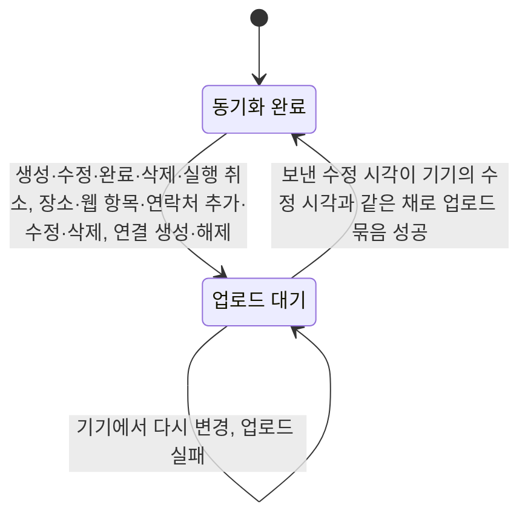
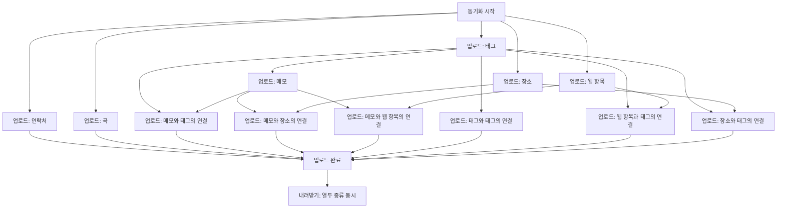
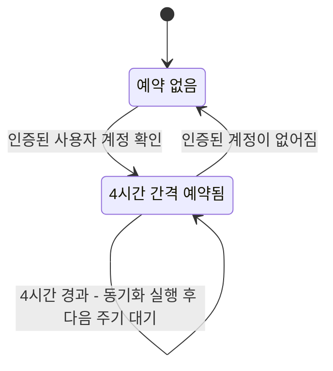

# 데이터 동기화 스펙

이 문서는 사용자 계정과 연결된 메모, 태그, 장소, 웹 항목, 연락처, 곡, 그리고 메모와 태그의 연결, 메모와 장소의 연결, 메모와 웹 항목의 연결, 태그와 태그의 연결, 웹 항목과 태그의 연결, 장소와 태그의 연결을 서버 저장소와 동기화하는 규칙을 다룬다. 메모와 태그의 생성·수정·완료·삭제 자체의 규칙은 [MemoAdd 화면 스펙](./memo-add.md), [MemoDetail 화면 스펙](./memo-detail.md), [MemoHome 목록 스펙](./memo-home.md), [TagAdd 화면 스펙](./tag-add.md), [TagDetail 화면 스펙](./tag-detail.md)을, 장소의 추가·수정·삭제 자체의 규칙은 [PlaceAdd 화면 스펙](./place-add.md)과 [PlaceDetail 화면 스펙](./place-detail.md)을, 웹 항목의 추가·수정·삭제 자체의 규칙은 [WebAdd 화면 스펙](./web-add.md)과 [WebDetail 화면 스펙](./web-detail.md)을, 연락처의 추가·수정·삭제 자체의 규칙은 [ContactAdd 화면 스펙](./contact-add.md)과 [ContactDetail 화면 스펙](./contact-detail.md)을, 곡의 추가 자체의 규칙은 [MusicAdd 화면 스펙](./music-add.md)을 따르며, 이 문서는 그 결과를 서버와 맞추는 흐름만 다룬다. 메모와 태그의 연결 규칙은 [메모 태그 스펙](./memo-tag.md)을, 메모와 장소의 연결 규칙은 [메모 장소 스펙](./memo-place.md)을, 메모와 웹 항목의 연결 규칙은 [메모 웹 스펙](./memo-web.md)을, 태그와 태그의 연결 규칙은 [태그 연결 스펙](./tag-link.md)을, 웹 항목과 태그의 연결 규칙은 [웹 태그 스펙](./web-tag.md)을, 장소와 태그의 연결 규칙은 [장소 태그 스펙](./place-tag.md)을, 메모가 가지는 대표 태그의 규칙은 [메모 대표 태그 스펙](./memo-primary-tag.md)을 따른다. 동기화 자체는 화면 없이 백그라운드에서 진행되므로 이 문서에서는 `feature` 영역을 생략한다. 사용자가 동기화를 직접 요청하는 조작과 진행을 알리는 기준은 [새로고침 스펙](./sync-refresh.md)에서 다룬다.

메모, 태그, 장소, 웹 항목, 연락처, 곡과 여섯 종류의 연결은 모두 여러 계정이나 그룹과 같은 내용을 공유할 수 있지만, 이번 범위에서는 사용자 계정과의 연결만 서버에 반영한다. 그룹과의 연결 및 그룹을 통한 동기화는 후속 범위에서 다룬다.

한 사용자가 여러 기기에서 같은 계정의 데이터를 동기화하는 것을 지원한다. 여러 기기에서 같은 항목을 바꾼 경우도 이번 범위에 포함하며, 아래의 수정 시각 충돌 기준으로 하나의 최신 상태를 정한다.

## domain

### 동기화 대상

동기화 대상은 로그인한 사용자 계정과 연결된 다음 열두 종류다.

| 종류 | 대상 |
| --- | --- |
| 태그 | 계정과 연결된 태그 |
| 장소 | 계정과 연결된 장소 |
| 웹 항목 | 계정과 연결된 웹 항목 |
| 연락처 | 계정과 연결된 연락처 |
| 곡 | 계정과 연결된 곡 |
| 메모 | 계정과 연결된 메모 |
| 메모와 태그의 연결 | 계정과 연결된 메모·태그 사이의 연결 |
| 메모와 장소의 연결 | 계정과 연결된 메모·장소 사이의 연결 |
| 메모와 웹 항목의 연결 | 계정과 연결된 메모·웹 항목 사이의 연결 |
| 태그와 태그의 연결 | 계정과 연결된 태그·태그 사이의 연결 |
| 웹 항목과 태그의 연결 | 계정과 연결된 웹 항목·태그 사이의 연결 |
| 장소와 태그의 연결 | 계정과 연결된 장소·태그 사이의 연결 |

동기화는 열두 종류를 각각 별개의 종류로 다룬다. 종류별로 업로드 요청과 내려받기 요청, 내려받기 위치를 따로 둔다.

태그와 장소와 웹 항목과 연락처와 곡은 다른 종류를 참조하지 않는 독립된 엔티티이고, 메모는 대표 태그로 태그를 참조하며, 여섯 연결 종류는 각각 메모와 태그, 메모와 장소, 메모와 웹 항목, 태그와 태그, 웹 항목과 태그, 장소와 태그를 함께 참조한다. 이 참조 관계가 아래의 업로드 순서를 정한다.

웹 항목이 갖는 요청 헤더 목록은 웹 항목에 딸린 값이므로 별개의 동기화 종류로 두지 않고 웹 항목의 전체 상태에 포함해 함께 반영한다. 연락처가 갖는 전화번호 목록도 같은 기준으로 연락처의 전체 상태에 포함해 함께 반영한다.

게스트 상태의 데이터는 동기화하지 않고 기기 안에만 유지한다.

### 로컬 우선 원칙

메모와 태그의 생성, 수정, 완료, 삭제, 실행 취소와 장소의 추가, 수정, 삭제, 웹 항목의 추가, 수정, 삭제, 연락처의 추가, 수정, 삭제, 곡의 추가는 항상 기기 저장소에 먼저 반영되고, 화면은 기기 저장소의 내용을 기준으로 표시된다.

동기화는 기기 반영이 끝난 뒤 백그라운드에서 진행되며, 진행 여부나 결과가 사용자의 화면 사용과 다음 행동을 막지 않는다.

동기화가 실패하거나 서버에 도달하지 못해도 기기에 저장된 사용자 데이터는 사라지거나 되돌아가지 않는다.

### 동기화 상태

계정과 연결된 열두 종류의 항목은 모두 계정과 항목의 연결 단위로 동기화 상태를 가진다.

동기화 상태는 다음 중 하나다.

- 업로드 대기: 기기에서 바뀐 내용이 아직 서버에 반영되지 않은 상태
- 동기화 완료: 현재 기기에 서버로 보낼 대기 항목이 없는 상태. 서버가 현재 기기의 내용을 최신으로 채택했다는 뜻은 아니다.

메모나 태그에 생성, 수정, 완료, 삭제, 실행 취소가 발생하거나, 장소나 웹 항목이나 연락처에 추가, 수정, 삭제가 발생하거나, 곡이 추가되거나, 메모와 태그의 연결, 메모와 장소의 연결, 메모와 웹 항목의 연결, 태그와 태그의 연결, 웹 항목과 태그의 연결, 장소와 태그의 연결이 만들어지거나 해제되면 해당 항목은 업로드 대기 상태가 된다. 이미 업로드 대기 상태였다면 별도의 항목이 추가로 쌓이지 않는다.

업로드에 실패해도 항목은 업로드 대기 상태를 유지하며 별도의 실패 상태나 시도 횟수를 기록하지 않는다.

동기화 상태는 계정과 엔티티에 대한 부가 정보이며, 메모와 태그와 장소와 웹 항목과 연락처와 곡의 내용, 완료 여부, 삭제 여부, 시각에는 영향을 주지 않는다.

업로드 대기 여부와 내려받기 위치는 서로 독립적으로 기록한다. 내려받기가 진행되어도 업로드 대기 여부는 바뀌지 않고, 항목이 업로드 대기가 되어도 내려받기 위치는 되돌아가지 않는다.

### 서버 변경 순번

서버는 사용자 계정마다 그 계정이 볼 수 있는 변경에 순번을 부여한다. 순번은 하나의 계정 안에서 중복되지 않고 항상 커지는 정수다.

서버가 메모나 태그나 장소나 웹 항목이나 연락처나 곡의 내용 또는 계정과의 연결을 실제로 생성하거나 변경하면, 그 계정의 다음 순번을 그 항목의 최신 변경 순번으로 기록한다.

서버 변경 순번은 기기가 기록하는 수정 시각과 구분된다. 수정 시각은 충돌 시 최신 내용을 판단하는 데 사용하고, 서버 변경 순번은 서버가 승인한 변경의 순서와 내려받기 범위를 판단하는 데 사용한다.

서버 변경 순번은 서버가 정하며 기기가 지정할 수 없다. 기기가 보낸 수정 시각이 서버의 기존 수정 시각보다 늦어 실제 내용이 반영된 경우에만 새 순번을 부여한다. 오래된 수정 시각으로 인해 내용이 반영되지 않은 요청은 기존 순번을 그대로 둔다.

서버에 새 엔티티와 현재 사용자 계정의 연결을 함께 만드는 동작은 하나의 반영으로 보고 같은 순번을 기록한다.

한 번의 서버 요청에서 여러 엔티티의 변경을 반영하면 각 항목의 순번은 반영 순서대로 커진다.

### 업로드 단위

업로드는 엔티티의 최신 전체 상태 한 건을 서버에 반영한다.

같은 메모를 여러 번 수정한 뒤 업로드되면 중간 과정 없이 최종 상태 한 건만 반영된다.

삭제된 메모와 태그와 장소와 웹 항목과 연락처와 곡도 삭제 상태로 서버에 반영되며, 서버에서 엔티티를 제거하지 않는다.

웹 항목의 업로드에는 요청 헤더 목록 전체가 사용자가 배치한 순서 그대로 포함되며, 서버는 보낸 목록으로 기존 목록을 대체한다. 연락처의 업로드에도 전화번호 목록 전체가 사용자가 배치한 순서 그대로 포함되며, 서버는 같은 기준으로 보낸 목록으로 기존 목록을 대체한다.

### 동기화 단계와 처리 순서

한 번의 동기화는 기기의 변경을 서버로 보내는 업로드, 서버의 변경을 기기로 가져오는 내려받기 순서로 진행한다.

업로드는 종류 사이의 참조 관계가 요구하는 선후 관계만 지키고, 서로 참조하지 않는 종류는 동시에 진행한다. 서버는 연결이 가리키는 두 엔티티가 모두 계정과 연결되어 있을 때만 연결을 반영하고, 대표 태그가 지정된 메모도 그 태그가 계정과 연결되어 있을 때만 반영하므로, 각 종류는 자신이 참조하는 종류의 업로드가 모두 끝난 뒤에 시작한다.

| 종류 | 먼저 끝나야 하는 종류 |
| --- | --- |
| 태그 | 없음 |
| 장소 | 없음 |
| 웹 항목 | 없음 |
| 연락처 | 없음 |
| 곡 | 없음 |
| 메모 | 태그 |
| 메모와 태그의 연결 | 태그, 메모 |
| 메모와 장소의 연결 | 장소, 메모 |
| 메모와 웹 항목의 연결 | 웹 항목, 메모 |
| 태그와 태그의 연결 | 태그 |
| 웹 항목과 태그의 연결 | 태그, 웹 항목 |
| 장소와 태그의 연결 | 태그, 장소 |

한 종류의 업로드는 그 종류의 모든 묶음이 성공했을 때 끝난 것으로 본다. 업로드할 항목이 없는 종류는 서버 요청 없이 끝난 것으로 보므로, 그 종류를 기다리던 종류가 곧바로 시작한다.

내려받기는 열두 종류를 동시에 진행하고 한 종류가 실패해도 나머지는 끝까지 진행한다.

장소는 다른 종류를 참조하지 않으므로 태그와 함께 가장 먼저 시작하고, 메모와 장소의 연결은 장소와 메모가 모두 끝난 뒤에 시작한다.

웹 항목은 다른 종류를 참조하지 않으므로 태그·장소와 함께 가장 먼저 시작하고, 웹 항목과 태그의 연결은 웹 항목과 태그가 모두 끝난 뒤에 시작한다. 장소와 태그의 연결도 같은 기준으로 장소와 태그가 모두 끝난 뒤에 시작한다. 두 연결 종류는 메모를 참조하지 않으므로 메모의 업로드가 실패해도 그대로 진행한다.

메모와 웹 항목의 연결은 웹 항목과 메모가 모두 끝난 뒤에 시작한다. 태그를 직접 참조하지는 않지만 메모가 태그를 기다리므로, 태그 업로드가 실패하면 이 연결도 시작하지 않는다.

태그와 태그의 연결은 두 태그만 참조하므로 태그의 업로드가 끝나면 메모를 기다리지 않고 시작한다. 메모의 업로드가 실패해도 태그와 태그의 연결은 그대로 진행한다.

연락처는 다른 종류를 참조하지 않고 어떤 연결 종류도 연락처를 참조하지 않으므로, 태그·장소·웹 항목과 함께 가장 먼저 시작하고 다른 종류의 성패에 영향을 주거나 받지 않는다.

곡은 다른 종류를 참조하지 않고 어떤 연결 종류도 곡을 참조하지 않으므로, 태그·장소·웹 항목·연락처와 함께 가장 먼저 시작하고 다른 종류의 성패에 영향을 주거나 받지 않는다.

열두 종류는 서로 다른 서버 요청으로 반영되며 하나의 원자적 서버 작업으로 묶이지 않는다. 따라서 대표 태그가 지정된 새 메모의 업로드가 성공하고 그 연결의 업로드가 아직 끝나지 않은 동안에는 서버나 다른 기기에 대표 태그 지정만 먼저 보일 수 있다. 새 장소나 새 웹 항목을 함께 선택해 추가한 메모도 같은 이유로, 메모의 업로드가 성공하고 메모와 장소의 연결이나 메모와 웹 항목의 연결이 아직 반영되지 않은 동안에는 다른 기기에 장소나 웹 항목이 연결되지 않은 메모로 보일 수 있다. 이 중간 상태는 관련 종류의 동기화가 완료되지 않은 동안 허용한다.

실패한 연결은 업로드 대기 상태로 남아 다음 동기화 계기에서 일반 업로드 규칙에 따라 다시 시도한다.

여러 기기에서 대표 태그가 포함된 메모와 그 태그의 연결을 서로 다르게 바꾸면 두 종류가 각자의 수정 시각으로 독립적으로 충돌을 판정한다. 그 결과 모든 업로드 대기 항목이 해제된 뒤에도 대표 태그 지정과 연결 상태가 서로 맞지 않을 수 있다. 대표 태그 지정과 연결을 서버에서 원자적으로 생성하거나, 이런 불일치를 별도로 탐지해 복구하는 기능은 이번 작업 범위에 포함하지 않는다.

각 종류는 업로드 대기 상태인 전체 항목을 기기에서 한 번에 조회한다. 조회된 항목은 한 번의 서버 요청에 최대 100개씩 담아 순서대로 업로드한다.

업로드할 항목이 없으면 해당 종류의 서버 요청은 생략한다.

한 묶음의 업로드가 실패하면 그 종류의 남은 묶음을 시도하지 않고 그 종류를 실패로 끝낸다.

실패한 종류를 먼저 끝나야 하는 종류로 두는 종류는 시작하지 않으며, 그 종류를 기다리던 종류도 같은 기준으로 시작하지 않는다. 예를 들어 태그 업로드가 실패하면 메모와 여섯 연결 종류는 시작하지 않는다.

실패한 종류를 기다리지 않는 종류는 영향을 받지 않고 끝까지 진행한다. 예를 들어 태그 업로드가 실패해도 장소와 웹 항목과 연락처와 곡의 업로드는 남은 묶음을 모두 보낸다. 한 번의 동기화에서 올릴 수 있는 항목을 최대한 올려 두면 다음 계기에 다시 보낼 항목이 줄어든다.

한 종류라도 업로드에 실패하면 그 동기화는 실패로 보고 내려받기를 진행하지 않는다.

### 내려받기 병렬 처리

내려받기는 열두 종류를 동시에 진행하며 종류 사이에 순서를 두지 않는다. 한 종류의 내려받기가 끝나기를 기다리지 않고 다른 종류의 내려받기를 시작할 수 있고, 어느 종류가 먼저 끝나는지는 정해지지 않는다.

메모는 대표 태그로 태그를 참조하고 여섯 연결 종류는 각각 메모와 태그, 메모와 장소, 메모와 웹 항목, 태그와 태그, 웹 항목과 태그, 장소와 태그를 함께 참조하지만, 한 종류가 먼저 기기에 반영되어도 다른 종류의 데이터가 불완전하게 보이지 않는다. 대표 태그가 가리키는 태그가 아직 기기에 없으면 그 메모는 사라지거나 잘못 보이지 않고 표시 색상만 메모 자신의 컬러로 대신 표시되며, 가리키는 엔티티가 아직 기기에 없는 연결은 어느 화면에도 나타나지 않는다. 자세한 규칙은 [메모 대표 태그 스펙](./memo-primary-tag.md), [메모 태그 스펙](./memo-tag.md), [메모 장소 스펙](./memo-place.md), [메모 웹 스펙](./memo-web.md), [태그 연결 스펙](./tag-link.md), [웹 태그 스펙](./web-tag.md), [장소 태그 스펙](./place-tag.md)을 따른다.

장소는 다른 종류를 참조하지 않으므로 장소만 먼저 내려받아져도 그대로 [PlaceHome 화면 스펙](./place-home.md)의 노출 기준에 따라 목록과 지도 핀에 나타난다.

웹 항목도 다른 종류를 참조하지 않으므로 웹 항목만 먼저 내려받아져도 그대로 [WebHome 화면 스펙](./web-home.md)의 노출 기준에 따라 목록에 나타난다.

연락처도 다른 종류를 참조하지 않으므로 연락처만 먼저 내려받아져도 그대로 [ContactHome 화면 스펙](./contact-home.md)의 노출 기준에 따라 목록에 나타난다.

곡도 다른 종류를 참조하지 않으므로 곡만 먼저 내려받아져도 그대로 [PlaylistHome 화면 스펙](./playlist-home.md)의 노출 기준에 따라 목록에 나타난다.

한 종류의 내려받기가 실패해도 다른 종류의 내려받기는 중단되지 않고 끝까지 진행한다. 실패한 종류의 내려받기 위치는 마지막으로 저장에 성공한 위치에 머물고, 성공한 종류의 내려받기 위치는 그대로 전진한다.

열두 종류의 내려받기가 모두 끝나야 그 동기화의 내려받기 단계가 끝난 것으로 보고, 열두 종류 중 하나라도 실패하면 그 동기화는 실패로 본다.

### 업로드 대기 해제 기준

업로드 묶음이 성공하면, 그 묶음에 담아 보낸 수정 시각이 현재 기기의 수정 시각과 같은 항목만 동기화 완료 상태가 된다.

업로드가 진행되는 동안 기기에서 다시 변경된 항목은 수정 시각이 달라지므로 업로드 대기 상태를 유지하고 다음 동기화 계기에서 다시 시도된다.

보낸 항목의 수정 시각이 서버의 같은 항목보다 이르러 서버가 내용을 반영하지 않았더라도, 그 항목은 동기화 완료 상태가 된다. 서버의 최신 변경 순번이 그 기기의 내려받기 위치보다 뒤에 있으면 이어지는 내려받기가 서버 내용을 기기에 반영한다. 내려받기 위치가 이미 그 순번을 지난 경우에는 같은 서버 변경을 다시 보내지 않으며, 아래의 수정 시각 전제를 벗어난 변경을 별도로 복구하지 않는다.

업로드 묶음이 실패하면 그 묶음의 어떤 항목도 동기화 완료 상태가 되지 않는다.

### 충돌 기준

같은 엔티티가 기기와 서버에서 서로 다르게 바뀌어 있으면 수정 시각이 늦은 쪽을 최신으로 본다.

수정 시각이 같으면 서버를 최신으로 본다. 기기의 업로드는 서버 데이터를 덮어쓰지 않고, 내려받기는 서버 내용을 기기에 반영한다.

서버에 더 늦은 수정 시각의 데이터가 있으면 기기의 업로드가 서버 데이터를 덮어쓰지 않는다.

하나의 메모나 태그나 장소나 웹 항목이나 연락처가 여러 계정 또는 그룹과 연결되어 있어도 같은 엔티티로 판단한다. 어느 연결을 통해 변경하더라도 수정 시각 비교와 반영은 공유되는 엔티티 하나를 기준으로 한다.

정상적인 사용에서는 각 기기가 신뢰할 수 있는 현재 시각을 사용하는 것을 전제로 한다. 기기의 변경이 서버에서 최신으로 채택되려면 그 수정 시각이 서버의 같은 항목보다 늦어야 하며, 수정 시각이 같으면 서버를 최신으로 보는 규칙을 그대로 적용한다.

사용자가 기기 시각을 과거나 미래로 임의 변경해 정상적인 시각 순서를 벗어난 수정 시각을 만드는 행위는 어뷰징으로 판단하며, 그 변경의 반영과 자동 복구는 동기화 보장 범위에 포함하지 않는다.

### 동기화 계기

다음 계기에 계정의 업로드 대기 항목을 모아 업로드하고 서버의 변경을 내려받는다.

- 메모나 태그에 생성, 수정, 완료, 삭제, 실행 취소가 발생했을 때
- 장소나 웹 항목이나 연락처에 추가, 수정, 삭제가 발생했을 때
- 메모와 태그의 연결, 메모와 장소의 연결, 메모와 웹 항목의 연결, 태그와 태그의 연결, 웹 항목과 태그의 연결, 장소와 태그의 연결이 만들어지거나 해제되었을 때
- 앱이 시작되어 인증된 계정이 확인되었을 때
- 앱이 다시 활성 상태가 되어 인증된 계정이 확인되었을 때. 활성 상태의 기준은 플랫폼마다 다르며 아래 표를 따른다.
- 확인된 계정이 다른 계정으로 바뀌었을 때
- 사용자가 화면에서 새로고침을 요청했을 때. 대상 화면과 진행 표시 기준은 [새로고침 스펙](./sync-refresh.md)을 따른다.
- 4시간이 지나 주기 동기화가 돌아왔을 때. 예약과 실행 기준은 아래 `주기 동기화`를 따른다.

앱이 시작된 직후에는 로그인 세션의 인증 여부가 아직 확인되지 않을 수 있다. 이때는 동기화를 시도하지 않고 인증된 계정이 확인될 때까지 기다린 뒤 동기화를 시작한다. 앱을 사용하는 동안 로그인이 완료되어 인증된 계정이 확인되는 것도 같은 계기로 본다.

앱이 활성 상태가 아닌 동안에는 새 계기를 판단하지 않는다. 앱이 다시 활성 상태가 되면 그 시점에 확인된 인증 계정으로 동기화를 시작한다.

| 플랫폼 | 활성 상태 |
| --- | --- |
| Android, iOS | 앱이 화면에 보이는 동안 |
| JVM 데스크톱 | 앱 창이 최소화되지 않고 포커스를 가진 동안 |
| 웹 | 브라우저 탭이 보이고 페이지가 포커스를 가진 동안 |

Android와 iOS에서는 앱이 화면에 다시 보이게 되는 것이 계기다. JVM 데스크톱과 웹에서는 앱 창이나 브라우저 탭이 보이기만 하는 것은 계기가 아니며, 사용자가 다른 창이나 탭에서 앱으로 돌아와 포커스를 얻었을 때 계기가 된다. 데스크톱과 웹에서는 앱이 보이는 채로 다른 창을 함께 쓰는 일이 흔하므로, 사용자가 실제로 앱으로 돌아온 시점을 계기로 삼는다.

이미 동기화를 시작한 계정이 그대로 다시 확인되기만 한 경우에는 동기화를 다시 시작하지 않는다. 로그인 세션이 자동으로 갱신되어도 확인된 계정이 바뀌지 않으므로 새 계기가 되지 않는다.

로그아웃되어 인증된 계정이 없어지는 것은 동기화 계기가 아니다.

동기화가 진행 중일 때 새 계기가 발생하면 진행 중인 동기화를 취소하고 새 동기화를 시작한다. 취소로 반영되지 못한 항목과 진행 중에 새로 대기 상태가 된 항목은 새로 시작된 동기화에서 함께 시도된다.

주기 동기화는 이 취소 후 재시작 규칙의 예외다. 주기 동기화는 다른 계기로 진행 중인 동기화를 취소하지 않고, 다른 계기도 진행 중인 주기 동기화를 취소하지 않는다.

실패한 항목을 같은 계기 안에서 곧바로 무한히 다시 시도하지 않는다. 실패 항목은 다음 계기에서 다시 시도한다.

### 주기 동기화

앱을 열지 않아도 다른 기기에서 바뀐 내용이 기기에 반영되도록, 인증된 사용자 계정이 확인되면 4시간 간격의 주기 동기화를 예약한다.

예약한 시점부터 4시간이 지난 뒤 첫 주기 동기화가 실행되고, 이후 4시간 간격으로 반복한다. 계정을 확인한 직후에는 계정 확인 계기의 동기화가 이미 실행되므로 주기 동기화를 곧바로 실행하지 않는다.

이미 예약되어 있는 상태에서 계정이 다시 확인되면, 같은 계정이든 다른 계정이든 다음 주기까지 남은 시간을 그대로 유지한다. 사용자가 앱을 4시간보다 자주 열어도 주기 동기화가 계속 미뤄지지 않는다.

예약에는 대상 계정을 담지 않는다. 주기 동기화가 돌아오면 그 시점에 확인된 계정의 항목을 동기화하므로, 확인된 계정이 다른 계정으로 바뀌어도 예약을 다시 잡지 않는다. 실행 시점의 판단은 아래 `실행 시점의 계정 확인`을 따른다.

로그아웃되어 인증된 계정이 없어지면 예약을 해제하고, 해제된 뒤에는 주기 동기화가 실행되지 않는다.

4시간은 실행 간격의 기준이며 정확한 실행 시각을 보장하지 않는다. 시스템 사정으로 실행이 늦어질 수 있고, 늦어진 경우에도 실행한 시점을 기준으로 다음 주기를 센다.

주기 동기화가 실패해도 예약은 해제되지 않고 다음 주기에 다시 시도한다. 실패 보고는 아래 `동기화 실패 보고`를 따른다.

주기 동기화는 진행 표시 대상이 아니다. 사용자가 앱을 보고 있는 동안 주기 동기화가 실행되어도 진행 중임을 표시하지 않는다. 표시 기준은 [새로고침 스펙](./sync-refresh.md)의 `새로고침 계기`를 따른다.

예약을 어디까지 유지하고 언제 실행하는지는 플랫폼마다 다르다.

| 플랫폼 | 예약 유지 | 실행 조건 |
| --- | --- | --- |
| Android | 앱을 종료해도 유지 | 네트워크에 연결되어 있을 때 |
| iOS | 앱을 종료해도 유지 | 앱이 화면에 보이지 않고 네트워크에 연결되어 있을 때 |
| JVM 데스크톱, 웹 | 앱이 실행되는 동안만 유지 | 네트워크 연결을 확인하지 않고 실행 |

Android와 iOS에서는 주기 동기화가 운영체제의 백그라운드 작업으로 예약되어 앱이 종료되어도 예약이 남고, 시스템이 앱을 깨워 동기화를 실행한다. 실행 시점에 기기가 네트워크에 연결되어 있지 않으면 실행하지 않고 연결된 뒤에 실행한다. 아래 `즉시 실행 요청`은 주기 동기화에 적용하지 않는다.

iOS에서는 운영체제가 앱이 화면에 보이지 않는 동안에만 주기 동기화를 실행한다. 사용자가 앱을 4시간 넘게 계속 보고 있어도 그동안에는 주기 동기화가 실행되지 않고, 앱이 화면에서 벗어난 뒤 운영체제가 정한 시점에 실행된다. iOS에서 4시간은 그 전에는 실행하지 않는 최소 간격이며, 운영체제는 기기 상태와 사용 이력에 따라 실행을 더 늦출 수 있다.

JVM 데스크톱과 웹에서는 앱이 실행되는 동안에만 예약이 유지된다. 앱이 종료되면 예약이 사라지고, 앱을 다시 실행해 인증된 계정이 확인되면 그 시점부터 4시간을 새로 센다. 네트워크 연결 여부는 확인하지 않으므로 연결이 없으면 그 주기의 동기화는 실패하고 항목은 업로드 대기 상태로 남는다.

### 동기화 실패 보고

한 번의 동기화가 실패하면 그 동기화마다 오류 보고 하나를 남긴다. 오류 보고 기록 수단의 동작과 플랫폼 제약은 [앱 로깅](./app-logging.md)의 오류 보고 기록을 따른다.

업로드 묶음 실패와 내려받기 실패를 모두 보고하며, 오프라인이나 통신 오류로 인한 실패도 보고에서 제외하지 않는다. 따라서 네트워크 연결을 확인하지 않고 동기화를 시작하는 플랫폼에서는 오프라인 상태가 이어지는 동안 동기화 계기마다 보고가 남는다.

어느 단계와 어느 종류에서 실패했는지는 보고에 담긴 실패 원인으로 구분한다.

취소 후 재시작 규칙에 따라 진행 중인 동기화가 취소된 것은 실패가 아니므로 보고하지 않는다.

### 세션 조건

동기화는 인증된 로그인 세션이 있을 때만 시도한다.

세션이 인증되지 않은 상태면 동기화를 시도하지 않고 항목은 업로드 대기 상태로 유지된다.

동기화 요청에는 대상 계정을 지정하지 않는다. 백그라운드 작업이 실행을 시작할 때 현재 계정을 직접 확인하고, 그 계정의 항목만 동기화한다. 요청한 시점과 실행하는 시점 사이에 로그인한 계정이 바뀌어도 기기에 남아 있는 다른 계정의 항목이 잘못 올라가지 않는다.

### 실행 시점의 계정 확인

작업은 계정이 다음 둘 중 하나로 확정될 때까지 기다린 뒤 동기화 여부를 판단한다. 계정 상태와 세션 갱신 여부의 결정 기준은 [계정 조회 스펙](./account.md)을 따른다.

| 확정된 계정 | 결과 |
| --- | --- |
| 게스트 | 동기화할 계정 데이터가 없으므로 아무것도 동기화하지 않고 정상적으로 끝낸다 |
| 세션이 갱신된 사용자 | 그 계정의 업로드 대기 항목을 올리고 서버의 변경을 내려받는다 |

게스트로 끝낸 작업은 실패가 아니므로 `동기화 실패 보고`의 대상이 아니다. 항목은 업로드 대기 상태로 남아 다음 동기화 계기에서 다시 시도된다.

사용자 정보는 있지만 로그인 세션이 아직 갱신되지 않은 동안에는 어느 쪽으로도 판단하지 않고 계속 기다린다. 앱이 종료된 상태에서 시스템이 작업을 깨우면 저장된 사용자 정보가 먼저 확인되고 로그인 세션은 그보다 늦게 확인되므로, 기다리지 않으면 깨어난 작업이 매번 아무것도 동기화하지 못하고 끝난다.

기다리는 시간에는 상한을 두지 않는다. 대기가 길어져 운영체제가 정한 백그라운드 작업 실행 시간을 넘기면 시스템이 작업을 중단하며, 반영되지 못한 항목은 업로드 대기 상태로 남아 다음 동기화 계기에서 다시 시도된다.

### 실행 경계

동기화 상태와 내려받기 위치는 앱을 종료하고 다시 실행해도 유지되며, 남아 있는 업로드 대기 항목은 다음 동기화 계기에서 다시 시도한다.

앱 화면이 다시 만들어지면 앱이 다시 보이게 된 것과 같이 판단해 동기화를 다시 시작할 수 있다. 이때 진행 중이던 동기화는 취소 후 재시작 규칙을 따르며, 기기에 저장된 사용자 데이터와 내려받기 위치는 영향을 받지 않는다.

로그아웃해도 해당 계정의 동기화 상태와 내려받기 위치는 지워지지 않으며, 같은 계정으로 다시 로그인하면 남아 있던 항목을 다시 시도하고 이어지는 서버 변경만 내려받는다.

### 백그라운드 실행

동기화 작업은 화면과 분리되어 백그라운드에서 실행된다.

Android에서는 운영체제가 제공하는 백그라운드 작업 방식으로 실행되어, 동기화 도중 사용자가 앱을 벗어나거나 앱이 종료되어도 시스템이 남은 동기화 작업을 이어서 실행한다.

Android 이외의 플랫폼에서는 앱이 실행되는 동안에만 백그라운드에서 실행된다. 동기화 도중 앱이 종료되면 작업은 중단되고, 반영되지 못한 항목은 업로드 대기 상태로 남아 다음 동기화 계기에서 다시 시도된다. iOS의 주기 동기화는 예외로, 시스템이 앱을 깨워 실행하므로 앱이 실행되고 있지 않아도 진행된다. 실행 환경은 위 `주기 동기화`를 따른다.

플랫폼과 무관하게 같은 동기화 작업이 진행 중일 때 새 요청이 발생하면 진행 중인 작업을 취소하고 새 작업을 시작하며, 동기화 계기의 취소 후 재시작 규칙을 따른다.

주기 동기화는 다른 계기의 동기화와 별개의 작업으로 실행된다. 두 작업은 서로를 취소하지 않으므로 같은 계정의 동기화가 동시에 실행될 수 있다. 동시에 실행되어도 각 작업은 같은 업로드·내려받기 규칙을 따르고 기기에 저장된 사용자 데이터는 같은 결과로 수렴한다.

### 네트워크 조건

Android에서는 동기화 계기가 발생했을 때 기기가 네트워크에 연결되어 있지 않으면 동기화 작업을 실행하지 않고 대기시킨다. 이후 기기가 네트워크에 연결되면 시스템이 대기 중인 동기화 작업을 실행하며, 이때 사용자가 앱을 다시 열거나 별도로 조치할 필요가 없다.

네트워크에 연결되지 않은 동안 새 동기화 계기가 여러 번 발생해도 대기 중인 동기화 작업은 하나로 유지된다. 연결된 뒤 한 번 실행되는 동기화에서 그때까지 쌓인 업로드 대기 항목을 함께 시도한다.

네트워크 연결을 기다리는 동안에는 서버 요청이 시도되지 않으므로, 오프라인으로 인한 실패가 반복되지 않고 항목은 업로드 대기 상태로 유지된다.

Android 이외의 플랫폼에서는 네트워크 연결 여부를 확인하지 않고 동기화를 시작한다. 연결이 없으면 서버 요청이 실패해 항목은 업로드 대기 상태로 남고, 다음 동기화 계기에서 다시 시도된다. iOS의 주기 동기화는 예외로, 위 `주기 동기화`의 실행 조건에 따라 네트워크에 연결된 뒤에 실행된다.

### 즉시 실행 요청

Android에서는 동기화 계기가 발생하면 네트워크 조건을 만족하는 즉시 동기화 작업을 실행하도록 시스템에 요청한다. 앱이 화면에 보이지 않거나 기기가 절전 상태에 들어가 있어도 시스템이 허용하는 범위에서 지체 없이 실행된다.

시스템이 즉시 실행을 허용하는 한도를 넘어서면 동기화 작업을 취소하지 않고 일반 백그라운드 작업으로 전환해, 시스템이 정한 시점에 실행되도록 한다. 즉시 실행이 허용되지 않아 동기화 요청이 사라지는 경우는 없다.

즉시 실행 요청은 실행 시점만 앞당기며, 네트워크 조건, 취소 후 재시작, 업로드와 내려받기 처리 순서는 그대로 적용된다.

Android 이외의 플랫폼에서는 앱이 실행되는 동안 요청 즉시 동기화를 시작하므로 별도의 즉시 실행 요청을 두지 않는다.

### 동기화 방향

동기화는 기기의 변경을 서버에 반영하는 업로드와, 서버의 변경을 기기에 반영하는 내려받기 두 방향으로 이루어진다.

내려받기도 충돌 기준의 수정 시각 비교를 따른다.

내려받기는 계정과 종류별로 마지막으로 기기에 저장을 완료한 서버 변경 순번을 커서로 사용한다. 기록된 순번이 없으면 계정이 접근할 수 있는 모든 항목을 오래된 서버 변경부터 받는다.

서버는 커서보다 순번이 큰 항목 중 현재 사용자 계정이 접근할 수 있는 항목을 순번이 작은 것부터 최대 100개 전달한다.

기기는 응답의 모든 항목을 저장하는 데 성공한 뒤, 응답에서 가장 큰 순번을 다음 요청의 커서로 기록한다. 응답이 비어 있을 때까지 같은 종류의 내려받기를 반복하며, 빈 응답을 받으면 해당 종류의 내려받기가 완료된 것으로 판단한다.

업로드로 기기가 반영한 변경도 서버에서 새 순번을 받으므로 이어지는 내려받기에 다시 포함될 수 있다. 이때 기기의 내용과 서버의 내용이 같으므로 사용자에게 보이는 데이터는 바뀌지 않는다.

## data

### 업로드 흐름

사용자의 행동으로 메모나 태그나 장소나 웹 항목이나 연락처나 곡, 메모와 태그의 연결, 메모와 장소의 연결, 메모와 웹 항목의 연결, 태그와 태그의 연결, 웹 항목과 태그의 연결, 장소와 태그의 연결이 기기에 저장되면, 해당 항목이 업로드 대기로 기록되고 백그라운드 동기화가 시작된다.

업로드는 작업이 실행 시점에 확인한 계정에서 종류별로 대기 항목 전체를 한 번 조회해 최대 100개 단위로 보낸다. 각 종류는 `동기화 단계와 처리 순서`의 선후 관계를 만족하는 즉시 시작하며, 서로 참조하지 않는 종류는 같은 시간에 서버 요청을 보낼 수 있다.

각 요청은 대기 항목마다 기기에 저장된 최신 전체 상태를 서버의 같은 엔티티에 덮어쓰는 방식으로 반영한다. 서버에 없는 엔티티는 새로 만들고, 인증된 현재 사용자 계정과 새 엔티티의 연결을 함께 만든다.

서버에 이미 있는 엔티티는 인증된 현재 사용자 계정과 연결되어 있을 때만 변경할 수 있다. 요청한 항목의 수정 시각이 서버의 같은 항목보다 늦을 때만 서버 내용을 갱신하고 새 서버 변경 순번을 부여한다.

메모와 태그의 연결은 연결이 가리키는 메모와 태그가, 메모와 장소의 연결은 연결이 가리키는 메모와 장소가, 메모와 웹 항목의 연결은 연결이 가리키는 메모와 웹 항목이, 태그와 태그의 연결은 연결이 가리키는 출발 태그와 도착 태그가, 웹 항목과 태그의 연결은 연결이 가리키는 웹 항목과 태그가, 장소와 태그의 연결은 연결이 가리키는 장소와 태그가 모두 인증된 현재 사용자 계정과 연결되어 있을 때만 반영한다. 둘 중 하나라도 계정과 연결되어 있지 않으면 그 요청은 실패로 처리한다.

한 묶음이 성공하면 업로드 대기 해제 기준에 따라 그 묶음의 항목별로 대기 상태를 해제한다. 서버가 항목별 반영 결과를 알려주지 않아도 기기는 보낸 수정 시각과 현재 수정 시각만 비교해 판단한다.

업로드 요청이 실패하면 기기의 동기화 상태를 변경하지 않고 그 종류의 남은 업로드를 중단한다. 다른 종류의 업로드를 함께 중단할지는 `동기화 단계와 처리 순서`의 선후 관계를 따른다.

### 오프라인과 실패

기기가 오프라인이거나 서버 반영에 실패하면 항목은 업로드 대기 상태로 기기에 남는다.

남은 항목은 다음 동기화 계기에서 자동으로 다시 시도되며, 사용자가 따로 조치할 필요가 없다. Android에서는 네트워크 조건에 따라 연결이 회복되는 시점에 대기 중인 동기화 작업이 실행되어 남은 항목을 다시 시도한다.

내려받기 요청이 실패하거나 저장에 실패하면 해당 응답의 항목과 커서를 기기에 반영하지 않는다. 다음 동기화 계기에는 마지막으로 저장에 성공한 순번 다음부터 다시 요청한다.

### 내려받기 흐름

기기는 계정과 종류별로 마지막으로 저장을 완료한 서버 변경 순번을 서버에 전달한다. 서버는 그 순번보다 큰 변경이 있고 현재 사용자 계정과 연결된 항목을 순번이 작은 것부터 최대 100개 응답한다.

각 응답 항목에는 엔티티의 최신 전체 상태와 해당 변경의 서버 변경 순번이 포함된다.

기기는 한 묶음의 항목 저장과 커서 기록을 하나의 작업으로 처리해, 항목만 저장되고 커서가 밀리거나 커서만 밀리고 항목이 빠지는 상태가 남지 않게 한다.

각 항목은 충돌 기준에 따라 저장한다. 응답 항목의 수정 시각이 기기의 수정 시각보다 늦거나 같으면 서버 내용으로 기기 내용을 바꾸고, 기기의 수정 시각이 더 늦으면 기기 내용을 유지한다. 어느 경우에도 그 항목의 업로드 대기 여부는 바뀌지 않는다.

기기에 없던 항목은 새로 저장하고 계정과의 연결을 만들며, 이 연결은 보낼 것이 없으므로 동기화 완료 상태로 기록한다.

기기는 응답을 모두 저장한 뒤 가장 큰 순번으로 다음 묶음을 요청한다. 서버가 빈 목록을 응답하면 더 가져올 변경이 없는 것으로 판단하고 해당 종류의 내려받기를 끝낸다.

열두 종류는 각각 다른 서버 요청을 사용하고 각각의 내려받기 위치를 따로 기록하므로, 열두 종류가 동시에 오가더라도 서로의 저장 결과나 내려받기 위치를 덮어쓰지 않는다.

### 서버 데이터의 연결과 접근

서버의 메모와 태그와 장소와 웹 항목과 연락처는 계정별 복사본이 아니라 연결된 모든 계정과 그룹이 공유하는 하나의 엔티티로 저장된다.

사용자 계정은 직접 연결된 메모와 태그와 장소와 웹 항목과 연락처만 조회하거나 변경할 수 있다. 연결되지 않은 기존 엔티티를 업로드해 자신의 계정과 임의로 연결할 수 없다.

이번 범위에서는 인증된 현재 사용자 계정과의 연결만 생성하고 검사한다. 그룹 연결과 그룹 구성원의 접근 권한은 후속 범위에서 다룬다.
