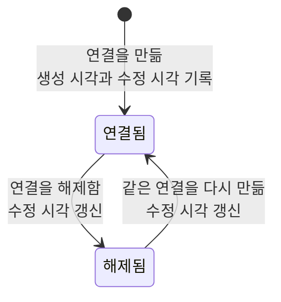

# 항목 연결 공통 스펙

이 문서는 두 항목을 잇는 연결이 공통으로 가지는 성질과, 그 연결의 저장·동기화 계약을 다룬다. 어떤 항목과 어떤 항목을 잇는지, 연결에 방향이 있는지, 각 연결이 어느 화면에서 어떻게 쓰이는지는 연결 종류마다 다르므로 각 연결 스펙에서 다룬다.

이 문서를 따르는 연결 스펙은 다음과 같다.

- [메모 태그 스펙](./memo-tag.md)
- [메모 장소 스펙](./memo-place.md)
- [메모 웹 스펙](./memo-web.md)
- [웹 태그 스펙](./web-tag.md)
- [장소 태그 스펙](./place-tag.md)
- [태그 연결 스펙](./tag-link.md)

태그를 잇는 연결 세 종류가 함께 지키는 규칙은 [항목 태그 연결 공통 스펙](./entity-tag.md)이 소유하고, 서버 동기화의 공통 규칙은 [데이터 동기화 스펙](./data-sync.md)을 따른다.

이 문서에는 사용자가 직접 수행하는 조작이 없어 `feature` 영역을 생략한다. 사용자가 연결을 만들고 해제하는 조작은 각 입력 컴포넌트 스펙과 화면 스펙이 소유한다.

이 문서에서 `연결의 양쪽 항목`은 하나의 연결이 잇는 두 항목을 가리킨다.

## domain

### 연결의 성질

연결은 두 항목 사이의 관계이며, 양쪽 항목이 가진 내용을 바꾸지 않는다.

연결이 없는 항목도 허용되며, 연결이 없는 것이 항목의 기본 상태다.

같은 두 항목 사이의 같은 종류, 같은 방향의 연결은 하나만 존재한다. 이미 있는 연결을 다시 만들어도 연결이 중복되지 않는다.

한 항목은 여러 연결을 가질 수 있다. 하나의 항목이 가질 수 있는 연결 수에 제한을 두지 않는다.

### 연결할 수 있는 항목

연결의 양쪽 항목은 모두 그 연결을 만드는 계정과 연결되어 있어야 한다. 계정과 연결되지 않은 항목으로는 연결을 만들 수 없다.

양쪽 항목 중 하나라도 계정과 연결되어 있지 않으면 그 연결은 해당 계정의 연결로 취급하지 않으며, 어느 항목을 기준으로 조회해도 나타나지 않는다.

계정 조회 규칙은 [계정 조회 스펙](./account.md)을 따른다.

### 연결의 상태와 시각

연결은 해제 여부와 생성 시각, 수정 시각을 가진다.

연결을 만들면 만든 시점이 생성 시각과 수정 시각으로 함께 기록된다.

연결을 해제하면 해제된 상태로 남고 수정 시각이 해제 시점으로 갱신된다. 해제된 연결은 연결로 취급하지 않지만 저장소에서 사라지지 않는다.

해제된 연결을 다시 만들면 새 연결을 추가하지 않고 기존 연결을 해제되지 않은 상태로 되돌리며, 수정 시각을 그 시점으로 갱신한다.

### 연결된 항목의 조회

한쪽 항목을 기준으로 그 항목과 연결된 다른 쪽 항목을 조회한다.

조회 결과에는 해제되지 않은 연결의 항목만 포함되고, 삭제된 항목은 포함되지 않는다. 완료 여부가 있는 항목은 완료되었어도 포함된다.

기기에 아직 없는 항목을 가리키는 연결은 조회 결과에 나타나지 않는다.

조회 결과의 정렬 기준은 연결 종류마다 다르므로 각 연결 스펙에서 정한다.

### 항목의 상태 변화와 연결

연결의 양쪽 항목을 완료하거나 삭제해도 그 연결은 해제되지 않는다.

양쪽 항목의 내용 수정은 연결을 바꾸지 않는다.

삭제한 항목을 실행 취소해 되살리면 그 항목을 가리키는 연결이 다시 조회 결과에 나타난다.

### 연결의 의미

연결은 두 항목의 관계를 나타내는 것으로 끝난다. 연결은 각 항목이 목록에 나타나는지, 어느 순서에 놓이는지, 검색 결과에 포함되는지를 바꾸지 않는다.

연결을 따라 또 다른 연결이 함께 성립하지 않는다. 서로 다른 종류의 연결은 각각 독립이며, 한 종류의 연결을 만들어도 다른 종류의 연결은 늘어나지 않는다.

연결 종류별로 이 규칙이 어느 화면과 목록에 적용되는지는 각 연결 스펙에서 다룬다.

## data

### 연결의 저장

연결은 양쪽 항목과 별개의 항목으로 기기에 저장된다. 이미 같은 연결이 있으면 덮어쓰고, 없으면 새로 추가한다.

항목을 추가하면서 연결을 함께 만들면 새 항목, 그 항목과 현재 사용자 계정의 연결, 그리고 함께 만드는 연결이 기기의 하나의 저장 작업으로 반영된다. 이 저장은 전부 반영되거나 전혀 반영되지 않는다. 항목만 저장되고 연결이 빠지거나, 연결만 저장되고 항목이 없는 기기 상태는 남지 않는다.

이미 저장된 항목의 연결을 하나씩 만들거나 해제할 때는 그 연결과 계정의 업로드 대기 여부만 함께 반영하고, 같은 항목의 다른 연결은 바꾸지 않는다.

한 연결과 다른 항목을 함께 바꿔야 하는 경우에도 기기의 하나의 저장 작업으로 함께 반영해 한쪽만 반영된 기기 상태가 남지 않게 한다.

### 공유되는 연결

연결은 계정별 복사본이 아니라 연결된 계정과 그룹이 공유하는 하나의 항목이다.

연결의 업로드 대기 여부는 계정과 연결마다 따로 기록되며, 어느 계정을 통해 연결을 만들거나 해제해도 공유되는 연결 하나를 기준으로 반영된다.

### 동기화

연결은 양쪽 항목과 구분되는 별도의 종류로 동기화된다. 업로드 단위, 업로드 대기 해제 기준, 충돌 기준, 내려받기 커서는 [데이터 동기화 스펙](./data-sync.md)의 규칙을 따르고, 다른 종류와의 업로드 선후 관계와 동기화 계기는 그 문서의 `동기화 단계와 처리 순서`와 `동기화 계기`를 따른다.

해제된 연결도 해제 상태로 서버에 반영되며, 서버에서 연결을 제거하지 않는다.

서버는 업로드된 연결의 양쪽 항목이 모두 업로드한 계정과 연결되어 있는지 확인한다. 둘 중 하나라도 계정과 연결되어 있지 않으면 그 업로드는 반영하지 않는다.

연결과 그 연결이 가리키는 항목은 서로 다른 요청으로 동기화된다. 반영 순서에 따른 중간 상태, 실패한 연결의 재시도와 여러 기기 충돌 뒤의 복구 범위는 [데이터 동기화 스펙](./data-sync.md)의 `동기화 단계와 처리 순서`를 따른다.

아직 동기화 종류를 정하지 않은 연결은 이 절을 적용하지 않고 기기 안에만 유지된다. 어떤 연결이 여기에 해당하는지는 각 연결 스펙에서 밝힌다.

### 내려받기 순서와 표시

항목과 연결의 내려받기는 서로 순서를 두지 않으므로, 연결이 그 연결이 가리키는 항목보다 먼저 기기에 반영될 수 있다.

이때 사용자에게 잘못된 내용이 보이지 않는다. 기기에 아직 없는 항목을 가리키는 연결은 어느 화면에도 나타나지 않고, 양쪽 항목이 내려받아지면 그 연결이 함께 나타난다.
