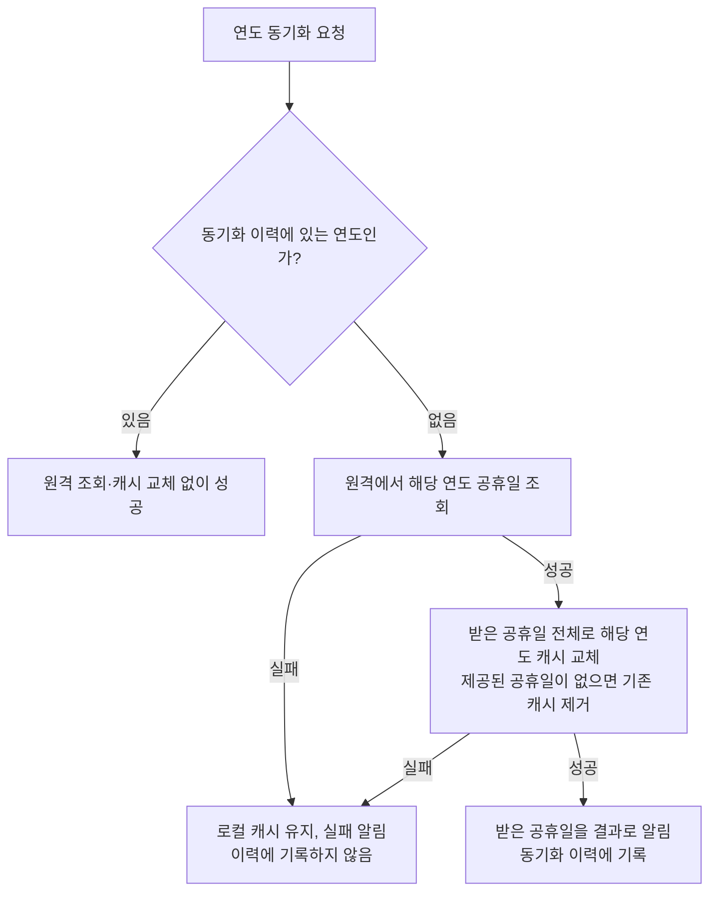

# 공휴일 동기화 스펙

이 문서는 연도별 공휴일을 원격에서 받아 로컬 캐시에 동기화하는 규칙을 다룬다. 사용자에게 직접 노출되는 화면이나 사용자 행동은 없으므로 `feature` 영역은 생략한다. 로컬 캐시 자체의 조회와 교체 규칙은 [공휴일 로컬 캐시 스펙](./holiday-database.md)을 따른다.

## domain

### 연도별 동기화

공휴일 동기화는 요청한 연도 하나를 대상으로 수행한다.

동기화가 성공하면 요청한 연도의 원격 공휴일 전체가 해당 연도의 최신 공휴일로 간주된다.

동기화 결과에는 그 연도의 최신 공휴일이 담긴다. 동기화를 요청한 쪽은 이 결과로 그 연도의 공휴일이 무엇인지 알 수 있다.

### 공휴일을 제공하지 않는 연도

원격은 요청한 연도의 공휴일을 제공하지 않을 수 있다. 그 연도의 자료 자체가 없어 조회 결과가 없는 경우와 자료는 받았지만 공휴일이 하나도 없는 경우를 구분하지 않고, 둘 다 공휴일을 제공하지 않는 연도로 본다.

공휴일을 제공하지 않는 연도의 동기화도 성공으로 끝나며, 동기화 결과에는 빈 공휴일이 담긴다. 따라서 동기화를 요청한 쪽은 원격에서 받아오지 못한 실패와 원격이 그 연도의 공휴일을 제공하지 않은 성공을 결과로 구분할 수 있다.

### 동기화 이력

공휴일은 연도 안에서 자주 바뀌지 않으므로, 앱을 실행한 동안 동기화에 성공한 연도는 더 이상 동기화가 필요하지 않은 연도로 본다.

동기화에 성공한 연도만 이력으로 기록한다. 공휴일을 제공하지 않는 연도도 동기화에 성공한 연도이므로 함께 기록한다. 동기화에 실패한 연도는 기록하지 않으므로 다음 동기화 계기에 다시 시도한다.

동기화 이력은 앱을 실행한 동안만 유지한다. 앱을 다시 실행하면 이력이 비워지고 모든 연도를 다시 동기화할 수 있다.

한 연도의 이력은 다른 연도의 동기화 여부에 영향을 주지 않는다.

### 동기화 실패 보고

공휴일 동기화 실패는 오류 보고 대상이다. 보고 방식은 [UseCase 실패 로깅](./usecase-failure-logging.md)의 오류 보고를 따른다.

원격 조회 실패와 로컬 캐시 교체 실패 중 무엇이 실패했는지는 보고에 담긴 실패 원인으로 구분한다.

공휴일을 제공하지 않는 연도로 끝난 동기화는 성공이므로 오류 보고 대상이 아니다.

## data

한 연도의 동기화 요청은 이력 여부에 따라 다음과 같이 처리된다.

### 성공한 연도 재조회 생략

특정 연도의 동기화를 요청했을 때 해당 연도가 이미 동기화 이력에 있으면 원격 조회와 로컬 캐시 교체 없이 동기화를 성공으로 끝낸다. 사용자는 이미 저장된 해당 연도의 공휴일을 그대로 본다.

이때 동기화 결과로는 그 연도의 로컬 캐시에 저장된 공휴일을 알린다. 따라서 재조회를 생략해도 요청한 쪽은 그 연도의 공휴일이 제공되는지 결과로 판단할 수 있다.

### 원격 공휴일 저장

동기화 이력에 없는 연도의 동기화를 요청하면 해당 연도의 공휴일을 원격에서 조회한다.

원격 조회가 성공하면 받은 공휴일 전체로 요청한 연도의 로컬 캐시를 교체한다. 원격이 해당 연도의 공휴일을 제공하지 않으면 그 연도의 기존 로컬 캐시를 제거한다.

로컬 캐시 교체까지 성공하면 해당 연도를 동기화 이력에 기록하고, 받은 공휴일을 동기화 결과로 알린다.

한 연도의 동기화는 다른 연도의 로컬 캐시에 영향을 주지 않는다.

### 실패 처리

원격 조회에 실패하면 로컬 캐시를 변경하지 않고 동기화 실패를 알린다.

원격 조회 후 로컬 캐시 교체에 실패하면 동기화 실패를 알리고, 해당 연도의 기존 로컬 캐시는 유지한다.

동기화가 실패한 연도는 동기화 이력에 기록하지 않으므로, 다음 동기화 요청에서 다시 원격 조회한다.
