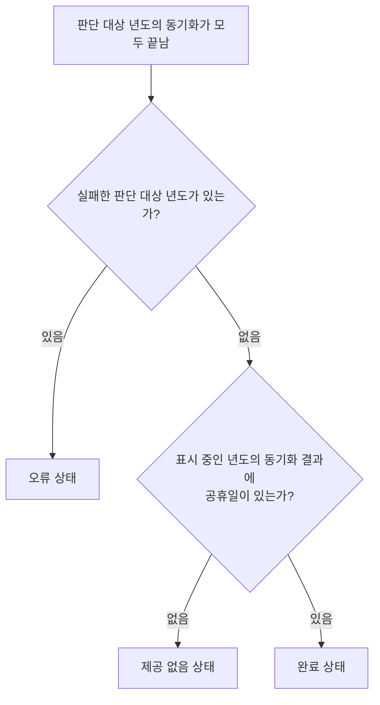

# HolidayHome 화면 스펙

이 문서는 사용자가 `더보기`의 `황금연휴` 메뉴에서 진입하는 HolidayHome 화면의 내용과 행동을 다룬다. `더보기` 메뉴 항목의 표시와 선택은 [MoreHome 화면 스펙](./more-home.md)에서, 세부 화면에서의 공통 내비게이션 노출 규칙은 [TopLevelNavigation 스펙](./top-level-navigation.md)에서 다룬다.

한 주의 날짜와 아이템 표시는 [CalendarWeekOfMonth 컴포넌트 스펙](./calendar-week-of-month.md)을, 날짜 기간 선택은 [Calendar 날짜 선택 스펙](./calendar-select.md)을, 공휴일 동기화와 로컬 캐시 규칙은 [공휴일 동기화 스펙](./holiday-fetch.md)과 [공휴일 로컬 캐시 스펙](./holiday-database.md)을 따른다.

이번 범위는 연차 개수를 조절하며 한 해의 황금연휴를 찾아보고, 항목에 표시된 날짜에서 기간을 선택해 메모 작성을 시작하는 것까지다. 황금연휴 항목 자체의 저장, 공유 같은 상호작용은 아직 확정되지 않아 다루지 않는다.

디자인: [HolidayHome 화면 디자인](../design/holiday-home.md)

## feature

### 진입

사용자는 `더보기` 화면의 `황금연휴` 메뉴를 선택해 HolidayHome 화면으로 이동한다.

사용자는 표시 중인 년도와 연차 개수를 확인하고, 그 조건에 맞는 황금연휴 목록을 볼 수 있다.

### 년도 표시와 이동

화면을 처음 열면 오늘이 속한 년도가 표시된다.

사용자는 이전 년도와 다음 년도로 이동할 수 있다. 년도를 이동하면 이동한 년도와 그 해의 황금연휴 목록이 표시된다.

년도를 이동해도 연차 개수는 그대로 유지된다.

### 연차 개수 조절

사용자는 연차 개수를 하나씩 늘리거나 줄일 수 있다.

연차 개수가 바뀌면 사용자가 별도 조작을 하지 않아도 황금연휴 목록이 바뀐 개수 기준으로 다시 표시된다.

연차 개수가 가장 작은 값이면 더 줄일 수 없다. 늘리는 동작에는 상한이 없다.

### 황금연휴 목록

표시 중인 년도에 걸치는 황금연휴는 시작일이 이른 것부터 차례로 표시된다. 따라서 목록은 그 해의 1월에 가까운 연휴부터 시작한다.

같은 연휴를 연차로 앞뒤 어느 쪽에 이어 붙이느냐에 따라 여러 안이 나오면, 그 안들은 서로 다른 항목이 아니라 한 항목 안의 대안으로 묶인다.

### 황금연휴 항목 표시

각 황금연휴 항목에는 연휴에 포함된 공휴일 이름, 시작일과 종료일, 전체 일수가 표시된다. 연차를 사용하는 연휴이면 사용하는 연차 일수도 함께 표시된다.

항목에는 현재 선택한 대안의 기간이 걸친 모든 주와 날짜별 공휴일·연차가 함께 표시된다.

### 대안 넘겨 보기

사용자는 한 항목의 이전 대안과 다음 대안을 차례로 볼 수 있다.

대안을 바꾸면 기간, 전체 일수, 사용 연차 일수와 주별 날짜 내용이 선택한 대안에 맞게 바뀐다. 같은 항목의 대안은 포함하는 공휴일 집합을 공유하므로 공휴일 이름은 바뀌지 않는다. 다른 항목과 목록 순서도 바뀌지 않는다.

첫 번째 대안에서는 이전으로, 마지막 대안에서는 다음으로 이동할 수 없다. 대안이 하나뿐이면 대안을 바꿀 수 없다.

사용자가 고른 대안은 화면이 재생성되어도 유지된다. 연차 개수가 바뀌어 목록을 다시 계산하면 각 항목은 첫 번째 대안으로 돌아간다. 다른 년도로 이동했다가 돌아오는 것은 목록을 다시 계산하는 일이 아니므로 고른 대안은 유지된다.

표시하는 공휴일 이름은 그 연휴에 포함된 공휴일의 이름이며, 공휴일 여부가 참인 공휴일만 해당한다. 이름만 있고 공휴일이 아닌 날은 이 화면에 표시하지 않는다.

연차는 사용하는 날짜에만 표시하며, 연이은 연차 날짜는 하나의 기간으로 이어서 표시한다.

연차를 사용하지 않는 연휴에는 연차를 별도로 표시하지 않는다.

### 날짜 기간 선택으로 메모 추가 시작

사용자는 황금연휴 항목에 표시된 주의 날짜에서 하나 이상의 연속 날짜를 선택해 새 메모 작성을 시작할 수 있다. 기간 선택의 행동은 [Calendar 날짜 선택 스펙](./calendar-select.md)을 따른다.

사용자가 선택을 완료하면 MemoAdd 화면으로 이동한다. MemoAdd 화면은 선택한 기간이 종일 기간으로 입력된 상태로 시작하며, 화면의 내용과 행동은 [MemoAdd 화면 스펙](./memo-add.md)을 따른다.

MemoAdd 화면으로 이동하면 황금연휴 항목의 날짜 선택은 해제된다. 사용자가 MemoAdd 화면에서 뒤로 가면 HolidayHome 화면으로 돌아오고, 보던 년도와 연차 개수, 항목마다 고른 대안을 그대로 유지한 채 선택된 날짜가 없는 상태를 본다.

### 공휴일 준비

아직 한 번도 목록이 준비되지 않은 년도의 공휴일을 준비하는 동안 사용자는 준비 중임을 알 수 있다.

이미 목록이 준비된 년도는 다시 동기화하는 동안에도 기존 결과를 계속 볼 수 있다.

준비가 끝나면 사용자가 별도 조작을 하지 않아도 그 년도의 황금연휴 목록이 제공된다.

### 준비 실패와 재시도

년도의 공휴일을 받아오지 못하면 사용자는 그 년도의 준비가 실패했음을 알 수 있고 다시 시도할 수 있다.

사용자가 다시 시도하면 그 년도의 공휴일 준비를 다시 시작한다.

한 년도의 준비 실패는 다른 년도의 결과 확인과 년도 이동에 영향을 주지 않는다.

### 공휴일을 제공하지 않는 년도

표시 중인 년도의 공휴일을 원격이 제공하지 않으면 사용자는 그 년도의 공휴일이 제공되지 않는다는 것을 알 수 있다. 이는 받아오지 못해 실패한 것과 구분해서 알린다.

다시 시도해도 원격이 제공하지 않는 결과는 달라지지 않으므로 재시도 동작은 제공하지 않는다.

한 년도가 제공되지 않아도 다른 년도의 결과 확인과 년도 이동에 영향을 주지 않는다.

### 뒤로가기

사용자가 뒤로가기를 실행하면 [TopLevelNavigation 스펙](./top-level-navigation.md)의 `더보기 하위 화면의 뒤로가기`에 따라 `더보기`로 돌아간다.

## domain

### 쉬는 날과 연차

쉬는 날은 토요일, 일요일, 그리고 공휴일 여부가 참인 공휴일 기간에 속한 날이다. 이름만 있고 공휴일 여부가 거짓인 날은 쉬는 날로 보지 않는다.

쉬는 날이 아닌 날은 평일이다.

연차는 쉬는 날 사이에 낀 평일을 쉬는 날처럼 이어 붙이기 위해 사용자가 쓰기로 한 휴가다.

### 연차 개수 정책

연차 개수는 하나의 황금연휴에 사용하는 연차 일수다. 목록에 나오는 모든 황금연휴가 이 일수를 정확히 사용하며, 한 해 전체에 대한 총량이 아니다.

연차 개수의 기본값은 `0`이고 최소값도 `0`이다. 쓸 수 있는 연차는 사람마다 다르므로 최대값은 두지 않는다.

연차 개수를 늘릴수록 각 연휴는 그만큼 길어지고, 떨어져 있던 연휴가 하나로 이어지면서 항목 수는 줄어든다. 남는 연차를 앞뒤 어디에 붙이느냐에 따라 한 항목의 대안 수는 늘어난다.

연차 개수는 화면 회전처럼 화면이 재생성되어도 유지된다.

연차 개수는 앱을 다시 실행하거나 화면을 벗어났다가 다시 진입하면 기본값으로 돌아간다.

### 황금연휴 판정

황금연휴 후보는 다음을 모두 만족하는 연속된 날짜 구간이다.

- 설정한 연차를 남기지 않고 모두 사용한다.
- 구간 안에 있는 쉬는 날의 수가 `3` 이상이다.
- 구간 안에 공휴일이 하루 이상 있다.

연차는 먼저 이어지는 쉬는 날 덩어리 사이에 낀 평일을 메우는 데 사용한다. 그렇게 하고도 남는 연차는 구간 앞이나 뒤의 평일에 이어 붙여 모두 사용한다. 따라서 연휴의 시작일이나 종료일이 연차로 쉬는 평일일 수 있다.

남는 연차를 앞뒤로 붙일 때 이웃한 쉬는 날 덩어리에 닿으면 그 덩어리까지 이어 붙인 후보와 같아지므로, 닿기 전까지만 붙인다.

연차를 남기지 않고 모두 사용할 수 없는 구간은 황금연휴로 보지 않는다.

황금연휴는 공휴일 덕분에 생기는 연휴이므로 공휴일이 없는 구간은 후보로 보지 않는다. 예를 들어 연차 개수가 `5`이면 주말과 주말 사이의 평일 다섯 날을 모두 연차로 메워 아홉 날을 쉴 수 있지만, 공휴일이 없으므로 황금연휴가 아니다.

연차로 메운 평일은 쉬는 날 수에 포함하지 않는다. 예를 들어 목요일 하루가 공휴일일 때 연차 개수가 `0`이면 쉬는 날이 목요일 하루뿐이라 황금연휴가 아니고, 연차 개수가 `1` 이상이면 금요일을 연차로 메워 목요일부터 일요일까지 이어지며 쉬는 날이 목·토·일 세 날이 되어 황금연휴다.

### 대안 묶음과 순서

날짜를 하루라도 공유하는 후보들은 같은 시기의 연휴 계획이므로 함께 검토한다. 이 검토 범위는 겹침으로 이어지는 관계까지 따라간다.

그 안에서 담은 공휴일이 똑같은 후보들만 한 항목의 대안으로 묶는다. 담은 공휴일이 다르면 서로 다른 연휴이므로 다른 항목이 된다. 따라서 대안을 넘겨도 항목의 공휴일 이름은 바뀌지 않는다.

한 연휴가 여러 공휴일을 실제로 이으면 그 공휴일들을 함께 담은 하나의 항목이 된다. 예를 들어 기독탄신일이 금요일이고 그 다음 주 금요일이 신정이면, 사이의 평일 네 날을 연차로 메운 열 날 연휴는 두 공휴일을 함께 담은 항목이 된다.

날짜를 공유하지 않는 후보는 당연히 서로 다른 항목이 된다.

### 밀리는 대안 제외

한 묶음 안에서 전체 일수가 짧지 않으면서 상대의 공휴일을 모두 담고 그중 한 가지라도 더 나은 대안이 있으면 밀리는 대안은 보여 주지 않는다.

예를 들어 전국동시지방선거가 수요일이고 현충일이 그 주 토요일인 해에 연차 개수가 `2`이면 선거 앞 주말에 붙이는 5일 연휴와 선거부터 현충일까지 잇는 5일 연휴가 함께 성립한다. 두 안은 일수와 사용 연차가 같지만 뒤쪽 안이 공휴일을 하나 더 담으므로 앞쪽 안은 제외하고 뒤쪽 안만 보여준다.

담은 공휴일이 같으면 전체 일수가 가장 긴 안만 대안으로 남긴다. 전체 일수도 같으면 시작일이 다르더라도 모두 남긴다.

### 대안 순서

한 항목의 대안은 모두 전체 일수와 담은 공휴일과 사용하는 연차가 같다.

대안은 시작일이 이른 순으로 배열하고 첫 번째 대안을 먼저 보여 준다. 따라서 이전으로 넘기면 연휴를 앞으로 당긴 안, 다음으로 넘기면 뒤로 미룬 안이 보인다.

### 목록 구성과 정렬

표시 중인 년도의 목록에는 대안 중 하나라도 그 년도에 하루라도 걸치는 항목을 모두 담는다. 따라서 연말연시처럼 년도 경계를 넘는 연휴는 두 년도의 목록에 모두 나타난다.

목록에 담은 항목의 대안은 모두 유지한다. 표시 중인 년도에 걸치지 않는 대안도 같은 연휴를 보는 방법이므로 넘겨 볼 수 있다.

목록은 각 항목의 첫 번째 대안 시작일이 이른 순으로 정렬한다.

### 년도 이동 범위와 시작 년도

화면을 처음 열 때 표시하는 년도는 사용자의 현재 시간대를 기준으로 정한 오늘이 속한 년도다.

사용자는 1년보다 이전 년도로 이동할 수 없다. 다음 년도 방향으로는 사실상 제한 없이 이동할 수 있다.

화면이 재생성되어도 사용자가 보던 년도는 유지된다.

### 주 표시 기준

주는 일요일에 시작해 토요일에 끝난다.

황금연휴가 걸친 주는 연휴 시작일이 속한 주부터 종료일이 속한 주까지다.

각 주의 기준 달은 그 주의 시작일인 일요일이 속한 달이다.

### 공휴일 판단 대상

황금연휴를 계산할 때는 표시 중인 년도와 그 앞뒤 년도의 공휴일을 함께 사용한다. 년도 경계를 넘는 연휴를 빠짐없이 찾기 위해서다.

공휴일 여부가 참인 공휴일만 쉬는 날 판단과 이름 표시에 사용한다. 이름만 있고 공휴일이 아닌 날은 이 화면에서 다루지 않는다.

각 황금연휴는 자신의 기간에 걸치는 공휴일을 자기 것으로 가진다. 항목에는 그 공휴일의 이름을 시작일이 이른 순으로 이어 붙여 사용하고, 주별 날짜에도 같은 공휴일을 표시한다. 따라서 표시되는 주 안에 있더라도 그 연휴에 속하지 않는 공휴일은 이름과 날짜 표시 대상이 아니다.

여러 날에 걸친 공휴일은 시작일부터 종료일까지 모든 날을 그 공휴일에 해당하는 날로 본다.

### 기간 선택 영역

기간 선택은 황금연휴 항목마다 그 항목이 현재 표시하는 주 목록을 하나의 선택 영역으로 삼는다. 따라서 사용자는 한 항목 안에서 주 경계를 넘는 기간을 선택할 수 있고, 서로 다른 항목의 날짜를 한 번에 선택할 수는 없다.

선택 영역에 보이는 날짜는 모두 선택할 수 있다. 연휴 기간에 속하지 않는 날짜와 이웃 달 날짜도 실제 날짜 그대로 선택된다.

선택이 진행되는 동안에는 목록의 세로 이동과 년도 이동이 일어나지 않는다.

목록이 아직 준비되지 않았거나, 준비에 실패했거나, 공휴일이 제공되지 않는 년도에는 선택할 날짜가 없으므로 기간 선택이 시작되지 않는다.

### 년도별 준비 상태

각 년도는 로딩, 오류, 제공 없음, 완료 중 하나의 준비 상태를 따로 가지며, 한 년도의 상태는 다른 년도의 상태에 영향을 주지 않는다.

년도가 화면에 드러날 때마다 그 년도의 공휴일 동기화를 요청한다. 이미 받아온 년도를 다시 받아올지는 [공휴일 동기화 스펙](./holiday-fetch.md)의 동기화 이력이 판단하므로 화면은 요청 횟수를 제한하지 않는다. 서로 다른 년도의 동기화는 동시에 진행될 수 있다.

아직 한 번도 완료되지 않은 년도는 동기화하는 동안 로딩 상태다. 판단 대상 년도의 동기화가 모두 끝나면 그 결과로 준비 상태를 정한다.

제공 없음 판정은 표시 중인 년도만 기준으로 한다. 앞뒤 년도의 공휴일이 제공되지 않아도 표시 중인 년도의 공휴일이 제공되면 완료 상태다. 실패한 판단 대상 년도가 있으면 표시 중인 년도의 제공 여부와 무관하게 오류 상태다.

완료 상태의 년도는 다시 동기화하는 동안에도 로딩 상태로 돌아가지 않고 기존 목록을 그대로 보여 준다. 다시 동기화한 결과로 공휴일이 바뀌면 목록만 갱신된다.

오류 상태의 년도는 사용자가 재시도를 선택하거나 년도가 다시 화면에 드러나면 로딩 상태로 돌아가 다시 동기화한다.

제공 없음 상태의 년도는 재시도 동작이 없으므로, 년도가 다시 화면에 드러날 때만 로딩 상태로 돌아가 다시 동기화한다.

년도별 준비 상태는 화면 회전처럼 화면이 재생성되어도 유지된다. 화면을 벗어났다가 다시 진입하거나 앱을 다시 실행하면 모든 년도가 로딩 상태부터 다시 시작한다.

## data

### 년도별 공휴일 동기화

년도가 화면에 드러나거나 사용자가 오류 상태에서 재시도를 선택하면, 그 년도의 공휴일 판단 대상에 해당하는 각 년도의 최신 공휴일을 원격에서 받아 로컬 캐시에 저장한다. 같은 년도가 화면에 다시 드러나도 동기화를 다시 요청한다.

각 년도의 동기화, 이미 성공한 년도의 재조회 생략, 실패 시 기존 캐시 유지, 공휴일을 제공하지 않는 연도 규칙은 [공휴일 동기화 스펙](./holiday-fetch.md)을 따른다. 다시 요청해도 이미 성공한 판단 대상 년도는 재조회 생략에 따라 건너뛰고, 실패했던 년도만 다시 받아온다.

한 판단 대상 년도의 실패는 다른 판단 대상 년도의 동기화 시도를 막지 않는다. 모든 판단 대상 년도의 동기화 요청이 성공 또는 실패로 끝나면 그 년도의 동기화가 끝난 것으로 본다.

이웃한 년도의 동기화가 같은 판단 대상 년도를 공유하더라도 각 년도의 동기화는 독립적으로 진행한다.

### 년도별 공휴일 조회

황금연휴 계산에 사용하는 공휴일은 로컬 캐시에서 판단 대상 년도별로 조회한 공휴일을 합쳐 사용한다. 조회 규칙은 [공휴일 로컬 캐시 스펙](./holiday-database.md)의 연도별 캐시 조회를 따른다.

원격 동기화 결과로 대상 년도의 캐시가 바뀌면 사용자가 별도 조작을 하지 않아도 바뀐 공휴일 기준으로 황금연휴 목록이 다시 표시된다.

대상 년도에 저장된 공휴일이 없거나 조회에 실패하면 그 년도의 공휴일 없이 계산하고, 사용자에게 별도로 알리지 않는다. 한 년도의 조회 실패는 다른 대상 년도의 공휴일 사용을 막지 않는다.
