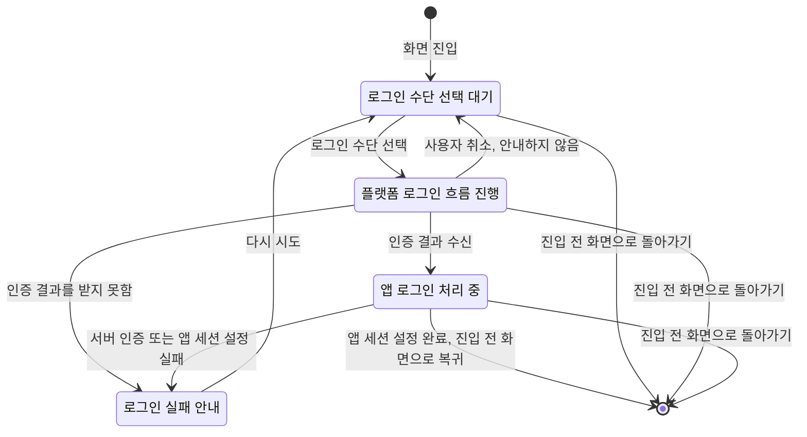

# Login 화면 스펙

디자인: [Login 화면 디자인](../design/login.md)

## feature

로그인 한 번의 진행 흐름은 다음과 같다. 각 단계의 조건과 결과는 아래 절에서 정의한다.

`앱 로그인 처리 중` 상태에서는 새 로그인 요청을 받지 않는다.

### 진입과 종료

사용자는 `더보기` 화면에서 로그인 행동을 선택해 Login 화면으로 이동할 수 있다.

Login 화면은 주요 목적지가 아닌 별도 로그인 흐름으로 제공된다.

사용자는 로그인 전이나 진행 중에도 Login 화면에 진입하기 전 화면으로 돌아갈 수 있다.

### 로그인 수단

사용자는 Google 로그인과 Apple 로그인 중 하나를 선택할 수 있다.

### 로그인 진행과 완료

사용자가 로그인 수단을 선택하면 앱은 현재 플랫폼에서 제공하는 해당 수단의 로그인 흐름을 시작한다.

사용자가 계정 선택과 동의를 완료하면 앱은 받은 인증 결과로 앱 로그인을 요청한다.

앱 로그인 요청을 처리하는 동안에는 진행 중인 상태를 표시하며, 새 로그인 요청을 받을 수 없다.

앱 로그인과 세션 설정이 모두 완료되면 Login 화면을 닫고 진입하기 전 화면으로 돌아간다.

### 취소와 오류

사용자가 플랫폼의 로그인 흐름을 취소하면 앱은 오류를 안내하지 않고 Login 화면에 머무르며, 사용자는 다시 시도할 수 있다.

예외적으로 데스크톱에서 사용자가 로그인 진행 중이던 브라우저 창을 응답 없이 닫으면 앱은 취소를 감지하지 못할 수 있다. 이 경우 별도 안내 없이 Login 화면에 머무른다.

인증 결과를 받지 못하거나, 서버 인증 또는 앱 세션 설정에 실패하면 로그인 실패를 안내한다.

실패 후 앱은 진행 상태를 종료하고, 사용자는 로그인 수단을 다시 선택해 시도할 수 있다.

## domain

### 로그인 완료 기준

인증 결과를 받는 것만으로 앱 로그인이 완료되지는 않는다.

서버가 인증 결과를 검증해 앱 세션을 발급하고, 앱이 그 세션을 사용할 수 있는 상태가 되어야 로그인이 완료된다.

이 과정 중 하나라도 실패하면 앱은 로그인 완료로 판단하지 않는다.

### 제공하는 로그인 수단

앱이 제공하는 로그인 수단은 Google 로그인과 Apple 로그인이다.

Google 로그인은 앱이 지원하는 모든 플랫폼에서 완료할 수 있다.

Apple 로그인은 현재 iOS에서만 완료할 수 있다. 그 외 플랫폼에서도 Apple 로그인 수단을 제공하지만, 사용자가 선택하면 인증 결과를 받지 못해 로그인 실패로 안내한다. 그 외 플랫폼의 Apple 로그인 완료 시점과 방식은 아직 정의하지 않았다(미정).

로그인 수단마다 앱 로그인 요청은 서로 독립적이며, 한 수단의 실패가 다른 수단의 사용을 막지 않는다.

### 허용되는 Google 인증 결과

앱 로그인에는 `idToken`과 authorization code 중 현재 플랫폼이 제공하는 한 가지 Google 인증 결과를 사용한다.

같은 로그인 시도에서 두 결과를 모두 요구하지 않는다.

Google 로그인은 기본 인증에 필요한 범위로 시작한다.

추가 Google API 접근 권한이 필요한 기능은 사용자가 해당 기능을 사용하기 시작할 때 별도 동의 흐름으로 요청한다.

### 허용되는 Apple 인증 결과

앱 로그인에는 Apple이 발급한 `idToken`과 로그인 시도에 사용한 nonce를 사용한다.

Apple 로그인은 앱 계정에 필요한 이메일 범위로 시작하며, 사용자 이름 등 추가 정보는 요청하지 않는다.

### 인증 수단과 계정 동일성

앱 계정의 동일성은 인증 수단이 아니라 검증된 이메일로 판단한다.

두 인증 수단이 같은 이메일을 제공하면 사용자가 Google 로그인과 Apple 로그인 중 무엇을 사용하든 같은 앱 계정으로 본다. 이미 그 이메일의 계정이 있으면 새 인증 수단을 기존 계정에 연결하고 새 계정을 만들지 않는다.

사용자가 Apple 로그인에서 이메일 가리기를 선택하면 다른 이메일을 받게 되므로, 같은 사람이더라도 별개 계정으로 본다. 앱은 사용자가 이메일 가리기를 선택하지 못하게 막지 않는다.

이때 받는 이메일은 같은 사용자와 같은 앱에 대해 유지되므로, 이후 Apple 로그인을 다시 해도 처음 만들어진 같은 계정으로 들어온다.

이렇게 나뉜 두 계정을 사용자가 하나로 합치는 방법은 아직 정의하지 않았다(미정).

### 앱 로그인 실패 보고

앱 로그인 실패는 Google 로그인과 Apple 로그인 모두 오류 보고 대상이다. 보고 방식은 [UseCase 실패 로깅](./usecase-failure-logging.md)의 오류 보고를 따른다.

어느 수단의 앱 로그인이 실패했는지는 보고 메시지로 구분하고, 서버 인증과 앱 세션 설정 중 무엇이 실패했는지는 보고에 담긴 실패 원인으로 구분한다.

사용자 취소와 인증 결과를 받지 못한 실패는 앱 로그인을 요청하기 전에 끝나므로 오류 보고를 남기지 않는다.

### 로그인 요청 제한

서버 인증과 앱 세션 설정을 처리하는 동안 사용자는 Login 화면에서 새 로그인 요청을 시작할 수 없다.

화면이 앱 로그인 처리 진행 상태로 전환된 뒤 같은 화면에서 전달된 추가 로그인 요청은 처리하지 않는다.

이 제한은 로그인 수단을 구분하지 않는다. 한 수단의 앱 로그인 처리가 진행 중이면 다른 수단의 로그인 요청도 처리하지 않는다.

사용자는 로그인 전, 진행 중, 완료 전 어느 시점에도 Login 화면에서 이전 화면으로 돌아갈 수 있다.

## data

### Google 인증 결과 전달

플랫폼이 `idToken`을 제공하면 앱은 해당 토큰과 로그인 시도에 사용한 nonce를 서버에 전달한다.

플랫폼이 authorization code를 제공하면 앱은 해당 코드와 발급 대상 클라이언트 및 리디렉션 정보를 서버에 전달한다.

JVM 데스크톱은 authorization code를 요청할 때 로그인 시도마다 새로운 code verifier를 만들고, 그 값에서 만든 S256 code challenge를 Google에 전달한다. code verifier는 다른 로그인 시도에 재사용하지 않는다.

JVM 데스크톱이 authorization code를 받으면 같은 로그인 시도에 만든 code verifier도 서버에 전달한다.

서버는 전달받은 결과를 Google 인증 정보로 검증한다. JVM 데스크톱의 authorization code는 같은 로그인 시도의 code verifier로 검증하며 Google ID token으로 교환한 뒤 같은 인증 절차를 따른다. code verifier가 일치하지 않거나 authorization code 교환에 실패하면 앱 세션을 발급하지 않는다.

### Apple 인증 결과 전달

앱은 Apple이 발급한 `idToken`과 로그인 시도에 사용한 nonce를 서버에 전달한다.

서버는 전달받은 결과를 Apple 인증 정보로 검증하며, 이때 인증 결과가 이 앱을 대상으로 발급되었는지 함께 확인한다.

사용자가 Apple 로그인에서 이메일 가리기를 선택하면 앱에 전달되는 이메일은 Apple의 비공개 릴레이 주소다. 앱은 가리기 여부와 관계없이 전달받은 이메일을 그대로 계정 이메일로 사용한다.

### 인증 결과 노출 제한

인증 결과와 앱 세션 토큰은 Login 화면에 표시하지 않는다.

### 계정과 세션

서버 인증이 성공하면 서버는 앱 세션에 필요한 접근 토큰과 갱신 토큰을 발급한다.

처음 로그인하는 사용자라면 검증된 인증 제공자의 사용자 정보를 바탕으로 앱 계정이 생성되고, 기존 사용자는 기존 계정을 사용한다.

로그인으로 인증 제공자의 사용자 정보가 갱신될 때 계정의 프로필 이미지를 정하는 규칙은 [프로필 이미지 변경 스펙](./profile-image.md)의 `domain > 로그인 시 프로필 이미지`를 따른다.

앱은 서버가 발급한 토큰을 현재 사용자의 인증 세션으로 설정하고, 이후 세션을 갱신할 수 있는 상태로 유지한다.

앱 세션 설정까지 완료된 경우에만 Login 화면의 로그인 성공으로 처리한다.

### 로그인 세션 상태 확인

앱은 인증 제공자가 알리는 세션 상태로 현재 로그인 세션의 인증 여부를 판단한다.

인증 제공자가 인증된 세션을 알리면 인증된 상태로 본다.

인증 제공자가 세션을 아직 초기화하는 중이거나, 세션 갱신에 실패했거나, 인증되지 않았음을 알리면 인증되지 않은 상태로 본다.

### 실패 시 데이터 처리

사용자가 로그인 흐름을 취소하거나 인증 결과를 받지 못하면 이번 시도에 대한 서버 로그인 요청과 앱 세션 설정을 수행하지 않는다.

서버 검증에 실패하면 새 앱 세션을 설정하지 않는다.

서버가 세션을 발급한 뒤 앱의 세션 설정에 실패하면 앱에서는 로그인 완료로 처리하지 않는다. 이 시점에는 서버의 인증 사용자나 최초 계정이 이미 생성되어 있을 수 있으며, 앱은 이를 자동으로 삭제하지 않는다.

## 참고

- [About Sign in with Google](https://developer.android.com/identity/sign-in/credential-manager-siwg)
- [Implementing User Authentication with Sign in with Apple](https://developer.apple.com/documentation/sign_in_with_apple/implementing-user-authentication-with-sign-in-with-apple)
