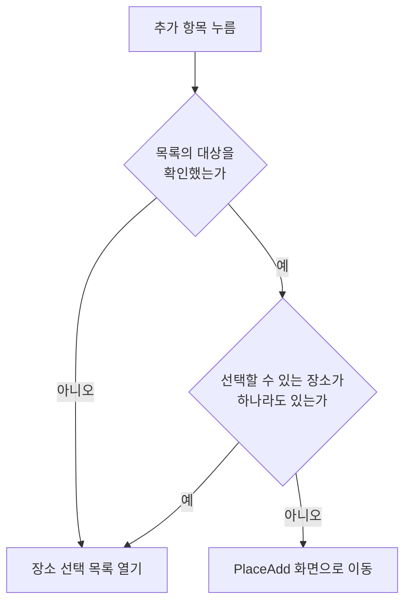

# 메모 장소 카드 컴포넌트 스펙

이 문서는 MemoAdd 화면과 MemoDetail 화면에서 함께 사용하는 장소 카드의 사용자 행동과 정책을 다룬다. 카드에 표시되는 지도의 표시·조작·제공자 전환과 핀 표시·핀 선택 자체의 동작은 [DiaryMap 컴포넌트 스펙](./diary-map.md)을, 기본 지도를 고르고 저장하는 흐름은 [SettingMap 화면 스펙](./setting-map.md)을, 현재 위치를 확인하는 규칙은 [현재 위치 확인 스펙](./current-location.md)을 따른다. 장소가 갖는 정보는 [PlaceAdd 화면 스펙](./place-add.md)의 `장소의 정보`를 따르고, 핀을 눌러 이동하는 장소 상세의 내용과 행동은 [PlaceDetail 화면 스펙](./place-detail.md)을 따른다.

장소 선택 목록을 검색어로 좁힐 때의 판정 기준은 [검색어 일치 판정 스펙](./search-match.md)을 따른다.

장소 선택에서 사용자가 반영한 선택이 어디에 반영되는지는 화면마다 다르므로 이 문서에서 다루지 않는다. MemoAdd 화면에서는 추가할 메모의 선택으로 반영되고, MemoDetail 화면에서는 상세 대상 메모의 저장된 연결로 반영되며, 각각 [MemoAdd 화면 스펙](./memo-add.md)과 [MemoDetail 화면 스펙](./memo-detail.md)을 따른다. 메모와 장소의 연결 규칙은 [메모 장소 스펙](./memo-place.md)을 따른다.

디자인: [메모 장소 카드 컴포넌트 디자인](../design/memo-place-card.md)

## feature

### 카드 표시

MemoAdd 화면과 MemoDetail 화면의 본문에는 메모의 장소를 보여 주는 장소 카드가 표시된다.

카드에는 지도와 메모에 연결된 장소 목록이 함께 표시된다.

### 지도 표시

사용자는 카드의 지도를 보고 옮기고 확대·축소할 수 있으며 지도 제공자를 바꿀 수 있다.

기본 지도를 확인하기 전이거나 읽지 못했으면 지도를 표시하지 않으며, 별도의 로딩 안내나 오류 안내도 제공하지 않는다. 지도가 표시되지 않아도 카드와 장소 목록은 그대로 표시된다.

카드의 지도는 지점 선택을 사용하지 않는다. 지도를 눌러도 지점이 만들어지지 않고 지점 표시도 나타나지 않는다.

### 장소 표시

연결된 장소는 장소 목록과 지도 위 핀으로 함께 표시된다.

목록에서는 각 장소의 컬러와 제목으로 구분해 표시된다. 지도에서는 각 장소의 좌표 위치에 그 장소의 컬러를 반영하고 제목을 라벨로 보여 주는 핀으로 표시된다.

연결된 장소가 바뀌면 목록과 핀이 함께 바뀐다. 연결된 장소가 없으면 핀도 없다.

지도가 표시되지 않는 동안에는 핀도 표시되지 않으며, 장소 목록은 그대로 표시된다.

### 장소 위치 보기

사용자는 목록의 장소를 눌러 지도를 그 장소로 옮길 수 있다.

장소를 누르면 지도가 그 장소의 좌표를 가운데에 두도록 이동하고, 확대 수준은 보고 있던 수준을 유지한다.

지도가 표시되지 않는 동안에는 장소를 눌러도 지도 이동이 일어나지 않는다.

장소 위치 보기는 메모와 장소의 내용, 연결을 바꾸지 않는다.

### 장소 상세 이동

사용자는 지도 위 핀을 눌러 그 핀이 가리키는 장소의 [PlaceDetail 화면](./place-detail.md)으로 이동한다.

목록의 장소를 누르는 것과 핀을 누르는 것은 같은 장소를 가리켜도 서로 다른 결과를 만든다. 목록의 장소를 누르면 지도가 그 장소로 이동하고, 핀을 누르면 그 장소의 상세로 이동한다.

핀을 눌러 상세로 이동해도 지도가 보고 있는 위치와 확대 수준, 사용자가 고른 지도 제공자는 바뀌지 않는다. 메모와 장소의 내용, 연결도 바뀌지 않는다.

장소 상세에서 카드가 있는 화면으로 돌아오면 선택한 장소는 그대로 유지된다. 상세에서 장소의 제목, 컬러, 좌표를 바꾸거나 장소를 삭제한 결과는 `장소 표시`의 기준으로 반영된다.

지도가 표시되지 않는 동안에는 핀이 없으므로 핀으로 상세로 이동하는 일도 없다.

### 장소 선택 목록

장소 목록의 하단에는 추가 항목이 표시된다. 추가 항목은 연결된 장소가 없어도 표시된다.

사용자가 추가 항목을 누르면 장소 선택 목록이 열린다. 다만 선택할 수 있는 장소가 하나도 없는 것으로 확정되면 목록을 열지 않고 `장소 추가 이동`에 따라 PlaceAdd 화면으로 이동한다. 이 분기는 `domain`의 `추가 항목의 동작 판정`을 따른다.

사용자는 장소 선택 목록을 내려 보며 장소와 각 장소의 선택 여부를 확인할 수 있다. 목록에 나타나는 장소의 기준은 `domain`의 `장소 선택 목록에 나타나는 장소`를 따른다.

목록이 나타나는 순서와 아직 준비되지 않은 자리의 처리는 [페이지 조회 목록의 자리 표시 스펙](./paged-list-placeholder.md)을 따른다.

목록에는 별도의 빈 상태 안내를 두지 않는다. 선택할 수 있는 장소를 확인하는 중에 연 목록이 선택할 수 있는 장소가 없는 채로 확정되면 목록 영역은 비어 있는 채로 유지된다. 검색어를 입력해 목록이 비는 경우는 `장소 검색`을 따른다.

장소 선택 목록에는 장소 추가 항목이 항상 표시된다. 나타낼 장소가 하나도 없어도, 목록을 어디까지 확인했어도, 목록을 위아래로 이동해도 이 항목은 계속 표시된다.

사용자가 장소 선택 목록의 장소 추가 항목을 누르면 목록이 닫히고 `장소 추가 이동`에 따라 PlaceAdd 화면으로 이동한다.

목록을 닫아도 목록에서 반영한 선택은 그대로 유지된다.

### 장소 검색

장소 선택 목록에는 검색어 입력이 함께 표시된다. 목록을 열면 검색어는 비어 있고 `장소 선택 목록`의 대상이 모두 나타난다.

목록이 열리면 입력 초점이 검색어 입력에 놓여, 사용자는 입력을 따로 누르지 않고 바로 검색어를 입력할 수 있다.

사용자가 검색어를 입력하면 목록이 검색어를 만족하는 장소만 나타내도록 좁혀진다. 검색을 시작하기 위한 별도의 확정 동작은 필요하지 않으며, 입력한 검색어를 목록에 반영하는 시점은 [검색어 일치 판정 스펙](./search-match.md)의 `검색어 반영 시점`을 따른다.

사용자가 검색어를 바꾸면 목록은 새 검색어 기준으로 다시 채워지고 정렬 순서의 앞부분부터 나타난다. 검색어를 지워 비우면 다시 대상 전체가 나타난다.

검색어로 좁힌 목록에서도 사용자는 장소의 선택과 해제를 그대로 바꿀 수 있다. 선택해도 그 장소는 검색 결과에서 빠지지 않고, 선택을 해제해도 검색어를 만족하는 동안에는 목록에 남는다.

검색어를 입력했는데 그 검색어를 만족하는 장소가 하나도 없으면 목록 자리에 검색어에 맞는 장소가 없으며 다른 검색어로 다시 찾을 수 있음을 알린다. 알리는 조건은 `domain`의 `장소 검색어`를 따른다.

검색어가 비어 있는 동안에는 나타낼 장소가 없어도 결과 없음을 알리지 않고 목록 영역을 비워 둔다.

검색어를 입력해도 장소 추가 항목은 그대로 표시되며, 검색어에 맞는 장소가 없어도 사용자는 그 항목으로 PlaceAdd 화면에 이동할 수 있다.

검색어는 카드의 장소 목록과 지도 위 핀을 좁히지 않는다. 목록을 검색어로 좁히는 동안에도 지도가 보고 있는 위치와 확대 수준은 바뀌지 않는다.

목록을 닫으면 검색어는 사라진다. 목록을 다시 열면 검색어가 비어 있는 상태에서 대상 전체를 다시 확인한다.

### 장소 추가 이동

사용자는 다음 두 경로로 [PlaceAdd 화면](./place-add.md)으로 이동한다.

- 선택할 수 있는 장소가 하나도 없는 것으로 확정된 상태에서 카드의 추가 항목을 누른다.
- 장소 선택 목록의 장소 추가 항목을 누른다.

어느 경로로 이동하든 이동 자체는 선택과 지도가 보고 있는 위치, 확대 수준, 지도 제공자를 바꾸지 않는다. 장소 선택 목록에서 이동한 경우 목록은 닫힌 채로 이동한다.

어느 경로로 이동하든 이동하던 시점에 카드의 지도가 보고 있던 위치에서 PlaceAdd의 지도가 시작된다. 사용자는 카드에서 보고 있던 곳을 다시 찾지 않고 이어서 장소의 위치를 고를 수 있다. 이 기준은 `domain`의 `장소 추가로 넘기는 지도 위치`를 따른다.

지도가 표시되지 않는 상태에서 이동하면 보고 있던 지도 위치가 없으므로 PlaceAdd의 지도는 PlaceAdd가 정한 위치에서 시작한다.

PlaceAdd 화면에서 카드가 있는 화면으로 돌아오면 그 화면에서 추가한 장소가 선택된다. 이동하기 전에 있던 선택은 그대로 유지되고 추가한 장소가 더해진다. 이 판정은 `domain`의 `추가한 장소의 자동 선택`을 따른다.

장소를 하나도 추가하지 않고 돌아오면 선택은 그대로다.

돌아와도 장소 선택 목록이 저절로 다시 열리지는 않는다. 추가 항목을 다시 누르면 추가한 장소가 나타나는 장소 선택 목록이 열린다.

### 장소 선택과 해제

사용자는 장소 선택 목록에서 장소를 선택하거나 선택을 해제할 수 있고, 한 번에 여러 장소를 선택할 수 있다.

선택과 해제는 즉시 반영되며 별도의 확정 동작은 필요하지 않다. 선택한 장소는 카드의 장소 목록에 나타나고, 해제한 장소는 장소 목록에서 사라진다.

장소를 선택하거나 해제해도 지도가 보고 있는 위치와 확대 수준은 바뀌지 않는다.

## domain

### 카드가 노출하는 장소

카드에 노출하는 장소는 그 화면의 메모에 연결된 장소다. MemoAdd 화면에서는 추가할 메모에 연결할 장소로 선택한 장소이고, MemoDetail 화면에서는 상세 대상 메모에 연결된 장소다.

노출하는 장소는 선택할 수 있는 장소와 같은 정렬 기준으로 정렬한다.

### 선택할 수 있는 장소

장소 선택 목록에서 선택할 수 있는 장소는 현재 사용자 계정과 연결된 장소 중 삭제되지 않은 장소다. 삭제된 장소는 새로 선택할 수 없다.

선택할 수 있는 장소는 제목 오름차순으로 정렬한다. 제목이 같은 장소끼리의 순서는 정하지 않는다.

선택할 수 있는 장소는 정렬 순서를 유지한 채 사용자가 확인하는 만큼 이어서 다룬다. 사용자가 아직 확인하지 않은 구간의 장소도 선택할 수 있는 장소에 포함되며, 목록의 어느 구간을 확인했는지는 선택 여부의 판정에 영향을 주지 않는다.

### 장소 선택 목록에 나타나는 장소

장소 선택 목록에는 선택할 수 있는 장소가 모두 나타난다. 다만 목록은 사용자가 확인하는 만큼 이어서 준비되므로, 아직 준비되지 않은 구간의 장소는 그 구간이 준비된 뒤에 나타난다.

선택한 것으로 표시하는 장소는 항상 선택할 수 있는 장소에 포함되므로, 태그 선택 목록과 달리 선택할 수 있는 장소 외에 목록에 추가로 나타나는 장소는 없다.

### 추가 항목의 동작 판정

이 판정은 카드의 추가 항목에만 적용한다. 장소 선택 목록의 장소 추가 항목은 판정 없이 항상 PlaceAdd 화면으로 이동한다.

추가 항목의 동작은 `선택할 수 있는 장소`가 하나라도 있는지로 정한다. 하나라도 있으면 장소 선택 목록을 열고, 하나도 없으면 PlaceAdd 화면으로 이동한다.

검색어는 이 판정에 쓰지 않는다. 목록은 언제나 빈 검색어로 열리므로 판정 대상도 검색어로 좁혀지지 않는다.

선택할 수 있는 장소가 없다는 판정은 [페이지 조회 목록의 자리 표시 스펙](./paged-list-placeholder.md)의 `빈 상태 판정`과 같은 기준으로 목록의 대상을 확인한 뒤에만 내린다. 아직 확인하는 중이면 없는 것으로 판정하지 않고 장소 선택 목록을 연다.

### 장소 검색어

검색어의 정규화와 장소의 일치 판정, 검색어에 맞는 장소가 없다고 알리는 조건은 [검색어 일치 판정 스펙](./search-match.md)을 따른다.

빈 검색어는 목록을 좁히지 않는다. 검색어가 비어 있으면 `장소 선택 목록에 나타나는 장소`의 대상이 그대로 목록의 대상이 된다.

검색어를 만족하지 않는 장소는 선택한 장소여도 목록에서 빠진다. 이는 목록의 표시 기준일 뿐이며 그 장소의 선택을 바꾸지 않는다.

검색어는 목록을 좁히는 데만 쓰고 카드에 노출하는 장소는 좁히지 않는다.

검색어는 목록이 열려 있는 동안 유지한다. 목록을 닫으면 사라지며, 화면이 회전하거나 시스템에 의해 화면이 재생성되어도 목록이 그대로 열려 있으면 검색어와 그 결과도 유지한다.

### 추가한 장소의 자동 선택

PlaceAdd 화면에서 추가한 장소는 카드가 있는 화면으로 돌아왔을 때 선택한 장소에 더해진다. 카드에서 장소 추가로 이동한 사용자는 그 장소를 이 메모에 쓰려는 것으로 보기 때문이다.

한 번의 이동에서 장소를 여러 개 추가하면 추가한 장소가 모두 선택된다. 어느 경로로 PlaceAdd 화면에 이동했는지는 자동 선택에 영향을 주지 않는다.

자동 선택된 장소는 사용자가 장소 선택 목록에서 선택한 장소와 같게 다룬다. 선택이 어디에 반영되는지도 `장소 선택과 해제`와 같으므로 화면마다 다르며, 자동 선택된 장소도 카드의 장소 목록과 지도 위 핀에 함께 나타난다.

자동 선택은 카드가 보고 있는 지도 위치와 확대 수준을 바꾸지 않는다. 초기 지도 위치는 화면에 진입할 때 이미 정해졌으므로 자동 선택으로 다시 정하지 않는다.

자동 선택은 돌아온 시점에 한 번만 적용한다. 자동 선택된 장소의 선택을 사용자가 해제하면 해제한 상태가 유지되며 다시 선택되지 않는다.

앱을 종료한 뒤 화면에 새로 진입하면 돌아오는 흐름이 아니므로 자동 선택도 일어나지 않는다.

### 선택한 것으로 표시하는 장소

카드와 장소 선택 목록에 선택한 것으로 표시하는 장소는 현재 사용자 계정과 연결된 장소 중 삭제되지 않은 장소다. 삭제된 장소는 어느 화면에서도 선택한 것으로 표시하지 않는다.

선택한 것으로 표시하는 장소는 장소 선택 목록에서 그 장소가 있는 구간이 준비되었는지와 관계없이 정해진다. 사용자가 목록을 내려 보지 않아도 카드에는 선택한 장소가 모두 나타난다.

선택되어 있던 장소가 삭제되면 그 장소는 선택에서 제외된 것으로 표시한다. 이는 표시 기준이며, MemoDetail 화면에서 이미 저장된 메모와 장소의 연결을 해제하지는 않는다. 저장된 연결이 유지되는 규칙은 [항목 연결 공통 스펙](./entity-link.md)의 `항목의 상태 변화와 연결`를 따른다.

### 카드의 지도

카드는 [DiaryMap 컴포넌트](./diary-map.md)를 지점 선택은 사용하지 않고 핀 표시와 핀 선택은 사용하는 상태로 배치한다.

초기 지도 제공자는 사용자가 [SettingMap 화면](./setting-map.md)에서 고른 기본 지도다. 카드가 표시되어 있는 동안 기본 지도가 바뀌면 바뀐 기본 지도로 지도를 새로 시작한다.

기본 지도를 확인하기 전이거나 읽지 못했으면 지도를 표시하지 않는다. 이는 PlaceHome과 PlaceAdd가 지도를 표시하는 조건과 같다.

### 초기 지도 위치

초기 지도 위치는 카드에 노출하는 장소를 확인한 뒤 정하며, 노출하는 장소를 확인하기 전에는 지도를 표시하지 않는다.

초기 지도 위치는 카드에 노출하는 장소 중 첫 번째 장소의 좌표다.

노출하는 장소가 없으면 사용자의 현재 위치를 초기 위치로 사용한다. 현재 위치는 [현재 위치 확인 스펙](./current-location.md)을 따라 확인하며, 위치 권한을 새로 요청하지 않는다. 현재 위치를 확인하지 못하면 초기 위치를 지정하지 않은 것으로 다루고, 이때의 표시는 [DiaryMap 컴포넌트 스펙](./diary-map.md)의 초기 지도 위치를 따른다.

현재 위치 확인은 화면에 진입할 때 한 번만 수행한다. 화면이 회전하거나 시스템에 의해 화면이 재생성되어도 다시 확인하지 않고, 화면을 떠난 뒤 다시 들어오면 새로 확인한다.

지도가 시작된 뒤에는 노출하는 장소가 바뀌어도 지도가 보고 있는 위치와 확대 수준을 바꾸지 않는다.

### 장소 추가로 넘기는 지도 위치

카드는 `장소 추가 이동`의 두 경로 모두에서 이동하는 시점에 사용자가 보고 있던 지도 위치를 [PlaceAdd 화면](./place-add.md)의 초기 지도 위치로 넘긴다. 사용자가 지도를 옮기지 않았으면 `초기 지도 위치`로 시작한 위치를 그대로 넘긴다.

지도가 표시되지 않아 보고 있던 위치가 없으면 넘기지 않으며, 이때 PlaceAdd의 초기 지도 위치는 PlaceAdd가 정한다.

카드는 보고 있던 지도 제공자는 넘기지 않는다. 사용자가 카드에서 제공자를 잠시 바꿔 보았더라도 PlaceAdd는 저장된 기본 지도부터 시작한다.

장소 추가에서 돌아온 뒤 다시 장소 추가로 이동하면 그때 보고 있던 위치를 새로 넘긴다. 돌아온 뒤 `추가한 장소의 자동 선택`으로 장소가 더해져도 카드가 보고 있는 지도 위치는 바뀌지 않으므로, 넘기는 위치도 돌아온 시점에 보고 있던 위치 그대로다.

### 지도에 표시하는 핀

지도에 표시하는 핀은 카드에 노출하는 장소와 같다. 장소 목록과 핀이 서로 다른 장소를 보여 주지 않는다.

각 핀은 그 장소의 좌표에 놓이고, 핀의 색은 장소의 컬러이며 라벨은 장소의 제목이다. 핀 표시 자체의 동작과 모양 정책은 [DiaryMap 컴포넌트 스펙](./diary-map.md)의 `핀`을 따른다.

노출하는 장소가 바뀌면 핀도 같은 기준으로 바뀌고, 노출하는 장소가 없으면 핀도 없다. 카드에 노출하지 않는 장소는 핀으로도 표시하지 않는다.

### 장소 상세 이동 대상

핀을 누르면 그 핀이 가리키는 장소를 대상으로 상세로 이동한다.

노출하지 않는 장소는 핀이 없으므로 상세로 이동할 수 없다. 선택되어 있던 장소가 삭제되면 `선택한 것으로 표시하는 장소`에 따라 노출에서 빠지므로 그 장소의 핀도 사라진다.

상세로 이동하는 것은 카드가 노출하는 장소, 선택 상태, 지도가 보고 있는 위치와 확대 수준, 지도 제공자를 바꾸지 않는다.

### 장소 위치 보기와 지도 이동

장소를 누르면 [DiaryMap 컴포넌트 스펙](./diary-map.md)의 지도 위치 확인과 이동에 따라 그 장소의 좌표로 지도를 옮긴다. 같은 장소를 다시 누르면 지도를 다시 그 좌표로 옮긴다.

이동한 뒤에도 사용자는 지도를 자유롭게 옮길 수 있으며, 카드가 스스로 위치를 되돌리지 않는다.

### 진행 상태 유지

화면이 회전하거나 시스템에 의해 화면이 재생성되어도 사용자가 보고 있던 지도 위치와 확대 수준, 지도 제공자는 유지된다.

핀을 눌러 장소 상세로 이동했다가 돌아와도 같은 기준으로 지도 위치와 확대 수준, 지도 제공자가 유지되고, 초기 지도 위치를 다시 정하지 않는다.

MemoDetail 화면에서 상세 대상 메모가 다른 메모로 바뀌면 카드는 새 대상 메모의 화면에 새로 진입한 것과 같은 상태로 시작한다. 카드는 새 대상 메모에 연결된 장소를 노출하고, 초기 지도 제공자와 초기 지도 위치도 새 진입 기준으로 다시 정한다.

## data

### 장소 목록 조회

장소 선택 목록은 저장소에서 현재 사용자 계정의 장소를 `domain`의 기준과 정렬 순서로 페이지 단위로 조회해 표시한다.

조회는 사용자가 목록을 확인하는 만큼 이어서 이루어지며, 아직 확인하지 않은 구간의 장소는 그 구간을 확인할 때 조회한다.

검색어가 비어 있지 않으면 `domain`의 `장소 검색어` 기준을 조회 조건에 함께 적용해 검색어를 만족하는 장소만 조회한다. 검색어가 바뀌면 새 검색어 기준으로 첫 페이지부터 다시 조회한다.

최초 조회나 추가 조회에 실패하면 이미 표시된 장소를 유지하며 별도의 오류 안내나 재시도 동작을 제공하지 않는다.

현재 선택 상태는 선택 목록의 조회와 분리된 조회로 표시하므로, 사용자가 목록을 얼마나 확인했는지와 목록에 입력한 검색어에 영향을 받지 않는다. MemoAdd 화면은 사용자가 선택한 장소의 식별자로 그 장소만 조회하고, MemoDetail 화면은 [MemoDetail 화면 스펙](./memo-detail.md)의 `장소 카드의 조회`를 따른다.

장소가 추가되거나 저장된 장소의 제목·컬러·좌표·상태가 바뀌면 조회 결과가 갱신되어 현재 선택 상태와 선택 목록에 반영된다.
