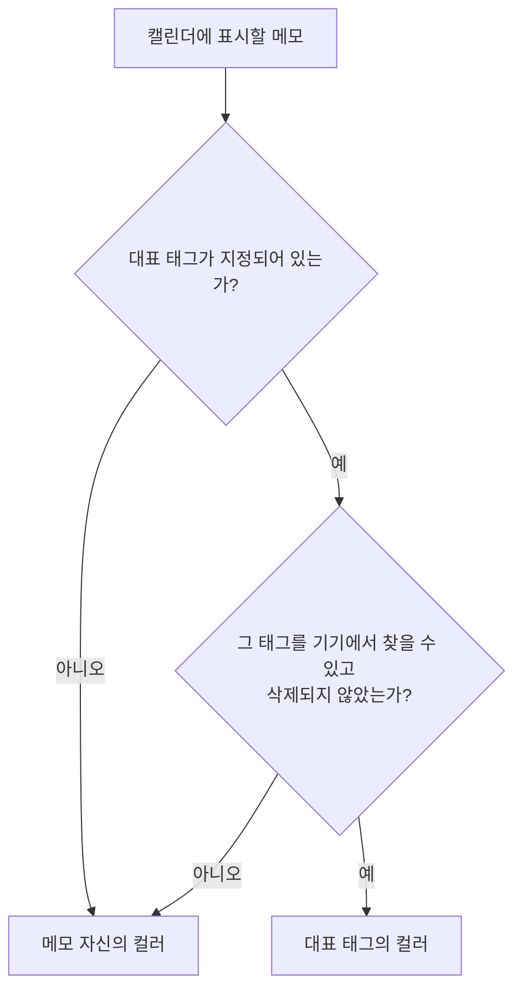

# 메모 대표 태그 스펙

이 문서는 메모가 태그 하나를 대표 태그로 가질 수 있다는 규칙과, 대표 태그가 메모의 저장·동기화·캘린더 표시 색상에 미치는 영향을 다룬다. 메모의 제목·설명·컬러·기간 자체의 규칙은 [MemoAdd 화면 스펙](./memo-add.md)과 [MemoDetail 화면 스펙](./memo-detail.md)을 따르고, 메모와 태그의 연결 규칙은 [메모 태그 스펙](./memo-tag.md)을, 서버 동기화의 공통 규칙은 [데이터 동기화 스펙](./data-sync.md)을 따른다.

대표 태그를 고르고 해제하는 행동과 정책은 [메모 태그 입력 컴포넌트 스펙](./memo-tag-input.md)에서, 구체적인 조작 수단은 [메모 태그 입력 컴포넌트 디자인](../design/memo-tag-input.md)에서 다룬다. 메모를 추가하면서 대표 태그를 지정하는 흐름은 [MemoAdd 화면 스펙](./memo-add.md)에서, 이미 저장된 메모의 대표 태그를 바꾸는 흐름은 [MemoDetail 화면 스펙](./memo-detail.md)에서 다룬다. 캘린더가 메모를 표시하는 기준과 결과는 [캘린더 메모 표시 스펙](./calendar-memo.md)에서 다룬다. 이 문서에는 직접 수행하는 사용자 조작이 없어 `feature` 영역은 생략한다.

## domain

### 대표 태그

메모는 태그 하나를 대표 태그로 가질 수 있다.

대표 태그가 없는 메모도 허용되며, 대표 태그가 없는 것이 메모의 기본 상태다.

하나의 메모가 둘 이상의 태그를 대표 태그로 가질 수 없다.

대표 태그는 메모가 가지는 값이다. 태그 쪽에서 자신을 대표 태그로 쓰는 메모를 지정하지는 않는다.

사용자가 메모의 대표 태그를 지정해 기기 저장소에 반영하면 그 태그는 같은 메모의 연결된 태그에도 포함된다. 연결과 대표 태그 지정의 관계는 [메모 태그 스펙](./memo-tag.md)의 `대표 태그와의 관계`를 따른다.

서버 동기화에서는 메모와 연결을 별도 종류로 반영하므로 이 관계가 항상 성립한다고 보장하지 않는다. 허용하는 중간 상태와 여러 기기 충돌 뒤의 복구 범위는 [데이터 동기화 스펙](./data-sync.md)의 `동기화 단계와 처리 순서`를 따른다.

### 대표 태그 지정 권한

메모에 대표 태그로 지정할 수 있는 태그는 그 메모를 변경하는 계정과 연결된 태그다.

계정과 연결되지 않은 태그는 대표 태그로 지정할 수 없다.

### 캘린더 표시 색상

캘린더에서 메모를 색상으로 표시할 때, 메모에 대표 태그가 있으면 대표 태그의 컬러를 사용하고 없으면 메모 자신의 컬러를 사용한다.

대표 태그로 지정된 태그를 기기에서 찾을 수 없거나 그 태그가 삭제된 상태면, 대표 태그가 없을 때와 같이 메모 자신의 컬러를 사용한다.

메모 자신의 컬러는 대표 태그가 있어도 지워지거나 바뀌지 않는다.

이 규칙은 캘린더의 메모 표시에만 적용한다. 메모 목록의 컬러 표시는 대표 태그와 무관하게 메모 자신의 컬러를 사용하며, 구체적인 표현은 [MemoHome 목록 디자인](../design/memo-home.md)을 따른다.

캘린더에 표시할 메모를 정하는 기준과 이 색상 규칙이 적용된 결과는 [캘린더 메모 표시 스펙](./calendar-memo.md)에서 다룬다.

### 삭제와 대표 태그

태그를 삭제해도 그 태그를 대표 태그로 가진 메모의 대표 태그 지정은 해제되지 않는다. 캘린더 표시 색상만 메모 자신의 컬러로 돌아간다.

삭제한 태그를 실행 취소해 되살리면, 그 태그를 대표 태그로 가진 메모는 다시 대표 태그의 컬러로 표시된다.

메모를 삭제하거나 완료해도 그 메모의 대표 태그 지정은 유지된다.

### 메모 변경과 대표 태그

사용자는 메모를 추가할 때 대표 태그를 지정할 수 있고, 이미 저장된 메모의 대표 태그도 바꿀 수 있다.

메모의 제목·설명·컬러·기간 수정과 완료, 다시 시작, 삭제는 대표 태그 지정을 바꾸지 않는다. 반대로 대표 태그 변경도 메모의 제목·설명·컬러·기간과 완료 여부, 삭제 여부를 바꾸지 않는다.

완료되었거나 삭제된 메모의 대표 태그도 바꿀 수 있다.

## data

### 대표 태그의 저장

대표 태그는 메모의 값으로 메모와 함께 저장된다. 대표 태그가 없는 메모는 대표 태그 값이 비어 있는 상태로 저장된다.

대표 태그가 바뀌면 메모가 변경된 것으로 보고 메모의 수정 시각을 갱신한다.

### 동기화

대표 태그는 메모의 일부로 동기화되며 별도의 업로드·내려받기 종류를 두지 않는다. 업로드 단위, 업로드 대기 해제 기준, 충돌 기준, 내려받기 커서는 [데이터 동기화 스펙](./data-sync.md)의 메모 규칙을 그대로 따른다.

대표 태그만 바뀌어도 메모 전체가 하나의 항목으로 업로드된다. 같은 메모를 여러 기기에서 서로 다르게 바꾸면 수정 시각이 늦은 쪽의 내용이 대표 태그를 포함해 함께 최신으로 반영된다.

서버는 업로드된 메모의 대표 태그가 업로드한 계정과 연결된 태그인지 확인한다. 연결되지 않은 태그를 대표 태그로 지정한 업로드는 반영하지 않는다.

### 내려받기 순서와 표시

메모와 태그의 내려받기는 서로 순서를 두지 않으므로, 대표 태그를 가진 메모가 그 태그보다 먼저 기기에 반영될 수 있다.

이때 메모는 사라지거나 잘못 보이지 않는다. 캘린더 표시 색상 규칙에 따라 메모 자신의 컬러로 표시되고, 태그가 내려받아지면 대표 태그의 컬러로 바뀐다.

대표 태그 지정이 포함된 메모와 그 태그 연결은 서로 다른 종류로 동기화된다. 반영 순서에 따른 중간 상태, 실패한 연결의 재시도와 여러 기기 충돌 뒤의 복구 범위는 [데이터 동기화 스펙](./data-sync.md)의 `동기화 단계와 처리 순서`를 따른다.
