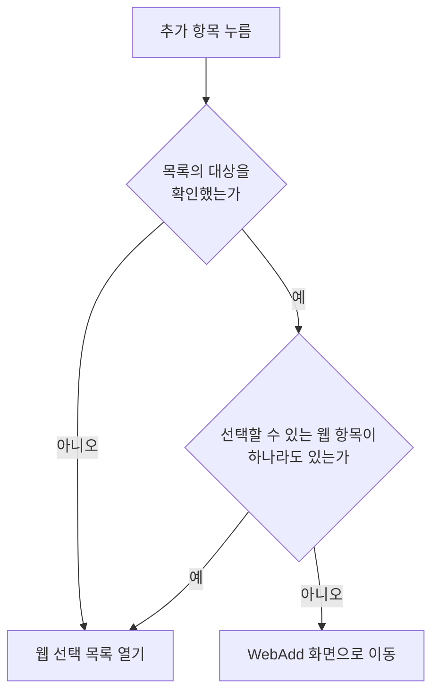

# 메모 웹 입력 컴포넌트 스펙

이 문서는 MemoAdd 화면과 MemoDetail 화면에서 함께 사용하는 웹 입력의 사용자 행동과 정책을 다룬다. 두 화면에서 웹 입력은 같은 행동과 선택 규칙을 제공하며, 구체적인 구성과 조작 수단은 [메모 웹 입력 컴포넌트 디자인](../design/memo-web-input.md)에서 다룬다.

웹 입력에서 사용자가 반영한 선택이 어디에 반영되는지는 화면마다 다르므로 이 문서에서 다루지 않는다. MemoAdd 화면에서는 추가할 메모의 선택으로 반영되고, MemoDetail 화면에서는 상세 대상 메모의 저장된 연결로 반영되며, 각각 [MemoAdd 화면 스펙](./memo-add.md)과 [MemoDetail 화면 스펙](./memo-detail.md)을 따른다.

메모와 웹 항목의 연결 규칙은 [메모 웹 스펙](./memo-web.md)을, 웹 항목이 갖는 정보는 [WebAdd 화면 스펙](./web-add.md)의 `웹 항목의 정보`를, 선택 대상이 되는 웹 항목의 노출 기준은 [WebHome 화면 스펙](./web-home.md)을 따른다. 웹 항목을 눌러 이동하는 웹 상세의 내용과 행동은 [WebDetail 화면 스펙](./web-detail.md)을 따르고, 웹 선택 목록을 검색어로 좁힐 때의 판정 기준은 [검색어 일치 판정 스펙](./search-match.md)을 따른다.

웹 입력은 웹 페이지를 불러와 보여 주지 않는다. 메모 화면에서 웹 페이지를 확인하려면 웹 상세로 이동해야 하며, 웹 페이지 표시 방식과 불러오기 규칙은 [WebDetail 화면 스펙](./web-detail.md)이 소유한다.

디자인: [메모 웹 입력 컴포넌트 디자인](../design/memo-web-input.md)

## feature

### 선택 상태 표시

웹 입력에는 현재 선택한 웹 항목이 표시된다.

선택한 웹 항목과 선택 목록의 웹 항목은 제목으로 구분해 표시한다.

선택한 웹 항목의 제목이 다른 경로로 바뀌면 바뀐 제목이 표시된다.

선택한 것으로 표시하는 웹 항목의 기준은 `domain`의 `선택한 것으로 표시하는 웹 항목`을 따른다. 선택했던 웹 항목이 그 기준에서 빠지면 웹 입력에서도 제외된 것으로 표시한다.

### 웹 상세 이동

사용자는 웹 입력에 표시된 웹 항목을 눌러 그 웹 항목의 [WebDetail 화면](./web-detail.md)으로 이동할 수 있다.

웹 항목을 눌러도 웹 선택 목록은 열리지 않고, 그 웹 항목의 선택도 바뀌지 않는다.

웹 상세에서 웹 입력이 있는 화면으로 돌아오면 선택은 그대로 유지된다. 상세에서 웹 항목의 제목을 바꾸거나 웹 항목을 삭제한 결과는 `선택 상태 표시`의 기준으로 반영된다.

### 웹 선택 목록

웹 입력에는 추가 항목이 표시된다. 추가 항목은 선택한 웹 항목이 없어도 표시된다.

사용자가 추가 항목을 누르면 웹 선택 목록이 열린다. 다만 선택할 수 있는 웹 항목이 하나도 없는 것으로 확정되면 목록을 열지 않고 `웹 추가 이동`에 따라 WebAdd 화면으로 이동한다. 이 분기는 `domain`의 `추가 항목의 동작 판정`을 따른다.

사용자는 웹 선택 목록을 내려 보며 웹 항목과 각 웹 항목의 선택 여부를 확인할 수 있다. 목록에 나타나는 웹 항목의 기준은 `domain`의 `웹 선택 목록에 나타나는 웹 항목`을 따른다.

목록이 나타나는 순서와 아직 준비되지 않은 자리의 처리는 [페이지 조회 목록의 자리 표시 스펙](./paged-list-placeholder.md)을 따른다.

목록에는 별도의 빈 상태 안내를 두지 않는다. 선택할 수 있는 웹 항목을 확인하는 중에 연 목록이 선택할 수 있는 웹 항목이 없는 채로 확정되면 목록 영역은 비어 있는 채로 유지된다. 검색어를 입력해 목록이 비는 경우는 `웹 검색`을 따른다.

웹 선택 목록에는 웹 추가 항목이 항상 표시된다. 나타낼 웹 항목이 하나도 없어도, 목록을 어디까지 확인했어도, 목록을 위아래로 이동해도 이 항목은 계속 표시된다.

사용자가 웹 선택 목록의 웹 추가 항목을 누르면 목록이 닫히고 `웹 추가 이동`에 따라 WebAdd 화면으로 이동한다.

다음 웹 항목을 이어서 불러오는 동안에도 사용자는 이미 나타난 웹 항목의 선택을 바꿀 수 있다. 목록을 처음 불러오거나 다음 웹 항목을 이어서 불러오는 데 실패하면 이미 나타난 웹 항목을 그대로 유지하며 별도 재시도 동작은 제공하지 않는다.

목록을 닫아도 목록에서 반영한 선택은 그대로 유지된다. 목록을 닫았다가 다시 열면 목록은 정렬 순서의 앞부분부터 다시 나타난다.

웹 선택 목록에서는 웹 항목을 눌러도 웹 상세로 이동하지 않는다. 목록에서 웹 항목을 누르는 것은 선택과 해제이며, 웹 상세로 이동하는 조작은 `웹 상세 이동`의 웹 입력에만 있다.

### 웹 검색

웹 선택 목록에는 검색어 입력이 함께 표시된다. 목록을 열면 검색어는 비어 있고 `웹 선택 목록`의 대상이 모두 나타난다.

사용자가 검색어를 입력하면 목록이 검색어를 만족하는 웹 항목만 나타내도록 좁혀진다. 검색을 시작하기 위한 별도의 확정 동작은 필요하지 않으며, 입력한 검색어를 목록에 반영하는 시점은 [검색어 일치 판정 스펙](./search-match.md)의 `검색어 반영 시점`을 따른다.

사용자가 검색어를 바꾸면 목록은 새 검색어 기준으로 다시 채워지고 정렬 순서의 앞부분부터 나타난다. 검색어를 지워 비우면 다시 대상 전체가 나타난다.

검색어로 좁힌 목록에서도 사용자는 웹 항목의 선택과 해제를 그대로 바꿀 수 있다. 선택해도 그 웹 항목은 검색 결과에서 빠지지 않고, 선택을 해제해도 검색어를 만족하는 동안에는 목록에 남는다.

검색어를 입력했는데 그 검색어를 만족하는 웹 항목이 하나도 없으면 목록 자리에 검색어에 맞는 웹 항목이 없으며 다른 검색어로 다시 찾을 수 있음을 알린다. 알리는 조건은 `domain`의 `웹 검색어`를 따른다.

검색어가 비어 있는 동안에는 나타낼 웹 항목이 없어도 결과 없음을 알리지 않고 목록 영역을 비워 둔다.

검색어를 입력해도 웹 추가 항목은 그대로 표시되며, 검색어에 맞는 웹 항목이 없어도 사용자는 그 항목으로 WebAdd 화면에 이동할 수 있다.

검색어는 웹 입력에 선택한 것으로 표시하는 웹 항목을 좁히지 않는다.

목록을 닫으면 검색어는 사라진다. 목록을 다시 열면 검색어가 비어 있는 상태에서 대상 전체를 다시 확인한다.

### 웹 추가 이동

사용자는 다음 두 경로로 [WebAdd 화면](./web-add.md)으로 이동한다.

- 선택할 수 있는 웹 항목이 하나도 없는 것으로 확정된 상태에서 웹 입력의 추가 항목을 누른다.
- 웹 선택 목록의 웹 추가 항목을 누른다.

어느 경로로 이동하든 이동 자체는 선택을 바꾸지 않는다. 웹 선택 목록에서 이동한 경우 목록은 닫힌 채로 이동한다.

WebAdd 화면에서 웹 입력이 있는 화면으로 돌아오면 그 화면에서 추가한 웹 항목이 선택된다. 이동하기 전에 있던 선택은 그대로 유지되고 추가한 웹 항목이 더해진다. 이 판정은 `domain`의 `추가한 웹 항목의 자동 선택`을 따른다.

웹 항목을 하나도 추가하지 않고 돌아오면 선택은 그대로다.

돌아와도 웹 선택 목록이 저절로 다시 열리지는 않는다. 추가 항목을 다시 누르면 추가한 웹 항목이 나타나는 웹 선택 목록이 열린다.

### 웹 선택과 해제

사용자는 웹 선택 목록에서 웹 항목을 선택하거나 선택을 해제할 수 있고, 한 번에 여러 웹 항목을 선택할 수 있다.

선택과 해제는 즉시 반영되며 별도의 확정 동작은 필요하지 않다. 선택한 웹 항목은 웹 입력에 나타나고, 해제한 웹 항목은 웹 입력에서 사라진다.

## domain

### 선택할 수 있는 웹 항목

웹 입력에서 선택할 수 있는 웹 항목은 현재 사용자 계정과 연결된 웹 항목 중 삭제되지 않은 웹 항목이다. 삭제된 웹 항목은 새로 선택할 수 없다.

선택할 수 있는 웹 항목은 제목 오름차순으로 정렬한다. 제목이 같은 웹 항목끼리의 순서는 정하지 않는다. [WebHome 화면 스펙](./web-home.md)의 정렬 선택은 웹 입력에 적용하지 않으므로, 사용자가 웹 목록에서 다른 정렬을 골라 두었어도 웹 입력과 웹 선택 목록의 순서는 바뀌지 않는다.

선택할 수 있는 웹 항목은 정렬 순서를 유지한 채 사용자가 확인하는 만큼 이어서 다룬다. 사용자가 아직 확인하지 않은 구간의 웹 항목도 선택할 수 있는 웹 항목에 포함되며, 목록의 어느 구간을 확인했는지는 선택 여부의 판정에 영향을 주지 않는다.

### 웹 선택 목록에 나타나는 웹 항목

웹 선택 목록에는 선택할 수 있는 웹 항목이 모두 나타난다. 다만 목록은 사용자가 확인하는 만큼 이어서 준비되므로, 아직 준비되지 않은 구간의 웹 항목은 그 구간이 준비된 뒤에 나타난다.

웹 항목에는 완료 상태가 없어 `선택한 것으로 표시하는 웹 항목`과 `선택할 수 있는 웹 항목`의 기준이 같으므로, 태그 선택 목록과 달리 선택할 수 있는 웹 항목 외에 목록에 추가로 나타나는 웹 항목은 없다. 두 기준은 MemoAdd 화면과 MemoDetail 화면에서도 같다.

### 추가 항목의 동작 판정

이 판정은 웹 입력의 추가 항목에만 적용한다. 웹 선택 목록의 웹 추가 항목은 판정 없이 항상 WebAdd 화면으로 이동한다.

추가 항목의 동작은 `선택할 수 있는 웹 항목`이 하나라도 있는지로 정한다. 하나라도 있으면 웹 선택 목록을 열고, 하나도 없으면 WebAdd 화면으로 이동한다.

검색어는 이 판정에 쓰지 않는다. 목록은 언제나 빈 검색어로 열리므로 판정 대상도 검색어로 좁혀지지 않는다.

선택할 수 있는 웹 항목이 없다는 판정은 [페이지 조회 목록의 자리 표시 스펙](./paged-list-placeholder.md)의 `빈 상태 판정`과 같은 기준으로 목록의 대상을 확인한 뒤에만 내린다. 아직 확인하는 중이면 없는 것으로 판정하지 않고 웹 선택 목록을 연다.

### 웹 검색어

검색어의 정규화와 웹 항목의 일치 판정, 검색어에 맞는 웹 항목이 없다고 알리는 조건은 [검색어 일치 판정 스펙](./search-match.md)을 따른다. 일치 판정에는 웹 항목의 제목과 설명을 쓰고 URL과 요청 헤더는 쓰지 않는다.

빈 검색어는 목록을 좁히지 않는다. 검색어가 비어 있으면 `웹 선택 목록에 나타나는 웹 항목`의 대상이 그대로 목록의 대상이 된다.

검색어를 만족하지 않는 웹 항목은 선택한 웹 항목이어도 목록에서 빠진다. 이는 목록의 표시 기준일 뿐이며 그 웹 항목의 선택을 바꾸지 않는다.

검색어는 목록이 열려 있는 동안 유지한다. 목록을 닫으면 사라지며, 화면이 회전하거나 시스템에 의해 화면이 재생성되어도 목록이 그대로 열려 있으면 검색어와 그 결과도 유지한다.

### 추가한 웹 항목의 자동 선택

WebAdd 화면에서 추가한 웹 항목은 웹 입력이 있는 화면으로 돌아왔을 때 선택한 웹 항목에 더해진다. 웹 입력에서 웹 추가로 이동한 사용자는 그 웹 항목을 이 메모에 쓰려는 것으로 보기 때문이다.

한 번의 이동에서 웹 항목을 여러 개 추가하면 추가한 웹 항목이 모두 선택된다. 어느 경로로 WebAdd 화면에 이동했는지는 자동 선택에 영향을 주지 않는다.

자동 선택된 웹 항목은 사용자가 웹 선택 목록에서 선택한 웹 항목과 같게 다룬다. 선택이 어디에 반영되는지도 `웹 선택과 해제`와 같으므로 화면마다 다르다.

자동 선택은 돌아온 시점에 한 번만 적용한다. 자동 선택된 웹 항목의 선택을 사용자가 해제하면 해제한 상태가 유지되며 다시 선택되지 않는다.

앱을 종료한 뒤 화면에 새로 진입하면 돌아오는 흐름이 아니므로 자동 선택도 일어나지 않는다.

### 선택한 것으로 표시하는 웹 항목

웹 입력과 웹 선택 목록에 선택한 것으로 표시하는 웹 항목은 현재 사용자 계정과 연결된 웹 항목 중 삭제되지 않은 웹 항목이다. 삭제된 웹 항목은 어느 화면에서도 선택한 것으로 표시하지 않는다.

선택한 것으로 표시하는 웹 항목은 웹 선택 목록에서 그 웹 항목이 있는 구간이 준비되었는지와 관계없이 정해진다. 사용자가 목록을 내려 보지 않아도 웹 입력에는 선택한 웹 항목이 모두 나타난다.

선택되어 있던 웹 항목이 삭제되면 그 웹 항목은 선택에서 제외된 것으로 표시한다. 이는 표시 기준이며, MemoDetail 화면에서 이미 저장된 메모와 웹 항목의 연결을 해제하지는 않는다. 저장된 연결이 유지되는 규칙은 [항목 연결 공통 스펙](./entity-link.md)의 `항목의 상태 변화와 연결`를 따른다.

### 진행 상태 유지

화면이 회전하거나 시스템에 의해 화면이 재생성되어도 사용자가 보고 있던 선택과, 목록이 열려 있으면 그 목록과 검색어는 유지된다.

웹 항목을 눌러 웹 상세로 이동했다가 돌아와도 선택은 같은 기준으로 유지된다.

MemoDetail 화면에서 상세 대상 메모가 다른 메모로 바뀌면 웹 입력은 새 대상 메모의 화면에 새로 진입한 것과 같은 상태로 시작한다. 웹 입력은 새 대상 메모에 연결된 웹 항목을 표시하고, 열려 있던 웹 선택 목록과 검색어는 유지하지 않는다.

## data

### 웹 목록 조회

웹 선택 목록은 저장소에서 현재 사용자 계정의 웹 항목을 `domain`의 기준과 정렬 순서로 페이지 단위로 조회해 표시한다.

조회는 사용자가 목록을 확인하는 만큼 이어서 이루어지며, 아직 확인하지 않은 구간의 웹 항목은 그 구간을 확인할 때 조회한다.

검색어가 비어 있지 않으면 `domain`의 `웹 검색어` 기준을 조회 조건에 함께 적용해 검색어를 만족하는 웹 항목만 조회한다. 검색어가 바뀌면 새 검색어 기준으로 첫 페이지부터 다시 조회한다.

최초 조회나 추가 조회에 실패하면 이미 표시된 웹 항목을 유지하며 별도의 오류 안내나 재시도 동작을 제공하지 않는다.

현재 선택 상태는 선택 목록의 조회와 분리된 조회로 표시하므로, 사용자가 목록을 얼마나 확인했는지와 목록에 입력한 검색어에 영향을 받지 않는다. MemoAdd 화면은 사용자가 선택한 웹 항목의 식별자로 그 웹 항목만 조회하고, MemoDetail 화면은 [MemoDetail 화면 스펙](./memo-detail.md)의 `웹 입력의 조회`를 따른다.

웹 항목이 추가되거나 저장된 웹 항목의 제목·상태가 바뀌면 조회 결과가 갱신되어 현재 선택 상태와 선택 목록에 반영된다.
