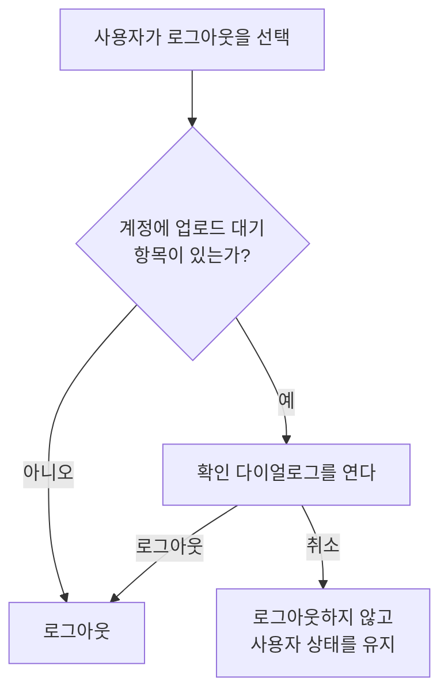

# MoreHome 화면 스펙

이 문서는 `더보기` 주요 목적지에서 처음 보이는 MoreHome 화면의 내용과 행동만 다룬다. 목적지의 선택과 전환은 [TopLevelNavigation 스펙](./top-level-navigation.md)에서, 로그인 흐름은 [Login 화면 스펙](./login.md)에서, 설정 화면은 [SettingHome 화면 스펙](./setting-home.md)에서, 아직 기능을 제공하지 않는 바로가기 화면은 [더보기 준비 중 화면 공통 스펙](./more-menu-placeholder.md)에서, 항목이 업로드 대기 상태가 되고 해제되는 규칙은 [데이터 동기화 스펙](./data-sync.md)에서 다룬다.

디자인: [MoreHome 화면 디자인](../design/more-home.md)

## feature

### 화면 내용

MoreHome 화면에서는 현재 계정 상태와 기능 바로가기를 확인할 수 있다.

사용자는 계정 상태와 관계없이 설정 화면으로 이동할 수 있다.

### 계정 상태와 행동

계정 정보를 확인하는 동안에는 사용자 이름이나 계정 라벨을 표시하지 않으며 로그인이나 로그아웃을 실행할 수 없다.

로그인하지 않은 상태에서는 게스트 상태임을 표시하며, 사용자는 로그인을 시작해 Login 화면으로 이동할 수 있다.

로그인한 상태에서는 사용자 이메일을 표시하며, 사용자는 로그아웃할 수 있다. 로그아웃에 성공하면 계정 상태는 게스트로 바뀐다.

표시할 프로필 이미지가 없으면 기본 프로필 이미지를 표시한다.

### 로그아웃 확인

사용자가 로그아웃을 선택하면, 서버에 아직 반영되지 않은 변경이 남아 있을 때만 한 번 더 확인하는 다이얼로그가 열린다. 남아 있지 않으면 다이얼로그 없이 그대로 로그아웃한다.

다이얼로그는 아직 반영되지 않은 변경이 있다는 것과, 로그아웃하면 그 변경이 이 기기에서 같은 계정으로 다시 로그인하기 전까지 서버에 반영되지 않는다는 것을 알린다. 남아 있는 변경의 개수나 종류는 알리지 않는다.

사용자는 다이얼로그에서 로그아웃과 취소 중 하나를 고른다.

- 로그아웃을 고르면 다이얼로그가 닫히고 로그아웃이 진행된다. 계정 상태는 게스트로 바뀐다.
- 취소를 고르면 다이얼로그가 닫히고 로그아웃하지 않는다. 계정 상태와 화면에 표시하는 계정 정보는 그대로 유지된다.

다이얼로그를 고르지 않고 닫으면 취소를 고른 것과 같다.

다이얼로그가 열려 있는 동안에는 화면의 다른 조작을 할 수 없다.

### 프로필 사진 선택

로그인한 상태에서 사용자는 프로필을 선택해 기기가 제공하는 사진 선택 도구를 열 수 있다.

사용자가 사진을 고르면 그 사진을 프로필 이미지로 반영하도록 요청한다. 선택을 취소하면 아무것도 요청하지 않는다.

반영에 성공해도 화면에 표시하는 프로필 이미지는 곧바로 바뀌지 않는다. 앱이 로그인 사용자 정보를 다시 확인한 뒤에 바뀐 프로필 이미지를 표시한다.

반영에 실패해도 오류를 안내하지 않고 계정 상태와 화면에 표시하는 계정 정보는 그대로 유지한다.

고른 사진을 프로필 이미지로 반영하는 규칙은 [프로필 이미지 변경 스펙](./profile-image.md)을 따른다.

### 기능 바로가기

현재 기능 바로가기는 다음 열 항목이며, 표시 순서는 `domain > 기능 바로가기 순서`를 따른다.

1. `QR`
2. `검색`
3. `디데이`
4. `연락처`
5. `웹`
6. `장소`
7. `체크리스트`
8. `파일`
9. `플레이리스트`
10. `황금연휴`

사용자는 모든 항목을 선택해 그 항목의 화면으로 이동할 수 있다.

| 항목 | 이동 대상 화면 |
| --- | --- |
| `QR` | [QrHome 화면](./qr-home.md) |
| `검색` | [SearchHome 화면](./search-home.md) |
| `디데이` | [DDayHome 화면](./dday-home.md) |
| `연락처` | [ContactHome 화면](./contact-home.md) |
| `웹` | [WebHome 화면](./web-home.md) |
| `장소` | [PlaceHome 화면](./place-home.md) |
| `체크리스트` | [ChecklistHome 화면](./checklist-home.md) |
| `파일` | [FileHome 화면](./file-home.md) |
| `플레이리스트` | [PlaylistHome 화면](./playlist-home.md) |
| `황금연휴` | [HolidayHome 화면](./holiday-home.md) |

`QR`, `디데이`, `체크리스트`, `파일`의 화면은 아직 기능을 제공하지 않으며, 그 화면에서 보장하는 내용과 행동은 [더보기 준비 중 화면 공통 스펙](./more-menu-placeholder.md)을 따른다.

날씨는 기능 바로가기로 제공하지 않는다. 사용자는 [CalendarHome 화면 스펙](./calendar-home.md)의 날씨 표시로 날짜별 날씨를 확인한다.

## domain

### 기능 바로가기 순서

기능 바로가기는 한국어 이름의 가나다순으로 제공하고, 한글이 아닌 이름의 항목은 그 앞에 둔다. 모든 항목의 이동 대상 화면이 정해져 있으므로 항목을 따로 묶지 않는다.

이 순서는 사용자 언어에 따라 달라지지 않는다. 따라서 한국어가 아닌 환경에서도 한국어 이름으로 정한 같은 순서로 제공한다.

항목이 늘어나면 그 항목을 같은 규칙에 맞는 자리에 둔다. 늘어난 항목이 아직 기능을 제공하지 않더라도 자리는 이름으로만 정한다. 사용자가 찾는 이름의 자리가 기능 준비 여부에 따라 달라지지 않게 하기 위해서다.

### 계정 표시 상태

계정 상태는 확인 중, 게스트, 사용자 중 하나다.

로그인한 사용자 정보를 아직 확인하지 못했거나 확인에 실패하면 확인 중 상태다. 로그인한 사용자 정보가 없으면 게스트 상태이고, 로그인한 사용자 정보가 있으면 사용자 상태다.

사용자 상태에서는 사용자 정보의 이메일과 프로필 이미지를 표시 정보로 사용한다.

### 프로필 사진 선택 조건

프로필 사진 선택은 사용자 상태에서만 허용한다. 확인 중과 게스트 상태에서는 프로필을 선택할 수 없다.

사진 선택 도구는 사용자가 쓰는 기기가 제공하는 것을 사용한다. 앱은 별도의 사진 선택 화면을 정의하지 않는다.

### 로그아웃 확인 조건

로그아웃 확인이 필요한지는 사용자가 로그아웃을 선택한 시점에 그 계정의 업로드 대기 항목이 하나라도 있는지로 정한다. 업로드 대기 상태의 정의와 그 상태가 되고 해제되는 기준은 [데이터 동기화 스펙](./data-sync.md)의 `동기화 상태`를 따른다.

세션 갱신 여부는 이 판단에 쓰지 않는다. 세션이 갱신되지 않아 지금 서버에 반영할 수 없는 상태에서도 업로드 대기 항목이 있으면 같은 확인을 받는다.

열두 종류 중 어느 종류의 업로드 대기 항목인지는 구분하지 않는다. 한 종류라도 남아 있으면 확인이 필요하다.

확인이 필요한지는 로그아웃을 선택한 시점에 한 번만 정한다. 다이얼로그가 열려 있는 동안 동기화가 끝나 업로드 대기 항목이 모두 해제되어도 다이얼로그는 닫히지 않고, 사용자가 로그아웃이나 취소를 고를 때까지 기다린다.

### 로그아웃 확인 실행 경계

다이얼로그가 열려 있는 동안 화면이 회전하거나 시스템에 의해 재생성되어도 다이얼로그는 열린 상태를 유지한다.

사용자가 화면을 떠난 뒤 다시 들어오거나 앱을 종료한 뒤 새로 시작하면 다이얼로그는 닫힌 상태로 시작하고, 로그아웃은 진행되지 않은 것으로 본다.

## data

### 계정 표시 정보의 출처

계정 상태와 표시 내용은 현재 로그인 세션과 저장된 사용자 정보에서 결정된다.

MoreHome 화면에서 표시하는 계정 정보는 조회한 정보를 그대로 사용하며, 표시를 위해 저장된 사용자 정보를 수정하지 않는다.

### 프로필 이미지 반영 요청

프로필 사진 선택으로 고른 사진은 저장된 사용자 정보의 프로필 이미지를 바꾸도록 요청한다. 요청에는 고른 사진의 위치를 그대로 전달한다.

요청을 받은 뒤의 반영 흐름과 결과 전달은 [프로필 이미지 변경 스펙](./profile-image.md)의 `data`를 따른다.

### 업로드 대기 항목 조회

로그아웃 확인 여부를 정하기 위해 계정의 업로드 대기 항목이 있는지를 기기 저장소에서 조회한다. 조회는 있는지 없는지만 확인하고 항목의 내용을 가져오지 않는다.

이 조회는 서버에 요청하지 않으므로 네트워크 연결이나 세션 갱신 여부의 영향을 받지 않는다.

### 로그아웃 시 데이터 처리

사용자가 로그아웃하면 저장된 로그인 세션이 제거된다.

세션이 제거되면 저장된 사용자 정보가 더 이상 조회되지 않아 계정 상태는 게스트로 바뀐다.

로그아웃해도 기기에 저장된 사용자 데이터와 업로드 대기 상태는 지워지지 않는다. 같은 기기에서 같은 계정으로 다시 로그인하면 남아 있던 업로드 대기 항목이 다음 동기화 계기에 그대로 업로드된다.
