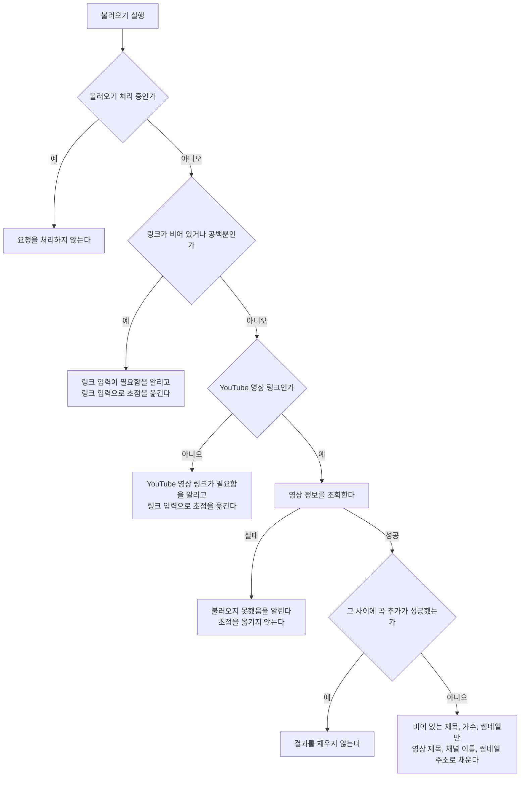

# MusicAdd 화면 스펙

이 문서는 사용자가 새 곡을 작성해 플레이리스트에 추가하는 MusicAdd 화면의 내용과 행동, 그리고 추가되는 곡이 갖는 정보와 정책을 다룬다. MusicAdd로 진입하는 흐름과 저장한 곡의 목록 표시는 [PlaylistHome 화면 스펙](./playlist-home.md)에서 다룬다.

작성 상태 유지, 뒤로가기, 추가 요청 제한, 계정 연결과 저장·동기화 계약은 [항목 추가 화면 공통 스펙](./entity-add.md)을 따른다. 이 문서에서는 MusicAdd 화면에서만 다른 시작 상태와 추가 결과를 다룬다.

이번 범위는 사용자가 YouTube 영상 링크와 제목, 가수를 입력해 곡을 추가하고, 입력한 링크로 제목과 가수와 썸네일을 불러오는 것까지다. 곡에 태그를 연결하는 것, 저장한 곡의 링크를 여는 것, 저장한 곡의 상세 확인, 수정, 삭제는 이번 범위에서 다루지 않는다.

디자인: [MusicAdd 화면 디자인](../design/music-add.md)

## feature

### 진입과 입력

사용자는 PlaylistHome 화면에서 곡 추가를 선택해 MusicAdd 화면으로 이동한다.

사용자는 링크, 제목과 가수를 입력하거나 바꿀 수 있다. 세 값은 각각 한 줄 분량을 입력할 수 있다.

화면에 처음 진입하면 링크, 제목, 가수가 비어 있는 상태로 시작한다. 사용자가 링크부터 바로 붙여 넣을 수 있도록 입력 초점을 링크 입력에 둔다.

### 링크로 곡 정보 불러오기

사용자는 입력한 링크로 제목과 가수와 썸네일을 불러올 수 있다. 불러오기는 사용자가 실행할 때만 일어나며, 링크를 입력하거나 바꾸는 것만으로는 일어나지 않는다.

불러오기를 처리하는 동안에는 진행 상태를 표시한다.

불러오기에 성공하면 그 링크가 가리키는 영상의 제목과 채널 이름과 썸네일을 화면에 채운다. 채우는 대상은 `domain`의 `불러온 값을 채우는 기준`을 따르므로, 사용자가 이미 적어 둔 제목이나 가수는 바뀌지 않는다. 링크 입력도 바꾸지 않고 입력 초점도 옮기지 않는다.

불러오기로 채워진 제목과 가수는 사용자가 그대로 고칠 수 있다. 채워진 값과 사용자가 직접 입력한 값은 이후 구분하지 않는다.

### 썸네일 확인

사용자는 불러온 썸네일을 추가하기 전에 화면에서 확인할 수 있다. 아직 불러오지 않았거나 불러오기에 실패했으면 썸네일을 확인할 자리는 비어 있다.

썸네일은 사용자가 직접 입력하거나 고르는 값이 아니므로 썸네일만 따로 바꾸거나 지우는 조작은 제공하지 않는다.

### 불러오기 실패

링크가 비어 있거나 공백만 있는 상태에서 불러오기를 실행하면 링크 입력이 필요하다는 피드백을 제공하고 입력 초점을 링크 입력으로 옮긴다.

링크가 `domain`의 `링크의 판정`을 만족하지 않는 상태에서 불러오기를 실행하면 YouTube 영상 링크가 필요하다는 피드백을 제공하고 입력 초점을 링크 입력으로 옮긴다.

링크는 만족하지만 영상 정보를 가져오지 못하면 불러오지 못했다는 피드백을 제공한다. 이때는 입력 초점을 옮기지 않는다. 사용자는 링크를 고치거나 같은 링크로 다시 시도할 수 있고, 제목과 가수를 직접 입력해 곡을 추가할 수도 있다.

어느 경우에도 링크, 제목, 가수와 이미 불러온 썸네일은 지워지거나 바뀌지 않는다.

### 곡 추가

사용자는 입력한 내용으로 곡 추가를 실행할 수 있다.

곡 추가를 처리하는 동안에는 진행 상태를 표시한다.

추가에 성공하면 화면을 유지한 채 링크, 제목, 가수와 불러온 썸네일을 비운다. 사용자가 다음 곡 입력을 바로 이어갈 수 있도록 입력 초점을 링크 입력으로 옮기고 성공 피드백을 제공한다.

### 링크 미입력

링크가 비어 있거나 공백만 있는 상태에서 추가를 실행하면 곡을 추가하지 않고 링크 입력이 필요하다는 피드백을 제공한다.

입력 중이던 제목과 가수는 유지하고 입력 초점을 링크 입력으로 옮기므로, 사용자는 링크를 바로 입력한 뒤 다시 시도할 수 있다.

### 링크 형식 불만족

링크가 `domain`의 `링크의 판정`을 만족하지 않는 상태에서 추가를 실행하면 곡을 추가하지 않고 YouTube 영상 링크가 필요하다는 피드백을 제공한다.

입력 중이던 제목과 가수는 유지하고 입력 초점을 링크 입력으로 옮기므로, 사용자는 링크를 바로 고친 뒤 다시 시도할 수 있다.

### 제목 미입력

제목이 비어 있거나 공백만 있는 상태에서 추가를 실행하면 곡을 추가하지 않고 제목 입력이 필요하다는 피드백을 제공한다.

입력 중이던 링크와 가수는 유지하고 입력 초점을 제목 입력으로 옮기므로, 사용자는 제목을 바로 입력한 뒤 다시 시도할 수 있다.

### 가수 미입력

가수가 비어 있거나 공백만 있는 상태에서 추가를 실행하면 곡을 추가하지 않고 가수 입력이 필요하다는 피드백을 제공한다.

입력 중이던 링크와 제목은 유지하고 입력 초점을 가수 입력으로 옮기므로, 사용자는 가수를 바로 입력한 뒤 다시 시도할 수 있다.

### 작성 상태 유지 대상

[항목 추가 화면 공통 스펙](./entity-add.md)의 `작성 상태 유지`가 유지하는 대상은 입력 중이던 링크, 제목, 가수와 불러온 썸네일이다.

## domain

### 곡의 정보

곡 하나는 다음 정보를 갖는다.

- 링크: 그 곡을 들을 수 있는 YouTube 영상의 주소.
- 제목: 곡을 가리키는 이름.
- 가수: 그 곡을 부른 사람이나 팀의 이름.
- 썸네일: 그 영상을 나타내는 이미지의 주소로, 비어 있을 수 있다.

썸네일은 사용자가 입력하는 값이 아니라 불러오기로만 얻는 값이다. 불러오기를 실행하지 않고 추가한 곡은 썸네일이 비어 있다.

곡은 태그와 연결되지 않는다. 곡을 태그로 묶어 찾는 것은 후속 범위에서 다룬다.

### 링크의 판정

링크는 앞뒤 공백을 없앤 값으로 판정한다. 사용자가 주소를 붙여 넣을 때 앞뒤에 딸려 오는 공백은 주소의 일부가 아니다.

앞뒤 공백을 없앤 값이 다음을 모두 만족하면 YouTube 영상 링크로 본다.

- 주소 형식을 갖추고 있고 방식이 `http` 또는 `https`다.
- 주소의 호스트가 `youtube.com`이거나 `youtube.com`의 하위 도메인이거나 `youtu.be`다.

호스트의 대소문자는 구분하지 않는다.

호스트 뒤의 경로와 질의는 판정하지 않는다. `www.youtube.com`의 영상 주소, `m.youtube.com`과 `music.youtube.com`의 영상 주소, `youtu.be`의 짧은 주소, 그리고 재생 목록이나 시작 시각이 함께 붙은 주소를 모두 받는다. 그 주소에 실제로 볼 수 있는 영상이 있는지는 이 판정이 다루지 않으며, 사용자가 불러오기를 실행했을 때 `data`의 `영상 정보 조회`에서 드러난다.

### 불러오기 성립 조건

불러오기는 링크가 `링크의 판정`을 만족해야 실행할 수 있다. 링크가 비어 있거나 공백 문자로만 이루어져 있으면 링크 미입력으로, 그 밖에 판정을 만족하지 않으면 링크 형식 불만족으로 다루고 영상 정보를 조회하지 않는다.

제목과 가수와 썸네일은 불러오기의 성립 조건이 아니다. 세 값이 이미 채워져 있어도 불러오기를 실행할 수 있다.

불러오기를 처리하는 동안에는 같은 화면에서 전달된 불러오기 요청을 처리하지 않는다. 처리가 끝나면 사용자는 다시 불러올 수 있다.

### 불러온 값을 채우는 기준

불러오기에 성공하면 비어 있거나 공백 문자로만 이루어진 값만 채운다. 제목이 비어 있으면 영상 제목으로, 가수가 비어 있으면 채널 이름으로, 썸네일이 비어 있으면 영상의 썸네일 주소로 채운다.

이미 값이 있으면 바꾸지 않는다. 사용자가 고쳐 둔 제목이나 가수를 불러오기가 되돌리지 않으며, 썸네일도 같은 기준으로 다룬다. 따라서 세 값이 모두 채워져 있으면 불러오기에 성공해도 화면의 값은 바뀌지 않는다.

썸네일에 같은 기준을 쓰므로, 사용자가 어떤 영상을 불러온 뒤 링크만 다른 영상으로 바꿔 추가하면 링크와 썸네일이 서로 다른 영상을 가리키는 곡이 저장될 수 있다. 이는 사용자가 고른 값을 제품이 임의로 되돌리지 않기 위해 받아들이는 결과이며, 사용자는 썸네일이 맞지 않으면 링크를 지우고 다시 입력해 곡을 새로 작성할 수 있다.

영상 제목과 채널 이름은 가져온 값을 그대로 채우고, 앞뒤 공백이나 서비스 이름 같은 부분을 덜어 내지 않는다.

곡 추가에 성공해 입력을 비운 뒤에는, 그 전에 시작한 불러오기의 결과를 채우지 않는다. 비워진 입력이 이전 곡의 값으로 다시 채워지지 않게 하기 위한 것이다.

### 추가 성립 조건

곡은 링크를 가져야 추가할 수 있다. 링크가 비어 있거나 공백 문자로만 이루어져 있으면 추가하지 않는다.

곡의 링크는 `링크의 판정`을 만족해야 한다. 만족하지 않으면 추가하지 않는다. 곡은 들을 수 있는 영상을 가리키는 항목이므로, 영상이 아닌 주소를 곡의 링크로 두지 않는다.

곡은 제목을 가져야 추가할 수 있다. 제목이 비어 있거나 공백 문자로만 이루어져 있으면 추가하지 않는다.

곡은 가수를 가져야 추가할 수 있다. 가수가 비어 있거나 공백 문자로만 이루어져 있으면 추가하지 않는다.

썸네일은 추가 성립 조건이 아니다. 썸네일이 비어 있어도 곡을 추가할 수 있다.

가수는 곡을 서로 구분하는 정보이므로 선택 입력으로 두지 않는다. 제목이 같은 곡이 여러 개일 수 있고, 사용자는 가수로 그 곡들을 구분한다.

같은 링크, 제목과 가수의 곡을 이미 추가했더라도 새 곡으로 추가한다. 같은 곡을 두 번 넣었는지는 사용자가 판단할 일이며, 제품이 막지 않는다.

여러 조건이 함께 성립하지 않으면 링크 미입력, 링크 형식, 제목, 가수 순으로 판단하고 먼저 성립하지 않은 조건 하나의 결과만 알린다. 이 순서는 사용자가 화면에서 입력을 만나는 순서와 같다.

### 추가되는 곡의 내용

기록되는 공통 값은 [항목 추가 화면 공통 스펙](./entity-add.md)의 `추가되는 항목의 내용`을 따른다.

곡에는 사용자가 입력한 링크, 제목과 가수, 그리고 불러온 썸네일을 기록한다.

링크는 `링크의 판정`과 같게 앞뒤 공백을 없앤 값을 기록한다. 기록한 링크를 그대로 열 수 있어야 하므로 주소가 아닌 공백을 함께 남기지 않는다.

제목과 가수는 앞뒤 공백을 포함해 사용자가 입력한 문자열을 바꾸지 않고 기록한다.

썸네일은 불러오기로 얻은 주소를 그대로 기록하고, 불러오지 않았으면 빈 값으로 기록한다.

### 링크나 썸네일이 없는 곡

이번 범위 전에 추가되어 링크가 비어 있는 곡도 그대로 남고 [PlaylistHome 화면 스펙](./playlist-home.md)의 노출 기준을 그대로 만족한다. 링크가 없다는 이유로 목록에서 빠지거나 사용자에게 링크 입력을 요구하지 않는다.

링크는 새로 추가하는 곡에만 요구된다. 이미 저장된 곡에 링크를 채워 넣는 것은 곡 수정에 해당하므로 후속 범위에서 다룬다.

썸네일이 비어 있는 곡도 같게 다룬다. 썸네일은 어느 곡에도 요구되지 않으므로, 썸네일이 없다고 해서 목록에서 빠지거나 추가가 막히지 않는다. 썸네일이 없는 곡을 목록에서 어떻게 보여 주는지는 [PlaylistHome 화면 스펙](./playlist-home.md)의 `곡 목록`을 따른다.

## data

### 영상 정보 조회

불러오기를 실행하면 사용자가 입력한 링크로 YouTube가 공개하는 영상 정보를 조회해 영상 제목과 채널 이름과 썸네일 주소를 얻는다. 조회는 사용자가 불러오기를 실행할 때만 일어나며, 화면 진입이나 링크 입력만으로는 일어나지 않는다.

조회한 값은 화면을 채우는 데만 쓰고 따로 저장하지 않는다. 곡에 기록되는 제목과 가수와 썸네일은 사용자가 추가를 실행한 시점에 화면에 있는 값이다. 불러온 뒤 영상의 제목이나 채널 이름이 바뀌어도 이미 추가한 곡은 바뀌지 않는다.

썸네일은 이미지 자체가 아니라 주소만 기록한다. 이미지를 기기나 서버에 복사해 두지 않으므로, 영상이 사라져 그 주소를 더 이상 열 수 없게 되면 곡의 썸네일도 보이지 않는다. 이때도 곡은 그대로 남고 제목과 가수로 확인할 수 있다.

조회할 수 없는 링크는 불러오기 실패로 다룬다. 없거나 삭제된 영상, 비공개 영상, 영상이 아닌 YouTube 주소, 네트워크를 사용할 수 없는 상태를 모두 같은 실패로 다루며 서로 다른 안내로 나누지 않는다. 사용자가 할 수 있는 일이 링크를 고치거나 다시 시도하는 것으로 같기 때문이다.

조회에 실패해도 곡 추가는 막지 않는다. 사용자는 제목과 가수를 직접 입력해 그 링크로 곡을 추가할 수 있다.

### 곡 생성과 저장

저장 흐름은 [항목 추가 화면 공통 스펙](./entity-add.md)의 `생성과 저장`을 따른다. 이때 함께 반영되는 것은 새 곡과 현재 사용자 계정의 연결이다.

곡의 링크와 썸네일은 제목, 가수와 함께 곡의 내용으로 저장되며, 곡을 조회하면 함께 조회된다.

### 동기화

추가한 곡은 [데이터 동기화 스펙](./data-sync.md)의 `곡` 종류로 서버에 반영된다. 링크와 썸네일은 제목, 가수와 함께 곡의 내용으로 반영된다. 반영 시점과 실패 처리는 [항목 추가 화면 공통 스펙](./entity-add.md)의 `동기화`를 따른다.

## 참고

- [YouTube oEmbed](https://oembed.com/) — 링크로 영상 제목과 채널 이름과 썸네일 주소를 조회하는 공개 엔드포인트
