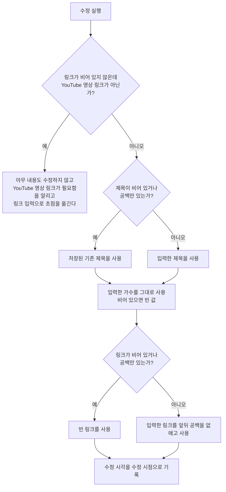

# MusicDetail 화면 스펙

이 문서는 사용자가 선택한 곡의 상세를 확인하고 제목과 가수와 링크를 수정하고, 링크로 곡 정보를 다시 불러오고, 그 곡의 링크를 앱 밖에서 열고, 그 곡을 삭제하는 MusicDetail 화면의 내용과 행동을 다룬다. MusicDetail로 진입하는 흐름과 삭제한 곡이 목록에서 사라지는 것은 [PlaylistHome 화면 스펙](./playlist-home.md)에서, 곡 목록과 상세를 함께 사용하는 배치는 [Playlist 목록·상세 배치 스펙](./playlist-list-detail.md)에서, 곡이 갖는 정보와 링크·썸네일의 판정과 불러오기의 규칙은 [MusicAdd 화면 스펙](./music-add.md)에서, 대상 곡을 정하는 계정 기준은 [계정 조회 스펙](./account.md)에서, 곡을 서버와 맞추는 규칙은 [데이터 동기화 스펙](./data-sync.md)에서 다룬다.

이번 범위는 곡 목록에서 곡을 선택해 상세를 확인하고, 저장된 제목·가수·링크를 확인하고 수정하고, 링크로 제목과 가수를 다시 불러오고, 저장된 링크를 앱 밖에서 열고, 곡을 삭제하는 것까지다. 곡과 태그의 연결은 [MusicAdd 화면 스펙](./music-add.md)과 같은 기준으로 이번 범위에서 정하지 않으므로 이 화면은 태그 입력을 제공하지 않는다. 곡을 앱 안에서 재생하는 것도 이번 범위에서 다루지 않는다.

진입할 때의 입력 초점, 내용 수정의 반영과 성공 결과, 요청 제한과 저장 계약은 [항목 상세 화면 공통 스펙](./entity-detail.md)을 따른다. 태그 입력을 제공하지 않으므로 그 문서의 태그 입력 관련 규칙은 적용하지 않는다.

디자인: [MusicDetail 화면 디자인](../design/music-detail.md)

## feature

### 진입과 내용

사용자는 PlaylistHome 화면의 곡 목록에서 곡을 선택해 그 곡의 MusicDetail 화면으로 이동한다. 목록과 상세를 함께 사용할 수 있는 환경에서는 이동하지 않고 목록과 함께 표시된 상세 영역에서 같은 내용을 사용하며, 그 기준은 [Playlist 목록·상세 배치 스펙](./playlist-list-detail.md)을 따른다.

곡 조회에 성공하면 사용자는 저장된 제목, 가수, 링크와 그 링크의 썸네일을 확인하고 제목과 가수와 링크를 수정할 수 있으며, 링크로 곡 정보를 다시 불러오고, 그 곡의 링크를 앱 밖에서 열고, 그 곡을 삭제할 수 있다. 화면 제목에는 대상 곡의 최신 저장 제목을 표시한다.

### 조회 상태

처음에는 곡 조회 중 상태를 제공하며 내용 수정과 다시 불러오기와 외부로 열기와 삭제를 실행할 수 없다.

조회에 성공하면 내용 표시 상태로 바뀐다. 곡을 조회할 수 없거나 조회에 실패하면 조회 중 상태를 유지하며, 별도의 오류 안내는 제공하지 않는다.

### 내용 수정

사용자는 제목, 가수와 링크를 입력하거나 바꿀 수 있다. 세 값은 각각 한 줄 분량을 입력할 수 있다.

사용자가 입력한 제목, 가수 또는 링크가 저장된 내용과 하나라도 다를 때만 수정 반영 동작을 제공한다. 세 값이 저장된 내용과 모두 같으면 수정 동작을 제공하지 않는다.

수정 시점에 제목이 비어 있거나 공백만 있으면 저장된 기존 제목을 유지한 채 나머지 내용만 반영한다. 가수나 링크를 비운 채 수정하면 그 값은 비워진 채로 반영되어, 사용자는 저장된 가수나 링크를 지울 수 있다.

수정에 실패하면 화면과 입력 내용을 유지하며 진행 상태만 해제한다. 사용자는 수정을 다시 실행할 수 있다.

### 링크 형식 불만족

입력한 링크가 비어 있지 않은데 [MusicAdd 화면 스펙](./music-add.md)의 `링크의 판정`을 만족하지 않는 상태에서 수정을 실행하면 아무 내용도 수정하지 않고 YouTube 영상 링크가 필요하다는 피드백을 제공한다.

입력 중이던 제목과 가수와 링크는 그대로 유지하고 입력 초점을 링크 입력으로 옮기므로, 사용자는 링크를 바로 고치거나 비운 뒤 다시 시도할 수 있다.

### 다시 불러오기

사용자는 입력한 링크로 제목과 가수를 다시 불러올 수 있다. 불러오기를 실행할 수 있는 조건, 처리 중 표시, 불러온 값을 채우는 기준과 실패 결과는 [MusicAdd 화면 스펙](./music-add.md)의 `링크로 곡 정보 불러오기`, `불러오기 실패`, `불러오기 성립 조건`, `불러온 값을 채우는 기준`을 따른다.

불러오기는 화면의 값만 바꾸고 저장된 곡은 바꾸지 않는다. 사용자가 불러온 내용을 저장하려면 수정 반영 동작을 실행해야 하며, 반영하지 않고 화면을 떠나면 저장된 곡은 그대로 남는다.

### 썸네일 확인

사용자는 입력 중인 링크가 가리키는 영상의 썸네일을 화면에서 확인한다. 썸네일은 [MusicAdd 화면 스펙](./music-add.md)의 `썸네일의 판정`에 따라 링크에서 정해지므로, 진입 직후에는 저장된 링크의 썸네일이 보이고 사용자가 링크를 바꾸면 그 즉시 바꾼 링크의 썸네일로 바뀐다. 수정을 반영했는지는 썸네일에 영향을 주지 않는다.

입력 중인 링크가 비어 있거나 영상을 가리키지 않으면 썸네일을 확인할 자리는 비어 있다.

썸네일만 따로 바꾸거나 지우는 조작은 [MusicAdd 화면 스펙](./music-add.md)과 같게 제공하지 않는다.

### 외부로 열기

사용자는 이 곡을 앱 밖에서 열 수 있다. 실행하면 저장된 링크가 기기가 웹 주소를 여는 방법으로 앱 밖에서 열린다.

앱 밖에서 열어도 MusicDetail 화면은 보고 있던 상태를 그대로 유지한다. 사용자가 앱으로 돌아오면 입력 중이던 내용을 그대로 이어서 본다.

앱 밖에서 열지 못해도 화면은 그대로 유지하고 사용자에게 별도로 알리지 않는다.

저장된 링크가 비어 있으면 열 주소가 없으므로 외부로 열기를 제공하지 않는다.

### 삭제

사용자는 이 곡을 삭제할 수 있다. 삭제를 실행하기 전에 확인을 되묻지 않는다.

삭제를 처리하는 동안에는 진행 상태를 표시한다. 처리 중에도 사용자는 곡 정보를 확인하고 수정과 다시 불러오기와 외부로 열기와 뒤로가기를 그대로 실행할 수 있다.

삭제에 성공하면 뒤로가기와 같은 결과로 MusicDetail 화면에서 빠져나가 진입하기 전 화면으로 돌아가고, 삭제한 곡은 그 화면의 목록에서 사라진다. 목록과 상세 영역을 함께 표시하는 상태에서는 상세 영역이 선택한 곡이 없을 때의 상태로 되돌아가며, 그 상태는 [Playlist 목록·상세 배치 스펙](./playlist-list-detail.md)의 `상세 영역의 구성`을 따른다.

삭제한 곡에서 수정 중이던 내용은 유지하지 않는다.

삭제에 실패하면 화면에 머무르며 진행 상태만 해제한다. 사용자는 삭제를 다시 실행할 수 있다.

### 외부 변경

화면이 열려 있는 동안 같은 곡의 저장 내용이 다른 경로에서 바뀌면 화면 제목을 최신 저장 제목으로 갱신한다. 입력 중인 제목, 가수, 링크는 덮어쓰지 않으므로 화면의 썸네일도 바뀌지 않는다.

다른 기기에서 삭제한 곡이 서버에서 내려받아져 대상 곡이 삭제 상태가 되어도 화면은 내용 표시 상태를 유지한다. 사용자는 입력 중이던 내용을 잃지 않고 수정과 다시 불러오기와 외부로 열기와 삭제를 그대로 실행할 수 있으며, 화면에서 밀려나거나 조회 중 상태로 되돌아가지 않는다.

### 진행 상태 유지

화면이 회전하거나 시스템에 의해 재생성되어도 입력 중이던 제목, 가수, 링크를 유지하며 불러오기를 다시 실행하지 않는다. 썸네일은 유지된 링크에서 다시 정해진다.

수정이나 다시 불러오기나 삭제를 처리하는 동안, 그리고 저장된 내용이 갱신되어 화면이 다시 그려질 때도 사용자가 보고 있던 화면 위치를 유지한다.

화면을 떠난 뒤 다시 들어오거나 앱을 종료한 뒤 새로 진입하면 수정 중이던 내용을 복원하지 않고 저장된 내용으로 다시 시작한다.

### 뒤로가기

사용자가 뒤로가면 MusicDetail 화면에 진입하기 전 화면으로 돌아간다. 반영하지 않은 수정 내용은 저장되지 않는다.

목록과 상세 영역을 함께 표시하는 상태에서 뒤로가기를 실행하면 상세 영역은 선택한 곡이 없을 때의 화면인 곡 추가로 되돌아간다.

## domain

### 상세 대상과 내용 표시

상세 대상을 정하는 계정 기준은 [항목 상세 화면 공통 스펙](./entity-detail.md)의 `대상 조회`를 따른다.

삭제 여부는 상세 대상을 정하는 기준이 아니다. 삭제 상태인 곡도 상세 대상으로 조회하며, 대상 곡이 삭제 상태로 바뀌어도 화면은 내용 표시 상태를 유지한다. 사용자가 수정 중인 내용을 배경에서 진행되는 동기화가 치우지 않게 하기 위한 것이며, 이때의 화면 동작은 `외부 변경`을 따른다.

사용자가 이 화면에서 삭제를 실행했을 때는 `feature`의 `삭제`에 따라 화면을 떠나므로 이 규칙이 적용되지 않는다.

수정은 삭제 여부를 바꾸지 않으므로, 삭제 상태가 된 곡을 이 화면에서 수정해도 그 곡은 삭제 상태로 남는다.

### 입력 내용 채우기

입력 내용은 대상 곡을 처음 조회한 제목, 가수, 링크로 한 번만 채운다. 같은 곡의 저장 내용이 바뀌어도 다시 채우지 않는다.

가수나 링크가 비어 있는 곡은 그 값이 비어 있는 상태로 채운다. 어떤 곡이 링크 없이 남아 있을 수 있는지는 [MusicAdd 화면 스펙](./music-add.md)의 `링크가 없는 곡`을 따른다.

곡이 갖는 정보의 정의는 [MusicAdd 화면 스펙](./music-add.md)의 `곡의 정보`를, 링크의 판정은 같은 문서의 `링크의 판정`을, 썸네일의 판정은 같은 문서의 `썸네일의 판정`을 따른다.

### 수정 성립 조건

제목은 곡이 반드시 가져야 하는 정보이므로 비우는 수정을 허용하지 않고 저장된 기존 제목을 사용한다. 제목을 비운 것은 기존 제목을 사용하는 것이므로 수정을 막지 않는다.

가수와 링크는 곡이 갖지 않아도 되는 정보이므로 비우는 수정을 그대로 반영한다. 사용자가 가수나 링크를 지우고 수정하면 그 곡은 가수나 링크가 없는 곡이 된다.

링크를 비우지 않았으면 [MusicAdd 화면 스펙](./music-add.md)의 `링크의 판정`을 만족해야 한다. 만족하지 않으면 제목과 가수와 링크를 포함해 어떤 내용도 수정하지 않는다. 곡의 링크는 들을 수 있는 영상을 가리키는 자리이므로, 영상이 아닌 주소를 곡의 링크로 두지 않는 기준을 수정에도 그대로 적용한다.

### 수정되는 내용

수정은 대상 곡의 제목, 가수와 링크를 바꾸고 수정 시각을 수정 시점으로 기록한다.

제목과 가수는 앞뒤 공백을 포함해 사용자가 입력한 문자열을 바꾸지 않고 기록한다. 링크는 [MusicAdd 화면 스펙](./music-add.md)의 `추가되는 곡의 내용`과 같게 앞뒤 공백을 없앤 값을 기록하고, 비어 있으면 빈 값으로 기록한다.

썸네일은 수정 대상이 아니다. 곡의 썸네일은 기록된 링크에서 정해지므로 링크가 바뀌면 함께 바뀐다.

삭제 여부, 생성 시각과 계정 연결은 내용 수정으로 바뀌지 않는다.

### 수정 동작의 제공 기준

입력한 제목, 가수 또는 링크가 저장된 내용과 하나라도 다르면 수정 동작을 제공한다. 비교하는 값은 이 셋뿐이며, 썸네일은 링크에서 정해지는 값이므로 따로 비교하지 않는다.

링크는 앞뒤 공백을 없애기 전의 입력을 그대로 비교한다. 저장된 링크 앞뒤에 공백을 붙이기만 해도 다른 것으로 보며, 수정을 실행하면 `수정되는 내용`에 따라 앞뒤 공백을 없앤 값이 기록되어 저장 내용은 바뀌지 않는다.

제목을 비운 것도 저장된 제목과 다르므로 수정 동작을 제공한다. 수정을 실행하면 `수정 성립 조건`에 따라 저장된 제목이 유지된다.

### 삭제

삭제는 대상 곡의 삭제 여부를 삭제로 바꾸고 수정 시각을 삭제 시점으로 갱신한다. 제목, 가수와 링크는 바꾸지 않는다.

삭제한 곡은 [PlaylistHome 화면 스펙](./playlist-home.md)의 `목록에 노출하는 곡`에 따라 곡 목록에서 사라진다.

### 외부로 열기 대상

앱 밖에서 여는 주소는 대상 곡의 저장된 링크다. 사용자가 입력만 하고 반영하지 않은 링크는 여는 주소를 바꾸지 않는다. 이 화면이 다루는 대상은 곡이고, 곡이 가리키는 주소는 저장된 링크 하나이기 때문이다.

앱 밖에서 여는 것은 조회나 저장을 일으키지 않으며 대상 곡의 내용을 바꾸지 않는다.

### 요청 제한

[항목 상세 화면 공통 스펙](./entity-detail.md)의 `요청 제한`에서 같은 종류로 보는 것은 내용 수정, 삭제, 다시 불러오기이며, 세 종류는 서로를 제한하지 않는다. 외부로 열기는 앱의 요청을 만들지 않으므로 이 제한에 포함하지 않는다.

### 진행 상태 유지 기준

화면 재생성과 백그라운드 복귀 뒤에도 입력 중이던 제목, 가수, 링크를 유지하고, 불러오기를 다시 실행하지 않는다.

화면을 떠나거나 앱을 종료하면 수정 중이던 내용을 유지하지 않는다. 다시 진입하면 `입력 내용 채우기`에 따라 저장된 내용으로 다시 채운다.

## data

### 대상 곡 조회

상세에 표시할 곡은 현재 사용자 계정과 대상 식별자를 기준으로 로컬 저장소에서 조회한다. 이 조회는 삭제 여부를 가리지 않으므로 삭제 상태인 곡도 조회된다.

MusicDetail에 진입하는 것만으로는 서버에서 곡을 다시 가져오지 않는다. 서버와 맞추는 조회는 [데이터 동기화 스펙](./data-sync.md)이 정한 계기에서만 일어난다.

### 영상 정보 조회

다시 불러오기가 실행하는 영상 정보 조회와 그 실패 처리는 [MusicAdd 화면 스펙](./music-add.md)의 `영상 정보 조회`를 따른다. 조회한 값은 화면을 채우는 데만 쓰고 따로 저장하지 않으며, 곡에 기록되는 제목과 가수는 사용자가 수정을 실행한 시점에 화면에 있는 값이다.

### 썸네일 이미지 조회

화면에 표시하는 썸네일의 조회는 [MusicAdd 화면 스펙](./music-add.md)의 `썸네일 이미지 조회`를 따른다. 저장된 링크가 아니라 입력 중인 링크에서 정해진 썸네일을 조회한다.

### 수정의 저장

수정을 반영하면 대상 곡의 제목, 가수, 링크와 수정 시각을 로컬 저장소에 저장해 기존 값을 덮어쓴다. 계정과의 연결은 바꾸지 않는다.

수정은 현재 사용자 계정과 대상 식별자를 함께 만족하는 곡에만 반영한다. 그 곡이 없으면 아무것도 바꾸지 않는다.

### 삭제의 저장

삭제를 실행하면 대상 곡의 삭제 여부와 수정 시각을 로컬 저장소에 저장한다. 곡 자체와 계정 연결은 저장소에서 제거하지 않는다.

삭제는 현재 사용자 계정과 대상 식별자를 함께 만족하는 곡에만 반영한다. 그 곡이 없으면 아무것도 바꾸지 않는다.

### 저장 실패

수정이나 삭제에 실패하면 실패를 그대로 알리며 성공으로 바꾸지 않는다. 수정에 실패하면 저장된 곡의 내용은 바뀌지 않고, 삭제에 실패하면 대상 곡은 삭제되지 않은 채로 남는다.

### 결과의 표시

수정 내용은 [PlaylistHome 화면 스펙](./playlist-home.md)의 곡 목록처럼 그 곡을 조회하는 모든 곳에 반영된다.

제목이 바뀌면 [PlaylistHome 화면 스펙](./playlist-home.md)의 `목록 정렬`과 [목록 정렬 스펙](./list-sort.md)에 따라 목록에서 이동하고, 가수가 바뀌면 목록의 카드에 표시되는 가수가, 링크가 바뀌면 그 링크에서 정해지는 썸네일이 함께 바뀐다.

### 수정과 삭제의 동기화

수정과 삭제를 로컬 저장소에 반영하면 그 곡은 업로드 대기로 기록되고 백그라운드 동기화가 시작된다. 삭제한 곡도 서버에서 제거하지 않고 삭제 상태로 반영한다.

수정과 삭제의 성공 여부는 로컬 저장 결과로만 판단하며 서버 반영 결과를 기다리지 않는다. 동기화에 실패해도 기기에 반영된 수정과 삭제는 되돌아가지 않고 다음 동기화 계기에서 다시 시도된다. 업로드 단위와 충돌 기준, 실패 시 재시도는 [데이터 동기화 스펙](./data-sync.md)의 규칙을 따른다.

같은 곡을 여러 기기에서 다르게 바꾼 경우 어느 내용을 최신으로 볼지는 [데이터 동기화 스펙](./data-sync.md)의 `충돌 기준`을 따른다. 내려받기로 서버의 더 늦은 수정 내용이 반영되면 그 결과는 `결과의 표시`와 같은 기준으로 나타나며, 화면에서 입력 중인 내용은 `외부 변경`에 따라 덮어쓰지 않는다.

로그인하지 않은 상태에서 수정하거나 삭제한 곡은 서버에 반영되지 않고 기기 안에만 유지된다.
