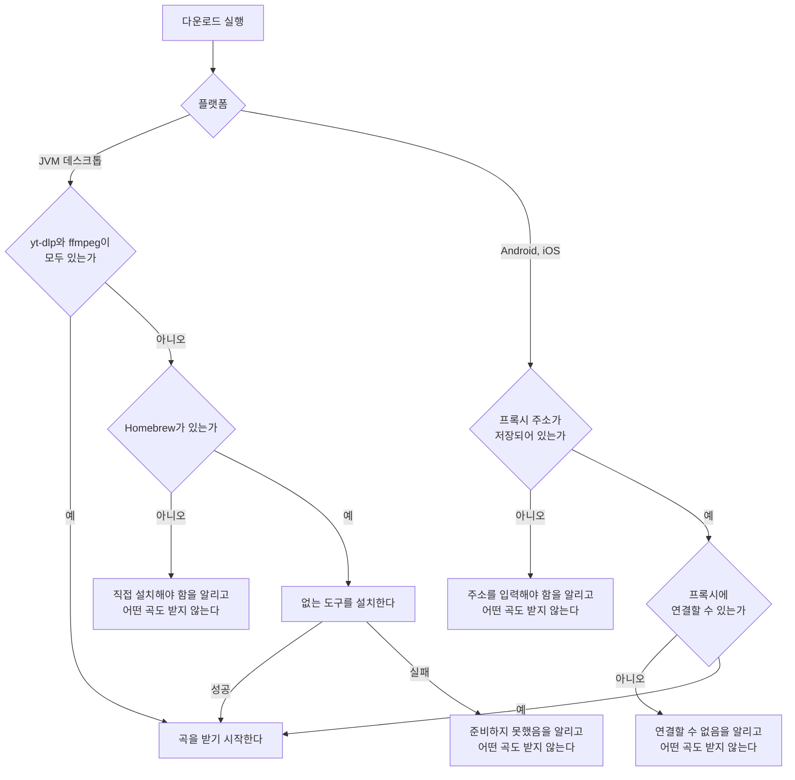
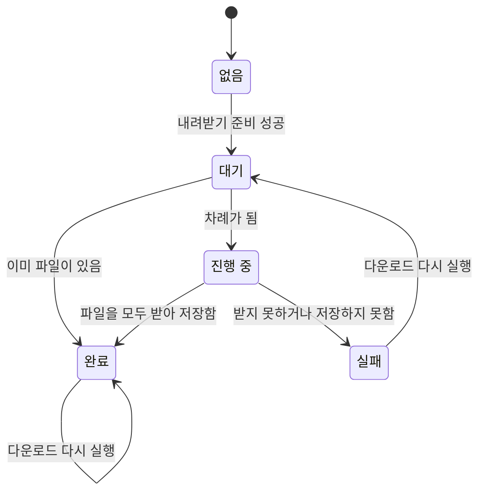

# 곡 다운로드 스펙

이 문서는 사용자가 저장해 둔 곡을 기기에 파일로 내려받아 두는 규칙을 다룬다. 다운로드를 실행하는 자리와 진행을 보여 주는 자리는 [PlaylistHome 화면 스펙](./playlist-home.md)에서, 곡이 갖는 링크와 그 링크에서 영상을 얻는 판정은 [MusicAdd 화면 스펙](./music-add.md)에서, 목록에 노출하는 곡의 기준은 [PlaylistHome 화면 스펙](./playlist-home.md)의 `목록에 노출하는 곡`에서, Android와 iOS를 대신해 영상을 받아 전달하는 프록시의 규칙은 [곡 다운로드 프록시 스펙](./music-download-proxy.md)에서, 프록시 주소를 확인하고 입력하는 화면은 [SettingDownload 화면 스펙](./setting-download.md)에서, 실패를 로그로 남기는 정책은 [UseCase 실패 로깅 스펙](./usecase-failure-logging.md)에서 다룬다.

이번 범위는 사용자가 다운로드를 실행해 목록의 곡을 영상과 소리가 함께 들어 있는 파일로 기기에 내려받고, 곡마다 진행 상태를 확인하고, 실패한 곡을 다시 시도하는 것까지다. 내려받은 파일을 앱 안에서 재생하는 것, 곡별로 따로 내려받는 것, 내려받은 파일을 앱 안에서 지우는 것은 이번 범위에서 다루지 않는다.

다운로드를 제공하는 플랫폼은 JVM 데스크톱과 Android와 iOS다. JVM 데스크톱은 기기에 설치된 도구로 직접 받고, Android와 iOS는 같은 네트워크의 JVM 데스크톱이 제공하는 프록시를 통해 받는다. 웹에서 다운로드를 실행하면 아무 일도 일어나지 않으며, 그 기준은 `feature`의 `다운로드를 제공하지 않는 환경`을 따른다.

## feature

### 다운로드 실행

사용자는 PlaylistHome에서 다운로드를 실행해 목록의 곡을 한 번에 내려받는다. 어떤 곡을 내려받는지는 `domain`의 `다운로드 대상 곡`을 따른다.

다운로드를 실행하면 먼저 `내려받기 준비`가 일어나고, 준비가 끝난 뒤에 대상 곡이 모두 대기 상태가 되어 `domain`의 `진행 순서`에 따라 한 곡씩 차례로 진행한다.

다운로드가 진행되는 동안에도 사용자는 목록을 스크롤하고, 정렬을 바꾸고, 당겨 새로고침하고, 곡 추가와 곡 상세로 이동하는 조작을 그대로 할 수 있다.

### 내려받기 준비

다운로드를 실행하면 곡을 받기 전에 내려받을 수단이 갖춰져 있는지 먼저 확인한다. 무엇을 확인하는지는 플랫폼에 따라 다르다.

| 플랫폼 | 확인하는 것 |
| --- | --- |
| JVM 데스크톱 | 기기에 `yt-dlp`와 `ffmpeg`이 있는지 |
| Android, iOS | 프록시 주소가 저장되어 있고 그 프록시에 연결할 수 있는지 |

준비에 성공하면 곧바로 곡을 받기 시작하고, 사용자에게 아무것도 알리지 않는다. 준비에 실패하면 무엇이 문제인지 알리고 어떤 곡도 받지 않는다. 이때 어떤 곡에도 상태가 생기지 않는다.

#### JVM 데스크톱의 도구 준비

이 앱은 영상을 내려받고 합치는 일을 기기에 설치된 `yt-dlp`와 `ffmpeg`에 맡긴다. 두 도구는 사용자의 기기에 있어야 하며, 어떤 도구가 왜 필요한지는 `domain`의 `내려받기 도구`를 따른다.

없는 도구가 있으면 앱이 Homebrew로 그 도구를 설치한다. 설치하는 동안에는 진행 중임을 알리고, 설치가 끝나면 이어서 곡을 받는다. 설치는 사용자가 다운로드를 실행했을 때만 일어나며, 앱을 켜거나 화면에 들어오는 것만으로는 일어나지 않는다.

Homebrew가 없으면 앱은 Homebrew를 설치하지 않는다. 대신 무엇을 직접 설치해야 하는지 사용자에게 알리고 어떤 곡도 받지 않는다. Homebrew를 설치하는 것은 사용자의 기기 전체에 영향을 주는 일이므로 사용자가 직접 정한다.

도구를 설치하지 못하면 그 이유를 나누지 않고 준비하지 못했음을 알리고, 어떤 곡도 받지 않는다. 사용자는 도구를 직접 설치한 뒤 다운로드를 다시 실행할 수 있다.

#### Android와 iOS의 프록시 준비

Android와 iOS는 [SettingDownload 화면](./setting-download.md)에 저장해 둔 프록시 주소로 영상을 받는다.

프록시 주소가 저장되어 있지 않으면 설정에서 프록시 주소를 입력해야 함을 알리고 어떤 곡도 받지 않는다. 저장된 주소의 프록시에 연결할 수 없으면 프록시에 연결할 수 없음을 알리고 어떤 곡도 받지 않는다. 사용자는 주소를 고치거나 JVM 데스크톱 앱을 실행한 뒤 다운로드를 다시 실행할 수 있다.

### 진행 확인

사용자는 곡마다 그 곡이 지금 어떤 상태인지 확인한다. 상태는 대기, 진행 중, 완료, 실패 네 가지다.

진행 중인 곡은 전체 중 얼마나 받았는지 백분율로 함께 확인한다. 단, Android와 iOS에서는 프록시가 영상을 받아 파일로 합치는 동안 백분율이 없고, 프록시가 완성된 파일을 이 기기에 전달하기 시작한 뒤부터 백분율을 확인한다. 그 전까지는 진행 중이라는 것만 확인한다. 어느 시점부터 백분율을 알 수 있는지는 `domain`의 `곡의 다운로드 상태`를 따른다.

상태를 목록의 어느 자리에 어떤 모양으로 표시하는지는 [PlaylistHome 화면 디자인](../design/playlist-home.md)이 정한다.

다운로드 대상이 아닌 곡에는 어떤 상태도 표시하지 않는다. 다운로드를 한 번도 실행하지 않은 동안에도 어떤 곡에도 상태를 표시하지 않는다.

### 실패와 다시 시도

한 곡을 내려받지 못해도 다운로드는 멈추지 않고 남은 곡을 계속 진행한다. 실패한 곡은 실패 상태로 남고, 이미 완료한 곡의 파일은 그대로 남는다.

사용자는 다운로드를 다시 실행해 실패한 곡을 다시 시도할 수 있다.

실패 원인은 나누어 알리지 않는다. 없거나 삭제된 영상, 비공개 영상, 네트워크를 사용할 수 없는 상태, 프록시가 받지 못한 상태, 전달받는 도중 끊긴 상태, 저장에 실패한 상태를 모두 같은 실패로 다룬다. 어느 경우에도 사용자가 할 수 있는 일이 다시 실행하는 것으로 같기 때문이다.

### 다시 실행

진행 중인 다운로드가 남아 있는 동안 다운로드를 다시 실행하면 아무 일도 일어나지 않는다. 진행 중이던 곡의 상태도 바뀌지 않는다. 내려받기를 준비하는 동안에도 같다.

모든 곡이 완료나 실패로 끝난 뒤 다시 실행하면 대상 곡을 다시 판정한다. 이미 내려받아 둔 곡은 다시 받지 않고 곧바로 완료가 되며, 파일이 없는 곡만 실제로 받는다. 이전에 실패한 곡과 다운로드를 실행한 뒤에 추가된 곡이 여기에 해당한다.

### 다운로드를 제공하지 않는 환경

웹에서는 다운로드를 실행해도 아무 일도 일어나지 않는다. 어떤 곡의 상태도 바뀌지 않고, 내려받기를 준비하지 않으며, 파일도 남지 않는다. 브라우저에는 받은 파일을 둘 앱 전용 저장소가 없기 때문이다.

이는 오류가 아니므로 실패로 알리지 않는다. 이 환경에서 다운로드를 실행하는 수단을 노출할지는 [PlaylistHome 화면 디자인](../design/playlist-home.md)이 정한다.

## domain

### 내려받기 도구

내려받기는 다음 두 도구가 함께 있어야 성립한다.

| 도구 | 하는 일 |
| --- | --- |
| `yt-dlp` | 링크가 가리키는 영상의 영상 스트림과 소리 스트림을 내려받는다 |
| `ffmpeg` | 따로 받은 영상과 소리를 하나의 파일로 합친다 |

`yt-dlp`는 YouTube가 재생 방식을 바꿀 때마다 스스로 갱신되므로, 이 앱은 재생 방식을 직접 해석하지 않고 이 도구에 맡긴다.

`ffmpeg`이 필요한 것은 가장 좋은 화질의 영상과 소리가 서로 다른 스트림으로 제공되기 때문이다. 합치지 않으면 화질이 크게 떨어지는 스트림만 받을 수 있다.

두 도구 중 하나라도 없으면 내려받기를 시작하지 않는다. 두 도구를 실행하는 곳은 JVM 데스크톱이며, Android와 iOS는 프록시가 실행하는 도구에 맡긴다.

### 내려받기 준비의 판정

준비가 되었는지는 다운로드를 실행할 때마다 확인한다. 앞선 실행에서 준비에 성공했더라도 그 결과를 기억해 두지 않는다. 사용자가 도구를 지웠거나 JVM 데스크톱 앱을 끝냈을 수 있기 때문이다.

준비에 실패하면 대상 곡을 판정하지 않는다. 받을 수 없는 것이 확정된 상태에서 곡마다 실패 상태를 남기면, 사용자가 곡의 문제로 오해한다.

### 다운로드 대상 곡

다운로드 대상은 [PlaylistHome 화면 스펙](./playlist-home.md)의 `목록에 노출하는 곡` 기준을 만족하고, 그 곡의 링크에서 [MusicAdd 화면 스펙](./music-add.md)의 `썸네일의 판정`에 따라 영상 ID를 얻을 수 있는 곡이다.

링크가 없는 곡과 링크에서 영상 ID를 얻을 수 없는 곡은 내려받을 영상이 없으므로 대상이 아니다. 대상이 아닌 곡은 어떤 상태도 갖지 않으며, 실패로도 다루지 않는다.

대상 판정은 내려받기 준비가 끝난 시점의 목록을 기준으로 한다. 실행한 뒤에 추가되거나 수정된 곡은 진행 중인 다운로드에 끼어들지 않고, 다음에 다시 실행할 때 대상이 된다.

아직 준비되지 않은 자리는 가리키는 곡이 없으므로 대상이 아니다. 자리 표시의 처리는 [페이지 조회 목록의 자리 표시 스펙](./paged-list-placeholder.md)을 따른다.

### 진행 순서

대상 곡은 한 번에 한 곡씩, 대상을 판정한 시점의 목록 순서대로 진행한다. 한 곡이 완료나 실패로 끝난 뒤에 다음 곡이 시작한다.

여러 곡을 동시에 받지 않는 것은 한 곡의 진행률이 다른 곡의 속도에 따라 들쭉날쭉해지지 않게 하기 위한 것이다.

목록 순서는 사용자가 고른 정렬을 따르므로([목록 정렬 스펙](./list-sort.md)), 사용자가 위에서부터 보고 있는 곡이 먼저 완료된다. 진행이 시작된 뒤에 사용자가 정렬을 바꿔도 진행 순서는 바뀌지 않는다.

### 곡의 다운로드 상태

곡 하나는 다음 상태를 갖는다.

| 상태 | 의미 |
| --- | --- |
| 없음 | 이 곡에 대해 다운로드를 실행한 적이 없다 |
| 대기 | 다운로드 대상이지만 아직 차례가 오지 않았다 |
| 진행 중 | 지금 받고 있다. 얼마나 받았는지 백분율을 가질 수 있다 |
| 완료 | 이 곡의 파일이 기기에 남아 있다 |
| 실패 | 받지 못했고 파일도 남지 않았다 |

완료에서 다른 상태로 돌아가지 않는다. 이미 파일이 있는 곡은 다시 받지 않으므로 다시 실행해도 완료로 남는다.

진행 중인 곡의 백분율은 다음 시점부터 있다.

| 플랫폼 | 백분율이 있는 구간 |
| --- | --- |
| JVM 데스크톱 | 진행 중이 된 때부터 끝까지 |
| Android, iOS | 프록시가 완성된 파일을 이 기기에 전달하기 시작한 때부터 끝까지 |

Android와 iOS에서 프록시가 영상을 받아 합치는 동안은 백분율이 없는 진행 중이다. 프록시가 그 동안의 진행을 알려 주지 않기 때문이며, 영상과 소리를 합치기 전까지는 파일의 크기도 정해지지 않는다. 백분율이 생긴 뒤에는 그 곡이 끝날 때까지 백분율이 없는 상태로 돌아가지 않는다.

진행 중인 곡의 백분율은 줄어들지 않고 늘어나기만 한다.

### 상태의 유지 범위

다운로드 상태는 앱이 실행되어 있는 동안에만 유지한다. 화면을 떠났다 돌아오거나 목록을 새로고침해도 상태는 그대로 유지된다.

앱을 다시 실행하면 대기, 진행 중, 실패는 남지 않는다. 파일이 남아 있는 곡만 완료로 확인할 수 있다. 완료의 근거는 그 곡의 파일이 기기에 있다는 사실이며, 별도로 기록해 둔 상태가 아니다.

### 진행 유지 범위

| 플랫폼 | PlaylistHome을 떠남 | 앱이 화면 뒤로 감 | 앱 종료 |
| --- | --- | --- | --- |
| JVM 데스크톱 | 계속 진행 | 계속 진행 | 중단 |
| Android, iOS | 계속 진행 | 진행을 보장하지 않음 | 중단 |
| 웹 | 해당 없음 | 해당 없음 | 해당 없음 |

PlaylistHome을 떠나는 것만으로는 다운로드가 멈추지 않는다. 사용자가 곡 상세나 다른 화면으로 이동했다가 돌아오면 그동안 진행된 상태를 그대로 본다.

JVM 데스크톱은 앱이 창 뒤에 있거나 최소화되어 있어도 진행이 이어진다. 앱이 살아 있는 동안 진행하고, 앱이 사라지면 함께 멈춘다.

Android와 iOS는 앱이 화면 앞에 있는 동안만 진행을 보장한다. 앱이 화면 뒤로 가면 플랫폼이 앱의 동작을 멈추거나 연결을 끊을 수 있고, 그렇게 끊긴 곡은 실패로 끝난다. 사용자는 앱을 다시 앞으로 가져와 다운로드를 다시 실행한다. 이때 프록시가 그 영상을 끝까지 받아 두었으면 곧바로 전달받으므로 처음부터 기다리지 않는다.

앱이 종료되면 진행 중이던 곡과 대기 중이던 곡이 모두 중단된다. 중단된 곡은 파일이 남지 않으므로 다음에 다운로드를 실행할 때 다시 대상이 된다.

### 다시 실행 성립 조건

내려받기를 준비하는 중이거나 대기나 진행 중인 곡이 하나라도 있으면 새 실행 요청을 처리하지 않는다. 같은 곡을 두 번 받거나 진행률이 섞이지 않게 하기 위한 것이다.

모든 곡이 완료나 실패로 끝났거나, 대상 곡이 하나도 없거나, 내려받기 준비에 실패해 끝났으면 다시 실행할 수 있다.

계정이 게스트여서 목록에 노출할 곡이 없으면 대상 곡도 없다. 이때 다운로드를 실행하면 어떤 곡도 받지 않고 곧바로 끝나며, 이는 실패가 아니다.

## data

### 영상 내려받기

내려받기는 사용자가 다운로드를 실행해 그 곡의 차례가 되었을 때만 일어나며, 목록을 표시하는 것만으로는 일어나지 않는다.

JVM 데스크톱은 곡의 링크에서 얻은 영상 ID의 영상을 `yt-dlp`에 맡긴다. `yt-dlp`는 그 링크의 가장 좋은 화질의 영상과 소리를 받아 `ffmpeg`으로 합쳐 하나의 mp4 파일로 만든다. 받는 동안 `yt-dlp`가 알리는 진행률을 그대로 곡의 진행 중 상태에 반영한다.

Android와 iOS는 곡의 링크에서 얻은 영상 ID로 프록시에 영상을 요청하고, 프록시가 전달하는 파일을 그대로 기기에 저장한다. 요청과 응답의 계약은 [곡 다운로드 프록시 스펙](./music-download-proxy.md)의 `요청과 응답`을 따른다. 프록시가 응답을 시작하면 응답에 담긴 파일 크기에 대해 받은 만큼을 진행 중 상태의 백분율에 반영한다.

`yt-dlp`나 프록시가 그 영상을 받지 못하면 그 곡은 실패로 끝난다. 없거나 삭제된 영상, 비공개 영상, 지역 제한, 네트워크를 사용할 수 없는 상태, 프록시가 실패로 응답한 상태, 전달받는 도중 끊긴 상태를 모두 같은 실패로 다룬다.

화질은 `yt-dlp`가 그 영상에 대해 고르는 가장 좋은 조합으로 정해지며, 제품이 화질을 고르거나 사용자에게 고르게 하지 않는다.

### 파일 저장

받은 파일은 앱 전용 저장소에 둔다. 사용자가 저장 위치를 고르지 않고, 앱을 지우면 받아 둔 파일도 함께 사라진다. 저장에 사용자 권한이 필요하지 않다.

파일은 영상 ID로 구분하며, 영상 하나에 파일 하나를 둔다. 같은 영상을 가리키는 곡이 여럿이면 그 곡들은 파일 하나를 함께 쓰고 모두 완료가 된다. 제목이나 가수가 같아도 영상이 다르면 파일도 다르므로 서로 덮어쓰지 않는다.

파일을 영상 ID로 구분하는 것은 JVM 데스크톱이 자기 곡으로 받은 파일을 다른 기기의 프록시 요청에 그대로 전달하고, 다른 기기를 대신해 받은 파일을 자기 곡의 완료 근거로도 쓰기 위한 것이다.

받는 도중 중단된 파일은 남기지 않는다. 앱 전용 저장소에는 끝까지 받아 합친 파일만 남으므로, 파일이 있다는 것은 그 영상을 내려받아 두었다는 뜻이다.

곡을 삭제하거나 곡의 링크를 바꾸어도 이미 받아 둔 파일은 지우지 않는다. 받아 둔 파일을 정리하는 수단은 이번 범위에서 다루지 않는다.

### 완료 판정

곡을 완료로 보는 근거는 그 곡의 영상 ID로 구분되는 파일이 앱 전용 저장소에 있다는 사실 하나다. 다운로드를 실행할 때마다 대상 곡의 파일이 있는지 확인하고, 있으면 받지 않고 완료로 다룬다.

### 저장하지 않는 것

다운로드 상태와 진행률은 기기 저장소에 기록하지 않고 서버에도 반영하지 않는다. 받아 둔 파일이 있는지도 서버에 알리지 않으므로, 한 기기에서 받아 둔 곡이 다른 기기에서 완료로 보이지 않는다.
