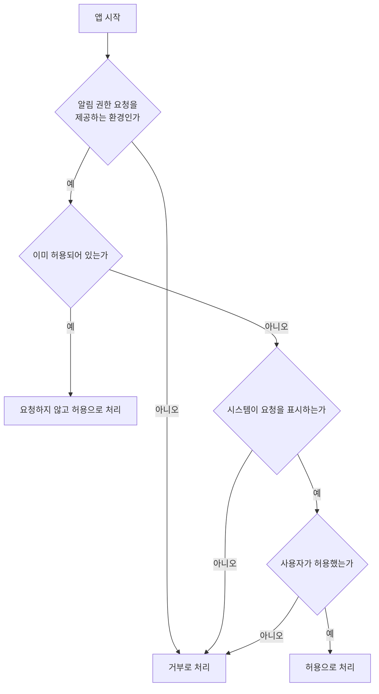

# 알림 권한 요청 스펙

이 문서는 앱을 시작할 때 사용자에게 시스템 알림 권한을 요청하는 공통 규칙을 다룬다. 앱이 어떤 알림을 언제 보내는지는 이 문서의 범위가 아니며 각 알림 기능의 스펙이 소유한다. 현재 이 권한을 사용하는 알림은 [일일 메모 알림 스펙](./daily-memo-notification.md)이 소유한다.

이번 범위는 권한을 요청하고 그 결과를 확인하는 것까지다. 요청 결과를 저장하거나 화면에 반영하는 것은 이번 범위에 포함하지 않는다.

권한 요청은 시스템이 표시하므로 앱이 제공하는 화면이나 조작 수단이 없다. 사용자에게 보이는 결과는 `feature`에, 요청 여부를 가르는 기준은 `domain`에 둔다. 저장하거나 동기화하는 데이터가 없으므로 `data` 영역은 생략한다.

## feature

### 앱 시작 시 알림 권한 요청

사용자가 앱을 시작하면 알림 권한이 아직 결정되어 있지 않은 경우 시스템 알림 권한 요청이 표시된다.

사용자는 표시된 요청을 허용하거나 거부할 수 있고, 어느 쪽을 선택해도 앱 화면은 그대로 유지되며 앱이 별도의 안내를 표시하지 않는다. 요청에 응답하지 않고 앱을 계속 사용할 수도 있다.

요청을 허용하면 앱이 보내는 알림이 사용자에게 보이고, 거부하면 보이지 않는다. 어느 쪽이든 요청에 응답한 직후 앱 화면에서 확인할 수 있는 변화는 없고, 거부해도 사용자가 앱에서 할 수 있는 행동은 줄어들지 않는다.

## domain

### 요청 시점

알림 권한 요청 조건은 앱 화면이 시작될 때 한 번만 확인한다.

사용자가 화면을 이동하거나 앱이 백그라운드에 갔다가 돌아와도 다시 확인하지 않는다. 앱을 다시 실행하거나 시스템이 앱 화면을 재생성해 앱 화면이 처음부터 다시 시작되면 그 시점에 조건을 다시 확인한다.

### 요청 기준

알림 권한이 이미 허용되어 있으면 요청하지 않는다.

사용자가 이전에 요청을 거부해 시스템이 더 이상 요청을 표시하지 않으면 거부와 같이 처리한다. 시스템 요청 표시 여부는 각 플랫폼의 권한 정책을 따르며, 앱이 별도의 안내 화면으로 요청을 대신하지 않는다.

알림 권한 요청을 제공하지 않는 환경에서는 요청하지 않고 거부와 같이 처리한다. 이 판정은 앱 시작을 막지 않으며, 사용자는 요청 결과와 무관하게 앱을 그대로 사용한다.

### 요청 제공 범위

알림 권한 요청은 Android, iOS와 웹에서 제공한다. JVM 데스크톱은 알림 권한 개념을 제공하지 않으므로 요청하지 않는다.

웹에서 브라우저가 알림 기능을 제공하지 않으면 요청하지 않는다. 브라우저가 사용자 조작 없이 시작된 요청을 표시하지 않는 경우도 시스템이 요청을 표시하지 않은 것으로 다룬다.

### 요청 범위

앱은 알림을 화면에 표시하는 권한만 요청한다. 소리, 배지처럼 플랫폼이 따로 나누어 두는 알림 방식은 요청하지 않으며, 그 방식이 필요해지면 필요한 기능의 스펙에서 정한다.

Android와 웹은 알림 권한을 방식별로 나누지 않으므로 하나의 알림 권한을 요청한다.

### 요청 결과의 사용

요청 결과는 앱의 화면 표시나 사용자 행동을 바꾸지 않는다. 결과를 사용자 설정으로 저장하지 않으며, 앱 안에서 권한 상태를 다시 보여 주지 않는다.

알림이 사용자에게 보이는지는 요청 결과가 아니라 시스템이 가진 권한 상태가 정하고, 그 판정은 각 알림 기능의 스펙이 소유한다.

## 참고

- [Android 알림 런타임 권한](https://developer.android.com/develop/ui/views/notifications/notification-permission)
- [Apple Asking permission to use notifications](https://developer.apple.com/documentation/usernotifications/asking-permission-to-use-notifications)
- [MDN Notification.requestPermission()](https://developer.mozilla.org/en-US/docs/Web/API/Notification/requestPermission_static)
