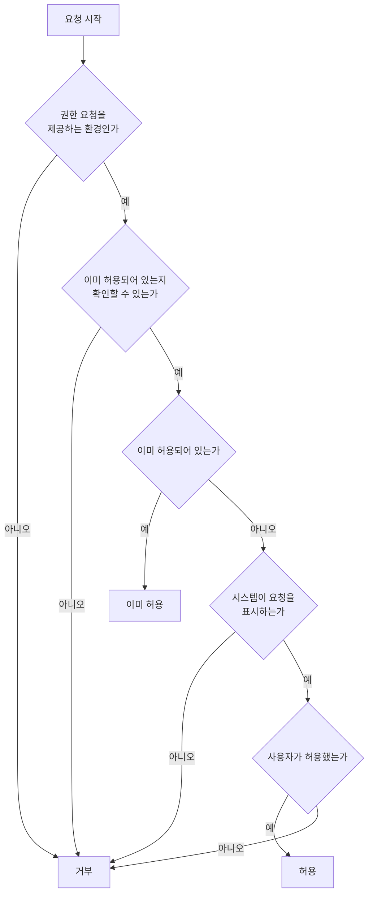

# 권한 요청 공통 스펙

이 문서는 앱이 시스템 권한을 사용자에게 요청하고, 요청을 표시하지 않고 허용 여부만 확인하는 공통 규칙을 다룬다. 권한마다 어디에서 요청을 시작하는지와 무엇을 요청하는지는 각 권한 스펙이 소유한다.

이 문서를 따르는 권한은 [알림 권한 요청](./notification-permission.md)과 [위치 권한 요청](./location-permission.md)이다.

권한 요청은 시스템이 표시하므로 앱이 제공하는 화면이나 조작 수단이 없고, 저장하거나 동기화하는 데이터도 없다. 따라서 `data` 영역은 생략한다.

## feature

### 권한 요청 응답

사용자는 앱이 시작한 시스템 권한 요청을 허용하거나 거부할 수 있고, 응답하지 않고 앱을 계속 사용할 수도 있다. 응답하지 않은 요청 때문에 앱이 멈추거나 사용자가 할 수 있는 행동이 줄어들지 않는다.

어느 쪽으로 응답해도 앱 화면은 그대로 유지되고 앱이 별도의 안내를 표시하지 않는다. 거부해도 사용자가 앱에서 할 수 있는 행동은 줄어들지 않는다.

응답에 따라 무엇이 달라지는지는 각 권한 스펙과 그 권한을 사용하는 기능의 스펙이 정한다.

## domain

### 요청 결과

권한 요청 결과는 `이미 허용`, `허용`, `거부` 중 하나다.

| 결과 | 조건 |
| --- | --- |
| `이미 허용` | 요청을 시작한 시점에 권한이 이미 허용되어 있어 시스템 요청을 표시하지 않았다 |
| `허용` | 시스템 요청을 표시했고 사용자가 허용했다 |
| `거부` | 그 밖의 모든 경우 |

`이미 허용`과 `허용`은 모두 권한이 허용된 상태를 뜻하고, 사용자가 이번 요청에서 새로 허용했는지만 다르다. 이 구분을 사용할지는 각 권한 스펙이 정한다.

### 요청 시점

요청 조건은 요청을 시작하는 지점이 시작될 때 한 번만 확인한다. 어디가 그 지점인지는 각 권한 스펙이 정한다.

사용자가 화면을 이동하거나 앱이 백그라운드에 갔다가 돌아와도 다시 확인하지 않는다. 앱을 다시 실행하거나 시스템이 그 지점을 재생성해 처음부터 다시 시작되면 그때 조건을 다시 확인한다.

### 요청 기준

권한이 이미 허용되어 있으면 요청하지 않고 `이미 허용`으로 처리한다.

사용자가 이전에 요청을 거부해 시스템이 더 이상 요청을 표시하지 않으면 `거부`로 처리한다. 시스템 요청 표시 여부는 각 플랫폼의 권한 정책을 따르며, 앱이 별도의 안내 화면으로 요청을 대신하지 않는다.

권한이 이미 허용되어 있는지 확인할 수 없는 환경에서는 요청하지 않고 `거부`로 처리한다.

### 요청 제공 범위

권한 요청은 Android, iOS와 웹에서 제공한다. JVM 데스크톱은 시스템 권한 요청을 제공하지 않으므로 요청하지 않는다.

웹에서 브라우저가 그 권한에 해당하는 기능을 제공하지 않으면 요청하지 않는다. 브라우저가 사용자 조작 없이 시작된 요청을 표시하지 않는 경우도 시스템이 요청을 표시하지 않은 것으로 다룬다.

각 권한 스펙은 이 범위를 더 좁힐 수 있고 넓히지 않는다.

### 허용 여부 조회

앱은 요청을 표시하지 않고 권한이 현재 허용되어 있는지만 확인할 수 있다. 확인 결과는 `허용`과 `허용되지 않음` 둘 중 하나다.

권한이 허용되어 있는지 확인할 수 없는 환경에서는 `허용되지 않음`으로 본다.

확인 자체는 시스템 요청을 표시하지 않으므로, 조회만으로 사용자에게 권한 요청이 보이지 않는다. 허용 여부를 언제 확인하고 결과가 바뀌었을 때 무엇에 반영할지는 그 권한을 사용하는 기능의 스펙이 정한다.

### 권한 개념이 없는 환경

시스템 권한 개념이 없는 환경에서는 요청 결과가 `거부`이고 허용 여부 조회 결과가 `허용되지 않음`이다.

이 결과가 그 권한을 사용하는 기능을 제공하지 않는다는 뜻은 아니다. 권한 개념이 없는 환경에서 기능을 어떻게 제공할지는 그 기능의 스펙이 정한다.

## 참고

- [Android 런타임 권한 요청](https://developer.android.com/training/permissions/requesting)
- [MDN Permissions API](https://developer.mozilla.org/en-US/docs/Web/API/Permissions_API)
