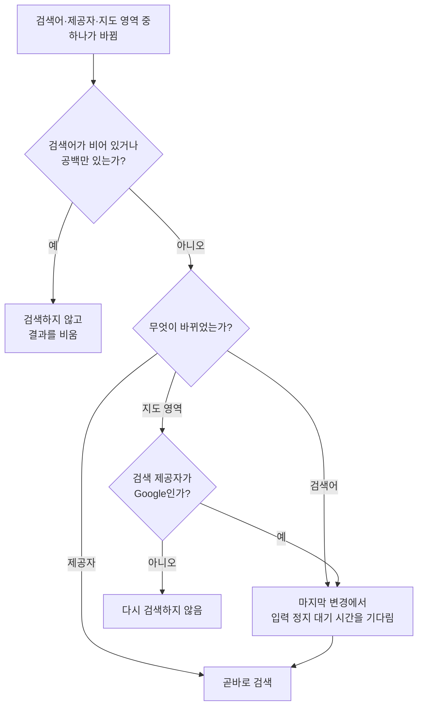
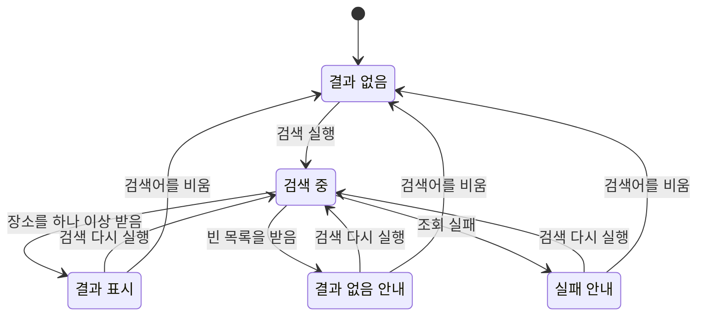

# 장소 검색 다이얼로그 컴포넌트 스펙

이 문서는 사용자가 검색어로 장소를 찾아 그 장소의 이름과 좌표를 입력 중인 화면으로 가져오는 공용 컴포넌트 장소 검색 다이얼로그의 동작과 정책을 다룬다. 이 컴포넌트는 [PlaceAdd 화면](./place-add.md)과 [PlaceDetail 화면](./place-detail.md)이 배치하며, 두 화면에서의 동작은 같다.

검색으로 장소를 찾아오는 원격 조회 규칙은 [네이버 장소 검색 스펙](./naver-place-search.md)과 [Google 장소 검색 스펙](./google-place-search.md)이, 지도의 표시·조작·제공자 전환·지점 표시·핀 표시 자체의 동작은 [DiaryMap 컴포넌트 스펙](./diary-map.md)이 다룬다.

이번 범위는 검색어로 장소를 찾아 목록과 지도에서 확인하고, 그중 하나를 골라 배치한 화면의 제목과 좌표에 반영하는 것까지다. 찾은 장소를 저장하는 것은 배치한 화면이 정하며 이 문서에서는 다루지 않는다. 컴포넌트는 사용자 데이터를 만들거나 저장하지 않고 원격 조회 계약은 위 두 검색 스펙이 소유하므로 `data` 영역은 생략한다.

디자인: [장소 검색 다이얼로그 디자인](../design/place-search-dialog.md)

## feature

### 진입

사용자는 배치한 화면에서 장소 검색을 선택해 다이얼로그를 연다.

배치한 화면에 지도가 표시되지 않는 동안에는 장소 검색을 제공하지 않는다.

다이얼로그를 열면 검색어는 비어 있고 결과도 없는 상태로 시작한다. 사용자가 곧바로 검색어를 입력할 수 있도록 입력 초점을 검색어 입력에 한 번 둔다.

### 검색어 입력

사용자는 다이얼로그에서 찾을 장소의 검색어를 한 줄로 입력할 수 있다.

입력한 검색어는 한 번에 지울 수 있다. 지우면 결과도 함께 비워지고 지도의 결과 표시도 사라진다.

입력한 검색어를 검색에 반영하는 시점은 [검색어 일치 판정 스펙](./search-match.md)의 `검색어 반영 시점`을 따른다. 사용자는 검색어를 끝까지 입력한 뒤 결과를 받는다.

### 검색 결과 확인

사용자는 찾은 장소들을 목록에서 확인한다. 각 장소는 이름과 어디인지 알 수 있는 주소를 함께 보여 준다.

찾은 장소들은 다이얼로그의 지도 위에도 함께 표시되므로, 사용자는 결과가 어느 곳에 모여 있는지 지도에서 확인할 수 있다.

검색하는 동안에는 직전에 받은 결과를 그대로 두어 목록이 비었다가 다시 차지 않으며, 검색이 진행 중임을 따로 알리지 않는다.

검색어와 일치하는 장소가 없으면 결과가 없다는 안내를 제공한다. 검색에 실패하면 실패했다는 안내를 제공하며, 사용자는 검색어를 고치거나 지도를 옮겨 다시 시도할 수 있다.

### 장소 선택

사용자는 목록의 장소를 눌러 그 장소를 고를 수 있다. 지도에 표시된 결과를 눌러서도 같은 장소를 고른다.

장소를 고르면 다이얼로그가 닫히고, 고른 장소의 좌표가 배치한 화면의 위도와 경도에 채워진다. 배치한 화면의 제목이 비어 있으면 고른 장소의 이름도 함께 채운다.

반영된 좌표는 사용자가 직접 입력한 좌표와 같게 다루므로, 사용자는 이어서 값을 고치거나 지도에서 다른 곳을 다시 고를 수 있다.

### 지도로 검색 범위 좁히기

사용자는 다이얼로그의 지도를 옮기거나 확대·축소해 찾고 싶은 지역을 보이게 할 수 있다. Google 지도로 검색하는 동안에는 지도를 옮긴 뒤 잠시 기다리면 보고 있는 지역을 기준으로 다시 검색된다.

네이버 지도로 검색하는 동안에는 지도를 옮겨도 결과가 바뀌지 않는다. 네이버 검색은 지역을 기준으로 삼지 않으므로 사용자는 검색어에 지역을 함께 적어 결과를 좁힌다.

### 검색 제공자 전환

사용자는 다이얼로그의 지도에서 제공자를 바꿀 수 있고, 바꾸면 그 제공자로 다시 검색된다. 제공자에 따라 찾아지는 장소와 결과 개수는 다를 수 있다.

다이얼로그에서 바꾼 제공자와 옮긴 지도 위치는 다이얼로그 안에서만 쓰이며, 배치한 화면의 지도는 바뀌지 않는다.

### 닫기

사용자는 장소를 고르지 않고 다이얼로그를 닫을 수 있다. 이때 배치한 화면의 제목, 설명, 컬러와 좌표는 무엇도 바뀌지 않는다.

닫은 뒤 다시 열면 검색어와 결과가 없는 상태로 다시 시작한다.

### 진행 상태 유지

다이얼로그가 열려 있는 동안 화면이 회전하거나 시스템에 의해 재생성되어도 다이얼로그는 열린 상태를 유지하고, 입력 중이던 검색어와 사용자가 보고 있던 지도 위치·확대 수준·제공자도 유지한다. 결과 목록은 유지한 검색어로 다시 검색해 채운다.

사용자가 배치한 화면을 떠난 뒤 다시 들어오거나 앱을 종료한 뒤 새로 시작하면 다이얼로그는 닫힌 상태로 시작한다.

## domain

### 검색 제공자

검색 제공자는 네이버와 Google 두 가지이며, 같은 시점에 검색에 쓰는 제공자는 하나다.

검색 제공자는 다이얼로그의 지도에 선택된 지도 제공자와 항상 같다. 사용자가 검색 제공자를 지도와 따로 고르지 않는다.

각 제공자가 한 번에 돌려주는 장소의 개수와 정렬은 [네이버 장소 검색 스펙](./naver-place-search.md)과 [장소 검색 공통 스펙](./place-search.md)의 `검색어`을 따른다.

### 다이얼로그의 지도

다이얼로그는 [DiaryMap 컴포넌트](./diary-map.md)를 핀 표시와 핀 선택을 사용하는 상태로 배치하고, 지점 선택은 사용하지 않는다.

다이얼로그의 지도는 배치한 화면의 지도와 별개로 다룬다. 초기 제공자와 초기 위치는 다이얼로그를 열 때 배치한 화면의 지도가 보고 있던 제공자와 위치를 이어받고, 이후 다이얼로그에서의 전환과 이동은 배치한 화면의 지도에 반영하지 않는다.

배치한 화면이 지도를 표시하지 않는 조건에서는 이어받을 제공자와 위치가 없으므로 검색 자체를 제공하지 않는다. 그 조건은 [PlaceAdd 화면 스펙](./place-add.md)의 `PlaceAdd의 지도`와 [PlaceDetail 화면 스펙](./place-detail.md)의 `초기 지도 위치`를 따른다.

### 검색 기준 영역

Google로 검색할 때는 사용자가 보고 있는 지도 영역을 검색의 기준 위치로 함께 넘긴다. 기준 위치는 그 영역 안에 들어가는 가장 큰 원이며, 원의 가운데는 영역의 가운데다.

기준 위치는 결과의 우선순위를 정할 뿐 결과를 그 안으로 제한하지 않는다. 이 성질은 [Google 장소 검색 스펙](./google-place-search.md)의 `검색 위치 기준`을 따른다.

사용자가 아주 넓은 지역을 보고 있어도 지도의 가운데 주변이 우선하도록 기준 위치를 넘긴다. 이때 Google이 받을 수 있는 반경을 넘는 부분의 처리는 [Google 장소 검색 스펙](./google-place-search.md)의 `원격 조회`를 따른다.

지도가 준비되지 않아 보이는 영역을 확인할 수 없으면 기준 위치를 넘기지 않고 검색한다.

네이버로 검색할 때는 기준 위치를 쓰지 않는다.

### 검색을 다시 실행하는 기준

검색어와 지도 영역은 마지막으로 바뀐 뒤 입력이 멈춘 것으로 볼 때 한 번 검색한다. 그 사이에 다시 바뀌면 기다리는 시간을 처음부터 다시 센다. 값을 완성하는 도중의 중간 값과 지도를 옮기는 도중의 위치로 검색하지 않기 위한 기다림이다. 기다리는 시간은 [입력 정지 대기 시간 스펙](./input-idle-delay.md)을 따른다.

제공자 전환은 사용자가 한 번에 끝내는 선택이므로 기다리지 않고 곧바로 검색한다.

검색어가 비어 있거나 공백만 있으면 검색하지 않고 결과를 비운다. 이때 제공자를 바꾸거나 지도를 옮겨도 검색하지 않는다.

같은 시점에 유효한 검색은 가장 마지막에 실행한 것 하나다. 앞선 검색의 결과가 늦게 도착하면 그 결과는 쓰지 않는다.

### 검색 상태

검색 중에는 직전에 받은 결과를 그대로 두고, 새 결과를 받으면 그때 목록과 지도 표시를 교체한다. 검색이 진행 중인 것은 사용자에게 알리지 않으므로 검색 중 상태와 그 직전 상태는 사용자에게 같게 보인다.

빈 목록을 받은 것은 실패가 아니며, 결과가 없다는 안내로 다룬다. 조회에 실패하면 결과를 비우고 실패 안내로 다룬다. 실패를 빈 결과로 바꾸어 보여 주지 않는다.

### 결과로 보여 주는 내용

찾은 장소 하나는 이름, 주소와 좌표를 갖는다. 이름과 주소는 제공자가 돌려준 값을 그대로 쓰고, 제공자마다 다른 항목을 맞추기 위해 값을 지어내지 않는다.

네이버가 돌려주는 이름에는 검색어와 일치하는 부분을 알리는 강조 표식이 섞일 수 있다. 이 표식은 목록에 보여 줄 때와 제목에 반영할 때 모두 제거하고 순수한 이름만 쓴다.

제공자는 한 장소에 두 가지 주소를 함께 돌려주거나 한쪽만 돌려줄 수 있다. 제공자마다 다음 순서로 하나를 골라 보여 주고, 먼저 고를 주소가 없으면 다른 주소를 보여 준다. 둘 다 없으면 주소 없이 이름만 보여 준다.

| 제공자 | 먼저 보여 주는 주소 | 그 주소가 없을 때 보여 주는 주소 |
| --- | --- | --- |
| 네이버 | 도로명 주소 | 지번 주소 |
| Google | 전체 주소 | 짧은 주소 |

### 지도에 표시하는 결과

찾은 장소들은 모두 지도 위 핀으로 표시하며, 각 핀의 라벨은 그 장소의 이름이다. 결과 핀의 색은 서로 구분하지 않고 모두 같다.

핀을 누르는 것은 목록에서 같은 장소를 누르는 것과 같게 다룬다.

결과가 바뀌면 지도 위 핀도 함께 바뀌고, 결과를 비우면 핀도 모두 사라진다. 결과 핀을 표시해도 사용자가 보고 있는 지도 위치와 확대 수준은 바뀌지 않는다.

### 고른 장소를 반영하는 규칙

고른 장소의 좌표는 배치한 화면의 위도와 경도에 항상 반영한다. 이미 값이 있어도 덮어쓴다.

고른 장소의 주소도 배치한 화면의 주소에 항상 반영하며, 이미 값이 있어도 덮어쓴다. 반영하는 주소는 목록에서 그 장소에 보여 주는 주소와 같고, 고른 장소에 주소가 없으면 빈 주소로 반영한다. 주소는 좌표가 가리키는 곳의 정보이므로 좌표와 함께 항상 새 값으로 맞추기 위한 것이다.

고른 장소의 이름은 배치한 화면의 제목이 비어 있거나 공백만 있을 때만 반영한다. 제목에 사용자가 쓴 내용이 있으면 그대로 둔다. 사용자가 쓴 제목을 검색 결과가 지우지 않게 하기 위한 것이다.

설명과 컬러는 검색 결과로 바뀌지 않는다.

반영된 좌표가 어떻게 다뤄지는지는 배치한 화면이 정하며, 지점 표시와 지도 반영 시점은 [PlaceAdd 화면 스펙](./place-add.md)의 `좌표 직접 입력과 지도의 반영`을 따른다.

### 검색 인증

각 제공자의 검색은 그 제공자가 발급한 인증 정보가 있어야 수행되며, 인증이 성립하지 않으면 그 제공자의 검색은 실패로 다룬다. 인증 규칙은 [장소 검색 공통 스펙](./place-search.md)의 `인증`을 따른다.

한 제공자의 검색이 실패하는 것은 다른 제공자로 전환해 검색하는 것에 영향을 주지 않는다.

검색 인증 정보는 [DiaryMap 컴포넌트 스펙](./diary-map.md)의 `지도 인증`이 다루는 지도 인증 정보와 별개다.
