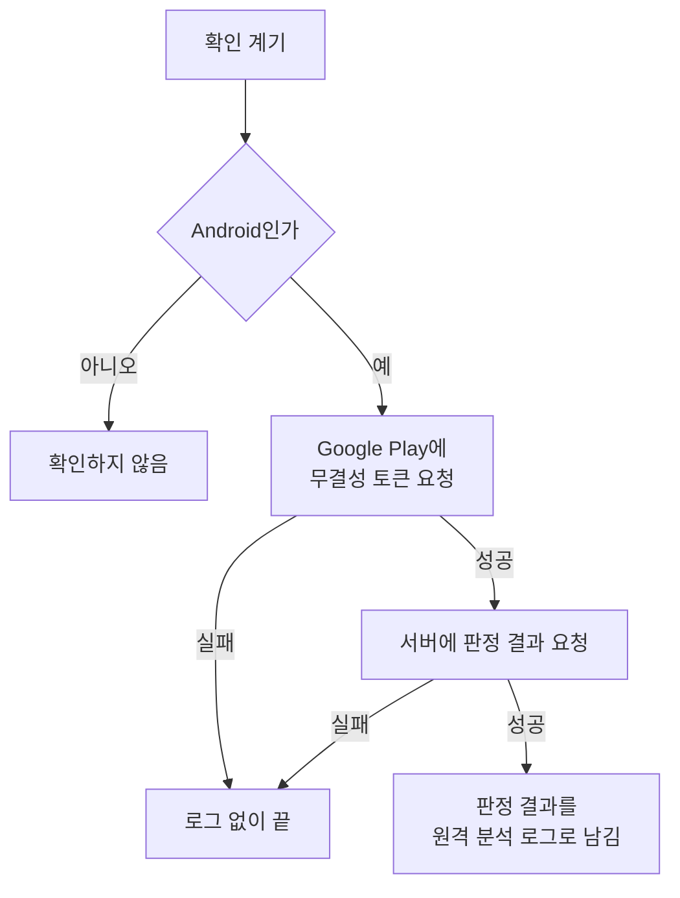

# Play Integrity 판정 로깅 스펙

이 문서는 Android 앱이 활성 상태가 될 때마다 Google Play Integrity 판정을 받아 그 결과를 원격 분석 로그로 남기는 정책을 다룬다. [앱 로깅](./app-logging.md)의 공통 창구와 기록 수단 체계 위에서 동작한다.

판정은 분석을 위해 기록만 하며, 판정 결과에 따라 사용자의 기능 사용을 막거나 안내하지 않는다. 확인은 화면 없이 앱 내부에서 진행되고 사용자가 조작하는 수단이 없으므로 `feature` 영역을 생략한다.

## domain

### 판정 확인

판정 확인은 앱이 Google Play에서 무결성 토큰을 받고, 서버가 그 토큰을 풀어 판정 결과를 돌려주는 한 번의 과정이다. 토큰은 Google의 키로 암호화되어 있어 앱이 스스로 풀 수 없으므로 반드시 서버를 거친다.

확인이 성공하면 판정 결과 하나가 원격 분석 로그로 남는다.

### 확인하는 기기

판정 확인은 Android에서만 한다. Play Integrity는 Google Play가 제공하는 Android 전용 수단이기 때문이다. iOS, JVM 데스크톱, 웹에서는 확인하지 않으며, 확인하지 않는다는 안내도 표시하지 않는다.

확인은 로그인 여부와 무관하다. 게스트도 사용자도 같은 계기에 같은 방식으로 확인한다.

Google Play에서 설치하지 않은 앱, Google Play 서비스가 없는 기기에서도 확인을 시도한다. 이런 환경에서는 토큰을 받지 못해 로그가 남지 않거나, 앱이나 기기를 인식하지 못했다는 판정이 그대로 남는다. 어느 쪽이든 분석 대상인 사실이다.

### 확인 계기

앱이 활성 상태가 될 때마다 확인한다. 앱이 시작되어 화면에 보이게 된 것과, 백그라운드에 있다가 다시 화면에 보이게 된 것이 모두 계기다. Android의 활성 상태 기준은 [데이터 동기화 스펙](./data-sync.md)의 `동기화 계기`에 있는 플랫폼별 기준과 같다.

화면 회전처럼 화면이 재생성되어 다시 보이게 되는 것도 계기에 포함된다. 이때는 앱이 계속 보이고 있었어도 한 번 더 확인하고 로그가 남는다. 재생성은 흔하지 않고 판정 결과는 같은 기기에서 거의 달라지지 않아, 분석에 주는 영향보다 계기를 단순하게 두는 이점이 크기 때문이다. 앱 안에서 화면을 이동하는 것은 계기가 아니다.

마지막 확인 시각이나 결과를 기억하지 않는다. 계기마다 새로 확인하므로, 짧은 사이에 앱을 여러 번 열면 그 횟수만큼 확인하고 로그가 남는다.

### 판정 결과

서버는 Google이 돌려준 판정 결과의 모든 필드를 빠짐없이 돌려준다. 필드를 골라 내거나 서버가 따로 판단한 값을 더하지 않는다. Google이 새 필드를 추가하면 별도 변경 없이 그 필드도 함께 전달된다.

판정 결과에 담기는 필드는 Google이 정하며, 주요 필드는 다음과 같다. Play Console에서 켜야 제공되는 필드는 켜진 경우에만 담긴다.

| 필드 | 뜻 |
| --- | --- |
| `requestPackageName`, `requestHash`, `timestampMillis` | 요청한 앱, 요청에 담은 해시, 요청 시각 |
| `appRecognitionVerdict`, `packageName`, `certificateSha256Digest`, `versionCode` | Google Play가 이 앱 바이너리를 인식하는지와 인식한 앱 정보 |
| `deviceRecognitionVerdict` | 기기 무결성 판정 |
| `sdkVersion`, `deviceActivityLevel` | 기기의 Android SDK 버전, 최근 한 시간 동안의 토큰 요청 수준 (Play Console에서 켜야 제공) |
| `appLicensingVerdict` | Google Play에서 정식으로 받은 사용자인지 |
| `appsDetected`, `playProtectVerdict` | 화면을 캡처·제어하는 앱 감지 결과, Play Protect 상태 (Play Console에서 켜야 제공) |

요청에 담는 해시 자리에는 확인마다 새로 만든 무작위 값을 담는다. 사용자나 기기를 특정할 수 있는 값으로 만들지 않는다.

### 계층 없는 전달

판정 결과는 필드가 여러 단계로 겹쳐 있지만, 로그에는 계층 없이 필드 이름과 값의 한 단계 목록으로 전달한다. 원격 분석은 로그 하나의 값을 한 단계 목록으로만 집계할 수 있기 때문이다.

- 필드 이름은 가장 안쪽 필드 이름을 snake_case로 바꾼 것이다. 예: `environmentDetails.playProtectVerdict` → `play_protect_verdict`
- 서로 다른 위치에 같은 이름의 필드가 있으면, 겹치는 필드끼리 바로 위 필드 이름을 앞에 붙이고 이름이 모두 달라질 때까지 반복한다.
- 여러 값을 가진 필드는 받은 순서대로 쉼표(`,`)로 이어 문자열 하나로 만든다. 예: `MEETS_BASIC_INTEGRITY,MEETS_DEVICE_INTEGRITY`
- 숫자는 숫자로, 문자열은 문자열로, 참·거짓은 `true`·`false` 문자열로 전달한다.
- 값이 비어 있는 필드(빈 목록, 하위 필드가 없는 필드)는 담지 않는다. 기기 무결성 판정을 하나도 통과하지 못하면 Google이 `deviceRecognitionVerdict`를 비워 보내므로, 이 경우 로그에 `device_recognition_verdict`가 없다.

### 원격 분석 로그

판정 결과는 원격 분석 로그 하나로 남고, 사건 종류는 `play_integrity`다. 로그의 값은 `계층 없는 전달`로 만든 필드 목록 전체다.

원격 분석이 한 사건에 받을 수 있는 값의 개수, 이름 길이, 값 길이에는 한도가 있다. 한도를 넘는 부분은 한도에 맞게 잘라 남기며, 자른 것 때문에 로그 전체가 남지 않는 일은 없다.

이 로그는 요청 시각, 해시, 인증서 지문처럼 미리 정해진 고정값이 아닌 값을 담는다. 원격 분석의 고정값 제한에 대한 예외이며, 그 근거는 [앱 로깅](./app-logging.md)의 `원격 분석 기록`이 소유한다. 무결성 토큰 자체는 로그에 담지 않는다.

등록 정책과 플랫폼 제약은 [앱 로깅](./app-logging.md)의 `원격 분석 기록`을 따른다. 콘솔 기록 수단이 등록된 빌드에서는 같은 로그가 콘솔에도 남는다.

### 실패 처리

다음 경우에는 그 계기의 로그를 남기지 않고 끝낸다.

- Google Play 서비스가 없거나, 네트워크가 없거나, Google의 하루 요청 한도를 넘어 토큰을 받지 못했을 때
- 서버에 연결하지 못했거나 서버가 판정 결과를 돌려주지 못했을 때

실패해도 사용자에게 알리지 않고 앱의 다른 기능은 그대로 진행된다. 같은 계기 안에서 다시 시도하지 않으며, 다음 계기에 새로 확인한다.

실패는 오류 보고 대상이 아니다. 기기 환경 때문에 확인할 수 없는 것은 앱의 오류가 아니기 때문이다. 콘솔 기록은 [UseCase 실패 로깅](./usecase-failure-logging.md)을 따른다.

### 실행 경계

확인을 시작한 뒤 앱이 백그라운드로 가거나 화면이 재생성되어도 확인은 이어서 진행하고, 끝나면 로그를 남긴다. 앱 프로세스가 종료되어 확인이 중단되면 그 계기의 로그는 남지 않으며, 실패로 보지 않는다.

## data

### 판정 결과 요청

앱은 받은 무결성 토큰과 앱의 패키지 이름을 서버에 보내고, 서버는 Google이 돌려준 판정 결과를 구조 그대로 돌려준다. 계층 없는 목록으로 바꾸는 것은 앱이 한다. 요청은 로그인 세션이 없어도 보낼 수 있다. 게스트도 확인하기 때문이다.

Google은 서버의 프로젝트에 연결된 앱이 발급받은 토큰만 풀어 주므로, 다른 앱의 토큰이나 위조한 토큰을 보내면 서버는 판정 결과를 돌려주지 못한다.

서버는 판정 결과를 저장하지 않고 돌려주기만 한다. 기기에도 판정 결과를 저장하지 않는다. 판정 결과는 계정 데이터가 아니므로 [데이터 동기화 스펙](./data-sync.md)의 동기화 대상이 아니다.

## 참고

- [Play Integrity API 개요](https://developer.android.com/google/play/integrity/overview)
- [Play Integrity 판정 결과](https://developer.android.com/google/play/integrity/verdicts)
- [Play Integrity 표준 요청](https://developer.android.com/google/play/integrity/standard)
- [Google Analytics 4 이벤트 수집 한도](https://support.google.com/analytics/answer/9267744)
