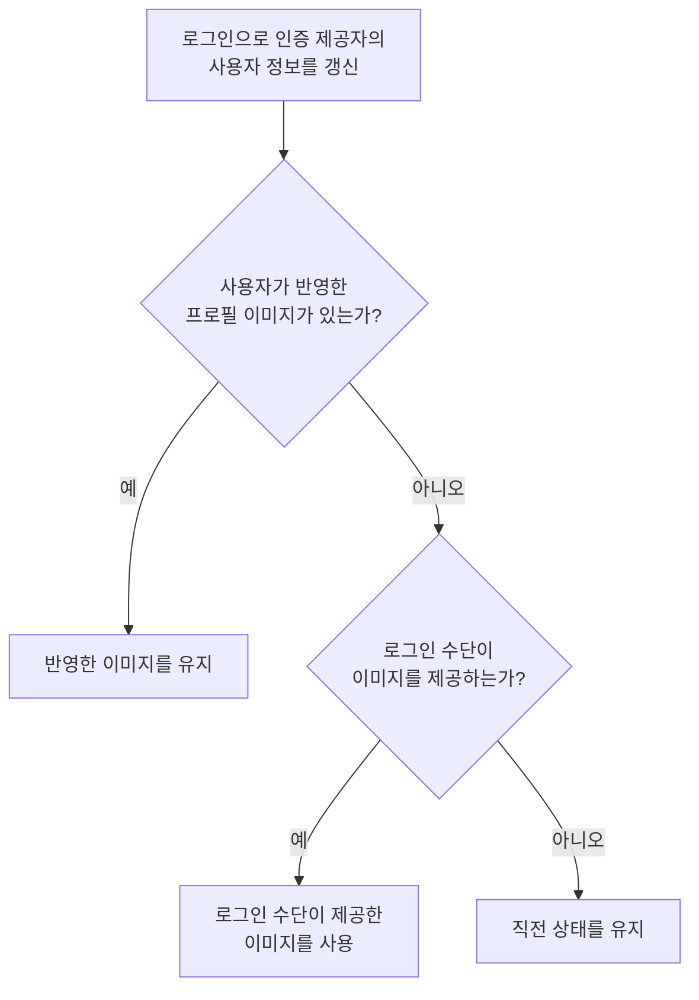
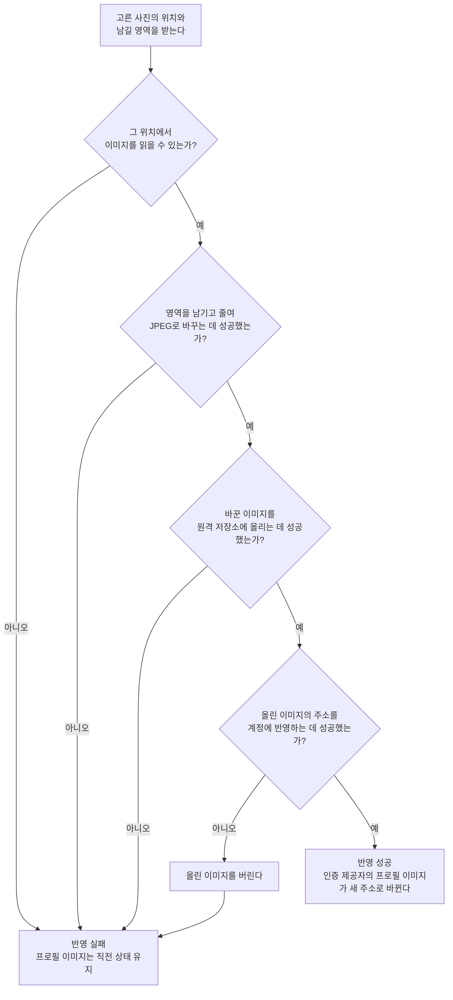

# 프로필 이미지 변경 스펙

이 문서는 사용자가 고른 사진에서 정한 영역을 계정의 프로필 이미지로 반영하는 규칙만 다룬다. 사진을 고르고 남길 영역을 정해 반영을 실행하고 결과를 알리는 화면은 [ProfileImageEdit 화면 스펙](./profile-image-edit.md)에서, 그 화면으로 진입하는 프로필 선택은 [MoreHome 화면 스펙](./more-home.md)에서, 반영된 프로필 이미지를 계정 상태로 읽는 규칙은 [계정 조회 스펙](./account.md)에서 다룬다.

## domain

### 반영할 수 있는 이미지

사용자는 기기가 사진으로 제공하는 이미지를 형식에 관계없이 고를 수 있다.

고른 사진은 사용자가 정한 정사각형 영역만 남기고 반영하기 전에 JPEG 한 형식으로 바꾼다. 프로필 이미지를 보여 주는 수단이 기기와 브라우저마다 다르고, 모든 수단이 함께 표시할 수 있는 형식이 JPEG이기 때문이다.

앱이 읽지 못하거나 JPEG로 바꾸지 못하는 사진은 반영에 실패한다. 어떤 형식을 읽을 수 있는지는 기기가 정하므로 같은 사진도 기기에 따라 결과가 다를 수 있다.

바꾼 이미지 하나의 크기는 5MB 이하여야 한다. `이미지 변환`에 따라 줄인 뒤에도 이 크기를 넘는 이미지는 원격 저장소가 받지 않으므로 반영은 실패한다.

### 이미지 변환

JPEG로 바꿀 때 사진의 내용은 다음 범위에서만 달라진다.

- 촬영 방향을 반영한 사진에서 사용자가 정한 영역만 남긴다. 영역의 규칙은 [ProfileImageEdit 화면 스펙](./profile-image-edit.md)의 `domain > 남길 영역`을 따른다. 남긴 이미지는 정사각형이다.
- 남긴 이미지의 한 변이 최대 변 길이를 넘으면 최대 변 길이로 줄인다. 넘지 않으면 해상도를 그대로 두며 늘리지 않는다.
- 여러 장면이 이어지는 이미지는 첫 장면만 남는다.
- 투명한 부분은 불투명한 색으로 채워진다. 채우는 색은 기기가 정하므로 기기에 따라 다를 수 있다.

최대 변 길이는 1024px이다. 프로필 이미지는 작은 크기로 표시되므로 그 이상의 해상도는 표시 품질에 기여하지 않고, 크기 제한에 걸려 반영에 실패하는 사진을 줄인다.

JPEG 화질은 `90`으로 고정한다.

줄이는 것은 최대 변 길이까지만 한다. 그 뒤에도 바꾼 이미지가 받을 수 있는 크기를 넘으면 화질을 더 낮추는 대신 반영에 실패한다.

### 보관하는 프로필 이미지

계정마다 마지막으로 반영된 프로필 이미지 하나만 보관한다.

새 프로필 이미지가 반영되면 이전 프로필 이미지는 더 이상 조회할 수 없다.

프로필 이미지는 계정을 특정하지 않은 요청으로도 주소만 알면 조회할 수 있다. 프로필 이미지를 화면에 표시하는 수단이 로그인 정보를 함께 보내지 못하기 때문이다.

### 로그인 시 프로필 이미지

앱은 로그인할 때마다 인증 제공자의 사용자 정보를 그 로그인 수단이 제공하는 값으로 갱신한다.

사용자가 반영한 프로필 이미지가 있으면 다시 로그인해도 그 이미지를 유지한다. 로그인 수단이 다른 이미지를 제공하더라도 사용자가 반영한 이미지가 우선한다. 같은 계정에 다른 로그인 수단을 사용해도 마찬가지다.

사용자가 반영한 프로필 이미지가 없을 때만 그 로그인 수단이 제공하는 이미지를 계정의 프로필 이미지로 쓴다. 로그인 수단이 이미지를 제공하지 않으면 계정의 프로필 이미지는 직전 상태를 유지한다.

### 반영 실패 시 상태

반영이 어느 단계에서 실패하든 계정의 프로필 이미지는 직전 상태를 그대로 유지한다.

반영에 실패했음을 사용자에게 알리는 규칙은 [ProfileImageEdit 화면 스펙](./profile-image-edit.md)의 `feature > 반영 실행`을 따른다.

## data

### 반영 흐름

프로필 이미지 반영은 고른 사진의 위치와 남길 영역을 받아 다음 순서로 진행한다.

원격 저장소는 JPEG만 받는다. 앱이 이미 JPEG로 바꾼 뒤에 올리므로, 다른 형식이 올라오는 것은 앱과 원격 저장소의 약속이 어긋난 상태다.

계정에 반영하지 못한 이미지는 원격 저장소에 남기지 않는다. 아무도 참조하지 않는 이미지가 쌓이는 것을 막기 위해서다.

### 반영 결과의 전달

프로필 이미지를 반영하면 인증 제공자가 알리는 사용자 정보의 프로필 이미지도 함께 새 주소로 바뀐다.

저장된 사용자 정보는 인증 제공자의 사용자 정보를 따르므로, 앱이 인증 제공자의 사용자 정보를 다시 확인하는 시점에 계정의 프로필 이미지가 새 주소로 바뀐다. 저장된 사용자 정보와 계정 상태의 관계는 [계정 조회 스펙](./account.md)의 `data > 저장된 사용자 정보의 출처`를 따른다.

반영 자체는 사용자 정보를 다시 확인하지 않는다. 반영에 성공한 뒤 돌아가는 MoreHome 화면이 표시될 때 다시 확인하므로 사용자는 돌아온 화면에서 바뀐 프로필 이미지를 본다. 그 계기와 조건은 [MoreHome 화면 스펙](./more-home.md)의 `feature > 사용자 정보 다시 확인`이 소유한다.

### 로그인 시 프로필 이미지 유지

계정이 보관한 프로필 이미지가 앱의 원격 저장소에 있는 이미지이면 사용자가 반영한 이미지로 본다. 그 외의 주소는 로그인 수단이 제공한 이미지로 본다.

로그인으로 앱 세션을 발급할 때 사용자가 반영한 이미지가 있으면, 인증 제공자가 알리는 사용자 정보의 프로필 이미지를 그 주소로 되돌린 뒤 세션을 전달한다. 앱은 로그인 직후 인증 제공자의 사용자 정보를 확인하므로 사용자는 로그인한 화면에서 반영한 프로필 이미지를 본다.

되돌리는 데 실패해도 로그인은 실패하지 않는다. 계정이 보관한 프로필 이미지는 그대로 남아 있어 다음 로그인에서 다시 되돌릴 수 있고, 로그인 자체를 막는 것이 사용자에게 더 큰 손해이기 때문이다.
