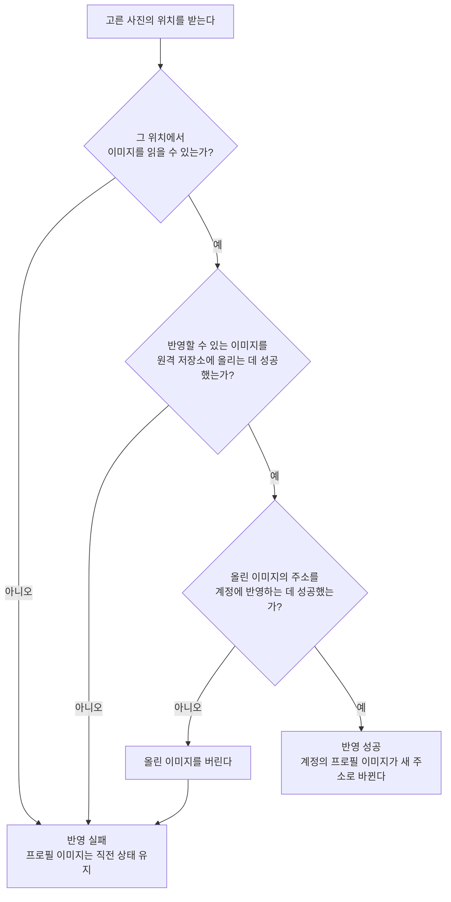

# 프로필 이미지 변경 스펙

이 문서는 사용자가 고른 사진을 계정의 프로필 이미지로 반영하는 규칙만 다룬다. 사진을 고르는 행위와 화면 표시는 [MoreHome 화면 스펙](./more-home.md)에서, 반영된 프로필 이미지를 계정 상태로 읽는 규칙은 [계정 조회 스펙](./account.md)에서 다룬다.

## domain

### 반영할 수 있는 이미지

프로필 이미지로 반영할 수 있는 이미지는 PNG, JPEG, WebP, GIF 네 형식이다.

이미지 하나의 크기는 5MB 이하여야 한다.

형식이나 크기 조건을 만족하지 않는 사진은 원격 저장소가 받지 않으므로 반영은 실패한다.

### 보관하는 프로필 이미지

계정마다 마지막으로 반영된 프로필 이미지 하나만 보관한다.

새 프로필 이미지가 반영되면 이전 프로필 이미지는 더 이상 조회할 수 없다.

프로필 이미지는 계정을 특정하지 않은 요청으로도 주소만 알면 조회할 수 있다. 프로필 이미지를 화면에 표시하는 수단이 로그인 정보를 함께 보내지 못하기 때문이다.

### 반영 실패 시 상태

반영이 어느 단계에서 실패하든 계정의 프로필 이미지는 직전 상태를 그대로 유지한다.

반영에 실패하면 사용자에게 오류를 안내하지 않는다. 안내 여부와 방식은 [MoreHome 화면 스펙](./more-home.md)의 `feature > 프로필 사진 선택`을 따른다.

## data

### 반영 흐름

프로필 이미지 반영은 고른 사진의 위치를 받아 다음 순서로 진행한다.

계정에 반영하지 못한 이미지는 원격 저장소에 남기지 않는다. 아무도 참조하지 않는 이미지가 쌓이는 것을 막기 위해서다.

### 반영 결과의 전달

프로필 이미지를 반영하면 인증 제공자가 알리는 사용자 정보의 프로필 이미지도 함께 새 주소로 바뀐다.

저장된 사용자 정보는 인증 제공자의 사용자 정보를 따르므로, 앱이 인증 제공자의 사용자 정보를 다시 확인하는 시점에 계정의 프로필 이미지가 새 주소로 바뀐다. 저장된 사용자 정보와 계정 상태의 관계는 [계정 조회 스펙](./account.md)의 `data > 저장된 사용자 정보의 출처`를 따른다.

반영은 사용자 정보를 다시 확인하도록 요구하지 않는다. 그래서 반영에 성공한 뒤에도 다시 확인하기 전까지는 계정의 프로필 이미지가 직전 주소로 조회된다.
