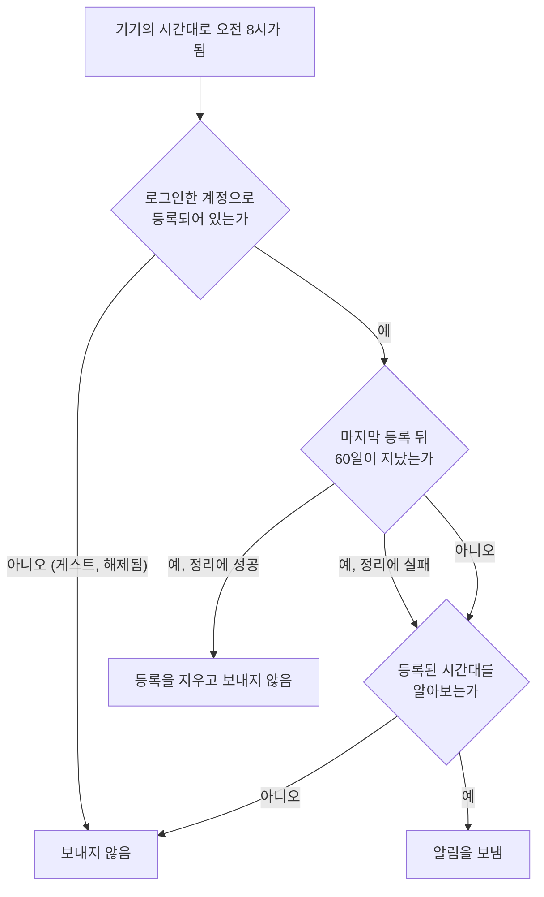
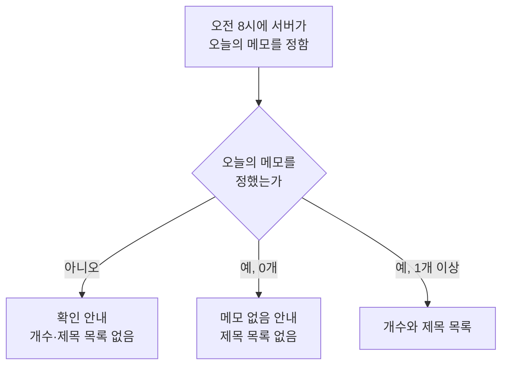

# 일일 메모 알림 스펙

이 문서는 서버가 매일 정해진 시각에 등록된 기기로 오늘의 메모를 알려 주는 알림을 보내는 처리를 다룬다. 발송 시각, 발송 대상, 오늘의 메모를 고르는 기준, 문구와 언어의 결정, 오래 남은 등록의 정리를 여기서 정한다.

알림에 담겨 오는 정보의 의미는 [일일 메모 알림 스펙(common)](../common/daily-memo-notification.md)을, 기기가 알림을 받아 표시하고 사용자가 알림으로 앱을 여는 것은 [일일 메모 알림 스펙(client)](../client/daily-memo-notification.md)을 따른다. 기기가 언제 등록되고 해제되는지는 [푸시 알림 수신 등록 스펙(client)](../client/fcm-token.md)이, 등록 정보의 저장은 [푸시 알림 수신 등록 스펙(server)](./fcm-token.md)이 소유한다.

알림 문구의 정확한 글자는 [일일 메모 알림 디자인](../../design/daily-memo-notification.md)이 소유한다. 메모의 기간과 상태 개념은 [MemoAdd 화면 스펙](../client/memo-add.md)을, 기기의 메모가 서버에 반영되는 시점은 [데이터 동기화 스펙](../common/data-sync.md)을 따른다.

## domain

### 오늘의 메모

오늘의 메모는 알림을 받는 계정과 연결되어 서버에 저장된 메모 중 다음을 모두 만족하는 메모다.

- 기간이 있고, 그 기간이 알림이 발생하는 날과 하루라도 겹친다.
- 완료되지 않았다.
- 삭제되지 않았다.

알림이 발생하는 날은 `발생 시각`이 정하는 기기 시간대의 날짜다.

겹침은 날짜 단위로 판단한다. 시각이 있는 기간도 시각을 무시하고 시작일과 종료일만으로 비교한다. 기간이 없는 메모는 오늘의 메모가 되지 않는다.

완료된 메모는 오늘의 메모에서 제외한다. 이 알림은 사용자가 확인할 일을 알려 주는 것이므로 이미 끝낸 메모는 담지 않는다. 완료된 메모도 표시하는 [캘린더 메모 표시 스펙](../client/calendar-memo.md)의 노출 기준과 다른 결정이다.

오늘의 메모 순서는 [캘린더 메모 표시 스펙](../client/calendar-memo.md)의 `조회 결과 정렬`을 따른다.

캘린더의 태그 필터처럼 화면이 더한 표시 조건은 오늘의 메모에 적용하지 않는다.

### 발송 대상

알림은 서버에 등록된 기기마다 하나씩 보낸다. 서버는 다음을 모두 만족하는 기기에 보낸다.

- 로그인한 계정으로 등록되어 있다. 게스트 기기와 해제된 기기는 등록이 없으므로 대상이 아니다.
- 등록이 `오래 남은 수신 정보의 정리`에 따라 지워지지 않았다.
- 등록된 시간대가 서버가 알아보는 시간대 이름이다. 알아보지 못하는 이름으로 등록된 기기에는 알림을 보내지 않고, 사용자에게도 알리지 않는다.

같은 계정으로 여러 기기에 등록되어 있으면 기기마다 알림을 보낸다. 각 기기의 알림은 그 기기가 등록한 시간대와 언어를 따르므로, 기기마다 도착 시각과 문구 언어가 다를 수 있다.

알림 권한은 서버가 알 수 없으므로 발송 대상을 정하는 데 쓰지 않는다. 권한이 거부된 기기에도 알림을 보내며, 사용자에게 보이는지는 [일일 메모 알림 스펙(client)](../client/daily-memo-notification.md)의 `표시 조건`을 따른다.

### 발생 시각

알림은 기기의 시간대로 매일 오전 8시에 발생한다. 기기의 시간대는 서버가 그 기기에서 마지막으로 등록받은 값이다.

서버는 15분마다 지금이 오전 8시가 된 기기가 있는지 확인해 보낸다. 30분이나 45분 단위로 차이 나는 시간대도 15분 경계에 놓이므로 오전 8시를 건너뛰지 않는다. 확인 한 번이 서버 사정으로 실행되지 않으면 그 회차에 오전 8시가 된 기기는 그날 알림을 받지 못하며, 나중에 몰아서 보내지 않는다.

사용자가 기기의 시간대를 바꾸면 바뀐 값이 서버에 등록된 뒤부터 새 시간대의 오전 8시에 알림이 온다. 앱을 열지 않은 채 시간대를 바꾸면 다음에 앱을 열어 등록되기 전까지 이전 시간대의 오전 8시에 온다. 시간대 변경 때문에 같은 날 알림이 두 번 오거나 하루가 건너뛰어질 수 있으며, 이를 보정하지 않는다.

알림은 서버가 보낸 뒤 기기에 도착하므로 오전 8시보다 조금 늦게 보일 수 있다. 기기가 네트워크에 연결되어 있지 않으면 연결된 뒤에 도착한다. 알림이 발생한 날이 기기 시간대로 끝날 때까지 도착하지 못한 알림은 버려지고 나중에 도착하지 않는다. 이 기한은 알림의 `도착 기한`으로 담는다.

### 발생 조건

메모의 존재 여부, 마지막으로 앱을 사용한 시점, 앱이 실행 중인지는 발생 조건이 아니다. 오늘의 메모가 하나도 없는 날에도 알림은 발생한다.

알림은 서버가 보내므로 앱의 실행 상태와 무관하다. 앱을 종료하거나 기기를 다시 시작하거나 앱을 오랫동안 실행하지 않아도 등록이 남아 있는 동안 알림은 계속 발생한다. 앱을 실행한다고 알림이 추가로 발생하거나 발생 시각이 바뀌지 않는다.

### 알림 내용을 정하는 시점

알림 내용은 알림이 발생하는 시점에 서버에 저장된 데이터로 정한다. 기기에 저장된 메모는 사용하지 않는다.

알림이 발생하기 전에 서버에 반영된 추가·수정·완료·삭제는 알림에 담기고, 그 뒤에 반영된 변경은 다음 알림부터 담긴다. 다른 기기에서 바꾼 메모도 서버에 반영되어 있으면 담기고, 이 기기에서 바꾸었지만 아직 서버에 올라가지 않은 변경은 담기지 않는다.

오늘의 메모를 정하지 못하면 알림을 보내지 않는 대신, 오늘의 메모를 확인하라는 안내만 담은 알림을 보낸다. 사용자에게 실패를 따로 알리지 않는다. 세 가지 내용의 의미는 [일일 메모 알림 스펙(common)](../common/daily-memo-notification.md)의 `알림 내용`을 따른다.

### 알림 문구의 언어

알림 문구는 서버가 그 기기에서 마지막으로 등록받은 언어로 만든다. 기기 언어를 바꾸면 바뀐 값이 서버에 등록된 뒤에 오는 알림부터 새 언어로 만든다.

서버는 한국어와 영어 문구를 제공한다. 등록된 언어가 한국어이면 한국어로, 그 밖의 언어이면 영어로 만든다. 문구 자체는 [일일 메모 알림 디자인](../../design/daily-memo-notification.md)이 소유한다.

## data

### 오늘의 메모 조회

오늘의 메모는 서버에 저장된 메모에서 조회한다. 조회는 등록된 기기에 연결된 계정의 메모만 대상으로 하며, 조건과 정렬은 `domain > 오늘의 메모`를 따른다.

조회 결과에는 알림에 필요한 메모 제목만 담는다. 제목은 저장된 그대로 쓰고 줄이거나 바꾸지 않는다.

서버가 메모를 조회하지 못하면 결과를 비워서 다루지 않고 실패로 다룬다. 실패한 알림의 내용은 `domain > 알림 내용을 정하는 시점`을 따른다.

### 발송

서버는 등록된 기기마다 알림을 하나 보낸다. 알림 문구는 서버가 완성해 보내고, 담는 정보는 [일일 메모 알림 스펙(common)](../common/daily-memo-notification.md)을 따른다.

한 기기로의 발송이 실패해도 다른 기기로의 발송은 계속한다. 알림 전송 수단이 실패로 답한 경우뿐 아니라 그 기기로 보내는 중에 통신이 끊기거나 예상하지 못한 오류가 난 경우도 그 기기의 발송 실패로 보고, 다음 기기로 넘어간다. 실패한 기기에는 같은 날 다시 보내지 않으며 다음 날 알림부터 다시 보낸다. 발송할 기기를 고르지 못하거나 알림 전송 수단에 연결하지 못해 한 회차를 시작하지 못하면 그 회차의 알림은 보내지 않고 다시 시도하지 않는다. 발송 실패는 사용자에게 알리지 않고 서버 오류 기록으로 남긴다.

### 발송 처리의 보호

발송은 서버의 예약 작업만 시작할 수 있다. 앱이나 로그인 세션으로는 발송을 요청할 수 없다.

앱은 발송에 쓰는 기기 목록과 다른 계정의 메모를 읽을 수 없다.

### 오래 남은 수신 정보의 정리

서버는 마지막 등록 뒤 60일이 지난 등록을 오래 남은 등록으로 본다. 서버는 15분마다 발송을 확인할 때 먼저 오래 남은 등록을 지우며, 지운 기기에는 알림을 보내지 않는다. 앱을 열면 다시 등록되므로 60일 안에 한 번이라도 앱을 연 기기는 계속 알림을 받는다. 정리에 실패해도 그 회차의 발송은 계속하며, 이때 지우지 못한 오래 남은 등록도 발송 대상에 남아 그 회차의 알림을 받는다. 그 등록은 다음 회차의 정리에서 다시 지운다.

발송할 때 Firebase가 더 이상 유효하지 않다고 답한 수신 정보도 서버에서 지운다. 앱을 삭제했거나 Firebase가 수신 정보를 새로 발급한 기기의 이전 값이 여기에 해당한다. 새 값은 [푸시 알림 수신 등록 스펙(client)](../client/fcm-token.md)의 `제출 계기`에 따라 다시 등록된다.

등록이 지워진 기기는 다음에 앱을 열어 다시 등록하기 전까지 알림을 받지 않는다.

## 참고

- [Firebase Cloud Messaging: 메시지 유형](https://firebase.google.com/docs/cloud-messaging/concept-options)
- [Firebase Cloud Messaging: 등록 토큰 관리](https://firebase.google.com/docs/cloud-messaging/manage-tokens)
- [Firebase 푸시 알림 메시지 안내](https://firebase.google.com/docs/reference/fcm/rest/v1/projects.messages)
