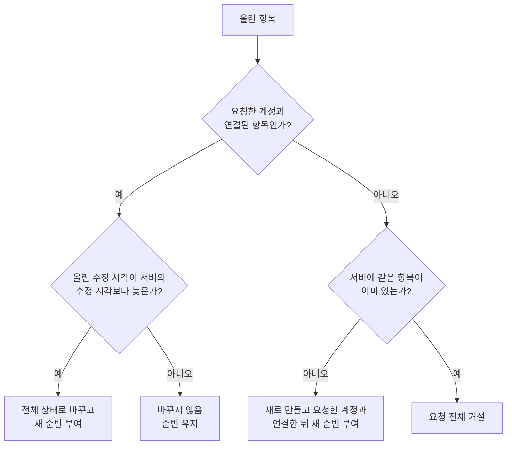

# 데이터 동기화 서버 스펙

이 문서는 서버가 기기의 동기화 요청을 받아 확인하고 저장하고, 계정마다 접근을 제한하고, 충돌을 판정하고, 내려줄 범위를 정하는 규칙과 삭제된 항목의 영구 제거를 다룬다.

동기화 대상, 항목과 연결의 상태와 시각의 의미, 충돌 기준, 삭제의 의미, 주고받는 정보는 [데이터 동기화 스펙](../common/data-sync.md)을, 앱이 언제 어떤 순서로 요청하는지는 [데이터 동기화 앱 스펙](../client/data-sync.md)을 따른다. 연결의 공통 성질은 [항목 연결 공통 스펙](../common/entity-link.md)을, 대표 태그의 의미는 [메모 대표 태그 스펙](../common/memo-primary-tag.md)을 따른다.

서버 처리에는 사용자 조작이 없어 `feature` 영역을 생략한다.

## domain

### 요청 확인

동기화 요청은 열세 종류마다 올리기와 내려받기가 따로 있다. 모든 요청은 인증된 로그인 세션을 담아야 하며, 세션이 없거나 인증되지 않으면 요청을 거절한다. 서버는 요청에 담긴 세션의 계정을 요청한 계정으로 본다. 요청에 대상 계정을 따로 지정하는 방법은 없다.

올리는 요청은 그 종류의 항목 목록을 담는다. 서버는 목록의 모든 항목이 다음을 만족하는지 먼저 확인하고, 하나라도 어긋나면 요청 전체를 거절해 아무것도 반영하지 않는다.

- 항목과 연결이 가리키는 항목의 식별 정보, 생성 시각과 수정 시각이 정해진 형식이다.
- [데이터 동기화 스펙](../common/data-sync.md)의 `주고받는 정보`에 있는 정보가 빠짐없이 알맞은 형태로 담겨 있다. 장소의 주소는 빠져도 되며, 빠지면 빈 주소로 저장한다.
- 메모의 기간은 하루 종일 여부, 시작, 끝이 모두 있거나 모두 없고, 시작이 끝보다 늦지 않다. 기간의 시작과 끝은 시간대 없이 날짜와 시각으로 담는다.
- 장소의 위도는 -90 이상 90 이하, 경도는 -180 이상 180 이하다.
- 연락처의 생일과 양력·음력 구분은 함께 있거나 함께 없고, 구분은 양력이나 음력 중 하나다. 신발 사이즈는 정수다.
- 태그와 태그의 연결은 출발 태그와 도착 태그가 서로 다르다.

한 번의 요청에 담을 수 있는 항목 수는 서버가 제한하지 않는다. 한 번에 100개씩 나눠 보내는 것은 앱의 규칙이다.

내려받는 요청은 그 종류의 내려받기 위치 하나를 담으며, 위치는 0 이상의 정수여야 한다.

### 업로드 반영

서버는 한 요청의 항목을 담긴 순서대로 반영하며, 요청 하나를 전부 반영하거나 전혀 반영하지 않는다. 중간의 한 항목이라도 거절되면 앞서 반영한 항목도 모두 되돌리고 요청을 실패로 돌려준다.

항목을 반영하는 기준은 다음과 같다.

- 요청한 계정과 연결된 항목은 올린 수정 시각이 서버의 수정 시각보다 늦을 때만 올린 전체 상태로 바꾼다. 수정 시각이 같거나 이르면 바꾸지 않으며, 이는 요청 실패가 아니다.
- 서버에 없는 항목은 올린 전체 상태로 새로 만들고, 요청한 계정과의 연결을 함께 만든다.
- 서버에 이미 있지만 요청한 계정과 연결되지 않은 항목은 바꿀 수 없으며, 그 요청 전체를 거절한다. 다른 계정의 항목을 올려 자신의 계정과 임의로 연결할 수 없다.
- 생성 시각은 처음 만들 때 받은 값을 유지하며, 이후 올린 값으로 바뀌지 않는다.
- 웹 항목의 요청 헤더 목록과 연락처의 전화번호 목록은 올린 목록으로 통째로 바꾼다.

성공한 요청의 응답에는 실제로 내용이 바뀌거나 새로 연결된 항목의 개수만 담기며, 항목별 반영 결과는 돌려주지 않는다.

### 대표 태그 확인

메모의 대표 태그는 메모를 반영하기 전에 확인한다.

| 대표 태그 | 결과 |
| --- | --- |
| 지정되지 않음 | 그대로 반영한다 |
| 요청한 계정과 연결된 태그 | 그대로 반영한다 |
| 서버에 없는 태그 | 영구히 제거된 태그로 보고 대표 태그 지정이 해제된 것으로 메모의 나머지 내용을 반영한다 |
| 서버에 있지만 요청한 계정과 연결되지 않은 태그 | 요청 전체를 거절한다 |

서버에 없는 태그를 거절하지 않는 것은, 기기가 대표 태그 해제를 아직 내려받지 못한 동안에도 그 메모의 업로드가 막히지 않게 하기 위해서다.

### 연결 반영

연결을 반영하기 전에 연결이 잇는 두 항목이 모두 요청한 계정과 연결되어 있는지 확인한다. 둘 중 하나라도 연결되어 있지 않으면 요청 전체를 거절한다. 태그와 태그의 연결은 출발 태그와 도착 태그를 모두 확인한다.

두 항목이 모두 계정과 연결되어 있으면 다음 기준으로 반영한다.

- 서버에 없는 연결은 올린 상태로 새로 만든다.
- 서버에 이미 있는 연결은 올린 수정 시각이 서버의 수정 시각보다 늦을 때만 해제 여부와 수정 시각을 바꾼다.
- 연결이 요청한 계정과 아직 연결되지 않았으면, 다른 계정이 먼저 만든 연결이더라도 요청한 계정과의 연결을 새로 만든다. 연결은 두 항목에 대한 관계이므로, 두 항목에 접근할 수 있는 계정은 그 연결에도 접근할 수 있다.

### 서버 변경 순번 부여

서버는 계정마다 하나씩 증가하는 순번을 가지며, 같은 계정의 순번은 요청이 동시에 들어와도 한 번에 하나씩 차례로 매긴다. 따라서 작은 순번의 변경이 항상 먼저 저장되고, 내려받기가 순번을 건너뛰지 않는다.

순번은 다음 경우에 매긴다.

- 항목이나 연결의 내용이 실제로 바뀌면, 그 항목과 연결된 모든 계정에 각 계정의 다음 순번을 매긴다. 공유되는 항목을 한 계정이 바꾸면 다른 계정도 그 변경을 내려받는다.
- 새 항목이나 연결을 만들면서 요청한 계정과의 연결을 함께 만들면, 그 계정의 다음 순번 하나를 매긴다.
- 이미 있는 연결에 요청한 계정과의 연결만 새로 만들면, 그 계정의 다음 순번을 매긴다.

올린 수정 시각이 서버보다 이르거나 같아 내용이 바뀌지 않은 항목은 기존 순번을 그대로 둔다.

한 요청에서 여러 항목을 반영하면 각 항목의 순번은 반영 순서대로 커진다.

### 접근 제한

계정은 자신과 연결된 항목과 연결만 내려받을 수 있다. 다른 계정의 항목은 식별 정보를 알아도 조회하거나 바꿀 수 없다.

항목은 계정별 복사본이 아니라 연결된 계정이 공유하는 하나의 항목으로 저장된다. 이번 범위에서는 요청한 계정과의 연결만 만들고 확인한다. 그룹 연결과 그룹 구성원의 접근 권한은 후속 범위에서 다룬다.

### 내려줄 범위

내려받는 요청에는 요청한 계정과 연결된 항목 가운데 계정의 순번이 요청한 위치보다 큰 것만 순번이 작은 것부터 최대 100개 담는다. 삭제된 항목과 해제된 연결도 포함한다.

각 항목에는 전체 상태와 그 항목에 매겨진 요청한 계정의 순번을 담는다. 같은 항목이 여러 번 바뀌었어도 가장 최근 순번 하나로 한 번만 담긴다.

더 담을 항목이 없으면 빈 목록을 돌려준다.

### 삭제된 항목의 영구 제거

서버는 하루 한 번, 한국 시각 오전 3시 무렵에 삭제된 상태로 60일이 지난 항목과 해제된 상태로 60일이 지난 연결을 영구히 제거한다. 60일은 마지막 수정 시각부터 센다.

60일은 제거 기준이며 정확한 제거 시점을 보장하지 않는다. 실제 제거는 그보다 늦어질 수 있고, 한 번에 제거하는 양이 많으면 남은 항목은 다음 날 이어서 제거한다.

삭제된 항목을 다시 수정하면 수정 시각이 바뀌므로 그 시점부터 60일을 다시 센다. 삭제를 실행 취소하면 그 항목은 영구 제거 대상에서 빠진다.

항목이 영구히 제거되면 그 항목과 계정의 연결, 그 항목을 가리키는 연결도 해제 여부와 관계없이 함께 제거된다.

태그를 영구히 제거하기 전에는 그 태그를 대표 태그로 가진 메모의 대표 태그 지정을 먼저 해제하고, 그 메모와 연결된 모든 계정에 새 순번을 매긴다. 해제가 각 기기에 서버의 변경으로 전달되게 하기 위해서다. 이때 메모의 수정 시각은 바꾸지 않으므로, 기기에서 더 늦게 바꾼 같은 메모가 있으면 [데이터 동기화 스펙](../common/data-sync.md)의 `충돌 기준`에 따라 기기 내용이 유지된다.

영구히 제거된 항목과 연결은 어느 기기에도 더 이상 전달되지 않는다. 제거 기간 60일은 앱의 [강제 전체 재동기화](../client/data-sync.md) 기준 30일보다 길어야 한다.
