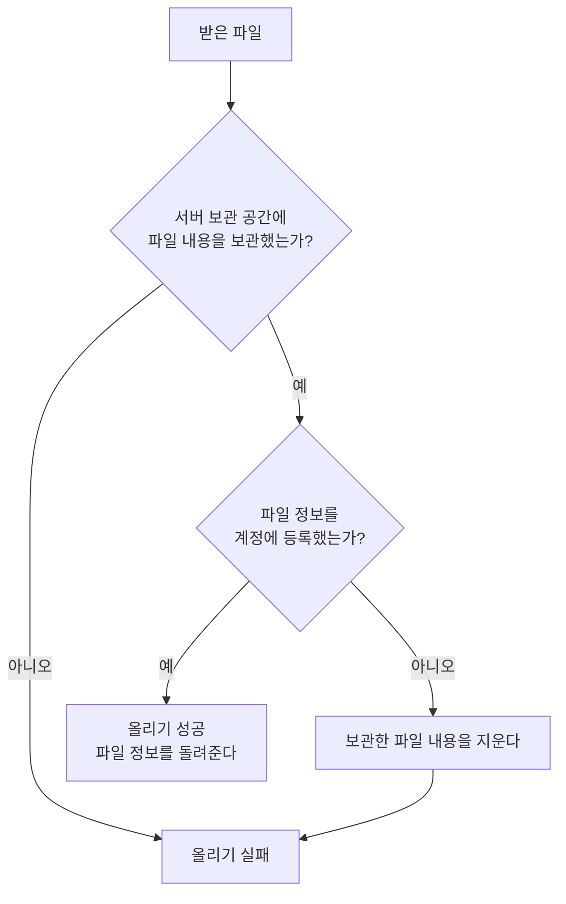

# 파일 보관 스펙

이 문서는 서버가 앱이 올린 파일을 받아 보관하고, 계정이 올린 파일의 목록을 돌려주는 처리를 다룬다.

앱과 서버가 주고받는 파일과 목록의 약속은 [파일 보관 스펙(common)](../common/file-storage.md)을, 앱이 파일을 올리고 목록을 불러오는 흐름은 [파일 보관 스펙(client)](../client/file-storage.md)을 따른다.

## domain

### 보관하는 파일

계정마다 올린 파일을 모두 보관한다. 같은 이름의 파일을 다시 올려도 이전 파일을 지우거나 바꾸지 않는다.

파일과 파일 정보는 그 계정 자신만 올리고 조회할 수 있다. 로그인하지 않은 요청이나 다른 계정의 요청으로는 파일의 존재도 확인할 수 없다.

계정이 삭제되면 그 계정의 파일 정보도 함께 삭제되어 목록에 나타나지 않는다. 서버 보관 공간에 남은 파일 내용을 정리하는 것은 이번 범위에서 다루지 않는다.

## data

### 받는 파일

서버는 다음을 모두 만족하는 올리기 요청만 받는다. 하나라도 어기면 파일을 보관하지 않고 요청을 거절한다.

- 인증된 로그인 세션으로 보낸 요청이다.
- 파일 이름이 비어 있지 않고 공백만으로 이루어지지 않았으며 255자 이하다.
- 파일 크기가 50MB 이하다. 서버는 파일을 끝까지 받기 전에 알려진 크기로 먼저 거르고, 받은 뒤에도 다시 확인한다. 크기를 넘는 요청은 다른 거절과 구분되는 크기 초과로 알린다.

파일 형식은 거르지 않는다. 형식 정보가 없으면 형식을 알 수 없는 일반 파일로 보관한다.

서버는 받은 파일의 내용을 바꾸지 않는다.

### 보관 순서

서버는 받은 파일을 다음 순서로 보관한다.

파일 정보를 등록하지 못한 파일 내용은 서버 보관 공간에 남기지 않는다. 아무도 참조하지 않는 파일이 쌓이는 것을 막기 위해서다. 지우는 단계가 다시 실패해도 요청은 올리기 실패로 끝나며, 서버 오류 기록으로 남긴다.

파일 정보가 등록된 파일만 목록에 나타나므로, 보관 도중 실패한 파일은 목록에 나타나지 않는다.

### 목록 응답

서버는 목록 요청을 [파일 보관 스펙(common)](../common/file-storage.md)의 `목록 요청`에 따라 처리한다. 요청한 개수가 허용 범위를 벗어나거나 이어서 불러올 기준 파일의 정보가 형식에 맞지 않으면 요청을 거절한다.
