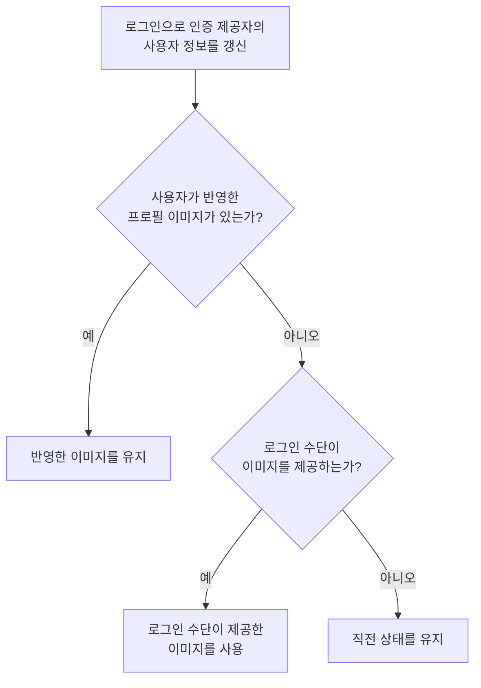
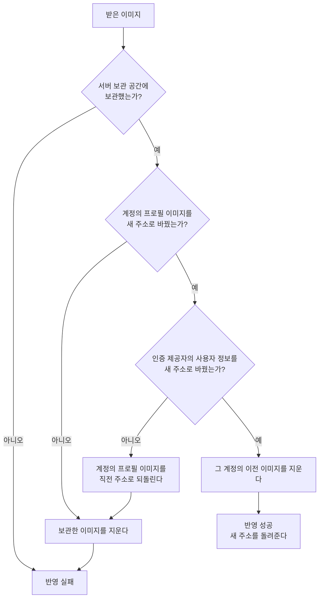

# 프로필 이미지 변경 스펙

이 문서는 서버가 앱이 올린 프로필 이미지를 받아 보관하고 계정에 반영하는 처리와, 로그인할 때 계정의 프로필 이미지를 지키는 처리를 다룬다.

앱과 서버가 주고받는 이미지와 결과의 약속은 [프로필 이미지 변경 스펙(common)](../common/profile-image.md)을, 앱이 사진을 바꿔 올리고 결과를 읽는 흐름은 [프로필 이미지 변경 스펙(client)](../client/profile-image.md)을 따른다.

## domain

### 보관하는 프로필 이미지

계정마다 마지막으로 반영된 프로필 이미지 하나만 보관한다.

새 프로필 이미지가 반영되면 그 계정이 이전에 올린 이미지를 지우므로 이전 프로필 이미지는 더 이상 조회할 수 없다. 이전 이미지를 지우지 못해도 반영은 성공으로 끝나고, 남은 이미지는 다음 반영 때 함께 지운다.

프로필 이미지는 계정을 특정하지 않은 요청으로도 주소만 알면 조회할 수 있다. 프로필 이미지를 화면에 표시하는 수단이 로그인 정보를 함께 보내지 못하기 때문이다. 이미지를 올리고 지우는 것은 그 계정 자신만 할 수 있다.

### 로그인 시 프로필 이미지

로그인하면 인증 제공자의 사용자 정보가 그 로그인 수단이 제공하는 값으로 갱신된다.

사용자가 반영한 프로필 이미지가 있으면 다시 로그인해도 그 이미지를 유지한다. 로그인 수단이 다른 이미지를 제공하더라도 사용자가 반영한 이미지가 우선한다. 같은 계정에 다른 로그인 수단을 사용해도 마찬가지다.

사용자가 반영한 프로필 이미지가 없을 때만 그 로그인 수단이 제공하는 이미지를 계정의 프로필 이미지로 쓴다. 로그인 수단이 이미지를 제공하지 않으면 계정의 프로필 이미지는 직전 상태를 유지한다.

### 반영 실패 시 상태

반영이 어느 단계에서 실패하든 계정의 프로필 이미지는 직전 상태를 그대로 유지한다.

## data

### 받는 이미지

서버는 다음을 모두 만족하는 요청만 받는다. 하나라도 어기면 이미지를 보관하지 않고 요청을 거절한다.

- 인증된 로그인 세션으로 보낸 요청이다.
- 이미지 형식이 JPEG다. 다른 형식은 앱과 서버의 약속이 어긋난 상태이므로 받지 않는다.
- 이미지가 비어 있지 않고 크기가 5MB 이하다. 서버는 이미지를 끝까지 받기 전에 알려진 크기로 먼저 거르고, 받은 뒤에도 다시 확인한다.

서버는 받은 이미지의 내용을 바꾸거나 줄이지 않는다.

### 반영 순서

서버는 받은 이미지를 다음 순서로 반영한다.

앱이 읽는 인증 제공자의 사용자 정보를 마지막에 바꾸므로, 앞 단계에서 실패하면 앱이 보는 프로필 이미지는 한 번도 바뀌지 않은 채 끝난다.

계정에 반영하지 못한 이미지는 서버 보관 공간에 남기지 않는다. 아무도 참조하지 않는 이미지가 쌓이는 것을 막기 위해서다. 되돌리거나 지우는 단계가 다시 실패해도 요청은 반영 실패로 끝나며, 서버 오류 기록으로 남긴다.

### 로그인 시 프로필 이미지 유지

계정이 보관한 프로필 이미지가 앱의 서버 보관 공간에 있는 이미지이면 사용자가 반영한 이미지로 본다. 그 외의 주소는 로그인 수단이 제공한 이미지로 본다.

로그인으로 세션을 발급할 때 사용자가 반영한 이미지가 있으면, 인증 제공자가 알리는 사용자 정보의 프로필 이미지를 그 주소로 되돌린 뒤 세션을 돌려준다. 앱은 로그인 직후 인증 제공자의 사용자 정보를 받아 오므로 사용자는 로그인한 화면에서 반영한 프로필 이미지를 본다.

되돌리는 데 실패해도 로그인은 실패하지 않는다. 계정이 보관한 프로필 이미지는 그대로 남아 있어 다음 로그인에서 다시 되돌릴 수 있고, 로그인 자체를 막는 것이 사용자에게 더 큰 손해이기 때문이다.

처음 로그인해 계정이 만들어질 때 계정의 첫 프로필 이미지는 [로그인 스펙(server)](./login.md)의 `처음 로그인하는 사용자`를 따른다.
