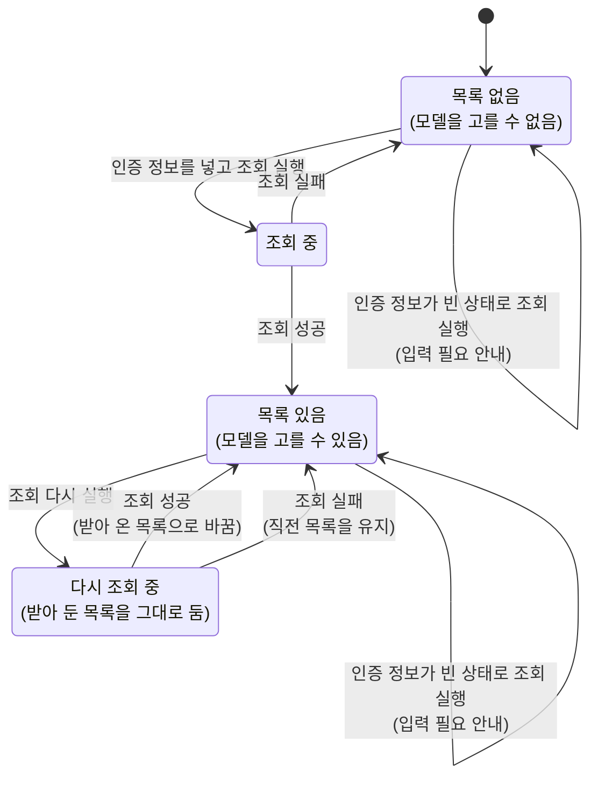

# SettingGemini 화면 스펙

이 문서는 사용자가 설정 화면의 `Gemini` 항목에서 진입하는 SettingGemini 화면의 내용과 행동을 다룬다. 설정 항목의 표시와 선택은 [SettingHome 화면 스펙](./setting-home.md)에서, 설정 목록과 함께 사용할 때의 선택·뒤로가기 정책은 [Setting 목록·상세 배치 스펙](./setting-list-detail.md)에서, 세부 화면에서의 공통 내비게이션 노출 규칙은 [TopLevelNavigation 스펙](./top-level-navigation.md)에서 다룬다. 고를 수 있는 모델을 받아 오는 원격 조회 규칙은 [Gemini 모델 목록 조회 스펙](./gemini-model-list.md)에서 다룬다.

디자인: [SettingGemini 화면 디자인](../design/setting-gemini.md)

이번 범위는 사용자가 인증 정보, 모델, 시스템 프롬프트를 정해 기기에 저장하는 것까지다. 저장한 설정으로 실제 내용을 생성하는 기능은 이번 범위에 포함하지 않는다.

## feature

### 진입과 이동

사용자는 설정 화면의 `Gemini` 항목을 선택해 SettingGemini 화면으로 이동한다.

SettingGemini 화면은 설정 목록과 함께 표시되거나 단독으로 표시될 수 있다. 두 상태 모두 공통 내비게이션을 제공하지 않으며, 표시 관계는 [Setting 목록·상세 배치 스펙](./setting-list-detail.md)을 따른다.

화면에 진입하면 저장해 둔 인증 정보, 모델, 시스템 프롬프트가 입력된 상태로 시작한다. 한 번도 저장하지 않았으면 세 값 모두 비어 있는 상태로 시작한다.

저장된 설정을 확인하기 전이거나 읽지 못했으면 세 값을 입력하는 기능과 저장 기능을 제공하지 않으며 별도 로딩 또는 오류 상태로 전환하지 않는다.

### 인증 정보 입력

사용자는 Google이 발급한 인증 정보를 한 줄로 입력하거나 바꿀 수 있다.

### 모델 선택

사용자는 모델 조회를 실행해 현재 입력한 인증 정보로 고를 수 있는 모델을 받아 온다. 화면에 들어오는 것만으로는 모델을 받아 오지 않으므로, 사용자가 조회를 실행하기 전까지는 모델을 고를 수 없다.

모델 조회는 저장된 인증 정보가 아니라 지금 입력란에 있는 인증 정보로 수행한다. 그래서 사용자는 새 인증 정보를 저장하기 전에 그 인증 정보가 쓸 수 있는지 확인할 수 있다.

인증 정보가 비어 있는 상태에서 조회를 실행하면 모델을 받아 오지 않고 인증 정보 입력이 필요하다는 피드백을 제공한다. 입력 중이던 다른 값은 그대로 유지한다.

조회하는 동안에는 진행 상태를 표시하며, 조회가 끝나기 전에는 같은 화면에서 전달된 조회 요청을 처리하지 않는다.

조회에 성공하면 사용자는 받아 온 모델 중 하나를 골라 현재 모델로 정할 수 있다. 고를 수 있는 모델이 하나도 없으면 고를 모델이 없다는 안내를 제공한다.

인증 정보가 유효하지 않아 조회에 실패하면 인증 정보를 확인해야 한다는 것을 알리고, 그 밖의 이유로 실패하면 조회에 실패했다는 것을 알린다. 두 경우 모두 입력 중이던 값은 그대로 두므로 사용자는 값을 고쳐 다시 조회할 수 있다.

조회에 실패해도 직전에 받아 둔 모델 목록과 고른 모델은 그대로 두며, 사용자는 계속 그 목록에서 모델을 고를 수 있다.

### 시스템 프롬프트 입력

사용자는 시스템 프롬프트를 여러 줄로 입력하거나 바꿀 수 있다. 길이를 제한하지 않는다.

### 설정 저장

사용자는 입력한 인증 정보, 모델, 시스템 프롬프트를 저장할 수 있다. 세 값은 함께 저장되며 하나씩 따로 저장할 수 없다.

입력한 세 값 중 하나라도 저장된 설정과 다를 때만 저장할 수 있다. 세 값이 저장된 설정과 모두 같으면 저장 동작을 제공하지 않는다.

저장을 실행하기 전까지 입력한 내용은 저장되지 않는다. 모델을 골라도 저장하기 전에는 저장된 설정이 바뀌지 않는다.

저장하는 동안에는 진행 상태를 표시하며, 저장이 끝나기 전에는 같은 화면에서 전달된 저장 요청을 처리하지 않는다.

저장에 성공하면 화면을 유지한 채 저장되었다는 피드백을 제공하고, 입력한 내용은 비우지 않고 그대로 둔다. 입력한 내용이 곧 저장된 설정이 되므로 사용자가 값을 다시 바꾸기 전까지는 저장 동작을 제공하지 않는다.

저장에 실패하면 입력 중이던 세 값을 그대로 유지하고 저장에 실패했다는 피드백을 제공하므로, 사용자는 그대로 다시 시도할 수 있다.

### 뒤로가기

단독으로 표시될 때와 설정 목록과 함께 표시될 때의 뒤로가기 결과는 모두 [Setting 목록·상세 배치 스펙](./setting-list-detail.md)의 `뒤로가기`를 따른다.

저장하지 않고 화면을 떠나면 입력 중이던 내용은 버려지고 저장된 설정은 바뀌지 않는다. 화면을 떠나기 전에 저장하지 않은 내용이 있다고 따로 확인하지 않는다.

### 입력 상태 유지

화면이 회전하거나 시스템에 의해 재생성되어도 입력 중이던 세 값과 받아 둔 모델 목록을 유지한다.

사용자가 화면을 떠났다가 다시 들어오거나 앱을 종료한 뒤 새로 시작하면 저장된 설정으로 다시 시작하며, 받아 둔 모델 목록은 남지 않는다.

## domain

### Gemini 설정

Gemini 설정은 사용자가 자신의 Gemini를 쓰기 위해 직접 정하는 값이며 인증 정보, 모델, 시스템 프롬프트로 이루어진다.

- 인증 정보: Google이 발급한 값이며 Gemini를 호출할 때마다 함께 보낸다. 앱이 빌드 시점에 정하지 않고 사용자가 직접 넣는다.
- 모델: 생성에 사용할 모델 하나를 가리키는 식별자다. 앱이 고르지 않고 사용자가 고른다.
- 시스템 프롬프트: 생성할 때 모델에 함께 보낼 지시문이다.

세 값 모두 사용자가 한 번도 저장하지 않았으면 비어 있다. 앱은 어느 값에도 기본값을 제시하지 않으며, 특히 시스템 프롬프트를 대신 채워 두지 않는다.

### 저장 가능 상태

편집 중인 인증 정보, 모델, 시스템 프롬프트가 저장된 설정의 세 값과 하나라도 다를 때만 저장 동작을 제공한다. 세 값이 모두 같으면 저장 동작을 제공하지 않는다.

비교는 세 값을 사용자가 넣은 그대로 본다. 앞뒤 공백을 지우거나 대소문자를 맞추지 않으므로 공백만 더해도 다른 값으로 본다.

한 번도 저장하지 않아 저장된 값이 없으면 세 값이 모두 비어 있는 설정과 비교한다. 그래서 화면에 처음 들어와 아무것도 입력하지 않은 상태에서는 저장 동작을 제공하지 않는다.

저장을 처리하는 동안에도 같은 기준을 적용한다. 저장이 끝나 저장된 설정이 편집 중인 값과 같아지면 저장 동작은 사라진다.

### 저장 성립 조건

저장 동작을 제공하는 상태에서 세 값은 각각 비어 있어도 되고 세 값이 모두 비어 있어도 된다. 저장은 사용자가 넣은 값을 그대로 기록하는 것이므로 값의 조합을 제한하지 않는다.

인증 정보가 실제로 유효한지, 고른 모델을 실제로 쓸 수 있는지는 저장 시점에 확인하지 않는다.

덜 채워진 설정으로 내용 생성을 할 수 있는지는 그 기능의 스펙에서 다룬다.

### 고를 수 있는 모델

사용자가 고를 수 있는 모델은 [Gemini 모델 목록 조회 스펙](./gemini-model-list.md)이 돌려주는 모델이며, 그 문서의 `포함 기준`에 따라 내용 생성에 쓸 수 있는 모델만 포함된다.

앱은 고를 수 있는 모델을 따로 정해 두지 않는다. 그래서 Gemini가 제공하는 모델이 바뀌면 사용자가 고를 수 있는 모델도 함께 바뀐다.

모델을 목록에서 고르지 않고 사용자가 직접 적을 수는 없다.

### 선택한 모델과 조회한 목록

현재 선택한 모델은 조회한 목록과 별개로 유지한다. 목록을 받아 오기 전에도 저장된 모델은 현재 선택으로 그대로 표시한다.

조회한 목록에 현재 선택한 모델이 없으면 그 모델을 목록에서 찾을 수 없다는 것을 알리되 선택은 그대로 유지한다. 사용자가 직접 다른 모델을 고르기 전까지 앱이 선택을 비우거나 다른 모델로 바꾸지 않는다.

조회에 실패하면 조회를 실행하기 직전의 상태로 돌아간다.

### 편집 상태와 저장된 설정

화면에서 입력 중인 값은 저장된 설정과 별개의 편집 상태이며, 저장을 실행할 때만 저장된 설정에 반영된다.

저장된 설정이 바뀌어도 편집 중인 값을 덮어쓰지 않는다.

### 유지와 초기화 기준

편집 상태와 받아 둔 모델 목록은 화면이 전환 이력에 남아 있는 동안 화면 재생성과 백그라운드 복귀 후에도 유지한다.

사용자가 화면을 떠나 전환 이력에서 사라지거나 앱을 종료하고 다시 실행하면 편집 상태는 저장된 설정으로 초기화하고 받아 둔 모델 목록은 버린다.

모델 목록을 받아 두는 것은 화면의 진행 상태일 뿐이므로 기기에 저장하지 않는다.

## data

### 저장 시점과 유지

사용자가 저장을 실행하면 그 시점의 인증 정보, 모델, 시스템 프롬프트가 함께 기기에 저장된다. 사용자가 한 번도 저장하지 않았으면 저장된 값이 없고, 이때 세 값은 비어 있는 것으로 다룬다.

저장된 설정은 화면을 떠나거나 화면이 재생성되어도, 앱이 백그라운드에 다녀와도, 앱을 종료하고 다시 시작해도 유지된다.

저장된 값을 읽을 수 없으면 설정을 아직 확인하지 못한 상태로 다룬다. 이는 저장된 값이 없어 세 값을 비어 있는 것으로 다루는 것과 구분된다.

### 기기별 보관

Gemini 설정은 사용자 계정이 아니라 기기에 보관하며 서버와 동기화하지 않는다. 로그인, 로그아웃, 계정 전환으로 바뀌지 않으며 다른 기기에도 반영되지 않는다.

인증 정보는 사용자 개인의 값이므로 다른 기기나 계정으로 옮기지 않는다.

Gemini 설정은 [데이터 동기화 스펙](./data-sync.md)의 동기화 대상이 아니다.

각 환경에서 Gemini 설정을 보관하는 영역과 사라지는 경우는 기본 지도 설정과 같으므로 [SettingMap 화면 스펙](./setting-map.md)의 `환경별 저장 영역`을 따른다.

### 모델 목록 조회

모델 목록은 [Gemini 모델 목록 조회 스펙](./gemini-model-list.md)에 따라 조회하며, 조회 결과는 저장하지 않는다.

조회에는 저장된 인증 정보가 아니라 사용자가 입력란에 넣은 인증 정보를 사용한다. 그래서 저장되지 않은 인증 정보로도 조회할 수 있고, 조회에 성공해도 그 인증 정보가 저장되지는 않는다.
