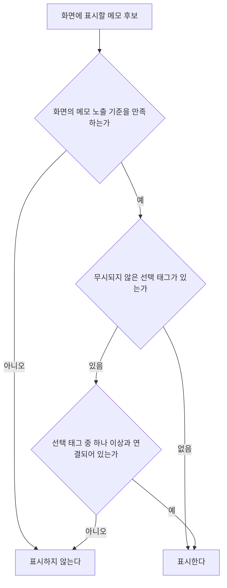

# 태그 필터 스펙

이 문서는 MemoHome 목록과 CalendarHome 화면에서 함께 사용하는 태그 필터의 공통 행동과 정책을 다룬다. 두 화면의 태그 필터는 같은 선택 방식과 판정 규칙을 사용하며, 구체적인 구성과 조작 수단은 [태그 필터 디자인](../design/tag-filter.md)에서 다룬다.

필터가 무엇을 걸러 내는지는 화면마다 다르므로 이 문서에서 다루지 않는다. MemoHome 목록에서는 목록에 표시하는 메모에 적용되고 CalendarHome 화면에서는 캘린더에 표시하는 메모에 적용되며, 각각 [MemoHome 목록 스펙](./memo-home.md)과 [CalendarHome 화면 스펙](./calendar-home.md)의 `태그 필터`를 따른다.

선택 대상이 되는 태그의 노출과 정렬 기준은 [TagHome 목록 스펙](./tag-home.md)을, 메모와 태그의 연결 규칙은 [메모 태그 스펙](./memo-tag.md)을 따른다.

디자인: [태그 필터 디자인](../design/tag-filter.md)

## feature

### 필터 열기와 선택

사용자는 화면에서 태그 필터를 열어 선택할 수 있는 태그 전체와 각 태그의 선택 여부를 확인할 수 있다.

태그는 조회가 진행되는 대로 이어서 나타난다. 사용자가 태그 영역을 이동하지 않아도 선택할 수 있는 태그 전체가 차례로 채워지며, 아직 나타나지 않은 태그는 표시하지 않는다.

사용자는 태그를 여러 개 선택하거나 선택을 해제할 수 있다. 선택과 해제는 즉시 반영되며 별도의 확정 동작은 필요하지 않다. 반영된 결과를 사용자가 어디서부터 확인하는지는 그 화면의 스펙이 정한다.

### 태그 추가

태그 필터에는 태그를 추가하는 동작이 항상 제공된다. 선택할 수 있는 태그가 있어도, 하나도 없어도, 태그 조회가 진행되는 중이어도 이 동작은 나타나며, 화면이 막지 않는 한 사용자는 이 동작을 실행할 수 있다. 화면이 막는 기준은 `domain`의 `태그 추가와 필터 선택`을 따른다. 태그가 하나도 없으면 태그 필터에는 이 동작만 나타나며, 별도의 빈 상태 안내는 두지 않는다.

사용자가 태그 추가 동작을 실행하면 필터가 닫히고 [TagAdd 화면](./tag-add.md)으로 이동한다. TagAdd 화면에서 태그를 추가하고 돌아와도 추가한 태그는 필터에 선택되지 않으며, 사용자는 필터를 다시 열어 그 태그를 선택할 수 있다.

### 선택 전체 해제

사용자는 선택한 태그를 하나씩 해제하지 않고 태그 필터에서 한 번에 모두 해제할 수 있다.

전체 해제도 즉시 반영되며 별도의 확정 동작이나 확인 절차는 필요하지 않다. 해제한 뒤 필터는 선택한 태그가 없는 상태와 같아지고, 필터는 열린 채로 남아 사용자는 이어서 다시 태그를 선택할 수 있다.

선택한 태그가 하나도 표시되어 있지 않으면 전체 해제로 바뀌는 것이 없으므로 사용자는 이 동작을 실행할 수 없다.

전체 해제에는 실행 취소를 제공하지 않는다. 사용자는 원하는 태그를 다시 선택해 되돌린다.

### 필터 닫기와 유지

필터를 닫아도 선택은 유지된다. 사용자는 필터를 다시 열어 현재 선택을 확인하고 바꿀 수 있다.

## domain

### 선택할 수 있는 태그

태그 필터에서 선택할 수 있는 태그는 현재 사용자 계정과 연결된 태그 중 완료되지 않았고 삭제되지 않은 태그다.

선택할 수 있는 태그는 [TagHome 목록 스펙](./tag-home.md)의 정렬 기준에 따라 제목 오름차순으로 표시한다.

필터의 태그는 [TagHome 목록 스펙](./tag-home.md)의 `태그 이모지 표시`에 따라 이모지와 제목을 함께 표시한다.

태그의 이모지, 제목이나 컬러가 바뀌면 필터에는 바뀐 내용을 표시하며 선택 여부는 유지한다.

### 태그 추가와 필터 선택

태그 추가 동작은 태그 필터 선택을 바꾸지 않는다. 필터 선택은 사용자가 필터에서 태그를 고르거나 해제할 때만 바뀌기 때문이다.

화면은 자신이 함께 제공하는 다른 필터의 상태에 따라 태그 필터의 선택과 함께 태그 추가 동작도 실행할 수 없게 정할 수 있다. 어떤 조건에서 막는지는 그 화면의 스펙이 정한다.

### 필터 판정 기준

필터 선택은 메모와 태그의 해제되지 않은 연결을 기준으로 판정한다.

선택한 태그가 없으면 태그와 관계없이 화면의 메모 노출 기준을 만족하는 메모를 모두 표시한다.

태그를 여러 개 선택하면 선택한 모든 태그를 가져야 하는 것이 아니라, 선택한 태그 중 하나 이상과 연결된 메모를 표시한다.

필터 선택은 화면의 기존 메모 노출 기준을 대체하지 않는다. 선택한 태그와 연결되어 있어도 그 화면의 노출 기준을 만족하지 않는 메모는 표시하지 않는다.

화면은 자신이 함께 제공하는 다른 필터의 상태에 따라 태그 필터 선택을 판정에서 무시하도록 정할 수 있다. 무시하는 동안에는 선택한 태그가 없는 기준으로 판정하며, 어떤 조건에서 무시하고 그동안 사용자가 선택을 바꿀 수 있는지는 그 화면의 스펙이 정한다.

### 선택할 수 없게 된 태그

선택한 태그가 완료되거나 삭제되거나 현재 사용자 계정과 연결되지 않아 선택할 수 없게 되면 그 태그의 선택은 필터와 메모 표시 판정에서 무시한다.

선택 자체는 유지되어, 실행 취소나 복구로 태그가 다시 선택할 수 있게 되면 이전 선택이 다시 적용된다. 다만 사용자가 그 사이에 선택을 전체 해제하면 이 선택도 함께 지워지며, 그 기준은 `선택 전체 해제 기준`을 따른다.

선택한 태그가 모두 무시되면 선택한 태그가 없는 기준으로 메모를 모두 표시한다.

### 선택 전체 해제 기준

선택 전체 해제는 그 화면에 유지된 선택을 태그의 상태와 관계없이 모두 해제한다. `선택할 수 없게 된 태그`에 따라 무시되고 있던 선택도 함께 해제되며, 그 태그가 다시 선택할 수 있게 되어도 이전 선택은 다시 적용되지 않는다.

전체 해제는 `선택할 수 없게 된 태그`의 선택 유지를 끝내는 유일한 동작이다. 그 절의 선택 유지는 사용자가 선택을 지우지 않은 동안에만 성립한다.

전체 해제를 실행할 수 있는지는 현재 표시되는 선택이 하나 이상인지로 정한다. 따라서 무시되고 있는 선택만 남아 있으면 사용자는 전체 해제를 실행할 수 없고, 그 선택은 그 태그가 다시 선택할 수 있게 될 때까지 유지된다.

전체 해제 뒤에는 선택한 태그가 없는 기준으로 화면의 메모 노출 기준을 만족하는 메모를 모두 표시한다.

전체 해제는 그 화면의 태그 필터 선택만 바꾼다. 다른 화면의 태그 필터 선택과, 화면이 태그 필터와 함께 제공하는 다른 필터의 상태는 바꾸지 않는다.

### 필터 선택 유지

태그 필터 선택은 현재 사용자 계정별로 유지한다. 로그인이나 로그아웃으로 현재 사용자 계정이 바뀌면 바뀐 계정에 유지된 선택을 적용한다.

한 계정에서 고른 선택은 다른 계정에 적용하지 않는다.

필터를 닫거나 화면이 재생성되거나 앱이 백그라운드에 다녀와도 선택을 유지하며, 앱을 종료하고 다시 실행해도 선택을 유지한다.

필터 선택은 필터를 사용하는 화면별로 독립이다. 한 화면에서 고른 선택은 다른 화면에 적용하지 않는다.

## data

### 태그 필터 조회

태그 필터는 저장소에서 현재 사용자 계정의 선택할 수 있는 태그와 현재 계정에 유지된 그 화면의 필터 선택을 함께 조회해 표시한다.

태그 조회는 [TagHome 목록 스펙](./tag-home.md)의 `목록 조회`와 같은 페이지 단위 조회를 사용한다. 다만 필터는 태그를 한 영역에 모아 보여 주므로 사용자의 이동을 기다리지 않고 남은 페이지를 이어서 조회해 선택할 수 있는 태그 전체를 채운다.

태그가 추가되거나 저장된 태그의 이모지·제목·컬러·상태가 바뀌면 필터의 태그 목록과 선택 여부에 반영한다.

선택할 수 없게 된 태그의 선택은 조회 결과에서 제외할 뿐 저장된 선택에서 제거하지 않는다. 이 선택을 저장에서 지우는 것은 `필터 선택 저장`의 전체 해제뿐이다.

### 필터 선택 저장

사용자가 태그를 선택하거나 선택을 해제하면 현재 사용자 계정의 그 화면 필터 선택을 기기에 즉시 저장한다. 화면마다 다른 위치에 저장해 서로 영향을 주지 않는다.

사용자가 선택을 전체 해제하면 그 화면에 유지된 현재 사용자 계정의 필터 선택을 태그의 상태와 관계없이 한 번에 지워 즉시 저장한다. 지운 결과는 한 번에 반영되어 태그가 하나씩 해제되는 중간 상태가 보이지 않는다.

전체 해제는 다른 화면의 필터 선택과 다른 계정의 필터 선택은 지우지 않는다.

필터 선택은 기기별로 보관하며 서버와 동기화하지 않는다. 따라서 한 기기에서 고른 필터는 다른 기기에 반영되지 않는다.
