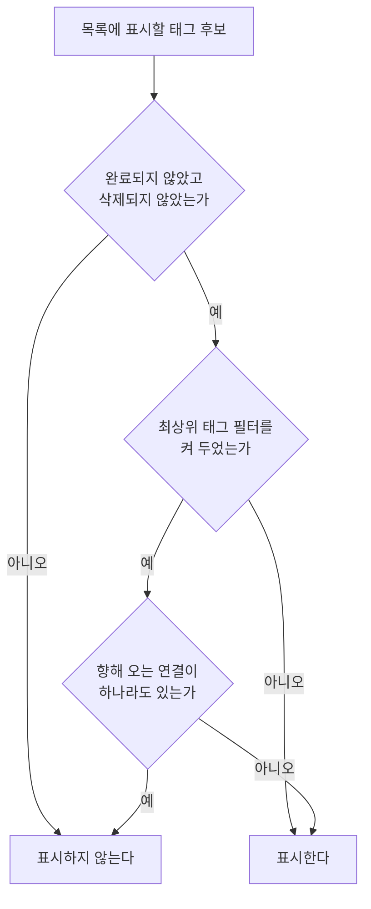

# TagHome 목록 스펙

이 문서는 태그 목록의 노출 기준, 최상위 태그 필터와 목록에서 할 수 있는 행동을 다룬다. 태그 추가는 [TagAdd 화면 스펙](./tag-add.md)에서, 상세 확인과 태그를 완료·다시 시작·삭제하는 행동은 [TagDetail 화면 스펙](./tag-detail.md)에서, 목록과 상세를 함께 또는 단독으로 사용하는 상태와 전환은 [Tag 목록·상세 배치 스펙](./tag-list-detail.md)에서, 완료된 태그를 모아 확인하는 화면은 [TagFinishedList 화면 스펙](./tag-finished-list.md)에서, 목록에서 검색으로 이동한 뒤의 내용과 행동은 [SearchHome 화면 스펙](./search-home.md)에서 다룬다. 목록을 당겨 새로고침하는 행동과 동기화 진행 표시는 [새로고침 스펙](./sync-refresh.md)에서 다룬다. 태그와 태그의 연결 규칙은 [태그 연결 스펙](./tag-link.md)에서 다룬다.

디자인: [TagHome 목록 디자인](../design/tag-home.md)

## feature

### 목록 표시

목록에는 현재 사용자 계정과 연결된 태그 중 완료되지 않았고 삭제되지 않은 태그만 표시한다.

사용자는 각 태그의 이모지, 제목과 저장된 컬러를 확인하고 태그를 선택해 상세 화면으로 이동할 수 있다.

태그 이모지와 제목은 카드에서 한 줄로 표시한다. 제목이 표시할 수 있는 폭보다 길면 전체 제목을 확인할 수 있도록 가로로 반복해서 이동한다.

목록이 나타나는 순서와 아직 준비되지 않은 자리의 처리는 [페이지 조회 목록의 자리 표시 스펙](./paged-list-placeholder.md)을 따른다.

### 최상위 태그 필터

사용자는 태그 목록에서 필터를 열어 최상위 태그만 보기를 켜거나 끌 수 있다.

필터를 켜면 목록에는 최상위 태그만 남고, 끄면 노출 기준을 만족하는 태그를 모두 표시한다. 무엇이 최상위 태그인지는 `domain`의 `최상위 태그 판정 기준`을 따른다.

켜고 끄는 것은 즉시 목록에 반영되며 별도의 확정 동작은 필요하지 않다.

필터를 닫아도 선택은 유지된다. 사용자는 필터를 다시 열어 현재 선택을 확인하고 바꿀 수 있다.

필터를 켜 둔 상태에서도 사용자는 태그 추가, 완료된 태그 확인, 검색, 태그 선택을 그대로 실행할 수 있다.

### 빈 상태

표시할 태그가 하나도 없으면 목록 자리에 비어 있음을 알린다. 필터를 끈 상태에서는 아직 태그가 없으며 새로 추가할 수 있음을, 필터를 켠 상태에서는 최상위 태그가 없음을 알린다. 판정 시점, 두 경우를 구분하는 기준, 빈 상태에서 할 수 있는 행동, 목록과의 전환은 [목록 빈 상태 스펙](./list-empty-state.md)을 따른다.

빈 상태에서도 사용자는 태그 추가, 완료된 태그 확인, 검색, 필터 열기를 그대로 실행할 수 있다.

### 완료된 태그 확인

사용자는 태그 목록에서 완료된 태그 확인을 선택해 TagFinishedList 화면으로 이동할 수 있다.

완료된 태그가 하나도 없어도 이 동작은 제공된다.

이동한 화면의 내용과 행동은 [TagFinishedList 화면 스펙](./tag-finished-list.md)을 따른다. 사용자가 그 화면에서 뒤로 가면 태그 목록으로 돌아온다.

### 검색으로 이동

사용자는 태그 목록에서 검색을 선택해 [SearchHome 화면](./search-home.md)으로 이동한다.

이동한 화면은 태그 검색 결과부터 보여 준다. 시작 유형의 기준은 [SearchHome 화면 스펙](./search-home.md)의 `진입 경로와 시작 유형`을 따른다.

검색은 목록에 표시할 태그가 있는지와 무관하게 언제나 실행할 수 있다.

사용자가 검색 화면에서 뒤로 가면 태그 목록으로 돌아오며, 목록에서 보고 있던 위치는 검색으로 떠나기 전 그대로다.

### 완료와 삭제

목록에서는 태그를 완료하거나 삭제할 수 없다. 사용자는 태그를 선택해 TagDetail 화면으로 이동한 뒤 [TagDetail 화면 스펙](./tag-detail.md)에 따라 완료하거나 삭제한다.

완료하거나 삭제한 태그는 노출 기준에 따라 목록에서 사라지고, 다시 시작한 태그는 정렬 기준에 맞는 위치에 다시 나타난다.

### 정렬 선택

사용자는 목록 위에서 현재 정렬을 확인하고 다른 기준으로 바꿀 수 있다. 고를 수 있는 기준과 정렬 선택·반영·유지의 결과는 [목록 정렬 스펙](./list-sort.md)을 따른다.

## domain

### 태그 상태와 시각

태그는 이모지, 제목, 설명, 컬러와 함께 완료 여부, 삭제 여부, 생성 시각과 수정 시각을 가진다. 이모지가 가질 수 있는 값은 [TagAdd 화면 스펙](./tag-add.md)의 `태그 이모지`를 따른다.

새 태그는 미완료·미삭제 상태로 생성하며 생성 시각과 수정 시각을 추가 시각으로 동일하게 기록한다.

### 태그 이모지 표시

태그를 이름으로 보여 주는 모든 곳에서는 저장된 이모지를 제목 앞에 함께 표시한다. 이모지가 비어 있으면 제목만 표시한다.

이 규칙은 태그 목록, [메모 태그 입력 컴포넌트 스펙](./memo-tag-input.md)의 선택 상태와 선택 목록, [MemoHome 목록 스펙](./memo-home.md)과 [CalendarHome 스펙](./calendar-home.md)의 태그 필터, [TagDetail 화면 스펙](./tag-detail.md)과 [TagMemoFinishedList 화면 스펙](./tag-memo-finished-list.md)의 화면 제목에 함께 적용한다.

이모지는 태그를 알아보기 위한 표시이며 태그 목록의 정렬과 [태그 필터 스펙](./tag-filter.md)의 선택 기준이 되지 않는다. 검색에서 질의와 맞추는 값에는 이모지도 포함하며, 그 기준은 [검색어 일치 판정 스펙](./search-match.md)의 `일치 판정`을 따른다.

### 노출 기준

현재 사용자 계정과 연결된 태그 중 미완료·미삭제 태그만 노출한다.

완료되거나 삭제된 태그는 저장소에 남아 있지만 목록에는 나타나지 않는다. 완료된 태그를 모아 보여 주는 목록의 노출 기준은 [TagFinishedList 화면 스펙](./tag-finished-list.md)의 노출 기준을 따른다.

완료 여부와 삭제 여부를 바꾸는 상태 전이는 [TagDetail 화면 스펙](./tag-detail.md)의 `완료·다시 시작·삭제`를 따른다.

최상위 태그 필터는 이 노출 기준을 대체하지 않고 좁힌다. 필터를 켜 두어도 완료되었거나 삭제된 태그는 목록에 나타나지 않는다.

### 최상위 태그 판정 기준

최상위 태그는 다른 태그로부터 향해 오는 태그 연결이 하나도 없는 태그다. 다른 태그로 향해 나가는 연결만 가진 태그와 연결이 아예 없는 태그는 모두 최상위 태그다. 향해 오는 연결이 하나라도 있으면 최상위 태그가 아니다.

향해 오는 연결이 있는지 판정하는 기준은 [태그 연결 스펙](./tag-link.md)의 `향해 오는 연결의 존재 판정`을 따른다. 연결을 만들거나 해제하거나 연결의 출발 태그를 삭제하거나 되살리면, 도착 태그는 그 결과에 따라 필터를 켠 목록에 나타나거나 사라진다.

여러 단계로 이어지는 연결에서 중간 태그는 향해 오는 연결을 가지므로 최상위 태그가 아니다. 연결이 순환을 이루면 그 순환에 속한 태그는 모두 향해 오는 연결을 가지므로, 계정의 모든 태그가 순환에 속하면 필터를 켠 목록은 비게 된다.

### 필터 적용 범위

최상위 태그 필터는 TagHome 목록의 표시에만 적용한다. 필터를 켜 두어도 [TagFinishedList 화면 스펙](./tag-finished-list.md)의 완료된 태그 목록, [SearchHome 화면 스펙](./search-home.md)의 태그 검색 결과, [메모 태그 입력 컴포넌트 스펙](./memo-tag-input.md)의 태그 선택 목록, [태그 연결 입력 컴포넌트 스펙](./tag-link-input.md)의 연결할 태그 선택 목록, [태그 필터 스펙](./tag-filter.md)의 선택할 수 있는 태그는 좁혀지지 않는다.

따라서 다른 문서가 이 문서의 `노출 기준`과 `정렬`을 참조할 때 최상위 태그 필터는 포함하지 않는다.

필터는 태그의 이모지·제목·설명·컬러와 완료 여부·삭제 여부를 바꾸지 않고, 태그 연결을 만들거나 해제하지도 않는다.

### 필터 선택 유지

최상위 태그 필터는 켜짐과 꺼짐 두 상태를 가지며 기본 상태는 꺼짐이다. 한 번도 켜지 않은 계정에서는 꺼진 상태로 시작한다.

필터 선택은 현재 사용자 계정별로 유지한다. 로그인이나 로그아웃으로 현재 사용자 계정이 바뀌면 바뀐 계정에 유지된 선택을 적용하며, 한 계정에서 켠 필터는 다른 계정에 적용하지 않는다.

필터를 닫거나 화면이 재생성되거나 앱이 백그라운드에 다녀와도 선택을 유지하며, 앱을 종료하고 다시 실행해도 유지한다.

### 정렬

목록은 제목 오름차순으로 정렬한다. 제목이 같은 태그끼리의 순서는 정하지 않는다. 이모지는 정렬에 영향을 주지 않는다.

다시 시작해 목록에 돌아온 태그는 제목에 맞는 위치에 나타나며 상태 변경 시각은 목록 순서에 영향을 주지 않는다.

위 순서는 사용자가 정렬을 고르지 않았을 때의 순서이며, 사용자가 고를 수 있는 다른 기준과 그 순서는 [목록 정렬 스펙](./list-sort.md)이 정한다.

### 대상 태그

목록에는 현재 사용자 계정과 연결된 태그만 표시한다.

## data

### 목록 조회

저장소에서 현재 사용자 계정의 미완료·미삭제 태그를 `domain`의 정렬 순서로 페이지 단위로 조회해 표시한다. 페이지를 이어서 조회하는 기준은 [페이지 조회 목록의 자리 표시 스펙](./paged-list-placeholder.md)의 `페이지 조회`를 따른다.

필터를 켜 두었으면 그중 향해 오는 연결이 없는 태그만 조회한다.

태그가 추가되거나 저장 상태가 바뀌거나 태그 연결이 만들어지거나 해제되거나 필터 선택이 바뀌면, 목록을 조회 기준과 정렬 기준에 따라 자동 갱신한다.

### 필터 선택 조회

필터를 열면 현재 사용자 계정에 유지된 선택을 조회해 표시한다. 유지된 선택이 없으면 꺼진 상태로 본다.

### 필터 선택 저장

사용자가 필터를 켜거나 끄면 현재 사용자 계정의 선택을 기기에 즉시 저장한다. 계정마다 따로 저장해 서로 영향을 주지 않는다.

필터 선택은 기기별로 보관하며 서버와 동기화하지 않는다. 따라서 한 기기에서 켠 필터는 다른 기기에 반영되지 않는다. 동기화 대상 종류는 [데이터 동기화 스펙](./data-sync.md)이 소유하며 필터 선택은 그 대상에 포함되지 않는다.
