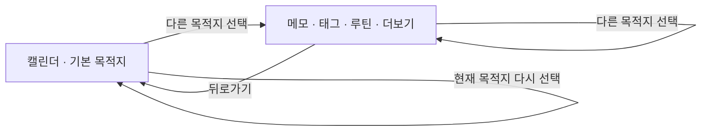

# TopLevelNavigation 스펙

이 문서는 주요 목적지의 구성, 선택, 전환과 노출 규칙을 다룬다. 각 목적지에서 이어지는 세부 화면과 행동은 해당 기능 스펙에서 다룬다.

디자인: [TopLevelNavigation 디자인](../design/top-level-navigation.md)

## feature

### 주요 목적지 이동

앱은 사용자가 주요 화면 사이를 이동할 수 있는 공통 내비게이션을 제공한다.

앱을 처음 실행하면 기본 목적지 화면을 표시한다.

사용자가 주요 목적지를 선택하면 해당 화면으로 이동하고 현재 목적지를 선택 상태로 갱신한다.

현재 목적지를 다시 선택하면 현재 화면을 유지한다.

다른 주요 목적지로 이동한 뒤 뒤로가면 기본 목적지로 돌아간다. 이전에 거쳤던 다른 주요 목적지를 순서대로 다시 표시하지 않는다.

### 더보기 하위 화면의 뒤로가기

사용자가 `더보기` 목적지의 메뉴에서 진입한 세부 화면에서 뒤로가기를 실행하면 이전 화면인 `더보기`로 돌아간다.

세부 화면 안에서 더 들어간 화면의 뒤로가기 결과는 그 화면 스펙이 정한다.

### 공통 내비게이션 노출

주요 목적지 화면에서는 공통 내비게이션을 제공한다.

주요 목적지 화면과 세부 화면을 함께 사용하는 동안에도 공통 내비게이션을 계속 제공한다.

주요 목적지 화면을 유지한 채 그 위에 겹쳐 표시하는 화면을 사용하는 동안에도 공통 내비게이션을 계속 제공한다.

세부 화면이나 별도 흐름을 단독으로 사용하면 공통 내비게이션을 제공하지 않는다.

세부 화면이나 별도 흐름에서 주요 목적지로 돌아오면 공통 내비게이션을 다시 제공하고 해당 목적지를 선택 상태로 표시한다.

## domain

### 주요 목적지와 순서

주요 목적지는 앱의 최상위 화면 이동 단위다.

주요 목적지는 다음 다섯 가지이며 선언된 순서를 유지한다.

1. `메모`
2. `태그`
3. `캘린더`
4. `루틴`
5. `더보기`

세부 화면이나 별도 흐름은 주요 목적지에 포함하지 않는다.

### 기본 목적지와 전환 이력

기본 목적지는 `캘린더`다.

다른 주요 목적지로 전환할 때 기존 주요 목적지 이력을 누적하지 않고 기본 목적지와 새로 선택한 목적지만 전환 이력에 유지한다.

기본 목적지를 선택하면 기본 목적지만 전환 이력에 유지한다.

현재 목적지를 다시 선택하면 전환 이력을 변경하지 않는다.

전환 이력에는 기본 목적지와 현재 목적지만 남으므로, 어떤 주요 목적지에서 뒤로가도 `캘린더`로 돌아간다.

시스템이 화면을 재생성하면 현재 주요 목적지와 전환 이력을 복원한다.

### 내비게이션 노출 기준

주요 목적지 화면을 단독으로 표시하거나 세부 화면과 함께 표시하는 동안 공통 내비게이션을 제공한다.

세부 화면이나 별도 흐름만 표시하면 가장 최근 주요 목적지를 유지하되 공통 내비게이션을 제공하지 않는다.

아래 화면을 닫거나 교체하지 않고 그 위에 겹쳐 표시하는 화면은 내비게이션 노출 판정에서 제외하고, 그 아래에 표시되는 화면을 기준으로 판정한다.
