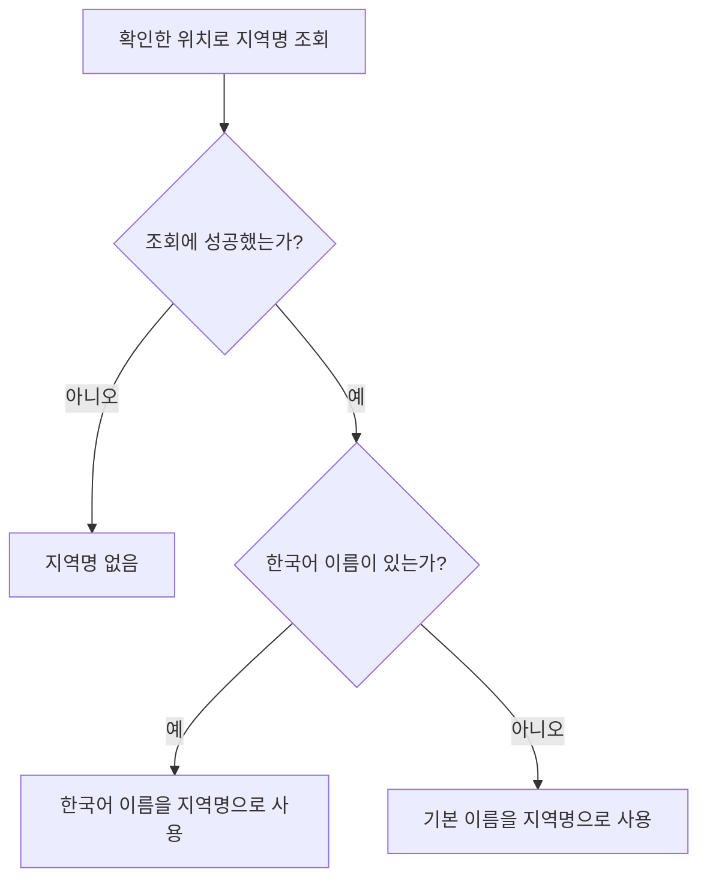
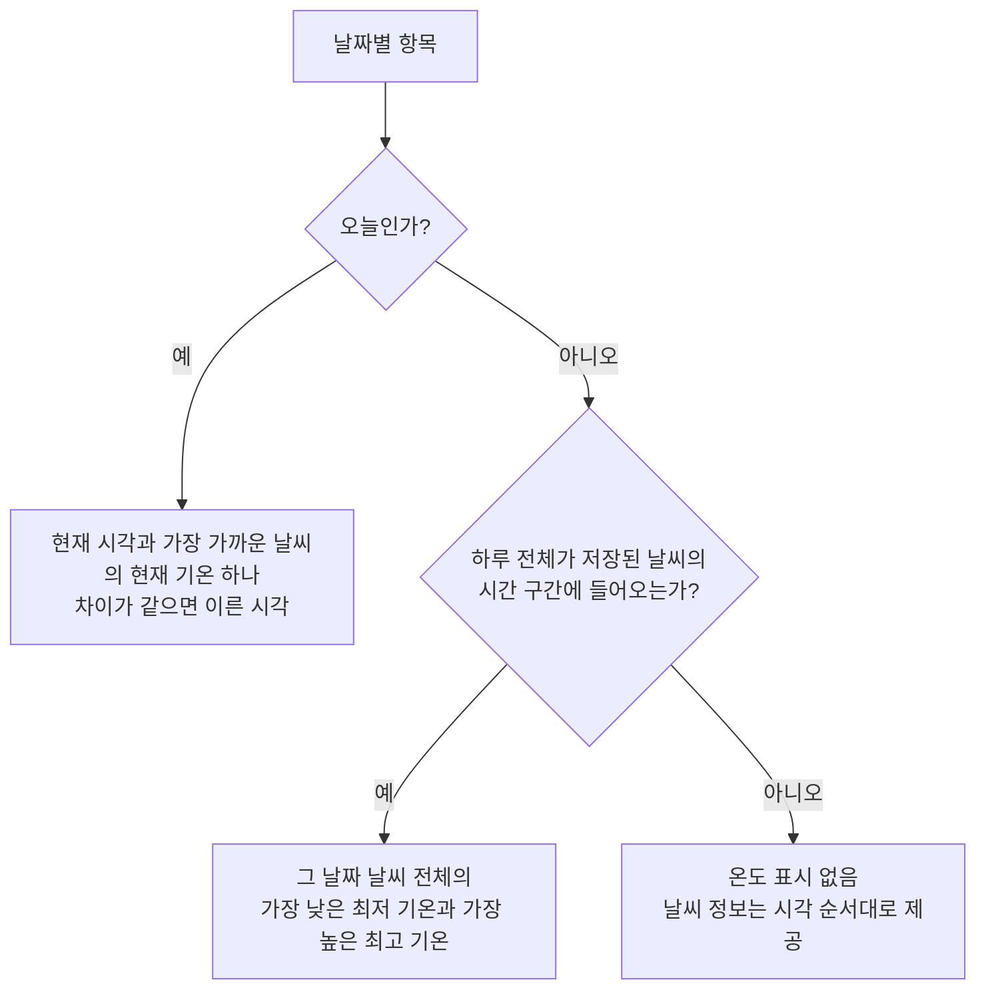
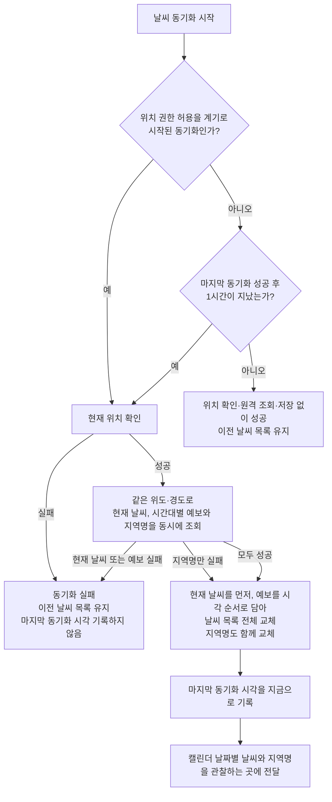

# 현재 날씨 동기화 스펙

이 문서는 현재 위치의 현재 날씨와 예보를 동기화하고, 캘린더에 날짜별로 전달할 날씨 정보와 현재 위치의 지역명을 만드는 규칙을 다룬다. 사용자에게 직접 노출되는 화면이나 사용자 행동은 없으므로 `feature` 영역은 생략하며, 캘린더 날짜 칸의 구체적인 표현은 [CalendarHome 디자인](../design/calendar-home.md)에서 별도로 다룬다. 위치 권한을 사용자에게 요청하는 흐름은 [위치 권한 요청 스펙](location-permission.md)에서 다룬다. 지역명을 검색어로 사용하는 흐름은 [CalendarHome 스펙](calendar-home.md)의 날씨 선택에서 다룬다.

## domain

### 날씨 조회 대상

날씨 동기화를 시작하면 사용자의 현재 위치 위도와 경도를 확인한다. 확인한 위치 하나를 현재 날씨, 시간대별 예보와 현재 위치 지역명의 조회 대상으로 함께 사용한다.

### 위치 확인

현재 위치는 [현재 위치 확인 스펙](./current-location.md)을 따라 확인한다. 날씨 조회에는 대략적인 위치로 충분하므로 그 규칙이 정한 정확도를 그대로 사용한다.

날씨는 사용자가 현재 있는 위치만 대상으로 하므로, 관측 시각과 예보 시각은 사용자의 현재 시간대로 해석한다.

위치를 확인한 뒤 현재 날씨, 시간대별 예보와 현재 위치 지역명을 동시에 조회한다.

### 현재 날씨

현재 날씨 하나는 다음 정보를 갖는다.

- 날씨 상태: 맑음, 구름, 비, 눈 같은 상태의 설명 문구와 그 상태를 그림으로 보여 줄 때 사용하는 아이콘 이미지 주소. 한 위치에 여러 상태가 함께 올 수 있으며 첫 번째 상태가 대표 상태다.
- 기온: 현재 기온, 최저 기온, 최고 기온.
- 관측 시각.

외부 응답에는 이 밖의 정보도 함께 오지만 제품에서 사용하지 않으므로 보관하지 않는다.

### 시간대별 예보

시간대별 예보는 요청 시점부터 약 5일 동안의 예보를 3시간 간격으로 제공한다. 그보다 먼 미래와 과거의 날씨는 제공하지 않는다.

예보는 요청 시점 이후의 3시간 구간을 정해진 개수만큼만 제공하므로, 예보가 닿는 마지막 날짜는 하루의 일부 시간대만 포함될 수 있다.

예보 항목 하나는 다음 정보를 갖는다.

- 예보 시각.
- 날씨 상태: 현재 날씨의 날씨 상태와 같은 구성이다.
- 기온: 예보 기온, 최저 기온, 최고 기온.

현재 날씨와 마찬가지로, 외부 응답에 함께 오는 그 밖의 정보는 보관하지 않는다.

### 현재 위치 지역명

날씨를 조회한 위치가 어느 지역인지 사람이 읽을 수 있는 이름 하나를 함께 확인한다. 이 이름은 사용자에게 날씨를 더 알아보게 할 때 지역을 가리키는 검색어로 쓴다.

지역명은 도로명이나 지번을 포함하는 상세 주소가 아니라 시·군 수준의 행정 구역 이름이다. 예를 들어 판교 일대의 좌표는 `성남시`로, 강릉 일대의 좌표는 `강릉시`로 확인된다.

지역명은 다음 기준으로 정한다.

한국어 이름이 있으면 한국어 이름을 사용한다. 한국어 이름이 없는 지역은 외부 서비스가 제공하는 기본 이름을 그대로 사용한다.

조회 결과로 여러 지역이 오면 첫 번째 지역의 이름을 사용한다.

지역명을 확인하지 못하면 지역명은 없는 상태로 둔다. 임의의 기본 지역명으로 대신하지 않는다.

지역명이 없을 때 사용자에게 무엇을 보여 줄지는 지역명을 사용하는 화면의 스펙에서 다룬다.

### 캘린더 날짜별 날씨

캘린더에 전달하는 날씨는 사용자의 현재 시간대를 기준으로 같은 날짜에 해당하는 현재 날씨와 시간대별 예보를 한 항목으로 묶는다.

날짜별 항목은 날짜가 이른 순서로 제공하고, 각 항목에는 해당 날짜에 속하는 현재 날씨와 시간대별 예보의 모든 정보를 시각 순서대로 제공한다. 같은 날에 현재 날씨와 예보가 함께 있으면 둘 다 포함한다.

각 날씨의 아이콘은 여러 날씨 상태 중 첫 번째인 대표 상태의 아이콘을 사용한다. 따라서 날짜별 항목에는 시각 순서대로 모든 날씨의 대표 상태 아이콘이 제공된다.

오늘은 캘린더 날짜별 날씨를 만드는 시점과 사용자의 현재 시간대를 기준으로 정한다.

날짜별 온도 표시는 다음 기준으로 정한다.

오늘 날짜의 온도 표시는 날짜별 날씨를 만드는 현재 시각과 관측 또는 예보 시각의 차이가 가장 작은 날씨의 현재 기온 하나를 사용한다. 차이가 같은 날씨가 여러 개면 시각이 이른 날씨를 사용한다.

오늘이 아닌 날짜의 온도 표시는 그 날짜 하루 전체가 저장된 날씨가 다루는 시간 구간에 들어온 경우에만 제공한다. 이때 온도 표시는 해당 날짜에 속한 날씨 정보 전체에서 가장 낮은 최저 기온과 가장 높은 최고 기온을 사용한다.

저장된 날씨가 다루는 시간 구간은 저장된 날씨와 함께 제공받으며, 구간을 정하는 기준은 `data`의 `저장된 날씨의 시간 구간`을 따른다. 사용자의 현재 시간대로 해석한 그 날짜의 시작부터 다음 날짜의 시작 직전까지가 이 구간에 모두 들어오면 하루 전체가 들어온 것으로 본다.

하루 전체가 들어오지 않은 날짜는 최저·최고 기온을 만들지 않고 온도 표시 없이 제공한다. 온도 표시가 없는 날짜에도 해당 날짜에 속한 날씨 정보는 시각 순서대로 그대로 제공한다.

오늘은 이 판단을 적용하지 않고 항상 현재 기온 하나를 온도 표시로 사용한다.

저장된 날씨가 없으면 캘린더에 전달할 날짜별 날씨도 빈 목록이다.

### 단위와 언어

기온은 섭씨를 사용한다.

날씨 상태의 설명 문구는 영어로 제공한다. 사용자의 언어와 관계없이 언제나 영어로 받으며, 언어를 고르는 수단은 두지 않는다.

지역명의 언어는 `현재 위치 지역명`을 따르며, 설명 문구의 언어가 지역명의 언어를 바꾸지 않는다. 지역명은 사용자가 지역을 다시 찾아볼 때의 검색어로 쓰이므로 그 지역에서 통하는 이름이어야 하고, 설명 문구는 날씨 상태를 가리키는 값이어서 서로 기준이 다르다.

### 인증

날씨 조회와 지역명 조회는 OpenWeatherMap이 발급한 같은 인증 정보가 있어야 수행된다. 인증 정보가 없거나 유효하지 않으면 조회는 실패한다.

### 동기화 간격

날씨는 짧은 시간 안에 크게 바뀌지 않으므로, 마지막으로 동기화에 성공한 시각에서 1시간이 지나야 다시 조회한다. 1시간이 되는 시각은 지난 것으로 본다. 아직 1시간에 닿지 않은 동안의 동기화 요청은 조회 없이 성공으로 끝나고 사용자는 이미 저장된 날씨를 그대로 본다.

한 번도 동기화에 성공하지 않았으면 조회한다.

동기화에 성공한 시각만 기록한다. 실패한 동기화는 기록하지 않으므로 다음 계기에 다시 조회한다.

마지막 동기화 시각은 앱 프로세스가 유지되는 동안만 보관한다. 앱 프로세스를 새로 시작하면 기록이 비워져 첫 동기화 계기에 다시 조회한다. 저장된 날씨 목록과 지역명도 함께 비워지므로 기록과 저장된 결과는 언제나 같은 실행 안에서 짝을 이룬다.

사용자가 위치 권한 요청에서 새로 허용한 계기의 동기화는 이 간격과 무관하게 항상 조회한다. 이 계기에서만 조회 대상 위치가 공인 IP 기준에서 디바이스 기준으로 바뀌므로, 마지막 동기화로부터 지난 시간과 관계없이 새 위치의 날씨를 받는다.

그 밖의 계기는 서로 구분하지 않는다. 화면 표시로 시작된 동기화와 사용자가 당겨 시작한 동기화 모두 같은 간격을 적용한다.

### 동기화 실패 보고

현재 날씨 동기화 실패는 오류 보고 대상이다. 보고 방식은 [UseCase 실패 로깅](./usecase-failure-logging.md)의 오류 보고를 따른다.

위치 확인, 현재 날씨 조회, 시간대별 예보 조회 중 무엇이 실패했는지는 보고에 담긴 실패 원인으로 구분한다.

간격 때문에 조회 없이 성공으로 끝난 동기화는 실패가 아니므로 오류 보고를 남기지 않는다.

지역명 조회만 실패한 동기화도 실패가 아니므로 오류 보고를 남기지 않는다.

## data

### 현재 날씨 동기화

날씨 동기화를 시작하면 먼저 `domain`의 `동기화 간격`에 따라 이번 요청이 조회할 요청인지 정한다. 조회하지 않는 요청은 현재 위치도 확인하지 않고 저장된 날씨를 그대로 둔 채 성공으로 끝낸다.

조회할 요청이면 위치 확인 정책에 따라 현재 위치를 확인한다.

위치 확인이 끝나면 같은 위도와 경도로 현재 날씨, 시간대별 예보와 지역명을 동시에 조회한다.

현재 날씨와 시간대별 예보가 모두 성공하면 현재 날씨 하나와 예보 항목 전체를 하나의 날씨 목록으로 저장한다. 목록에는 현재 날씨를 먼저 담고, 예보는 시각 순서대로 이어서 담는다.

원격 응답의 날씨 아이콘 식별자는 낮과 밤 구분을 Day 아이콘으로 통일한 뒤 OpenWeatherMap의 기본 `.png` 아이콘 전체 주소로 바꿔 날씨 목록에 저장한다. `@2x` 이미지 주소 변형은 사용하지 않는다.

지역명은 날씨 목록과 같은 시점에 함께 저장한다. 지역명 조회가 실패했으면 지역명 없음으로 저장한다. 날씨 목록을 교체할 때마다 지역명도 함께 교체하므로, 이전 동기화에서 확인한 지역명이 새 위치의 날씨와 함께 남지 않는다.

다시 동기화해 현재 날씨와 예보가 모두 성공하면 이전 날씨 목록과 지역명을 새 결과로 교체하고, 마지막 동기화 시각을 교체한 시점으로 다시 기록한다.

날씨 목록, 지역명과 마지막 동기화 시각은 앱 프로세스가 유지되는 동안만 보관한다. 앱 프로세스를 새로 시작하면 빈 목록, 지역명 없음과 기록 없음에서 시작한다.

저장된 날씨 목록이나 지역명이 바뀌면 이를 관찰하는 곳에도 별도 요청 없이 새 결과가 전달된다. 날씨 목록과 지역명은 한 동기화 결과로 함께 전달하므로, 새 날씨와 이전 지역명이 섞인 조합은 관찰되지 않는다.

### 저장된 날씨의 시간 구간

저장된 날씨가 다루는 시간 구간은 저장된 날씨 목록과 함께 제공한다.

구간은 가장 이른 날씨의 시각에서 시작해, 가장 늦은 날씨의 시각에 예보 간격을 더한 시각 직전까지다. 예보 간격은 `domain`의 `시간대별 예보`가 정한 3시간이다.

저장된 날씨가 없으면 제공할 구간도 없다.

### 실패 처리

디바이스에서 위치를 확인하지 못한 것은 동기화 실패가 아니며, [현재 위치 확인 스펙](./current-location.md)에 따라 공인 IP 기준 위치 확인으로 이어진다.

현재 위치 확인, 현재 날씨 조회, 시간대별 예보 조회 중 하나라도 실패하면 동기화 실패를 그대로 알린다. 실패를 기본값 같은 정상 결과로 바꾸지 않는다. 현재 위치를 확인하지 못한 것을 날씨 동기화에서는 실패로 다룬다.

지역명 조회 실패는 동기화 실패로 다루지 않는다. 지역명은 날씨를 보여 주기 위한 필수 정보가 아니므로, 현재 날씨와 시간대별 예보가 성공했으면 지역명 없음으로 저장하고 동기화는 성공으로 끝낸다. 사용자는 지역명이 없어도 캘린더에서 날씨를 그대로 본다.

실패한 동기화에서는 날씨 목록과 지역명을 일부 결과로 갱신하지 않는다. 이전에 성공해 저장된 날씨 목록과 지역명이 있으면 그대로 유지한다.

실패한 동기화는 마지막 동기화 시각도 기록하지 않는다. 이전에 기록한 시각이 있으면 그대로 유지하므로, 실패는 다음 동기화 요청이 조회할 시점을 앞당기지도 미루지도 않는다.

실패를 어떻게 사용자에게 보여줄지는 날씨를 사용하는 화면의 스펙에서 다룬다.

## 참고

- [OpenWeatherMap Current weather data](https://openweathermap.org/current)
- [OpenWeatherMap 5 day / 3 hour forecast](https://openweathermap.org/forecast5)
- [OpenWeatherMap Weather Conditions](https://openweathermap.org/api/weather-conditions)
- [OpenWeatherMap Geocoding API](https://openweathermap.org/api/geocoding-api)
