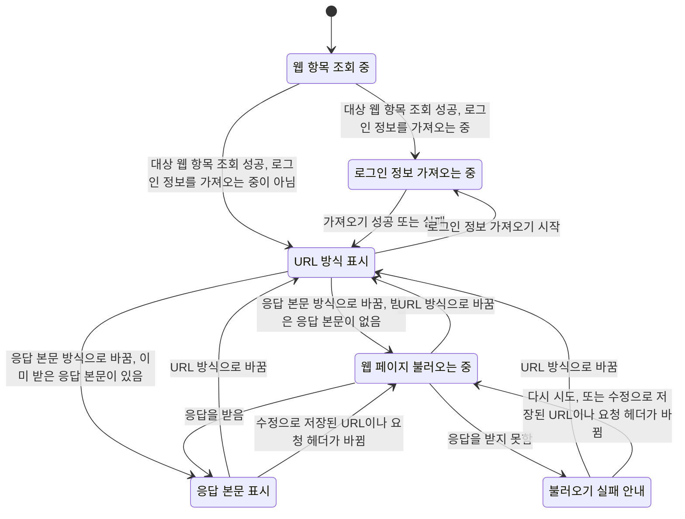
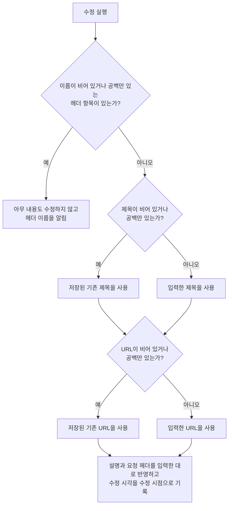

# WebDetail 화면 스펙

이 문서는 사용자가 선택한 웹 항목의 상세를 확인하고 제목, 설명, URL과 요청 헤더를 수정하고, 그 웹 항목이 연결한 태그를 바꾸고, 그 웹 항목의 저장된 URL의 웹 페이지를 고른 표시 방식으로 보고, 그 웹 항목을 앱 밖에서 열거나 삭제하는 WebDetail 화면의 내용과 행동을 다룬다. WebDetail로 진입하는 흐름과 삭제한 웹 항목이 목록에서 사라지는 것은 [WebHome 화면 스펙](./web-home.md), [SearchHome 화면 스펙](./search-home.md), [TagDetail 웹 탭 스펙](./tag-detail-web.md)과 [메모 웹 입력 컴포넌트 스펙](./memo-web-input.md)에서, 웹 항목이 갖는 정보와 요청 헤더의 규칙은 [WebAdd 화면 스펙](./web-add.md)에서, 설명 입력의 행동은 [설명 입력 컴포넌트 스펙](./description-input.md)에서, 대상 웹 항목을 정하는 계정 기준은 [계정 조회 스펙](./account.md)에서, 웹 항목을 서버와 맞추는 규칙은 [데이터 동기화 스펙](./data-sync.md)에서, 이 기기의 Chrome 로그인 정보를 언제 가져오고 지우는지의 규칙은 [Chrome 로그인 이어받기 스펙](./chrome-session-import.md)에서 다룬다.

연결할 태그의 선택과 해제, 선택 목록의 행동과 정책은 [항목 태그 입력 컴포넌트 스펙](./entity-tag-input.md)을 따르고, 웹 항목과 태그의 연결 규칙은 [웹 태그 스펙](./web-tag.md)을 따른다. 이 문서에서는 WebDetail 화면에서만 다른 표시 기준과 반영 시점을 다룬다.

이번 범위는 웹 목록과 웹 결과에서 웹 항목을 선택해 상세로 이동하고, 저장된 제목·설명·URL·요청 헤더를 확인하고 수정하고, 연결한 태그를 확인하고 바꾸고, 저장된 URL의 웹 페이지를 두 가지 표시 방식 중 하나로 보고, 표시 방식을 바꾸고, 응답 본문 방식에서 불러오지 못했을 때 다시 시도하고, 웹 항목을 앱 밖에서 열거나 삭제하고, 이 웹 항목에 연결된 메모를 확인하는 것까지다.

이 문서는 화면 전체와 웹 정보 수정, 웹 페이지 표시를 소유하고, 메모 탭의 내용과 행동은 [WebDetail 메모 탭 스펙](./web-detail-memo.md)이 소유한다.

WebDetail은 목록과 함께 배치하지 않고 언제나 단독 화면으로 사용한다. 웹 목록과 WebAdd를 함께 사용하는 배치와 그 배치에서 웹 상세로 이동하는 결과는 [Web 목록·상세 배치 스펙](./web-list-detail.md)에서 다룬다.

진입할 때의 입력 초점, 내용 수정의 반영과 성공 결과, 태그 입력의 반영, 요청 제한과 저장 계약은 [항목 상세 화면 공통 스펙](./entity-detail.md)을 따른다.

디자인: [WebDetail 화면 디자인](../design/web-detail.md)

## feature

### 진입과 내용

사용자는 WebHome 화면의 웹 목록에서 웹 항목을 선택해 그 웹 항목의 WebDetail 화면으로 이동한다. [SearchHome 화면](./search-home.md)의 웹 결과와 [TagDetail 웹 탭](./tag-detail-web.md)의 태그별 웹 목록에서 웹 항목을 선택해서도 이동하며, MemoAdd 화면과 MemoDetail 화면의 웹 입력에 표시된 웹 항목을 눌러서도 이동한다. 그 경로의 기준은 [메모 웹 입력 컴포넌트 스펙](./memo-web-input.md)의 `웹 상세 이동`을 따른다.

어느 경로로 들어와도 WebDetail에서 확인하는 내용과 할 수 있는 일은 같다. 사용자가 들어온 경로는 뒤로갈 때와 삭제한 뒤에 돌아가는 화면만 정한다.

웹 항목 조회에 성공하면 사용자는 저장된 제목, 설명, URL과 요청 헤더를 확인하고 수정할 수 있으며, 이 웹 항목이 연결한 태그를 확인하고 바꿀 수 있고, 저장된 URL의 웹 페이지를 함께 본다. 웹 페이지를 어떤 방식으로 표시할지는 `웹 페이지 표시 방식`을 따른다. 사용자는 그 웹 항목을 앱 밖에서 열거나 삭제할 수 있다.

### 메모 탭

화면은 웹 정보 수정과 웹 페이지 표시에 더해 이 웹 항목에 연결된 메모를 확인하는 메모 탭을 제공한다. 메모 탭의 내용과 행동은 [WebDetail 메모 탭 스펙](./web-detail-memo.md)을 따른다.

웹 정보 수정과 메모 탭은 같은 자리를 나눠 쓰므로 동시에 표시하지 않는다. 사용자는 탭을 직접 선택해 웹 정보 수정과 메모 탭을 오간다. 웹 페이지를 메모 탭과 함께 표시하는지는 창 너비에 따라 다르며 그 배치는 [WebDetail 화면 디자인](../design/web-detail.md)이 정한다.

화면에 처음 진입하면 메모 탭은 선택되어 있지 않다.

웹 항목 조회 중에도 사용자는 메모 탭을 선택할 수 있다. 조회 결과가 탭 선택을 막지 않는다.

탭을 전환해도 다른 탭에서 하던 일은 사라지지 않는다. 수정 중이던 제목, 설명, URL과 요청 헤더는 메모 탭에 다녀와도 그대로 남아 있고, 이미 표시하고 있던 웹 페이지와 불러오기 상태, 고른 표시 방식도 유지하며, 메모 탭에서 보던 목록 위치도 다른 탭에 다녀오면 그대로 유지된다.

외부로 열기와 삭제는 선택한 탭과 관계없이 항상 실행할 수 있다.

### 조회 상태

처음에는 웹 항목 조회 중 상태를 제공하며 웹 페이지를 표시하지 않고, 표시 방식 변경, 내용 수정, 태그 연결과 해제, 외부로 열기와 삭제도 실행할 수 없다.

조회에 성공하면 내용 표시 상태로 바뀐다. 웹 항목을 조회할 수 없거나 조회에 실패하면 조회 중 상태를 유지하며, 별도의 오류 안내는 제공하지 않는다.

조회 상태는 웹 정보 수정, 웹 페이지 표시, 화면 제목, 외부로 열기와 삭제에만 적용한다. 메모 탭의 표시 기준은 [WebDetail 메모 탭 스펙](./web-detail-memo.md)을 따르므로 웹 항목을 아직 조회하지 못했어도 메모 목록은 그대로 표시한다.

### 내용 수정

사용자는 제목, 설명, URL과 요청 헤더를 입력하거나 바꿀 수 있다. 제목과 URL은 각각 한 줄 분량을 입력할 수 있다.

사용자가 입력한 제목, 설명, URL 또는 요청 헤더가 저장된 내용과 하나라도 다를 때만 수정 반영 동작을 제공한다. 입력한 내용이 저장된 내용과 같으면 수정 동작을 제공하지 않는다.

수정 시점에 제목이 비어 있거나 공백만 있으면 저장된 기존 제목을 유지하고, URL이 비어 있거나 공백만 있으면 저장된 기존 URL을 유지한 채 나머지 내용만 반영한다.

수정에 실패하면 화면과 입력 내용을 유지하며 진행 상태만 해제한다. 사용자는 수정을 다시 실행할 수 있다.

### 태그 입력

반영 시점과 다른 동작과의 관계는 [항목 상세 화면 공통 스펙](./entity-detail.md)의 `태그 입력`을 따른다. 태그 선택 목록에서의 연결과 해제는 [항목 태그 입력 컴포넌트 스펙](./entity-tag-input.md)을, 태그 입력의 구성과 표현은 [항목 태그 입력 컴포넌트 디자인](../design/entity-tag-input.md)을 따른다.

태그를 연결하거나 해제해도 보고 있던 웹 페이지를 다시 불러오지 않는다. 다시 불러오는 계기는 `불러오기 시점`을 따른다.

### 요청 헤더 입력

사용자가 요청 헤더 항목을 추가하고 삭제하고 이름과 값을 입력하는 행동은 [WebAdd 화면 스펙](./web-add.md)의 `요청 헤더 입력`을 따른다.

화면에 처음 들어오면 저장된 요청 헤더가 저장된 순서대로 헤더 항목에 채워진다. 저장된 요청 헤더가 하나도 없으면 헤더 항목이 하나도 없는 상태로 시작한다.

### 헤더 이름 미입력

이름이 비어 있거나 공백만 있는 헤더 항목이 하나라도 있는 상태에서 수정을 실행하면 아무 내용도 수정하지 않고 헤더 이름 입력이 필요하다는 피드백을 제공한다.

입력 중이던 제목, 설명, URL과 헤더 항목은 모두 그대로 유지하므로 사용자는 헤더 이름을 입력하거나 그 헤더 항목을 삭제한 뒤 다시 시도할 수 있다.

이름이 비어 있는 헤더 항목은 여러 개일 수 있고 사용자가 이름을 채우는 대신 그 항목을 삭제할 수도 있으므로, 입력 초점은 옮기지 않고 사용자가 보고 있던 입력에 그대로 둔다.

### 웹 페이지 표시 방식

사용자는 웹 페이지를 어떤 방식으로 표시할지 두 가지 중에서 고른다.

- URL 방식: 저장된 URL을 웹 표시 수단에 넘겨 웹 표시 수단이 직접 그 주소를 열게 한다. 저장된 요청 헤더는 이 요청에 적용되지 않는다.
- 응답 본문 방식: 앱이 저장된 URL과 요청 헤더로 웹 페이지를 불러와 받은 응답 본문을 표시한다.

어느 방식이든 웹 페이지 안의 스크립트를 실행해 문서가 의도한 결과를 그대로 표시한다.

내용 표시 상태가 되면 URL 방식으로 시작한다. 사용자는 현재 표시 방식을 화면에서 확인하고, 표시 방식 선택 목록을 열어 다른 방식으로 바꿀 수 있다. 선택 목록에서는 두 방식 중 어느 것이 현재 방식인지 알 수 있고, URL 방식에는 저장한 요청 헤더가 적용되지 않는다는 안내가 함께 표시된다.

사용자가 방식을 고르면 선택 목록이 닫히고 웹 페이지 자리가 곧바로 그 방식의 표시로 바뀐다. 현재 방식과 같은 방식을 고르면 표시가 바뀌지 않는다. 사용자는 선택 목록을 닫아 방식을 바꾸지 않고 빠져나올 수도 있다.

표시 방식은 사용자가 이 화면에서 고르는 것이므로 다른 웹 항목의 상세나 다른 화면의 표시 방식을 바꾸지 않는다.

표시 방식과 관계없이 사용자는 제목, 설명, URL과 요청 헤더를 확인하고 수정하고, 태그를 바꾸고, 외부로 열고, 삭제하고, 뒤로갈 수 있다.

### URL 방식의 표시

URL 방식에서는 웹 표시 수단이 저장된 URL을 직접 열어 그 결과를 표시한다. 사용자는 그 안에서 문서를 훑어보고 스크롤하고 문서 안의 링크를 누를 수 있다.

앱이 요청을 보내지 않으므로 앱은 이 방식에서 불러오는 중 상태나 불러오기 실패 안내를 제공하지 않고 다시 시도도 제공하지 않는다. 주소를 열지 못했을 때 무엇을 보여 줄지는 웹 표시 수단이 정한다.

### 로그인 정보 가져오기

이 기기의 Chrome 로그인 정보는 이 화면이 아니라 [Chrome 로그인 이어받기 스펙](./chrome-session-import.md)의 `가져오는 계기`에 따라 앱이 가져온다. 이 화면은 그 스펙의 `가져오는 상태`를 보고 URL 방식의 웹 표시 수단을 언제 열지와 실패를 언제 알릴지만 정한다.

URL 방식에서 로그인 정보를 가져오는 중이면 웹 페이지 자리에 진행 상태를 표시하고 웹 표시 수단을 두지 않는다. 화면에 들어올 때 이미 가져오는 중이어도, 웹 표시 수단이 주소를 연 뒤에 가져오기가 시작되어도 같다. 가져오기가 끝나면 웹 표시 수단이 저장된 URL을 연다. 이미 열었던 주소라도 새로 가져온 로그인 정보로 다시 열며, 사용자가 웹 페이지 안에서 이동해 있던 위치와 입력하던 내용은 유지하지 않는다.

가져오기가 실패로 끝나면 가져오지 못했다는 피드백을 한 번 제공하고, 웹 표시 수단은 남아 있는 로그인 정보로 주소를 그대로 연다. 화면에 들어왔을 때 마지막 가져오기 결과가 이미 실패였으면 그때 한 번 알린다. 다시 시도는 따로 제공하지 않는다.

가져오는 동안에도 사용자는 제목, 설명, URL과 요청 헤더를 확인하고 수정하고, 태그를 바꾸고, 표시 방식을 바꾸고, 외부로 열고, 삭제하고, 뒤로갈 수 있다.

가져오는 중이 아니면 웹 표시 수단이 곧바로 주소를 연다. 프로필을 고르지 않았거나 제공하지 않는 환경에서는 가져오기가 일어나지 않으므로 언제나 곧바로 연다.

### 웹 페이지 불러오기

응답 본문 방식이 되면 저장된 URL과 요청 헤더로 웹 페이지를 불러온다. 불러오는 동안에는 웹 페이지 자리에 진행 상태를 표시한다.

불러오기에 성공하면 받은 웹 페이지를 웹 페이지 자리에 표시한다. 사용자는 그 안에서 문서를 훑어보고 스크롤할 수 있다.

불러오는 동안에도 사용자는 제목, 설명, URL과 요청 헤더를 확인하고 수정하고, 표시 방식을 바꾸고, 뒤로갈 수 있다.

사용자가 불러오는 도중에 URL 방식으로 바꾸면 웹 페이지 자리는 곧바로 URL 방식의 표시로 바뀐다. 응답 본문 방식으로 다시 돌아왔을 때 이미 받은 응답 본문이 있으면 그 응답 본문을 그대로 다시 보여 주고 다시 불러오지 않는다.

### 수정 뒤의 웹 페이지

사용자가 수정을 실행해 저장된 URL이 바뀌면 URL 방식에서는 새로 저장된 URL을 웹 표시 수단이 다시 연다. 저장된 URL이 바뀌는 것은 로그인 정보를 가져오는 계기가 아니므로 로그인 정보를 새로 가져오지 않는다. 저장된 요청 헤더만 바뀌었으면 URL 방식의 표시는 바뀌지 않는다.

응답 본문 방식에서는 저장된 URL이나 요청 헤더가 바뀌면 새로 저장된 URL과 요청 헤더로 웹 페이지를 다시 불러온다. 사용자가 다시 시도를 따로 실행하지 않아도 바뀐 내용의 결과를 그 자리에서 확인한다.

제목이나 설명만 바뀌었으면 어느 방식에서도 웹 페이지를 다시 표시하지 않고 보고 있던 웹 페이지를 그대로 둔다.

### 불러오기 실패

응답 본문 방식에서 웹 페이지를 불러오지 못하면 웹 페이지 자리에 불러오지 못했다는 안내를 표시하고 다시 시도할 수 있게 한다.

불러오기에 실패해도 제목, 설명, URL과 요청 헤더는 그대로 확인하고 수정할 수 있고, 표시 방식도 그대로 바꿀 수 있다.

### 다시 시도

사용자는 응답 본문 방식에서 다시 시도를 실행해 저장된 URL과 요청 헤더로 웹 페이지를 다시 불러올 수 있다. 처리 중에는 진행 상태를 표시하며, 성공하면 받은 웹 페이지를 표시한다.

다시 시도해도 실패하면 다시 안내를 표시하며, 사용자는 횟수 제한 없이 다시 시도할 수 있다.

### 외부로 열기

사용자는 이 웹 항목을 앱 밖에서 열 수 있다. 실행하면 저장된 URL이 기기가 웹 주소를 여는 방법으로 앱 밖에서 열린다.

앱 밖에서 열어도 WebDetail 화면은 보고 있던 상태를 그대로 유지한다. 사용자가 앱으로 돌아오면 표시하던 웹 항목 정보와 웹 페이지를 그대로 이어서 본다.

앱 밖에서 열지 못해도 화면은 그대로 유지하고 사용자에게 별도로 알리지 않는다.

### 삭제

사용자는 이 웹 항목을 삭제할 수 있다. 삭제를 실행하기 전에 확인을 되묻지 않는다.

삭제를 처리하는 동안에는 진행 상태를 표시한다. 처리 중에도 사용자는 웹 항목 정보를 확인하고 수정과 표시 방식 변경과 외부로 열기와 뒤로가기를 그대로 실행할 수 있다.

삭제에 성공하면 뒤로가기와 같은 결과로 WebDetail 화면에서 빠져나가 진입하기 전 화면으로 돌아가고, 삭제한 웹 항목은 그 화면에서 사라진다. 삭제한 웹 항목에서 수정 중이던 내용은 유지하지 않는다.

삭제에 실패하면 화면에 머무르며 진행 상태만 해제한다. 사용자는 삭제를 다시 실행할 수 있다.

### 진행 상태 유지

화면이 회전하거나 시스템에 의해 재생성되어도 입력 중이던 제목, 설명, URL과 헤더 항목의 이름·값·순서, 그리고 선택한 탭을 유지한다.

화면이 회전하거나 시스템에 의해 재생성되어도 고른 표시 방식을 유지하고, 이미 표시하고 있던 웹 페이지와 불러오기 상태도 유지하며 웹 페이지를 다시 불러오지 않는다. 화면의 재생성은 로그인 정보를 가져오는 계기가 아니며, 이미 알린 가져오기 실패를 다시 알리지 않는다.

화면을 떠난 뒤 다시 들어오거나 앱을 종료한 뒤 새로 진입하면 수정 중이던 내용을 복원하지 않고 저장된 내용으로 다시 시작하고, 표시 방식도 복원하지 않고 `웹 페이지 표시 방식`이 정한 처음 방식으로 다시 시작하며, 이전에 받은 웹 페이지도 복원하지 않는다. 화면에 들어오는 것은 로그인 정보를 가져오는 계기가 아니며, 들어왔을 때의 가져오는 상태에 따라 `로그인 정보 가져오기`대로 동작한다.

### 뒤로가기

사용자가 뒤로가면 선택한 탭과 관계없이 WebDetail 화면에 진입하기 전 화면으로 돌아간다. 메모 탭을 선택한 상태에서 뒤로간다고 웹 정보 수정으로 먼저 돌아가지 않는다. WebHome에서 들어왔으면 WebHome으로, SearchHome에서 들어왔으면 SearchHome으로, TagDetail 웹 탭에서 들어왔으면 웹 탭이 선택된 같은 태그의 TagDetail 화면으로 돌아간다. 반영하지 않은 수정 내용은 저장되지 않으며, 이미 반영된 태그 연결과 해제는 그대로 남는다.

돌아간 화면은 사용자가 상세로 떠나기 전 상태를 그대로 유지한다. SearchHome으로 돌아갈 때 유지하는 것은 [SearchHome 화면 스펙](./search-home.md)의 `상세로 이동`을 따른다.

## domain

### 화면 상태 전이

웹 항목 조회 중 상태에서는 어느 방식으로도 웹 페이지를 표시하지 않고 웹 페이지를 불러오지도 않는다. 대상 웹 항목을 조회하지 못하는 동안에는 웹 항목 조회 중 상태에 머무른다.

로그인 정보 가져오는 중 상태는 [Chrome 로그인 이어받기 스펙](./chrome-session-import.md)의 `가져오는 상태`가 `가져오는 중`인 동안 URL 방식에서 거치는 상태다. 이 상태에서는 웹 표시 수단을 두지 않으며, 가져오기가 성공하든 실패하든 URL 방식 표시로 넘어가 웹 표시 수단이 저장된 URL을 연다. 응답 본문 방식에 있는 동안 가져오기가 시작되어도 응답 본문 표시는 바뀌지 않으며, 그 뒤 사용자가 URL 방식으로 바꿀 때 아직 가져오는 중이면 이 상태를 거친 뒤 URL 방식 표시로 넘어간다. 가져오기가 일어나지 않는 환경에서는 이 상태를 거치지 않는다.

URL 방식 표시 상태에서는 앱이 웹 페이지를 불러오지 않으므로 불러오는 중, 응답 본문 표시, 불러오기 실패 안내 중 어느 것도 이 상태를 대신하지 않는다. 이 상태에서 무엇이 보이는지는 웹 표시 수단이 정한다.

응답 본문 표시 상태에서는 다시 시도를 제공하지 않는다. 이 상태에서 다시 불러오는 계기는 사용자가 실행한 수정으로 저장된 URL이나 요청 헤더가 바뀐 것뿐이다.

응답 본문 방식에서 URL 방식으로 바꾸어도 이미 받은 응답 본문은 버리지 않으며, 응답 본문 방식으로 돌아오면 그 응답 본문을 다시 표시한다. 불러오는 중에 URL 방식으로 바꾸면 진행 중이던 불러오기는 그대로 두고, 응답을 받으면 그 결과를 응답 본문 방식으로 돌아왔을 때 보여 준다.

내용 수정과 표시 방식 변경은 화면 상태를 웹 항목 조회 중으로 되돌리지 않는다.

### 선택한 탭

선택한 탭은 화면 표시 상태이며 저장되는 사용자 데이터가 아니다.

화면 재생성과 백그라운드 복귀 후에도 선택한 탭을 유지한다.

사용자가 화면을 떠났다가 다시 진입하거나 앱을 종료하고 다시 실행하면 메모 탭이 선택되지 않은 상태로 초기화한다.

웹 항목의 삭제 여부는 선택할 수 있는 탭을 바꾸지 않는다. 삭제 상태인 웹 항목의 WebDetail 화면에서도 메모 탭을 사용할 수 있다.

### 표시 방식의 기본값과 유지

표시 방식의 기본값은 URL 방식이다. 사용자가 저장한 주소를 실제 브라우저와 같은 방법으로 먼저 보게 하고, 요청 헤더를 적용한 결과는 사용자가 필요할 때 고르게 한다.

표시 방식은 이 화면에서 사용자가 고른 값으로만 바뀌며, 저장된 웹 항목의 내용이나 다른 화면의 상태는 표시 방식을 바꾸지 않는다.

표시 방식은 화면 재생성과 백그라운드 복귀 뒤에도 유지하고, 화면을 떠나거나 앱을 종료하면 유지하지 않는다. 다시 진입하면 기본값으로 시작한다. 표시 방식은 저장된 값이 아니라 사용자가 이번에 보는 방법을 고른 것이므로 다른 웹 항목이나 다음 진입으로 이어지지 않는다.

### 상세 대상

상세 대상을 정하는 계정 기준은 [항목 상세 화면 공통 스펙](./entity-detail.md)의 `대상 조회`를 따른다.

삭제 여부는 상세 대상을 정하는 기준이 아니다. 삭제 상태인 웹 항목도 상세 대상으로 조회하며, 대상 웹 항목이 삭제 상태로 바뀌어도 화면은 내용 표시 상태를 유지한다. 사용자가 수정 중인 내용을 배경에서 진행되는 동기화가 치우지 않게 하기 위한 것이며, 이때의 화면 동작은 `외부 변경`을 따른다.

사용자가 이 화면에서 삭제를 실행했을 때는 `feature`의 `삭제`에 따라 화면을 떠나므로 이 규칙이 적용되지 않는다.

수정은 삭제 여부를 바꾸지 않으므로, 삭제 상태가 된 웹 항목을 이 화면에서 수정해도 그 웹 항목은 삭제 상태로 남는다.

### 입력 내용 채우기

입력 내용은 대상 웹 항목을 처음 조회한 값으로 한 번만 채운다. 같은 웹 항목의 저장 내용이 바뀌어도 다시 채우지 않는다.

요청 헤더는 저장된 순서 그대로 모두 채우며, 이름이 같은 헤더가 여러 개 있어도 하나로 합치지 않고 각각의 헤더 항목으로 채운다.

설명이 비어 있으면 빈 설명으로, 요청 헤더가 하나도 없으면 헤더 항목이 없는 상태로 채운다.

웹 항목이 갖는 정보의 정의는 [WebAdd 화면 스펙](./web-add.md)의 `웹 항목의 정보`를, 요청 헤더의 규칙은 같은 문서의 `요청 헤더`를 따른다.

### 수정 성립 조건

웹 항목은 이름이 없는 요청 헤더를 가질 수 없다. 이름이 비어 있거나 공백 문자로만 이루어진 헤더 항목이 하나라도 있으면 제목, 설명, URL을 포함해 어떤 내용도 수정하지 않는다. 이름이 없는 헤더 항목을 조용히 빼고 수정하지 않으며, 사용자가 입력한 헤더가 그대로 기록되지 않는 상태를 만들지 않는다.

제목과 URL은 웹 항목이 반드시 가져야 하는 정보이므로 비우는 수정을 허용하지 않고 저장된 기존 값을 사용한다. 제목이나 URL을 비운 것은 기존 값을 사용하는 것이므로 수정을 막지 않는다.

설명은 비어 있으면 빈 설명으로, 요청 헤더는 하나도 없으면 빈 목록으로 반영한다.

이번 범위에서는 URL이 주소 형식을 만족하는지, 헤더의 이름과 값이 특정 형식을 만족하는지 검사하지 않는다.

### 태그 입력에 표시하는 태그

기준은 [항목 상세 화면 공통 스펙](./entity-detail.md)의 `태그 입력에 표시하는 태그`를 따르며, 어떤 태그가 조회되는지는 [항목 태그 연결 공통 스펙](./entity-tag.md)의 `연결된 태그의 조회`를 따른다.

### 태그 연결의 반영

기준은 [항목 상세 화면 공통 스펙](./entity-detail.md)의 `태그 연결의 반영`을 따른다. 연결과 해제는 수정 중이던 입력 내용과 보고 있던 웹 페이지도 바꾸지 않는다.

### 수정되는 내용

수정은 대상 웹 항목의 제목, 설명, URL과 요청 헤더를 바꾸고 수정 시각을 수정 시점으로 기록한다.

요청 헤더는 사용자가 배치한 순서대로 모두 반영하며, 이름이 같은 헤더가 여러 개 있어도 하나로 합치거나 뒤의 것으로 덮어쓰지 않는다.

### 수정 동작의 제공 기준

입력한 제목, 설명, URL 또는 요청 헤더가 저장된 내용과 하나라도 다르면 수정 동작을 제공한다. 태그 연결을 기준에 넣지 않는 규칙은 [항목 상세 화면 공통 스펙](./entity-detail.md)의 `수정 동작의 제공 기준`을 따른다.

요청 헤더는 이름, 값, 순서 중 하나라도 저장된 내용과 다르면 다른 것으로 본다. 헤더 항목의 개수가 다른 경우도 다른 것으로 본다.

### 외부 변경

화면이 열려 있는 동안 같은 웹 항목의 저장 내용이 다른 경로에서 바뀌면 화면 제목을 최신 저장 제목으로 갱신한다. 입력 중인 제목, 설명, URL과 요청 헤더는 덮어쓰지 않는다.

화면이 열려 있는 동안 같은 웹 항목의 태그 연결이 다른 경로에서 바뀌면 태그 입력에 최신 연결을 반영한다.

이미 표시하고 있던 웹 페이지는 다른 경로에서 저장 내용이 바뀌어도 다시 표시하지 않는다. URL 방식에서 저장된 URL이 다른 경로에서 바뀌어도 웹 표시 수단이 열고 있던 주소를 바꾸지 않고, 응답 본문 방식에서도 다시 불러오지 않는다. 사용자가 보고 있던 웹 페이지를 배경 변경이 치우지 않게 하기 위한 것이며, 사용자는 응답 본문 방식에서 다시 시도를 실행해 바뀐 URL과 요청 헤더로 다시 불러올 수 있다.

다시 표시하는 계기는 사용자가 이 화면에서 실행한 수정, 다시 시도와 표시 방식 변경뿐이며, 이는 사용자가 스스로 일으킨 변화의 결과만 그 자리에서 보여 주기 위한 것이다.

### 표시 대상

어느 방식에서든 표시 대상은 대상 웹 항목의 저장된 URL이다. 사용자가 입력만 하고 반영하지 않은 내용은 표시에 쓰지 않는다.

URL 방식에서는 저장된 URL만 웹 표시 수단에 넘기고 저장된 요청 헤더는 넘기지 않는다. 앱이 요청을 만들지 않으므로 그 요청에 요청 헤더를 붙일 수 없기 때문이다.

### 불러오기 대상

응답 본문 방식에서 웹 페이지는 대상 웹 항목의 저장된 URL로 불러오고, 저장된 요청 헤더를 함께 보낸다. 사용자가 입력만 하고 반영하지 않은 내용은 불러오기에 쓰지 않는다.

요청 헤더는 저장된 순서대로 모두 보내며, 이름이 같은 헤더가 여러 개 있어도 하나로 합치거나 뒤의 것으로 덮어쓰지 않는다.

### 불러오기 결과 판정

응답을 받았으면 응답의 상태 코드와 관계없이 불러오기 성공으로 다룬다. 요청한 주소가 없거나 서버가 오류를 알리는 응답을 보냈어도 그 응답 본문을 그대로 표시하며, 앱이 따로 오류 안내로 바꾸지 않는다. 사용자가 어떤 요청 헤더로 무엇이 돌아오는지 확인하는 것이 이 화면의 목적이기 때문이다.

응답을 받지 못했으면 불러오기 실패로 다룬다.

### 표시하는 웹 페이지

URL 방식에서 무엇을 표시할지는 웹 표시 수단이 저장된 URL을 열어 얻은 결과가 정하며, 앱은 그 결과를 바꾸지 않는다. 이 방식에서 일어나는 모든 요청에는 대상 웹 항목의 요청 헤더를 붙이지 않는다.

응답 본문 방식에서 받은 응답 본문은 앱이 내용을 바꾸지 않고 그대로 표시한다.

응답 본문 안의 상대 경로는 요청한 URL을 기준 주소로 삼아 해석한다. 응답 본문을 표시하는 동안 일어나는 리소스 요청과 사용자가 문서 안에서 이동한 결과의 요청에는 대상 웹 항목의 요청 헤더를 붙이지 않는다. 요청 헤더는 사용자가 상세에서 확인하는 요청 한 번에만 적용한다.

응답 본문 안의 스크립트는 실행한다. 사용자가 저장한 주소와 요청 헤더로 무엇이 돌아오는지 확인하는 것이 이 화면의 목적이므로, 문서가 스크립트로 그리거나 바꾸는 내용도 실행 결과 그대로 표시한다. 스크립트가 일으키는 요청에도 대상 웹 항목의 요청 헤더를 붙이지 않는다.

스크립트가 오류를 내거나 실행을 끝내지 못해도 앱은 별도의 오류 안내로 바꾸지 않고 그 시점까지의 표시를 유지한다. 스크립트가 무엇을 하든 저장된 웹 항목의 내용과 앱의 다른 화면은 바뀌지 않는다.

### 불러오기 시점

웹 페이지는 응답 본문 방식이 처음 되었을 때 한 번 불러온다. 화면이 URL 방식에 머무르는 동안에는 앱이 웹 페이지를 불러오지 않는다.

그 뒤에는 사용자가 다시 시도를 실행할 때와, 응답 본문 방식에서 사용자가 실행한 수정으로 저장된 URL이나 요청 헤더가 바뀔 때만 불러온다. URL 방식에 있는 동안 수정으로 저장된 URL이나 요청 헤더가 바뀌면 그 시점에 불러오지 않고, 사용자가 응답 본문 방식으로 바꾼 뒤 다시 시도를 실행할 때 바뀐 내용으로 불러온다.

수정으로 저장된 URL과 요청 헤더가 모두 그대로면 다시 불러오지 않는다. 수정이 성립하지 않아 아무 내용도 바뀌지 않았을 때와 수정에 실패했을 때도 다시 불러오지 않는다.

URL 방식과 응답 본문 방식을 오가는 것만으로는 다시 불러오지 않는다. 응답 본문 방식으로 돌아왔을 때 이미 받은 응답 본문이 있으면 그것을 그대로 표시하고, 없으면 그때 한 번 불러온다.

### 외부로 열기 대상

앱 밖에서 여는 주소는 대상 웹 항목의 저장된 URL이다. 사용자가 입력만 하고 반영하지 않은 URL이나, 사용자가 링크를 누르거나 문서의 스크립트가 이동시켜 웹 페이지가 가 있는 주소는 여는 주소를 바꾸지 않는다. 이 화면이 다루는 대상은 웹 항목이고, 웹 항목이 가리키는 주소는 저장된 URL 하나이기 때문이다.

저장된 요청 헤더는 앱 밖에서 여는 주소에 함께 보내지 않는다. 앱 밖에서 여는 것은 기기가 주소를 여는 일이므로 앱이 요청 헤더를 붙일 수 없다.

앱 밖에서 여는 것은 조회나 저장을 일으키지 않으며 대상 웹 항목의 내용을 바꾸지 않는다.

### 삭제

삭제는 대상 웹 항목의 삭제 여부를 삭제로 바꾸고 수정 시각을 삭제 시점으로 갱신한다. 제목, 설명, URL과 요청 헤더는 바꾸지 않는다.

삭제한 웹 항목은 [WebHome 화면 스펙](./web-home.md)의 `목록에 노출하는 웹 항목`에 따라 웹 목록에서 사라지고, [SearchHome 화면 스펙](./search-home.md)의 `검색 대상`에 따라 웹 검색 결과에서도 사라진다.

### 요청 제한

[항목 상세 화면 공통 스펙](./entity-detail.md)의 `요청 제한`에서 같은 종류로 보는 것은 내용 수정, 삭제, 웹 페이지 불러오기이며, 세 종류는 서로를 제한하지 않는다. 표시 방식 변경과 외부로 열기는 앱의 요청을 만들지 않으므로 이 제한에 포함하지 않는다.

메모 탭에서 실행하는 메모의 완료, 삭제와 실행 취소도 이 화면의 요청 제한에 포함하지 않으며, 그 기준은 [WebDetail 메모 탭 스펙](./web-detail-memo.md)이 따르는 공통 스펙이 정한다.

웹 페이지를 불러오는 동안 수정으로 저장된 URL이나 요청 헤더가 바뀌면 진행 중이던 불러오기를 대체해 새 URL과 요청 헤더로 불러온다. 이때 화면에는 새 요청의 결과만 반영하고 앞선 요청의 결과는 반영하지 않는다. 사용자가 보는 웹 페이지가 최신 저장 내용의 결과가 되게 하기 위한 것이다.

### 진행 상태 유지 기준

화면 재생성과 백그라운드 복귀 뒤에도 입력 중이던 제목, 설명, URL과 요청 헤더를 유지하고, 고른 표시 방식과 받은 웹 페이지와 화면 상태도 유지하며 웹 페이지를 다시 불러오지 않는다. 선택한 탭의 유지 기준은 `선택한 탭`을 따른다.

태그 연결은 저장된 값이므로 유지 대상이 아니고 항상 저장된 연결을 표시한다. 태그 선택 목록의 열림 상태와 검색어는 [태그 선택 입력 공통 스펙](./tag-select-input.md)의 `태그 선택 목록의 열림 상태`와 `태그 검색어`를 따른다.

화면을 떠나거나 앱을 종료하면 수정 중이던 내용과 고른 표시 방식과 받은 웹 페이지를 유지하지 않는다. 다시 진입하면 `입력 내용 채우기`에 따라 저장된 내용으로 다시 채우고, `표시 방식의 기본값과 유지`에 따라 기본 표시 방식으로 시작하며, `불러오기 시점`에 따라 불러온다.

## data

### 대상 웹 항목 조회

상세에 표시할 웹 항목은 현재 사용자 계정과 대상 식별자를 기준으로 로컬 저장소에서 조회한다. 이 조회는 삭제 여부를 가리지 않으므로 삭제 상태인 웹 항목도 조회된다. 요청 헤더는 웹 항목에 딸린 순서 있는 목록으로 함께 조회한다.

WebDetail에 진입하는 것만으로는 서버에서 웹 항목을 다시 가져오지 않는다. 서버와 맞추는 조회는 [데이터 동기화 스펙](./data-sync.md)이 정한 계기에서만 일어난다.

### 수정의 저장

수정을 반영하면 대상 웹 항목의 제목, 설명, URL, 요청 헤더와 수정 시각을 로컬 저장소에 저장해 기존 값을 덮어쓴다. 계정과의 연결은 바꾸지 않는다.

요청 헤더는 저장된 목록을 반영한 내용으로 바꾸며, 반영한 순서 그대로 저장한다. 헤더를 모두 지운 수정을 반영하면 그 웹 항목의 요청 헤더는 하나도 남지 않는다.

수정은 현재 사용자 계정과 대상 식별자를 함께 만족하는 웹 항목에만 반영한다. 그 웹 항목이 없으면 아무것도 바꾸지 않는다.

### 웹 페이지 요청

응답 본문 방식에서 웹 페이지는 저장된 URL과 요청 헤더로 원격에 요청해 받는다. 이 요청은 웹 항목을 조회하는 것과 별개이며, 앱의 계정이나 로그인 세션 정보를 함께 보내지 않는다.

URL 방식에서는 앱이 원격에 요청하지 않는다. 저장된 URL을 여는 요청은 웹 표시 수단이 만들며, 앱은 그 요청에 요청 헤더나 계정 정보를 붙이지 않는다.

받은 응답은 저장하지 않는다. 화면을 떠나면 기기에 남기지 않으며, 다음에 응답 본문 방식이 되면 다시 요청한다.

### 요청 실패

응답 본문 방식의 웹 페이지 요청에 실패하면 실패를 그대로 알리며 성공으로 바꾸지 않는다. 실패해도 저장된 웹 항목은 바뀌지 않는다.

URL 방식에서 웹 표시 수단이 주소를 열지 못해도 앱은 저장된 웹 항목을 바꾸지 않고, 그 실패를 앱의 상태로 다루지 않는다.

### 삭제의 저장

삭제를 실행하면 대상 웹 항목의 삭제 여부와 수정 시각을 로컬 저장소에 저장한다. 웹 항목 자체와 계정 연결, 요청 헤더는 저장소에서 제거하지 않는다.

삭제는 현재 사용자 계정과 대상 식별자를 함께 만족하는 웹 항목에만 반영한다. 그 웹 항목이 없으면 아무것도 바꾸지 않는다.

### 저장 실패

수정이나 삭제에 실패하면 실패를 그대로 알리며 성공으로 바꾸지 않는다. 수정에 실패하면 저장된 웹 항목의 내용은 바뀌지 않고, 삭제에 실패하면 대상 웹 항목은 삭제되지 않은 채로 남는다.

### 결과의 표시

수정 내용은 [WebHome 화면 스펙](./web-home.md)의 웹 목록과 [SearchHome 화면 스펙](./search-home.md)의 웹 결과처럼 그 웹 항목을 조회하는 모든 곳에 반영된다.

제목이 바뀌면 [WebHome 화면 스펙](./web-home.md)의 `목록 정렬`에 따라 목록에서 이동하고, 제목이나 설명이나 URL이 바뀌면 [SearchHome 화면 스펙](./search-home.md)의 `일치 판정`에 따라 웹 결과에서 사라지거나 나타난다.

### 수정과 삭제의 동기화

수정과 삭제를 로컬 저장소에 반영하면 그 웹 항목은 업로드 대기로 기록되고 백그라운드 동기화가 시작된다. 삭제한 웹 항목도 서버에서 제거하지 않고 삭제 상태로 반영한다.

수정과 삭제의 성공 여부는 로컬 저장 결과로만 판단하며 서버 반영 결과를 기다리지 않는다. 동기화에 실패해도 기기에 반영된 수정과 삭제는 되돌아가지 않고 다음 동기화 계기에서 다시 시도된다. 업로드 단위와 충돌 기준, 실패 시 재시도는 [데이터 동기화 스펙](./data-sync.md)의 규칙을 따른다.

같은 웹 항목을 여러 기기에서 다르게 바꾼 경우 어느 내용을 최신으로 볼지는 [데이터 동기화 스펙](./data-sync.md)의 `충돌 기준`을 따른다. 내려받기로 서버의 더 늦은 수정 내용이 반영되면 그 결과는 `결과의 표시`와 같은 기준으로 나타나며, 화면에서 입력 중인 내용은 `외부 변경`에 따라 덮어쓰지 않는다.

로그인하지 않은 상태에서 수정하거나 삭제한 웹 항목은 서버에 반영되지 않고 기기 안에만 유지된다.

### 태그 입력의 조회와 저장

조회와 저장 흐름은 [항목 상세 화면 공통 스펙](./entity-detail.md)의 `태그 입력의 조회`와 `태그 연결의 저장`을 따른다.

### 태그 연결 결과의 표시

연결을 만들면 그 태그의 [TagDetail 웹 탭](./tag-detail-web.md)에 이 웹 항목이 노출 기준에 맞게 나타나고, 연결을 해제하면 그 탭에서 사라진다.

태그 연결이 [WebHome 화면 스펙](./web-home.md)의 웹 목록과 [SearchHome 화면 스펙](./search-home.md)의 웹 결과를 바꾸지 않는 기준은 [항목 상세 화면 공통 스펙](./entity-detail.md)의 `태그 연결 결과의 표시`를 따른다.
