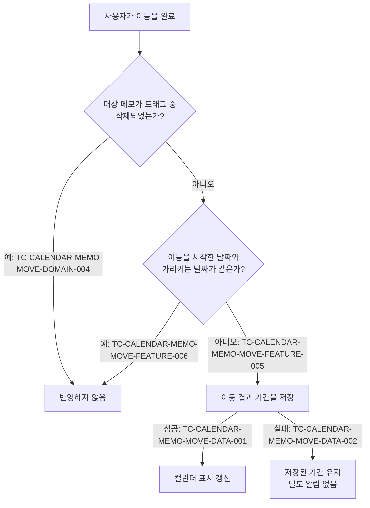

# 캘린더 메모 이동 테스트 케이스

기준 스펙: [캘린더 메모 이동 스펙](../spec/calendar-memo-move.md)

## feature

### TC-CALENDAR-MEMO-MOVE-FEATURE-001: 메모 제목을 길게 누르면 메모 이동이 시작되고 날짜 기간 선택은 시작되지 않는다

- 근거: `feature > 이동 시작`
- Given: 캘린더 홈에 2026년 7월이 표시되어 있고, 7월 14일부터 7월 16일까지의 메모 `회의`가 표시되어 있다.
- When: 사용자가 7월 15일 위치의 `회의` 제목에서 길게 누르기를 시작한다.
- Then: `회의`의 이동이 시작되고, 선택된 날짜 기간은 생기지 않는다.

### TC-CALENDAR-MEMO-MOVE-FEATURE-002: 아이템이 없는 날짜 칸에서 길게 누르면 기존과 같이 날짜 기간 선택이 시작된다

- 근거: `feature > 이동 시작`
- Given: 캘린더 홈에 2026년 7월이 표시되어 있고, 7월 14일부터 7월 16일까지의 메모 `회의`가 표시되어 있다.
- When: 사용자가 메모가 없는 7월 8일 날짜 칸에서 길게 누르기를 시작한다.
- Then: 7월 8일 하루가 선택되고 메모 이동은 시작되지 않는다.

### TC-CALENDAR-MEMO-MOVE-FEATURE-003: 여러 주에 나뉜 조각 어느 것에서 시작해도 같은 메모의 이동이 시작된다

- 근거: `feature > 이동 시작`
- Given: 캘린더 홈에 2026년 7월이 표시되어 있고, 7월 15일부터 7월 22일까지의 메모 `여행`이 두 주에 나뉘어 표시되어 있다.
- When: 사용자가 둘째 조각인 7월 20일 위치의 `여행` 제목에서 길게 누른 뒤 7월 21일로 드래그해 완료한다.
- Then: `여행`의 기간이 7월 16일부터 7월 23일까지로 반영된다.

### TC-CALENDAR-MEMO-MOVE-FEATURE-004: 드래그로 가리키는 날짜를 바꾸면 옮겨질 기간이 즉시 갱신된다

- 근거: `feature > 드래그로 목적지 확인`
- Given: 캘린더 홈에 2026년 7월이 표시되어 있고, 사용자가 7월 15일 위치에서 7월 14일부터 7월 16일까지의 메모 `회의`의 이동을 시작했다.
- When: 사용자가 완료하지 않은 채 가리키는 날짜를 다음 주의 7월 22일로 바꾼다.
- Then: 옮겨질 기간이 7월 21일부터 7월 23일까지로 갱신되어 표시된다.

### TC-CALENDAR-MEMO-MOVE-FEATURE-005: 이동을 완료하면 날짜 차이만큼 옮겨진 기간이 반영된다

- 근거: `feature > 이동 완료`
- Given: 캘린더 홈에 2026년 7월이 표시되어 있고, 7월 14일부터 7월 16일까지의 종일 기간 메모 `회의`가 표시되어 있다.
- When: 사용자가 7월 15일 위치의 `회의` 제목에서 이동을 시작해 7월 22일로 드래그한 뒤 완료한다.
- Then: `회의`의 기간이 7월 21일부터 7월 23일까지의 종일 기간으로 반영되고, 캘린더의 `회의`가 바뀐 기간에 표시되며, 성공 안내는 표시되지 않는다.

### TC-CALENDAR-MEMO-MOVE-FEATURE-006: 이동을 시작한 날짜와 같은 날짜에서 완료하면 메모가 바뀌지 않는다

- 근거: `feature > 이동 완료`
- Given: 캘린더 홈에 2026년 7월이 표시되어 있고, 7월 14일부터 7월 16일까지의 메모 `회의`가 표시되어 있다.
- When: 사용자가 7월 15일 위치의 `회의` 제목에서 이동을 시작해 다른 날짜로 드래그하지 않은 채 완료한다.
- Then: `회의`의 기간과 수정 시각은 바뀌지 않고 캘린더 표시도 그대로 유지된다.

### TC-CALENDAR-MEMO-MOVE-FEATURE-007: 메모 이동을 시작하면 촉각 피드백을 받는다

- 근거: `feature > 이동 피드백`
- Given: 촉각 피드백을 제공하도록 설정된 기기에서 캘린더 홈에 2026년 7월이 표시되어 있고, 7월 14일부터 7월 16일까지의 메모 `회의`가 표시되어 있다.
- When: 사용자가 7월 15일 위치의 `회의` 제목에서 길게 누르기를 시작한다.
- Then: 이동 시작을 알리는 촉각 피드백이 한 번 제공된다.

### TC-CALENDAR-MEMO-MOVE-FEATURE-008: 드래그로 옮겨질 기간이 달라지면 추가 촉각 피드백을 받는다

- 근거: `feature > 이동 피드백`
- Given: 촉각 피드백을 제공하도록 설정된 기기의 캘린더 홈에서 사용자가 7월 15일 위치에서 메모 `회의`의 이동을 시작해 시작 촉각 피드백을 받은 상태다.
- When: 사용자가 가리키는 날짜를 7월 16일로 바꿔 옮겨질 기간이 달라진다.
- Then: 기간 변경을 알리는 촉각 피드백이 한 번 더 제공된다.

### TC-CALENDAR-MEMO-MOVE-FEATURE-009: 드래그해도 옮겨질 기간이 그대로이면 추가 촉각 피드백을 받지 않는다

- 근거: `feature > 이동 피드백`
- Given: 촉각 피드백을 제공하도록 설정된 기기의 캘린더 홈에서 사용자가 메모 `회의`의 이동을 시작해 시작 촉각 피드백을 받은 상태다.
- When: 사용자가 이동을 시작한 날짜 칸 안에서 드래그해 옮겨질 기간이 그대로 유지된다.
- Then: 추가 촉각 피드백이 제공되지 않는다.

### TC-CALENDAR-MEMO-MOVE-FEATURE-010: 이동 중 오른쪽 가장자리 영역에 머무르면 다음 달로 이동하고 메모 이동이 유지된다

- 근거: `feature > 이동 중 달 이동`
- Given: 캘린더 홈에 2026년 7월이 표시되어 있고, 사용자가 7월 15일 위치에서 7월 14일부터 7월 16일까지의 메모 `회의`의 이동을 시작했다.
- When: 사용자가 현재 가리키는 위치를 오른쪽 가장자리 영역으로 옮겨 머무른다.
- Then: 캘린더가 2026년 8월로 이동하고, 메모 이동은 중단되지 않으며 이동한 달에서 가리키는 날짜를 기준으로 옮겨질 기간이 갱신된다.

### TC-CALENDAR-MEMO-MOVE-FEATURE-011: 손을 떼지 않고 이동이 끝나도 그 시점의 기간이 반영된다

- 근거: `feature > 이동 중단`
- Given: 캘린더 홈에 2026년 7월이 표시되어 있고, 7월 14일부터 7월 16일까지의 메모 `회의`가 표시되어 있다.
- When: 사용자가 7월 15일 위치의 `회의` 제목에서 이동을 시작해 7월 22일로 드래그한 뒤, 손을 떼지 않고 시스템이 제스처를 끊는다.
- Then: `회의`의 기간이 7월 21일부터 7월 23일까지로 반영되고 이동 중이라는 표시는 남지 않는다.

### TC-CALENDAR-MEMO-MOVE-FEATURE-012: 이동 중 다른 손가락으로 왼쪽으로 스와이프하면 다음 달로 이동하고 메모 이동이 유지된다

- 근거: `feature > 이동 중 달 이동`
- Given: 캘린더 홈에 2026년 7월이 표시되어 있고, 사용자가 7월 15일 위치에서 7월 14일부터 7월 16일까지의 메모 `회의`의 이동을 시작해 그 위치를 누르고 있다.
- When: 사용자가 메모를 누른 손가락을 그대로 둔 채 다른 손가락으로 캘린더의 다른 지점을 눌러 왼쪽으로 스와이프한다.
- Then: 캘린더가 2026년 8월로 이동하고, 메모 이동은 중단되지 않으며 이동한 달에서 가리키는 날짜를 기준으로 옮겨질 기간이 갱신된다.

### TC-CALENDAR-MEMO-MOVE-FEATURE-013: 스와이프한 손가락을 떼도 메모 이동이 이어지고 메모를 누른 손가락을 떼면 반영된다

- 근거: `feature > 이동 중 달 이동`
- Given: 캘린더 홈에 2026년 7월이 표시되어 있고, 사용자가 7월 15일 위치에서 7월 14일부터 7월 16일까지의 메모 `회의`의 이동을 시작해 다른 손가락의 스와이프로 2026년 8월로 이동한 상태다.
- When: 사용자가 스와이프한 손가락을 뗀 뒤 메모를 누른 손가락으로 8월 5일을 가리키고 그 손가락을 뗀다.
- Then: `회의`의 기간이 8월 4일부터 8월 6일까지로 반영된다.

## domain

`완료 시 판정`의 각 경로는 다음 케이스가 나누어 덮는다.

### TC-CALENDAR-MEMO-MOVE-DOMAIN-001: 완료된 메모도 이동할 수 있고 완료 상태는 바뀌지 않는다

- 근거: `domain > 이동 대상 메모`
- Given: 캘린더 홈에 2026년 7월이 표시되어 있고, 7월 14일부터 7월 16일까지의 완료된 메모 `회의`가 표시되어 있다.
- When: 사용자가 7월 15일 위치의 `회의` 제목에서 이동을 시작해 7월 17일로 드래그한 뒤 완료한다.
- Then: `회의`의 기간이 7월 16일부터 7월 18일까지로 반영되고 완료 상태는 그대로 유지된다.

### TC-CALENDAR-MEMO-MOVE-DOMAIN-002: 시각이 있는 기간인 메모는 시각을 유지한 채 날짜만 바뀐다

- 근거: `domain > 이동 결과 기간`
- Given: 캘린더 홈에 2026년 7월이 표시되어 있고, 7월 14일 10시부터 7월 14일 11시까지의 메모 `면담`이 표시되어 있다.
- When: 사용자가 7월 14일 위치의 `면담` 제목에서 이동을 시작해 7월 16일로 드래그한 뒤 완료한다.
- Then: `면담`의 기간이 7월 16일 10시부터 7월 16일 11시까지로 반영된다.

### TC-CALENDAR-MEMO-MOVE-DOMAIN-003: 드래그하는 동안 다른 경로로 기간이 바뀌어도 이동 시작 시점의 기간을 기준으로 반영한다

- 근거: `domain > 이동 결과 기간`
- Given: 캘린더 홈에 2026년 7월이 표시되어 있고, 사용자가 7월 15일 위치에서 7월 14일부터 7월 16일까지의 메모 `회의`의 이동을 시작했다.
- When: 드래그하는 동안 다른 경로로 `회의`의 기간이 7월 1일부터 7월 2일까지로 바뀌고, 사용자가 7월 22일로 드래그한 뒤 완료한다.
- Then: `회의`의 기간이 이동 시작 시점의 기간에 날짜 차이를 더한 7월 21일부터 7월 23일까지로 반영된다.

### TC-CALENDAR-MEMO-MOVE-DOMAIN-004: 드래그하는 동안 대상 메모가 삭제되면 완료해도 반영하지 않는다

- 근거: `domain > 완료 시 판정`
- Given: 캘린더 홈에 2026년 7월이 표시되어 있고, 사용자가 7월 15일 위치에서 7월 14일부터 7월 16일까지의 메모 `회의`의 이동을 시작했다.
- When: 드래그하는 동안 다른 경로로 `회의`가 삭제되고, 사용자가 7월 22일로 드래그한 뒤 완료한다.
- Then: `회의`의 기간 변경은 반영되지 않는다.

### TC-CALENDAR-MEMO-MOVE-DOMAIN-005: 이동은 기간과 수정 시각만 바꾼다

- 근거: `domain > 이동으로 바뀌는 내용`
- Given: 캘린더 홈에 2026년 7월이 표시되어 있고, 제목·설명·컬러·태그 연결·대표 태그가 저장된 7월 14일부터 7월 16일까지의 메모 `회의`가 표시되어 있다.
- When: 사용자가 7월 15일 위치의 `회의` 제목에서 이동을 시작해 7월 17일로 드래그한 뒤 완료한다.
- Then: `회의`의 기간이 7월 16일부터 7월 18일까지로 바뀌고 수정 시각이 반영 시점으로 기록되며, 제목, 설명, 컬러, 완료 여부, 삭제 여부, 생성 시각, 태그 연결과 대표 태그는 바뀌지 않는다.

### TC-CALENDAR-MEMO-MOVE-DOMAIN-006: 이동 범위를 벗어나는 방향으로는 달이 이동하지 않고 메모 이동이 유지된다

- 근거: `domain > 이동 중 달 이동 기준`
- Given: 캘린더 홈에 이동 범위의 첫 달인 1년 1월이 표시되어 있고, 1월 안의 기간을 가진 메모 `회의`가 표시되어 있다.
- When: 사용자가 `회의` 제목에서 이동을 시작하고 이전 달 방향으로 조작한다.
- Then: 캘린더는 1년 1월을 그대로 유지하고 메모 이동도 중단되지 않는다.
- 테스트 데이터:

  | 이전 달 방향 조작 |
  | --- |
  | 현재 가리키는 위치를 왼쪽 가장자리 영역으로 옮겨 머무른다 |
  | 메모를 누른 손가락을 그대로 둔 채 다른 손가락으로 오른쪽으로 스와이프한다 |

### TC-CALENDAR-MEMO-MOVE-DOMAIN-007: 이웃 달에 속한 날짜 칸으로 완료하면 실제 날짜 그대로 반영된다

- 근거: `domain > 가리키는 날짜 해석`
- Given: 캘린더 홈에 2026년 6월이 표시되어 있고, 6월 23일부터 6월 24일까지의 메모 `회의`가 표시되어 있다. 2026년 6월 화면의 다섯째 주에는 7월 2일이 이웃 달 날짜로 표시된다.
- When: 사용자가 6월 23일 위치의 `회의` 제목에서 이동을 시작해 이웃 달 날짜인 7월 2일로 드래그한 뒤 완료한다.
- Then: `회의`의 기간이 7월 2일부터 7월 3일까지로 반영된다.

### TC-CALENDAR-MEMO-MOVE-DOMAIN-008: 화면이 재생성되면 이동 중 표시가 남지 않고 그 시점의 기간이 반영된다

- 근거: `domain > 유지 경계`
- Given: 캘린더 홈에서 사용자가 7월 15일 위치에서 7월 14일부터 7월 16일까지의 메모 `회의`의 이동을 시작해 7월 22일을 가리키고 있다.
- When: 화면이 재생성된다.
- Then: `회의`의 기간이 7월 21일부터 7월 23일까지로 반영되고 이동 중이라는 표시는 남지 않는다.

### TC-CALENDAR-MEMO-MOVE-DOMAIN-009: 앱이 백그라운드로 이동해도 이동 중 표시가 남지 않고 그 시점의 기간이 반영된다

- 근거: `domain > 유지 경계`
- Given: 캘린더 홈에서 사용자가 메모 `회의`의 이동을 시작해 다른 날짜를 가리키고 있다.
- When: 앱이 백그라운드로 이동한다.
- Then: 그 시점의 옮겨질 기간이 반영되고 이동 중이라는 표시는 남지 않는다.
- 작성하지 않는 이유: 진행 중인 포인터 세션을 유지한 채 앱을 백그라운드로 보내야 하는데, 현재 호스트 테스트 환경은 그 전환을 재현할 수 없어 이 경계를 결정적으로 만들 수 없다. 앱 전환을 제어할 수 있는 테스트 환경이 제공되면 자동화한다.

### TC-CALENDAR-MEMO-MOVE-DOMAIN-010: 이동 중 다른 손가락으로 오른쪽으로 스와이프하면 이전 달로 이동한다

- 근거: `domain > 이동 중 달 이동 기준`
- Given: 캘린더 홈에 2026년 7월이 표시되어 있고, 사용자가 7월 15일 위치에서 메모 `회의`의 이동을 시작해 그 위치를 누르고 있다.
- When: 사용자가 메모를 누른 손가락을 그대로 둔 채 다른 손가락으로 캘린더의 다른 지점을 눌러 오른쪽으로 스와이프한다.
- Then: 캘린더가 2026년 6월로 이동하고 메모 이동은 중단되지 않는다.

### TC-CALENDAR-MEMO-MOVE-DOMAIN-011: 한 번 누른 손가락의 스와이프로는 한 달만 이동한다

- 근거: `domain > 이동 중 달 이동 기준`
- Given: 캘린더 홈에 2026년 7월이 표시되어 있고, 사용자가 메모 `회의`의 이동을 시작한 뒤 다른 손가락으로 왼쪽으로 스와이프해 2026년 8월로 이동한 상태다.
- When: 사용자가 그 손가락을 떼지 않고 계속 왼쪽으로 움직인다.
- Then: 캘린더는 2026년 8월을 그대로 유지하고 메모 이동도 중단되지 않는다.

### TC-CALENDAR-MEMO-MOVE-DOMAIN-012: 이동 중 다른 손가락으로 세로로 움직여도 달이 이동하지 않는다

- 근거: `domain > 이동 중 달 이동 기준`
- Given: 캘린더 홈에 2026년 7월이 표시되어 있고, 사용자가 메모 `회의`의 이동을 시작해 그 위치를 누르고 있다.
- When: 사용자가 메모를 누른 손가락을 그대로 둔 채 다른 손가락으로 캘린더의 다른 지점을 눌러 세로로 움직인다.
- Then: 캘린더는 2026년 7월을 그대로 유지하고 메모 이동도 중단되지 않는다.

### TC-CALENDAR-MEMO-MOVE-DOMAIN-013: 날짜 기간 선택 중에는 다른 손가락의 스와이프로 달이 이동하지 않는다

- 근거: `domain > 이동 중 달 이동 기준`
- Given: 캘린더 홈에 2026년 7월이 표시되어 있고, 사용자가 메모가 없는 7월 8일 날짜 칸에서 날짜 기간 선택을 시작해 그 위치를 누르고 있다.
- When: 사용자가 누른 손가락을 그대로 둔 채 다른 손가락으로 캘린더의 다른 지점을 눌러 왼쪽으로 스와이프한다.
- Then: 캘린더는 2026년 7월을 그대로 유지하고 7월 8일의 선택도 유지된다.

## data

### TC-CALENDAR-MEMO-MOVE-DATA-001: 이동을 완료하면 바뀐 기간과 수정 시각이 저장되어 기존 값을 덮어쓴다

- 근거: `data > 이동 결과의 저장`
- Given: 기기에 7월 14일부터 7월 16일까지의 기간을 가진 메모 `회의`가 저장되어 있고, 캘린더 홈에 2026년 7월이 표시되어 있다.
- When: 사용자가 7월 15일 위치의 `회의` 제목에서 이동을 시작해 7월 22일로 드래그한 뒤 완료한다.
- Then: 저장된 `회의`를 조회하면 기간이 7월 21일부터 7월 23일까지이고 수정 시각이 반영 시점으로 바뀌어 있다.

### TC-CALENDAR-MEMO-MOVE-DATA-002: 저장에 실패하면 저장된 기간이 유지되고 별도로 알리지 않는다

- 근거: `data > 저장 실패`
- Given: 캘린더 홈에 2026년 7월이 표시되어 있고, 7월 14일부터 7월 16일까지의 메모 `회의`가 표시되어 있으며, 메모 저장이 실패하도록 제어되어 있다.
- When: 사용자가 7월 15일 위치의 `회의` 제목에서 이동을 시작해 7월 22일로 드래그한 뒤 완료한다.
- Then: 저장된 `회의`의 기간은 7월 14일부터 7월 16일까지로 유지되고, 캘린더도 그 기간으로 표시하며, 오류 안내는 표시되지 않는다.

### TC-CALENDAR-MEMO-MOVE-DATA-003: 이동을 반영하면 서버와 맞추기 위한 동기화가 시작된다

- 근거: `data > 동기화`
- Given: 캘린더 홈에 2026년 7월이 표시되어 있고, 7월 14일부터 7월 16일까지의 메모 `회의`가 표시되어 있다.
- When: 사용자가 7월 15일 위치의 `회의` 제목에서 이동을 시작해 7월 22일로 드래그한 뒤 완료해 반영에 성공한다.
- Then: 변경을 서버와 맞추기 위한 동기화가 한 번 요청된다.

## 작성하지 않는 이유

- 고스트 아이템의 그림자, 원본 조각의 불투명도 같은 구체적인 시각 표현은 디자인 문서의 책임이며 실제 픽셀을 판정해야 하므로 블랙박스 유닛 테스트 케이스로 작성하지 않는다. 옮겨질 기간 자체가 맞는지는 TC-CALENDAR-MEMO-MOVE-FEATURE-004로 확인한다.
- 시스템이 제스처를 중단해 이동이 취소되는 상황은 현재 테스트 환경에서 결정적으로 발생시킬 수 없어 작성하지 않는다. 제스처 중단을 제어할 수 있는 테스트 환경이 갖춰지면 자동화한다.
- 화면 재생성, 화면 이탈, 백그라운드 이동 뒤에 이동이 유지되지 않는 동작은 현재 테스트 환경에서 해당 실행 경계를 결정적으로 재현할 수 없어 작성하지 않는다. 각 실행 경계를 제어할 수 있는 테스트 환경이 갖춰지면 자동화한다.
- 공휴일 이름과 날씨 위 길게 누르기가 날짜 선택으로 처리되는 동작 중 날씨 영역은 [CalendarHome 테스트 케이스](calendar-home.md)의 날짜 선택 케이스가 덮는 기존 동작이므로 이 문서에서 반복하지 않는다.
