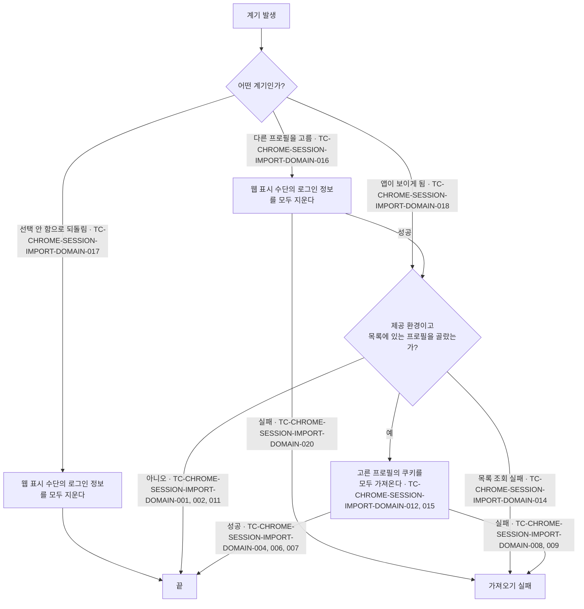

# Chrome 로그인 이어받기 테스트 케이스

기준 스펙: [Chrome 로그인 이어받기 스펙](../spec/client/chrome-session-import.md)

프로필을 고르는 화면의 케이스는 [SettingBrowser 테스트 케이스](./setting-browser.md)에서, 가져오는 동안과 가져온 뒤의 웹 페이지 표시 케이스는 [WebDetail 테스트 케이스](./web-detail.md)에서 다룬다.

## domain

### TC-CHROME-SESSION-IMPORT-DOMAIN-001: 프로필을 고르지 않았으면 아무것도 가져오지 않는다

- 근거: `domain > 가져오는 계기`
- Given: 제공 환경이고 Chrome 로그인 이어받기가 `선택 안 함`으로 저장되어 있다.
- When: 앱이 보이게 된다.
- Then: Chrome 쿠키 보관 공간을 읽지 않고 앱 안 웹 표시 수단에 아무것도 넘기지 않으며, 가져오는 상태는 바뀌지 않는다.

### TC-CHROME-SESSION-IMPORT-DOMAIN-002: 제공하지 않는 환경이면 설정과 관계없이 가져오지 않는다

- 근거: `domain > 제공 환경`
- Given: 제공하지 않는 환경이고 Chrome 로그인 이어받기가 테스트 데이터의 값으로 저장되어 있다.
- When: 앱이 보이게 된다.
- Then: Chrome 프로필 목록과 쿠키 보관 공간을 읽지 않고 앱 안 웹 표시 수단에 아무것도 넘기지 않으며, 가져오는 상태는 `가져온 적 없음`으로 유지된다.
- 테스트 데이터:

| 저장된 값 |
| --- |
| 프로필 A |
| `선택 안 함` |

### TC-CHROME-SESSION-IMPORT-DOMAIN-004: 만료 시각이 지난 쿠키는 넘기지 않는다

- 근거: `domain > 가져오는 대상`
- Given: 제공 환경이고 목록에 있는 프로필을 골라 두었으며, Chrome 쿠키 보관 공간이 만료 시각이 지난 쿠키 하나와 만료 시각이 남은 쿠키 하나, 만료 시각이 없는 쿠키 하나를 돌려준다.
- When: 로그인 정보를 가져온다.
- Then: 만료 시각이 남은 쿠키와 만료 시각이 없는 쿠키만 앱 안 웹 표시 수단에 넘긴다.

### TC-CHROME-SESSION-IMPORT-DOMAIN-006: 쿠키의 속성을 그대로 넘긴다

- 근거: `domain > 가져오는 대상`
- Given: 제공 환경이고 목록에 있는 프로필을 골라 두었으며, Chrome 쿠키 보관 공간이 이름, 값, 도메인, 경로, 만료 시각, 보안 연결 전용 여부, 스크립트 접근 금지 여부, 사이트 간 전송 정책을 가진 쿠키를 돌려준다.
- When: 로그인 정보를 가져온다.
- Then: 앱 안 웹 표시 수단에 넘긴 쿠키의 여덟 속성이 Chrome 쿠키 보관 공간이 돌려준 값과 같다.

### TC-CHROME-SESSION-IMPORT-DOMAIN-007: 프로필에 쿠키가 없으면 아무것도 넘기지 않고 성공으로 끝난다

- 근거: `domain > 가져오기 실패`
- Given: 제공 환경이고 목록에 있는 프로필을 골라 두었으며, Chrome 쿠키 보관 공간이 쿠키를 하나도 돌려주지 않는다.
- When: 로그인 정보를 가져온다.
- Then: 앱 안 웹 표시 수단에 아무것도 넘기지 않고 가져오기는 성공으로 끝난다.

### TC-CHROME-SESSION-IMPORT-DOMAIN-008: Chrome 쿠키 보관 공간을 읽지 못하면 실패로 끝난다

- 근거: `domain > 가져오기 실패`
- Given: 제공 환경이고 목록에 있는 프로필을 골라 두었으며, Chrome 쿠키 보관 공간 읽기가 실패하도록 제어되어 있다.
- When: 로그인 정보를 가져온다.
- Then: 앱 안 웹 표시 수단에 아무것도 넘기지 않고 가져오기는 실패로 끝난다.

### TC-CHROME-SESSION-IMPORT-DOMAIN-009: 앱 안 웹 표시 수단에 넘기지 못하면 실패로 끝난다

- 근거: `domain > 가져오기 실패`
- Given: 제공 환경이고 목록에 있는 프로필을 골라 두었으며, Chrome 쿠키 보관 공간이 쿠키를 돌려주고 앱 안 웹 표시 수단에 넘기기가 실패하도록 제어되어 있다.
- When: 로그인 정보를 가져온다.
- Then: 가져오기는 실패로 끝난다.

### TC-CHROME-SESSION-IMPORT-DOMAIN-011: 고른 프로필이 목록에 없으면 아무것도 가져오지 않는다

- 근거: `domain > Chrome 프로필`
- Given: 제공 환경이고 선택이 프로필 X로 저장되어 있으며, 현재 Chrome 프로필 목록에 X가 없다.
- When: 앱이 보이게 된다.
- Then: Chrome 쿠키 보관 공간을 읽지 않고 앱 안 웹 표시 수단에 아무것도 넘기거나 지우지 않으며, 가져오는 상태는 바뀌지 않는다.

### TC-CHROME-SESSION-IMPORT-DOMAIN-012: 고른 프로필의 쿠키 보관 공간에서 읽는다

- 근거: `domain > Chrome 프로필`, `domain > 가져오는 대상`
- Given: 제공 환경이고 Chrome 프로필 A, B가 있으며 선택이 B로 저장되어 있다.
- When: 로그인 정보를 가져온다.
- Then: 프로필 B의 쿠키 보관 공간에만 쿠키를 요청한다.

### TC-CHROME-SESSION-IMPORT-DOMAIN-013: 프로필 목록을 읽을 수 없으면 조회 실패로 알린다

- 근거: `domain > Chrome 프로필`
- Given: Chrome 프로필 목록 읽기가 실패하도록 제어되어 있다.
- When: 고를 수 있는 프로필을 조회한다.
- Then: 실패를 그대로 알린다.

### TC-CHROME-SESSION-IMPORT-DOMAIN-014: 프로필을 골라 둔 상태에서 목록을 읽을 수 없으면 가져오기가 실패로 끝난다

- 근거: `domain > Chrome 프로필`, `domain > 가져오기 실패`
- Given: 제공 환경이고 선택이 프로필 A로 저장되어 있으며, Chrome 프로필 목록 읽기가 실패하도록 제어되어 있다.
- When: 앱이 보이게 된다.
- Then: Chrome 쿠키 보관 공간을 읽지 않고 앱 안 웹 표시 수단에 아무것도 넘기지 않으며, 가져오는 상태는 `가져오기 실패`가 된다.

### TC-CHROME-SESSION-IMPORT-DOMAIN-015: 고른 프로필의 쿠키를 사이트와 관계없이 모두 넘긴다

- 근거: `domain > 가져오는 대상`
- Given: 제공 환경이고 목록에 있는 프로필을 골라 두었으며, Chrome 쿠키 보관 공간이 테스트 데이터의 도메인을 가진 쿠키를 하나씩 돌려준다.
- When: 로그인 정보를 가져온다.
- Then: 도메인을 지정하지 않고 프로필 전체의 쿠키를 요청하고, 테스트 데이터의 쿠키를 모두 앱 안 웹 표시 수단에 넘긴다.
- 테스트 데이터:

| 쿠키 도메인 |
| --- |
| `mail.example.com` |
| `.example.com` |
| `other.example.org` |
| `.google.com` |
| `accounts.google.com` |

### TC-CHROME-SESSION-IMPORT-DOMAIN-016: 다른 프로필을 고르면 지운 뒤 새 프로필의 로그인 정보를 가져온다

- 근거: `domain > 가져오는 계기`, `domain > 가져오는 상태`
- Given: 제공 환경이고 Chrome 프로필 A, B가 있으며 선택이 A로 저장되어 있고, 가져오는 상태가 `가져오기 성공`이다.
- When: 사용자가 프로필 B를 고른다.
- Then: 앱 안 웹 표시 수단의 로그인 정보를 모두 지운 뒤 프로필 B의 쿠키 보관 공간에서 읽어 넘기며, 가져오는 상태는 `가져온 적 없음`을 거쳐 `가져오는 중`이 되고 끝나면 `가져오기 성공`이 된다. 지우기가 넘기기보다 먼저 일어난다.

### TC-CHROME-SESSION-IMPORT-DOMAIN-017: 선택 안 함으로 되돌리면 지우기만 한다

- 근거: `domain > 가져오는 계기`, `domain > 가져오는 상태`
- Given: 제공 환경이고 선택이 프로필 A로 저장되어 있으며, 가져오는 상태가 테스트 데이터의 값이다.
- When: 사용자가 `선택 안 함`을 고른다.
- Then: 앱 안 웹 표시 수단의 로그인 정보를 모두 지우고, Chrome 쿠키 보관 공간을 읽지 않고 아무것도 넘기지 않으며, 가져오는 상태는 `가져온 적 없음`이 된다.
- 테스트 데이터:

| 가져오는 상태 |
| --- |
| `가져오기 성공` |
| `가져오기 실패` |

### TC-CHROME-SESSION-IMPORT-DOMAIN-018: 앱이 보이게 되면 지우지 않고 가져온다

- 근거: `domain > 가져오는 계기`, `domain > 가져오는 상태`
- Given: 제공 환경이고 목록에 있는 프로필을 골라 두었으며, 가져오는 상태가 테스트 데이터의 값이다.
- When: 앱이 보이게 된다.
- Then: 앱 안 웹 표시 수단의 로그인 정보를 지우지 않고 고른 프로필의 쿠키를 넘기며, 가져오는 상태는 `가져오는 중`을 거쳐 `가져오기 성공`이 된다.
- 테스트 데이터:

| 가져오는 상태 |
| --- |
| `가져온 적 없음` |
| `가져오기 성공` |
| `가져오기 실패` |

### TC-CHROME-SESSION-IMPORT-DOMAIN-019: 가져오는 중에 새 계기가 발생하면 진행 중인 가져오기를 취소하고 새로 시작한다

- 근거: `domain > 가져오는 계기`, `domain > 가져오는 상태`
- Given: 제공 환경이고 목록에 있는 프로필을 골라 두었으며, 첫 가져오기가 끝나지 않도록 제어되어 있다.
- When: 가져오는 중에 앱이 다시 보이게 되고, 두 번째 가져오기는 성공하도록 제어되어 있다.
- Then: 첫 가져오기의 결과는 상태에 반영되지 않고, 가져오는 상태는 `가져오는 중`을 유지하다가 두 번째 가져오기가 끝나면 `가져오기 성공`이 된다. 취소된 첫 가져오기는 `가져오기 실패`로 기록되지 않는다.

### TC-CHROME-SESSION-IMPORT-DOMAIN-020: 지우기에 실패하면 새 프로필의 로그인 정보를 가져오지 않고 실패로 끝난다

- 근거: `domain > 가져오기 실패`
- Given: 제공 환경이고 Chrome 프로필 A, B가 있으며 선택이 A로 저장되어 있고, 앱 안 웹 표시 수단의 로그인 정보 지우기가 실패하도록 제어되어 있다.
- When: 사용자가 프로필 B를 고른다.
- Then: Chrome 쿠키 보관 공간을 읽지 않고 아무것도 넘기지 않으며, 가져오는 상태는 `가져오기 실패`가 된다.

### TC-CHROME-SESSION-IMPORT-DOMAIN-021: 가져오기 실패는 남아 있던 로그인 정보를 지우지 않는다

- 근거: `domain > 가져오기 실패`
- Given: 제공 환경이고 목록에 있는 프로필을 골라 두었으며, Chrome 쿠키 보관 공간 읽기가 실패하도록 제어되어 있다.
- When: 앱이 보이게 된다.
- Then: 앱 안 웹 표시 수단의 로그인 정보를 지우지 않는다.

### TC-CHROME-SESSION-IMPORT-DOMAIN-022: 선택 안 함으로 되돌릴 때 지우기에 실패하면 실패로 끝난다

- 근거: `domain > 가져오는 계기`, `domain > 가져오기 실패`
- Given: 제공 환경이고 선택이 프로필 A로 저장되어 있으며, 앱 안 웹 표시 수단의 로그인 정보 지우기가 실패하도록 제어되어 있다.
- When: 사용자가 `선택 안 함`을 고른다.
- Then: Chrome 쿠키 보관 공간을 읽지 않고 아무것도 넘기지 않으며, 가져오는 상태는 `가져오기 실패`가 된다.

## data

### TC-CHROME-SESSION-IMPORT-DATA-001: 암호화된 쿠키 값을 풀어 제공한다

- 근거: `data > Chrome 쿠키 읽기`
- Given: 고른 프로필의 쿠키 보관 공간에 `Chrome Safe Storage` 키로 암호화한 쿠키가 있고, 그 키를 얻을 수 있도록 제어되어 있다.
- When: 쿠키를 읽는다.
- Then: 쿠키의 값이 암호화 전 원래 값으로 제공된다.

### TC-CHROME-SESSION-IMPORT-DATA-003: 특정 상위 사이트 안에서만 쓰는 쿠키는 제공하지 않는다

- 근거: `domain > 가져오는 대상`, `data > Chrome 쿠키 읽기`
- Given: Chrome 쿠키 보관 공간에 일반 쿠키 하나와 특정 상위 사이트 안에서만 쓰도록 나뉜 쿠키 하나가 있다.
- When: 쿠키를 읽는다.
- Then: 일반 쿠키만 제공된다.

### TC-CHROME-SESSION-IMPORT-DATA-004: 쿠키 속성을 Chrome 쿠키 보관 공간의 값대로 제공한다

- 근거: `domain > 가져오는 대상`, `data > Chrome 쿠키 읽기`
- Given: Chrome 쿠키 보관 공간에 이름, 경로, 만료 시각, 보안 연결 전용 여부, 스크립트 접근 금지 여부, 사이트 간 전송 정책이 테스트 데이터인 쿠키가 있다.
- When: 쿠키를 읽는다.
- Then: 제공된 쿠키의 속성이 테스트 데이터와 같다. 만료 시각이 없는 쿠키는 만료 시각 없음으로 제공된다.
- 테스트 데이터:

| 만료 시각 | 보안 연결 전용 | 스크립트 접근 금지 | 사이트 간 전송 정책 |
| --- | --- | --- | --- |
| 있음 | 예 | 예 | 지정하지 않음 |
| 없음 | 아니오 | 아니오 | 같은 사이트만 |
| 있음 | 예 | 아니오 | 같은 사이트와 최상위 이동 |
| 있음 | 아니오 | 예 | 제한 없음 |

### TC-CHROME-SESSION-IMPORT-DATA-005: 암호화 키를 얻지 못하면 실패로 알린다

- 근거: `data > Chrome 쿠키 읽기`
- Given: Chrome 쿠키 보관 공간에 암호화된 쿠키가 있고, `Chrome Safe Storage` 키를 얻지 못하도록 제어되어 있다.
- When: 쿠키를 읽는다.
- Then: 읽기가 실패로 끝난다.

### TC-CHROME-SESSION-IMPORT-DATA-006: 쿠키 보관 공간이 없으면 실패로 알린다

- 근거: `data > Chrome 쿠키 읽기`
- Given: 고른 프로필의 쿠키 보관 공간이 없다.
- When: 쿠키를 읽는다.
- Then: 읽기가 실패로 끝난다.

### TC-CHROME-SESSION-IMPORT-DATA-007: 읽기가 끝나면 복사본을 남기지 않는다

- 근거: `data > Chrome 쿠키 읽기`
- Given: Chrome 쿠키 보관 공간에 쿠키가 있다.
- When: 쿠키를 읽는다.
- Then: 읽기가 끝난 뒤 보관 공간의 복사본이 남아 있지 않고, 원래 보관 공간의 내용은 바뀌지 않는다.

### TC-CHROME-SESSION-IMPORT-DATA-009: 프로필 목록을 Chrome이 기록한 이름과 순서로 제공한다

- 근거: `domain > Chrome 프로필`, `data > Chrome 프로필 목록 읽기`
- Given: Chrome의 프로필 정보 파일에 폴더 `Default`(이름 `TaeJong`), `Profile 1`(이름 `Work`) 순서로 프로필이 기록되어 있다.
- When: 프로필 목록을 읽는다.
- Then: `TaeJong`, `Work` 순서로 두 프로필을 제공하고 각 프로필은 자기 폴더를 가리킨다.

### TC-CHROME-SESSION-IMPORT-DATA-010: 이름이 없는 프로필은 폴더 이름으로 제공한다

- 근거: `domain > Chrome 프로필`
- Given: Chrome의 프로필 정보 파일에 이름이 비어 있는 폴더 `Profile 2`가 기록되어 있다.
- When: 프로필 목록을 읽는다.
- Then: 그 프로필의 이름을 `Profile 2`로 제공한다.

### TC-CHROME-SESSION-IMPORT-DATA-011: 프로필 정보 파일이 없거나 해석할 수 없으면 실패로 알린다

- 근거: `data > Chrome 프로필 목록 읽기`
- Given: Chrome의 프로필 정보 파일이 테스트 데이터의 상태다.
- When: 프로필 목록을 읽는다.
- Then: 읽기가 실패로 끝난다.
- 테스트 데이터:

| 파일 상태 |
| --- |
| 파일이 없음 |
| 내용이 JSON이 아님 |

### TC-CHROME-SESSION-IMPORT-DATA-012: 보관 공간의 쿠키를 도메인과 관계없이 모두 제공한다

- 근거: `domain > 가져오는 대상`, `data > Chrome 쿠키 읽기`
- Given: Chrome 쿠키 보관 공간에 `example.com`, `.example.com`, `other.example.org` 도메인의 쿠키가 하나씩 있다.
- When: 쿠키를 읽는다.
- Then: 세 쿠키가 모두 제공된다.

### TC-CHROME-SESSION-IMPORT-DATA-013: 암호화된 쿠키가 없으면 키체인을 읽지 않는다

- 근거: `data > Chrome 쿠키 읽기`
- Given: Chrome 쿠키 보관 공간에 암호화되지 않은 쿠키만 있고, 키체인 읽기가 실패하도록 제어되어 있다.
- When: 쿠키를 읽는다.
- Then: 키체인을 읽지 않고 쿠키의 값을 그대로 제공한다.

### TC-CHROME-SESSION-IMPORT-DATA-015: 사이트가 확인되지 않는 쿠키는 제공하지 않고 실패로 다루지 않는다

- 근거: `domain > 가져오는 대상`, `data > Chrome 쿠키 읽기`
- Given: Chrome 쿠키 보관 공간에 값과 함께 기록된 사이트 정보가 그 쿠키의 사이트와 맞는 쿠키 하나와 맞지 않는 쿠키 하나가 있다.
- When: 쿠키를 읽는다.
- Then: 읽기는 실패하지 않고, 사이트 정보가 맞는 쿠키만 제공된다.

### TC-CHROME-SESSION-IMPORT-DATA-008: 같은 이름, 도메인, 경로의 쿠키는 가져온 값으로 바꾼다

- 근거: `data > 앱 안 웹 표시 수단에 넘기기`
- Given: 앱 안 웹 표시 수단의 쿠키 보관 공간에 같은 이름, 도메인, 경로의 쿠키가 다른 값으로 있다.
- When: 가져온 쿠키를 넘긴다.
- Then: 웹 표시 수단의 쿠키 값이 가져온 값으로 바뀐다.
- 작성하지 않는 이유: 앱 안 웹 표시 수단의 쿠키 보관 공간은 macOS의 WebKit이 소유해 실제 창과 네이티브 객체 없이는 관찰할 수 없다. 네이티브 웹 표시 수단을 구동하는 통합 테스트 환경이 갖춰지면 자동화한다.

### TC-CHROME-SESSION-IMPORT-DATA-014: 지우면 웹 표시 수단의 쿠키가 모두 사라진다

- 근거: `data > 앱 안 웹 표시 수단에 넘기기`
- Given: 앱 안 웹 표시 수단의 쿠키 보관 공간에 앱이 가져온 쿠키와 웹 페이지 안에서 생긴 쿠키가 있다.
- When: 로그인 정보를 지운다.
- Then: 두 종류의 쿠키가 모두 사라진다.
- 작성하지 않는 이유: TC-CHROME-SESSION-IMPORT-DATA-008과 같은 이유로 WebKit 보관 공간을 유닛 테스트에서 관찰할 수 없다.

### 작성하지 않는 이유

- 시스템이 키체인 접근 허용을 묻고 사용자가 허용하거나 거부하는 흐름은 macOS의 실제 키체인과 대화상자에 의존하므로 유닛 테스트 케이스로 작성하지 않는다. 키를 얻지 못한 결과는 TC-CHROME-SESSION-IMPORT-DATA-005에서 다룬다.
- 가져온 로그인 정보가 앱을 다시 시작해도 남는 규칙과 Chrome이 아직 보관 공간에 쓰지 않은 쿠키를 가져올 수 없는 규칙은 실제 WebKit 보관 공간과 실행 중인 Chrome에 의존하므로 유닛 테스트 케이스로 작성하지 않는다.
- 앱 창이 보이게 되는 것을 운영체제가 알리는 흐름은 실제 창에 의존하므로 유닛 테스트 케이스로 작성하지 않는다. 그 계기에 하는 일은 TC-CHROME-SESSION-IMPORT-DOMAIN-018에서 다룬다.
