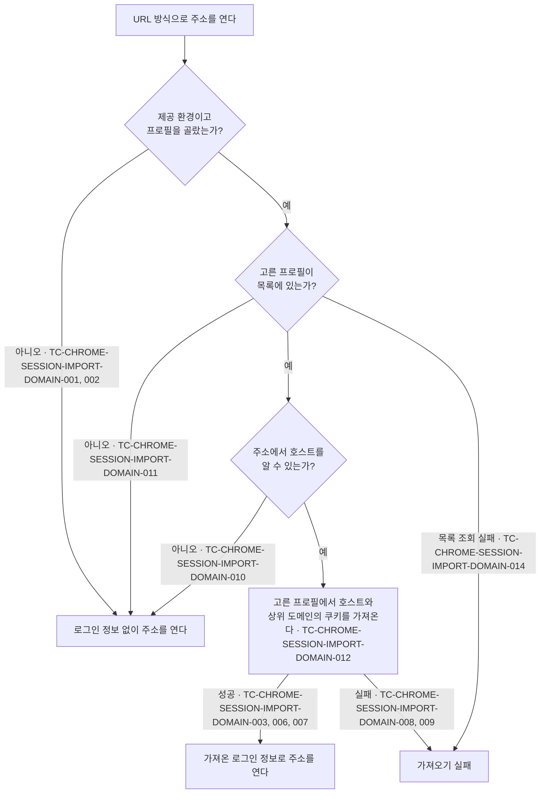

# Chrome 로그인 이어받기 테스트 케이스

기준 스펙: [Chrome 로그인 이어받기 스펙](../spec/chrome-session-import.md)

프로필을 고르는 화면의 케이스는 [SettingBrowser 테스트 케이스](./setting-browser.md)에서, 로그인 정보를 가져오는 동안과 가져온 뒤의 웹 페이지 표시 케이스는 [WebDetail 테스트 케이스](./web-detail.md)에서 다룬다.

## domain

### TC-CHROME-SESSION-IMPORT-DOMAIN-001: 프로필을 고르지 않았으면 아무것도 가져오지 않는다

- 근거: `domain > 가져오는 시점`
- Given: 제공 환경이고 Chrome 로그인 이어받기가 `선택 안 함`으로 저장되어 있다.
- When: URL 방식으로 열 주소의 로그인 정보를 가져온다.
- Then: Chrome 쿠키 저장소를 읽지 않고 앱 안 웹 표시 수단에 아무것도 넘기지 않으며, 가져오기는 성공으로 끝난다.

### TC-CHROME-SESSION-IMPORT-DOMAIN-002: 제공하지 않는 환경이면 설정과 관계없이 가져오지 않는다

- 근거: `domain > 제공 환경`
- Given: 제공하지 않는 환경이고 Chrome 로그인 이어받기가 테스트 데이터의 값으로 저장되어 있다.
- When: URL 방식으로 열 주소의 로그인 정보를 가져온다.
- Then: Chrome 쿠키 저장소를 읽지 않고 앱 안 웹 표시 수단에 아무것도 넘기지 않으며, 가져오기는 성공으로 끝난다.
- 테스트 데이터:

| 저장된 값 |
| --- |
| 프로필 A |
| `선택 안 함` |

### TC-CHROME-SESSION-IMPORT-DOMAIN-003: 여는 주소의 호스트와 상위 도메인의 쿠키만 요청한다

- 근거: `domain > 가져오는 대상`
- Given: 제공 환경이고 목록에 있는 프로필을 골라 두었다.
- When: 테스트 데이터의 주소로 로그인 정보를 가져온다.
- Then: Chrome 쿠키 저장소에 테스트 데이터의 도메인 목록에 해당하는 쿠키만 요청한다.
- 테스트 데이터:

| 주소 | 요청하는 도메인 |
| --- | --- |
| `https://mail.example.com/inbox` | `mail.example.com`, `.mail.example.com`, `example.com`, `.example.com` |
| `https://example.com` | `example.com`, `.example.com` |
| `https://a.b.example.co.kr/path?q=1` | `a.b.example.co.kr`, `.a.b.example.co.kr`, `b.example.co.kr`, `.b.example.co.kr`, `example.co.kr`, `.example.co.kr`, `co.kr`, `.co.kr` |

### TC-CHROME-SESSION-IMPORT-DOMAIN-004: 만료 시각이 지난 쿠키는 넘기지 않는다

- 근거: `domain > 가져오는 대상`
- Given: 제공 환경이고 목록에 있는 프로필을 골라 두었으며, Chrome 쿠키 저장소가 여는 주소의 사이트에 대해 만료 시각이 지난 쿠키 하나와 만료 시각이 남은 쿠키 하나, 만료 시각이 없는 쿠키 하나를 돌려준다.
- When: 로그인 정보를 가져온다.
- Then: 만료 시각이 남은 쿠키와 만료 시각이 없는 쿠키만 앱 안 웹 표시 수단에 넘긴다.

### TC-CHROME-SESSION-IMPORT-DOMAIN-005: Google 계정 도메인의 쿠키는 넘기지 않는다

- 근거: `domain > 가져오는 대상`
- Given: 제공 환경이고 목록에 있는 프로필을 골라 두었으며, Chrome 쿠키 저장소가 테스트 데이터의 도메인을 가진 쿠키를 돌려준다.
- When: 로그인 정보를 가져온다.
- Then: 테스트 데이터의 결과대로 넘기거나 넘기지 않는다.
- 테스트 데이터:

| 쿠키 도메인 | 결과 |
| --- | --- |
| `google.com` | 넘기지 않음 |
| `.google.com` | 넘기지 않음 |
| `accounts.google.com` | 넘기지 않음 |
| `.accounts.google.com` | 넘기지 않음 |
| `notgoogle.com` | 넘김 |
| `google.com.example.com` | 넘김 |

### TC-CHROME-SESSION-IMPORT-DOMAIN-006: 쿠키의 속성을 그대로 넘긴다

- 근거: `domain > 가져오는 대상`
- Given: 제공 환경이고 목록에 있는 프로필을 골라 두었으며, Chrome 쿠키 저장소가 이름, 값, 도메인, 경로, 만료 시각, 보안 연결 전용 여부, 스크립트 접근 금지 여부, 사이트 간 전송 정책을 가진 쿠키를 돌려준다.
- When: 로그인 정보를 가져온다.
- Then: 앱 안 웹 표시 수단에 넘긴 쿠키의 여덟 속성이 Chrome 쿠키 저장소가 돌려준 값과 같다.

### TC-CHROME-SESSION-IMPORT-DOMAIN-007: 해당 사이트의 쿠키가 없으면 아무것도 넘기지 않고 성공으로 끝난다

- 근거: `domain > 가져오기 실패`
- Given: 제공 환경이고 목록에 있는 프로필을 골라 두었으며, Chrome 쿠키 저장소가 여는 주소의 사이트에 대해 쿠키를 하나도 돌려주지 않는다.
- When: 로그인 정보를 가져온다.
- Then: 앱 안 웹 표시 수단에 아무것도 넘기지 않고 가져오기는 성공으로 끝난다.

### TC-CHROME-SESSION-IMPORT-DOMAIN-008: Chrome 쿠키 저장소를 읽지 못하면 실패로 끝난다

- 근거: `domain > 가져오기 실패`
- Given: 제공 환경이고 목록에 있는 프로필을 골라 두었으며, Chrome 쿠키 저장소 읽기가 실패하도록 제어되어 있다.
- When: 로그인 정보를 가져온다.
- Then: 앱 안 웹 표시 수단에 아무것도 넘기지 않고 가져오기는 실패로 끝난다.

### TC-CHROME-SESSION-IMPORT-DOMAIN-009: 앱 안 웹 표시 수단에 넘기지 못하면 실패로 끝난다

- 근거: `domain > 가져오기 실패`
- Given: 제공 환경이고 목록에 있는 프로필을 골라 두었으며, Chrome 쿠키 저장소가 쿠키를 돌려주고 앱 안 웹 표시 수단에 넘기기가 실패하도록 제어되어 있다.
- When: 로그인 정보를 가져온다.
- Then: 가져오기는 실패로 끝난다.

### TC-CHROME-SESSION-IMPORT-DOMAIN-010: 주소에서 호스트를 알 수 없으면 아무것도 가져오지 않는다

- 근거: `domain > 가져오는 대상`
- Given: 제공 환경이고 목록에 있는 프로필을 골라 두었다.
- When: 테스트 데이터의 주소로 로그인 정보를 가져온다.
- Then: Chrome 쿠키 저장소를 읽지 않고 앱 안 웹 표시 수단에 아무것도 넘기지 않으며, 가져오기는 성공으로 끝난다.
- 테스트 데이터:

| 주소 |
| --- |
| 빈 문자열 |
| `not a url` |
| `mailto:someone@example.com` |

### TC-CHROME-SESSION-IMPORT-DOMAIN-011: 고른 프로필이 목록에 없으면 아무것도 가져오지 않는다

- 근거: `domain > Chrome 프로필`
- Given: 제공 환경이고 선택이 프로필 X로 저장되어 있으며, 현재 Chrome 프로필 목록에 X가 없다.
- When: URL 방식으로 열 주소의 로그인 정보를 가져온다.
- Then: Chrome 쿠키 저장소를 읽지 않고 앱 안 웹 표시 수단에 아무것도 넘기지 않으며, 가져오기는 성공으로 끝난다.

### TC-CHROME-SESSION-IMPORT-DOMAIN-012: 고른 프로필의 쿠키 저장소에서 읽는다

- 근거: `domain > Chrome 프로필`, `domain > 가져오는 대상`
- Given: 제공 환경이고 Chrome 프로필 A, B가 있으며 선택이 B로 저장되어 있다.
- When: URL 방식으로 열 주소의 로그인 정보를 가져온다.
- Then: 프로필 B의 쿠키 저장소에만 쿠키를 요청한다.

### TC-CHROME-SESSION-IMPORT-DOMAIN-013: 프로필 목록을 읽을 수 없으면 조회 실패로 알린다

- 근거: `domain > Chrome 프로필`
- Given: Chrome 프로필 목록 읽기가 실패하도록 제어되어 있다.
- When: 고를 수 있는 프로필을 조회한다.
- Then: 실패를 그대로 알린다.

### TC-CHROME-SESSION-IMPORT-DOMAIN-014: 프로필을 골라 둔 상태에서 목록을 읽을 수 없으면 가져오기가 실패로 끝난다

- 근거: `domain > Chrome 프로필`, `domain > 가져오기 실패`
- Given: 제공 환경이고 선택이 프로필 A로 저장되어 있으며, Chrome 프로필 목록 읽기가 실패하도록 제어되어 있다.
- When: URL 방식으로 열 주소의 로그인 정보를 가져온다.
- Then: Chrome 쿠키 저장소를 읽지 않고 앱 안 웹 표시 수단에 아무것도 넘기지 않으며, 가져오기는 실패로 끝난다.

## data

### TC-CHROME-SESSION-IMPORT-DATA-001: 암호화된 쿠키 값을 풀어 제공한다

- 근거: `data > Chrome 쿠키 읽기`
- Given: 고른 프로필의 쿠키 저장소에 `Chrome Safe Storage` 키로 암호화한 쿠키가 있고, 그 키를 얻을 수 있도록 제어되어 있다.
- When: 그 쿠키의 도메인으로 쿠키를 읽는다.
- Then: 쿠키의 값이 암호화 전 원래 값으로 제공된다.

### TC-CHROME-SESSION-IMPORT-DATA-002: 요청한 도메인의 쿠키만 제공한다

- 근거: `domain > 가져오는 대상`, `data > Chrome 쿠키 읽기`
- Given: Chrome 쿠키 저장소에 `example.com`, `.example.com`, `other.example.com` 도메인의 쿠키가 하나씩 있다.
- When: `example.com`과 `.example.com` 도메인으로 쿠키를 읽는다.
- Then: 두 도메인의 쿠키 두 개만 제공되고 `other.example.com`의 쿠키는 제공되지 않는다.

### TC-CHROME-SESSION-IMPORT-DATA-003: 특정 상위 사이트 안에서만 쓰는 쿠키는 제공하지 않는다

- 근거: `domain > 가져오는 대상`, `data > Chrome 쿠키 읽기`
- Given: Chrome 쿠키 저장소에 같은 도메인으로 일반 쿠키 하나와 특정 상위 사이트 안에서만 쓰도록 나뉜 쿠키 하나가 있다.
- When: 그 도메인으로 쿠키를 읽는다.
- Then: 일반 쿠키만 제공된다.

### TC-CHROME-SESSION-IMPORT-DATA-004: 쿠키 속성을 Chrome 저장소의 값대로 제공한다

- 근거: `domain > 가져오는 대상`, `data > Chrome 쿠키 읽기`
- Given: Chrome 쿠키 저장소에 이름, 경로, 만료 시각, 보안 연결 전용 여부, 스크립트 접근 금지 여부, 사이트 간 전송 정책이 테스트 데이터인 쿠키가 있다.
- When: 그 도메인으로 쿠키를 읽는다.
- Then: 제공된 쿠키의 속성이 테스트 데이터와 같다. 만료 시각이 없는 쿠키는 만료 시각 없음으로 제공된다.
- 테스트 데이터:

| 만료 시각 | 보안 연결 전용 | 스크립트 접근 금지 | 사이트 간 전송 정책 |
| --- | --- | --- | --- |
| 있음 | 예 | 예 | 지정하지 않음 |
| 없음 | 아니오 | 아니오 | 같은 사이트만 |
| 있음 | 예 | 아니오 | 같은 사이트와 최상위 이동 |
| 있음 | 아니오 | 예 | 제한 없음 |

### TC-CHROME-SESSION-IMPORT-DATA-005: 암호화 키를 얻지 못하면 실패로 알린다

- 근거: `data > Chrome 쿠키 읽기`
- Given: Chrome 쿠키 저장소에 암호화된 쿠키가 있고, `Chrome Safe Storage` 키를 얻지 못하도록 제어되어 있다.
- When: 그 쿠키의 도메인으로 쿠키를 읽는다.
- Then: 읽기가 실패로 끝난다.

### TC-CHROME-SESSION-IMPORT-DATA-006: 쿠키 저장소가 없으면 실패로 알린다

- 근거: `data > Chrome 쿠키 읽기`
- Given: 고른 프로필의 쿠키 저장소가 없다.
- When: 쿠키를 읽는다.
- Then: 읽기가 실패로 끝난다.

### TC-CHROME-SESSION-IMPORT-DATA-007: 읽기가 끝나면 복사본을 남기지 않는다

- 근거: `data > Chrome 쿠키 읽기`
- Given: Chrome 쿠키 저장소에 쿠키가 있다.
- When: 쿠키를 읽는다.
- Then: 읽기가 끝난 뒤 저장소의 복사본이 남아 있지 않고, 원래 저장소의 내용은 바뀌지 않는다.

### TC-CHROME-SESSION-IMPORT-DATA-009: 프로필 목록을 Chrome이 기록한 이름과 순서로 제공한다

- 근거: `domain > Chrome 프로필`, `data > Chrome 프로필 목록 읽기`
- Given: Chrome의 프로필 정보 파일에 폴더 `Default`(이름 `TaeJong`), `Profile 1`(이름 `Work`) 순서로 프로필이 기록되어 있다.
- When: 프로필 목록을 읽는다.
- Then: `TaeJong`, `Work` 순서로 두 프로필을 제공하고 각 프로필은 자기 폴더를 가리킨다.

### TC-CHROME-SESSION-IMPORT-DATA-010: 이름이 없는 프로필은 폴더 이름으로 제공한다

- 근거: `domain > Chrome 프로필`
- Given: Chrome의 프로필 정보 파일에 이름이 비어 있는 폴더 `Profile 2`가 기록되어 있다.
- When: 프로필 목록을 읽는다.
- Then: 그 프로필의 이름을 `Profile 2`로 제공한다.

### TC-CHROME-SESSION-IMPORT-DATA-011: 프로필 정보 파일이 없거나 해석할 수 없으면 실패로 알린다

- 근거: `data > Chrome 프로필 목록 읽기`
- Given: Chrome의 프로필 정보 파일이 테스트 데이터의 상태다.
- When: 프로필 목록을 읽는다.
- Then: 읽기가 실패로 끝난다.
- 테스트 데이터:

| 파일 상태 |
| --- |
| 파일이 없음 |
| 내용이 JSON이 아님 |

### TC-CHROME-SESSION-IMPORT-DATA-008: 같은 이름, 도메인, 경로의 쿠키는 가져온 값으로 바꾼다

- 근거: `data > 앱 안 웹 표시 수단에 넘기기`
- Given: 앱 안 웹 표시 수단의 쿠키 저장소에 같은 이름, 도메인, 경로의 쿠키가 다른 값으로 있다.
- When: 가져온 쿠키를 넘긴다.
- Then: 웹 표시 수단의 쿠키 값이 가져온 값으로 바뀐다.
- 작성하지 않는 이유: 앱 안 웹 표시 수단의 쿠키 저장소는 macOS의 WebKit이 소유해 실제 창과 네이티브 객체 없이는 관찰할 수 없다. 네이티브 웹 표시 수단을 구동하는 통합 테스트 환경이 갖춰지면 자동화한다.

### 작성하지 않는 이유

- 시스템이 키체인 접근 허용을 묻고 사용자가 허용하거나 거부하는 흐름은 macOS의 실제 키체인과 대화상자에 의존하므로 유닛 테스트 케이스로 작성하지 않는다. 키를 얻지 못한 결과는 TC-CHROME-SESSION-IMPORT-DATA-005에서 다룬다.
- 가져온 로그인 정보가 앱을 다시 시작해도 남는 규칙과 Chrome이 아직 저장소에 쓰지 않은 쿠키를 가져올 수 없는 규칙은 실제 WebKit 저장소와 실행 중인 Chrome에 의존하므로 유닛 테스트 케이스로 작성하지 않는다.
