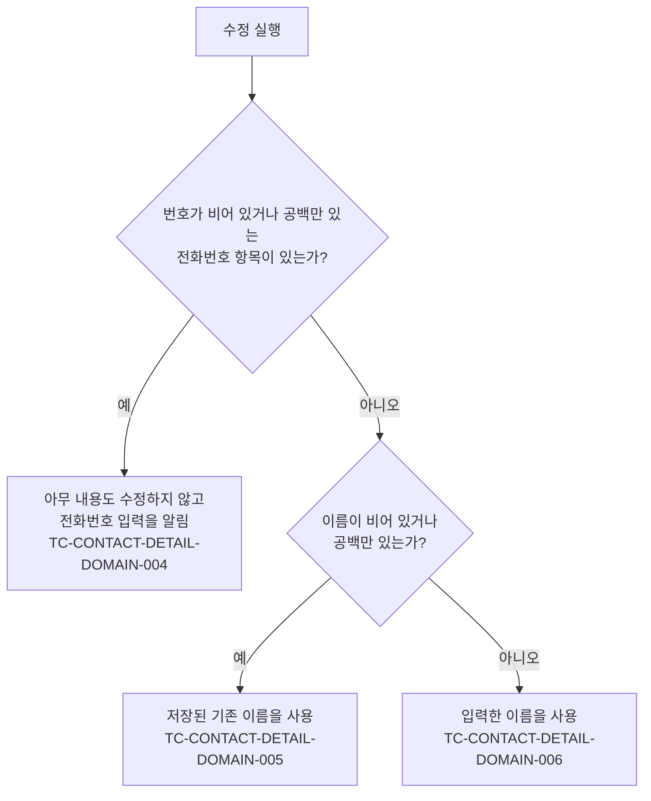

# ContactDetail 테스트 케이스

기준 스펙: [ContactDetail 화면 스펙](../spec/contact-detail.md)

이 문서에서 `feature > 진입할 때의 입력 초점`, `domain > 요청 제한`, `data > 대상 조회`, `data > 저장 실패` 절은 [항목 상세 화면 공통 스펙](../spec/entity-detail.md)이 소유한다. 나머지 케이스의 절은 기준 스펙이 소유한다.

ContactHome에서 연락처를 선택해 ContactDetail로 이동하는 케이스는 [ContactHome 테스트 케이스](./contact-home.md)에서, 각 입력의 문자 제한과 조작 자체의 케이스는 [ContactAdd 테스트 케이스](./contact-add.md)에서, 설명 입력 자체의 케이스는 [설명 입력 테스트 케이스](./description-input.md)에서, 목록과 상세를 함께 쓰는 배치의 케이스는 [Contact 목록·상세 배치 테스트 케이스](./contact-list-detail.md)에서, 연락처를 서버와 맞추는 케이스는 [데이터 동기화 테스트 케이스](./data-sync.md)에서 다룬다.

## feature

### TC-CONTACT-DETAIL-FEATURE-001: 조회에 성공하면 저장된 내용을 입력에 채운다

- 근거: `feature > 진입과 내용`
- Given: 이름, 설명, 키, 신발 사이즈, 생일, 고향과 전화번호가 모두 저장된 연락처가 조회되도록 설정되어 있다.
- When: ContactDetail 화면이 표시된다.
- Then: 저장된 이름, 설명, 키, 신발 사이즈, 고향이 각 입력에 채워지고 저장된 생일이 저장된 달력 구분이 골라진 상태로 표시되며 저장된 전화번호가 저장된 순서대로 채워진다.

### TC-CONTACT-DETAIL-FEATURE-002: 값이 없는 정보는 비어 있는 상태로 채운다

- 근거: `feature > 진입과 내용`
- Given: 이름만 있고 설명과 고향이 비어 있으며 키·신발 사이즈·생일이 없고 전화번호가 하나도 없는 연락처가 조회되도록 설정되어 있다.
- When: ContactDetail 화면이 표시된다.
- Then: 설명, 키, 신발 사이즈, 고향 입력이 비어 있고 생일이 고르지 않은 상태로 표시되며 달력 구분을 고르는 수단이 제공되지 않고 전화번호 항목이 하나도 표시되지 않는다.

### TC-CONTACT-DETAIL-FEATURE-003: 화면 제목에 저장된 연락처 이름을 표시한다

- 근거: `feature > 진입과 내용`
- Given: 이름이 저장된 연락처가 조회되도록 설정되어 있다.
- When: ContactDetail 화면이 표시된다.
- Then: 화면 제목에 저장된 연락처 이름이 표시된다.

### TC-CONTACT-DETAIL-FEATURE-004: 조회 중에는 수정과 즐겨찾기 변경과 삭제를 실행할 수 없다

- 근거: `feature > 조회 상태`
- Given: 연락처 조회가 완료되지 않고 진행 중인 상태로 설정되어 있다.
- When: ContactDetail 화면이 표시된다.
- Then: 입력과 수정 동작과 삭제 동작이 제공되지 않고 조회 중 상태가 표시된다.

### TC-CONTACT-DETAIL-FEATURE-005: 조회할 수 없으면 조회 중 상태를 유지한다

- 근거: `feature > 조회 상태`
- Given: 대상 연락처를 조회할 수 없도록 설정되어 있다.
- When: ContactDetail 화면이 표시된다.
- Then: 조회 중 상태가 유지되고 오류 안내가 표시되지 않는다.

### TC-CONTACT-DETAIL-FEATURE-006: 입력이 저장된 내용과 다를 때만 수정 동작을 제공한다

- 근거: `feature > 내용 수정`
- Given: 저장된 연락처가 조회되어 입력에 채워져 있다.
- When: 사용자가 테스트 데이터의 조작을 한다.
- Then: 테스트 데이터의 기대 결과대로 수정 동작이 제공되거나 제공되지 않는다.
- 테스트 데이터:

| 조작 | 기대 결과 |
| --- | --- |
| 아무것도 바꾸지 않음 | 수정 동작이 제공되지 않음 |
| 이름을 다른 값으로 바꿈 | 수정 동작이 제공됨 |
| 설명을 다른 값으로 바꿈 | 수정 동작이 제공됨 |
| 키를 다른 값으로 바꿈 | 수정 동작이 제공됨 |
| 신발 사이즈를 다른 값으로 바꿈 | 수정 동작이 제공됨 |
| 생일을 다른 날짜로 바꿈 | 수정 동작이 제공됨 |
| 생일의 날짜는 그대로 두고 달력 구분만 바꿈 | 수정 동작이 제공됨 |
| 고향을 다른 값으로 바꿈 | 수정 동작이 제공됨 |
| 즐겨찾기만 바꿈 | 수정 동작이 제공되지 않음 |
| 전화번호 항목을 추가함 | 수정 동작이 제공됨 |
| 전화번호 항목을 삭제함 | 수정 동작이 제공됨 |
| 바꾼 값을 다시 저장된 값으로 되돌림 | 수정 동작이 제공되지 않음 |

### TC-CONTACT-DETAIL-FEATURE-007: 수정에 성공하면 화면과 입력을 유지하고 성공 피드백을 제공한다

- 근거: `feature > 내용 수정`
- Given: 연락처 수정이 성공하도록 설정되어 있고 입력을 저장된 내용과 다르게 바꾼 상태다.
- When: 사용자가 수정을 실행한다.
- Then: ContactDetail 화면이 유지되고 입력 내용이 그대로 남으며 연락처가 수정되었다는 성공 피드백이 제공된다.

### TC-CONTACT-DETAIL-FEATURE-008: 수정을 처리하는 동안 진행 상태를 표시한다

- 근거: `feature > 내용 수정`
- Given: 연락처 수정 처리가 완료되지 않고 진행 중인 상태로 설정되어 있고 입력을 저장된 내용과 다르게 바꾼 상태다.
- When: 사용자가 수정을 실행한 뒤 화면을 확인한다.
- Then: 수정 처리가 끝날 때까지 진행 상태가 표시된다.

### TC-CONTACT-DETAIL-FEATURE-009: 수정에 실패하면 입력을 유지하고 다시 시도할 수 있다

- 근거: `feature > 내용 수정`
- Given: 연락처 수정이 실패하도록 설정되어 있고 입력을 저장된 내용과 다르게 바꾼 상태다.
- When: 사용자가 수정을 실행한다.
- Then: ContactDetail 화면과 입력 내용이 그대로 유지되고 진행 상태만 해제되어 수정을 다시 실행할 수 있다.

### TC-CONTACT-DETAIL-FEATURE-010: 이름을 비운 채 수정하면 기존 이름이 유지된다

- 근거: `feature > 내용 수정`
- Given: 이름이 저장된 연락처가 조회되어 있고 연락처 수정이 성공하도록 설정되어 있다.
- When: 사용자가 이름을 비우고 설명을 바꾼 뒤 수정을 실행한다.
- Then: 저장된 기존 이름이 그대로 유지되고 바꾼 설명만 반영되며 성공 피드백이 제공된다.

### TC-CONTACT-DETAIL-FEATURE-011: 저장된 전화번호를 저장된 순서대로 채운다

- 근거: `feature > 전화번호 입력`
- Given: 전화번호를 순서대로 여러 개 가진 연락처가 조회되도록 설정되어 있다.
- When: ContactDetail 화면이 표시된다.
- Then: 저장된 전화번호가 저장된 순서 그대로 전화번호 항목에 채워진다.

### TC-CONTACT-DETAIL-FEATURE-012: 번호가 비어 있는 전화번호 항목이 있으면 수정하지 않고 알린다

- 근거: `feature > 전화번호 미입력`
- Given: 저장된 연락처가 조회되어 있고 사용자가 이름과 설명을 바꾼 상태다.
- When: 사용자가 번호가 비어 있는 전화번호 항목을 추가한 뒤 수정을 실행한다.
- Then: 연락처가 수정되지 않고 전화번호 입력이 필요하다는 피드백이 제공되며, 입력 중이던 이름, 설명, 키, 신발 사이즈, 생일과 전화번호 항목이 모두 그대로 유지된다.

### TC-CONTACT-DETAIL-FEATURE-013: 삭제에 성공하면 화면에서 빠져나간다

- 근거: `feature > 삭제`
- Given: 연락처 삭제가 성공하도록 설정되어 있고 ContactDetail 화면이 표시되어 있다.
- When: 사용자가 삭제를 실행한다.
- Then: 뒤로가기와 같은 결과로 ContactDetail 화면에서 빠져나간다.

### TC-CONTACT-DETAIL-FEATURE-014: 삭제를 처리하는 동안 진행 상태를 표시한다

- 근거: `feature > 삭제`
- Given: 연락처 삭제 처리가 완료되지 않고 진행 중인 상태로 설정되어 있다.
- When: 사용자가 삭제를 실행한 뒤 화면을 확인한다.
- Then: 삭제 처리가 끝날 때까지 진행 상태가 표시된다.

### TC-CONTACT-DETAIL-FEATURE-015: 삭제에 실패하면 화면에 머무르고 다시 시도할 수 있다

- 근거: `feature > 삭제`
- Given: 연락처 삭제가 실패하도록 설정되어 있다.
- When: 사용자가 삭제를 실행한다.
- Then: ContactDetail 화면에 머무르고 진행 상태만 해제되어 삭제를 다시 실행할 수 있다.

### TC-CONTACT-DETAIL-FEATURE-016: 삭제 전에 확인을 되묻지 않는다

- 근거: `feature > 삭제`
- Given: ContactDetail 화면이 표시되어 있다.
- When: 사용자가 삭제를 실행한다.
- Then: 확인을 되묻는 안내 없이 삭제가 곧바로 처리된다.

### TC-CONTACT-DETAIL-FEATURE-017: 저장된 이름이 다른 경로에서 바뀌면 화면 제목만 갱신한다

- 근거: `feature > 외부 변경`
- Given: ContactDetail 화면이 표시되어 있고 사용자가 이름과 설명을 입력 중이다.
- When: 같은 연락처의 저장된 이름이 다른 경로에서 바뀐다.
- Then: 화면 제목이 최신 저장 이름으로 갱신되고 입력 중이던 이름과 설명은 덮어쓰이지 않는다.

### TC-CONTACT-DETAIL-FEATURE-018: 대상 연락처가 삭제 상태가 되어도 내용 표시 상태를 유지한다

- 근거: `feature > 외부 변경`
- Given: ContactDetail 화면에 연락처 내용이 표시되어 있고 사용자가 입력을 바꾼 상태다.
- When: 대상 연락처가 다른 경로에서 삭제 상태로 바뀐다.
- Then: 내용 표시 상태가 유지되고 입력 중이던 내용이 그대로 남으며 수정과 삭제를 그대로 실행할 수 있다.

### TC-CONTACT-DETAIL-FEATURE-019: 화면이 재생성되어도 입력 중이던 내용을 유지한다

- 근거: `feature > 진행 상태 유지`
- Given: ContactDetail 화면에서 이름, 설명, 키, 신발 사이즈, 생일, 고향과 전화번호 항목을 바꾼 상태다.
- When: 화면이 재생성된다.
- Then: 바꾼 이름, 설명, 키, 신발 사이즈, 고른 생일, 고향과 전화번호 항목의 번호·순서가 그대로 유지된다.

### TC-CONTACT-DETAIL-FEATURE-020: 화면을 떠났다가 다시 들어오면 저장된 내용으로 다시 시작한다

- 근거: `feature > 진행 상태 유지`
- Given: ContactDetail 화면에서 입력을 바꾸고 수정을 실행하지 않은 상태다.
- When: 사용자가 화면을 떠난 뒤 같은 연락처의 ContactDetail 화면에 다시 들어온다.
- Then: 바꾸던 내용이 복원되지 않고 저장된 내용이 입력에 채워진다.

### TC-CONTACT-DETAIL-FEATURE-021: 뒤로가면 진입하기 전 화면으로 돌아간다

- 근거: `feature > 뒤로가기`
- Given: ContactDetail 화면이 표시되어 있고 사용자가 입력을 바꾼 상태다.
- When: 사용자가 뒤로가기를 실행한다.
- Then: 진입하기 전 화면으로 돌아가고 반영하지 않은 수정 내용은 저장되지 않는다.

### TC-CONTACT-DETAIL-FEATURE-022: 진입할 때 어느 입력에도 초점을 두지 않는다

- 근거: `feature > 진입과 내용`
- Given: 저장된 연락처가 조회되도록 설정되어 있다.
- When: ContactDetail 화면이 표시된다.
- Then: 어느 입력에도 입력 초점이 놓이지 않는다.

### TC-CONTACT-DETAIL-FEATURE-023: 저장된 달력 구분을 골라진 상태로 채운다

- 근거: `feature > 진입과 내용`
- Given: 테스트 데이터의 달력 구분으로 생일이 저장된 연락처가 조회되도록 설정되어 있다.
- When: ContactDetail 화면이 표시된다.
- Then: 저장된 달력 구분이 골라진 상태로 표시된다.
- 테스트 데이터:

| 저장된 구분 |
| --- |
| 양력 |
| 음력 |

### TC-CONTACT-DETAIL-FEATURE-024: 고향을 입력하거나 바꿀 수 있다

- 근거: `feature > 내용 수정`
- Given: 고향이 저장된 연락처가 조회되어 입력에 채워져 있다.
- When: 사용자가 고향을 다른 값으로 바꾼다.
- Then: 바꾼 고향이 그대로 표시된다.

### TC-CONTACT-DETAIL-FEATURE-025: 저장된 즐겨찾기 여부를 확인할 수 있다

- 근거: `feature > 진입과 내용`, `feature > 즐겨찾기`
- Given: 즐겨찾기 여부가 테스트 데이터와 같은 연락처가 조회되도록 설정되어 있다.
- When: ContactDetail 화면이 표시된다.
- Then: 즐겨찾기 여부가 테스트 데이터의 상태로 표시된다.
- 테스트 데이터:

| 저장된 즐겨찾기 여부 |
| --- |
| 즐겨찾기임 |
| 즐겨찾기가 아님 |

### TC-CONTACT-DETAIL-FEATURE-026: 즐겨찾기를 누르면 즉시 반대 값으로 바뀐다

- 근거: `feature > 즐겨찾기`
- Given: 즐겨찾기가 아닌 연락처가 조회되어 표시되어 있다.
- When: 사용자가 즐겨찾기 변경을 실행한다.
- Then: 별도의 확정 동작 없이 그 연락처가 즐겨찾기로 저장되고 화면에 즐겨찾기 상태로 표시된다.

### TC-CONTACT-DETAIL-FEATURE-027: 즐겨찾기 변경은 입력 중이던 내용과 수정 동작을 바꾸지 않는다

- 근거: `feature > 즐겨찾기`
- Given: 저장된 연락처가 조회되어 있고 사용자가 이름과 고향을 저장된 값과 다르게 입력해 수정 동작이 제공되고 있다.
- When: 사용자가 즐겨찾기 변경을 실행한다.
- Then: 입력 중이던 이름과 고향이 그대로 유지되고 수정 동작이 계속 제공된다.

### TC-CONTACT-DETAIL-FEATURE-028: 즐겨찾기 변경을 처리하는 동안 진행 상태를 표시한다

- 근거: `feature > 즐겨찾기`
- Given: 즐겨찾기 변경 처리가 완료되지 않도록 설정되어 있다.
- When: 사용자가 즐겨찾기 변경을 실행한다.
- Then: 즐겨찾기 변경의 진행 상태가 표시되고 내용 수정과 삭제를 그대로 실행할 수 있다.

### TC-CONTACT-DETAIL-FEATURE-029: 즐겨찾기 변경에 성공해도 별도로 안내하지 않는다

- 근거: `feature > 즐겨찾기`
- Given: 즐겨찾기가 아닌 연락처가 조회되어 표시되어 있다.
- When: 사용자가 즐겨찾기 변경을 실행하고 처리가 성공한다.
- Then: 즐겨찾기 상태만 바뀌고 성공을 알리는 안내가 표시되지 않는다.

### TC-CONTACT-DETAIL-FEATURE-030: 즐겨찾기 변경에 실패하면 저장된 값을 그대로 표시한다

- 근거: `feature > 즐겨찾기`
- Given: 즐겨찾기 변경 처리가 실패하도록 설정되어 있고 즐겨찾기가 아닌 연락처가 표시되어 있다.
- When: 사용자가 즐겨찾기 변경을 실행한다.
- Then: 진행 상태만 해제되고 즐겨찾기가 아닌 상태로 표시되며 화면과 입력 내용이 유지된다.

### TC-CONTACT-DETAIL-FEATURE-031: 저장된 즐겨찾기가 다른 경로에서 바뀌면 화면 표시도 갱신된다

- 근거: `feature > 외부 변경`
- Given: 저장된 연락처가 조회되어 있고 사용자가 입력 중인 내용이 있다.
- When: 같은 연락처의 즐겨찾기 여부가 다른 경로로 바뀐다.
- Then: 즐겨찾기 표시가 최신 저장 값으로 갱신되고 입력 중이던 내용은 덮어쓰지 않는다.

### TC-CONTACT-DETAIL-FEATURE-032: 조회 중에는 즐겨찾기를 바꿀 수 없다

- 근거: `feature > 조회 상태`
- Given: 연락처 조회가 완료되지 않도록 설정되어 있다.
- When: ContactDetail 화면이 표시된다.
- Then: 즐겨찾기를 바꾸는 수단이 제공되지 않는다.

### TC-CONTACT-DETAIL-FEATURE-033: 화면에 처음 진입하면 연락처 디테일 탭이 선택된다

- 근거: `feature > 탭 전환`
- Given: 연락처가 저장되어 있다.
- When: 사용자가 그 연락처의 ContactDetail 화면에 진입한다.
- Then: 연락처 디테일 탭이 선택되어 있고 이름·설명·키·신발 사이즈·생일·고향·전화번호 입력이 표시된다.

### TC-CONTACT-DETAIL-FEATURE-034: 탭을 선택하면 그 탭의 내용을 표시한다

- 근거: `feature > 탭 전환`
- Given: 연락처가 조회된 ContactDetail 화면에서 테스트 데이터의 현재 탭이 선택되어 있다.
- When: 사용자가 테스트 데이터의 다른 탭을 선택한다.
- Then: 선택한 탭이 선택 상태가 되고 그 탭의 내용이 표시된다.
- 테스트 데이터:

| 현재 탭 | 선택한 탭 | 기대 내용 |
| --- | --- | --- |
| 연락처 디테일 | 메모 | 대상 연락처에 연결된 메모 목록 |
| 메모 | 연락처 디테일 | 이름·설명·키·신발 사이즈·생일·고향·전화번호 입력 |

### TC-CONTACT-DETAIL-FEATURE-035: 본문을 좌우로 밀면 옆 탭으로 전환된다

- 근거: `feature > 탭 전환`
- Given: 연락처가 조회된 ContactDetail 화면에서 테스트 데이터의 현재 탭이 선택되어 있다.
- When: 사용자가 본문을 테스트 데이터의 방향으로 민다.
- Then: 테스트 데이터의 기대 탭이 선택 상태가 되고 그 탭의 내용이 표시된다.
- 테스트 데이터:

| 현재 탭 | 미는 방향 | 기대 탭 |
| --- | --- | --- |
| 연락처 디테일 | 왼쪽 | 메모 |
| 메모 | 오른쪽 | 연락처 디테일 |

### TC-CONTACT-DETAIL-FEATURE-036: 조회 중에도 탭을 전환할 수 있다

- 근거: `feature > 탭 전환`, `feature > 조회 상태`
- Given: 상세 대상 연락처를 조회할 수 없어 조회 중 상태가 유지되고 있다.
- When: 사용자가 메모 탭을 선택한다.
- Then: 메모 탭이 선택되고 메모 탭의 내용이 표시된다.

### TC-CONTACT-DETAIL-FEATURE-037: 탭을 전환해도 수정 중이던 내용이 유지된다

- 근거: `feature > 탭 전환`
- Given: 연락처 디테일 탭에서 이름, 설명, 키, 신발 사이즈, 생일, 고향과 전화번호를 저장된 내용과 다르게 수정했다.
- When: 사용자가 메모 탭으로 전환한 뒤 다시 연락처 디테일 탭으로 돌아온다.
- Then: 수정 중이던 내용이 그대로 남아 있다.

### TC-CONTACT-DETAIL-FEATURE-038: 수정 반영 동작은 연락처 디테일 탭에서만 제공된다

- 근거: `feature > 내용 수정`, `domain > 수정 동작의 제공 기준`
- Given: 입력 내용이 저장된 내용과 달라 수정 반영 동작이 제공되고 있다.
- When: 사용자가 메모 탭으로 전환한다.
- Then: 수정 반영 동작이 제공되지 않고, 연락처 디테일 탭으로 돌아오면 다시 제공된다.

### TC-CONTACT-DETAIL-FEATURE-039: 즐겨찾기 변경과 삭제는 선택한 탭과 관계없이 제공된다

- 근거: `feature > 탭 전환`
- Given: 연락처가 조회된 ContactDetail 화면에서 테스트 데이터의 탭이 선택되어 있다.
- When: 사용자가 화면에서 실행할 수 있는 동작을 확인한다.
- Then: 즐겨찾기 변경과 삭제를 실행할 수 있다.
- 테스트 데이터:

| 선택한 탭 |
| --- |
| 연락처 디테일 |
| 메모 |

### TC-CONTACT-DETAIL-FEATURE-040: 화면 재생성 후에도 선택한 탭이 유지된다

- 근거: `feature > 진행 상태 유지`, `domain > 선택한 탭`
- Given: 같은 연락처의 ContactDetail 화면에서 메모 탭을 선택했다.
- When: 화면이 재생성된다.
- Then: 메모 탭이 선택된 상태가 유지된다.

### TC-CONTACT-DETAIL-FEATURE-041: 메모 탭에서 뒤로가도 진입하기 전 화면으로 돌아간다

- 근거: `feature > 뒤로가기`
- Given: ContactDetail 화면에서 메모 탭을 선택했다.
- When: 사용자가 뒤로간다.
- Then: 연락처 디테일 탭으로 먼저 돌아가지 않고 ContactDetail 화면에 진입하기 전 화면이 표시된다.

### TC-CONTACT-DETAIL-FEATURE-042: 조회 중에도 탭 행과 메모 탭이 표시된다

- 근거: `feature > 조회 상태`
- Given: 상세 대상 연락처를 조회할 수 없어 조회 중 상태가 유지되고 있다.
- When: 사용자가 ContactDetail 화면을 확인한다.
- Then: 연락처 디테일 탭에는 조회 중 표시가 있고 탭 행은 그대로 표시되어 메모 탭을 선택할 수 있다.

## domain

### TC-CONTACT-DETAIL-DOMAIN-001: 삭제 상태인 연락처도 상세 대상으로 조회한다

- 근거: `domain > 상세 대상과 내용 표시`
- Given: 현재 계정과 연결되고 삭제 상태인 연락처가 저장되어 있다.
- When: 그 연락처를 상세 대상으로 조회한다.
- Then: 삭제 상태인 연락처가 그대로 조회된다.

### TC-CONTACT-DETAIL-DOMAIN-002: 입력 내용은 처음 조회한 값으로 한 번만 채운다

- 근거: `domain > 입력 내용 채우기`
- Given: ContactDetail 화면에 저장된 내용이 입력에 채워져 있다.
- When: 같은 연락처의 저장 내용이 다른 경로에서 바뀐다.
- Then: 입력이 새 저장 내용으로 다시 채워지지 않는다.

### TC-CONTACT-DETAIL-DOMAIN-003: 같은 번호가 여러 개여도 각각의 전화번호 항목으로 채운다

- 근거: `domain > 입력 내용 채우기`
- Given: 같은 번호를 두 개 이상 가진 연락처가 저장되어 있다.
- When: 그 연락처의 입력 내용을 채운다.
- Then: 같은 번호가 하나로 합쳐지지 않고 저장된 개수만큼 각각의 전화번호 항목으로 채워진다.

### TC-CONTACT-DETAIL-DOMAIN-004: 번호가 없는 전화번호 항목이 있으면 어떤 내용도 수정하지 않는다

- 근거: `domain > 수정 성립 조건`
- Given: 저장된 연락처가 있고 이름과 설명과 키와 신발 사이즈와 생일을 저장된 값과 다르게 바꾼 상태다.
- When: 번호가 테스트 데이터의 상태인 전화번호 항목을 포함해 수정을 실행한다.
- Then: 이름, 설명, 키, 신발 사이즈, 생일, 전화번호 중 어느 것도 수정되지 않고 전화번호 입력이 필요하다는 결과가 전달된다.
- 테스트 데이터:

| 번호 상태 |
| --- |
| 빈 문자열 |
| 공백 문자만 있음 |

### TC-CONTACT-DETAIL-DOMAIN-005: 이름이 비어 있으면 저장된 기존 이름으로 수정한다

- 근거: `domain > 수정 성립 조건`
- Given: 이름이 저장된 연락처가 있다.
- When: 이름이 테스트 데이터의 상태이고 나머지 내용을 바꾼 채 수정을 실행한다.
- Then: 저장된 기존 이름이 유지되고 설명, 키, 신발 사이즈, 생일, 전화번호는 입력한 대로 수정된다.
- 테스트 데이터:

| 이름 상태 |
| --- |
| 빈 문자열 |
| 공백 문자만 있음 |

### TC-CONTACT-DETAIL-DOMAIN-006: 입력한 내용으로 연락처를 수정하고 수정 시각을 기록한다

- 근거: `domain > 수정되는 내용`
- Given: 저장된 연락처가 있다.
- When: 공백이 아닌 이름과 설명, 키, 신발 사이즈, 생일, 고향, 전화번호를 입력해 수정을 실행한다.
- Then: 입력한 이름, 설명, 키, 신발 사이즈, 생일, 고향, 전화번호가 반영되고 수정 시각이 수정 시점으로 기록된다.

### TC-CONTACT-DETAIL-DOMAIN-007: 비운 값은 없는 값이나 비어 있는 값으로 수정한다

- 근거: `domain > 수정되는 내용`
- Given: 설명, 키, 신발 사이즈, 생일, 고향, 전화번호가 모두 저장된 연락처가 있다.
- When: 설명과 키와 신발 사이즈와 고향을 비우고 생일을 지우고 전화번호 항목을 모두 삭제한 채 수정을 실행한다.
- Then: 설명과 고향이 비어 있는 값으로, 키와 신발 사이즈가 없는 값으로, 생일이 날짜와 달력 구분 모두 없는 값으로 반영되고 전화번호가 하나도 남지 않는다.

### TC-CONTACT-DETAIL-DOMAIN-008: 수정은 즐겨찾기 여부와 삭제 여부와 생성 시각과 계정 연결을 바꾸지 않는다

- 근거: `domain > 수정되는 내용`
- Given: 현재 계정과 연결되고 삭제 상태이며 즐겨찾기인 연락처가 저장되어 있다.
- When: 그 연락처의 내용을 수정한다.
- Then: 즐겨찾기 여부와 삭제 상태와 생성 시각과 계정 연결이 그대로 유지된다.

### TC-CONTACT-DETAIL-DOMAIN-009: 전화번호는 번호와 순서를 함께 비교해 수정 동작 제공 여부를 판정한다

- 근거: `domain > 수정 동작의 제공 기준`
- Given: 서로 다른 번호를 순서대로 두 개 가진 연락처가 조회되어 입력에 채워져 있다.
- When: 사용자가 두 전화번호 항목의 번호를 서로 바꿔 입력한다.
- Then: 번호의 구성이 같아도 순서가 다르므로 수정 동작이 제공된다.

### TC-CONTACT-DETAIL-DOMAIN-010: 삭제는 삭제 여부와 수정 시각만 바꾼다

- 근거: `domain > 삭제`
- Given: 이름, 설명, 키, 신발 사이즈, 생일, 고향과 전화번호가 저장되어 있고 즐겨찾기인 연락처가 있다.
- When: 그 연락처를 삭제한다.
- Then: 삭제 여부가 삭제로 바뀌고 수정 시각이 삭제 시점으로 갱신되며 이름, 설명, 키, 신발 사이즈, 생일, 고향, 전화번호와 즐겨찾기 여부는 그대로 유지된다.

### TC-CONTACT-DETAIL-DOMAIN-011: 수정과 즐겨찾기 변경과 삭제는 같은 종류의 요청만 제한한다

- 근거: `domain > 요청 제한`
- Given: 수정 처리가 완료되지 않고 진행 중인 상태다.
- When: 사용자가 테스트 데이터의 동작을 실행한다.
- Then: 테스트 데이터의 기대 결과대로 요청이 처리되거나 처리되지 않는다.
- 테스트 데이터:

| 동작 | 기대 결과 |
| --- | --- |
| 수정을 다시 실행 | 처리되지 않음 |
| 즐겨찾기 변경을 실행 | 처리됨 |
| 삭제를 실행 | 처리됨 |

### TC-CONTACT-DETAIL-DOMAIN-012: 달력 구분만 바꾼 수정도 그 구분으로 반영된다

- 근거: `domain > 수정되는 내용`
- Given: 양력 생일이 저장된 연락처가 있다.
- When: 생일 날짜는 그대로 두고 달력 구분만 음력으로 바꿔 수정을 실행한다.
- Then: 생일 날짜가 그대로 유지되고 달력 구분이 음력으로 반영된다.

### TC-CONTACT-DETAIL-DOMAIN-013: 화면을 떠났다 다시 들어오면 연락처 디테일 탭으로 시작한다

- 근거: `domain > 선택한 탭`
- Given: ContactDetail 화면에서 메모 탭을 선택한 뒤 화면을 떠났다.
- When: 사용자가 같은 연락처의 ContactDetail 화면에 다시 진입한다.
- Then: 연락처 디테일 탭이 선택된 상태로 시작한다.

### TC-CONTACT-DETAIL-DOMAIN-014: 상세 대상이 다른 연락처로 바뀌면 연락처 디테일 탭으로 초기화한다

- 근거: `domain > 선택한 탭`
- Given: 연락처 목록과 상세를 함께 표시하는 배치에서 연락처 A의 상세가 메모 탭을 선택한 상태로 표시되어 있다.
- When: 사용자가 목록에서 연락처 B를 선택한다.
- Then: 상세 영역은 연락처 B의 연락처 디테일 탭이 선택된 상태로 표시된다.

### TC-CONTACT-DETAIL-DOMAIN-015: 삭제 상태인 연락처에서도 두 탭을 모두 사용할 수 있다

- 근거: `domain > 선택한 탭`
- Given: 삭제 상태인 연락처의 ContactDetail 화면이 표시되어 있다.
- When: 사용자가 메모 탭을 선택한 뒤 다시 연락처 디테일 탭을 선택한다.
- Then: 두 탭이 모두 선택되고 각 탭의 내용이 표시된다.

### TC-CONTACT-DETAIL-DOMAIN-016: 메모 탭의 완료·삭제·실행 취소는 이 화면의 요청 제한에 포함되지 않는다

- 근거: `domain > 요청 제한`
- Given: 내용 수정이나 삭제를 처리하는 중이다.
- When: 사용자가 메모 탭에서 메모를 완료하거나 삭제하거나 실행 취소한다.
- Then: 진행 중인 수정이나 삭제와 무관하게 메모의 상태 변경이 요청된다.

## data

### TC-CONTACT-DETAIL-DATA-001: 현재 계정과 대상 식별자로 연락처와 전화번호를 함께 조회한다

- 근거: `data > 대상 연락처 조회`
- Given: 현재 계정과 연결되고 전화번호를 순서대로 가지며 고향이 저장되어 있고 즐겨찾기인 연락처가 저장되어 있다.
- When: 대상 식별자로 상세 대상을 조회한다.
- Then: 그 연락처가 조회되고 전화번호가 저장된 순서 그대로, 고향과 즐겨찾기 여부가 저장된 값 그대로 함께 조회된다.

### TC-CONTACT-DETAIL-DATA-002: 다른 계정의 연락처는 상세 대상으로 조회되지 않는다

- 근거: `data > 대상 연락처 조회`
- Given: 다른 계정과만 연결된 연락처가 저장되어 있다.
- When: 그 식별자로 상세 대상을 조회한다.
- Then: 조회되는 연락처가 없다.

### TC-CONTACT-DETAIL-DATA-003: 화면에 진입하는 것만으로는 서버에서 연락처를 다시 가져오지 않는다

- 근거: `data > 대상 연락처 조회`
- Given: 인증된 사용자 계정이 확인된 상태이고 진행 중인 동기화가 없다.
- When: 사용자가 ContactDetail 화면에 진입한다.
- Then: 계정 데이터의 서버 동기화가 요청되지 않는다.

### TC-CONTACT-DETAIL-DATA-004: 수정은 전화번호를 반영한 순서 그대로 저장한다

- 근거: `data > 수정의 저장`
- Given: 전화번호를 가진 연락처가 저장되어 있다.
- When: 전화번호 항목의 순서를 바꾸고 새 항목을 추가해 수정을 반영한다.
- Then: 저장된 전화번호가 반영한 순서 그대로 대체된다.

### TC-CONTACT-DETAIL-DATA-005: 전화번호를 모두 지운 수정을 반영하면 전화번호가 남지 않는다

- 근거: `data > 수정의 저장`
- Given: 전화번호를 가진 연락처가 저장되어 있다.
- When: 전화번호 항목을 모두 삭제한 채 수정을 반영한다.
- Then: 그 연락처의 전화번호가 하나도 남지 않는다.

### TC-CONTACT-DETAIL-DATA-006: 대상 식별자와 계정을 만족하지 않으면 수정이 아무것도 바꾸지 않는다

- 근거: `data > 수정의 저장`
- Given: 현재 계정과 연결되지 않은 식별자가 대상으로 지정되어 있다.
- When: 수정을 반영한다.
- Then: 저장된 어떤 연락처도 바뀌지 않는다.

### TC-CONTACT-DETAIL-DATA-007: 삭제는 연락처와 계정 연결과 전화번호를 저장소에서 제거하지 않는다

- 근거: `data > 삭제의 저장`
- Given: 전화번호를 가진 연락처가 현재 계정과 연결되어 저장되어 있다.
- When: 그 연락처의 삭제를 반영한다.
- Then: 연락처와 계정 연결과 전화번호가 저장소에 그대로 남고 삭제 여부와 수정 시각만 바뀐다.

### TC-CONTACT-DETAIL-DATA-008: 대상 식별자와 계정을 만족하지 않으면 삭제가 아무것도 바꾸지 않는다

- 근거: `data > 삭제의 저장`
- Given: 현재 계정과 연결되지 않은 식별자가 대상으로 지정되어 있다.
- When: 삭제를 반영한다.
- Then: 저장된 어떤 연락처도 바뀌지 않는다.

### TC-CONTACT-DETAIL-DATA-009: 저장에 실패하면 실패를 그대로 전달한다

- 근거: `data > 저장 실패`
- Given: 저장소가 실패를 반환하도록 설정되어 있다.
- When: 테스트 데이터의 동작을 반영한다.
- Then: 실패가 성공으로 바뀌지 않고 그대로 전달되며 저장된 연락처는 바뀌지 않는다.
- 테스트 데이터:

| 동작 |
| --- |
| 수정 |
| 삭제 |

### TC-CONTACT-DETAIL-DATA-010: 수정과 즐겨찾기 변경과 삭제를 반영하면 업로드 대기로 기록되고 동기화가 시작된다

- 근거: `data > 수정과 즐겨찾기 변경과 삭제의 동기화`
- Given: 인증된 사용자 계정이 확인된 상태로 연락처가 저장되어 있다.
- When: 테스트 데이터의 동작을 반영한다.
- Then: 그 연락처가 업로드 대기로 기록되고 백그라운드 동기화가 한 번 시작된다.
- 테스트 데이터:

| 동작 |
| --- |
| 수정 |
| 즐겨찾기 변경 |
| 삭제 |

### TC-CONTACT-DETAIL-DATA-011: 로그인하지 않은 상태에서 수정하고 삭제한 연락처는 기기에만 남는다

- 근거: `data > 수정과 즐겨찾기 변경과 삭제의 동기화`
- Given: 인증된 사용자 계정이 없는 상태로 연락처가 저장되어 있다.
- When: 그 연락처를 수정하거나 즐겨찾기를 바꾸거나 삭제한다.
- Then: 기기 저장소에는 반영되고 서버로 보내는 요청은 일어나지 않는다.

### TC-CONTACT-DETAIL-DATA-012: 즐겨찾기 변경은 즐겨찾기 여부와 수정 시각만 저장한다

- 근거: `data > 즐겨찾기의 저장`
- Given: 이름, 설명, 키, 신발 사이즈, 생일, 고향, 전화번호가 저장된 즐겨찾기가 아닌 연락처가 있다.
- When: 그 연락처의 즐겨찾기 변경을 실행한 뒤 그 연락처를 조회한다.
- Then: 즐겨찾기 여부가 즐겨찾기로 바뀌고 수정 시각이 변경 시점으로 갱신되며, 이름·설명·키·신발 사이즈·생일·고향·전화번호와 삭제 여부, 생성 시각은 그대로 조회된다.

### TC-CONTACT-DETAIL-DATA-013: 대상 식별자와 계정을 만족하지 않으면 즐겨찾기 변경이 아무것도 바꾸지 않는다

- 근거: `data > 즐겨찾기의 저장`
- Given: 다른 계정과 연결된 연락처가 저장되어 있다.
- When: 현재 계정으로 그 연락처의 즐겨찾기 변경을 실행한다.
- Then: 그 연락처의 즐겨찾기 여부와 수정 시각이 바뀌지 않는다.

### TC-CONTACT-DETAIL-DATA-014: 즐겨찾기 변경에 실패하면 저장된 즐겨찾기 여부가 바뀌지 않는다

- 근거: `data > 저장 실패`
- Given: 저장이 실패하도록 설정되어 있고 즐겨찾기가 아닌 연락처가 저장되어 있다.
- When: 그 연락처의 즐겨찾기 변경을 실행한다.
- Then: 실패가 그대로 전달되고 저장된 즐겨찾기 여부가 바뀌지 않는다.
