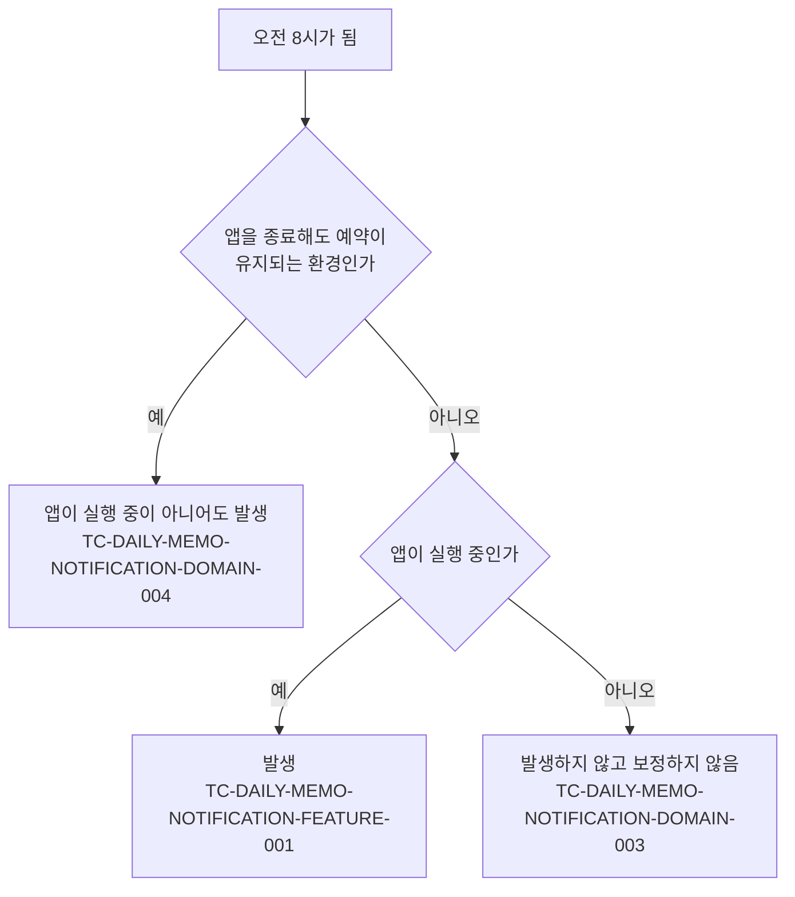

# 일일 메모 알림 테스트 케이스

기준 스펙: [일일 메모 알림 스펙](../spec/daily-memo-notification.md)

## feature

### TC-DAILY-MEMO-NOTIFICATION-FEATURE-001: 오전 8시가 되면 오늘의 메모를 확인하라는 알림이 발생한다

- 근거: `feature > 오늘의 메모 확인 안내 받기`
- Given: 알림이 예약되어 있고, 현지 시각이 아직 오전 8시가 되지 않았다.
- When: 현지 시각이 오전 8시가 된다.
- Then: 오늘 작성한 메모가 있는지와 관계없이 오늘의 메모를 확인하라는 안내 알림이 한 번 발생한다.

### TC-DAILY-MEMO-NOTIFICATION-FEATURE-002: 알림은 매일 오전 8시마다 반복해서 발생한다

- 근거: `feature > 오늘의 메모 확인 안내 받기`
- Given: 오전 8시에 알림이 한 번 발생했고, 예약이 유지되고 있다.
- When: 다음 날 현지 시각이 오전 8시가 된다.
- Then: 같은 안내 알림이 다시 한 번 발생한다.

### TC-DAILY-MEMO-NOTIFICATION-FEATURE-003: 사용자가 알림을 선택하면 앱이 열린다

- 근거: `feature > 알림에서 앱 열기`
- Given: 알림이 발생해 사용자에게 표시되어 있다.
- When: 사용자가 알림을 선택한다.
- Then: 앱이 열리고 앱을 직접 실행했을 때와 같은 화면에서 시작한다.
- 작성하지 않는 이유: 알림을 선택했을 때 앱을 여는 동작은 각 플랫폼의 알림 시스템이 수행하며, 현재 테스트 환경은 실제 알림 표시와 선택을 재현하지 않는다. 알림 표시와 선택을 제어할 수 있는 테스트 환경이 제공되면 자동화한다.

### TC-DAILY-MEMO-NOTIFICATION-FEATURE-004: 같은 날의 알림은 사용자에게 하나만 보인다

- 근거: `domain > 하루에 표시되는 알림`
- Given: 같은 날 같은 안내 알림이 이미 한 번 발생해 표시되어 있다.
- When: 같은 날 안내 알림이 다시 발생한다.
- Then: 나중에 발생한 알림이 앞서 발생한 알림을 대신해 사용자에게는 같은 안내가 하나만 남는다.
- 작성하지 않는 이유: 표시된 알림이 몇 개 남는지는 각 플랫폼의 알림 목록에서만 관찰할 수 있고, 현재 테스트 환경은 실제 알림 목록을 확인하지 않는다. 표시된 알림 목록을 확인할 수 있는 테스트 환경이 제공되면 자동화한다.

## domain

스펙 `domain > 알림 예약이 유지되는 범위`가 정의한 경로와 각 경로를 덮는 케이스는 다음과 같다.

### TC-DAILY-MEMO-NOTIFICATION-DOMAIN-001: 알림 발생 시각은 현재 시각을 기준으로 다음에 오는 오전 8시다

- 근거: `domain > 발생 시각`
- Given: 현지 시각이 정해져 있고, 알림 예약을 시작한다.
- When: 앱이 알림을 예약한다.
- Then: 알림은 기대 발생 시각에 발생한다.
- 테스트 데이터:

  | 예약 시점의 현지 시각 | 기대 발생 시각 |
  | --- | --- |
  | 오전 0시 0분 | 같은 날 오전 8시 |
  | 오전 7시 59분 | 같은 날 오전 8시 |
  | 오전 8시 0분 | 같은 날 오전 8시 |
  | 오전 8시 1분 | 다음 날 오전 8시 |
  | 오후 11시 59분 | 다음 날 오전 8시 |

### TC-DAILY-MEMO-NOTIFICATION-DOMAIN-002: 기기의 시간대가 바뀌면 바뀐 시간대의 오전 8시를 따른다

- 근거: `domain > 발생 시각`
- Given: 기기의 시간대가 정해져 있고, 같은 절대 시각에 알림 발생 시각을 정한다.
- When: 앱이 다음 알림 발생 시각을 정한다.
- Then: 알림은 그 시간대의 오전 8시에 해당하는 시각에 발생하고, 시간대가 다르면 같은 절대 시각에 정해도 발생 시각이 서로 다르다.
- 테스트 데이터:

  | 기기의 시간대 |
  | --- |
  | UTC보다 앞선 시간대 |
  | UTC |
  | UTC보다 늦은 시간대 |

### TC-DAILY-MEMO-NOTIFICATION-DOMAIN-003: 앱이 실행 중이 아닌 동안 지나간 오전 8시의 알림은 보정하지 않는다

- 근거: `domain > 알림 예약이 유지되는 범위`
- Given: 앱을 종료해도 예약이 유지되지 않는 환경이고, 현지 시각이 오전 8시를 지난 오전 10시다.
- When: 앱이 시작해 알림을 예약한다.
- Then: 지나간 오전 8시의 알림이 발생하지 않고, 다음 날 오전 8시에 처음으로 알림이 발생한다.

### TC-DAILY-MEMO-NOTIFICATION-DOMAIN-004: 앱을 종료하거나 기기를 다시 시작해도 예약이 유지된다

- 근거: `domain > 알림 예약이 유지되는 범위`
- Given: 앱을 종료해도 예약이 유지되는 환경에서 알림이 예약되어 있다.
- When: 사용자가 앱을 종료하거나 기기를 다시 시작한 뒤 현지 시각이 오전 8시가 된다.
- Then: 알림이 발생한다.
- 작성하지 않는 이유: 앱 종료와 기기 재시작 이후의 예약 유지는 플랫폼의 예약 저장소가 소유하며, 현재 테스트 환경은 앱 프로세스 종료와 기기 재시작을 재현하지 않는다. 프로세스 종료와 재시작을 재현할 수 있는 테스트 환경이 제공되면 자동화한다.

### TC-DAILY-MEMO-NOTIFICATION-DOMAIN-005: 알림 권한이 허용되어 있지 않으면 알림이 사용자에게 보이지 않는다

- 근거: `domain > 발생 조건`
- Given: 알림 권한이 허용되어 있지 않고, 알림이 예약되어 있다.
- When: 현지 시각이 오전 8시가 된다.
- Then: 알림이 사용자에게 보이지 않고, 앱은 이를 사용자에게 따로 안내하지 않는다.
- 작성하지 않는 이유: 권한이 없는 알림을 표시하지 않는 판단은 각 플랫폼의 알림 시스템이 소유하며, 현재 테스트 환경은 실제 플랫폼의 권한 상태를 만들지 못한다. 플랫폼의 권한 상태를 제어할 수 있는 테스트 환경이 제공되면 자동화한다.

### TC-DAILY-MEMO-NOTIFICATION-DOMAIN-006: 예약을 다시 요청해도 예약은 하나로 유지되고 발생 시각이 앞당겨지지 않는다

- 근거: `domain > 실행 경계에서의 유지`
- Given: 알림이 이미 예약되어 있고, 아직 오전 8시가 되지 않았다.
- When: 앱이 같은 알림 예약을 다시 요청한다.
- Then: 예약은 하나로 유지되고, 알림은 원래 예약된 오전 8시에 한 번만 발생한다.

### TC-DAILY-MEMO-NOTIFICATION-DOMAIN-007: 화면이 재생성되거나 백그라운드에서 돌아와도 예약이 바뀌지 않는다

- 근거: `domain > 실행 경계에서의 유지`
- Given: 앱 화면이 시작되어 알림이 한 번 예약되었다.
- When: 앱을 다시 시작하지 않은 채 실행 상태가 바뀐다.
- Then: 알림 예약이 사라지지 않고, 예약이 추가로 만들어지지도 않는다.
- 테스트 데이터:

  | 실행 상태 변화 |
  | --- |
  | 화면 재구성 |
  | 백그라운드로 갔다가 다시 앞으로 돌아옴 |
