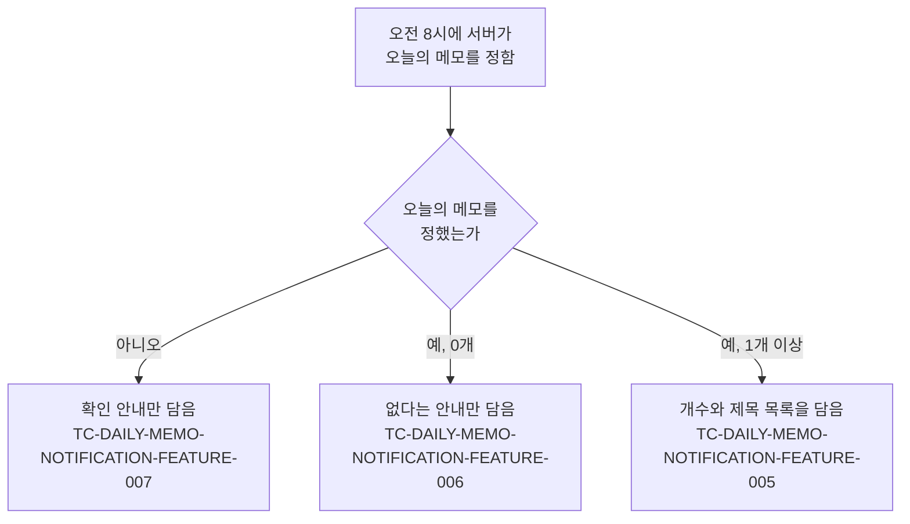
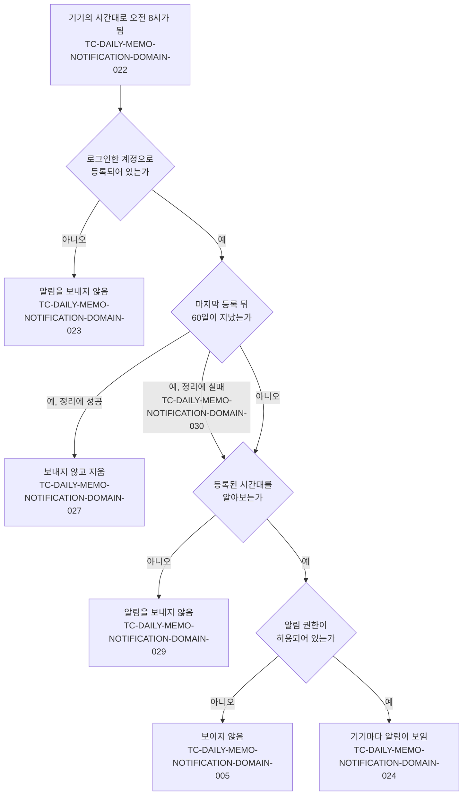

# 일일 메모 알림 테스트 케이스

기준 스펙: [일일 메모 알림 스펙(client)](../spec/client/daily-memo-notification.md), [일일 메모 알림 스펙(common)](../spec/common/daily-memo-notification.md), [일일 메모 알림 스펙(server)](../spec/server/daily-memo-notification.md)

각 케이스의 `근거`는 절이 있는 스펙 폴더를 앞에 붙여 `client > domain > 절 이름`처럼 적는다.

알림은 서버가 등록된 기기로 보내므로, 이 문서의 케이스 대부분은 서버가 정하는 발송 대상과 내용을 검증한다. 어느 기기가 언제 등록되는지는 [푸시 알림 수신 등록 테스트 케이스](./fcm-token.md)가 검증한다.

## feature

[server 스펙](../spec/server/daily-memo-notification.md) `domain > 알림 내용을 정하는 시점`이 가르는 알림 내용과 각 경로를 덮는 케이스는 다음과 같다.

### TC-DAILY-MEMO-NOTIFICATION-FEATURE-001: 오전 8시가 되면 오늘의 메모를 알려 주는 알림이 발생한다

- 근거: `client > feature > 오늘의 메모 확인 안내 받기`, `server > domain > 발생 조건`
- Given: 서버에 계정 A의 기기가 시간대 `Asia/Seoul`로 등록되어 있고, 계정 A에는 오늘의 메모가 없다.
- When: `Asia/Seoul`의 현지 시각이 오전 8시가 된다.
- Then: 오늘의 메모가 있는지와 관계없이 그 기기로 알림이 한 번 발송된다.
- 작성하지 않는 이유: 서버의 발송 규칙이어서 앱의 단위 테스트 환경에서 결정적으로 판정할 수 없다. 서버 정책 테스트 환경이 마련되면 작성한다.

### TC-DAILY-MEMO-NOTIFICATION-FEATURE-002: 알림은 매일 오전 8시마다 반복해서 발송된다

- 근거: `client > feature > 오늘의 메모 확인 안내 받기`
- Given: 서버에 계정 A의 기기가 등록되어 있고, 어제 오전 8시에 그 기기로 알림이 발송되었다.
- When: 등록된 시간대의 현지 시각이 다시 오전 8시가 된다.
- Then: 그 기기로 알림이 다시 한 번 발송된다.
- 작성하지 않는 이유: 서버의 발송 규칙이어서 앱의 단위 테스트 환경에서 결정적으로 판정할 수 없다. 서버 정책 테스트 환경이 마련되면 작성한다.

### TC-DAILY-MEMO-NOTIFICATION-FEATURE-003: 사용자가 알림을 선택하면 앱이 열린다

- 근거: `client > feature > 알림에서 앱 열기`, `client > domain > 표시 조건`
- Given: 테스트 데이터의 경로로 알림이 도착해 사용자에게 표시되어 있다.
- When: 사용자가 알림을 선택한다.
- Then: 앱을 직접 실행할 때와 같은 시작 지점으로 앱이 열리고, 선택한 알림은 알림 목록에서 사라진다.
- 테스트 데이터:

| 표시 경로 |
| --- |
| 앱이 화면에 보이는 동안 도착해 앱이 표시한 알림 |
| 앱이 화면에 보이지 않을 때 도착해 시스템이 표시한 알림 |

- 작성하지 않는 이유: 시스템이 표시한 알림 경로만 자동화하지 않는다. 그 알림을 만들고 선택했을 때 앱을 여는 동작은 각 플랫폼의 알림 시스템이 수행하며, 현재 테스트 환경은 시스템이 표시한 알림과 그 선택을 재현하지 않는다. 시스템 알림의 표시와 선택을 제어할 수 있는 테스트 환경이 제공되면 자동화한다.

### TC-DAILY-MEMO-NOTIFICATION-FEATURE-004: 같은 날의 알림은 한 기기에 하나만 보인다

- 근거: `client > domain > 하루에 표시되는 알림`
- Given: 같은 날 알림이 이미 한 번 도착해 표시되어 있다.
- When: 같은 날 알림이 테스트 데이터의 경로로 다시 도착한다.
- Then: 나중에 도착한 알림이 앞서 도착한 알림을 대신해 사용자에게는 알림이 하나만 남는다. 알림을 서로 대신하게 하는 정보가 다른 알림은 서로 대신하지 않는다.
- 테스트 데이터:

| 표시 경로 |
| --- |
| 앱이 화면에 보이는 동안 도착해 앱이 표시한 알림 |
| 앱이 화면에 보이지 않을 때 도착해 시스템이 표시한 알림 |

- 작성하지 않는 이유: 시스템이 표시한 알림 경로만 자동화하지 않는다. 그 알림이 몇 개 남는지는 각 플랫폼의 알림 목록에서만 관찰할 수 있고, 현재 테스트 환경은 시스템이 표시한 알림 목록을 확인하지 않는다. 시스템 알림 목록을 제어할 수 있는 테스트 환경이 제공되면 자동화한다. 발송 요청에 담기는 같은 날 알림 식별 값은 TC-DAILY-MEMO-NOTIFICATION-DATA-003이 덮는다.

### TC-DAILY-MEMO-NOTIFICATION-FEATURE-005: 오늘의 메모가 있으면 알림에 개수와 제목 목록이 담긴다

- 근거: `client > feature > 오늘의 메모 확인 안내 받기`
- Given: 서버에 계정 A의 기기가 등록되어 있고, 계정 A에 오늘의 메모가 세 개 저장되어 있다.
- When: 등록된 시간대의 현지 시각이 오전 8시가 된다.
- Then: 발송된 알림에 오늘의 메모가 세 개라는 개수와 세 메모의 제목이 스펙의 순서대로 한 줄에 하나씩 담긴다.
- 작성하지 않는 이유: 서버의 발송 규칙이어서 앱의 단위 테스트 환경에서 결정적으로 판정할 수 없다. 서버 정책 테스트 환경이 마련되면 작성한다.

### TC-DAILY-MEMO-NOTIFICATION-FEATURE-006: 오늘의 메모가 없으면 없다는 안내만 담고 제목 목록을 두지 않는다

- 근거: `client > feature > 오늘의 메모 확인 안내 받기`
- Given: 서버에 계정 A의 기기가 등록되어 있고, 계정 A에 오늘의 메모가 하나도 없다.
- When: 등록된 시간대의 현지 시각이 오전 8시가 된다.
- Then: 발송된 알림은 오늘의 메모가 없다는 안내만 담고 제목 목록을 두지 않는다.
- 작성하지 않는 이유: 서버의 발송 규칙이어서 앱의 단위 테스트 환경에서 결정적으로 판정할 수 없다. 서버 정책 테스트 환경이 마련되면 작성한다.

### TC-DAILY-MEMO-NOTIFICATION-FEATURE-007: 오늘의 메모를 정하지 못하면 확인 안내만 담아 알림을 보낸다

- 근거: `server > domain > 알림 내용을 정하는 시점`, `server > data > 오늘의 메모 조회`
- Given: 서버에 계정 A의 기기가 등록되어 있고, 서버가 계정 A의 메모를 조회하면 실패하도록 준비되어 있다.
- When: 등록된 시간대의 현지 시각이 오전 8시가 된다.
- Then: 알림이 한 번 발송되고, 오늘의 메모를 확인하라는 안내만 담고 개수와 제목 목록을 두지 않으며, 사용자에게 실패를 따로 알리지 않는다.
- 작성하지 않는 이유: 서버의 발송 규칙이어서 앱의 단위 테스트 환경에서 결정적으로 판정할 수 없다. 서버 정책 테스트 환경이 마련되면 작성한다.

### TC-DAILY-MEMO-NOTIFICATION-FEATURE-008: 받은 알림의 제목과 본문을 고치지 않고 그대로 표시한다

- 근거: `client > domain > 표시 조건`
- Given: Android에서 테스트 데이터의 경로로 테스트 데이터의 제목과 본문을 담은 알림이 도착한다.
- When: 기기가 알림을 표시한다.
- Then: 표시된 알림의 제목과 본문이 테스트 데이터의 기대 결과와 같다.
- 테스트 데이터:

| 표시 경로 | 받은 본문 | 기대 결과 |
| --- | --- | --- |
| 앱이 화면에 보이는 동안 도착해 앱이 표시한 알림 | 여러 줄의 본문 | 받은 제목과 본문을 그대로 표시하고, 펼치면 본문 전체가 보인다 |
| 앱이 화면에 보이는 동안 도착해 앱이 표시한 알림 | 본문 없음 | 받은 제목만 표시하고 본문 문구를 두지 않는다 |
| 앱이 화면에 보이지 않을 때 도착해 시스템이 표시한 알림 | 여러 줄의 본문 | 받은 제목과 본문을 그대로 표시한다 |

- 작성하지 않는 이유: 시스템이 표시한 알림 경로만 자동화하지 않는다. 현재 테스트 환경은 시스템이 표시한 알림을 재현하지 않으며, 시스템 알림의 표시를 제어할 수 있는 테스트 환경이 제공되면 자동화한다.

### TC-DAILY-MEMO-NOTIFICATION-FEATURE-009: 앱이 화면에 보이는 동안 도착한 알림도 같은 알림 분류와 아이콘으로 표시한다

- 근거: `client > feature > 앱을 사용하는 중에 받은 알림`, `client > domain > 표시 조건`, `client > domain > 알림 분류`
- Given: Android에서 앱이 화면에 보이는 동안 알림이 도착한다.
- When: 기기가 알림을 표시한다.
- Then: 알림은 앱 화면 안의 안내가 아니라 알림으로 표시되고, 알림에 담긴 알림 분류로 표시되며 알림 분류가 담겨 있지 않으면 일일 메모 알림 분류로 표시되고, 앱 알림 아이콘을 쓴다.

## domain

[server 스펙](../spec/server/daily-memo-notification.md) `domain > 발송 대상`과 [client 스펙](../spec/client/daily-memo-notification.md) `domain > 표시 조건`이 정의한 경로와 각 경로를 덮는 케이스는 다음과 같다.

### TC-DAILY-MEMO-NOTIFICATION-DOMAIN-005: 알림 권한이 허용되어 있지 않으면 알림이 사용자에게 보이지 않는다

- 근거: `client > domain > 표시 조건`
- Given: 알림 권한이 허용되어 있지 않은 기기가 서버에 등록되어 있다.
- When: 등록된 시간대의 현지 시각이 오전 8시가 되어 알림이 도착한다.
- Then: 알림이 사용자에게 보이지 않고, 앱은 이를 사용자에게 따로 안내하지 않는다.
- 작성하지 않는 이유: 권한이 없는 알림을 표시하지 않는 판단은 각 플랫폼의 알림 시스템이 소유하며, 현재 테스트 환경은 실제 플랫폼의 권한 상태를 만들지 못한다. 플랫폼의 권한 상태를 제어할 수 있는 테스트 환경이 제공되면 자동화한다.

### TC-DAILY-MEMO-NOTIFICATION-DOMAIN-008: 기간이 알림이 발생하는 날과 하루라도 겹치는 메모만 오늘의 메모다

- 근거: `server > domain > 오늘의 메모`
- Given: 서버에 계정 A와 연결된 완료되지 않고 삭제되지 않은 메모가 여러 기간으로 저장되어 있고, 알림이 발생하는 날이 정해져 있다.
- When: 서버가 그 날의 계정 A의 오늘의 메모를 정한다.
- Then: 기대 결과대로 포함되거나 제외된다.
- 테스트 데이터:

  | 메모의 기간 | 기대 결과 |
  | --- | --- |
  | 그 날 하루 | 포함 |
  | 이틀 전부터 그 날까지 | 포함 |
  | 그 날부터 이틀 뒤까지 | 포함 |
  | 이틀 전부터 이틀 뒤까지 | 포함 |
  | 이틀 전부터 하루 전까지 | 제외 |
  | 하루 뒤부터 이틀 뒤까지 | 제외 |
  | 기간 없음 | 제외 |

- 작성하지 않는 이유: 서버의 조회 규칙이어서 앱의 단위 테스트 환경에서 결정적으로 판정할 수 없다. 서버 정책 테스트 환경이 마련되면 작성한다.

### TC-DAILY-MEMO-NOTIFICATION-DOMAIN-009: 시각이 있는 기간의 겹침도 날짜만으로 판단한다

- 근거: `server > domain > 오늘의 메모`
- Given: 서버에 계정 A와 연결된 시각이 있는 기간의 메모가 저장되어 있고, 알림이 발생하는 날이 정해져 있다.
- When: 서버가 그 날의 계정 A의 오늘의 메모를 정한다.
- Then: 시각을 무시하고 시작일과 종료일만으로 판단해 기대 결과대로 포함되거나 제외된다.
- 테스트 데이터:

  | 메모의 기간 | 기대 결과 |
  | --- | --- |
  | 하루 전 오후 11시부터 그 날 오전 0시 30분까지 | 포함 |
  | 그 날 오후 11시 30분부터 하루 뒤 오전 1시까지 | 포함 |
  | 하루 전 오전 9시부터 하루 전 오후 11시 59분까지 | 제외 |

- 작성하지 않는 이유: 서버의 조회 규칙이어서 앱의 단위 테스트 환경에서 결정적으로 판정할 수 없다. 서버 정책 테스트 환경이 마련되면 작성한다.

### TC-DAILY-MEMO-NOTIFICATION-DOMAIN-010: 완료된 메모는 오늘의 메모에서 제외한다

- 근거: `server > domain > 오늘의 메모`
- Given: 서버에 계정 A와 연결된, 알림이 발생하는 날과 겹치는 완료된 메모와 완료되지 않은 메모가 저장되어 있다.
- When: 서버가 그 날의 계정 A의 오늘의 메모를 정한다.
- Then: 완료되지 않은 메모만 포함되고 완료된 메모는 제외된다.
- 작성하지 않는 이유: 서버의 조회 규칙이어서 앱의 단위 테스트 환경에서 결정적으로 판정할 수 없다. 서버 정책 테스트 환경이 마련되면 작성한다.

### TC-DAILY-MEMO-NOTIFICATION-DOMAIN-011: 삭제된 메모는 오늘의 메모에서 제외한다

- 근거: `server > domain > 오늘의 메모`
- Given: 서버에 계정 A와 연결된, 알림이 발생하는 날과 겹치는 삭제된 메모와 삭제되지 않은 메모가 저장되어 있다.
- When: 서버가 그 날의 계정 A의 오늘의 메모를 정한다.
- Then: 삭제되지 않은 메모만 포함되고 삭제된 메모는 제외된다.
- 작성하지 않는 이유: 서버의 조회 규칙이어서 앱의 단위 테스트 환경에서 결정적으로 판정할 수 없다. 서버 정책 테스트 환경이 마련되면 작성한다.

### TC-DAILY-MEMO-NOTIFICATION-DOMAIN-012: 등록된 기기에 연결된 계정의 메모만 오늘의 메모다

- 근거: `server > domain > 오늘의 메모`
- Given: 서버에 계정 A와 계정 B에 각각 알림이 발생하는 날과 겹치는 메모가 저장되어 있고, 기기는 계정 A로 등록되어 있다.
- When: 서버가 그 기기의 오늘의 메모를 정한다.
- Then: 계정 A와 연결된 메모만 포함된다.
- 작성하지 않는 이유: 서버의 조회 규칙이어서 앱의 단위 테스트 환경에서 결정적으로 판정할 수 없다. 서버 정책 테스트 환경이 마련되면 작성한다.

### TC-DAILY-MEMO-NOTIFICATION-DOMAIN-013: 오늘의 메모 순서는 캘린더 메모의 조회 결과 정렬을 따른다

- 근거: `server > domain > 오늘의 메모`
- Given: 서버에 계정 A와 연결된, 알림이 발생하는 날과 겹치는 종일 메모와 시각이 있는 메모가 테스트 데이터의 시작, 종료, 제목으로 저장되어 있다.
- When: 서버가 그 날의 계정 A의 오늘의 메모를 정한다.
- Then: 종일 메모가 시각이 있는 메모보다 앞에 오고, 같은 형태 안에서는 테스트 데이터의 기준으로 나열된다.
- 테스트 데이터:

  | 형태 | 시작이 다를 때 | 시작이 같을 때 | 시작과 종료가 모두 같을 때 |
  | --- | --- | --- | --- |
  | 종일 메모 | 시작이 이른 순 | 종료가 늦은 순 | 제목의 오름차순 |
  | 시각이 있는 메모 | 시각을 포함한 시작이 이른 순 | 시각을 포함한 종료가 이른 순 | 제목의 오름차순 |

- 작성하지 않는 이유: 서버의 조회 규칙이어서 앱의 단위 테스트 환경에서 결정적으로 판정할 수 없다. 서버 정책 테스트 환경이 마련되면 작성한다.

### TC-DAILY-MEMO-NOTIFICATION-DOMAIN-016: 알림이 발생하는 날은 기기가 등록한 시간대의 날짜다

- 근거: `server > domain > 오늘의 메모`, `server > data > 오늘의 메모 조회`
- Given: 서버에 계정 A의 기기가 시간대 `Asia/Seoul`로 등록되어 있고, 계정 A에는 `Asia/Seoul` 기준 오늘 하루짜리 메모 한 개와 어제 하루짜리 메모 한 개가 저장되어 있다.
- When: `Asia/Seoul`의 현지 시각이 오전 8시가 된다. 이때 UTC의 날짜는 아직 어제다.
- Then: 발송된 알림에는 `Asia/Seoul` 기준 오늘의 메모만 담기고, UTC 날짜인 어제의 메모는 담기지 않는다.
- 작성하지 않는 이유: 서버의 조회 규칙이어서 앱의 단위 테스트 환경에서 결정적으로 판정할 수 없다. 서버 정책 테스트 환경이 마련되면 작성한다.

### TC-DAILY-MEMO-NOTIFICATION-DOMAIN-022: 알림은 기기가 등록한 시간대의 오전 8시에 발송된다

- 근거: `server > domain > 발생 시각`
- Given: 서버에 서로 다른 시간대로 등록된 기기가 여러 대 있다.
- When: 시각이 흐른다.
- Then: 각 기기로 그 시간대의 오전 8시에 해당하는 절대 시각에 알림이 한 번 발송되고, 다른 시간대의 오전 8시에는 발송되지 않는다.
- 테스트 데이터:

  | 등록된 시간대 | 오전 8시에 해당하는 UTC 시각 |
  | --- | --- |
  | `Asia/Seoul` | 전날 23:00 |
  | `UTC` | 08:00 |
  | `America/New_York` (표준시) | 13:00 |
  | `Asia/Kolkata` | 02:30 |

- 작성하지 않는 이유: 서버의 발송 규칙이어서 앱의 단위 테스트 환경에서 결정적으로 판정할 수 없다. 서버 정책 테스트 환경이 마련되면 작성한다.

### TC-DAILY-MEMO-NOTIFICATION-DOMAIN-023: 서버에 등록되지 않은 기기에는 알림을 보내지 않는다

- 근거: `client > domain > 알림을 받는 기기`, `server > domain > 발송 대상`
- Given: 서버에 기기 1이 계정 A로 등록되어 있고, 기기 2는 테스트 데이터의 이유로 등록되어 있지 않다.
- When: 등록된 시간대의 현지 시각이 오전 8시가 된다.
- Then: 기기 1로만 알림이 발송되고 기기 2로는 발송되지 않는다.
- 테스트 데이터:

  | 기기 2가 등록되어 있지 않은 이유 |
  | --- |
  | 게스트 상태여서 해제됨 |
  | 로그아웃해 해제됨 |
  | 한 번도 등록되지 않음 |

- 작성하지 않는 이유: 서버의 발송 규칙이어서 앱의 단위 테스트 환경에서 결정적으로 판정할 수 없다. 서버 정책 테스트 환경이 마련되면 작성한다.

### TC-DAILY-MEMO-NOTIFICATION-DOMAIN-024: 같은 계정의 여러 기기는 기기마다 등록된 시간대와 언어로 알림을 받는다

- 근거: `client > domain > 알림을 받는 기기`, `server > domain > 발송 대상`, `server > domain > 알림 문구의 언어`
- Given: 서버에 계정 A의 기기 1이 시간대 `Asia/Seoul`, 언어 `ko-KR`로, 기기 2가 시간대 `America/New_York`, 언어 `en-US`로 등록되어 있다.
- When: 각 시간대의 현지 시각이 오전 8시가 된다.
- Then: 기기 1로는 `Asia/Seoul`의 오전 8시에 한국어 알림이, 기기 2로는 `America/New_York`의 오전 8시에 영어 알림이 각각 한 번 발송된다.
- 작성하지 않는 이유: 서버의 발송 규칙이어서 앱의 단위 테스트 환경에서 결정적으로 판정할 수 없다. 서버 정책 테스트 환경이 마련되면 작성한다.

### TC-DAILY-MEMO-NOTIFICATION-DOMAIN-025: 시간대가 다시 등록되면 그 뒤부터 새 시간대의 오전 8시에 발송된다

- 근거: `server > domain > 발생 시각`
- Given: 서버에 계정 A의 기기가 시간대 `Asia/Seoul`로 등록되어 있다.
- When: 같은 기기가 시간대 `America/New_York`로 다시 등록된 뒤 시각이 흐른다.
- Then: 다시 등록된 뒤에는 `America/New_York`의 오전 8시에 알림이 발송되고 `Asia/Seoul`의 오전 8시에는 발송되지 않는다.
- 작성하지 않는 이유: 서버의 발송 규칙이어서 앱의 단위 테스트 환경에서 결정적으로 판정할 수 없다. 서버 정책 테스트 환경이 마련되면 작성한다.

### TC-DAILY-MEMO-NOTIFICATION-DOMAIN-026: 알림 내용은 발송 시점에 서버에 반영된 메모로 정한다

- 근거: `server > domain > 알림 내용을 정하는 시점`
- Given: 서버에 계정 A의 기기가 등록되어 있고, 계정 A에 오늘의 메모가 하나 저장되어 있다.
- When: 오전 8시 전에 다른 기기에서 오늘의 메모 하나가 서버에 반영되고, 이 기기에서 만든 오늘의 메모 하나는 서버에 반영되지 않은 채 오전 8시가 된다.
- Then: 발송된 알림에는 서버에 반영된 두 메모만 담기고 반영되지 않은 메모는 담기지 않는다.
- 작성하지 않는 이유: 서버의 발송 규칙이어서 앱의 단위 테스트 환경에서 결정적으로 판정할 수 없다. 서버 정책 테스트 환경이 마련되면 작성한다.

### TC-DAILY-MEMO-NOTIFICATION-DOMAIN-027: 마지막 등록 뒤 60일이 지난 등록에는 보내지 않고 서버에서 지운다

- 근거: `server > data > 오래 남은 수신 정보의 정리`
- Given: 서버에 계정 A의 기기가 테스트 데이터의 시점에 마지막으로 등록되어 있다.
- When: 등록된 시간대의 현지 시각이 오전 8시가 된다.
- Then: 기대 결과대로 발송되거나, 발송되지 않고 그 등록이 서버에서 지워진다.
- 테스트 데이터:

  | 마지막 등록 시점 | 기대 결과 |
  | --- | --- |
  | 59일 전 | 발송 |
  | 60일 전 | 발송하지 않고 지움 |
  | 61일 전 | 발송하지 않고 지움 |

- 작성하지 않는 이유: 서버의 정리 규칙이어서 앱의 단위 테스트 환경에서 결정적으로 판정할 수 없다. 서버 정책 테스트 환경이 마련되면 작성한다.

### TC-DAILY-MEMO-NOTIFICATION-DOMAIN-028: 알림 문구는 등록된 언어를 따르고 지원하지 않는 언어는 영어로 만든다

- 근거: `server > domain > 알림 문구의 언어`
- Given: 서버에 계정 A의 기기가 테스트 데이터의 언어로 등록되어 있다.
- When: 등록된 시간대의 현지 시각이 오전 8시가 된다.
- Then: 발송된 알림의 문구가 기대 언어로 만들어진다.
- 테스트 데이터:

  | 등록된 언어 | 기대 언어 |
  | --- | --- |
  | `ko-KR` | 한국어 |
  | `ko` | 한국어 |
  | `en-US` | 영어 |
  | `ja-JP` | 영어 |
  | `kok-IN` | 영어 |

- 작성하지 않는 이유: 서버의 발송 규칙이어서 앱의 단위 테스트 환경에서 결정적으로 판정할 수 없다. 서버 정책 테스트 환경이 마련되면 작성한다.

### TC-DAILY-MEMO-NOTIFICATION-DOMAIN-029: 서버가 알아보지 못하는 시간대로 등록된 기기에는 알림을 보내지 않는다

- 근거: `server > domain > 발송 대상`
- Given: 서버에 계정 A의 기기 1이 시간대 `Asia/Seoul`로, 기기 2가 서버가 알아보지 못하는 시간대 이름으로 등록되어 있다.
- When: 시각이 흘러 `Asia/Seoul`의 현지 시각이 오전 8시가 된다.
- Then: 기기 1로만 알림이 발송되고, 기기 2로는 어느 시각에도 발송되지 않으며 사용자에게도 알리지 않는다.
- 작성하지 않는 이유: 서버의 발송 규칙이어서 앱의 단위 테스트 환경에서 결정적으로 판정할 수 없다. 서버 정책 테스트 환경이 마련되면 작성한다.

### TC-DAILY-MEMO-NOTIFICATION-DOMAIN-030: 오래 남은 등록의 정리에 실패하면 그 회차에는 그 등록에도 알림을 보낸다

- 근거: `server > data > 오래 남은 수신 정보의 정리`
- Given: 서버에 계정 A의 기기가 61일 전에 마지막으로 등록되어 있고, 그 회차의 오래 남은 등록 정리가 실패하도록 준비되어 있다.
- When: 등록된 시간대의 현지 시각이 오전 8시가 된다.
- Then: 그 회차의 발송은 계속되어 그 기기로 알림이 한 번 발송되고, 그 등록은 서버에 남는다.
- 작성하지 않는 이유: 서버의 정리 규칙이어서 앱의 단위 테스트 환경에서 결정적으로 판정할 수 없다. 서버 정책 테스트 환경이 마련되면 작성한다.

### TC-DAILY-MEMO-NOTIFICATION-DOMAIN-031: Android에서 앱이 시작되면 일일 메모 알림 분류를 한 번만 만든다

- 근거: `client > domain > 알림 분류`
- Given: Android 기기에 일일 메모 알림 분류가 아직 없다.
- When: 앱이 시작되고, 그 뒤 앱이 다시 시작된다.
- Then: 일일 메모 알림 분류가 디자인이 정한 이름과 설명으로 만들어지고, 다시 시작해도 알림 분류는 하나만 남는다.

## data

### TC-DAILY-MEMO-NOTIFICATION-DATA-003: 발송 요청에는 같은 날 알림 식별 값과 그날이 끝나는 도착 기한을 담는다

- 근거: `server > data > 발송`, `common > domain > 알림에 담기는 정보`
- Given: 서버에 계정 A의 기기가 시간대 `Asia/Seoul`로 등록되어 있다.
- When: `Asia/Seoul`의 현지 시각이 오전 8시가 되어 알림이 발송된다.
- Then: 알림 전송 수단으로 보낸 요청에 모든 일일 메모 알림이 같은 값을 갖는 같은 날 알림 식별 값과, `Asia/Seoul` 기준 그날이 끝나는 시점의 도착 기한이 담긴다.
- 작성하지 않는 이유: 서버의 발송 요청 계약이어서 앱의 단위 테스트 환경에서 결정적으로 판정할 수 없다. 서버 정책 테스트 환경이 마련되면 작성한다.

### TC-DAILY-MEMO-NOTIFICATION-DATA-004: 발송 요청에는 서버가 만든 제목과 본문이 담기고 화면을 정하는 추가 정보는 담지 않는다

- 근거: `server > data > 발송`, `common > domain > 알림 내용`, `common > domain > 알림에 담기는 정보`
- Given: 서버에 계정 A의 기기가 등록되어 있고, 계정 A에 오늘의 메모가 두 개 저장되어 있다.
- When: 등록된 시간대의 현지 시각이 오전 8시가 되어 알림이 발송된다.
- Then: 알림 전송 수단으로 보낸 요청에 표시할 제목과 본문이 그대로 담기고, 같은 날 알림 식별 값, 도착 기한, Android의 알림 분류와 알림 아이콘이 함께 담기며, 앱이 읽어 화면을 정하는 추가 정보는 담기지 않는다.
- 작성하지 않는 이유: 서버의 발송 요청 계약이어서 앱의 단위 테스트 환경에서 결정적으로 판정할 수 없다. 서버 정책 테스트 환경이 마련되면 작성한다.

### TC-DAILY-MEMO-NOTIFICATION-DATA-005: 한 기기로의 발송이 실패해도 다른 기기로의 발송은 계속하고 같은 날 다시 보내지 않는다

- 근거: `server > data > 발송`
- Given: 서버에 같은 시간대로 등록된 기기 1, 기기 2, 기기 3이 있고, 기기 2로의 요청만 테스트 데이터의 이유로 실패한다.
- When: 그 시간대의 현지 시각이 오전 8시가 된다.
- Then: 기기 1과 기기 3으로 알림이 발송되고, 기기 2에는 같은 날 다시 발송하지 않으며, 기기 2의 실패가 서버 오류 기록으로 한 번 남고 사용자에게는 알리지 않는다.
- 테스트 데이터:

  | 기기 2로의 요청이 실패하는 이유 |
  | --- |
  | Firebase가 일시적인 오류로 응답 |
  | 요청 중에 통신이 끊김 |
- 작성하지 않는 이유: 서버의 발송 규칙이어서 앱의 단위 테스트 환경에서 결정적으로 판정할 수 없다. 서버 정책 테스트 환경이 마련되면 작성한다.

### TC-DAILY-MEMO-NOTIFICATION-DATA-006: Firebase가 유효하지 않다고 답한 수신 정보는 서버에서 지운다

- 근거: `server > data > 오래 남은 수신 정보의 정리`
- Given: 서버에 같은 시간대로 등록된 기기 1과 기기 2가 있고, Firebase가 기기 2로의 요청에 수신 정보가 더 이상 유효하지 않다고 응답한다.
- When: 그 시간대의 현지 시각이 오전 8시가 된다.
- Then: 서버에는 기기 1의 등록만 남고 기기 2의 등록은 지워진다.
- 작성하지 않는 이유: 서버의 정리 규칙이어서 앱의 단위 테스트 환경에서 결정적으로 판정할 수 없다. 서버 정책 테스트 환경이 마련되면 작성한다.
