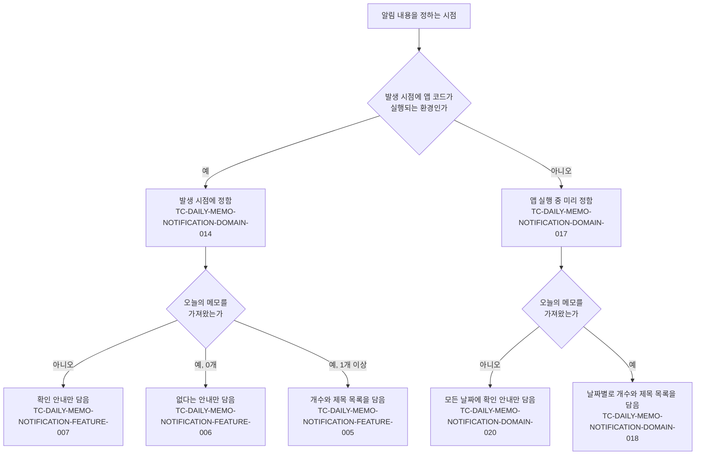
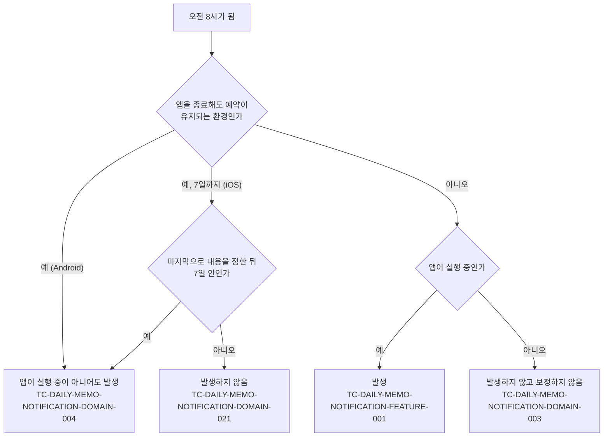

# 일일 메모 알림 테스트 케이스

기준 스펙: [일일 메모 알림 스펙](../spec/daily-memo-notification.md)

## feature

스펙 `domain > 알림 내용을 정하는 시점`이 가르는 알림 내용과 각 경로를 덮는 케이스는 다음과 같다.

### TC-DAILY-MEMO-NOTIFICATION-FEATURE-001: 오전 8시가 되면 오늘의 메모를 알려 주는 알림이 발생한다

- 근거: `feature > 오늘의 메모 확인 안내 받기`
- Given: 알림이 예약되어 있고, 현지 시각이 아직 오전 8시가 되지 않았다.
- When: 현지 시각이 오전 8시가 된다.
- Then: 오늘의 메모가 있는지와 관계없이 알림이 한 번 발생한다.

### TC-DAILY-MEMO-NOTIFICATION-FEATURE-002: 알림은 매일 오전 8시마다 반복해서 발생한다

- 근거: `feature > 오늘의 메모 확인 안내 받기`
- Given: 오전 8시에 알림이 한 번 발생했고, 예약이 유지되고 있다.
- When: 다음 날 현지 시각이 오전 8시가 된다.
- Then: 알림이 다시 한 번 발생한다.

### TC-DAILY-MEMO-NOTIFICATION-FEATURE-003: 사용자가 알림을 선택하면 앱이 열린다

- 근거: `feature > 알림에서 앱 열기`
- Given: 알림이 발생해 사용자에게 표시되어 있다.
- When: 사용자가 알림을 선택한다.
- Then: 앱이 열리고 앱을 직접 실행했을 때와 같은 화면에서 시작한다.
- 작성하지 않는 이유: 알림을 선택했을 때 앱을 여는 동작은 각 플랫폼의 알림 시스템이 수행하며, 현재 테스트 환경은 실제 알림 표시와 선택을 재현하지 않는다. 알림 표시와 선택을 제어할 수 있는 테스트 환경이 제공되면 자동화한다.

### TC-DAILY-MEMO-NOTIFICATION-FEATURE-004: 같은 날의 알림은 사용자에게 하나만 보인다

- 근거: `domain > 하루에 표시되는 알림`
- Given: 같은 날 알림이 이미 한 번 발생해 표시되어 있다.
- When: 같은 날 알림이 다시 발생한다.
- Then: 나중에 발생한 알림이 앞서 발생한 알림을 대신해 사용자에게는 알림이 하나만 남는다.
- 작성하지 않는 이유: 표시된 알림이 몇 개 남는지는 각 플랫폼의 알림 목록에서만 관찰할 수 있고, 현재 테스트 환경은 실제 알림 목록을 확인하지 않는다. 표시된 알림 목록을 확인할 수 있는 테스트 환경이 제공되면 자동화한다.

### TC-DAILY-MEMO-NOTIFICATION-FEATURE-005: 오늘의 메모가 있으면 알림에 개수와 제목 목록이 담긴다

- 근거: `feature > 오늘의 메모 확인 안내 받기`
- Given: 알림이 예약되어 있고, 현재 사용자 계정에 오늘의 메모가 세 개 저장되어 있다.
- When: 현지 시각이 오전 8시가 된다.
- Then: 알림에 오늘의 메모가 세 개라는 개수와 세 메모의 제목이 스펙의 순서대로 한 줄에 하나씩 담긴다.

### TC-DAILY-MEMO-NOTIFICATION-FEATURE-006: 오늘의 메모가 없으면 없다는 안내만 담고 제목 목록을 두지 않는다

- 근거: `feature > 오늘의 메모 확인 안내 받기`
- Given: 알림이 예약되어 있고, 현재 사용자 계정에 오늘의 메모가 하나도 없다.
- When: 현지 시각이 오전 8시가 된다.
- Then: 알림은 오늘의 메모가 없다는 안내만 담고 제목 목록을 두지 않는다.

### TC-DAILY-MEMO-NOTIFICATION-FEATURE-007: 오늘의 메모를 가져오지 못하면 확인 안내만 담아 알림을 보낸다

- 근거: `domain > 알림 내용을 정하는 시점`
- Given: 알림이 예약되어 있고, 기기에 저장된 메모를 조회하면 실패하도록 준비되어 있다.
- When: 현지 시각이 오전 8시가 된다.
- Then: 알림이 한 번 발생하고, 오늘의 메모를 확인하라는 안내만 담고 개수와 제목 목록을 두지 않는다.

## domain

스펙 `domain > 알림 예약이 유지되는 범위`가 정의한 경로와 각 경로를 덮는 케이스는 다음과 같다.

### TC-DAILY-MEMO-NOTIFICATION-DOMAIN-001: 알림 발생 시각은 현재 시각을 기준으로 다음에 오는 오전 8시다

- 근거: `domain > 발생 시각`
- Given: 현지 시각이 정해져 있고, 알림 예약을 시작한다.
- When: 앱이 알림을 예약한다.
- Then: 알림은 기대 발생 시각에 발생한다.
- 테스트 데이터:

  | 예약 시점의 현지 시각 | 기대 발생 시각 |
  | --- | --- |
  | 오전 0시 0분 | 같은 날 오전 8시 |
  | 오전 7시 59분 | 같은 날 오전 8시 |
  | 오전 8시 0분 | 같은 날 오전 8시 |
  | 오전 8시 1분 | 다음 날 오전 8시 |
  | 오후 11시 59분 | 다음 날 오전 8시 |

### TC-DAILY-MEMO-NOTIFICATION-DOMAIN-002: 기기의 시간대가 바뀌면 바뀐 시간대의 오전 8시를 따른다

- 근거: `domain > 발생 시각`
- Given: 기기의 시간대가 정해져 있고, 같은 절대 시각에 알림 발생 시각을 정한다.
- When: 앱이 다음 알림 발생 시각을 정한다.
- Then: 알림은 그 시간대의 오전 8시에 해당하는 시각에 발생하고, 시간대가 다르면 같은 절대 시각에 정해도 발생 시각이 서로 다르다.
- 테스트 데이터:

  | 기기의 시간대 |
  | --- |
  | UTC보다 앞선 시간대 |
  | UTC |
  | UTC보다 늦은 시간대 |

### TC-DAILY-MEMO-NOTIFICATION-DOMAIN-003: 앱이 실행 중이 아닌 동안 지나간 오전 8시의 알림은 보정하지 않는다

- 근거: `domain > 알림 예약이 유지되는 범위`
- Given: 앱을 종료해도 예약이 유지되지 않는 환경이고, 현지 시각이 오전 8시를 지난 오전 10시다.
- When: 앱이 시작해 알림을 예약한다.
- Then: 지나간 오전 8시의 알림이 발생하지 않고, 다음 날 오전 8시에 처음으로 알림이 발생한다.

### TC-DAILY-MEMO-NOTIFICATION-DOMAIN-004: 앱을 종료하거나 기기를 다시 시작해도 예약이 유지된다

- 근거: `domain > 알림 예약이 유지되는 범위`
- Given: 앱을 종료해도 예약이 유지되는 환경에서 알림이 예약되어 있다.
- When: 사용자가 앱을 종료하거나 기기를 다시 시작한 뒤 현지 시각이 오전 8시가 된다.
- Then: 알림이 발생한다.
- 작성하지 않는 이유: 앱 종료와 기기 재시작 이후의 예약 유지는 플랫폼의 예약 저장소가 소유하며, 현재 테스트 환경은 앱 프로세스 종료와 기기 재시작을 재현하지 않는다. 프로세스 종료와 재시작을 재현할 수 있는 테스트 환경이 제공되면 자동화한다.

### TC-DAILY-MEMO-NOTIFICATION-DOMAIN-005: 알림 권한이 허용되어 있지 않으면 알림이 사용자에게 보이지 않는다

- 근거: `domain > 발생 조건`
- Given: 알림 권한이 허용되어 있지 않고, 알림이 예약되어 있다.
- When: 현지 시각이 오전 8시가 된다.
- Then: 알림이 사용자에게 보이지 않고, 앱은 이를 사용자에게 따로 안내하지 않는다.
- 작성하지 않는 이유: 권한이 없는 알림을 표시하지 않는 판단은 각 플랫폼의 알림 시스템이 소유하며, 현재 테스트 환경은 실제 플랫폼의 권한 상태를 만들지 못한다. 플랫폼의 권한 상태를 제어할 수 있는 테스트 환경이 제공되면 자동화한다.

### TC-DAILY-MEMO-NOTIFICATION-DOMAIN-006: 예약을 다시 요청해도 예약은 하나로 유지되고 발생 시각이 앞당겨지지 않는다

- 근거: `domain > 실행 경계에서의 유지`
- Given: 알림이 이미 예약되어 있고, 아직 오전 8시가 되지 않았다.
- When: 앱이 같은 알림 예약을 다시 요청한다.
- Then: 예약은 하나로 유지되고, 알림은 원래 예약된 오전 8시에 한 번만 발생한다.

### TC-DAILY-MEMO-NOTIFICATION-DOMAIN-007: 화면이 재생성되거나 백그라운드에서 돌아와도 예약이 바뀌지 않는다

- 근거: `domain > 실행 경계에서의 유지`
- Given: 앱 화면이 시작되어 알림이 한 번 예약되었다.
- When: 앱을 다시 시작하지 않은 채 실행 상태가 바뀐다.
- Then: 알림 예약이 사라지지 않고, 예약이 추가로 만들어지지도 않는다.
- 테스트 데이터:

  | 실행 상태 변화 |
  | --- |
  | 화면 재구성 |
  | 백그라운드로 갔다가 다시 앞으로 돌아옴 |

### TC-DAILY-MEMO-NOTIFICATION-DOMAIN-008: 기간이 알림이 발생하는 날과 하루라도 겹치는 메모만 오늘의 메모다

- 근거: `domain > 오늘의 메모`
- Given: 현재 사용자 계정에 완료되지 않고 삭제되지 않은 메모가 여러 기간으로 저장되어 있고, 알림이 발생하는 날이 정해져 있다.
- When: 그 날의 오늘의 메모를 정한다.
- Then: 기대 결과대로 포함되거나 제외된다.
- 테스트 데이터:

  | 메모의 기간 | 기대 결과 |
  | --- | --- |
  | 그 날 하루 | 포함 |
  | 이틀 전부터 그 날까지 | 포함 |
  | 그 날부터 이틀 뒤까지 | 포함 |
  | 이틀 전부터 이틀 뒤까지 | 포함 |
  | 이틀 전부터 하루 전까지 | 제외 |
  | 하루 뒤부터 이틀 뒤까지 | 제외 |
  | 기간 없음 | 제외 |

### TC-DAILY-MEMO-NOTIFICATION-DOMAIN-009: 시각이 있는 기간의 겹침도 날짜만으로 판단한다

- 근거: `domain > 오늘의 메모`
- Given: 현재 사용자 계정에 시각이 있는 기간의 메모가 저장되어 있고, 알림이 발생하는 날이 정해져 있다.
- When: 그 날의 오늘의 메모를 정한다.
- Then: 시각을 무시하고 시작일과 종료일만으로 판단해 기대 결과대로 포함되거나 제외된다.
- 테스트 데이터:

  | 메모의 기간 | 기대 결과 |
  | --- | --- |
  | 하루 전 오후 11시부터 그 날 오전 0시 30분까지 | 포함 |
  | 그 날 오후 11시 30분부터 하루 뒤 오전 1시까지 | 포함 |
  | 하루 전 오전 9시부터 하루 전 오후 11시 59분까지 | 제외 |

### TC-DAILY-MEMO-NOTIFICATION-DOMAIN-010: 완료된 메모는 오늘의 메모에서 제외한다

- 근거: `domain > 오늘의 메모`
- Given: 현재 사용자 계정에 알림이 발생하는 날과 겹치는 완료된 메모와 완료되지 않은 메모가 저장되어 있다.
- When: 그 날의 오늘의 메모를 정한다.
- Then: 완료되지 않은 메모만 포함되고 완료된 메모는 제외된다.

### TC-DAILY-MEMO-NOTIFICATION-DOMAIN-011: 삭제된 메모는 오늘의 메모에서 제외한다

- 근거: `domain > 오늘의 메모`
- Given: 현재 사용자 계정에 알림이 발생하는 날과 겹치는 삭제된 메모와 삭제되지 않은 메모가 저장되어 있다.
- When: 그 날의 오늘의 메모를 정한다.
- Then: 삭제되지 않은 메모만 포함되고 삭제된 메모는 제외된다.

### TC-DAILY-MEMO-NOTIFICATION-DOMAIN-012: 현재 사용자 계정과 연결된 메모만 오늘의 메모다

- 근거: `domain > 오늘의 메모`
- Given: 두 계정에 각각 알림이 발생하는 날과 겹치는 메모가 저장되어 있고, 현재 사용자 계정은 첫 번째 계정이다.
- When: 그 날의 오늘의 메모를 정한다.
- Then: 첫 번째 계정과 연결된 메모만 포함된다.

### TC-DAILY-MEMO-NOTIFICATION-DOMAIN-013: 오늘의 메모 순서는 캘린더 메모의 조회 결과 정렬을 따른다

- 근거: `domain > 오늘의 메모`
- Given: 현재 사용자 계정에 알림이 발생하는 날과 겹치는 종일 메모 두 개와 시각이 있는 메모 두 개가 서로 다른 시작과 제목으로 저장되어 있다.
- When: 그 날의 오늘의 메모를 정한다.
- Then: 종일 메모가 시각이 있는 메모보다 앞에 오고, 같은 형태 안에서는 시작이 이른 순으로, 시작이 같으면 제목의 오름차순으로 나열된다.

### TC-DAILY-MEMO-NOTIFICATION-DOMAIN-014: 발생 시점에 앱 코드가 실행되는 환경에서는 알림 내용을 발생 시점의 메모로 정한다

- 근거: `domain > 알림 내용을 정하는 시점`
- Given: 발생 시점에 앱 코드가 실행되는 환경에서 오전 6시에 알림이 예약되었고, 그때 현재 사용자 계정에는 오늘의 메모가 하나 있었다.
- When: 오전 7시에 오늘의 메모 하나가 추가된 뒤 현지 시각이 오전 8시가 된다.
- Then: 알림에 두 메모가 모두 담긴다.

### TC-DAILY-MEMO-NOTIFICATION-DOMAIN-016: 알림이 발생하는 날은 발생 시점의 기기 현지 날짜다

- 근거: `domain > 알림 내용을 정하는 시점`
- Given: 기기의 시간대가 UTC보다 앞선 시간대이고, 알림이 발생하는 절대 시각은 UTC로는 아직 전날 밤이지만 그 시간대로는 다음 날 아침이다.
- When: 알림이 발생한다.
- Then: 오늘의 메모는 기기 시간대의 날짜(다음 날)를 기준으로 정해지고, UTC 날짜(전날)를 기준으로 정해지지 않는다.

### TC-DAILY-MEMO-NOTIFICATION-DOMAIN-017: 발생 시점에 앱 코드가 실행되지 않는 환경에서는 앱 실행 중 다음 오전 8시부터 7일의 알림 내용을 미리 정한다

- 근거: `domain > 알림 내용을 정하는 시점`, `domain > 알림 예약이 유지되는 범위`
- Given: 발생 시점에 앱 코드가 실행되지 않는 환경이고, 현지 시각이 정해져 있다.
- When: 앱이 실행되어 알림 내용을 정한다.
- Then: 알림 시스템에는 기대 첫째 날부터 하루씩 이어지는 7개 날짜의 오전 8시 알림이 각각 정해지고, 그 밖의 날짜는 정해지지 않는다.
- 테스트 데이터:

  | 내용을 정하는 시점의 현지 시각 | 기대 첫째 날 |
  | --- | --- |
  | 오전 7시 59분 | 같은 날 |
  | 오전 8시 0분 | 같은 날 |
  | 오전 8시 1분 | 다음 날 |

### TC-DAILY-MEMO-NOTIFICATION-DOMAIN-018: 미리 정하는 각 날짜의 알림 내용은 그 날짜를 기준으로 오늘의 메모를 정한다

- 근거: `domain > 알림 내용을 정하는 시점`, `data > 오늘의 메모 조회`
- Given: 발생 시점에 앱 코드가 실행되지 않는 환경이고, 현재 사용자 계정에 첫째 날 하루짜리 메모 한 개, 첫째 날부터 셋째 날까지 이어지는 메모 한 개, 넷째 날 하루짜리 메모 한 개가 저장되어 있다.
- When: 앱이 실행되어 알림 내용을 정한다.
- Then: 첫째 날 알림에는 두 개의 개수와 두 제목이, 둘째 날과 셋째 날 알림에는 한 개의 개수와 이어지는 메모의 제목이, 넷째 날 알림에는 한 개의 개수와 넷째 날 메모의 제목이 담기고, 다섯째 날부터 일곱째 날 알림은 메모가 없다는 안내만 담고 제목 목록을 두지 않는다.

### TC-DAILY-MEMO-NOTIFICATION-DOMAIN-019: 앱 실행 중 메모나 계정이 바뀌면 그 시점의 기기 데이터로 알림 내용을 다시 정한다

- 근거: `domain > 알림 내용을 정하는 시점`, `domain > 실행 경계에서의 유지`
- Given: 발생 시점에 앱 코드가 실행되지 않는 환경에서 앱이 실행되어 알림 내용이 한 번 정해져 있고, 첫째 날 알림에는 오늘의 메모가 하나 담겨 있다.
- When: 앱이 실행되는 동안 기기에 저장된 메모나 현재 사용자 계정이 바뀐다.
- Then: 알림 시스템의 7개 날짜 알림이 바뀐 데이터로 다시 정해지고, 같은 날짜의 알림은 하나만 남는다.
- 테스트 데이터:

  | 변화 | 첫째 날 알림의 기대 내용 |
  | --- | --- |
  | 첫째 날과 겹치는 메모가 추가됨 | 두 개의 개수와 두 제목 |
  | 담겨 있던 메모의 제목이 수정됨 | 한 개의 개수와 수정된 제목 |
  | 담겨 있던 메모가 완료됨 | 메모가 없다는 안내만 담고 제목 목록 없음 |
  | 담겨 있던 메모가 삭제됨 | 메모가 없다는 안내만 담고 제목 목록 없음 |
  | 현재 사용자 계정이 첫째 날과 겹치는 메모가 없는 계정으로 바뀜 | 메모가 없다는 안내만 담고 제목 목록 없음 |

### TC-DAILY-MEMO-NOTIFICATION-DOMAIN-020: 미리 정하는 시점에 오늘의 메모를 가져오지 못하면 모든 날짜의 알림에 확인 안내만 담는다

- 근거: `domain > 알림 내용을 정하는 시점`
- Given: 발생 시점에 앱 코드가 실행되지 않는 환경이고, 기기에 저장된 메모를 조회하면 실패하도록 준비되어 있다.
- When: 앱이 실행되어 알림 내용을 정한다.
- Then: 7개 날짜의 알림이 모두 오늘의 메모를 확인하라는 안내만 담고 개수와 제목 목록을 두지 않으며, 사용자에게 실패를 따로 알리지 않는다.

### TC-DAILY-MEMO-NOTIFICATION-DOMAIN-021: 7일이 지나도록 앱을 실행하지 않으면 그 뒤의 알림은 발생하지 않는다

- 근거: `domain > 알림 예약이 유지되는 범위`
- Given: 발생 시점에 앱 코드가 실행되지 않는 환경에서 알림 내용이 정해진 뒤 앱을 종료했다.
- When: 앱을 실행하지 않은 채 8일째 현지 시각이 오전 8시가 된다.
- Then: 알림이 발생하지 않고, 다음에 앱을 실행하면 그 시점 기준의 7일 알림이 다시 정해진다.
- 작성하지 않는 이유: 미리 정한 알림을 정해진 시각에 표시하거나 표시하지 않는 것은 플랫폼의 알림 시스템이 수행하며, 현재 테스트 환경은 그 플랫폼에서 실행되지 않고 여러 날에 걸친 실제 알림 표시도 재현하지 않는다. 그 플랫폼에서 날짜별 알림 발생을 확인할 수 있는 테스트 환경이 제공되면 자동화한다. 다시 정해지는 내용은 TC-DAILY-MEMO-NOTIFICATION-DOMAIN-017이 덮는다.

## data

### TC-DAILY-MEMO-NOTIFICATION-DATA-001: 오늘의 메모 조회에는 캘린더의 태그 필터를 적용하지 않는다

- 근거: `data > 오늘의 메모 조회`
- Given: 현재 사용자 계정에 알림이 발생하는 날과 겹치는 메모가 태그 없이 저장되어 있고, 캘린더의 태그 필터에는 다른 태그가 선택되어 있다.
- When: 그 날의 오늘의 메모를 조회한다.
- Then: 캘린더에서는 필터에 걸려 보이지 않는 그 메모가 오늘의 메모 조회 결과에는 포함된다.

### TC-DAILY-MEMO-NOTIFICATION-DATA-002: 메모를 조회하지 못하면 빈 결과가 아니라 실패로 전달한다

- 근거: `data > 조회 실패`
- Given: 기기에 저장된 메모를 조회하면 실패하도록 준비되어 있다.
- When: 오늘의 메모를 조회한다.
- Then: 빈 결과가 아니라 실패가 전달된다.
