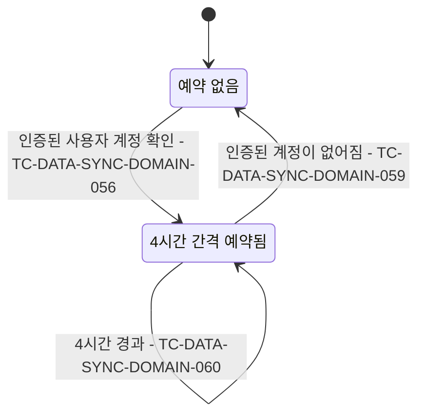

# 데이터 동기화 테스트 케이스

기준 스펙: [데이터 동기화 스펙](../spec/data-sync.md)

## domain

### TC-DATA-SYNC-DOMAIN-001: 변경이 발생하면 엔티티가 업로드 대기 상태가 된다

- 근거: `domain > 동기화 상태`
- Given: 로그인한 사용자 계정이 있고 대상 엔티티에 기록된 동기화 상태가 없다.
- When: 해당 계정의 대상에 테스트 데이터의 변경 중 한 가지가 발생한다.
- Then: 해당 엔티티가 그 계정의 업로드 대기 상태로 기록된다.
- 테스트 데이터:

| 대상 | 변경 |
| --- | --- |
| 메모 | 생성, 수정, 완료, 삭제, 실행 취소 |
| 태그 | 생성, 수정, 완료, 삭제, 실행 취소 |
| 장소 | 추가, 수정, 삭제 |
| 웹 항목 | 추가, 수정, 삭제 |
| 연락처 | 추가, 수정, 삭제 |
| 메모와 태그의 연결 | 생성, 해제 |
| 메모와 장소의 연결 | 생성, 해제 |
| 메모와 웹 항목의 연결 | 생성, 해제 |
| 태그와 태그의 연결 | 생성, 해제 |
| 웹 항목과 태그의 연결 | 생성, 해제 |
| 장소와 태그의 연결 | 생성, 해제 |

### TC-DATA-SYNC-DOMAIN-002: 게스트 데이터는 동기화하지 않는다

- 근거: `domain > 동기화 대상`
- Given: 계정이 게스트 상태다.
- When: 메모, 태그, 장소, 웹 항목 또는 여섯 연결 종류에 변경이 발생한다.
- Then: 업로드 대기 상태가 기록되지 않고 서버로 동기화 요청이 발생하지 않는다.

### TC-DATA-SYNC-DOMAIN-003: 같은 엔티티의 반복 변경은 대기 항목을 추가로 쌓지 않는다

- 근거: `domain > 동기화 상태`
- Given: 로그인한 사용자 계정의 한 엔티티가 이미 업로드 대기 상태다.
- When: 같은 엔티티에 변경이 다시 발생한다.
- Then: 해당 엔티티의 동기화 상태는 업로드 대기 한 건으로 유지되고 항목이 추가로 늘어나지 않는다.

### TC-DATA-SYNC-DOMAIN-006: 업로드는 엔티티의 최신 전체 상태 한 건만 반영한다

- 근거: `domain > 업로드 단위`
- Given: 로그인한 사용자 계정의 한 엔티티가 여러 번 수정되어 업로드 대기 상태다.
- When: 동기화 계기가 발생해 업로드가 진행된다.
- Then: 서버에는 해당 엔티티의 최종 상태 한 건만 반영 요청되고 중간 수정 내용은 요청되지 않는다.

### TC-DATA-SYNC-DOMAIN-007: 삭제된 엔티티는 삭제 상태로 반영되고 서버에서 제거되지 않는다

- 근거: `domain > 업로드 단위`
- Given: 로그인한 사용자 계정의 엔티티가 삭제 상태로 바뀌어 업로드 대기 상태다.
- When: 동기화 계기가 발생해 업로드가 진행된다.
- Then: 서버에는 삭제 상태를 포함한 엔티티 내용이 반영 요청되고 엔티티 제거 요청은 발생하지 않는다.

### TC-DATA-SYNC-DOMAIN-008: 여러 기기의 같은 항목 변경은 수정 시각으로 충돌을 판정한다

- 근거: `domain > 충돌 기준`
- Given: 한 기기의 변경이 서버에 저장된 뒤 다른 기기에 같은 엔티티의 서로 다른 변경이 업로드 대기 상태이고, 서버와 업로드하는 기기의 수정 시각 관계가 테스트 데이터로 주어진다.
- When: 다른 기기에서 같은 계정의 동기화가 진행된다.
- Then: 수정 시각이 더 늦은 쪽의 내용이 서버에 유지되며, 수정 시각이 같으면 서버에 먼저 저장된 내용이 유지된다.
- 테스트 데이터:

| 서버의 수정 시각 | 서버의 최종 내용 |
| --- | --- |
| 기기보다 이른 | 업로드한 기기의 변경 반영 |
| 기기보다 늦음 | 서버 데이터 유지 |
| 기기와 같음 | 서버 데이터 유지 |

- 작성하지 않는 이유: 서버 저장소의 시각 충돌 처리 규칙이어서 앱의 단위 테스트 환경에서 결정적으로 판정할 수 없다. 서버 정책 테스트 환경이 마련되면 작성한다.

### TC-DATA-SYNC-DOMAIN-009: 변경 계기에는 남아 있던 대기 항목도 함께 시도한다

- 근거: `domain > 동기화 계기`
- Given: 로그인한 사용자 계정에 업로드 대기 상태의 엔티티가 남아 있다.
- When: 같은 계정의 다른 메모나 태그에 새 변경이 발생한다.
- Then: 새로 바뀐 엔티티와 남아 있던 업로드 대기 엔티티가 함께 시도된다.

### TC-DATA-SYNC-DOMAIN-010: 앱이 시작되어 인증된 계정이 확인되면 동기화를 요청한다

- 근거: `domain > 동기화 계기`
- Given: 사용자 계정 정보가 저장되어 있고 로그인 세션이 인증된 상태다.
- When: 앱이 시작되어 화면에 보이고 인증된 계정이 확인된다.
- Then: 그 계정으로 동기화가 한 번 요청된다.

### TC-DATA-SYNC-DOMAIN-011: 로그인이 완료되면 그 계정으로 동기화를 요청한다

- 근거: `domain > 동기화 계기`
- Given: 앱이 화면에 보이고 계정이 게스트 상태다.
- When: 어떤 계정으로 로그인이 완료되어 인증된 계정이 확인된다.
- Then: 그 계정으로 동기화가 한 번 요청된다.

### TC-DATA-SYNC-DOMAIN-013: 실패한 항목을 같은 계기 안에서 곧바로 다시 시도하지 않는다

- 근거: `domain > 동기화 계기`
- Given: 업로드 대기 상태의 엔티티가 있고 서버 반영이 계속 실패하도록 제어되어 있다.
- When: 동기화 계기가 한 번 발생해 업로드가 진행된다.
- Then: 해당 엔티티의 업로드는 그 계기 안에서 한 번만 시도되고 업로드 대기 상태로 남는다.

### TC-DATA-SYNC-DOMAIN-014: 세션이 인증되지 않았으면 동기화를 시도하지 않는다

- 근거: `domain > 세션 조건`
- Given: 업로드 대기 상태의 엔티티가 있고 로그인 세션이 인증되지 않은 상태다.
- When: 동기화 계기가 발생한다.
- Then: 서버로 업로드와 내려받기 요청이 발생하지 않고 항목은 업로드 대기 상태로 유지된다.

### TC-DATA-SYNC-DOMAIN-015: 로그아웃해도 동기화 상태와 내려받기 위치가 유지된다

- 근거: `domain > 실행 경계`
- Given: 어떤 계정에 업로드 대기 상태의 엔티티와 기록된 내려받기 위치가 남아 있는 상태에서 로그아웃했다.
- When: 같은 계정으로 다시 로그인이 완료된다.
- Then: 남아 있던 항목이 지워지지 않고 업로드가 다시 시도되며, 내려받기는 기록된 위치 다음부터 요청된다.
- 작성하지 않는 이유: 로그인 완료 계기, 백그라운드 동기화 작업, 로컬 저장을 함께 통과해야 판정할 수 있는 통합 범위여서 단위 테스트 환경에서 결정적으로 판정할 수 없다. 통합 테스트 환경이 마련되면 작성한다.

### TC-DATA-SYNC-DOMAIN-016: 동기화 작업은 백그라운드에서 실행된다

- 근거: `domain > 백그라운드 실행`
- Given: 인증된 로그인 세션이 있고 실행할 동기화 작업이 준비되어 있다.
- When: 동기화 계기가 발생해 동기화가 요청된다.
- Then: 요청은 사용자의 화면 사용을 막지 않고 곧바로 끝나며, 동기화 작업은 백그라운드에서 한 번 실행된다.

### TC-DATA-SYNC-DOMAIN-017: Android에서는 앱을 벗어나도 시스템이 동기화 작업을 이어서 실행한다

- 근거: `domain > 백그라운드 실행`
- Given: Android에서 동기화 작업이 백그라운드에서 진행 중이다.
- When: 사용자가 앱을 벗어나거나 앱이 종료된다.
- Then: 시스템이 남은 동기화 작업을 이어서 실행한다.
- 작성하지 않는 이유: 운영체제의 백그라운드 작업 스케줄링 동작이어서 제어된 테스트 환경에서 결정적으로 판정할 수 없다. 플랫폼 계측 테스트 환경이 마련되면 작성한다.

### TC-DATA-SYNC-DOMAIN-018: 진행 중인 동기화 작업은 새 요청에 취소되고 새로 시작된다

- 근거: `domain > 동기화 계기`
- Given: 동기화 작업이 백그라운드에서 진행 중이다.
- When: 새 동기화 계기가 발생해 동기화가 다시 요청된다.
- Then: 진행 중이던 동기화 작업은 취소되어 끝까지 실행되지 않고, 새 동기화 작업이 한 번 새로 시작된다.

### TC-DATA-SYNC-DOMAIN-019: 참조하는 종류가 모두 끝난 뒤에 업로드를 시작한다

- 근거: `domain > 동기화 단계와 처리 순서`
- Given: 로그인한 사용자 계정에 업로드할 열한 종류가 모두 여러 묶음씩 있다.
- When: 동기화의 업로드 단계가 진행된다.
- Then: 각 종류의 첫 요청은 테스트 데이터의 종류가 마지막 요청까지 성공한 뒤에 시작된다.
- 테스트 데이터:

| 종류 | 먼저 끝나야 하는 종류 |
| --- | --- |
| 메모 | 태그 |
| 메모와 태그의 연결 | 태그, 메모 |
| 메모와 장소의 연결 | 장소, 메모 |
| 메모와 웹 항목의 연결 | 웹 항목, 메모 |
| 태그와 태그의 연결 | 태그 |
| 웹 항목과 태그의 연결 | 태그, 웹 항목 |
| 장소와 태그의 연결 | 태그, 장소 |

### TC-DATA-SYNC-DOMAIN-055: 서로 참조하지 않는 종류는 함께 업로드를 시작한다

- 근거: `domain > 동기화 단계와 처리 순서`
- Given: 로그인한 사용자 계정에 업로드할 태그와 장소와 웹 항목과 연락처가 있고, 한 종류의 첫 업로드 응답이 지연되도록 제어되어 있다.
- When: 동기화의 업로드 단계가 진행된다.
- Then: 지연된 종류의 업로드가 완료되기 전에 다른 종류의 첫 업로드 요청이 시작된다.
- 테스트 데이터:

| 지연되는 종류 | 먼저 시작되는 종류 |
| --- | --- |
| 태그 | 장소, 웹 항목, 연락처 |
| 장소 | 태그, 웹 항목, 연락처 |
| 웹 항목 | 태그, 장소, 연락처 |
| 연락처 | 태그, 장소, 웹 항목 |

### TC-DATA-SYNC-DOMAIN-020: 업로드할 항목이 없는 종류는 서버 요청을 생략한다

- 근거: `domain > 동기화 단계와 처리 순서`
- Given: 로그인한 사용자 계정에 테스트 데이터의 종류만 업로드 대기 항목을 가진다.
- When: 동기화의 업로드 단계가 진행된다.
- Then: 항목이 없는 종류의 업로드 요청은 발생하지 않고 항목이 있는 종류만 업로드된다.
- 테스트 데이터:

| 업로드 대기 항목이 있는 종류 | 기대 결과 |
| --- | --- |
| 태그만 | 태그만 요청, 나머지 열 종류 요청 없음 |
| 장소만 | 장소만 요청, 나머지 열 종류 요청 없음 |
| 웹 항목만 | 웹 항목만 요청, 나머지 열 종류 요청 없음 |
| 연락처만 | 연락처만 요청, 나머지 열 종류 요청 없음 |
| 메모만 | 메모만 요청, 나머지 열 종류 요청 없음 |
| 메모와 태그의 연결만 | 그 연결만 요청, 나머지 열 종류 요청 없음 |
| 메모와 장소의 연결만 | 그 연결만 요청, 나머지 열 종류 요청 없음 |
| 메모와 웹 항목의 연결만 | 그 연결만 요청, 나머지 열 종류 요청 없음 |
| 태그와 태그의 연결만 | 그 연결만 요청, 나머지 열 종류 요청 없음 |
| 웹 항목과 태그의 연결만 | 그 연결만 요청, 나머지 열 종류 요청 없음 |
| 장소와 태그의 연결만 | 그 연결만 요청, 나머지 열 종류 요청 없음 |
| 없음 | 열한 종류 요청 모두 없음 |
| 열한 종류 모두 | 열한 종류 모두 요청 |

### TC-DATA-SYNC-DOMAIN-021: 태그 묶음이 실패하면 태그를 기다리는 종류를 시도하지 않는다

- 근거: `domain > 동기화 단계와 처리 순서`
- Given: 여러 묶음의 태그와 업로드할 장소, 메모, 세 종류의 연결이 있고 한 태그 묶음의 서버 반영이 실패하도록 제어되어 있다.
- When: 동기화의 업로드 단계가 진행된다.
- Then: 실패한 태그 묶음 뒤의 태그와 모든 메모, 세 종류의 모든 연결은 업로드되지 않고 동기화가 실패한다.

### TC-DATA-SYNC-DOMAIN-022: 메모 묶음이 실패하면 메모를 기다리는 연결을 시도하지 않는다

- 근거: `domain > 동기화 단계와 처리 순서`
- Given: 여러 묶음의 메모와 업로드할 메모를 기다리는 두 종류의 연결이 있고 한 메모 묶음의 서버 반영이 실패하도록 제어되어 있다.
- When: 동기화의 업로드 단계가 진행된다.
- Then: 실패한 메모 묶음 뒤의 메모와 메모를 기다리는 두 종류의 모든 연결은 업로드되지 않고 동기화가 실패한다.

### TC-DATA-SYNC-DOMAIN-053: 장소 묶음이 실패하면 메모와 장소의 연결만 시도하지 않는다

- 근거: `domain > 동기화 단계와 처리 순서`
- Given: 여러 묶음의 장소와 업로드할 태그, 메모, 세 종류의 연결이 있고 한 장소 묶음의 서버 반영이 실패하도록 제어되어 있다.
- When: 동기화의 업로드 단계가 진행된다.
- Then: 실패한 장소 묶음 뒤의 장소와 모든 메모·장소 연결은 업로드되지 않고, 장소를 기다리지 않는 태그와 메모, 메모·태그 연결, 태그·태그 연결은 모두 업로드된 뒤 동기화가 실패한다.

### TC-DATA-SYNC-DOMAIN-054: 실패한 종류를 기다리지 않는 종류는 끝까지 업로드한다

- 근거: `domain > 동기화 단계와 처리 순서`
- Given: 여러 묶음의 두 종류가 업로드 대기 상태이고 테스트 데이터의 실패하는 종류에서 한 묶음의 서버 반영이 실패하도록 제어되어 있다.
- When: 동기화의 업로드 단계가 진행된다.
- Then: 실패한 종류를 기다리지 않는 종류는 남은 묶음까지 모두 업로드하고 동기화는 실패한다.
- 테스트 데이터:

| 실패하는 종류 | 끝까지 업로드하는 종류 |
| --- | --- |
| 태그 | 장소 |
| 장소 | 태그 |
| 웹 항목 | 태그, 장소 |
| 태그 | 웹 항목 |
| 태그 | 연락처 |
| 연락처 | 태그, 장소, 웹 항목 |
| 메모와 태그의 연결 | 메모와 장소의 연결 |
| 메모와 장소의 연결 | 메모와 태그의 연결 |
| 메모 | 태그와 태그의 연결 |
| 태그와 태그의 연결 | 메모, 메모와 태그의 연결 |
| 메모 | 웹 항목과 태그의 연결, 장소와 태그의 연결 |
| 메모와 웹 항목의 연결 | 메모와 태그의 연결, 메모와 장소의 연결 |
| 웹 항목과 태그의 연결 | 장소와 태그의 연결 |
| 장소와 태그의 연결 | 웹 항목과 태그의 연결 |

### TC-DATA-SYNC-DOMAIN-024: 요청 시 확인된 계정만 동기화한다

- 근거: `domain > 세션 조건`
- Given: 인증된 사용자 계정과 다른 계정에 각각 업로드 대기 항목이 있다.
- When: 인증된 사용자 계정의 동기화 계기가 발생한다.
- Then: 동기화 작업은 요청 시 확인된 사용자 계정으로 실행되고 다른 계정의 항목은 업로드하지 않는다.

### TC-DATA-SYNC-DOMAIN-026: 성공한 업로드의 변경이 서버에 채택되지 않아도 대기 상태를 해제한다

- 근거: `domain > 업로드 대기 해제 기준`
- Given: 업로드 대기 상태의 항목이 있고 업로드 묶음이 성공하도록 제어되어 있으며, 업로드 중 그 항목이 다시 변경되지 않는다.
- When: 해당 묶음의 업로드가 성공한다.
- Then: 서버가 기기의 내용을 최신으로 채택했는지와 관계없이 그 항목은 동기화 완료 상태가 되고 다음 동기화 계기의 업로드 대상에 포함되지 않는다.
- 테스트 데이터:

| 서버의 기존 수정 시각 | 서버의 내용 판정 | 기기의 동기화 상태 |
| --- | --- | --- |
| 기기보다 이른 | 기기 내용 채택 | 동기화 완료 |
| 기기와 같음 | 서버 내용 유지 | 동기화 완료 |
| 기기보다 늦음 | 서버 내용 유지 | 동기화 완료 |

### TC-DATA-SYNC-DOMAIN-027: 업로드 중 다시 변경된 항목은 업로드 대기 상태를 유지한다

- 근거: `domain > 업로드 대기 해제 기준`
- Given: 업로드 대기 상태의 항목이 있고 업로드 묶음이 성공하도록 제어되어 있다.
- When: 그 항목을 업로드하는 동안 같은 항목이 기기에서 다시 변경되어 수정 시각이 바뀐다.
- Then: 그 항목은 동기화 완료 상태가 되지 않고 다음 동기화 계기의 업로드 대상에 포함된다.

### TC-DATA-SYNC-DOMAIN-028: 업로드 묶음이 실패하면 그 묶음의 어떤 항목도 완료되지 않는다

- 근거: `domain > 업로드 대기 해제 기준`
- Given: 업로드 대기 상태의 여러 항목이 한 묶음에 담겨 있고 그 묶음의 서버 반영이 실패하도록 제어되어 있다.
- When: 해당 묶음의 업로드가 실패한다.
- Then: 묶음에 담긴 모든 항목이 업로드 대기 상태로 유지된다.

### TC-DATA-SYNC-DOMAIN-029: 업로드가 실패하면 내려받기를 진행하지 않는다

- 근거: `domain > 동기화 단계와 처리 순서`
- Given: 업로드할 항목이 있고 한 업로드 묶음이 실패하도록 제어되어 있다.
- When: 동기화가 진행된다.
- Then: 어떤 종류의 내려받기 요청도 발생하지 않는다.

### TC-DATA-SYNC-DOMAIN-030: 항목이 업로드 대기가 되어도 내려받기 위치는 되돌아가지 않는다

- 근거: `domain > 동기화 상태`
- Given: 한 종류의 내려받기 위치가 기록되어 있고 그 종류의 항목이 모두 동기화 완료 상태다.
- When: 해당 종류의 항목이 기기에서 변경되어 업로드 대기 상태가 된다.
- Then: 기록된 내려받기 위치는 바뀌지 않고, 다음 내려받기는 같은 위치 다음부터 요청된다.

### TC-DATA-SYNC-DOMAIN-031: 인증이 확인되기 전에는 동기화를 요청하지 않고 확인된 뒤에 요청한다

- 근거: `domain > 동기화 계기`
- Given: 사용자 계정 정보가 저장되어 있고 로그인 세션의 인증 여부가 아직 확인되지 않았다.
- When: 앱이 시작되어 화면에 보인 뒤 로그인 세션이 인증된 상태로 확인된다.
- Then: 인증이 확인되기 전에는 동기화가 요청되지 않고, 인증이 확인된 뒤 그 계정으로 동기화가 한 번 요청된다.

### TC-DATA-SYNC-DOMAIN-032: 앱이 다시 화면에 보이게 되면 동기화를 다시 요청한다

- 근거: `domain > 동기화 계기`
- Given: 인증된 계정이 확인되어 동기화가 한 번 요청된 뒤 앱이 화면에서 보이지 않게 되었다.
- When: 앱이 다시 화면에 보이게 된다.
- Then: 같은 계정으로 동기화가 한 번 더 요청된다.

### TC-DATA-SYNC-DOMAIN-033: 확인된 계정이 다른 계정으로 바뀌면 새 계정으로 동기화를 요청한다

- 근거: `domain > 동기화 계기`
- Given: 앱이 화면에 보이고 어떤 인증된 계정으로 동기화가 요청되었다.
- When: 확인된 계정이 다른 인증된 계정으로 바뀐다.
- Then: 새 계정으로 동기화가 한 번 요청된다.

### TC-DATA-SYNC-DOMAIN-034: 같은 계정이 다시 확인되기만 하면 동기화를 다시 요청하지 않는다

- 근거: `domain > 동기화 계기`
- Given: 앱이 화면에 보이고 인증된 계정으로 동기화가 한 번 요청되었다.
- When: 로그인 세션이 자동으로 갱신되어 같은 계정이 다시 확인된다.
- Then: 동기화가 추가로 요청되지 않는다.

### TC-DATA-SYNC-DOMAIN-035: 앱이 화면에서 보이지 않는 동안에는 동기화를 요청하지 않는다

- 근거: `domain > 동기화 계기`
- Given: 앱이 화면에서 보이지 않는 상태다.
- When: 인증된 계정이 확인되거나 확인된 계정이 다른 계정으로 바뀐다.
- Then: 동기화가 요청되지 않는다.

### TC-DATA-SYNC-DOMAIN-036: 로그아웃되어 인증된 계정이 없어지는 것은 동기화 계기가 아니다

- 근거: `domain > 동기화 계기`
- Given: 앱이 화면에 보이고 인증된 계정으로 동기화가 요청되었다.
- When: 로그아웃되어 인증된 계정이 없어진다.
- Then: 동기화가 추가로 요청되지 않는다.

### TC-DATA-SYNC-DOMAIN-056: 인증된 사용자 계정이 확인되면 4시간 간격의 주기 동기화를 예약한다

- 근거: `domain > 주기 동기화`
- Given: 주기 동기화가 예약되어 있지 않다.
- When: 인증된 사용자 계정이 확인된다.
- Then: 그 계정을 대상으로 하는 4시간 간격의 주기 동기화가 하나 예약되고, 예약한 직후에는 동기화가 실행되지 않는다.

### TC-DATA-SYNC-DOMAIN-057: 같은 계정이 다시 확인되어도 다음 주기까지 남은 시간이 유지된다

- 근거: `domain > 주기 동기화`
- Given: 어떤 인증된 계정으로 주기 동기화가 예약되어 있고 다음 실행까지 4시간이 남지 않았다.
- When: 같은 계정이 다시 확인된다.
- Then: 예약은 하나로 유지되고 다음 실행 시각이 뒤로 미뤄지지 않는다.

### TC-DATA-SYNC-DOMAIN-058: 확인된 계정이 바뀌면 주기 동기화의 대상 계정만 바뀐다

- 근거: `domain > 주기 동기화`
- Given: 어떤 인증된 계정으로 주기 동기화가 예약되어 있다.
- When: 확인된 계정이 다른 인증된 계정으로 바뀐다.
- Then: 예약은 하나로 유지되고 대상 계정이 새 계정으로 바뀌며, 다음 실행 시각이 뒤로 미뤄지지 않는다.

### TC-DATA-SYNC-DOMAIN-059: 인증된 계정이 없어지면 주기 동기화 예약을 해제한다

- 근거: `domain > 주기 동기화`
- Given: 인증된 계정으로 주기 동기화가 예약되어 있다.
- When: 로그아웃되어 인증된 계정이 없어진다.
- Then: 남아 있는 주기 동기화 예약이 없고, 이후 4시간이 지나도 동기화가 실행되지 않는다.

### TC-DATA-SYNC-DOMAIN-060: 4시간이 지나면 지정된 계정의 동기화가 실행된다

- 근거: `domain > 주기 동기화`
- Given: 어떤 인증된 계정으로 주기 동기화가 예약되어 있고 네트워크 조건을 만족한다.
- When: 예약한 시점으로부터 4시간이 지난다.
- Then: 지정된 계정의 업로드와 내려받기가 한 번 실행된다.

### TC-DATA-SYNC-DOMAIN-061: 주기 동기화가 실패해도 예약이 유지되어 다음 주기에 다시 시도한다

- 근거: `domain > 주기 동기화`
- Given: 어떤 인증된 계정으로 주기 동기화가 예약되어 있고 동기화가 실패하도록 제어되어 있다.
- When: 주기가 돌아와 동기화가 실패한다.
- Then: 예약이 해제되지 않고, 다음 주기가 돌아오면 같은 계정의 동기화가 다시 실행된다.

### TC-DATA-SYNC-DOMAIN-062: Android에서 주기 동기화는 네트워크에 연결되어 있지 않으면 실행하지 않는다

- 근거: `domain > 주기 동기화`
- Given: Android에서 주기 동기화가 예약되어 있고 기기가 네트워크에 연결되어 있지 않다.
- When: 예약한 시점으로부터 4시간이 지난다.
- Then: 업로드와 내려받기 요청이 발생하지 않고, 기기가 네트워크에 연결된 뒤에 실행된다.

### TC-DATA-SYNC-DOMAIN-063: 주기 동기화는 진행 중인 다른 동기화를 취소하지 않는다

- 근거: `domain > 동기화 계기`, `domain > 백그라운드 실행`
- Given: 다른 계기로 시작된 동기화가 진행 중이고, 같은 계정으로 주기 동기화가 예약되어 있다.
- When: 주기가 돌아와 주기 동기화가 실행된다.
- Then: 진행 중이던 동기화가 취소되지 않고 끝까지 진행된다.

### TC-DATA-SYNC-DOMAIN-064: 다른 계기의 동기화는 진행 중인 주기 동기화를 취소하지 않는다

- 근거: `domain > 동기화 계기`, `domain > 백그라운드 실행`
- Given: 주기 동기화가 실행되어 진행 중이다.
- When: 다른 동기화 계기가 발생해 같은 계정의 동기화가 요청된다.
- Then: 진행 중이던 주기 동기화가 취소되지 않고 끝까지 진행된다.

### TC-DATA-SYNC-DOMAIN-065: Android 이외의 플랫폼은 앱을 다시 실행하면 4시간을 새로 센다

- 근거: `domain > 주기 동기화`
- Given: Android 이외의 플랫폼에서 인증된 계정으로 주기 동기화가 예약된 뒤 앱이 종료되었다.
- When: 앱을 다시 실행해 같은 인증된 계정이 확인된다.
- Then: 종료 전에 흐른 시간과 무관하게 다시 확인된 시점으로부터 4시간이 지난 뒤 첫 주기 동기화가 실행된다.
- 작성하지 않는 이유: 앱 종료와 재실행 경계를 제어해 예약이 사라졌는지 관찰해야 하므로 현재 단위 테스트 환경에서 결정적으로 판정할 수 없다. 해당 경계를 제어할 수 있는 통합 테스트 환경이 마련되면 작성한다.

### TC-DATA-SYNC-DOMAIN-038: 업로드가 끝난 뒤 열한 종류를 동시에 내려받는다

- 근거: `domain > 내려받기 병렬 처리`
- Given: 로그인한 사용자 계정의 업로드가 모두 성공했고 서버에 내려받을 열한 종류가 모두 있으며, 한 종류의 첫 내려받기 응답이 지연되도록 제어되어 있다.
- When: 동기화가 진행된다.
- Then: 모든 업로드 요청이 끝난 뒤, 지연된 종류의 내려받기가 완료되기 전에 나머지 열 종류의 첫 내려받기 요청이 시작된다.
- 테스트 데이터:

| 지연되는 종류 | 먼저 시작되는 종류 |
| --- | --- |
| 태그 | 나머지 열 종류 |
| 장소 | 나머지 열 종류 |
| 웹 항목 | 나머지 열 종류 |
| 연락처 | 나머지 열 종류 |
| 메모 | 나머지 열 종류 |
| 메모와 태그의 연결 | 나머지 열 종류 |
| 메모와 장소의 연결 | 나머지 열 종류 |
| 메모와 웹 항목의 연결 | 나머지 열 종류 |
| 태그와 태그의 연결 | 나머지 열 종류 |
| 웹 항목과 태그의 연결 | 나머지 열 종류 |
| 장소와 태그의 연결 | 나머지 열 종류 |

### TC-DATA-SYNC-DOMAIN-039: 한 종류의 내려받기가 실패해도 다른 종류는 끝까지 진행한다

- 근거: `domain > 내려받기 병렬 처리`
- Given: 업로드가 모두 성공했고, 한 종류의 내려받기 요청이 실패하며 다른 열 종류는 여러 묶음을 응답하도록 제어되어 있다.
- When: 동기화가 진행된다.
- Then: 실패하지 않은 열 종류는 빈 응답을 받을 때까지 모든 묶음을 내려받아 기기에 반영하고 그 종류의 내려받기 위치가 전진한다.
- 테스트 데이터:

| 실패하는 종류 | 끝까지 진행되는 종류 |
| --- | --- |
| 태그 | 나머지 열 종류 |
| 장소 | 나머지 열 종류 |
| 웹 항목 | 나머지 열 종류 |
| 연락처 | 나머지 열 종류 |
| 메모 | 나머지 열 종류 |
| 메모와 태그의 연결 | 나머지 열 종류 |
| 메모와 장소의 연결 | 나머지 열 종류 |
| 메모와 웹 항목의 연결 | 나머지 열 종류 |
| 태그와 태그의 연결 | 나머지 열 종류 |
| 웹 항목과 태그의 연결 | 나머지 열 종류 |
| 장소와 태그의 연결 | 나머지 열 종류 |

### TC-DATA-SYNC-DOMAIN-040: 한 종류의 내려받기가 실패하면 동기화가 실패한다

- 근거: `domain > 내려받기 병렬 처리`
- Given: 업로드가 모두 성공했고, 한 종류의 내려받기가 실패하며 다른 종류는 성공하도록 제어되어 있다.
- When: 동기화가 진행된다.
- Then: 모든 종류의 내려받기가 끝난 뒤 동기화는 실패로 끝난다.
- 테스트 데이터:

| 실패하는 종류 |
| --- |
| 태그 |
| 장소 |
| 웹 항목 |
| 연락처 |
| 메모 |
| 메모와 태그의 연결 |
| 메모와 장소의 연결 |
| 메모와 웹 항목의 연결 |
| 태그와 태그의 연결 |
| 웹 항목과 태그의 연결 |
| 장소와 태그의 연결 |
| 열한 종류 모두 |

### TC-DATA-SYNC-DOMAIN-041: 네트워크에 연결되지 않았으면 동기화 작업을 실행하지 않고 대기시킨다

- 근거: `domain > 네트워크 조건`
- Given: Android에서 기기가 네트워크에 연결되어 있지 않다.
- When: 동기화 계기가 발생해 동기화가 요청된다.
- Then: 동기화 작업이 실행되지 않고 대기 상태로 남으며, 서버로 업로드와 내려받기 요청이 발생하지 않는다.

### TC-DATA-SYNC-DOMAIN-042: 네트워크에 연결되면 대기 중인 동기화 작업이 실행된다

- 근거: `domain > 네트워크 조건`, `data > 오프라인과 실패`
- Given: Android에서 네트워크에 연결되지 않은 동안 동기화가 요청되어 동기화 작업이 대기 중이고 업로드 대기 항목이 남아 있다.
- When: 기기가 네트워크에 연결된다.
- Then: 사용자의 추가 조치 없이 대기 중이던 동기화 작업이 실행되어 남아 있던 업로드 대기 항목을 시도한다.

### TC-DATA-SYNC-DOMAIN-043: 연결을 기다리는 동안 여러 계기가 발생해도 연결 후 한 번만 실행된다

- 근거: `domain > 네트워크 조건`
- Given: Android에서 네트워크에 연결되지 않은 동안 동기화가 요청되어 동기화 작업이 대기 중이다.
- When: 네트워크에 연결되기 전에 같은 계정의 동기화 계기가 여러 번 더 발생한 뒤 기기가 네트워크에 연결된다.
- Then: 대기 중인 동기화 작업은 하나로 유지되어 연결 후 한 번만 실행되고, 그때까지 쌓인 업로드 대기 항목을 함께 시도한다.

### TC-DATA-SYNC-DOMAIN-044: Android 이외의 플랫폼은 네트워크 연결을 확인하지 않고 동기화를 시작한다

- 근거: `domain > 네트워크 조건`
- Given: Android 이외의 플랫폼에서 인증된 계정이 확인되어 있다.
- When: 동기화 계기가 발생해 동기화가 요청된다.
- Then: 네트워크 연결 여부를 확인하지 않고 동기화 작업이 곧바로 시작된다.

### TC-DATA-SYNC-DOMAIN-045: 동기화 작업은 즉시 실행을 요청한다

- 근거: `domain > 즉시 실행 요청`
- Given: Android에서 인증된 계정이 확인되어 있다.
- When: 동기화 계기가 발생해 동기화가 요청된다.
- Then: 앱이 화면에 보이지 않거나 기기가 절전 상태여도 네트워크 조건을 만족하는 즉시 동기화 작업이 실행된다.
- 작성하지 않는 이유: 즉시 실행 요청 여부와 절전 상태의 실행 시점은 운영체제의 스케줄링에 달려 있어 호스트 테스트에서 결정적으로 판정할 수 없다. 플랫폼 계측 테스트 환경이 마련되면 작성한다.

### TC-DATA-SYNC-DOMAIN-046: 즉시 실행 한도를 넘어도 동기화 요청이 사라지지 않는다

- 근거: `domain > 즉시 실행 요청`
- Given: Android에서 시스템의 즉시 실행 허용 한도가 모두 소진되어 있다.
- When: 동기화 계기가 발생해 동기화가 요청된다.
- Then: 동기화 작업이 취소되지 않고 일반 백그라운드 작업으로 전환되어 시스템이 정한 시점에 실행된다.
- 작성하지 않는 이유: 즉시 실행 한도 소진 상태를 만들고 전환 결과를 관찰하는 것은 운영체제의 쿼터 관리에 달려 있어 호스트 테스트에서 결정적으로 판정할 수 없다. 플랫폼 계측 테스트 환경이 마련되면 작성한다.

### TC-DATA-SYNC-DOMAIN-047: 메모 업로드 성공과 연결 업로드 실패는 하나의 서버 작업처럼 되돌리지 않는다

- 근거: `domain > 동기화 단계와 처리 순서`
- Given: 서버에서 현재 계정과 연결된 태그를 대표 태그로 지정한 새 메모와 그 태그의 연결이 모두 업로드 대기 상태이며, 메모 업로드는 성공하고 연결 업로드는 실패하도록 제어되어 있다.
- When: 동기화가 진행된다.
- Then: 서버에는 대표 태그가 포함된 메모만 반영되고 그 태그와 메모의 연결은 반영되지 않은 중간 상태가 허용된다. 성공한 메모 업로드는 되돌리지 않아 메모는 업로드 대기에서 해제되고, 연결은 업로드 대기 상태로 남으며 내려받기는 진행하지 않는다.
- 작성하지 않는 이유: 업로드가 실패하면 내려받기를 진행하지 않는 것은 TC-DATA-SYNC-DOMAIN-029에서 자동화한다. 서버에 메모만 반영되고 연결은 반영되지 않은 중간 상태와 엔티티별 업로드 대기 해제 여부는 서버 저장소의 상태를 함께 관찰해야 하므로 앱의 단위 테스트 환경에서 결정적으로 판정할 수 없다. 서버 정책 테스트 환경이 마련되면 작성한다.

### TC-DATA-SYNC-DOMAIN-048: 동기화가 실패하면 실패 원인을 담은 오류 보고가 한 번 남는다

- 근거: `domain > 동기화 실패 보고`
- Given: 오류 보고 기록 수단이 등록되어 있고, 동기화의 한 단계가 특정 원인으로 실패하도록 제어되어 있다.
- When: 동기화가 진행된다.
- Then: 그 원인을 담은 오류 보고가 한 번 남고, 보고 메시지로 데이터 동기화 실패임을 구분할 수 있다.
- 테스트 데이터:

| 실패하는 단계 |
| --- |
| 업로드: 태그 |
| 업로드: 메모 |
| 업로드: 연결 |
| 내려받기: 태그 |
| 내려받기: 메모 |
| 내려받기: 연결 |

### TC-DATA-SYNC-DOMAIN-049: 여러 종류의 내려받기가 실패해도 오류 보고는 한 번만 남는다

- 근거: `domain > 동기화 실패 보고`
- Given: 오류 보고 기록 수단이 등록되어 있고, 업로드는 모두 성공하며 세 종류의 내려받기가 모두 실패하도록 제어되어 있다.
- When: 동기화가 진행된다.
- Then: 동기화는 실패로 끝나고 오류 보고는 한 번만 남는다.

### TC-DATA-SYNC-DOMAIN-050: 동기화가 성공하면 오류 보고가 남지 않는다

- 근거: `domain > 동기화 실패 보고`
- Given: 오류 보고 기록 수단이 등록되어 있고, 업로드와 내려받기가 모두 성공하도록 제어되어 있다.
- When: 동기화가 진행된다.
- Then: 오류 보고가 남지 않는다.

### TC-DATA-SYNC-DOMAIN-051: 진행 중인 동기화가 취소되면 오류 보고가 남지 않는다

- 근거: `domain > 동기화 실패 보고`
- Given: 오류 보고 기록 수단이 등록되어 있고, 동기화의 한 단계가 끝나지 않고 대기하도록 제어되어 있다.
- When: 진행 중인 동기화를 취소한다.
- Then: 오류 보고가 남지 않는다.

### TC-DATA-SYNC-DOMAIN-052: 오프라인으로 인한 동기화 실패도 오류 보고로 남는다

- 근거: `domain > 동기화 실패 보고`
- Given: 오류 보고 기록 수단이 등록되어 있고, 네트워크 연결이 없어 서버 요청이 실패하도록 제어되어 있다.
- When: 네트워크 연결을 확인하지 않는 플랫폼에서 동기화가 진행된다.
- Then: 오프라인으로 인한 실패 원인을 담은 오류 보고가 남는다.

## data

### TC-DATA-SYNC-DATA-001: 업로드는 기기의 최신 전체 상태로 서버 엔티티를 덮어쓰거나 새로 만든다

- 근거: `data > 업로드 흐름`
- Given: 업로드 대기 상태의 엔티티가 있고 서버가 반영 성공을 응답하도록 제어되어 있다.
- When: 동기화 계기가 발생해 업로드가 진행된다.
- Then: 서버의 같은 엔티티에는 기기에 저장된 최신 전체 상태가 반영되고, 서버에 없던 엔티티는 새로 만들어진다.
- 작성하지 않는 이유: 앱이 최신 전체 상태를 서버 경계로 전달하는 계약은 단위 테스트하지만, 실제 서버의 생성·갱신 결과는 로컬 서버 정책 테스트 환경이 없어 결정적으로 판정할 수 없다. 서버 정책 테스트 환경이 마련되면 작성한다.

### TC-DATA-SYNC-DATA-002: 업로드가 실패해도 기기에 저장된 사용자 데이터는 바뀌지 않는다

- 근거: `domain > 로컬 우선 원칙`
- Given: 메모, 태그, 장소 또는 웹 항목이 기기에 저장되어 업로드 대기 상태이고 서버 반영이 실패하도록 제어되어 있다.
- When: 동기화 계기가 발생해 업로드가 진행되고 실패한다.
- Then: 기기에 저장된 해당 엔티티의 내용, 완료 여부, 삭제 여부, 시각은 바뀌지 않고 업로드 대기 상태로 남는다.

### TC-DATA-SYNC-DATA-003: 동기화 상태는 앱을 다시 실행해도 유지된다

- 근거: `domain > 실행 경계`
- Given: 업로드 대기 상태의 엔티티가 남아 있다.
- When: 앱을 종료하고 다시 실행해 로그인된 계정이 확인된다.
- Then: 남아 있던 동기화 상태가 그대로 조회되고 해당 항목의 업로드가 다시 시도된다.
- 작성하지 않는 이유: 앱 재실행, 로그인 세션 복원, 저장된 동기화 상태와 백그라운드 작업을 함께 관찰해야 하므로 현재 단위 테스트 환경에서 결정적으로 판정할 수 없다. 해당 경계를 제어할 수 있는 통합 테스트 환경이 마련되면 작성한다.

### TC-DATA-SYNC-DATA-005: 업로드 대상을 최대 100개씩 나누어 요청한다

- 근거: `data > 업로드 흐름`
- Given: 로그인한 사용자 계정에 한 종류의 업로드 대상이 준비되어 있다.
- When: 해당 종류의 업로드가 진행된다.
- Then: 각 서버 요청에는 최대 100개의 항목만 포함되고 모든 항목이 중복이나 누락 없이 한 번씩 요청된다.
- 테스트 데이터:

| 항목 수 | 요청별 항목 수 |
| ---: | --- |
| 1 | 1 |
| 100 | 100 |
| 101 | 100, 1 |
| 200 | 100, 100 |
| 201 | 100, 100, 1 |

### TC-DATA-SYNC-DATA-008: 새 엔티티를 업로드하면 현재 사용자 계정과의 연결을 함께 만든다

- 근거: `data > 업로드 흐름`
- Given: 인증된 사용자 계정에 업로드 대기 상태인 새 메모 또는 태그가 있다.
- When: 해당 엔티티를 서버에 처음 업로드한다.
- Then: 서버에 새 엔티티가 한 건 저장되고 인증된 현재 사용자 계정과 그 엔티티의 연결이 함께 만들어진다.
- 작성하지 않는 이유: 서버 저장소의 엔티티·연결 생성 규칙이어서 앱의 단위 테스트 환경에서 결정적으로 판정할 수 없다. 서버 정책 테스트 환경이 마련되면 작성한다.

### TC-DATA-SYNC-DATA-009: 여러 연결은 하나의 엔티티 내용을 공유한다

- 근거: `domain > 충돌 기준`, `data > 서버 데이터의 연결과 접근`
- Given: 하나의 메모 또는 태그가 둘 이상의 계정과 연결되어 있고, 한 계정이 더 늦은 수정 시각의 내용을 업로드하도록 제어되어 있다.
- When: 다른 연결 계정이 서버의 같은 엔티티를 조회한다.
- Then: 계정별 복사본이 아니라 더 늦은 수정 내용이 반영된 같은 엔티티 한 건이 조회된다.
- 작성하지 않는 이유: 여러 계정의 서버 관계와 조회 결과를 검증해야 하므로 앱의 단위 테스트 환경에서 결정적으로 판정할 수 없다. 서버 정책 테스트 환경이 마련되면 작성한다.

### TC-DATA-SYNC-DATA-010: 연결된 계정만 기존 엔티티를 조회하거나 변경할 수 있다

- 근거: `data > 서버 데이터의 연결과 접근`
- Given: 서버의 메모 또는 태그가 한 사용자 계정과 연결되어 있고 다른 사용자 계정과는 연결되어 있지 않다.
- When: 각 계정이 해당 엔티티를 조회하거나 변경한다.
- Then: 연결된 계정의 요청만 허용되고 연결되지 않은 계정의 요청은 거부된다.
- 작성하지 않는 이유: 서버 저장소의 인증·접근 제어 규칙이어서 앱의 단위 테스트 환경에서 결정적으로 판정할 수 없다. 서버 정책 테스트 환경이 마련되면 작성한다.

### TC-DATA-SYNC-DATA-011: 연결되지 않은 기존 엔티티를 업로드해 임의로 연결할 수 없다

- 근거: `data > 서버 데이터의 연결과 접근`
- Given: 서버의 메모 또는 태그가 다른 사용자 계정과 연결되어 있고 현재 인증된 계정과는 연결되어 있지 않다.
- When: 현재 인증된 계정이 같은 식별자의 엔티티를 업로드한다.
- Then: 업로드가 거부되고 현재 인증된 계정과 기존 엔티티의 연결이 만들어지지 않는다.
- 작성하지 않는 이유: 서버 저장소의 인증·접근 제어 규칙이어서 앱의 단위 테스트 환경에서 결정적으로 판정할 수 없다. 서버 정책 테스트 환경이 마련되면 작성한다.

### TC-DATA-SYNC-DATA-012: 서버가 승인한 변경에 새 서버 변경 순번을 부여한다

- 근거: `domain > 서버 변경 순번`, `data > 업로드 흐름`
- Given: 인증된 사용자 계정에 서버에 없던 새 엔티티 또는 서버보다 늦은 수정 시각을 가진 기존 엔티티가 준비되어 있다.
- When: 해당 엔티티를 서버에 업로드한다.
- Then: 반영된 항목에 그 계정의 새 서버 변경 순번이 기록된다. 새 엔티티라면 함께 만들어진 현재 사용자 계정과의 연결에도 같은 순번이 기록된다.
- 작성하지 않는 이유: 서버가 부여한 순번과 서버 저장 결과를 검증해야 하므로 앱의 단위 테스트 환경에서 결정적으로 판정할 수 없다. 서버 정책 테스트 환경이 마련되면 작성한다.

### TC-DATA-SYNC-DATA-013: 반영되지 않은 오래된 요청은 서버 변경 순번을 바꾸지 않는다

- 근거: `domain > 서버 변경 순번`, `domain > 충돌 기준`
- Given: 서버에 저장된 엔티티보다 이르거나 같은 수정 시각을 가진 엔티티가 업로드 대기 상태다.
- When: 해당 엔티티를 서버에 업로드한다.
- Then: 서버의 엔티티 내용과 기존 서버 변경 순번이 모두 변경되지 않는다.
- 작성하지 않는 이유: 서버 저장소의 시각 충돌 처리 결과를 검증해야 하므로 앱의 단위 테스트 환경에서 결정적으로 판정할 수 없다. 서버 정책 테스트 환경이 마련되면 작성한다.

### TC-DATA-SYNC-DATA-014: 한 요청의 서버 변경 순번은 반영 순서대로 커진다

- 근거: `domain > 서버 변경 순번`
- Given: 한 번의 업로드 요청에 서버가 모두 반영할 수 있는 여러 엔티티가 순서대로 포함되어 있다.
- When: 서버가 요청의 엔티티를 반영한다.
- Then: 각 엔티티의 서버 변경 순번은 요청에서 반영된 순서대로 커지고 같은 계정 안에서 중복되지 않는다.
- 작성하지 않는 이유: 한 서버 트랜잭션에서 부여된 순번의 순서를 검증해야 하므로 앱의 단위 테스트 환경에서 결정적으로 판정할 수 없다. 서버 정책 테스트 환경이 마련되면 작성한다.

### TC-DATA-SYNC-DATA-015: 서버 변경 순번 커서보다 큰 항목만 내려받는다

- 근거: `domain > 동기화 방향`
- Given: 한 종류의 마지막 내려받기 커서가 저장되어 있고, 서버에는 커서보다 작거나 같은 순번과 큰 순번을 가진 접근 가능한 항목이 있다.
- When: 해당 종류의 서버 변경 내용을 내려받는다.
- Then: 순번이 커서보다 큰 항목만 전달된다.
- 작성하지 않는 이유: 서버의 순번 필터링 결과를 검증할 수 있는 로컬 서버 정책 테스트 환경이 없다. 서버 정책 테스트 환경이 마련되면 작성한다.

### TC-DATA-SYNC-DATA-016: 내려받기 저장이 완료된 뒤 서버 변경 순번 커서를 갱신한다

- 근거: `domain > 동기화 방향`
- Given: 한 종류의 마지막 내려받기 커서가 저장되어 있고 서버가 그보다 큰 순번의 여러 항목을 응답하도록 제어되어 있다.
- When: 서버 변경 내용을 내려받아 기기에 반영한다.
- Then: 응답의 모든 항목 저장에 성공한 뒤 응답에서 가장 큰 순번이 커서로 기록되고, 다음 묶음이 그 순번으로 요청된다.

### TC-DATA-SYNC-DATA-017: 기록된 순번이 없으면 기본 커서로 첫 묶음을 요청한다

- 근거: `domain > 동기화 방향`
- Given: 한 종류에 기기로 저장을 완료한 서버 변경 순번이 없다.
- When: 해당 종류의 서버 변경 내용을 내려받는다.
- Then: 계정이 접근할 수 있는 모든 항목을 받도록 첫 내려받기 요청이 서버에 전달된다.
- 테스트 데이터:

| 대상 |
| --- |
| 메모 |
| 태그 |
| 장소 |
| 웹 항목 |
| 메모와 태그의 연결 |
| 메모와 장소의 연결 |
| 메모와 웹 항목의 연결 |
| 태그와 태그의 연결 |
| 웹 항목과 태그의 연결 |
| 장소와 태그의 연결 |

### TC-DATA-SYNC-DATA-018: 내려받기 응답은 작은 순번부터 최대 100개다

- 근거: `domain > 동기화 방향`
- Given: 현재 사용자 계정이 접근할 수 있고 커서보다 순번이 큰 한 종류의 서버 변경이 여러 개 있다.
- When: 해당 종류의 서버 변경 내용을 한 번 내려받는다.
- Then: 순번이 작은 것부터 최대 100개의 항목이 전달된다.
- 테스트 데이터:

| 변경 수 | 응답 수 |
| ---: | ---: |
| 1 | 1 |
| 100 | 100 |
| 101 | 100 |

- 작성하지 않는 이유: 서버의 정렬과 개수 제한을 검증할 수 있는 로컬 서버 정책 테스트 환경이 없다. 서버 정책 테스트 환경이 마련되면 작성한다.

### TC-DATA-SYNC-DATA-019: 내려받기 항목에는 최신 전체 상태와 서버 변경 순번이 포함된다

- 근거: `data > 내려받기 흐름`
- Given: 서버가 현재 사용자 계정이 접근할 수 있는 메모, 태그, 장소 또는 웹 항목의 변경을 응답하도록 제어되어 있다.
- When: 해당 종류의 서버 변경 내용을 내려받는다.
- Then: 각 항목에서 엔티티의 최신 전체 상태와 서버 변경 순번을 확인할 수 있다.

### TC-DATA-SYNC-DATA-020: 빈 응답을 받으면 해당 종류의 내려받기를 완료한다

- 근거: `domain > 동기화 방향`
- Given: 한 종류의 내려받기가 진행 중이고 서버가 다음 요청에 빈 목록을 응답하도록 제어되어 있다.
- When: 빈 목록 응답을 받는다.
- Then: 해당 종류의 내려받기가 완료되고 같은 종류의 다음 묶음을 요청하지 않는다.

### TC-DATA-SYNC-DATA-021: 내려받기 실패 시 마지막으로 저장한 순번부터 다시 시도한다

- 근거: `data > 오프라인과 실패`
- Given: 이전 묶음까지 저장을 완료했고 다음 내려받기 요청이 실패하도록 제어되어 있다.
- When: 다음 동기화 계기에 같은 종류의 내려받기를 다시 시작한다.
- Then: 실패한 요청의 순번은 기록되지 않고 마지막으로 저장에 성공한 순번으로 다시 요청한다.

### TC-DATA-SYNC-DATA-022: 서버의 수정 시각이 같거나 더 늦으면 서버 내용을 기기에 반영한다

- 근거: `data > 내려받기 흐름`, `domain > 충돌 기준`
- Given: 기기에 저장된 항목이 있고 서버가 같은 항목을 기기와 같거나 기기보다 늦은 수정 시각으로 응답하도록 제어되어 있다.
- When: 해당 종류의 서버 변경 내용을 내려받아 기기에 반영한다.
- Then: 기기에 저장된 그 항목의 내용, 완료 여부, 삭제 여부, 수정 시각이 서버 내용으로 바뀐다.
- 테스트 데이터:

| 서버의 수정 시각 | 기대 결과 |
| --- | --- |
| 기기보다 늦음 | 서버 내용 반영 |
| 기기와 같음 | 서버 내용 반영 |

### TC-DATA-SYNC-DATA-023: 기기의 수정 시각이 더 늦으면 기기 내용을 유지한다

- 근거: `data > 내려받기 흐름`, `domain > 충돌 기준`
- Given: 기기에 저장된 항목이 있고 서버가 같은 항목을 기기보다 이른 수정 시각으로 응답하도록 제어되어 있다.
- When: 해당 종류의 서버 변경 내용을 내려받아 기기에 반영한다.
- Then: 기기에 저장된 그 항목의 내용과 시각은 바뀌지 않고, 응답의 순번은 커서로 기록된다.

### TC-DATA-SYNC-DATA-024: 내려받기는 업로드 대기 여부를 바꾸지 않는다

- 근거: `data > 내려받기 흐름`, `domain > 동기화 상태`
- Given: 기기에 업로드 대기 상태의 항목이 있고 서버가 같은 항목을 응답하도록 제어되어 있다.
- When: 해당 종류의 서버 변경 내용을 내려받아 기기에 반영한다.
- Then: 그 항목은 업로드 대기 상태로 유지되어 다음 동기화 계기의 업로드 대상에 포함된다.
- 테스트 데이터:

| 서버의 수정 시각 |
| --- |
| 기기보다 늦음 |
| 기기와 같음 |
| 기기보다 이른 |

### TC-DATA-SYNC-DATA-025: 기기에 없던 항목은 새로 저장하고 동기화 완료로 기록한다

- 근거: `data > 내려받기 흐름`
- Given: 서버가 기기에 없는 메모, 태그, 장소 또는 웹 항목을 응답하도록 제어되어 있다.
- When: 해당 종류의 서버 변경 내용을 내려받아 기기에 반영한다.
- Then: 그 항목이 기기에 저장되고 계정과의 연결이 만들어지며, 동기화 완료 상태로 기록되어 업로드 대상에 포함되지 않는다.

### TC-DATA-SYNC-DATA-026: 한 묶음의 항목 저장과 커서 기록은 함께 반영된다

- 근거: `data > 내려받기 흐름`, `data > 오프라인과 실패`
- Given: 한 종류의 내려받기 응답을 기기에 저장하는 중 저장이 실패하도록 제어되어 있다.
- When: 해당 묶음을 기기에 반영한다.
- Then: 그 묶음의 항목과 커서가 모두 반영되지 않고, 다음 요청은 이전 커서로 다시 시작된다.

### TC-DATA-SYNC-DATA-027: 업로드한 변경이 다시 내려와도 사용자 데이터는 바뀌지 않는다

- 근거: `domain > 동기화 방향`
- Given: 업로드에 성공한 항목이 있고 서버가 같은 내용과 같은 수정 시각으로 그 항목을 응답하도록 제어되어 있다.
- When: 이어지는 내려받기가 그 항목을 기기에 반영한다.
- Then: 기기에 저장된 그 항목의 내용, 완료 여부, 삭제 여부, 시각이 업로드 직전과 같게 유지된다.

### TC-DATA-SYNC-DATA-028: 동시에 진행된 종류별 내려받기 위치는 서로 덮어쓰지 않는다

- 근거: `data > 내려받기 흐름`
- Given: 같은 계정의 열 종류에 서로 다른 내려받기 위치가 기록되어 있고, 서버가 각 종류에 서로 다른 순번의 항목을 응답하도록 제어되어 있다.
- When: 열 종류의 내려받기가 동시에 진행되어 모두 끝난다.
- Then: 각 종류의 내려받기 위치에는 그 종류의 응답에서 가장 큰 순번이 각각 기록되고 다른 종류의 순번으로 바뀌지 않는다.

### TC-DATA-SYNC-DATA-029: 연결이 가리키는 두 엔티티가 모두 계정과 연결되어 있어야 반영한다

- 근거: `data > 업로드 흐름`
- Given: 서버에 연결이 가리키는 두 엔티티 중 하나만 현재 인증된 계정과 연결되어 있다.
- When: 그 연결을 업로드한다.
- Then: 연결이 반영되지 않고 요청이 실패로 처리된다.
- 테스트 데이터:

| 연결 종류 | 계정과 연결되지 않은 쪽 |
| --- | --- |
| 메모와 태그의 연결 | 메모 |
| 메모와 태그의 연결 | 태그 |
| 메모와 장소의 연결 | 메모 |
| 메모와 장소의 연결 | 장소 |
| 메모와 웹 항목의 연결 | 메모 |
| 메모와 웹 항목의 연결 | 웹 항목 |
| 태그와 태그의 연결 | 출발 태그 |
| 태그와 태그의 연결 | 도착 태그 |
| 웹 항목과 태그의 연결 | 웹 항목 |
| 웹 항목과 태그의 연결 | 태그 |
| 장소와 태그의 연결 | 장소 |
| 장소와 태그의 연결 | 태그 |

- 작성하지 않는 이유: 서버 저장소의 접근 제어 규칙이어서 앱의 단위 테스트 환경에서 결정적으로 판정할 수 없다. 서버 정책 테스트 환경이 마련되면 작성한다.

### TC-DATA-SYNC-DATA-030: 웹 항목 업로드에는 요청 헤더 목록 전체가 순서대로 담긴다

- 근거: `domain > 업로드 단위`
- Given: 요청 헤더를 여러 개 가진 웹 항목이 업로드 대기 상태다.
- When: 웹 항목의 업로드가 진행된다.
- Then: 요청에 담긴 웹 항목에 헤더 목록 전체가 기기에 저장된 순서 그대로 포함된다.

### TC-DATA-SYNC-DATA-031: 내려받은 웹 항목의 요청 헤더 목록이 기기의 목록을 대체한다

- 근거: `data > 내려받기 흐름`, `domain > 업로드 단위`
- Given: 요청 헤더를 가진 웹 항목이 기기에 저장되어 있고, 서버가 그 웹 항목을 더 늦은 수정 시각과 다른 헤더 목록으로 응답하도록 제어되어 있다.
- When: 웹 항목의 내려받기가 진행된다.
- Then: 기기의 웹 항목은 응답의 헤더 목록만 그 순서대로 가지며, 기존 헤더는 남지 않는다.

### TC-DATA-SYNC-DATA-032: 연락처 업로드에는 전화번호 목록 전체가 순서대로 담긴다

- 근거: `domain > 업로드 단위`
- Given: 전화번호를 여러 개 가진 연락처가 업로드 대기 상태다.
- When: 연락처의 업로드가 진행된다.
- Then: 요청에 담긴 연락처에 전화번호 목록 전체가 기기에 저장된 순서 그대로 포함된다.

### TC-DATA-SYNC-DATA-033: 내려받은 연락처의 전화번호 목록이 기기의 목록을 대체한다

- 근거: `data > 내려받기 흐름`, `domain > 업로드 단위`
- Given: 전화번호를 가진 연락처가 기기에 저장되어 있고, 서버가 그 연락처를 더 늦은 수정 시각과 다른 전화번호 목록으로 응답하도록 제어되어 있다.
- When: 연락처의 내려받기가 진행된다.
- Then: 기기의 연락처는 응답의 전화번호 목록만 그 순서대로 가지며, 기존 전화번호는 남지 않는다.

### TC-DATA-SYNC-DATA-034: 연락처 업로드에는 생일의 날짜와 달력 구분이 함께 담긴다

- 근거: `domain > 업로드 단위`, [ContactAdd 화면 스펙의 생일](../spec/contact-add.md#생일)
- Given: 테스트 데이터의 생일을 가진 연락처가 업로드 대기 상태다.
- When: 연락처의 업로드가 진행된다.
- Then: 요청에 담긴 연락처가 기기에 저장된 생일과 같은 날짜와 달력 구분을 가진다.
- 테스트 데이터:

| 기기에 저장된 생일 | 요청에 담기는 값 |
| --- | --- |
| 양력 생일 | 고른 날짜와 양력 구분 |
| 음력 생일 | 고른 날짜와 음력 구분 |
| 생일 없음 | 날짜와 구분 모두 없음 |

## 작성하지 않는 이유

- 앱 화면이 다시 만들어질 때 동기화를 다시 요청하는지는 스펙이 허용만 하고 요구하지 않아 하나의 결정적인 기대 결과를 정할 수 없다. 재요청 여부와 관계없이 기기에 저장된 사용자 데이터와 내려받기 위치를 바꾸지 않는 공통 규칙은 다른 동기화 케이스에서 검증한다.
- 기기 저장소에서 종류별 전체 업로드 대상을 조회하는 횟수는 외부에서 관찰할 수 있는 제품 결과가 아닌 내부 처리 방식이므로 테스트 케이스로 작성하지 않는다.
